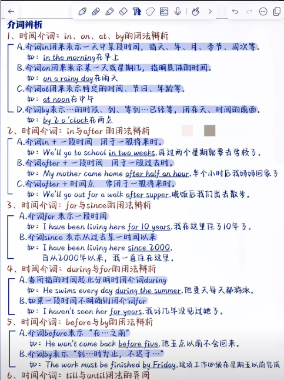
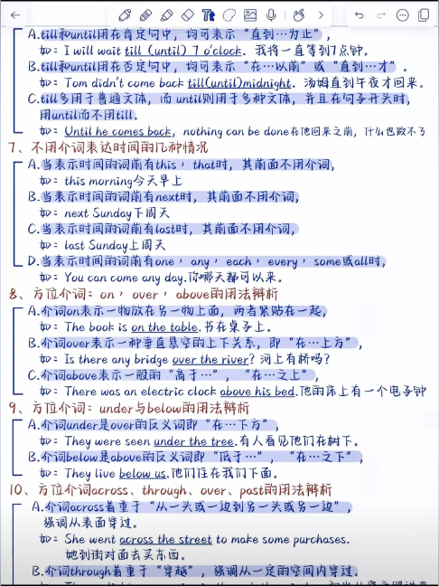
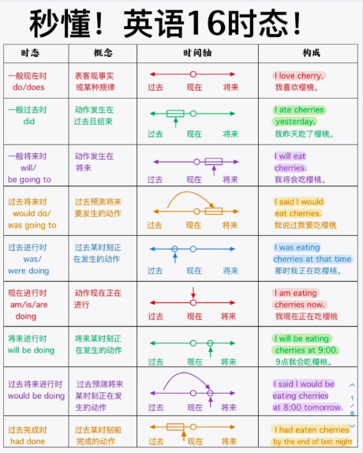
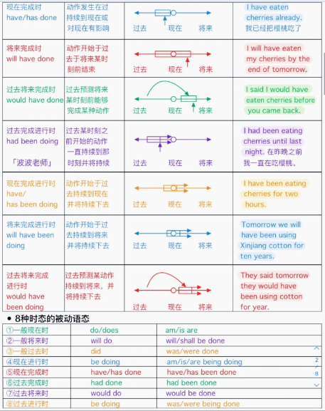
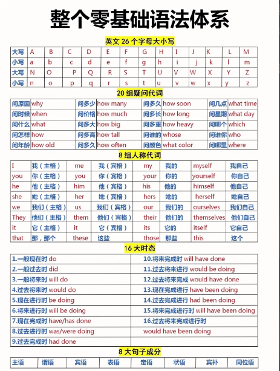
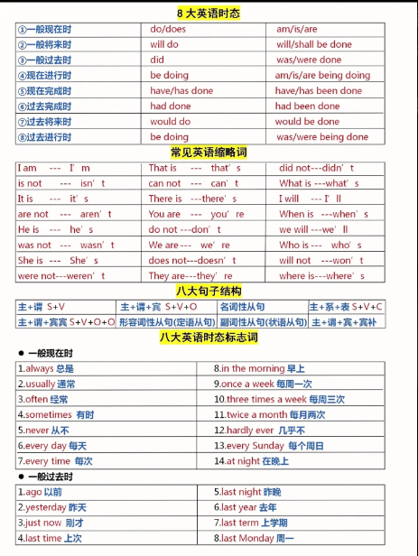
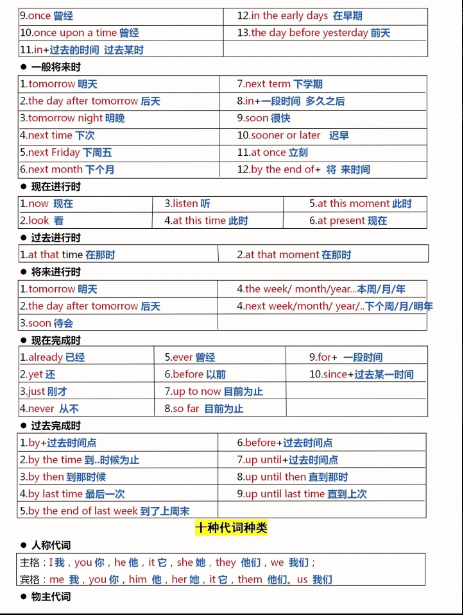
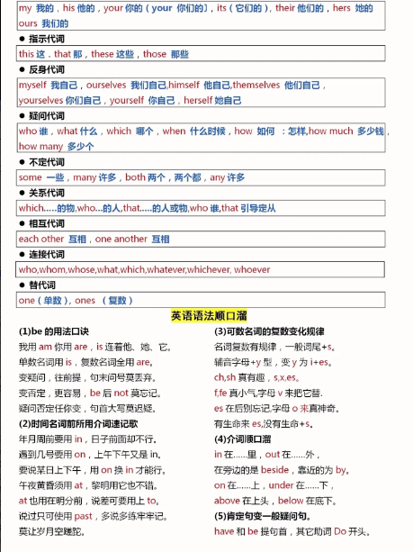
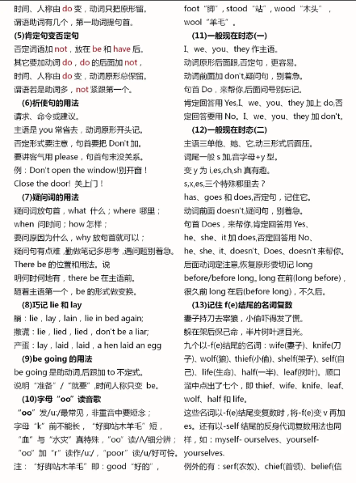
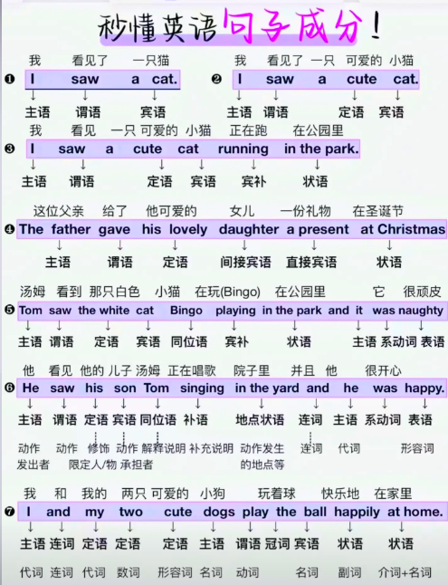

# 名词

## 名词分类

- 普通名词
    - 可数名词
        - 个体名词：表示作为个体而存在的人或事物：boy book week dream
        - 集体名词：表示若干个人和事物的总称：family committee police data
    - 不可数名词
        - 物质名词：表示物质、材料的总称：air sand
        - 抽象名词：表示性质、行为、状态、情感等抽象概念的名称：peace freedom  fun
- 专有名词

## 可数名词复数

### 规则变化

- 一般情况，词尾加 -s，parent → parents
- 以 -s，-x，-ch，-sh 结尾，加 -es，glass → glasses
    - 特例：词尾 -ch 发音为 / ｋ /，加 -s，stomach → stomachs
- 以辅音字母加 -y 结尾，把 -y 变 -i 加 -es，factory → factories
- 以辅音字母加 -o 结尾，加 -es，potato → potatoes
    - 特例：一些外来词、缩写、科学词汇，直接加 -s，piano → pianos，photo → photos
- 以 -f，-fe 结尾，把 -f，-fe 变 -v 再加 -es，wolf → wolves，knife → knives
    - 特例：某些以 -f 结尾，直接加 -s 的名词：roof 屋顶，chief 首领，belief 信仰，proof 证据，chef 厨师。

### 不规则变化

- 改变内部元音

    - man → men 男人
    - woman → women 女人
    - foot → feet 脚
    - tooth → teeth 牙齿
    - goose → geese 鹅
    - mouse → mice 老鼠（注意此处 s 变 c）

- 单复数同形

    - sheep 绵羊
    - deer 鹿
    - Chinese 中国人
    - Japanese 日本人
    - Swiss 瑞士人
    - means 方法
    - crossroads 十字路口
    - series 一系列
    - species 种类
    - works 工厂
    - head 头（牲畜数量）

- 同一名词，不同意义

    - work 

      a work by Mark 一部马克的作品  
      two works by Mark 两部马克的作品  
      a chemical works 一家化工厂  
      two chemical works 两家化工厂

    - fish

      two fish 两条鱼  
      two fishes 两种鱼

    - people

      two people 两个人  
      two peoples 两个民族

### 由两部分构成的物体

trousers，shorts 等名词不能用基数词修饰，其前也不能直接加不定冠词 a/an，但可以用 a pair of，two pairs of，many 等词修饰。

I need a new pair of trousers for work. 我需要一条上班穿的裤子。

### 复合名词

- 没有连字符，最后一个名词变复数。  
  housewife → housewives 家庭主妇

- 组成复合名词的单词中没有名词，在最后加 -s。  
  grow-up → grow-ups 成年人

- 有连字符，将复合名词中主要的名词变复数。  
  passer-by → passers-by 路人  
  daughter-in-law → daughters-in-law 儿媳妇

- man，woman 为复合名词的第一部分时，复合名词的各个部分皆变为复数  
  a man cook → men cooks 男厨师  
  a woman teacher → women teachers

### 注意

- 某些表示学科的名词，虽然结尾以 -s 结尾，但并非复数形式。作主语时，谓语动词要用单数形式。如 maths 数学，physics 物理学，economics 经济学。  
  Physics is difficult for me. 对于我来说物理很难。

- 单复数同形的名词在使用时要注意其谓语动词的单复数形式变化。  
  Every means has been tried. 每种方法都试过了。  
  All means have been tried. 所有方法都试过了。

- 表示“某国人”的名词变复数的三种形式
    - “中日瑞不变”
    - 词尾的 -man 变 -men，如 Frenchman → Frenchmen；但“德国人（German → Germans）”除外。
    - 词尾直接加 -s，如 American → Americans。

## 不可数名词

### 雷打不动的不可数名词

某些不可数名词，即使前面有形容词修饰，也不能使用定冠词 a/an。

news 新闻，information 信息，work 工作，advice 建议，progress 进步，weather 天气，fun 乐趣，equipment 设备，jewellery 珠宝，luck 运气，music，health 健康，furniture 家具 

We have so much bad luck. 我们有太多的厄运。  
I have good news to tell you. 我有好消息告诉你。  
He made such rapid progress. 他进步如此快。

### 同词不同义

某些不可数名词转可数名词后，意义发生变化。

glass 玻璃——a glass 一个玻璃杯  
paper 纸——a paper 一份论文/报纸/试卷

### 抽象名词具体化  

honour 尊重——an honour 一件荣幸的事  
pleasure 愉快——a pleasuer 一件乐事  
success 成功——a success 一个成功的人或事

I feel it a great honour to stand here to deliver a speech.  
站在这里演讲我感到非常荣幸。

Being able to afford a drink would be a comfort in tough times.  
在困难时期能买得起已被饮料是一件令人感到欣慰的事。

## 名词所有格

名词的所有格（Possessive form）用于表示某物或某人属于谁。

### 词尾加 -'s

|  情况  |  规则  | 示例 |
| :---: | :---: | :---:|
| 一般单数名词 | 加 `'s` | today's newspaper 今天的报纸 |
| 以 -s 结尾的单数名词或专有名词 | 加 `'` 或 `'s` | the boss'(s) order 老板的命令 Dicken‘（s) novels 狄更斯的小说 |
| 不以 -s 或 -es 结尾的复数名词 | 加 `'s` | women’s clothes 女装 |
| 以 -s 或 -es 结尾的复数名词 | 只加 `'` | two hours' walk 步行两小时的路程 |
| 复合名词 | 在最后一个词的词尾加 `'s` | his son-in-law's car 他女婿的轿车 |

### of + 名词

|  用法  |  示例  |
| :---: | :---: |
| 用于无生命的东西 | the top of the hill 山顶 |
| 表示“有关，关于” | a story of love and hartred 一个关于爱与恨的故事 |
| 表示同位关系 | the city of Pisa 比萨市 |
| 表示部分与整体关系 |  the majority of people 大多数人 |
| 表示抽象概念 |  the cost of living 生活费 |

### 双重所有格

双重所有格（Double possessive）是指在同一句话中同时使用 "of" 和 "possessive 's"，用于表示某人/某物是某个更大范围的一部分。

Some friends **of my brother's** will join us.  
我哥哥的一些朋友将加入我们。

## 名词的句法功能

名词（短语）在句子中可以作主语、宾语、补足语、表语、同位语、状语、定语等。

- 作主语  
  Honesty is the best policy. 诚信为本。

- 作宾语  
  Teenagers today are facing lots of pressure. 现在的青少年面临很多压力。

- 作补足语  
  We're sparing no effort to make our country a developed country.  
  我们正不遗余力地使我们的国家成为一个发达国家。

- 作表语  
  Water shortages are still the biggest problem in western China.  
  用水短缺依然是中国西部最大的问题。

- 作同位语  
  There is no cure for influenza, a common disease.  
  流行感冒是一种常见的疾病，无特效药。

- 作状语  
  Come this way! 到这来！

- 作定语  
  In the south of China, there are many banana trees.  
  在中国南方有很多香蕉树。

# 代词

代词可分为人称代词、
物主代词、反身代词、指示代词、不定代词、疑问代词、连接代词、关系代词等。

|       | 主格  | 宾格  |  反身代词  | 名词性物主代词 | 形容词性物主代词 |
| :---: | :---: | :---: | :--------: | :------------: | :--------------: |
|  谁   |  who  | whom  |     -      |       -        |      whose       |
|  我   |   I   |  me   |   myself   |      mine      |        my        |
|  你   |  you  |  you  |  yourself  |     yours      |       your       |
|  他   |  he   |  him  |  himself   |      his       |       his        |
|  她   |  she  |  her  |  herself   |      hers      |       her        |
|  它   |  it   |  it   |   itself   |      its       |       its        |
| 我们  |  we   |  us   | ourselves  |      ours      |       our        |
| Ta 们 | they  | them  | themselves |     theirs     |      their       |
|  这   | this  | this  |     -      |       -        |       this       |
|  那   | that  | that  |     -      |       -        |       that       |
| 这些  | these | these |     -      |       -        |      these       |
| 那些  | those | those |     -      |       -        |      those       |

在口语中，可以使用 who 代替 whom 作为宾语。

## 人称代词

**人称代词**用来代替人或事物的名字，避免重复使用名词。它有人称、单复数和主宾格的变化。

<table style="text-align: center;">
  <tr>
    <th rowspan="2">人称</th>
    <th colspan="2">单数</th>
    <th colspan="2">复数</th>
  </tr>
  <tr>
    <th>主格</th>
    <th>宾格</th>
    <th>主格</th>
    <th>宾格</th>
  </tr>
  <tr>
    <td>第一人称</td>
    <td>I</td>
    <td>me</td>
    <td>we</td>
    <td>us</td>
  </tr>
  <tr>
    <td>第二人称</td>
    <td>you</td>
    <td>you</td>
    <td>you</td>
    <td>you</td>
  </tr>
  <tr>
    <td rowspan="3">第三人称</td>
    <td>he</td>
    <td>him</td>
    <td rowspan="3">they</td>
    <td rowspan="3">them</td>
  </tr>
  <tr>
    <td>she</td>
    <td>her</td>
  </tr>
  <tr>
    <td>it</td>
    <td>it</td>
  </tr>
</table>

### 人称代词的句法功能

- **一般用法**

    作主语时用主格  
    作宾语时用宾格  
    作表语时一般用宾格

- 在电话中交谈时常用主格形式代替宾格形式。

    —Is that Mr. Li?  
    —Yes, this is he.

- 在 It is...who... 强调句型中，用主格代替宾格

    It was **I** who did it.

### 人称代词的排序

- 单数场合：you + he/she + I

    You, he and I are of the same age.  
    你、他和我是同龄人。

- 复数的场合：we + you + they

    We, you and they are all Chinese.  
    我们、你们和他们都是中国人。

- 两性并列：he + she

    He and she don't agree with me.  
    他和她都不同意我的看法。

- 表示承担责任：把第一人称放在第一位

    I and he are to blame for the accident.  
    我和他应为这起事故承担责任

## 物主代词

物主代词表示人和物的从属关系。

<table style="text-align: center;">
  <tr>
    <th rowspan="2">人称</th>
    <th colspan="5">单数</th>
    <th colspan="3">复数</th>
  </tr>
  <tr>
    <th>我的</th>
    <th>你的</th>
    <th>他的</th>
    <th>她的</th>
    <th>它的</th>
    <th>我们的</th>
    <th>你们的</th>
    <th>他/她/它们的</th>
  </tr>
  <tr>
    <td>形容词性物主代词</td>
    <td>my</td>
    <td>your</td>
    <td>his</td>
    <td>her</td>
    <td>its</td>
    <td>our</td>
    <td>your</td>
    <td>their</td>
  </tr>
  <tr>
    <td>名词性物主代词</td>
    <td>mine</td>
    <td>yours</td>
    <td>his</td>
    <td>hers</td>
    <td>its</td>
    <td>ours</td>
    <td>yours</td>
    <td>theirs</td>
  </tr>
</table>

### 形容词性物主代词

- **形容词性物主代词置于名词之前，作定语。**

    In the winter of 1891, a certain college had some trouble with **its** boy students.  
    在1891年冬季，某所大学的男学生遇到了一些麻烦。

### 名词性物主代词

- **名词性物主代词相当于“形容词性物主代词 + 名词”，作主语、表语和宾语。**

    This apple is hers (=her apple).  
    这个苹果是她的。

- **“of + 名词性物主代词” 可用作定语**

    I am an admirer **of yours**.  
    我是你的一名崇拜者。

## 反身代词

反身代词用于指代主语，表示“...自己”。可作宾语、表语和同位语，一般不用作主语。

<table style="text-align: center;">
  <thead>
    <tr>
      <th></th>
      <th>单数</th>
      <th>复数</th>
    </tr>
  </thead>
  <tbody>
    <tr>
      <td>第一人称</td>
      <td>myself</td>
      <td>ourselves</td>
    </tr>
    <tr>
      <td>第二人称</td>
      <td>yourself</td>
      <td>yourselves</td>
    </tr>
    <tr>
      <td>第三人称</td>
      <td>himself, herself, itself</td>
      <td>themselves</td>
    </tr>
  </tbody>
</table>

- **作宾语**

    Let me introduce myself.  
    让我来介绍一下我自己。

- **作同位语**

    The teacher himself gave her the certificate.  
    老师亲自给她颁发证书。

## 指示代词

用来指示或标记人或事物的代词，表示“这个/些”“那个/些”。

<table border="1" cellpadding="8" cellspacing="0">
  <thead>
    <tr>
      <th></th>
      <th>单数</th>
      <th>复数</th>
    </tr>
  </thead>
  <tbody>
    <tr>
      <td>这（近）</td>
      <td>this</td>
      <td>these</td>
    </tr>
    <tr>
      <td>那（远）</td>
      <td>that</td>
      <td>those</td>
    </tr>
  </tbody>
</table>
此外还有几个特殊的指示代词：such，same，either，neither，one，ones

### 指示代词句法

可用作主语、宾语、定语和表语。

### 指示代词用法

- **this 和 these 指代时间或空间上较近的人或物；that 和 those 指代时间或空间上较远的人或物。**

    This picture was painted by Robert and that one by Bruse.  
    这幅画是罗伯特画的，那幅是布鲁斯画的。

- **that 和 those 常用来指代上文已提到的名词，以避免重复。**

    The climate of China is quite similar to that of the USA.  
    中国的气候和美国的气候很相似。

- **打电话时，this 指自己，that 指别人。**

- **将要发生或将要提到的事用 this；刚提到过或已经发生的事用 that。**

    This is going to surprise you.  
    这件事会让你吃惊的。

    Little George broke the vase, but he didn't admit. That was very annoying.  
    小乔治打碎了花瓶，但他不承认。那太令人生气了。

- **this 和 that 还可以用作副词，表示程度，相当于 so。**

    The weather isn't that hot.  
    天气没那么热。

### such

such 作为指示代词，表示“这样的人或物”。

- **作主语：**谓语动词的单复数取决于后面所指代的名词。

    Such are the results. 结果就是这样。

- **作限定词**

    such a man 这样的一个人  
    any such mistake 任何这样的错误  
    There is no such thing. 没有这样的事。

- **特殊用法：**表示“也...”

    You have been there. So do I. 你去过那，我也是。

## 相互代词

**相互代词**用于表示“彼此之间”的动作或关系，只有两个：each other 和 one another，意思是“互相；彼此”。现代英语中这两个词可以互换。

- **作宾语**

    influence **each other**

- **加 -'s 作定语**

    They looked at **each other's** eyes.  
    他们看着彼此的眼睛。

## 疑问代词

**标准疑问代词：**

| 疑问代词 | 询问内容 | 用法示例 |
| :----: | :----: | :-----: |
| who | 人（主语） | Who is knocking at the door?（谁在敲门？） |
| whom | 人（宾语） | Whom did you see?（你看到谁了？）👉 口语中常用 who 替代 |
| whose | 所属关系  | Whose bag is this?（这是谁的包？） |
| what  | 事物、情况 | What is this?（这是什么？） |
| which | 限定范围内的选择 | Which is your car?（哪一辆是你的车？） |

**特殊疑问代词：**

| 疑问形式 | 示例句子 |
| :----: | :-----: |
| Whoever   | Whoever said that was wrong.（无论是谁说的，那都是错的。） |
| Whomever  | I'll hire whomever you recommend.（我会雇你推荐的任何人。） |
| Whatever | Take whatever you need.（拿你需要的任何东西。） |
| Whichever | Choose whichever you like.（选你喜欢的那个。） |

## 不定代词

不明确指代某个人、某个事物、某些人、 某些事物的代词叫不定代词。不定代词可以代替名词或形容词，表示不同的数量 概念。不定代词在句中可作主语、宾语、表语、 定语。

|  不定代词  | 基本用法  |
| -------- | -------- |
| all, both, each, neither, either, much, little, many, few, other, another, some, any, one | 可作主语、宾语、表语或定语 |
| everyone, everybody, everything, someone, somebody, something, anyone, anybody, anything, no one, nobody, nothing, none | 可作主语、宾语或表语 |
| every, no | 只能作定语  |

### no one、nothing 和 none

- no one = nobody，指代对象为人；nothing 指物；none 可指人或物。
- 一般使用 none 接 of 短语，而不是用 no one。
- none 一般强调数量，而 no one 强调有没有。

    —How many students are in the class?  
    —None.

    —Who is in the class?  
    —No one.

### every 和 each

- every 指三个或三个以上中的每个；只能用作定语。
- each 指两个或两个以上中的每个；可作主语、宾语、定语、同位语；作主语的同位语时，谓语动词和主语保持一致。

### other 和 another

- another 强调“再一个/些”

    I need another cup of coffee.  
    我需要再来一杯咖啡。

- other 强调“另外的”

    No matter what other people may say, I'll stick to my plan.  
    不管别人可能会说什么，我都会坚持我的计划。

- others = other + 名词复数

    In some countries, people eat with chopsticks, while in others, knives and forks.  
    在一些国家，人们用筷子吃饭，而在另外一些国家，人们用刀叉吃饭。

- the other：表示两者中的另外一个

    On one side of the river grow willows, and on the other side grow poplars.  
    河的一岸长着柳树，另一岸长着杨树。

### 三三两两

| 词义     | 指两个人或物          | 指三个或三个以上的人或物 |
| :------: | :-------------------: | :----------------------: |
| 每一个   | each (也可指两个以上) | every                    |
| 任何一个 | either                | any                      |
| 另一个   | the other             | another                  |
| 都       | both                  | all                      |
| 都不     | neither               | none                     |

# 形容词

形容词（Adjective，简写 **adj.**）表示人或事物的性质、状态和特征等，主要用来修饰名词和代词。

## 形容词句法

形容词在句中可以充当定语、表语、状语、主语或补语等。

形容词最重要的作用就是作定语修饰名词：

- It is a good experience. （作定语，修饰名词）

**后置定语**：

- **形容词修饰不定代词（如 something）时要求后置**

    **Something** wrong happened. 出了点问题。

- **由前缀 a- 构成的形容词（如 asleep）作定语时要求后置**

    a baby **asleep** in the crib 在婴儿床里睡着的宝宝

## 比较级和最高级的构成

### 规则变化

|   构成   |   原级   |  比较级  |  最高级  |
| :-----: | :------: | :-----: | :-----: |
| 普通单音节词，在词尾加 -er，-est | strong | stronger | strongest |
| 以字母 e 结尾的单音节词，只在词尾加 -r，-st | late | later | latest |
| 以一个辅音字母结尾的闭音节单音节词，双写辅音字母后再加 -er，-est | hot | hotter | hottest |
| 以“辅音字母 + y”结尾的单词，把 y 变 i ，再加 -er，-est | happy | happier | happiest |
| 其他双音节词和多音节词，在词前加 more 和 most | enthusiastic | more enthusiastic | most enthusiastic |

- 有少数几个双音节词以及以 -er 及 -le 结尾的词，可以有两种比较级和最高级形式。

    common → commoner / more common → commonest / most common  
    clever → cleverer / more clever → cleverest / most clever  
    simple → simpler / more simple → simplest / most simple

- 有些复合形容词有两种比较级和最高级形式。

    well-known → bette-known / more well-known → best-known / most well-known

### 不规则变化

|   原级   |  比较级  |  最高级  |
| :------: | :-----: | :-----: |
| good，well（健康的） | better | best |
| bad | worse | wost |
| little（少的） | less | least |
| many，much | more | most |
| far | farther / further | farthest / furthest |
| old | older / elder | oldest / eldest |

- far 的说明

    farther，farthest 表示**物理**意义上的远  
    further，furthest 表示**抽象**意义上的远

- old 的说明

    older，oldest 更常用于大多数情况，尤其是普通比较。  
    Elder 和 Eldest 多用于家庭中，表示“年纪较大的”兄弟姐妹或家庭成员。

## 比较级

比较级表示在两部分中程度较高者。

### 比较级基本用法

|    结构   |   意义   |
| :------: | :-----: |
| 比较级 + than | 比...更...|
| not + 比较级 + than | 不比...更...|
| no + 比较级 + than | 和...一样不...|

- **比较级 + than**：比...更...

    He made more mistakes than you (did).  
    他犯的错比你多。

- **not + 比较级 + than**：不比...更...

    My English is not better than yours.  
    我的英语不比你的英语更好。

- **no + 比较级 + than**：和...一样不...

    He is no taller than his brother.  
    他和他的哥哥一样不高。

- **比较级有时可单独使用，其比较的对象暗含于句中。**

    Are you feeling better today?（与原来相比）  
    你今天感觉好一些了么？

    Further discussion will be held tomorrow.（与现在相比）  
    进一步的讨论将于明天进行。

### 比较级的修饰语

比较级常用修饰语：rather，much，still，ever，far，any，a lot，a little，a great deal，by far，a bit

Tom works even harder than before.  
汤姆比以往工作更努力了。

### 比较级常见错误

- **修饰词出现错误**：more 不可修饰比较级，但可以用 much 来增强比较级，译为“...得多，更...”。

    She looks **much** younger than me.（不可使用 more）  
    她看上去比我年轻得多。

- **比较的对象出现错误**

    The weather of Beijing is colder than **that of** Shanghai.（不可去掉 that of）  
    北京的天气比上海的冷。

- **比较的范围出现错误**

    China is larger than any **other** country in Asia.（不可去掉 other）  
    中国比亚洲其他任何国家都大

### 比较级特殊用法

- **no more than = only**：仅仅，不超过

    The winner is no more than 10 years old.  
    这个获胜者年仅10岁。

- **The + 比较级 ... , the + 比较级 ...**：越...越...

    The more carefully you drive, the safer it is.  
    你开车越小心，就越安全。

    The more, the better.  
    越多越好。

- **more a + 名词 + than a + 名词**：更倾向...而不是...

    She is more a scientist than a teacher.  
    她更像一个科学家，而不是老师。
    

### 原级比较

原级比较并非严格意义的比较级，只是拿两者作一个对比，形容词用原级。

- **和...一样**：as...as...

    - 肯定形式：as...as...

        She is **as tall as** her brother. 她和她哥哥一样高。

    - 否定形式：not so...as...

        She is **not so tall as** her brother. 她不如她哥哥高。

- **与其说...不如说...**：not so much A as B

    He is **not so much a teacher as a friend**.  
    与其说他是老师，不如说是朋友。

- **A 之于 B，就如同 C 之于 D**：A is to B what C is to D

    A password **is to** a computer **what** a key **is to** a lock.  
    密码之于电脑，就如钥匙之于锁。

## 最高级

最高级表示在三者或三者以上中程度最高者。

### 最高级用法

- **最高级基本用法**

    **the 形容词最高级（+ 名词）+ 表示范围的短语或从句**

    This is the oldest theater in London.  
    这是伦敦最古老的剧院。

    Shanghai is one of the largest cities in China.  
    上海是中国最大的城市之一。

- **比较级形式表达最高级意义**

    **比较级 + than + 整体中的其它**

    Rose is taller than any other girl in her class.  
    Rose is taller than (any of) the other girls in her class.  

- **“否定词 + 比较级”表示最高级**

    I have never heard a better voice than yours.  
    Your voice is the best voice that I have ever heard.  
    我从未听过比你的嗓音更好的。

### 最高级修饰语

**最高级常用修饰语**：序数词，much，by far，nearly，almost

The Yellow River is the second longest river in China.  
黄河是中国的第二长河。

Of the three girls, Betty is much the cleverest.  
这三个女孩中，贝蒂是最聪明的。

This is by far the best book that I've ever read.  
这是我迄今读过的最好的书。

## 形容词技巧

- -ing 形容词描述引起感觉的**事物**，常译为“令人...的”。

    The movie was **boring**.  
    这电影很无聊。（电影让人无聊）

- -ed 形容词描述人或动物对某件事的**感受**，是**被动状态**，常译为“感到...的”。

    I’m **bored**.  
    我很无聊。（我被无聊到了）

# 副词

副词（Adverb，简写 **adv.**）是指在句子中表示行为或状态特征的词；副词用来修饰动词、形容词、其他副词、数词、 介词短语乃至全句，表示时间、地点、程度、方式等概念。

## 副词用法

副词在句中可作状语、表语、定语、介词宾语和宾语补足语等。

副词最基本的作用就是作状语修饰形容词、动词和副词：

- That's a **very** tall building. （作状语，修饰形容词）
- He runs **fast**. （作状语，修饰动词）
- She writes **very** carefully. （作状语，修饰副词）

## 简单副词

here 这儿  
there 那  
quite / rather 相当  
now 现在  
then 那时

**某些副词和形容词形式相同**：

| 单词 | 形容词词义 | 副词词义 |
| :----: | :----: | :----: | 
|  fast  |  快的  |   快地  |
|  early |  早的  |   提早  |
| straight | 直的 |  径直地 |
|  hard  |  硬的  |  努力地 |
|  late  |  晚的  |   晚   |
| enough | 足够的 |  足够地 |
|  long  |  长的  | 长时间地 |
|  very  | 正是的 |  非常  |

## 复合副词

somewhere 在某处  
somehow 不知怎么  
somewhat 有点  
therefore 因此  
nowhere 什么地方都不

## 派生副词

- **形容词 + ly**

    |          情况       |         构成       |        例词        |
    | :----------------: | :---------------: | :---------------: |
    |      一般形容词      |       加 -ly       |  quick → quickly  |
    |  以“辅音字母 + y”结尾 | 把 y 变 i，再加 -ly |   easy → easily   |
    | 以“辅音字母 + le”结尾 |     去 e 加 -y     |  simple → simply  |
    |  以“元音字母 + e”结尾 |     去 e 加 -ly    |    true → truly   |
    |     以 -ll 结尾     |       只加 -y       |   full → fully   |
    |     以 -ic 结尾     | 加 -ally | scientific → scientifically |

- **两种副词形式**

    | 形容词 | 副词（与形容词同形） | 副词（形容词 + -ly） |
    | :---: | :--------------: | :---------------: |
    | close 近的；亲密的 | clse 接近（距离）| closely 密切地 |
    | deep 深的 | deep 深深地 | deeply 至深；非常 |
    | high 高的 | high 在高处 | highly 高度地 |
    | free 自由的；免费的 | free 免费地 | freely 自由地 |
    | near 近的 | near 在附近；几乎；不久以后 | nearly 几乎；将近 |
    | hard 硬的 | hard 努力地 | hardly 几乎不 |

## 副词的比较级和最高级

- 副词的比较级和最高级的构成同形容词

# 介词

介词（Preposition，简写 **prep.**）表示词语之间的语义关系，不能单独作句子成分，必须与其他词一起使用构成介词短语。

## 

# 冠词

## 不定冠词

**不定冠词**（Indefinite Article）表泛指。

- a 用在辅音音素前
- an 用在元音音素前

### 不定冠词的用法

- **基本用法：**泛指一类人或物。
- **表式“一个”：**a book 一本书
- **表示“每一”：**five times a week 每周五次
- **表示“又一”：**I have three books,  and I want to buy a fourth one. 我有三本书，还想再买一本。
- **用在某些固定词组：**a lot of

## 定冠词

**定冠词**（Definite Article）表特指。

- **基本用法：**特指一类人或物。

    Do you know the woman standing under the tree?  
    你认识站在树下哪个女人么？

- **the + 形容词：**指代一类人或事物

    the young 年轻人  
    the unknown 未知的事物

- **the + 姓氏复数：**表全家人或夫妇俩

    The Whites are watching TV.  
    怀特一家人在看电影。

- 演奏西方乐器

    play the piano/violin/guitar

- 普通名词构成的专有名词

    the Summer Palace 颐和园  
    the Great Wall 长城  
    the Middle East 中东  
    the Yellow River 黄河

- 用在计量单位前

    by the pound/kilo/dozen/foot/hour  
    按磅/千克/打/英尺/小时

- **某些时间：**朝代、世纪、年代、中国节日、早中晚

## 零冠词

在不使用冠词的场景成为**零冠词**（Zero Article）。

- **某些时间：**年份、季节、月份、星期、日期、非中国节日
- 三餐、球类运动、交通工具、头衔、独立机构

- 注意某些词组有无冠词的区别：

    in hospital 住院  
    in the hospital 在医院里

# 数词

**数词**（Number，简写 **num.**）分为两大类：基数词和序数词。基数词表示数目，如 one，two，three；序数词表示顺序，如 first，second，third，序数词前一般要加定冠词 the。

## 倍数

|  倍数  | 英文表达 |
| :---: | :---: |
| 一倍 | once        |
| 两倍 | twice       |
| 三倍 | three times |
| 四倍 | four times  |
| …倍  | … times     |

- **倍数 + as + 原级 + as + 比较者**：最标准、清晰、常见，语法非常严谨

    His house is three times as large as mine.  
    他的房子是我的三倍大。

- **基数词 + 倍数 + 比较级 + than + 比较者**：更口语，有时略带“比…多三倍”的感觉（稍有歧义）

    His house is three times larger than mine.  
    他的房子是我的三倍大。

- **A is 倍数 + the size / length / height / number / amount of B**：强调具体**大小/长度/金额**等，用名词，表达更精准。

    His house is three times the size of mine.  
    他的房子是我的三倍大。

# 动词

在英语中，动词按语法特征分类，可分为：**实义动词**和**助动词**。

## 基本形态

**实义动词有5种基本形态**：

| 形态名称 | 以 do 为例 |  功能  |
| :----: | :-------: | :----: |
| 原形 | do | 用于一般现在时，情态动词后，动词不定式 |
| 单三 | does | 用于一般现在时第三人称单数 |
| 过去式 | did | 用于一般过去时 |
| 现在分词 | doing | 用于进行时，非谓语动词的 -ing 形式 |
| 过去分词 | done | 用于完成时，被动语态，非谓语动词的 -ed 形式 |

**示例**：

|  原形  |  单三 |  过去式 | 现在分词 | 过去分词 |
| :---: | :---: | :----: | :----: | :----: |
| do | does | did | doing | done |
| go | goes | went | going | gone |

### 动词单三

|  情况  |  规则  |  示例 |
| :---: | :---: | :---: |
| 一般情况 | 加 -s | walk → walks |
| 以字母 o，ch，sh，s，x 结尾 | 加 -es | watch → watches |
| 以辅音字母加 -y 结尾 | 把 y 变 i，再加 -es | fly → flies |
| 助动词 | - | am → is do → does have → has |
| 情态动词 | - | 情态动词没有单三 |

### 现在分词

|  情况  | 规则  |  示例  |
| :---: | :---: | :---: |
| 一般情况 | 加 -ing | walk → walking |
| 以字母 e 结尾 且 e 不发音 | 去掉 e，再加 -ing | dance → dancing |
| 以重读闭音节结尾 且末尾只有一个辅音字母的动词 | 双写辅音，再加 -ing |  run → running |

### 过去式和过去分词

英语中动词的过去式（Past Tense）和过去分词（Past Participle）变化大致可以分为两类：**规则动词**和**不规则动词**。

**规则变化**：

|  情况   | 规则  | 示例  |
| :---: | :---: | :---: |
| 一般情况 | 加 -ed | walk → walked  |
| 以字母 e 结尾 | 加 -d | dance → danced |
| 辅音字母加 y 结尾 | 把 y 变 i，再加 -ed  | cry → cried  |
| 以重读闭音节结尾 且末尾只有一个辅音字母的动词 | 双写辅音字母，再加 -ed | stop → stopped |

**不规则变化**：

<table style="text-align: center;">
  <tr>
    <th>类型</th>
    <th>原形</th>
    <th>过去式</th>
    <th>过去分词</th>
  </tr>
  <tr>
    <td>三态一样</td>
    <td>put</td>
    <td>put</td>
    <td>put</td>
  </tr>
  <tr>
    <td>过去式和过去分词相同</td>
    <td>have</td>
    <td>had</td>
    <td>had</td>
  </tr>
  <tr>
    <td>原形和过去分词相同</td>
    <td>come</td>
    <td>came</td>
    <td>come</td>
  </tr>
  <tr>
    <td rowspan="4">三态都不一样</td>
    <td>am/is</td>
    <td>was</td>
    <td rowspan="2">been</td>
  </tr>
  <tr>
    <td>are</td>
    <td>were</td>
  </tr>
  <tr>
    <td>do</td>
    <td>did</td>
    <td>done</td>
  </tr>
  <tr>
    <td>go</td>
    <td>went</td>
    <td>gone</td>
  </tr>
  <tr>
    <td rowspan="5">情态动词</td>
    <td>can</td>
    <td>could</td>
    <td rowspan="5">情态动词没有过去分词</td>
  </tr>
  <tr>
    <td>may</td>
    <td>might</td>
  </tr>
  <tr>
    <td>shall</td>
    <td>should</td>
  </tr>
  <tr>
    <td>will</td>
    <td>would</td>
  </tr>
  <tr>
    <td>must</td>
    <td>用 had to 表示</td>
  </tr>
</table>

## 时态

在英语中，句子的时态由动词的变化上表示。

|  时态  |  一般  | 进行  |  完成  | 完成进行 |
| :---: | :---: | :---: | :---: | :----: |
| 现在 | do/does | am/is/are doing | have/has done | have/has been doing |
| 过去 | did | was/were doing | had done | had been doing |
| 将来 | shall/will do | shall/will be working | will have done |will have been doing|
| 过去将来 | should/would do | would be doing | would have done | would have been doing |

### 一般现在时

一般现在时由**动词原形/单三**表示：**do/does**

当主语是第三人称单数时，动词应该变为单三形式，其它为动词原形。

- I **am** a student.

- They **are** Chinese.

- She **swims** every day.

一般现在时的用法：

- 表示经常性、习惯性的动作或存在的状态。常与 often，always，usually，sometimes，every day，occasionally，never，seldom，generally，rarely，once a week，at weekends，on Sundays 等连用。

    I leave home for school at 7 every morning.  
    我每天早上七点从家出发去学校。

- 表示现在的特征、能力、性格等。

    This job calls for great patience.  
    这份工作需要极大的耐心。

- 表示客观事实、普遍真理或格言等。

    Light travels faster than sound.  
    光比声音传播得快。

- 在时间状语从句、条件状语从句或让步状语从句中。

    Even if we achieve great success in our studies, we will not be conceited.  
    即使我们在学习上取得很大成功,我们也不会自大的。(让步状语从句）

- 用于描述固定安排、时刻表（如公共交通、日程等）

    The train arrives at 10:30.  
    火车十点半到达。

- 用于图片说明、电影说明、戏剧内容及场景解说等。

    Jack passes the ball to John and John catches it. He jumps and casts it into the basket.  
    杰克把球传给约翰。约翰接过球，跳起来把球投进篮筐里。

### 一般过去时

一般过去时由**动词过去式**表示：**did**

She went to school yesterday. 她昨天去学校了。

### 一般将来时

一般将来时由“**will/shall + 动词原形**”表示：**will/shall do**，助动词没有单三变化。

表示一般将来时的几个句型：

- **基本用法**：will/shall do

    The company will launch a new version of the software in July.  
    该公司将在七月份发行软件的新版本。

- **be going to do**

    They are going to hold a meeting to discuss our research project.  
    他们打算开个会来讨论我们的研究计划。

- **be doing** 有时可用来表示计划中即将要发生的事情，常与表将来的时间状语连用。

    We're leaving early tomorrow morning.  
    我们明天一早就出发。

    The train is arriving soon.  
    火车就要到了。

- **be about to do** 表示客观上马上要发生的事，一般与when连用

    I'm not about to stop when I'm so close to success.  
    成功离我如此近,我不打算停下来。

- **be to do sth.** 表示安排好或要求做的事

    She is to be married next month.  
    她定于下月结婚。

### 现在进行时

现在进行时由“**be 动词 + 现在分词**”表示：**be doing**；be 动词有单三变化。

She is singing now. 她正在唱歌。

**现在进行时的用法**：

- 表示现在正在进行的动作和发生的事，常与 now，at this moment，at present 等连用。

    I'm waiting to have a word with you.  
    我在等着和你说句话。

- 用来强调某个一直持续到现在的反复重复的动作，常与 always，constantly，continually，forever 等副词连用。

    Maria is always thinking of others instead of herself.  
    玛丽亚总为别人而不为自己着想。

### 现在完成时

现在完成时由“**have/has + 过去分词**”表示：**have/has done**，助动词有单三变化。

常与现在完成时连用的状语有 already，yet，recently，lately，never，ever，before，since then，ever since，for a long time，in the past/last few years，up to now，so far 等。

**现在完成时的用法：**

- 表示截止到现在，已经完成的动作或事情。

    I have finished all my homework so far.  
    到目前为止我已完成所有作业。

- 在“It is/has been+时间段+since从句”中，since 从句用一般过去时。

    It is/has been two years and a half since we began to study in our school.  
    我们在本校已经学习了两年半。

- 在“This/It is the first/second/...time+that从句”中，that 从句用现在完成时。

    It's the first time that the boy has spoken to a foreigner.  
    这是这个男孩第一次同外国人说话。

### 过去进行时

过去进行时的构成：**was/were doing** 表示。

- 表示过去某个时刻正在进行的动作和发生的事，常与 now，at this moment，at present 等连用。

    We were discussing the plan at this time yesterday.   
    昨天这时候我们正在讨论这个计划。

- 用来强调某个一直持续到过去某个时刻的反复重复的动作，常与 always，constantly，continually，forever 等副词连用。

    He was forever complaining about something.  
    他过去总是怨这怨那。

### 过去将来时

过去将来时的构成：**should/would + do**。

**过去将来时的用法：**

- 表示从过去某一时间看将要发生的动作或存在的状态。

    I asked if he would come and fix my TV set.  
    我问他是否能来安装我的电视机。

- 过去将来时的其它用法同一般将来时
    - 把 am/is/are 改成 was/were。
    - 把 shall/will 改成 should/would。

### 将来进行时

将来进行时的构成：**will/shall be doing**。

**将来进行时的用法：**

- 表示将来某时正在进行的动作。

    This time tomorrow we'll be sitting in the cinema and watching a film.  
    明天这个时候我们会坐在电影院看电影。

### 过去完成时

过去完成时的构成：**had done**。

**过去完成时的用法：**

- 表示截止到过去的某个时刻，已经完成的动作或事情。

    By the end of yesterday, we had received over 1,000 letters from all over the world.  
    到昨天为止，我们已经收到了来自世界各地的1,000多封信。

- **had hardly done...when...did...** 和 **no sooner had...done...than...did...**  表示“一……就……”；当 hardly 位于句首时，主句部分倒装。

    His sister had hardly heard the terrible news when she burst into tears.  
    Hardly had his sister heard the terrible news when she burst into tears.  
    他的妹妹一听到这个骇人听闻的消息就放声大哭起来。

- 在“That/It was the first/second/...time+that从句”中，that 从句用过去完成时。

    It was the first time that we had found common ground.  
    那是我们头一回达成共识。

### 现在完成进行时

现在完成进行时的构成：**have/has been doing**。

**现在完成进行时的用法：**

- 表示从过去某时开始一直持续到现在的动作，这个动作现在仍在继续。

    It has been raining heavily all day.  
    大雨下了一整天。

## 语态

语态（Voice）是动词的一种形式，用以表示主语和谓语之间的关系，分为**主动语态**（Active Voice）和**被动语态**（Passive Voice）。主动语态表示主语是动作的发出者，被动语态表示主语是动作的承受者。

### 主动语态

主动语态由**动词原形**：**do/does**，动词有单三和时态变化。

主动形式表被动的几种情况：

- **某些动词 + 副词**，例如：wash，write，wear 等。

    This car drives smoothly. 这车开起来很平稳。

- **某些感官动词 + 形容词**，例如：look，smell，taste 等。

    The soup tastes delicious. 这汤很好喝。

- **某些动词 + doing = 某些动词 + to be + done**，例如：need，want，deserve，require，be worth 等。

    The car **needs washing** = The car **needs to be washed**.  
    这辆车需要被洗一洗。

### 被动语态

被动语态由 **be 动词 + 过去分词**表示：**be done**，be 动词有单三和时态变化。

- 一般来说，只有及物动词才有被动语态。助动词 be 有人称、数、时态的变化。

    |   -   |  现在  |  过去  |  将来 |
    | :---: | :---: | :---: | :---: |
    | 一般 | am/is/are done | was/were done | will/shall be done |
    | 进行 | am/is/are being done | was/were being done | - |
    | 完成 | have/has been done | had been done | - |

- 含有情态动词的被动语态结构：**情态动词 + be + 过去分词**。

    Eight hours per day for sleep must be guaranteed.  
    必须保证每天八小时的睡眠。

## 助动词

助动词在句子中起到辅助作用，通常帮助构成时态、语态、语气等。助动词没有实际含义，不可单独作谓语。

### 主要助动词

这些助动词帮助构成时态、语态或表达疑问句、否定句等。

#### be 动词

- 表示时态、语态、进行时态等

- 例如：**am**，**is**，**are**，**was**，**were**，**being**，**been**
- 用法：
    - **进行时态**：She **is** reading.（她在读书。）
    - **被动语态**：The book **was** read.（这本书被读。）

#### do 动词

- 表示疑问句、否定句、强调等

- 例如：**do**，**does**，**did**
- 用法：
    - **构成疑问句**：**Do** you like it?（你喜欢吗？）
    - **构成否定句**：I **do not** know him.（我不认识他。）
    - **构成强调句**：I **do** like it!（我真的喜欢它！）

#### have 动词

- 用于构成完成时态

- 例如：**have**，**has**，**had**，**having**
- 用法：
    - **现在完成时**：I **have** eaten.（我已经吃过了。）
    - **过去完成时**：She **had** finished her homework.（她已经做完作业。）

### 情态助动词

情态助动词（modal verb，简写 **modal.**）用于表达说话者的态度、情感或其他语气，一般接动词原形。

情态动词在形式上只有原形和过去式，没有单三、现在分词和过去分词。

例如：**can**（能），**could**（能），**will**（将），**would**（愿意），**may**（可能），**might**（可能），**must**（必须），**should**（应该），**shall**（应该）

#### can 和 could

- **意为“可以...”**

- **表示请求和允许**：could 更委婉，但回答时通常用 can。

- **表示能力**：could 是 can 的过去式。

    She can drive now, but she couldn't last year.

- **表示可能性**：can't 表推测，意思是“不可能”。

    He can't know my address because I've moved to another place.

#### may 和 might

- **意为“可以...”**

- **表示请求和允许**

- **表示可能性**

- **may 可表示祝愿**

    May you succeed!

- **may/might as well**：不妨，还是...的好

    You may as well stay here. 你还是呆在这的好。

#### will 和 would

- **意为“可以...”**
- **表示请求和建议**：用于第二人称疑问句中，would 更委婉。
- **表示意愿、决心、承诺**

#### shall 和 should

- **意为“应该...”**

- **表示命令、建议**：用于第一、三人称肯定句中。

    You shall pay for it.

- shall 用于第一、三人称疑问句中，表示征求意见。

    Shall we come in?

- should 可用在虚拟语气中。

#### must

- **意为“必须...”**：对于 must 的提问，否定回答用 needn't 或 don't have to，因为否定形式 musn't 表示禁止。
- **must 和 have to**
    - must 意为“必须”，侧重说话人的主观意志。
    - have to 意为“不得不”，侧重客观需要。
- **表示推测**：must 表示推测只用于肯定句中。

### 半助动词

在语法上类似情态动词，作实义动词接其它动词时常需要加上 "to"。

例如：**ought to**，**have to**，**need to**，**used to**，**dare to** 等

- **ought to**：You **ought to** be more careful.（你应该更加小心。）
- **have to**：I **have to** go now.（我现在必须走了。）

#### need

- **意为“需要...”**
- **作为情态动词**：常用于否定句和疑问句中
    - **否定句**：needn't do
    - **疑问句**：Need I do...?
    - 对于 need 引起的提问，肯定回答用 must，否定回答用 needn't。
- **作为实义动词**
    - **need sth.**：需要...
    - **need to do**：需要做...
    - **didn't need to do**：不需要做...
    - **need doing = need to be done**：需要被...

#### dare

- **意为“敢...”**
- **作情态动词**：常用于否定句和疑问句中
    - **否定句**：daren't do
    - **疑问句**：Dare he do...?
- **作为实义动词**
    - **dare to do**：敢做...
    - **didn't dare to do**：不敢做...

## 非谓语动词

**非谓语动词**也叫非限定动词（Non-Finite Verbs），指由动词变化而成，仍具有动词性质和原义，但不能作动词使用的词。非谓语动词不能单独作谓语。

动词的非谓语形式有**动词不定式**、**动词-ing 形式**和**动词-ed 形式**三类。动词的非谓语形式相当于名词、形容词或副词。动词的非谓语形式的功能如下：

|        | 作主语 | 作宾语 | 作表语 | 作定语 | 作状语 | 作补足语 |
| ------ | ----- | ---- | ----- | ----- | ----- | ------- |
| 不定式  | √      | √      | √      | √      | √      | √    |
| 动词 -ing 形式 | √    | √    | √    | √    | √    | √        |
| 动词 -ed 形式  | ×    | ×    | √    | √    | √      | √      |

三种非谓语动词的典型区别：

|   -   | done | doing | to do |
| :---: | :---: | :---: | :---: |
| 状态 | 已完成的 | 正在进行的 | 将要发生的 |
| 主/被动 | 被动 | 主动 | - |
| 作主语 | - | 泛指 | 具体动作 将来动作 |
| 作定语 | 形容事物 | 形容感受 | - |

### 动词不定式

#### 动词不定式

动词不定式由“**to + 动词原形**”表示：**to do**，在句中可作主语、宾语、表语、定语、状语和补足语。动词不定式同它的宾语或状语构成不定式短语。动词不定式的不同形式及意义如下表：

|       | 主动式 | 被动式 |  意义  |
| :---: | :---: | :---: | :---: |
| 一般式 | to do | to be done | 与谓语动词的动作同时或在其后发生 |
| 进行式 | to be doing  | —  | 与谓语动词的动作同时发生  |
| 完成式 | to have done | to have been done | 先于谓语动词的动作发生 |

#### 动词不定式的句法

- **作主语**：多数情况下用 it 代替不定式作形式主语，把不定式放在句子后保持结构平衡。

    To save time is to lengthen life.  
    节约时间就是延长生命。

    It is a great pleasure to talk with him.  
    与他谈话是一件很快乐的事。

- **作表语**

    The intention of this book is to introduce popular science.  
    这本书旨在介绍通俗科学。

- **作宾语：**动词不定式作宾语且后面有宾语补足语时，常用 it 作形式宾语，把真正的宾语即动词不定式放在后面。常用句型：consider/think/believe/feel/make/find it + adj./n. + to do sth.。

    We thought it better to start early.  
    我们认为早出发好些。

- **作宾语补足语**

    - **带 to 的不定式**：常见的词语有：ask，advise，allow，beg，cause，call on，enable，encourage，force，forbid，get，order，persuade，permit，require，teach，tell，want，warn，wish，wait for，expect等。

        The teacher advised students to speak English in English classes.  
        老师建议学生们在英语课上说英语。

        Parents shouldn't allow children to watch violent TV programmes.  
        父母不应该允许孩子收看含暴力内容的电视节目。

    - **不带 to 的不定式**：常见的词语有：“一感”（feel）；“二听”（hear，listen to）；“三使”（let，have，make）；“五看”（see，watch，notice，observe，look at）；“半帮助”（help）后的不定式作宾补时加不加 to 都可以。

        The boss made the workers work day and night.  
        老板迫使工人们日夜干活。(主动)

        The workers were made to work day and night by the boss.  
        工人们被老板逼着日夜干活。(被动)

- **作定语**

    - **被修饰的词被序数词、the only、the right 或最高级修饰且与不定式有主动关系。**

        Jim is the only one to win a medal in shooting.  
        吉姆是唯一赢得射击比赛奖牌的人。

    - **动词不定式和被修饰词构成被动关系。若不定式中的动词为不及物动词，其后应加介词。**

        The Browns have a comfortable house to live in.  
        布朗一家有一所住起来舒服的房子。

    - **decision，wish，chance，promise，plan，time，attempt，effort，right（权利），ability，patience 后用不定式作定语，说明名词的内容。**

        We made a plan to set up a club for car fans.  
        我们制订了一个为汽车迷组建俱乐部的计划。

- **作状语**

    - **作目的状语：**常用的结构有：to do，in order to do，so as to do，意为“为了做…”。

        She raised her voice so as to make herself heard.  
        为了让别人听见,她提高了嗓门儿。

    - **作结果状语：**常见结构有：

        so/such...as to do sth. 如此……以至于做某事  
        enough to do sth. 足够……能做某事  
        too...to do sth. 太……而不能做某事  
        only to do 不料，竟然

        We hurried to the station only to be told that the train had left.  
        我们急匆匆赶到车站,结果被告知火车已开走了。

    - **“be + 形容词 + 动词不定式”结构中动词不定式作状语。**常用的形容词有：glad，sad，happy，sorry，pleased，surprised，disappointed，delighted，shocked，ready，prepared，willing，quick，fit，lucky，easy，interesting，foolish。

        Her new friends were happy to explain things to her after class.  
        她的新朋友们很高兴在课后向她解释一些事情。

#### “疑问词 + 不定式”结构

“疑问词（when，where，how，what，which，who 等） + 不定式”结构在句中用作主语、表语、宾语。经常接“疑问词 + 不定式”作宾语的动词有：learn，ask，discuss，explain，know，remember，forget，understand，think，consider，wonder，show，tell，decide 等。

How to solve the problem remains to be discussed.(作主语)  
如何解决这个问题仍需要讨论。

My biggest headache is how to be polite in English.(作表语)  
我最头痛的问题是如何用英语礼貌地表达。

I'll show you how to install the software.(作宾语)  
我给你演示一下如何安装这套软件。

### 动词-ing 形式

动词-ing 形式，也称动名词，由动词的**现在分词**表示：**doing**，具有名词、形容词和副词特征。

|       | 主动式 | 被动式 |  意义  |
| :---: | :---: | :---: | :---: |
| 一般式 | doing       | being done       | 与谓语动词的动作同时发生 |
| 完成式 | having done | having been done | 先于谓语动词的动作发生   |

#### 动词-ing 形式的句法功能

动词-ing 形式在句中可作主语、宾语、表语、定语、状语和补足语。

- **作主语**

    - 作主语的一般用法

        Studying and doing homework seem much more fun when you are at sea.  
        当你在海上时,学习和做作业好像有趣多了。

    - 有时用 it 作形式主语，把动词-ing 短语置于句末。

        It is/was + a waste (of) + doing...  
        It is/was + no good/use + doing...  
        It is/was + worth + doing...

- **作宾语**

    - 动词宾语。动词-ing 形式常出现在下列词语后：

        admit，advise，allow，appreciate，avoid，forbid，cannot help，can't stand，consider,delay，deny，enjoy，escape，finish，give up，imagine，keep，mind，miss，practise，quit，risk，suggest

        He was considering taking the chair downstairs.  
        他正考虑把那把椅子搬到楼下。

    - 介词宾语。动词-ing 形式常出现在下列词语后：

        devote...to 把……献给  
        get down to 开始认真注意或对待  
        look forward to 期待  
        contribute to 为……做贡献  
        object to 反对  
        lead to 导致  
        pay attention to 注意  
        be addicted to 沉溺于  
        be/get/become used to 习惯于  
        be responsible for 对……负责  
        when it comes to 当涉及……时

        Mary is looking forward to going back to Xi'an.  
        玛丽正在盼望回西安。

    - 形容词宾语  

        “be worth + 动词-ing 形式”表示“值得……”  
        “be busy + 动词-ing 形式”表示“忙于……”。

        He's decided to get a look at the house and see if it was worth buying.  
        他决定去瞧瞧那座房子,看是否值得买下。

#### 动词-ing 形式的复合结构

当动词-ing 形式的逻辑主语与句子的主语不一致时，要在动词-ing 形式之前加上形容词性物主代词或名词所有格，这便构成了动词-ing 形式的复合结构。

Would you mind my/me using your dictionary?  
你介意我用一下你的词典吗?

We offered him our congratulations on his passing the exams.  
我们祝贺他通过了考试。

### 动词-ed 形式

动词-ed 形式由动词的**过去分词**表示：**done**，表示已经完成的或被动的动作，在句子中起形容词或副词的作用，作定语、表语、补足语和状语。

#### 动词-ed 形式的句法功能

##### 作定语

单个动词-ed 形式作定语时，常放在被修饰词的前面；动词-ed 短语作定语时，则一般放在被修饰词之后。

required courses 必修课

The question mentioned at the meeting has been solved.  
在会议上提到的问题已经被解决了。(被动)

## 主谓一致

**主谓一致**就是谓语动词的人称及单复数要根据主语确定，与主语保持一致。

**核心原则：**语法一致，意义一致，就近一致。

### 从量上判断

- **可数名词和不可数名词**

    - **可数名词单数或不可数名词作主语，谓语动词使用单数形式。**

        Percy has made great progress in Chinese.  
        珀西的汉语取得了很大进步。

    - **可数名词复数作主语，谓语动词使用复数形式。**

        The Greens are very fond of working on the farm.  
        格林一家非常喜欢在农场工作。

- **复合不定代词 everyone、everybody、everything、anyone、anybody、anything、someone、somebody、something、no one、nobody、nothing 等作主语时，谓语动词用单数。**

    If anyone sees Lisa, ask her to call me. 如果有人看到莉萨，请她给我打个电话。
    
    Nothing is impossible to a willing heart. 世上无难事，只怕有心人。
    
- **none，some，any，more，most，all 等代词作主语时，谓语动词的单复数由其指代的词的单复数决定。**

    All is right. 所有的都对。
    
    All are saved. 所有人都被救了。
    
- **each，every，each and every，one，another，(a) little，much，either，neither作主语或修饰语时，谓语动词用单数形式。**

    Each of us has a medal.  
    我们每个人都有一个奖章。

- **more than 的主谓一致**

    - **“more than one + 单数名词”或“many a + 单数名词”作主语，谓语动词用单数。**

        More than one student was injured in the accident.  
        不止一个学生在这次事故中受伤。

        Many a student was injured in the accident.  
        许多学生在事故中受伤。

    - **“more than two + 复数名词”作主语，谓语动词用复数。**

        More than two students were injured in the accident.  
        不止两个学生在这次事故中受伤。

### 其它

- **表示时间、距离、长度、金额、重量等的复数名词作主语时，常被看作整体，谓语动词用单数。**

    Twenty years is a long time.  
    二十年是一段很长的时间。

    A hundred miles is quite a long drive, isn't it?  
    一百英里是一段很长的车程，不是吗?

- **由 and 连接的多个主语之前被 every、each、many a、no 等词限定，谓语动词仍用单数形式。其中，后一个限定词可省略。**

    Each boy **and** (each) girl **has** an apple.  
    每个男孩和每个女孩都有一个苹果。

- **由 and 连接的两个单数名词表示同一个人、同一个物时，谓语动词用单数。**

    The scientist **and** professor **has** made a great contribution to the research.  
    这个科学家兼教授已经对这项研究作出了巨大的贡献。

- **不定式、动词-ing 形式和名词性从句作主语。**

    - **正常情况，谓语动词用单数。**

        Swimming in rivers in summer is a good sport.  
        夏天在河里游泳是一项很好的运动。

    - **如果主语为 and 连接的两个上述成分，谓语用复数。**
    
        Having enough sleep **and** doing ecercises **are** good for your health.  
        睡眠充足和做运动有益健康。

- **what 引导的主语从句作主语时，谓语动词的单复数取决于作表语的名词的单复数。**

    What we need is more money, but what they need are books.  
    我们需要的是更多的钱,但是他们需要的是书。

- **就近一致**

    - **由or、nor、either...or...、neither...nor...、not only...but also...、not...but... 等连接并列主语时，谓语动词常和离它最近的主语在人称和数上保持一致。**

        Marilyn or you are to blame for the fault.  
        要么 Marilyn 要么你应为这个过失负责。

    - **there be 句型中，主语是多个并列名词时，be 的形式与最邻近的主语保持一致。**

        There are three chairs, a desk and a computer in my new office.  
        在我的新办公室里有三把椅子、一张桌子和一台电脑。

- **如果主语后面带有 as well as、with、along with、together with、rather than、but、except、besides、including、in addition to 等加其他名词时，谓语动词的数要与前面的主语保持一致。**

    Pronunciation, as well as grammar and vocabulary, changes very quickly from one area to another.  
    发音与语法和词汇一样，因地区差异而变化很快。

- **定语从句中的谓语动词的单复数形式与先行词的单复数保持一致。**

    He is the only one of the students who **has** passed the maths exam.  
    他是唯一一个通过这次数学考试的学生。（先行词是 the only one）

    He is one of the students who **have** passed the maths exam.  
    他是通过这次数学考试的学生之一。（先行词是 students）

- **“the + 形容词”如果意义指一类人，谓语动词用复数。**

    The young are energetic.  
    年轻人有活力。

## 虚拟语气

英语中的虚拟语气（Subjunctive Mood）用于非真实条件句中，表达与现实相反、假设、愿望、建议、要求或必要性等情境。

|       -        |           从句谓语形式           |             主句谓语形式             |                             例句                             |
| :------------: | :------------------------------: | :----------------------------------: | :----------------------------------------------------------: |
| 与现在事实相反 |             did/were             |    would/should/could/might + do     | If I were you, I would seize the chance. 如果我是你，我就会抓住这个机会。 |
| 与过去事实相反 |             had done             | would/should/could/might + have done | If you had taken my advice, you wouldn't have failed. 如果你听了我的建议，你就不会失败。 |
| 与将来事实相反 | did/ should do/ were to do |    would/should/could/might + do     | If he shouldn't come tomorrow, we would put off the meeting. 如果他明天不来，我们就推迟这个会议。 |

### 表虚拟的句型

- **If only = How I wish：**表示“要是...该多好”

    How I wish I were a flying bird!  
    If only I were a flying bird!  
    我多希望我是一只会飞的鸟儿啊！

- **as if：**表示“好像...”

    She speaks English so fluently as if she **had stayed** in America **for a long time**.  
    她说英语如此流利，好像她在美国待过很长时间。 

    He learns English so hard as if he **would go** to the U.S.A.  
    他如此努力学习英语,好像他要去美国。

- **would rather + that 从句：**表示“宁愿...”

    I'd rather they didn't hear of the news.  
    我宁愿他们将来不会听到这个消息。

    I'd rather they hadn't heard of the news.  
    我宁愿他们没有听到这个消息。

- **It is time + that 从句：**表示“是...的时候了”

    It is time that you went/should go to school.  
    你们该去上学了。

- **如果不满足条件 + 虚拟语气：**表示“如果不是...我就不可能...”

    Without your help, we couldn't have finished the work ahead of time.  
    没有你的帮助，我们不可能提前完成这项工作。

- **表示否则本应该...**

    I was ill that day. Otherwise, I would have taken part in the sports meeting.  
    我那天病了。否则，我本应该参加运动会。

# 句法

## 语法体系

## 句子成分

- **形式主语**：**It** is hard to get early. (It 是形式主语)

## 句子类型

### 按用途分类

| 句子类型 |  功能  | 示例 | 翻译 |
| :-----: | :---: | :--------: | :----: |
| **陈述句** | 陈述事实、观点 | I like coffee. | 我喜欢咖啡。|
| **疑问句** | 提出问题 | Do you like coffee? | 你喜欢咖啡吗？|
| **祈使句** | 发出命令或请求 | Please sit down. | 请坐下。|
| **感叹句** | 表达强烈情感   | What a beautiful day it is! | 多么美好的一天啊 |

### 按结构分类

| 句子类型 | 构成特点 | 示例 | 翻译 |
|:--------:|:--------:|:----:|:--------:|
| **简单句** | 只有一个主句 | She is a teacher. | 她是一名老师。 |
| **并列句** | 简单句 + 连词 + 简单句 | I was tired, but I worked. | 我很累，但我还是工作了。 |
| **复合句** | 主句 + 从句 | I went out because it rained. | 我出去了，因为下雨了。 |
| **混合句** | 简单句 + 连词 + 复合句 | I went out, and she stayed home because she was sick. | 我出门了，而她因为生病留在家里。 |

### 祈使句

**祈使句**（Imperative Sentences）用来表示命令、请求、建议、邀请、警告或指示。

它的最大特点是：

- 主语通常省略（默认为“你” you）
- 动词开头，直接用原形动词（不加 to）

例句：

- Open the door.
- Be quite.
- Don’t be late.
- Never give up.
- Let me help you.
- Let’s go home.

## 基本句型

英语的简单句可以归纳为**五种基本句型**（即“五大句型”），这是大多数句子组成的基础骨架。

| 句型结构 | 英文术语 | 构成元素含义 | 示例 |
|:--------:|:--------:|:------------:|:----:|
| 主语 + 谓语 | S + V | 动作不涉及宾语 | He runs fast. 他跑得很快。 |
| 主语 + 谓语 + 宾语 | S + V + O | 动作作用于宾语 | I love you. 我爱你。 |
| 主语 + 谓语 + 间接宾语 + 直接宾语 | S + V + IO + DO | 表示“给某人某物”的结构 | He told me a story. 他给我讲了个故事。 |
| 主语 + 谓语 + 宾语 + 宾语补足语 | S + V + O + OC | 宾语补足语说明宾语的状态或结果 | We found him helpful. 我们发现他很有帮助。 |
| 主语 + 系动词 + 表语 | S + V + P (C) | 描述主语的状态或身份 | She is smart. 她很聪明。 |

## 省略句

英语中的**省略句**是指在不影响语义和语法完整性的前提下，**省略句子中某些可以从语境中推断出来的成分**，避免重复，使语言更加简洁、自然。

- **祈使句一般省略主语**

    Hope you enjoy it. = I hope you enjoy it.

- **省略不定式中的动词**

     You can go if you **want** (to go).

    I’d like to go, but I don’t **want to**.（= want to go）

    —Will you join in the game?  
    —I'd be **glad to**. (= glad to join)

- **并列结构中的谓语省略**

    She likes tea, and I (like tea) too.

- **比较句中的省略**

    He runs faster **than I**. (= than I do)

- 关于倒装句、定语从句和状语从句中的省略，详见相关章节。

## 倒装句

**倒装句**（Inversion）就是把句子的正常语序颠倒，比如把谓语动词放到主语前面。倒装句分为完全倒装和部分倒装。

### 部分倒装

**部分倒装**（Partial Inversion）就是把**助动词**、**情态动词**或 **be 动词**提前，其它部分保持原样。

- **部分倒装原则**
    - 把**助动词**、**情态动词**或 **be 动词**移至主语之前，谓语的其他部分仍保留在主语的后面。
    - 如果谓语部分无上述三种动词，则需借助 do、did、does 来“帮助”它构成倒装句。
    - 主从复合句中主句倒装，从句不倒装。

- **疑问句倒装**

    原句：You are happy.  
    疑问句：Are you happy?

- **否定副词位于句首**

    - **Not only...but also**：不仅...而且...

        **Not only do** sharing bicycles provide great convenience for people to travel, **but also** they can ease traffic pressure.  
        共享单车不仅给人们的出行提供很大的便利，而且可以缓解交通压力。

    - **No sooner...than...**；**Hardly/Scarecely...when...**：一...就...

        **No sooner had** he opened the door **than** a gust of wind blew the candle out.   
        **Scarcely/Hardly had** he opened the door **when** a gust of wind blew the candle out.  
        他一打开门，一阵强风就把蜡烛吹灭了。

    - **Not until...**：直到...才...

        Not until 1911 was the first kind of the vitamins identified.  
        直到1911年才发现了第一种维生素。

    - **其它否定副词**：Never，Seldom / Rarely

        Never have I seen such a beautiful view.  
        Seldom do we go out on weekdays.

- **Only + 状语，位于句首**

    Only by working hard can you succeed.

- **so / such 引导的倒装句**

    So beautiful was the sunset that we stopped to admire it.

- **条件句中省略 if 的倒装**

    Had I known, I would have helped. (= If I had known...)  
    Should you need help, let me know. (= If you should need...)

- **表示“也”的词，引导一句话与上文呼应**：so，neither，nor

    Football is very important to me, but **so** is our friendship.  
    足球对我很重要，但我们的友谊同样重要。 

    I hadn't been to Beijing before and **neither** had he.   
    我以前没去过北京，他也没去过。

### 完全倒装

- 表示“运动方向的副词”或“位置介词短语”位于句首，且谓语动词为 be、lie、stand、come、go、follow、run 等词；但如果主语是代词，则不必倒装。

     **Here** comes the bus.  
     **Here** he comes. (主语是代词，不必倒装。)
     **Out** rushed the children.  
     Now comes your turn.   
     On the top of the mountain stands a temple.  

- **其它**

     Seated in the front are the leaders of the school.  
     Sitting in the front are the leaders of the school.  
     Gone are the days when women were looked down upon.

## 强调句

英语中的**强调句**结构是为了突出句子中的某个成分，比如主语、谓语、宾语、状语等。

### 基本形式

- **It is/was + 被强调部分 + that/who 其他成分**：意为“就是...”
  
    - it 作为形式主语，没有单三变化，无论被强调的是单数还是复数。
    - is/was 有时态的变化。
    - 只有一般现在时和一般过去时。
    - 有肯定、否定和疑问形式。
    - 强调物时，只能用 that。
    
- **例句**

    It is I who/that am right. (陈述句，强调主语；强调主语时注意主谓一致。)  
    我是对的。

    It was not him whom/that we met at the school gate. (否定句，强调宾语)  
    我们在校门口遇到的人就是他。

    Was it in 1939 that the Second World War broke out? (一般疑问句，强调状语)  
    二战是在1939年爆发的么？

    Who was it that broke the window? (特殊疑问句，强调主语)  
    是谁把窗户打碎的？

- **强调句与定语从句的区分**：如果把句子中的 **It is/was** 和 **that/who**
    去掉，稍加调整语序，能还原成完整句子，并且句子意思依然完整，则为强调句。

    **强调句**：It was Tom who helped me.  
    **原句**：Tom helped me.

- **强调句表达时间**

    **not until...that...**：意为“直到...才...”  
    It was not until ten o'clock that he went to bed.  
    直到10点他才上床睡觉。

    It was nearly midnight when I got home.  
    我到家时快午夜了。

    It's twenty years since I met her.  
    我已经二十年没见她了。

    It may be many years before the situation improves.  
    这种状况或许要过很多年才能改善。

### 强调谓语

- **do + 动词原形**：意为“确实做了...”
    - do 有单三和时态的变化
    - 只有一般现在时和一般过去时
    - 只有肯定形式
- **例句**：First impressions really do count. 第一印象真的很重要。

# 并列句

由**并列连词**把两个或两个以上的简单句连在一起的句子叫**并列句**。

## 并列关系

表并列关系的连词：and，not only...，but also... 等

She dances well and he sings well.

她舞跳得好，他歌唱得好。

## 转折关系

表转折关系的连词：but，yet，while 等。

Honey is sweet, but the bee stings.  
蜂蜜是甜的，但蜜蜂会蜇人。

It's a small car, yet it's surprisingly spacious.  
这辆轿车小，然而宽敞得出奇。

He likes pop music while I am fond of classical music.  
他喜欢流行音乐，而我喜欢古典音乐。

## 因果关系

表因果关系的连词：far，so 等。

He didn't attend the meeting, for he was ill.  
他由于病了，没有参会。

It was still painful so I went to see a doctor.  
那地方还疼，因此我去看了医生。

## 选择关系

表选择关系的连词：or，either...or... 等。

Either you come to my house or I go to yours.  
或者你到我家来，或者我到你家去。

## when

when 可用作并列连词。

We were having a meeting when someone broke in.  
我们正在开会，这时突然有人闯进来。

# 定语从句

在主从复合句中作定语，修饰名词、代词等的从句叫定语从句，定语从句的作用相当于形容词。

I'll forever cherish the days when I studied abroad.  
我将永远珍视我在国外学习的日子。

## 先行词

被定语从句修饰的名词、代词等称为**先行词**，一般出现在定语从句之前。有时先行词是整个主句。

- **一个词作先行词**

    This is the **museum** which was built last year.  
    这就是去年建成的那个博物馆。

- **整个主句作先行词**

    **They sent my child to the school every morning**, which I considered a great help to me.  
    他们每天早晨送我的孩子去学校，我认为这对我是极大的帮助。

## 关系词

### 关系词

引导定语从句的词被称为**关系词**。

- **关系代词**

    who，whom，whose，that，which，as

- **关系副词**

    when，where，why

- **省略关系词**：在限制性定语从句中，以下情况可省略关系词。

    - **关系词在从句中作宾语时，可省略。**

        I know the girl (whom/that) you met yesterday.  

    - **当先行词是 the time、the day、the reason、the place、the way 时，关系词 when、why、where、that 等也可以省略。**

        This is the place (where) John works.

- **例句**：

    The boys **who/that** are playing football are from Class One.  
    正在踢足球的男孩们是一班的。

    I'll cherish the moment **when** I met Lisa.  
    我将珍视我和莉萨见面的时刻。

    Is there a shop around **where** we can get fruit?  
    附近有没有我们能买到水果的商店？

    We don't know the reason **why** they didn't attend the meeting.  
    我们不知道他们没有参会的原因。

### 关系代词 as 的用法

- 引导限制性定语从句时，主要用于 the same...as...，such...as...，so...as... 等结构，既可指人也可指物。

    We have found such materials as are used in their factory.  
    我们已经找到了他们工厂里用的那种材料。

- 引导非限制性定语从句，其先行词是整个主句时，常译成“正如，正像”。

    As everybody knows, Shakespeare is a famous writer.  
    正如每个人都知道的那样，莎士比亚是一位知名作家。

## 限制性定语从句

限制性定语从句起限定作用。

- 作用：限定前面的名词，说明是哪一个。
- 句子中不可缺少，否则意思就不完整或会改变。
- **没有逗号**隔开。
- 通常用 **that / who / which** 引导。
- 某些情况可省略关系词，详见关系词。

The girl **who is wearing a red dress** is my sister.

- 解释：说话时可能有很多女孩，但我说的是那个穿红裙子的女孩。
- “who is wearing a red dress” 是必要的信息，如果去掉，句子信息不完整。

## 非限制性定语从句

非限制性定语从句起补充说明作用。

- 作用：补充说明前面的名词。
- 去掉这部分，主句也能独立成句，意思不受影响。
- 用逗号隔开
- **不能用 that**，只能用 **which / who / whose** 等引导。
- 不能省略关系词。

My sister, **who is wearing a red dress**, is a teacher.

- 解释：我只有一个妹妹，她穿着红裙子（补充信息）。
- “who is wearing a red dress” 只是额外描述，不影响主句。即使去掉了，也不影响我的妹妹是一个老师。

# 状语从句

**状语从句**（Adverbial Clauses）是在句子中充当**状语**的从句，用来修饰主句中的**动词、形容词、副词或整个句子**，表示时间、原因、条件、目的、结果、让步、比较、方式等。

状语从句通常由**从属连词**引导，比如：when、because、if、although、as、so that 等。

- **状语从句中的省略**：当从句和主句的主语一致或者从句的主语是 it，可省略从句的**主语**和 **be 动词**

    She always sings while (**she is**) doing her work.  
    Unless (**the machine is**) repaired, the machine is of no use.  
    I prefer my milk a little sweetened whenever (**it is**) possible.

# 主语从句

**主语从句**（Subject Clause）是指一个完整的句子，作为主句的**主语**来使用。

主语从句的结构通常由“引导词 + 从句”构成，常见引导词有：that，whether，if，连接代词（who，what 等），连接副词（when，where 等）。

**注意**：

- 引导词不能省略。
- 注意主谓一致。

**结构**：

- 主语从句放在句首

    **What he said** is true. 他所说的是真的。

- 由 it 作形式主语，主语从句放在句尾

    It is a pity **that you didn't attend the lecture yesterday**.  真遗憾，你昨天没参加讲座。

# 表语从句

**表语从句**是指在**主系表结构**中，用一个从句来作**表语**，对主语进行说明或补充说明。

表语从句的结构如下：

> 主语 + 系动词 + 表语从句

其中最常用的系动词是 **be**（如 is、was、are、were），有时也用 become、seem、appear 等。

常见的引导词有：that，whether，连接代词（who，what 等），连接副词（when，where 等）。

**例句**：

The fact is that she didn’t call me.  
事实是她没有给我打电话。

# 宾语从句

**宾语从句**是指一个从句作为**宾语**，用来说明动词、介词或某些形容词所作用的内容。

宾语从句的结构如下：

> 主语 + 谓语动词 + 宾语从句

常见引导词有：that，whether/if，连接代词（who，what 等），连接副词（when，where 等）。

**例句**：

He said that he was tired.  
他说他累了。

## 宾语从句的注意事项

- **否定转移**：宾语从句表示否定含义时,常把否定转移至主句。

    I don't think that he is a good child.

# 同位语从句

**同位语从句**是指一个从句作为**同位语**，一般用于解释抽象名词，不能省略引导词。

简单理解，从句就可以充当前面的名词。

**区别于定语从句**：

- 定语从句：限定名词
- 同位语从句：解释名词

**例句**：

I heard the **news that she got the job.**

They are considering the **question how we should respond.**
