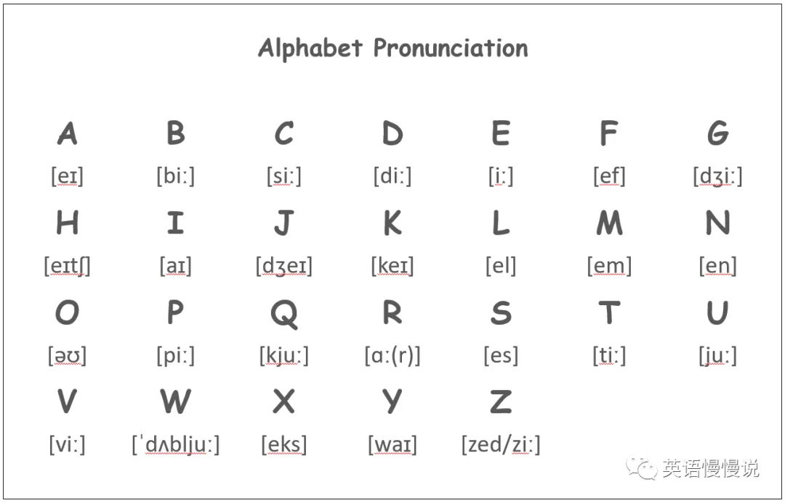

# Pronounce

由于自己学习的一直都是**英音**发音，所以会一直以英音为准。

## 国际音标

<table style="text-align: center;">
  <tr>
    <th>元辅音</th>
    <th>细分</th>
    <th>音标</th>
  </tr>
  <tr>
    <td rowspan="3">元音（20）</td>
    <td rowspan="2">单元音（12）</td>
    <td>长元音（5）</td>
    <td>/ɑ:/ /ɔ:/ /ə:/ /i:/ /u:/</td>
  </tr>
  <tr>
    <td>短元音（7）</td>
    <td>/ʌ/ /ɔ/ /ə/ /ɪ/ /ʊ/ /e/ /æ/</td>
  </tr>
  <tr>
    <td colspan="2">双元音（8）</td>
    <td>/aɪ/ /ɔɪ/ /eɪ/ /ɪə/ /eə/ /au/ /əu/ /uə/ </td>
  </tr>
  <tr>
    <td rowspan="5">辅音（28）</td>
    <td colspan="2">清辅音（11）</td>
    <td>/p/ /t/ /k/ /f/ /θ/ /s/ /ʃ/ /h/ /ts/ /tʃ/ /tr/</td>
  </tr>
  <tr>
    <td colspan="2">浊辅音</td>
    <td>/b/ /d/ /g/ /v/ /ð/ /z/ /ʒ/ /r/ /dz/ /dʒ/ /dr/</td>
  </tr>
  <tr>
    <td colspan="2">鼻音</td>
    <td>/m/ /n/ /ŋ/</td>
  </tr>
  <tr>
    <td colspan="2">半元音</td>
    <td>/j/ /w/</td>
  </tr>
  <tr>
    <td colspan="2">舌边音</td>
    <td>/l/</td>
  </tr>
</table>

## 字母

- **元音字母**：a  e  i  o  u，其余是辅音字母（y 是半元音）

    

## 发音矫正

- /θ/ 和 /s/ 

    - 咬舌 /θ/ 

- /ai/ 和 /e/ 和  /æ/：

    | 音素 |        发音        | 示例 |
    | :--: | :----------------: | :--: |
    | /ai/ | 由 /a/ 向 /i/ 滑动 | bike |
    | /e/  |        小口        | bed  |
    | /æ/  |        大口        | cat  |

- /ʊ/ 和 /u:/：

    - /ʊ/ ：介于 /u/  和 /ə/  之间，look 类似于“洛克”

- /a/ 和 /ʌ/：

- /z/：不是汉语拼音里的 'z'，类似于 /ð/ 但不咬舌

- **字母矫正**

    - N /en/ 

    - Z /zi:/ / /zed/

## 知识扫盲

- **音素**：最小发音单位
- **音节**：只有一个元音发音的音素组合
- **开闭音节**：一般音节中都有元音字母，音节的开闭是相对于元音而言的
    - **开音节**：结尾是元音字母的音节是开音节，其余是闭音节，即**元开辅闭**
    - 绝对开音节：单个发音的元音字母后面没有辅音字母的音节。no she ...
    - 相对开音节：单个元音字母后面有辅音字母（r 除外），再加一个不发音字母 e 构成的音节。name cake ...

# Phonics

自然拼读（Phonics），以下所有规律，以单音节为例

## 元音字母

- 单音节中，单独一个元音字母作为一个音素的常见发音

    | 单个元音字母 |   重读开音节   |  重读闭音节  |  重读 r 音节  | 重读 re 音节  |          非重读音节           |
    | :----------: | :------------: | :----------: | :-----------: | :-----------: | :---------------------------: |
    |      a       |  /eɪ/ cake  | /æ/ cat  | /a:/ bar  | /e/ bare  |          /ə/ ago          |
    |      e       |  /i:/ be   | /e/ beg  |  /ə/ her  | /ɪ/ here  |   /ə / ɪ/ the / banket    |
    |      i       | /aɪ/ bite  | /ɪ/ big  | /ə:/ bird | /aɪ/ fire | /ə / ɪ/ possible / animal |
    |      o       |  /oʊ/ no   | /a:/ hot | /ɔ:/ for  | /ɔ:/ bore |         /ə/ today         |
    |      u       | /ju:/ huge | /ʌ/ but  | /ə:/ fur  | /jʊ/ cure |         /ə/ upon          |
    |      y       | /aɪ/ byte  |   /ɪ/    |   /ə:/    |   /aɪ/    |         /ɪ/ happy         |

- a 特例

    - /ɪ/：orange
    - /ɔ/：wash

- o 特例

    - 开音节
        - /ʌ/ brother  
    - 闭音节
        - /ɔ/ column
        - /əʊ/ most  

## 元音组合

- 以下是常见重读音节中的元音字母组合发音规律

    |   元音组合   |          重读音节          |
    | :----------: | :------------------------: |
    | ai / ay / ey | /eɪ/ rain / bay / hey  |
    | ea / ee / ie | /i:/ sea / see / chief |
    |   oa / oe    |    /əʊ/ boat / toe     |
    |      oo      | /u:/ / /ʊ/ boot / look |
    |      ou      |        /aʊ/ out        |
    |   oi / oy    |   /ɔɪ/ choice / boy    |
    |   ue / ui    |   /u:/ blue / fruit    |

- 特例：key

## 辅音字母

- 辅音字母常见发音规律

    | 辅音字母 |   多数读音   |        少数读音         |
    | :------: | :----------: | :---------------------: |
    |    b     |              |                         |
    |    c     | /k/ cake | /s/ ci~ / ce~ / cy~ |
    |    d     |              |                         |
    |    f     |              |                         |
    |    g     |              |                         |
    |    h     |              |                         |
    |    j     |              |                         |
    |    k     |              |                         |
    |    l     |              |                         |
    |    m     |              |                         |
    |    n     |              |                         |
    |    p     |              |                         |
    |    q     |              |                         |
    |    r     |              |                         |
    |    s     |              |                         |
    |    t     |              |                         |
    |    v     |              |                         |
    |    w     |              |                         |
    |    x     |              |                         |
    |    z     |              |                         |

- 特例

## 其余组合

- 非元音字母组合常见发音规律

    |           非元音组合           | 发音  |
    | :----------------------------: | :---: |
    | i (开音节) / ie / igh / uy / y | /aɪ/  |
    |     o (闭音节) / all / oll     | /ɔ:l/ |
    |              tion              | /ʃn/  |

- 特例

# 语调规律

英语的抑扬顿挫，其实是由以下几个要素组成的：句子重音、语调升降和节奏。

## 句子重音

句子中重要的内容词（如名词、动词、形容词、副词）要重读。

I **bought** a **new** **car** **yesterday**.

## 语调升降

- 陈述句一般是**下降调**：I like it. ↘
- 一般疑问句是**上升调**：Do you like it? ↗
- 选择问句则是**先升后降**：Do you want **tea** ↗ or **coffee** ↘?

### 状语

It is **<ruby>on<rp>(</rp><rt>ˇ</rt><rp>)</rp></ruby>** the right. （位于句尾，地点状语中的**介词**上扬）

<ruby>He<rp>(</rp><rt>ˇ</rt><rp>)</rp></ruby> <ruby>always<rp>(</rp><rt>ˊ</rt><rp>)</rp></ruby> <ruby>shaves<rp>(</rp><rt>ˊ</rt><rp>)</rp></ruby> <ruby>in<rp>(</rp><rt>ˉ</rt><rp>)</rp></ruby> the morning. （位于句尾，时间状语中的介词和宾语**都不**上扬）

In the **<ruby>evening<rp>(</rp><rt>ˉˊ</rt><rp>)</rp></ruby>**, the <ruby>children<rp>(</rp><rt>ˊ</rt><rp>)</rp></ruby> <ruby>come<rp>(</rp><rt>ˊ</rt><rp>)</rp></ruby> <ruby>home<rp>(</rp><rt>ˊ</rt><rp>)</rp></ruby> <ruby>from<rp>(</rp><rt>ˉ</rt><rp>)</rp></ruby> <ruby>school<rp>(</rp><rt>ˉ</rt><rp>)</rp></ruby>. （位于句首，时间状语中的**宾语**上扬）

#### There be 中的状语

There is a bottle on the **<ruby>table<rp>(</rp><rt>ˉ</rt><rp>)</rp></ruby>**.

There is a bottle on the **<ruby>table<rp>(</rp><rt>ˇˊ</rt><rp>)</rp></ruby>**, **<ruby>too<rp>(</rp><rt>ˋ</rt><rp>)</rp></ruby>**.

There is a bottle in the **<ruby>middle<rp>(</rp><rt>ˊˉ</rt><rp>)</rp></ruby>** **<ruby>of<rp>(</rp><rt>ˇ</rt><rp>)</rp></ruby>** the room.

### 动宾短语

主语后的助动词、动词和宾语，往往都是上扬；但如果宾语直接在句尾时，宾语会下降。

<ruby>He<rp>(</rp><rt>ˊ</rt><rp>)</rp></ruby> **<ruby>arrives<rp>(</rp><rt>ˊ</rt><rp>)</rp></ruby>** **<ruby>home<rp>(</rp><rt>ˊ</rt><rp>)</rp></ruby>** late.

<ruby>She<rp>(</rp><rt>ˊ</rt><rp>)</rp></ruby> **<ruby>does<rp>(</rp><rt>ˇ</rt><rp>)</rp></ruby>** the **<ruby>housework<rp>(</rp><rt>ˉ</rt><rp>)</rp></ruby>**.

## 节奏

重读词之间的间隔大致相同，非重读词会变快或弱读。

I want to go.（变成 /I *wanna* go./）

# 口语发音

- 口语发音与单个单词发音的对比
    - 某些音会发生变化
    - 会有省略现象
    - 会有连读现象

## 变音

### /t/ →  /d/

- **/t/ 在两个元音之间：**

    **city:** /'sɪti/ → /'sɪdi/

    **water:** /'wɔ:tər/ → /'wɔ:dər/

- **/t/ 在 /l/ 之前：**

    **little:** /'lɪtl/ → /'lɪdl/

- **/t/ 在 /r/ 和元音之间：**

    **thirty:** /ti/ → /sɪdi/

- **to**

    /tu:/ → /də/

    **go to:** /gəu tu:/ → /gəudə/

- 

### 其它

- **want to**    /wa:ndə/

    /wa:nt tə/ → /wa:n~~t~~də/

- **they're**    /ðeə/

    /ðeɪr/ → /ðeə/

## 省略

### t

- t 后接辅音，则省略 t

    last week    /læs~~t~~ wi:k/ → /læs wi:k/

- ~t 后接 ed，则省略 t

    wanted to    /wa:n~~t~~ɪd tu:/ → /wa:nɪdə/

### h

- h 作为第一个字母

    Does he have a  /dʌz~~h~~i:~~h~~ævə/ → /dʌzi:ævə/

- **Excuse me**    /~~ɪk~~'skjuz me/

### 其它

- **for**    /fər/ → /fə/

- **It's a**    /~~ɪ~~ts ə/ → /tsə/

    It's about time    /~~ɪ~~ts ə'baʊ~~t~~ taɪm/ → /tsə 'baʊ taɪm/

## 连读

I have got a    /aɪvgɔdə/

did you    /dɪjə/

**give him a bottle**    /gɪvɪmə/ bottle

**should have been**    /ʃʊdəv/ been

## 其它

jumped out of    /dʒʌmtautəv/