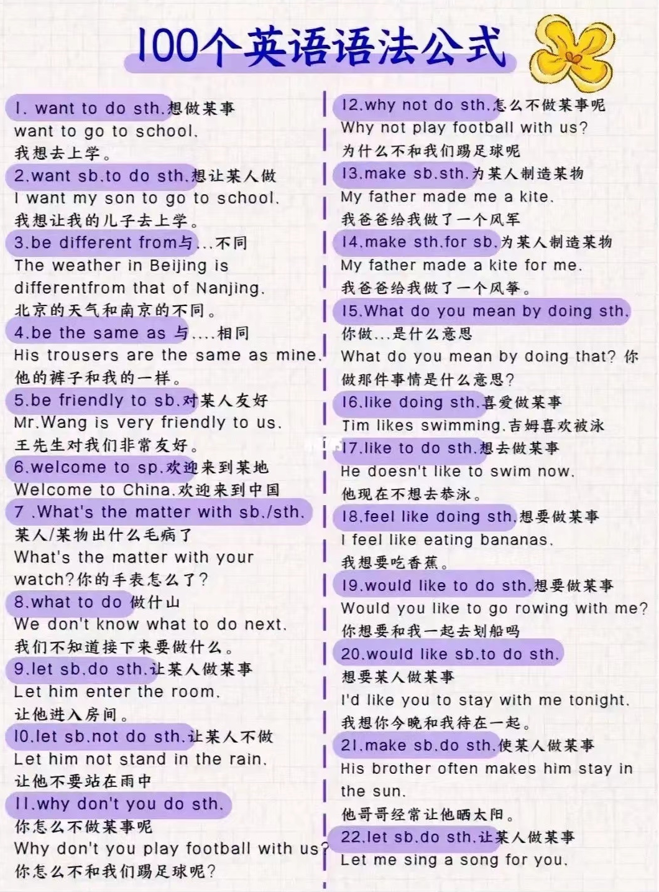
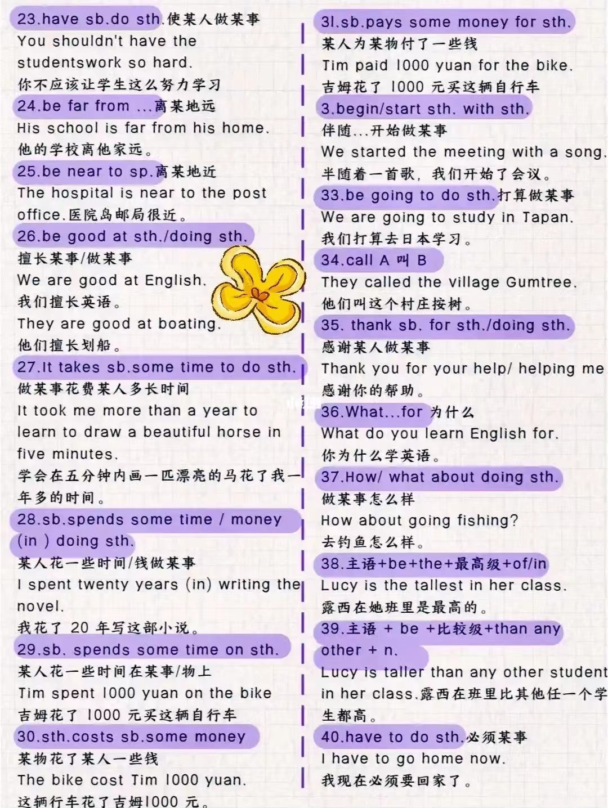
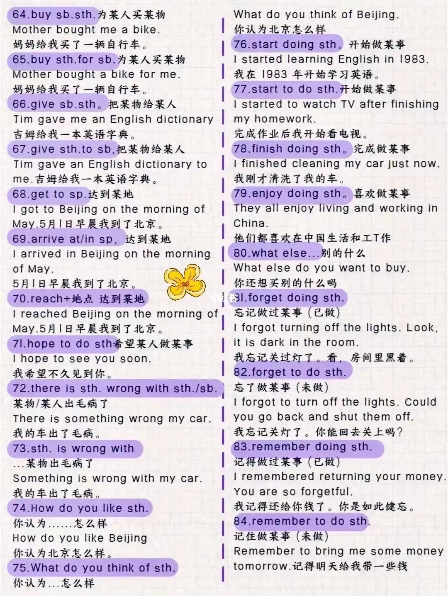
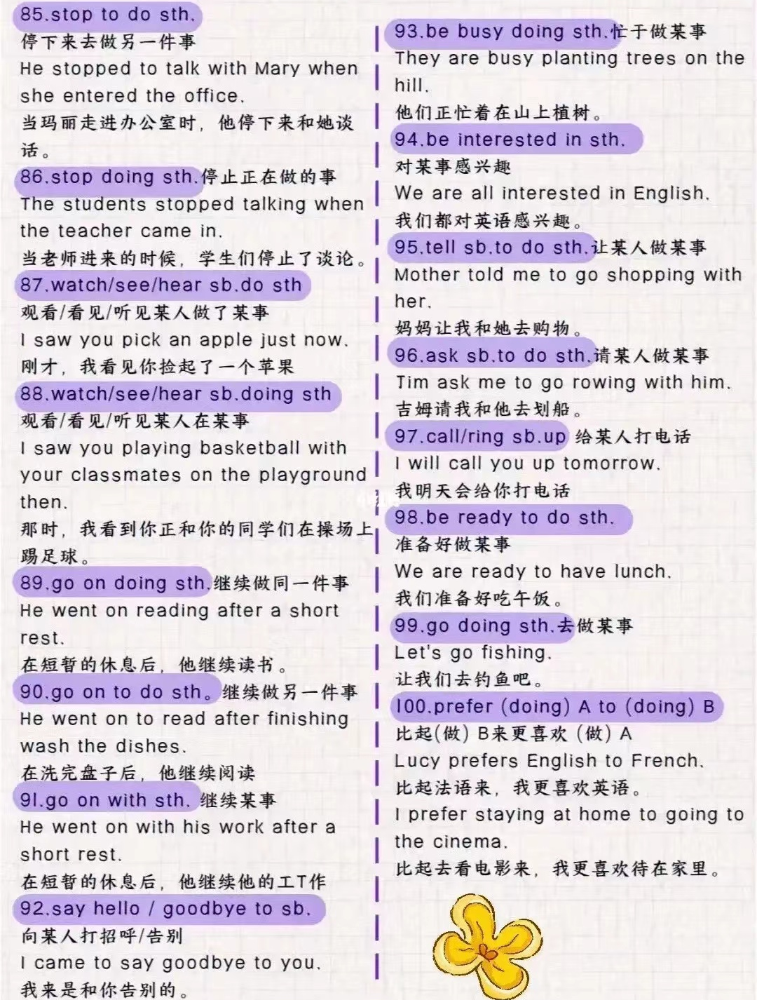

# 问候

## 问候

How are you?

How are you keeping?

How is it going?

## 回答

Very well.

# 时间

## 表达日期

| 写法 | 读法 | 中文 |
| :---: | :---: | :---: |
| the Tang Dynasty | the Tang Dynasty | 唐代 |
| the 21st century | the twenty-first century | 21世纪 |
| the 1990s/1990's | the nineteen nineties | 20世纪90年代 |
| 1999 | nineteen ninety-nine | 一九九九年 |
| 2000 | two thousand | 两千年 |
| 2024 | twenty twenty-four two thousand twenty-four | 二〇二四年|
| January 1st the 1st of January | January first the first of January | 1月1日 |

## 表达时刻

| 时间 | 英文 | 中文 |
| :---: | :---: | :---: |
| 1:00 | one o'clock 只能用于1到12 | 一点整 |
| 13:00 | one p.m. ~~thirteen o'clock~~ | 下午一点 |
| 2:15 | two fifteen / a quarter **past** two | 两点十五分 / 两点一刻 |
| 3:30 | three thirty / half past three | 三点半 |
| 4:45 | four forty-five / a quarter **to** five | 四点四十五 / 差一刻五点 |

## 时间点示例

关于表示时间介词和冠词的辨析，详见 **辨析 | 时间**

- in the Tang Dynasty 在唐朝
- in the 21st century 在21世纪
- in the 1990s/1990's 在20世纪90年代
- in 2025 在2025年
- in spring 在春季
- in January 在一月
- on May 1st 在5月1日
- on Monday 在星期一
- on Chrildren's Day 在儿童节
- on the Spring Festival 在春节
- in the morning/afternoon/evening 在早晨/下午/晚上
- on the morning of May 1st 在5月1日的早晨
- on Monday morning 在星期一的早晨
- at daybreak/noon/dusk/night/midnight 在黎明/中午/黄昏/夜里/午夜

## 上一个和下一个

| 时间单位 | 上上一个 | 上一个 | 这个 | 下一个 | 下下一个 |
| :---: | :---: | :---: | :---: | :---: | :---: |
| day | the day before yesterday | yesterday | today | tomorrow | the day after tomorrow |
| year month week | the year before last | last year | this year | next year | the year after next |
| morning evening | the morning before yesterday | yesterday morning | this morning = in the morning | tomorrow morning | the morning after tomorrow |
| night | the night before last | last night | tonight | tomorrow night | the night after tomorrow |

## 表示时态

- **进行**
    - now
    - at this time
    - at this moment
    - at present
- **过去**
    - in the past (two years) 在过去（两年时间里）
    - ever曾经
    - the other day 几天前
- **将来**
    - tomorrow 在明天
    - next year 在明年
    - in a year's time 一年以后
    - soon，at once 马上
    - in the furture 在将来
- **完成**
    - already 已经
    - up to now，so far 到目前为止
- **其它**
    - often，always，usually，regularly 经常
    - generally 一般说来
    - ever 曾经
    - never 从不
    - sometimes，occasionally 有时，偶尔
    - seldom，rarely 很少
    - every day 每天
    - on Sunday**s** 每逢星期日
    - once a week 每周一次
    - sooner or later 迟早
    - soon after 不久以后
    - afterward 在后来

## 问时间

- **问当前时间**

    ——What **time** is it now?  
    ——It's 10 o'clock.

    ——What **day** is it today?  
    ——It's Friday.

    ——What **date** is it today?  
    ——It's July 1st.

- **问什么时候**

    ——When did you watched TV?  
    ——An hour ago.

- **问频率**

    ——How often does she go to the library?  
    ——Once a week.

- **问多长时间**

    ——How long does it take to get to school?  
    ——It takes about 15 minutes.

## 花时间

- 关于“花费”的辨析详见 **辨析 | 花费**

- **spend**

    sb. spend 时间 on sth.  
    sb. spend 时间 (in) doing sth.

- **take**

    It takes sb. 时间 to do sth.

## 其它时间表达

on time 准时

in time 及时

The clock is ten minutes slow. 钟慢10分钟。

five hours' time = five hours 5小时的时间

# 数字

## 基数（Cardinal Numbers）

| 数字 | 英语 | 中文 |
| :---: | :---: | :---: |
| 1 | one | 一 |
| 2 | two | 二 |
| 3 | three | 三 |
| 10 | ten | 十 |
| 11 | eleven | 十一 |
| 12 | twelve | 十二 |
| 13 | thirteen | 十三 |
| ... | ~teen | 十几 |
| 20 | twenty | 二十 |
| ... | ~ty | 几十 |
| 21 | twenty-one | 二十一 |
| ... | ~ty-n | 几十几 |
| 100 | one hundred | 百 |
| 1,000 | one thousand | 千 |
| 1,000,000 | one million | 百万 |
| 1,000,000,000 | one billion | 十亿 |
| 1,000,000,000,000 | trillion | 万亿/兆 |

**25,476**：twenty-five thousand four hundred and seventy-six

## 序数（Ordinal Numbers）

| 序数 | 英语 | 中文 |
| :---: | :---: | :---: |
| 1st | first | 第一 |
| 2nd | second | 第二 |
| 3rd | third | 第三 |
| 4th | fourth | 第四 |
| 10th | tenth | 第十 |
| 21st | twenty-first | 第二十一 |

## 小数（Decimals）

| 小数 | 英语 | 中文 |
| :---: | :---: | :---: |
| 3.14 | three point one four | 三点一四 |
| 0.05 | zero point zero five | 零点零五 |
| 12.345 | twelve point three four five | 十二点三四五 |

## 分数（Fractions）

| 分数 | 英语 | 中文 |
| :---: | :---: | :---: |
| 1/2 | one half | 二分之一 |
| 1/3 | one third | 三分之一 |
| 1/4 | a quarter | 四分之一 |
| 1/5 | one fifth | 五分之一 |
| 2/3 | two third**s** | 三分之二 |
| 3/4 | three quarter**s** | 四分之三 |
| 4/5 | four fifths | 五分之四 |
| 5 ¾ | five and three quarters | 五又四分之三 |

## 百分数（Percentages）

| 百分数 | 英语 | 中文 |
| :---: | :---: | :---: |
| 50% | fifty percent | 百分之五十 |
| 12.5% | twelve point five percent | 百分之十二点五 |

## 倍数（Times）

| 英文 | 中文 |
| :---: | :---: |
| once | 一倍 |
| twice | 两倍 |
| three times | 三倍 |
| four times | 四倍 |
| … times | …倍 |

- **倍数 + as + 原级 + as + 比较者**：最标准、清晰、常见，语法非常严谨

    His house is three times as large as mine.  
    他的房子是我的三倍大。

- **基数词 + 倍数 + 比较级 + than + 比较者**：更口语，有时略带“比…多三倍”的感觉（稍有歧义）

    His house is three times larger than mine.  
    他的房子是我的三倍大。

- **A is 倍数 + the size / length / height / number / amount of B**：强调具体**大小/长度/金额**等，用名词，表达更精准。

    His house is three times the size of mine.  
    他的房子是我的三倍大。

## 数量介词

- **About**, **around** 表示大约的数量或范围。
- **Over**, **under** 表示超过或低于某个数量。
- **Between** 表示在两个数值或数量之间。
- **More than**, **less than** 表示超过或低于某个数量。
- **At least**, **up to** 表示最少或最多的数量。

## 数量

- There be 中 no = not any
- There be 疑问句中把 some 变 any
- a lot of = lots of 很多（形容可数名词）
- a little of 一点（形容不可数名词）
- a (little) bit of = bits of 一点（形容不可数名词）
- a certain group of 某些
- a couple of 几个；一对
- a pair of 一对
- plenty of 很多

# 疑问词

| 问地点 |   where   | 问怎样 |       how       |
| :----: | :-------: | :----: | :-------------: |
| 问原因 |    why    | 问身高 |    how tall     |
| 问时间 |   when    | 问长度 |    how long     |
| 问哪个 |   which   | 问大小 |     how big     |
|  问谁  |    who    | 问频率 |    how often    |
| 问谁的 |   whose   | 问多久 |    how soon     |
| 问什么 |   what    | 问年龄 |     how old     |
| 问几号 | what date | 问多少 | how many / much |
| 问星期 | what day  | 问价格 |    how much     |
| 问时间 | what time | 问重量 |    how heavy    |

# 状态

- **表示正在进行**

    at work 正在工作  
    on fire 着火  
    under construction 正在检修

# 目的

- **be about doing：为了...**

    Movies are all about making money these days.  
    当今电影只顾赚钱。

- **be going to do：想要做...**

# 生病

## 生病词汇

有关生病的词汇详见 **同类词 | 生病**

## 得...病

have a cold 感冒

have a fever / temperature 发烧

have (a) headache 头疼

## 询问

- What's the matter with sb. / sth.?
- There's something wrong with sb. / sth.
- Something is wrong with sb. / sth.

## 其它

take medicine 吃药

# 花钱

- 关于“花费”的辨析详见 **辨析 | 花费**

- **spend**

    sb. spend 金钱 on sth.  
    sb. spend 金钱 (in) doing sth.

- **cost**

    sth. cost sb. 金钱  
    sth. cost 金钱

- **pay**

    sb. pay (金钱) for sth.  
    sb. pay sb. 金钱  
    sb. pay to do sth.

- **afford**

    常用于 be able to 或 can 之后  
    can afford 钱/sth.  
    can afford to do sth.

- **worth**

    be worth 金钱：值多少钱

# 打电话

- **句型**

    telephone/call sb. 给某人打电话  
    telephone sp. 往某地打电话  
    answer the telephone 接电话

# 动向

- 到达
    - arrive at / in sp.
    - reach sp.
    - get to sp.

- 去

    - go to sp.

    - leave for sp. 离开去某地
    - frome...to... 从...去...

- 回

    - return from sp. 从某地返回

    - return to sp. 返回某地

- stay 待在哪

# 其它未整理

## 口语和书面语

- spoken language  口语

- **听你的**

    (It's) up to you.

    Anything you say.

- **检查**

    书面 review    口语 go over

- **联系**

    书面 contackt him    口语 reach out to him

- **安排**

    书面 schedule a meeting    口语 set up a meeting

## 100个句型

- 100 important syntax

    

    

    

    

    

## 口语

- heads up    注意（类似于 be careful），提醒，警告（可用于警示牌标题）

    Heads up, boys! A train is coming.

## 减少

decrease  vi. 下降（大小、数量等数字的减小）

reduce  vt. 减少

## 没有

- 没有

    

- **nobody = no one**：强调内容，只指人

- **nothing**：强调内容，只指物

- **none**：强调数量，可指人 / 物

    - none of + 复数可数名词，谓语可单可复
    - none of + 不可数名词，谓语必单数

## 因为

- **强调原因**
- because that ...
- because of ...
- due to ...
- owning to ...

## 根据

- **强调标准，后接规定，报告等正式依据**
- according to ...
- on the basis of ...
- as per ...

## 做...

- what do you mean by doing sth.
- enjoy doing sth. 喜欢做
- like doing sth. 喜欢做
- like to do sth. 想做
- feel like doing sth. 想做
- would like to do sth. 想做
- be good at (doing) sth. 擅长做
- begin / start sth. with sth. 伴随...开始做...
- be going to do sth. 打算做
- have to do sth. 必须做
- had better (not) do sth. 最好（不）做
- help sb. do sth.
- help sb. to do sth.
- help sb. with sth.

## 让...做...

- Let sb. (not) do sth.
- make sb. do sth.
- have sb. do sth.
- ask sb. to do sth.
- want sb. to do sth.
- would like sb. to do sth.
- why not do sth. / why don't you do sth.

## 相同

- be different from 与...不同

- be the same as 与...相同

- be similar to 与...相似

## 怎么样

- How do you like sth. 认为...怎么样
- What do you think about / of sth. 认为...怎么样
- How / What about doing sth. 做...怎么样

## 开始结束继续

- start to do sth.
- finish doing sth.
- stop 停止
    - stop to do sth. 停下去做另一件事
    - stop doing sth. 停下正在做的事
- go on 继续
    - go on with sth.
    - go on doing sth. 继续做同一件事
    - go on to do sth. 继续去做另一件事

## 请求帮助

- I'm wondering if I could ask you for a favor.

# 其它

have got sth. 有...

What time will the next train leave?  
下趟火车什么时候开？