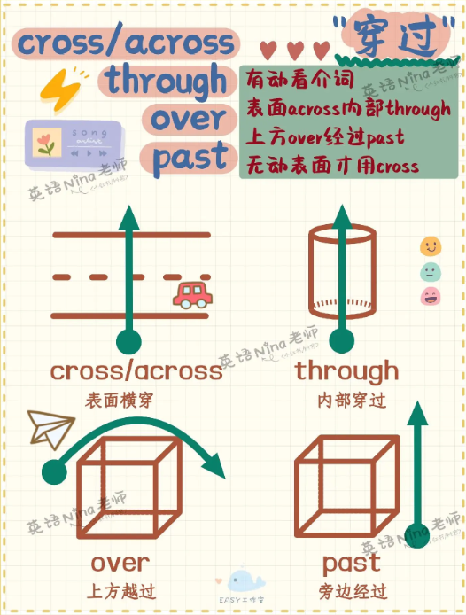
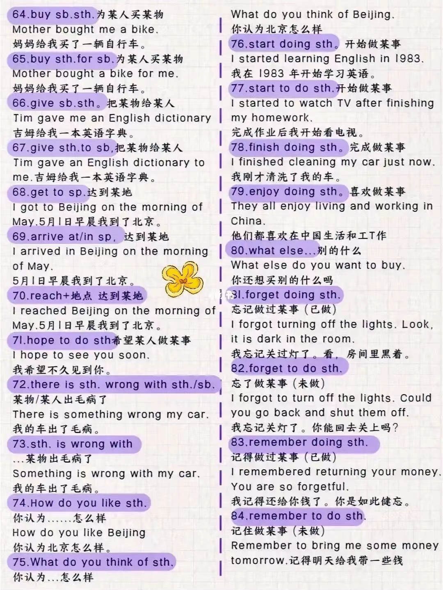

# 时间

## 在不同时间点

### 时间介词

at 表示**具体时间**、时刻、年龄：

- at 10 o'clock 在10点
- at daybreak/noon/dusk/night/midnight 在黎明/中午/黄昏/晚上/午夜
- at six / at the age of six 在六岁时
- at that moment 在那一刻

on 表示**具体某一天**或特定某一天的早中晚：

- on May 1st 在5月1日
- on Monday 在星期一
- on New Year's  Day 在新年那天
- on my birthday 在我生日那天
- on Friday morning 在星期五早晨
- on the weekend 在周末

in 表示**较长的时间段**（朝代、世纪、年代、年份，季节，月份等）或泛指的早中晚：

- in the Tang Dynasty 在唐朝
- in the 21st century 在21世纪
- in the 1990s/1990's 在20世纪90年代
- in 2025 在2025年
- in spring 在春季
- in January 在一月
- in the morning/afternoon/evening (具体某一天早中晚用 on：on Friday morning)

不使用介词表示的时间状语：

- 当表示时间的词前有 this，that 修饰：this morning
- 当表示时间的词前有 last，next 修饰：next Sunday
- 当表示时间的词前有 every，any，each，one，some，all 修饰：every day

### 时间冠词

- 使用定冠词：朝代、世纪、年代、中国节日、泛指早中晚
- 使用零冠词：年份、季节、月份、星期、日期、非中国节日

### 时间点示例

in the Tang Dynasty 在唐朝

in the 21st century 在21世纪

in the 1990s/1990's 在20世纪90年代

in 2025 在2025年

in spring 在春季

in January 在一月

on May 1st 在5月1日

on Monday 在星期一

on Chrildren's Day 在儿童节

on the Spring Festival 在春节

in the morning/afternoon/evening 在早晨/下午/晚上

on the morning of May 1st 在5月1日的早晨

on Monday morning 在星期一的早晨

at daybreak/noon/dusk/night/midnight 在黎明/中午/黄昏/晚上/午夜

## for

“**for + 时间段**”表示“**持续了多长时间**”，常用于现在完成时、过去时、将来时等。

I have lived here **for five years**. (现在完成时)  
她昨晚学了两个小时的英语。

She studied English **for two hours last night**. (一般过去时)  
她昨晚学了两个小时的英语。

We will stay in Tokyo **for a week**. (一般将来时)  
我们将在东京待一个星期。

## 当...时候

- **when + 瞬间动作：表示“当 ... 时候”。**

    I was cooking when he arrived.  
    当他到达的时候，我正在做饭。

- **while + 持续动作：表示“当 ... 时候”，通常接进行时**

    I was reading while she was cooking.  
    当我在看书的时候，她在做饭。

- **as：随着...**

    As the days went by, the weather got warmer.  
    随着日子一天天过去，天气变得更暖了。

- **whenever：每当；无论何时****

    Whenever it rains, the street gets flooded.  
    每当下雨，街道都会积水。

    You can come over whenever you need help.  
    无论何时你需要帮助，都可以过来。

- **once：一旦 ... 就 ...**

    Once you understand it, it becomes easy.  
    一旦你明白了，它就变得简单了。

- **as soon as：一 ... 就 ...**：可以用 when 替换，反之则不完全可以。

    I’ll call you as soon as I arrive.  
    我一到就打电话给你。

    As soon as I got home, it started raining.  
    我一到家就下起了雨。

- **No sooner...than...**；**Hardly/Scarecely...when...：一...就...**：位于句首需要倒装

    **No sooner had** he opened the door **than** a gust of wind blew the candle out.   
    **Scarcely/Hardly had** he opened the door **when** a gust of wind blew the candle out.  
    他一打开门，一阵强风就把蜡烛吹灭了。

## 在...之前

- **before + 时间点：表示“在...时间点之前”，强调动作，通常用于一般时、过去时和完成时；与 after 相反**

    I went to bed **before 11 p.m.**  
    我在晚上11点之前上床睡觉了。

    I had never seen her **before last week**.  
    上周以前我从未见过她。

- **by：表示“在...时间点之前”，强调截止时间（含截止时间），通常用于将来时和完成时。**

    - **by + 时间点**

        I will finish the report **by 5 p.m.**  
        我将在下午5点之前完成报告。

    - **by the time + 从句**

        By the time he arrived, we had left.  
        他到之前，我们已经走了。

- **within + 时间段：表示“在...时间段之内”，与 in 相反。**

    He finished the job **within 10 minutes**.  
    他在10分钟内完成了工作。

## 在...之后

after，later 和 in 都表示“在...之后”，具体用法如下：

- **after + 时间点 / 事件 / 从句：表示“在...时间点之后”，与 before 相反**

    I’ll call you **after lunch**. (接事件)  
    午饭后我给你打电话。

    I went home **after I finished work**. (引导时间状语从句)  
    我下班后回家了。

- **时间段 + later：表示“在...时间段以后”，通常位于句首，用于现在时。**

    **Two hours later**, he finally called.  
    两个小时后他终于打来了电话。

    I'll see you **later**. (单独作为副词，位于句尾)  
    稍后见。

- **after + 时间段：表示“在...时间段之后”，通常位于句尾，用于过去时**

    He came back after 10 minutes.  
    他在10分钟后回来了。
    
- **in + 时间段：表示“从现在起，在...时间段之后”，通常位于句尾，用于将来时和完成时；与 within 相反**

    I’ll be ready **in 10 minutes**.  
    我将在10分钟之后准备好。

- **past**

    - **in the past：表示“在过去”，作为状语，通常用于过去时；与 in the future 相反。**

        In the past, trains were pulled by steam engines.  
        过去火车是由蒸汽机驱动的。

    - **in the past + 时间段：表示“在过去多长时间里”，作为状语，通常用于现在完成时。**

        He has made rapid progress in the past three months.  
        在过去的3个月里他进步很快。

## 在...期间

during，through 和 over 都表示“在...期间”，具体区别如下：

- **during：表示“期间的某个时刻或阶段”，并非整个期间。**

    I fell asleep **during** the movie.  
    电影放映期间，我睡着了。

- **through：表示“期间的全部”，强调完整贯穿。**

    We worked **through** the night.  
    我们工作了一整夜。

- **over：表示“跨越一段时间”，强调时间范围的整体性，或动作在期间逐渐发生。**

    The city has changed **over** the years.  
    这座城市多年来逐渐变化。

## 从...时候

- **from... to/till/...：表示“从...时候到...时候”，通常用于一般时态或将来时态中。**

    I work **from** 9 a.m. **to** 5 p.m. (一般现在时)  
    我从早上9点工作到下午5点。

    The class will run **from** September **to** December. (一般将来时)  
    课程从九月持续到十二月。

- **since + 时间点/从句：表示“自从...时候起”，通常用于现在完成时。**

    I have lived here **since 2010**. (接时间点)  
    我从2010年起一直住在这里。

    She has been working here **since she graduated**. (接从句)  
    她从毕业起就在这里工作了。

## 直到...时候

- **till 和 untill**

    - 都表示“直到 ...时候”，某个动作/状态一直持续到某个时间点为止。
    - 作为介词：till/untill + 时间点
    - 作为连词：till/untill + 从句

- **肯定形式：till/untill + 时间点 / 从句**

    I’ll wait **till/untill** 6 o’clock.  
    我会一直等到6点。

    Stay here **till/untill** I come back.  
    你在这待着，直到我回来为止。

- **否定形式：not ... untill/till + 时间点 / 从句**：意为“直到...才...”

    I **didn’t** sleep **untill** 2 a.m.  
    我直到两点才去睡觉。

    She **won't** go to bed **until** she finishes her homework.  
    她直到完成作业才会去睡觉。

- **Not untill 位于句首，主句需要倒装。**

    Not until he apologized did she forgive him.  
    直到他道歉，她才原谅他。

## 其它时间短语

on time 准时

in time 及时

sooner or later 迟早

in the past 在过去

# 方位

## 方位介词

### 在...上面

- **on**：指在与物体表面相接触的上面。
- **above**：指水平位置在某物之上，或者虚拟的上面（如价格，增长率等）；和 below 相反。
    - The sun rose above the horizon.
    - The jet flew above the clouds.
- **over**：指在某物正上方，和 under 相反；
    - A bridge over the river
- **aboard**：在(船、飞机、公共汽车、火车等)上
    - aboard the plane
    - go aboard 上船

### 在...下面

- **beneath**：在 ... 下面
- **below**：指水平位置在某物之下，和 above 相反；
- **under**：指在某物正上方，和 over 相反；

### 在 ... 之间

- **between**：在 ... 之间（两个）
- **among**：在 ... 之间（三个或以上）

### 在前面

- **in front of**：在...前面（外部）
- **in the front of**：在...前面（内部）

### 在后面

- **behind**：在后面

### 相邻；附近

- **on**：接壤

    Guangdong Province is on the southeast of Guangxi.  
    广东省在广西省南面。（广东和广西接壤）

- **to**：在...范围之外，不接壤

    Japan is to the east of China.  
    日本在中国东面（日本和中国不接壤）

- **close to**：距离近

    The coffee shop is **close to** my office.

- **next to**：紧挨着

    The supermarket is **next to** the bank.

- **by**：旁边或附近

    The library is just **by** the corner.

- **near**：附近

    The park is **near** my house.

- **beside**：旁边，通常指非常接近的地方。

    She sat **beside** me during the movie.

# 动向

## 动向介词

- **to**：表示从某个地方到达另一个地方

- **towards**：朝着某个方向，不一定到达目的地

- **into**：强调进入某个地方或空间的过程

- **onto**：表示方向朝向某个表面

- **up**：向上

- **down**：向下

- **around**：环绕，在周围

- **穿过**

    

    - **across**：从表面穿过（马路，桥，河...）

        There's a way across the fields. 

    - **through**：从内部穿过（森林，隧道，人群，门窗...）

        I usually cycle home through the park.

    - **over**：从上方越过（栅栏，墙，山...）

    - **past**：从旁边经过

# 数量

## 数量介词

- **About**, **around** 表示大约的数量或范围。
- **Over**, **under** 表示超过或低于某个数量。
- **Between** 表示在两个数值或数量之间。
- **More than**, **less than** 表示超过或低于某个数量。
- **At least**, **up to** 表示最少或最多的数量。

# 方式

## 方式介词

- 一般译为“通过...方式”

- **with**：通过工具或设备

    I wrote the letter **with** a pen.  我用钢笔写信。

- **by**

    - **通过某种方式**

        She learned Spanish by practicing every day.  
        她通过每天练习学会了西班牙语。

    - **动作的施动者**

        The book was written **by** J.K. Rowling. 这本书是J.K.罗琳写的。

        The letter was sent **by** email. 信件通过电子邮件发送。

    - **通过交通工具**

        I prefer to go **by** train. 我更喜欢坐火车。

- **through**：通过某种方式，此时可以与 by 互换

- **via**：通过某种渠道

    The message was sent **via** email. 信息通过电子邮件发送。

    They arrived **via** a different route. 他们通过另一条路线到达。

# 原因

- Because of 和 due to 最为常用，表示原因时可以互换。
- For 表示因果关系，通常用于较简短的表达。
- Owing to，In view of 和 on account of 更正式，常用于书面语。

# 状态

- **表示正在进行**

    at work 正在工作  
    on fire 着火  
    under construction 正在检修

# 其它

## 口语和书面语

- spoken language  口语

- **听你的**

    (It's) up to you.

    Anything you say.

- **检查**

    书面 review    口语 go over

- **联系**

    书面 contackt him    口语 reach out to him

- **安排**

    书面 schedule a meeting    口语 set up a meeting

## Number

- **25,476** twenty five thousand, four hundred seventy six
- **fraction** 分数
    - **1/2** one half
    - **1/4** one quarter
    - **3/4** three quarters
    - **2/5** two fifth
- **percent** 百分比
    - **25%** twenty five percent
- **decimal** 小数
    - **0.3** (zero) point three

- **1997年** nineteen ninety seven

## 100个句型

- 100 important syntax

    

    

    

    

    

## 口语

- heads up    注意（类似于 be careful），提醒，警告（可用于警示牌标题）

    Heads up, boys! A train is coming.

## 疑问词

| 问地点 |   where   | 问怎样 |       how       |
| :----: | :-------: | :----: | :-------------: |
| 问原因 |    why    | 问身高 |    how tall     |
| 问时间 |   when    | 问长度 |    how long     |
| 问哪个 |   which   | 问大小 |     how big     |
|  问谁  |    who    | 问频率 |    how often    |
| 问谁的 |   whose   | 问多久 |    how soon     |
| 问什么 |   what    | 问年龄 |     how old     |
| 问几号 | what date | 问多少 | how many / much |
| 问星期 | what day  | 问价格 |    how much     |
| 问时间 | what time | 问重量 |    how heavy    |

## 数量

- There be 中 no = not any
- There be 疑问句中把 some 变 any
- a lot of / lots of 很多（形容可数名词）
- a little of 一点（形容不可数名词）
- a (little) bit of 一点（形容不可数名词）
    - bits of
- a certain group of 某些
- a couple of 几个；一对
- a pair of 一对

## 减少

decrease  vi. 下降（大小、数量等数字的减小）

reduce  vt. 减少

## 其它

- another
- other

## 没有

- 没有

    

- **nobody = no one**：强调内容，只指人

- **nothing**：强调内容，只指物

- **none**：强调数量，可指人 / 物

    - none of + 复数可数名词，谓语可单可复
    - none of + 不可数名词，谓语必单数

## 条件状语从句

- **if**：如果 ...；是否 ...
- **unless**：除非 ...
- **as / so long as**：只要 ...
- **even though / if**：即使 ...

## 因为

- **强调原因**
- because that ...
- because of ...
- due to ...
- owning to ...

## 根据

- **强调标准，后接规定，报告等正式依据**
- according to ...
- on the basis of ...
- as per ...

## 花费

- It takes sb. some time to do sth.
- sth. costs sb. some money on sth.
- sb. spends some time / money (in) doing sth.
- sb. spends some time / money on sth.
- sb. pays some money for sth.

## 做...

- what do you mean by doing sth.
- enjoy doing sth. 喜欢做
- like doing sth. 喜欢做
- like to do sth. 想做
- feel like doing sth. 想做
- would like to do sth. 想做
- be good at (doing) sth. 擅长做
- begin / start sth. with sth. 伴随...开始做...
- be going to do sth. 打算做
- have to do sth. 必须做
- had better (not) do sth. 最好（不）做
- help sb. do sth.
- help sb. to do sth.
- help sb. with sth.

## 让...做...

- Let sb. (not) do sth.
- make sb. do sth.
- have sb. do sth.
- ask sb. to do sth.
- want sb. to do sth.
- would like sb. to do sth.
- why not do sth. / why don't you do sth.

## 相同

- be different from 与...不同

- be the same as 与...相同

- be similar to 与...相似

## 到达

- reach sp.
- get to sp.
- arrive at / in sp.

## 毛病

- What's the matter with sb. / sth.?
- There's something wrong with sb. / sth.
- Something is wrong with sb. / sth.

## 怎么样

- How do you like sth. 认为...怎么样
- What do you think about / of sth. 认为...怎么样
- How / What about doing sth. 做...怎么样

## 开始结束继续

- start to do sth.
- finish doing sth.
- stop 停止
    - stop to do sth. 停下去做另一件事
    - stop doing sth. 停下正在做的事
- go on 继续
    - go on with sth.
    - go on doing sth. 继续做同一件事
    - go on to do sth. 继续去做另一件事

## 请求帮助

- I'm wondering if I could ask you for a favor.