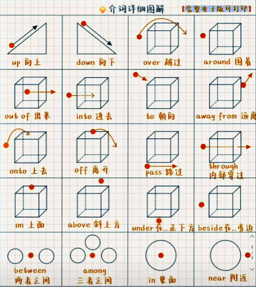
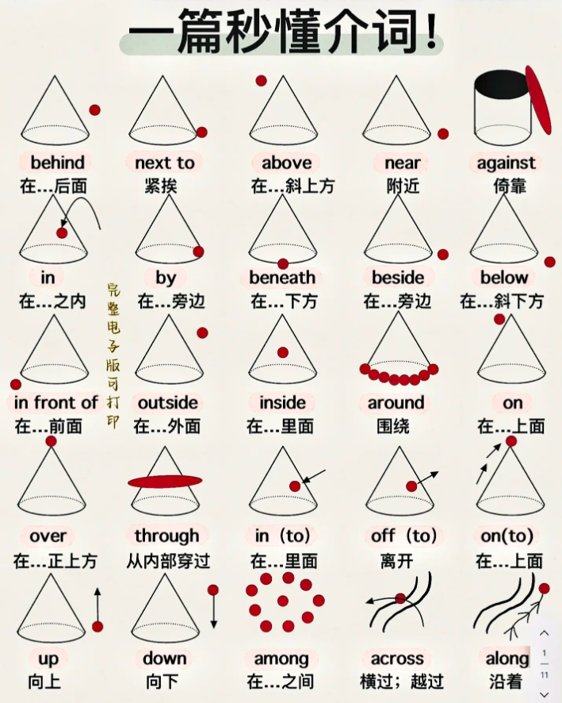
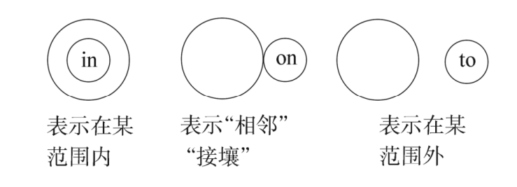
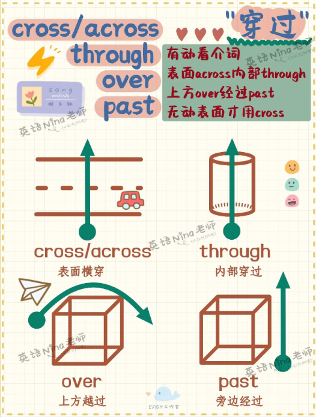

# 时间

## 在不同时间点

### 时间介词

#### at

at 表示**具体时间**、周末、时刻、年龄：

- at 10 o'clock 在10点
- at daybreak/noon/dusk/night/midnight 在黎明/中午/黄昏/夜里/午夜
- at six / at the age of six 在六岁时
- at that moment 在那一刻
- at weekends / the weekend 在周末

#### on

on 表示**具体某一天**或特定某一天的早中晚：

- on May 1st 在5月1日
- on Monday 在星期一
- on New Year's  Day 在新年那天
- on my birthday 在我生日那天
- on Friday morning 在星期五早晨

#### in

in 表示**较长的时间段**（朝代、世纪、年代、年份，季节，月份等）或泛指的早中晚：

- in the Tang Dynasty 在唐朝
- in the 21st century 在21世纪
- in the 1990s/1990's 在20世纪90年代
- in 2025 在2025年
- in spring 在春季
- in January 在一月
- in the morning/afternoon/evening (具体某一天早中晚用 on：on Friday morning)

#### 不使用介词

某些情况，不使用介词的时间短语也可以作状语。

名词本身具有**副词词性**：

- today 在今天
- yesterday 在昨天
- the day before yesterday 在前天
- tomorrow 在明天
- the day after tomorrow 在后天
- yesterday morning 在昨天早晨
- tonight 在今夜

用 **this** 和 **that** 表示“这个”和“那个”时间段：

- this morning = in the morning 在今天上午
- 注意一般不说“this night”，而用“tonight”表示“在今夜”

用 **last** 和 **next** 表示“上一个”和“下一个”时间段：

- last month 在上个月
- next Sunday 在下个星期

有 **every，any，each，one，some，all** 等修饰：

- every day 在每一天
- some day 在某一天

### 时间冠词

- 使用定冠词：朝代、世纪、年代、中国节日、泛指早中晚
- 使用零冠词：年份、季节、月份、星期、日期、非中国节日

## for

“**for + 时间段**”表示“**持续了多长时间**”，常用于现在完成时、过去时、将来时等。

I have lived here **for five years**. (现在完成时)  
她昨晚学了两个小时的英语。

She studied English **for two hours last night**. (一般过去时)  
她昨晚学了两个小时的英语。

We will stay in Tokyo **for a week**. (一般将来时)  
我们将在东京待一个星期。

## 当...时候

- **when + 瞬间动作：表示“当 ... 时候”。**

    I was cooking when he arrived.  
    当他到达的时候，我正在做饭。

- **while + 持续动作：表示“当 ... 时候”，通常接进行时**

    I was reading while she was cooking.  
    当我在看书的时候，她在做饭。

- **as：表示“随着...”**

    As the days went by, the weather got warmer.  
    随着日子一天天过去，天气变得更暖了。

- **whenever：每当；无论何时****

    Whenever it rains, the street gets flooded.  
    每当下雨，街道都会积水。

    You can come over whenever you need help.  
    无论何时你需要帮助，都可以过来。

## 一...就...

- **once：一旦 ... 就 ...**

    Once you understand it, it becomes easy.  
    一旦你明白了，它就变得简单了。

- **as soon as**：可以用 when 替换，反之则不完全可以。

    I’ll call you as soon as I arrive.  
    我一到就打电话给你。

    As soon as I got home, it started raining.  
    我一到家就下起了雨。

- **No sooner...than...**；**Hardly/Scarecely...when...**：位于句首需要倒装

    **No sooner had** he opened the door **than** a gust of wind blew the candle out.   
    **Scarcely/Hardly had** he opened the door **when** a gust of wind blew the candle out.  
    他一打开门，一阵强风就把蜡烛吹灭了。

- **the moment, the instant, immediately, directly + 从句**

    The boy burst into tears immediately he saw his mother.  
    那个男孩一见到他妈妈便大哭起来。

## 在...之前

- **before + 时间点/从句：表示“在...时间点之前”，强调动作，通常用于一般时、过去时和完成时；与 after 相反**

    I went to bed **before 11 p.m.**  
    我在晚上11点之前上床睡觉了。

    We had sailed four days and four nights **before we saw land**.  
    我们航行了四天四夜才看到陆地。

- **时间段 + ago：表示“在...时间段以前”，用于过去时。**

    He called me **2 hours ago**.  
    两个小时前他给我打电话了。

- **by：表示“在...时间点之前”，强调截止时间（含截止时间），通常用于将来时和完成时。**

    - **by + 时间点**

        I will finish the report **by 5 p.m.**  
        我将在下午5点之前完成报告。

    - **by the time + 从句**

        By the time he arrived, we had left.  
        他到之前，我们已经走了。

- **within + 时间段：表示“在...时间段之内”，与 in 相反。**

    He finished the job **within 10 minutes**.  
    他在10分钟内完成了工作。

## 在...之后

after，later 和 in 都表示“在...之后”，具体用法如下：

- **after + 时间点 / 事件 / 从句：表示“在...时间点之后”，与 before 相反**

    I’ll call you **after lunch**. (接事件)  
    午饭后我给你打电话。

    I went home **after I finished work**. (引导时间状语从句)  
    我下班后回家了。

- **时间段 + later：表示“在...时间段以后”，通常位于句首，用于现在时。**

    **Two hours later**, he finally called.  
    两个小时后他终于打来了电话。

    I'll see you **later**. (单独作为副词，位于句尾)  
    稍后见。

- **after + 时间段：表示“在...时间段之后”，通常位于句尾，用于过去时**

    He came back after 10 minutes.  
    他在10分钟后回来了。
    
- **in + 时间段：表示“从现在起，在...时间段之后”，通常位于句尾，用于将来时和完成时；与 within 相反**

    He will be back from abroad in three days.  
    他3天后从国外回来。

- **past**

    - **in the past：表示“在过去”，作为状语，通常用于过去时；与 in the future 相反。**

        In the past, trains were pulled by steam engines.  
        过去火车是由蒸汽机驱动的。

    - **in the past + 时间段：表示“在过去多长时间里”，作为状语，通常用于现在完成时。**

        He has made rapid progress in the past three months.  
        在过去的3个月里他进步很快。

## 在...期间

during，through 和 over 都表示“在...期间”，具体区别如下：

- **during：表示“期间的某个时刻或阶段”，并非整个期间。**

    I fell asleep **during** the movie.  
    电影放映期间，我睡着了。

- **through：表示“期间的全部”，强调完整贯穿。**

    We worked **through** the night.  
    我们工作了一整夜。

- **over：表示“跨越一段时间”，强调时间范围的整体性，或动作在期间逐渐发生。**

    The city has changed **over** the years.  
    这座城市多年来逐渐变化。

## 从...时候

- **from... to/till/...：表示“从...时候到...时候”，通常用于一般时态或将来时态中。**

    I work **from** 9 a.m. **to** 5 p.m. (一般现在时)  
    我从早上9点工作到下午5点。

    The class will run **from** September **to** December. (一般将来时)  
    课程从九月持续到十二月。

- **since + 时间点/从句：表示“自从...时候起”，通常用于现在完成时。**

    I have lived here **since 2010**. (接时间点)  
    我从2010年起一直住在这里。

    She has been working here **since she graduated**. (接从句)  
    她从毕业起就在这里工作了。
    
    It is/has been two years since we arrived here.  
    我们到这儿两年了。

## 直到...时候

- **till 和 untill**

    - 都表示“直到 ...时候”，某个动作/状态一直持续到某个时间点为止。
    - 作为介词：till/untill + 时间点
    - 作为连词：till/untill + 从句

- **肯定形式：till/untill + 时间点 / 从句**

    I’ll wait **till/untill** 6 o’clock.  
    我会一直等到6点。

    Stay here **till/untill** I come back.  
    你在这待着，直到我回来为止。

- **否定形式：not ... untill/till + 时间点 / 从句**：意为“直到...才...”

    I **didn’t** sleep **untill** 2 a.m.  
    我直到两点才去睡觉。

    She **didn't** have any idea of it **until** you told me.  
    直到你告诉我，我才知道这件事。

- **强调句型：It was not until... that...**

    It was not until you told me that I had any idea of it.  
    直到你告诉我，我才知道这件事。

- **倒装：Not untill 位于句首，主句需要倒装。**

    Not until you told me did I have any idea of it.  
    直到你告诉我，我才知道这件事。

- **till 不可置于句首，而 until 可以。**

    Until you told me I had no idea of it.  
    直到你告诉我，我才知道这件事。

## 在...次

each/every time, next time, the last time, any time, the first time 等可直接引导时间状语从句。

Next time you come, do remember to bring your son here.  
下次你来这里的时候，一定记着把你儿子带来。

Each/Every time I was in trouble, he would come to help me.  
每当我处于困境，他就会来帮助我。

# 方位

## 在...地方

- **at**：在较小的地方

    at the village 在那个村庄  
    at 105 Green Street 在格林大街105号

- **in**：在较大的地方

    in Beijing 在北京

## 东南西北

- **in**：在...范围之内

    Fujian lies in the southeast of China.  
    福建在中国的东南部。

- **on**：接壤

    Guangdong Province is on the southeast of Guangxi.  
    广东省在广西省南面。（广东和广西接壤）

- **to**：在...范围之外，不接壤

    Japan is to the east of China.  
    日本在中国东面（日本和中国不接壤）

## 在...上面

- **on**：指在与物体表面相接触的上面。
- **above**：指水平位置在某物之上，和 below 相反。
    - The sun rose above the horizon.
    - The jet flew above the clouds.
- **over**：指在某物正上方，和 under 相反；
    - A bridge over the river
- **aboard**：在(船、飞机、公共汽车、火车等)上
    - aboard the plane
    - go aboard 上船

## 在...下面

- **beneath**：在 ... 下面
- **below**：指水平位置在某物之下，和 above 相反；
- **under**：指在某物正下方，和 over 相反；

## 在 ... 之间

- **between**：在 ... 之间（两个）

    The secret was shared between Alice and Bob.  
    这个秘密是 Alice 和 Bob 两人之间分享的。

- **among**：在 ... 之间（三个或以上）

    She was the smartest among the five candidates.  
    她是五个候选人中最聪明的。

## 在...里面

- **in**：在...里面（墙上有个洞要用 a hole in the wall）

## 在前面

- **in front of**：在...前面（外部），与 behind 相反。
- **in the front of**：在...前面（内部）

## 在后面

- **behind**：在后面，与 in front of 相反。

## 相邻；附近

- **close to**：距离近

    The coffee shop is **close to** my office.

- **next to**：紧挨着

    The supermarket is **next to** the bank.

- **by**：旁边或附近

    The library is just **by** the corner.

- **near**：附近

    The park is **near** my house.

- **beside**：旁边，通常指非常接近的地方。

    She sat **beside** me during the movie.

## 其它方位介词

- **opposite sth. = on the other side of sth.**：在...对面

# 方式

- 一般译为“通过...方式”

- **with**：通过工具或设备

    I wrote the letter **with** a pen.  我用钢笔写信。

- **by**

    - **通过某种方式**

        She learned Spanish by practicing every day.  
        她通过每天练习学会了西班牙语。

    - **动作的施动者**

        The book was written **by** J.K. Rowling. 这本书是J.K.罗琳写的。

        The letter was sent **by** email. 信件通过电子邮件发送。

    - **通过交通工具**

        I prefer to go **by** train. 我更喜欢坐火车。

- **through**：通过某种方式，此时可以与 by 互换

- **via**：通过某种渠道

    The message was sent **via** email. 信息通过电子邮件发送。

    They arrived **via** a different route. 他们通过另一条路线到达。

- **in**：使用的语言、材料等。

    in English 用英语  
    in blue ink 用蓝墨水

# 动向

## 动向介词

- **from**：从...地方

- **to**：到...地方

- **towards**：朝着某个方向，不一定到达目的地

- **into**：强调进入某个地方或空间的过程

- **onto**：表示方向朝向某个表面

- **up**：向上

- **down**：向下

- **around**：环绕，在周围

- **穿过**

    

    - **across**：从表面穿过（马路，桥，河...）

        There's a way across the fields. 

    - **through**：从内部穿过（森林，隧道，人群，门窗...）

        I usually cycle home through the park.

    - **over**：从上方越过（栅栏，墙，山...）

        The cat jumped over the wall.

    - **past**：从旁边经过

        The crowd walked past the City Hall to the Centre Square.  
        这群人走过市政厅到达中心广场。

## 上升

- **raise**：vt. 把某物抬高；引申为提高、募集等。

    She raised her hand.  
    她举起了手。

- **rise**：vi. 自行升起；强调“自己上升”。

    The sun rises in the east.  
    太阳从东方升起。

- **lift**：vt.&vi. 把某物提起（有动作感）

    He lifted the box.  
    他提起了箱子。

## 行为对象

- 区分

    - to 强调**动作的方向**，通常是“把某物/行为传递给某人”
    - at 强调**行为的方向**，如果强调动作的方向可能含有恶意。

- 例句

    I threw the ball **to** him. 他把球朝我扔过来。  
    I threw the ball **at** him. 他把球传给我。

- 固定搭配

    speake to sb. 同某人说话

    shout at sb. 冲某人喊

    smile at sb. 冲某人微笑

# 名词辨析

## 力量

- **stress**：精神/物理上的**压力**，学业压力、结构应力
- **strength**：某物或某人的**强度/力量**，肌肉力量、金属强度
- **force**：外来的**作用力、武力**，重力、推力、军队
- **power**：能力/能量/权力，发电、统治、说服力

## 人

- **person**
    - 指单一的个体，通常用于强调某个具体的个人。
    - 可数名词，表示单数形式。
    - 通常不说 two persons，而说 two people。
- **people**
    - 通常是 "person" 的复数形式，指多个个体，也可以表示某个群体或民族。
    - 不可数名词时表示"人类"（指代整体的人类群体）；可数名词时表示“多个个体”。
    - 通常不说 one people，而说 one person。

- **human**
    - 通常指人类这个物种
    - 作为名词（指人类）：all humans，所有人类
    - 作为形容词（形容与人类有关的事物）:a basic human need

- **human being**
    - 通常用于强调个体的人类，常见于较为正式或哲学性的话题，比 person 更正式。
    - 作为单数名词表示单独的人类个体：Every human being，每个人。
    - 作为复数名词表示人类整体：The rights of human beings ，人类的权利。

## 声音

- sound：声音
- noise：喧闹声
- voise：嗓音，说话声

## 入口

- **entrance**：实体“入口”，与 exit 相反。

    The entrance to the station is crowded.  
    火车站的入口很拥挤。

- **access**：“通道”或“进入权限”，可以指物理或虚拟空间。

    There is no direct access to the platform from this side of the station.  
    这边没有通往站台的直接通道。

    Only passengers have access to the waiting area.  
    只有乘客可以进入候车区。

# 动词辨析

## 携带

| 动词 | 中文意思 | 说明 | 示例 |
| :---: | :---: | :---: | :---: |
| take | 带走； 随身携带 | 从“说话地点”出发，向外带走； 随身携带 | Take this letter to the post office. I forgot to take my bag with me when I got off the bus. |
| bring | 带来 | 向“说话地点”移动，向内带来 | Bring your ID to the exam. |
| fetch | 去带回来 | 强调“去拿回来”，有“来回”的动作 | I’ll fetch some water. |
| carry | 搬运、携带 | 强调“携带在身上或手上”，不强调方向 | She carried a baby in her arms. |
| hold | 拿着、握住 | 强调“用手持有某物”，没有移动含义 | He held my hand. |
| deliver | 递送 | 把东西送到指定地点（多用于快递、服务等） | They deliver food in 30 minutes. |

## 花费

- **spend**

    - 花费（金钱、时间、精力），主语是人。
    - 句型：详见 **词汇 | spend**

        sb. spend 时间/金钱 on sth.  
        sb. spend 时间/金钱 (in) doing sth.

- **cost**

    - 花费（金钱、代价），主语是物。
    - 句型：详见 **词汇 | cost**

        sth. cost sb. 金钱/代价  
        sth. cost 金钱

- **take**

    - 花费（金钱），主语是 it 或物。
    - 句型：详见 **词汇 | take**

        It takes sb. 时间 to do sth.

- **pay**

    - 花费（金钱），强调付款动作，主语是人。
    - 句型：详见 **词汇 | pay**

        sb. pay (金钱) for sth.  
        sb. pay sb. 金钱  
        sb. pay to do sth.

- **afford**

    - “花费得起（金钱）”或“承担得起（某种代价）”，主语是人。
    - 句型：详见 **词汇 | afford**

        常用于 be able to 或 can 之后  
        can afford 钱/sth.  
        can afford to do sth.

## 接受

accept 表示主观接受，而 receive 表示客观收到。

She received a birthday present from a boy but didn't accept it.  
她收到一个男孩的生日礼物，但没有接受。

## 穿

- put on：穿（动作）
- wear：穿；戴（状态）
- take off：脱（动作）

## 连接

connect

relate

link

concern

associate

# 形容词辨析

## 正确的

- **correct**：正确的（强调对错，比如对的答案，规则合规）
- **accurate**：精确的（强调精准，常用语技术、科学、数据场景）
- **right**：正确的（同义词为 correct）；恰当的（同义词为 suitable）