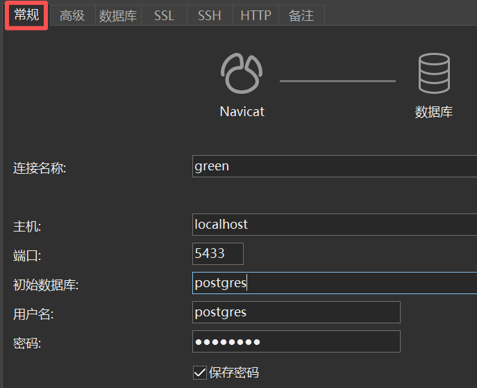

# Navicat Premium Lite

**Navicat Premium Lite** 是 Navicat 的**免费**轻量版数据库管理工具，主要用于数据库管理和开发。

- **环境搭建**：[中文官网下载安装包](https://www.navicat.com.cn/download/navicat-premium-lite)
- 在连接容器化数据库时，记得将容器化数据库端口映射到本地。

**使用方法如下**：

- 数据库服务端已运行

- **连接数据库**
  - **连接名称**：随便填
  - **主机地址**
    - **本地**：localhost
    - **云端**：
      - localhost（需配置云服务商代理）
      - 公网 IP
  - **端口号**：一般为 3306
  - root 用户名和密码
- **创建 Databae**
  - 右键点击已连接的数据库 > `新建数据库`
  - **字符集**：`utf8mb4`
  - **排序规则**：`utf8mb4_general_ci`

- **创建 Table**
  - 在已创建的 Database 目录下，右键点击 `表` > `新建表`

## SSH 连接远程数据库

此部分记录对方的数据库端口未对外开放时，如何连接。

- 开启 SSH 隧道，并进行端口转发

  ```bash
  ssh -L 5433:127.0.0.1:5432 svg@117.62.22.167
  ```

- 以运行在 Docker 中的 `PostgreSQL + pgvector` 为例

- 配置 Navicat

  

请打开 Navicat，点击 **“新建连接”** -> **“PostgreSQL”**，然后按照以下参数填写：

- **主机**：`localhost` 或 `127.0.0.1`
- **端口**：**`5433`**（注意：必须是你 SSH 命令中 `-L` 后面的第一个端口）
- **初始数据库**：`postgres`
- **用户名**：`postgres`
- **密码**：(填写你在服务器 `.env` 文件中看到的 `POSTGRES_PASSWORD`)
