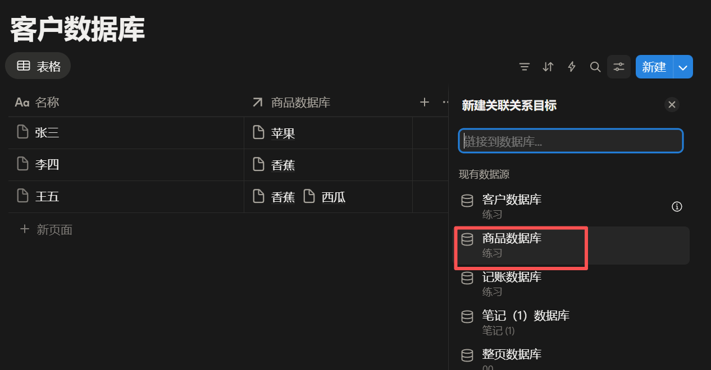
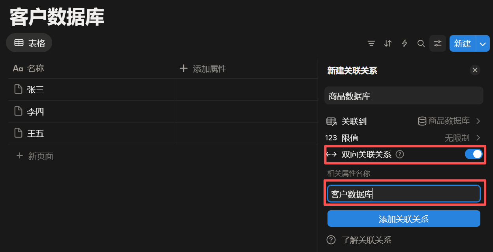

# 关于 Notion 的使用体验

2025年9月末开始，受 Notion 数据库吸引，开始试用 Notion。

有以下优点：

- 在线云笔记：手机电脑无缝线上体验
- 数据库
    - 所有页面不用使用传统的文件夹，可以在数据库建立一个文本字段，写上各种标签，然后筛选。
    - 有数据库关联功能，比如历史笔记，对历史朝代、事件、人物可以互相关联
- 编辑体验
    - 比 Markdown 省心，很多都是靠点击完成

有以下缺点：

- 只有黑白主题，而且黑色很丑
- 响应不及时，有时会卡顿，影响使用体验
- 手机客户端不能滑动太宽的表格，无法全部显示
- 学习成本高
- ...........

综上所述，最后弃用。

# Notion

**[Notion](https://www.notion.com/zh-cn)**是一款集成了笔记、知识库、数据表格、看板、日历等多种能力于一体的应用程序，它既可供个人使用，也可以与他人进行跨平台协作。

>  [官方文档](https://www.notion.com/zh-cn/help/reference)
>
>  [Notion 中文网](https://www.notionapp.cn/)
>
>  [Notion 教程（知乎网）](https://zhuanlan.zhihu.com/p/614078488)

## 环境搭建

- [官网下载安装 Notion](https://www.notion.com/zh-cn/desktop)
- [网页端在线使用](https://www.notion.com/zh-cn)

## 快捷键

|  操作  |                        快捷键                        |
| :--: | :-----------------------------------------------: |
| 创建块  |                   <kbd>/</kbd>                    |
| 强制换行 |        <kbd>Shift</kbd> + <kbd>Enter</kbd>        |
| 添加评论 | <kbd>Ctrl</kbd> + <kbd>Shift</kbd> + <kbd>M</kbd> |
|  内容  |            <kbd>?</kbd> + <kbd>?</kbd>            |
|  内容  |            <kbd>?</kbd> + <kbd>?</kbd>            |

# 块

## 同 Markdown

- 标题
- 文本
- 有序列表
- 无序列表
- 表格
- 代码
- 引用
- 图片
- 视频
- 音频
- 目录
- mermaid
- 分隔线
- 待办清单
- Emoji 表情

## 创建命令

| 命令 | 说明 |
| :---: | :---: |
| <kbd>#</kbd> - <kbd>Space</kbd> `/h1` | 一级标题 |
| <kbd>#</kbd> - <kbd>Space</kbd> - <kbd>></kbd> - <kbd>Space</kbd> | 一级折叠标题 |
|  |  |

## 同步块

**同步块**（Synced Block）能让你在多个地方使用同一段内容，并且在一处编辑后，所有地方都会自动更新。

- 选中块 | `转换成` | `同步区块`
- 选中块 | `拷贝区块链接`
- 光标定位到待同步区域 > `粘贴` > `同步区块`

注意：

- 取消同步以后，所有同步区域会遗留该块
- 删除源块以后，同步块会一起删除

# 页面

# 数据库

## 数据库概述

Notion 中的**[数据库](https://www.notion.com/zh-cn/help/category/databases)**是**页面的集合**，可分为[行内数据库](https://www.notion.com/zh-cn/help/intro-to-databases#inline-databases)和[整页数据库](https://www.notion.com/zh-cn/help/intro-to-databases#full-page-databases)。

## 视图

**[数据库视图](https://www.notion.com/zh-cn/help/views-filters-and-sorts)**类似于**数据源**的镜像，它的数据源于**数据源**，但外观呈现自己的视图。

- [表格视图](https://www.notion.so/help/tables?_gl=1*19klslx*_gcl_au*MzYxNzAxMzguMTc1ODk4MDUwMw..*_ga*ODYzMTE4NjI0LjE3NTg5ODA1MDQ.*_ga_9ZJ8CB186L*czE3NTkwNjY2MTEkbzckZzEkdDE3NTkwNjkwNzkkajU5JGwwJGgw)
- [看板视图](https://www.notion.so/help/boards?_gl=1*1b66tpu*_gcl_au*MzYxNzAxMzguMTc1ODk4MDUwMw..*_ga*ODYzMTE4NjI0LjE3NTg5ODA1MDQ.*_ga_9ZJ8CB186L*czE3NTkwNjY2MTEkbzckZzEkdDE3NTkwNjk0MTkkajQxJGwwJGgw)
- [画廊视图](https://www.notion.so/help/galleries?_gl=1*18vsbtk*_gcl_au*MzYxNzAxMzguMTc1ODk4MDUwMw..*_ga*ODYzMTE4NjI0LjE3NTg5ODA1MDQ.*_ga_9ZJ8CB186L*czE3NTkwNjY2MTEkbzckZzEkdDE3NTkwNjk0MTkkajQxJGwwJGgw)
- [列表视图](https://www.notion.so/help/lists?_gl=1*19jignh*_gcl_au*MzYxNzAxMzguMTc1ODk4MDUwMw..*_ga*ODYzMTE4NjI0LjE3NTg5ODA1MDQ.*_ga_9ZJ8CB186L*czE3NTkwNjY2MTEkbzckZzEkdDE3NTkwNjk0MTkkajQxJGwwJGgw)
- [图表视图](https://www.notion.so/help/charts?_gl=1*1606xi3*_gcl_au*MzYxNzAxMzguMTc1ODk4MDUwMw..*_ga*ODYzMTE4NjI0LjE3NTg5ODA1MDQ.*_ga_9ZJ8CB186L*czE3NTkwNjY2MTEkbzckZzEkdDE3NTkwNjk0MTkkajQxJGwwJGgw)
- [时间轴视图](https://www.notion.so/help/timelines?_gl=1*1b66tpu*_gcl_au*MzYxNzAxMzguMTc1ODk4MDUwMw..*_ga*ODYzMTE4NjI0LjE3NTg5ODA1MDQ.*_ga_9ZJ8CB186L*czE3NTkwNjY2MTEkbzckZzEkdDE3NTkwNjk0MTkkajQxJGwwJGgw)
- [动态视图](https://www.notion.com/zh-cn/help/feeds)
- [日历视图](https://www.notion.so/help/calendars?_gl=1*1b66tpu*_gcl_au*MzYxNzAxMzguMTc1ODk4MDUwMw..*_ga*ODYzMTE4NjI0LjE3NTg5ODA1MDQ.*_ga_9ZJ8CB186L*czE3NTkwNjY2MTEkbzckZzEkdDE3NTkwNjk0MTkkajQxJGwwJGgw)

**视图的设置和功能**：

- [设置](https://www.notion.com/zh-cn/help/views-filters-and-sorts#view-settings)
- [筛选](https://www.notion.com/zh-cn/help/views-filters-and-sorts#filters)
- [排序](https://www.notion.com/zh-cn/help/views-filters-and-sorts#sorts)
- [分组](https://www.notion.com/zh-cn/help/views-filters-and-sorts#groups)
- [冻结](https://www.notion.com/zh-cn/help/views-filters-and-sorts#groups)：冻结某列，同 Excel 一样。

## 属性

**[数据库属性](https://www.notion.com/zh-cn/help/database-properties)**就是表格中的**列字段**。

### 汇总

### 关联关系

**[关联关系](https://www.notion.com/zh-cn/help/relations-and-rollups)**是数据库的一个属性，它将两个数据库的 `名称` 属性建立关系。

方法：

- 创建 `客户数据库` 和 `商品数据库`

- 在 `客户数据库` 添加一个 `关联关系` 属性，`关联关系目标` 选择 `商品数据库`

    

- 如果想建立**双向**关联关系，则开启相应选项，并填写该数据库在 `商品数据库` 中的属性名。**单向**则不需要。

    

- 如果选择**双向**关联关系，则在任何一个数据库选择关联属性值时，则另一个数据库的关联属性值也会联动弹出。

    

    

    

### 函数

**[Formula 公式](https://www.notion.com/zh-cn/help/formulas)**

## 表单

[表单](https://www.notion.com/zh-cn/help/forms)：可以使用连接到数据库的表单创建、共享和收集信息。

## 关联

**反向链接**：表示链接到当前页面的所有页面，以便您可以轻松地在它们之间导航。

- **扩展**： 查看完整列出的链接到当前页面的所有页面。

## 其它

- 垂直条形图
- 水平条形图
- 折线图
- 环状图

# 布局

为您的任务、目标、日记或您可能在 Notion 数据库中跟踪的任何其他内容创建有组织的[布局](https://www.notion.com/zh-cn/help/layouts)

# 零散

- 导入：导入的文件会以 `页面` 形式存在
- 文件：以文件形式存在，点击可在浏览器中查看。
- 标注：即需要注意
- “链接”
    - 网页书签：可视化网页书签
    - 链接到页面：链接到现有页面
    - 链接到数据源的视图：将现有数据源的视图添加到此页面
- @：提及

    - 人员
    - 日期
    - 提醒
    - 页面
    - 数据源
- 公式

    - 行内公式
    - 公式区块
- 按钮：点击即可执行自定义的自动化
- 路径栏：当前页面的路径
- 表单：问卷调查
- 折叠
    - 折叠标题
    - 折叠列表
- “多”列：将本行剩余部分分成几列
