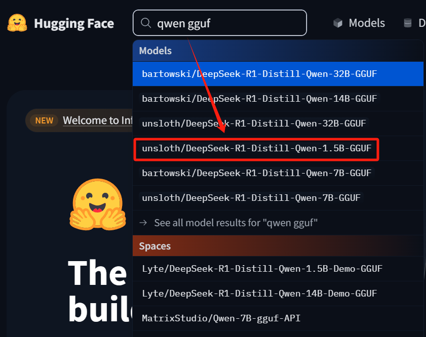
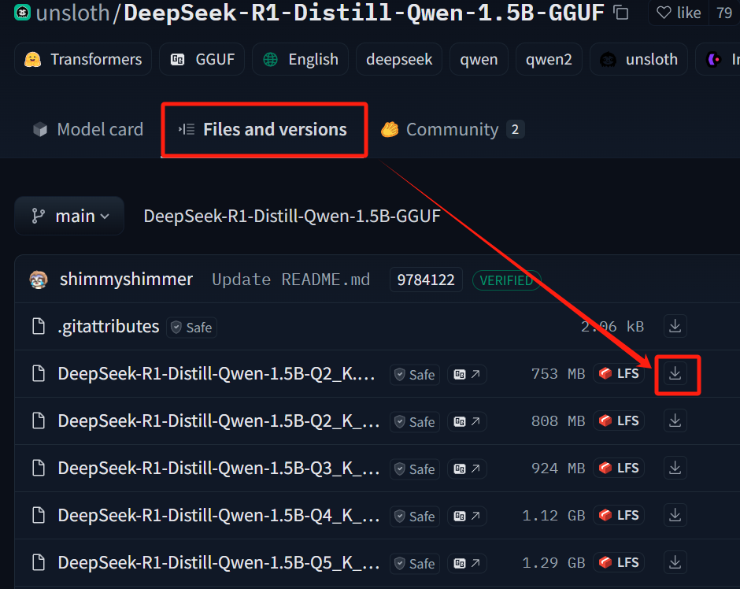

# Overview

Ollama 是一个**本地运行的大模型推理框架**，用于在个人电脑或服务器上高效地运行**开源大语言模型（LLM）**，而无需依赖云计算。它支持**模型下载、运行、管理**，并提供了简洁的 API 供开发者集成。

# Install

[官网下载 Ollama 并安装](https://ollama.com)

# 常用命令

```bash
# 帮助
ollama
ollama -h

# 运行模型
ollama run $LLM
ollama run deepseek-r1:14b

# 创建模型（根据 modelfile）
ollama create $MODEL_NAME -f modelfile

# 列出已安装的模型
ollama list

# 列出正在运行模型
ollama ps

# 停止模型
ollama stop

# 删除模型
ollama rm $LLM
```

# 根据文件部署

- **总体思路**：从 Hugging Face 下载大模型的 `GGUF` 文件，结合 `modelfile`，使用 Ollama 本地部署大模型。

- 创建元数据文件目录 `deepseek`

- 下载大模型的 `GGUF` 文件

  - 进入 [Hugging Face](https://huggingface.co/) 主页，搜索栏输入 `qwen GGUF`，下拉列表中选择 1.5B 版本的 GGUF，进入文件仓库

    

  - 选择 `Files and versions` 选项卡，选择合适版本下载 `GGUF` 文件到开始创建的元数据文件目录 `deepseek`

    

- 进入元数据文件目录 `deepseek`，创建配置文件 `modelfile`，写入如下内容

  ```
  FROM E:\deepseek\DeepSeek-R1-Distill-Qwen-1.5B-Q8-0.gguf
  ```

- 运行 Ollama

- **部署本地模型**，终端进入元数据文件目录 `deepseek`，运行以下命令

  ```
  ollama create deepseek-1.5b -f modelfile.txt
  ```

  **在以上代码中**：

  - `deepseek-1.5b` 为自己命名的大模型名称
  - `modelfile.txt` 为上面创建的配置文件，但注意创建时没有扩展名，即 `modelfile`。

- 部署成功以后，即可正常在 UI 界面（如 Page Assist）中选择 `deepseek-1.5b` 进行