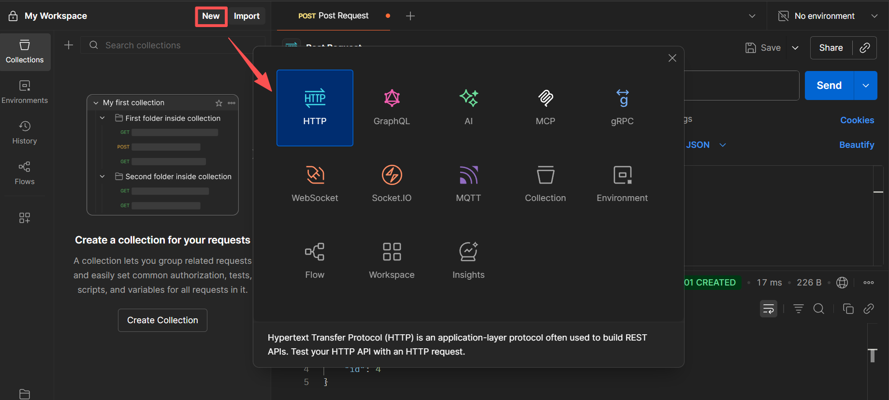
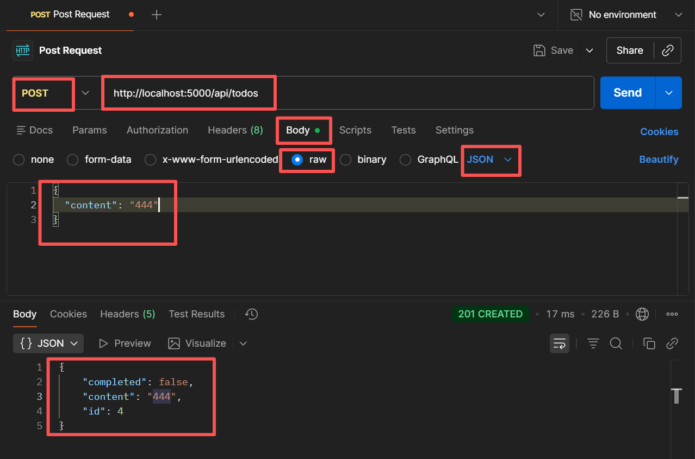

# Postman

Postman 是一个 API 开发工具，用于创建、测试和调试 API。它可以用来发送 HTTP 请求到特定的 API 端点，并查看响应。

## 环境搭建

[官网下载 Postman](https://www.postman.com/downloads/?utm_source=postman-home)

## 使用方法

- 后端已启动，数据库初始化已完成。

- 创建一个 HTTP 服务

  

- 模拟浏览器向后端发送请求

  

- **请求方法**：POST

- **请求地址**：对应后端的 API 接口

- **Body**：即用户要发送的请求内容，以 JSON 格式发送；

- 最后一行是反馈结果，类似于 `console`。
