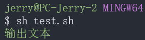

# Shell

## Shell

**Shell 语言**（Shell Scripting Language）是用于编写 Shell 脚本的编程语言。

Shell 语言不是一种单一的、规范的语言，而是一系列 **Unix-like 操作系统命令行解释器** 所使用的编程语言的总称。最常见和最有影响力的是 **Bourne Shell (sh)** 及其衍生品，如 **Bash**、**Zsh**、**Ksh** 等。

## Shell Script

**Shell Script** 是一个包含了一系列 **Shell 命令** 的文本文件。

- `#!/bin/bash`：Shebang，指定解释器。
- `#`，注释，可以在行尾注释。
- **`exec $SHELL`**：执行完毕保持窗口。

## Shell 花括号扩展

**花括号扩展**是 Shell 语言（特指 Bash、Zsh 等）提供的一种**字符串生成机制**，它主要用于方便地创建文件列表、路径或一系列命令参数。它在 Shell **解析命令行时**发生在变量替换和命令执行**之前**。

**注意**：花括号内的元素间不能有空格，否则 Shell 会视为普通字符（例：`{a, b}` 会被解析为 `{a,` 和 `b}` 两个错误字符串）。

### 基本语法

```bash
# 花括号扩展
前缀{项1,项2,项3...}后缀

# 扩展之后
前缀项1后缀 前缀项2后缀 前缀项3后缀 ...
```

### 创建多个同级目录/文件

```bash
# 目录：等价于 mkdir -p a b c（生成3个同级目录）
mkdir -p {a,b,c}

# 文件：等价于 touch file1.txt file2.txt file3.txt（生成3个文件）
touch file{1,2,3}.txt
```

### 共享前缀/后缀

```bash
# 目录：等价于 mkdir -p a/b a/c a/d（a下创建b、c、d子目录）
mkdir -p a/{b,c,d}

# 文件：等价于 touch src/index.js src/app.js src/utils.js（src目录下生成3个JS文件）
touch src/{index,app,utils}.js
```

### 嵌套扩展

```bash
# 目录：生成 a/b/x、a/b/y、a/c（嵌套+平级结合）
mkdir -p a/{b/{x,y},c}

# 最终结构：
a/
├── b/
│   ├── x/
│   └── y/
└── c/

# 扩展为: a1 a2 b1 b2
echo {a,b}{1,2}
```

### 范围扩展

```bash
# 数字范围：生成 dir1~dir5（5个目录）
mkdir -p dir{1..5}

# 字母范围：生成 file_a~file_e（5个文件）
touch file_{a..e}.txt

# 逆序范围：生成 10~6（倒序目录）
mkdir -p num{10..6}

# 步长扩展（Bash 4.0+支持）：生成 2、4、6（步长为2）
mkdir -p step{2..6..2}
```

### 综合示例

```bash
# 前端（React）+ 后端（Flask）+ 数据库（MySQL）目录一次性创建
mkdir -p \
frontend/{public/{static/{css,js,images},favicon.ico},src/{components,hooks,pages,utils}} \
backend/{app/{api,models,config,logs},src,requirements.txt} \
db/{sql,migrations,backup}
```

# CLI

**CLI**（**C**ommand **L**ine **I**nterface，命令行界面），是一种通过输入文本命令与计算机或软件交互的方式。与 **GUI**（图形用户界面）不同，CLI 主要依赖键盘输入命令行指令，而不是鼠标点击操作。

## **CLI 的特点**

- **高效性**：比 GUI 快速，适用于自动化任务。
- **可编写脚本**：CLI 命令可以编写成脚本，自动化执行任务。
- **资源占用低**：比 GUI 需要的计算资源更少。
- **远程操作**：可以通过 SSH 远程管理服务器。
- **精准控制**：提供更细粒度的操作能力。

## CLI 实例

- **Windows** ：CMD、PowerShell、Windows Terminal 和 Git Bash
- **Linux / macOS**：Terminal

## 常识和快捷键

在命令行界面有以下常识和快捷键：

- **大小写**：命令中的大小写不敏感（Windows 中的文件名敏感）
- **`$`**：行首的 `$` 表示终端正在等待输入命令
- **跨行输入**：行尾使用 `\`
- **多条命令**：以 `;` 隔开

<!-- prettier-ignore -->
| 操作 | 快捷键 |
| :---: | :---: |
| ==光标== |  |
| 将光标移动到行首 | <kbd>Home</kbd> \| <kbd>Ctrl</kbd> + <kbd>A</kbd> |
| 将光标移动到行尾 | <kbd>End</kbd> \| <kbd>Ctrl</kbd> + <kbd>E</kbd> |
| ==退出== |  |
| 强制从输出中退出 | <kbd>Ctrl</kbd> + <kbd>C</kbd> |
| 退出系统 | `exit` \| <kbd>Ctrl</kbd> + <kbd>D</kbd> |
| ==复制粘贴== |  |
| 复制 | <kbd>Ctrl</kbd> + <kbd>Shift</kbd> + <kbd>C</kbd> |
| 粘贴 | <kbd>Ctrl</kbd> + <kbd>Shift</kbd> + <kbd>C</kbd> |
| ==删除== |  |
| 删除光标到行首的内容 | <kbd>Ctrl</kbd> + <kbd>U</kbd> |
| 删除光标到行尾的内容 | <kbd>Ctrl</kbd> + <kbd>K</kbd> |
| ==其它== |  |
| 向上/下翻一条命令 | <kbd>↑</kbd> \| <kbd>↓</kbd> |

## Curl

`curl` 是一个用于与网络服务器进行数据交换的命令行工具。

### 下载文件

- 下载并显示文件内容

  ```bash
  curl http://example.com/file.txt
  ```

- 下载的文件，并按原文件名保存

  ```bash
  curl -O http://example.com/file.txt
  ```

- 下载的文件，并按指定路径和文件名保存

  ```bash
  curl -o myfile.txt http://example.com/file.txt
  ```

### 上传文件

- 上传文件

  ```bash
  curl -X POST -F "file=@myfile.txt" http://example.com/upload
  ```

## tldr

**tldr** 是一个简化的命令行工具，名字来源于 "Too Long; Didn't Read"，旨在提供比传统 `man` 页面更简洁、更实用的命令帮助信息。

- 安装

  ```bash
  sudo apt update && sudo apt full-upgrade
  sudo apt install tldr
  ```

- 升级

  ```bash
  tldr --update
  ```

- 使用（以 `apt` 为例）

  ```bash
  tldr apt
  ```

# 命令

<!-- prettier-ignore -->
| 操作 | 命令 |
| :---: | :---: |
| ==目录== |  |
| 进入目录 | `cd` |
| 创建目录 | `mkdir` |
| 删除空目录 | `rmdir` |
| 删除非空目录 | `rm -r` |
| 列出目录内容 | `ls` |
| 列出目录内容（含隐藏） | `ls -al` |
| ==文件== |  |
| 创建文件 | `touch` |
| 复制文件 | `cp` |
| 移动文件 | `mv` |
| 删除文件 | `rm` |
| ==其它== |  |

# 命令选项

- `-rf` 选项是 `-r` 和 `-f` 的组合

  - `-r` 选项，以确保递归删除子目录和文件。
  - `-f` 选项，强制删除。

- `-y`：默认同意

# 目录

## 目录命令

```bash
# 创建目录
mkdir [PATH] FOLDER_NAME
# 删除空目录
rmdir [PATH] FOLDER_NAME
# 删除非空目录
rm -r [PATH] FOLDER_NAME
# 列出目录内容
ls [-al] # -al列出隐藏内容
```

## 创建目录

```bash
# 创建 b 目录（必须有 a）
mkdir a/b

# 递归创建缺失的目录（缺哪个创建哪个）
mkdir -p a/b

# 创建多个目录：a 和 b
mkdir a b
```

## 路径

- **命令**：`cd`
- **示例**
  - Linux：`cd /Home/USER_NAME`
  - Windows：`cd C:/Users/USER_NAME`
- **分隔符**

  - `/`：Linux、Unix、Windows、macOS、Android、IOS、URL 等都支持
  - `\`：仅 Windows 支持，且为默认

- **大小写敏感**

  - 敏感：Linux、Unix、Android、iOS
  - 不敏感：Windows、macOS

- **路径符号**

  - 显示当前工作目录的绝对路径：`pwd`
  - 根目录：

    - Linux：`cd /`
    - Windows：`cd X:/`（`x` 为驱动器名称）

  - User 目录：

    - Linux：`cd ~` 或 `Home/$USER_NAME`
    - Windows：`cd ~` 或 `C:/Users/#USER_NAME`

  - 当前目录：`cd .` （在当前目录操作可省略路径）
  - 上级目录：`cd ..`
  - 上一次工作目录：`cd -`

- **引用文件**

  - 上级：`../my-image.jpg`
  - 同级：`./my-image.jpg` 或 `my-image.jpg`（基于当前目录的相对路径可省略 `./`）
  - 子目录：`./subdirectory/my-image.jpg` 或 `subdirectory/my-image.jpg`

### 路径转义

- 如果路径中包含空格，需要使用转义字符 `\` 或者引号来避免错误。例如进入 `VMware Tools` 目录：

  ```bash
  # 使用反斜杠 \ 转义
  cd /media/jerry/VMware\ Tools
  
  # 使用单引号 ' 转义
  cd '/media/jerry/VMware Tools'
  
  # 使用双引号 " 转义
  cd "/media/jerry/VMware Tools"
  ```

- 关于 `'` 和 `"` 的区别

  - `'` 会**完全保留**其中的字符，不进行任何特殊的处理或扩展（例如，变量不会被展开）。
  - `"` 会允许其中的变量进行扩展和某些特殊字符的处理（例如 `$HOME` 会被展开为实际路径）。

# 文件

## 文件基础

- **基础命令**

  ```bash
  # 查看文件
  cat $FILE
  # 创建文件
  touch $FILE
  # 编辑文件
  nano $FILE
  vim $FILE
  # 删除文件
  rm $FILE
  # 复制文件
  cp $FILE $DES_PATH
  ```

- **文本搜索**

  ```bash
  grep CONTENT
  ```

- 替换

  `sed`：流编辑器，用于对文本进行流式处理；`-i`：在原文件修改；`s`：替换；`g` ：全局替换

  ```bash
  sed -i 's/SOURCE_CONTENT/NEW_CONTENT/g' 'PATH/FILE'
  # e.g.
  sed -i 's/aaa/bbb/g' './html.py' # 将当前目录下的html.py文件中的aaa替换成bbb
  ```

- `echo`：快速向文件添加内容

  ```bash
  echo "[CONTENT]" > [FILE]
  # e.g.
  echo "Hello World!" > demo.txt
  ```

- 查找文件

  ```bash
  find PATH OPTION COMMAND
  # e.g.
  find . -name jquery* -print # 查找当前目录下所有文件名以jquery开头的文件，并打印路径
  ```

# 管道符

**`|`**：管道符，命令输出传递；e.g.：打开 `tmp` 目录中的 `html.py` 文件，然后找出字符串 `jquery-1.11.3.min.js`

```bash
cat /tmp/html.py | grep jquery-1.11.3.min.js
```

# 变量

## 赋值

变量名和等号之间不能有空格。

```bash
NAME="World"
AGE=30
```

## 引用变量

 使用 `$` 符号来引用变量的值。

```bash
NAME="World"
echo "Hello, $NAME"
```

## 环境变量

使用 `export` 关键字将变量提升为环境变量。仅在当前的 **Shell 会话**（或当前终端窗口）及其派生出的子进程中有效。

```bash
export PATH="/usr/local/bin:$PATH"
```

### 用户名和密码

避免在历史记录 (Shell History) 或脚本中直接暴露敏感的用户名和 Token。虽然它们不是永久的，但对于单次会话中的多次操作非常实用。

以下是一个 Helm 登录 GitLab Container Registry 的示例：

**慎用！！！第一次用就导致网页端无法登录！！！**

- 设置环境变量

  ```bash
  export GL_USERNAME="<Your_GitLab_Username>"
  export GL_TOKEN="<Your_Personal_Access_Token>"
  ```

- 使用环境变量

  ```bash
  helm registry login registry.gitlab.com \
    --username "${GL_USERNAME}" \
    --password-stdin <<< "${GL_TOKEN}"
  # 如果您没有使用环境变量，您可以直接输入：
  # helm registry login registry.gitlab.com -u <Your_GitLab_Username>
  # (然后会提示您输入密码/PAT)
  ```

# 控制结构

## 选择结构

使用方括号 `[ ... ]` 或双层方括号 `[[ ... ]]` 进行条件测试。

```bash
if [ -f "venv/bin/activate" ]; then
    # Linux/macOS/Git Bash
    source venv/bin/activate
elif [ -f "venv/Scripts/activate" ]; then
    # Windows (WSL 或部分环境可能需要)
    source venv/Scripts/activate
else
    echo "错误：无法找到虚拟环境激活脚本。"
    exit 1
fi
```

## 循环结构

```bash
for file in *.log; do
    echo "Processing $file"
done

i=0
while [ $i -lt 5 ]; do
    echo $i
    i=$((i + 1)) # Bash 算术扩展
done
```

# 函数

```bash
my_function() {
    echo "Executing function with argument: $1"
    return 0
}

my_function "test_value"
```

# 关键字

## `echo`

### 基本实现

`echo` 用于在标准输出（终端）上打印文本。

```bash
echo "输出文本"
```

### `-e`

`-e` 选项用于启用 `echo` 命令的**转义功能**。以下是改变输出文本样式的示例：

```bash
echo -e "\033[1;32m输出文本\033[0m"
```


