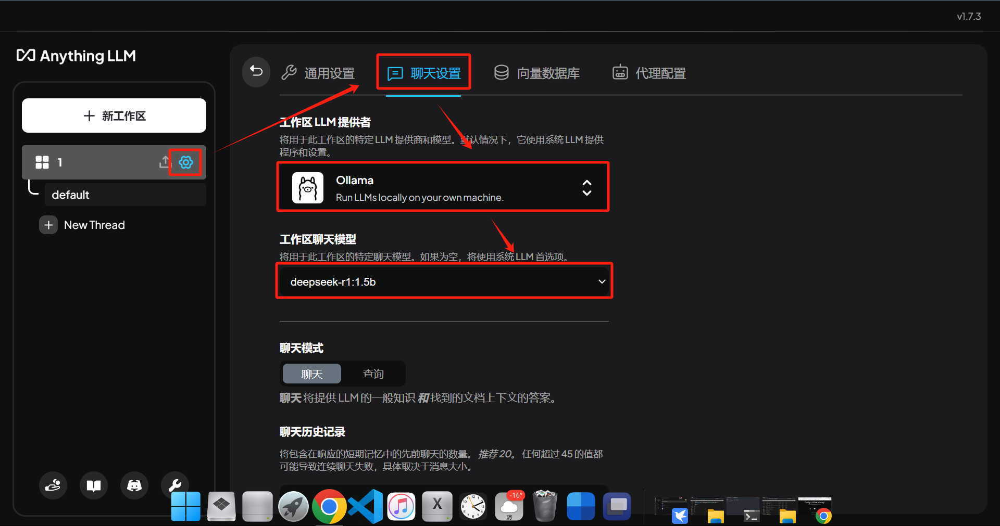
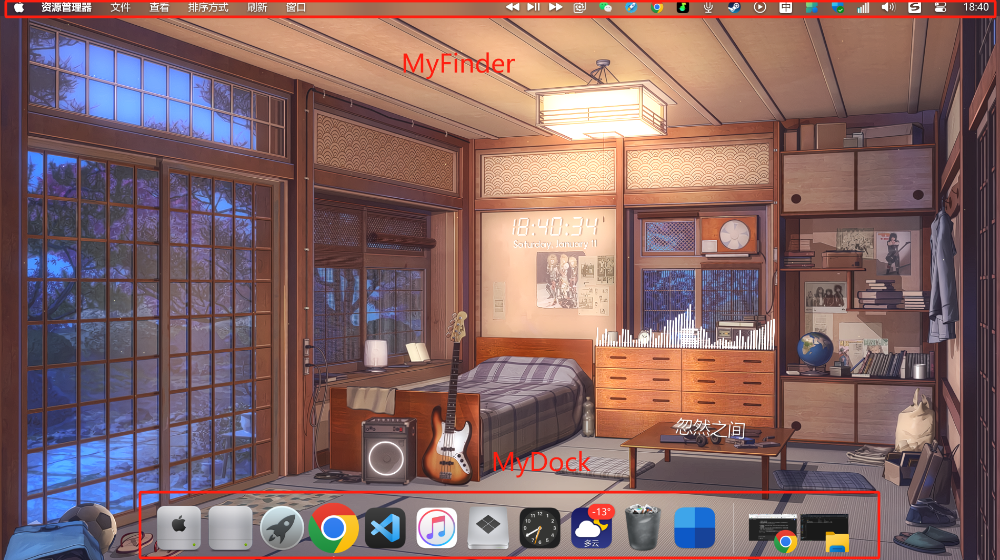
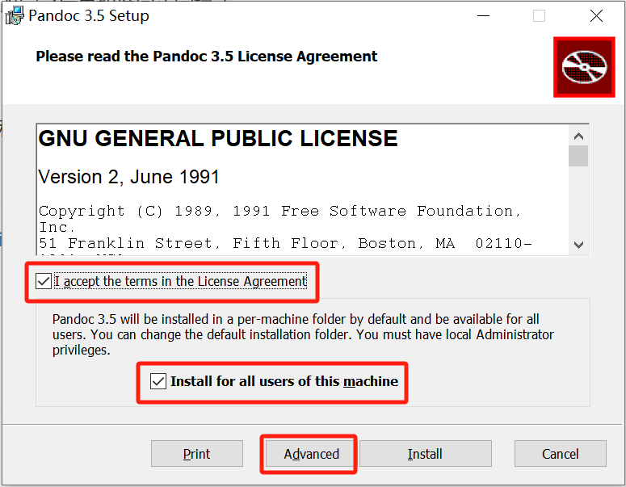
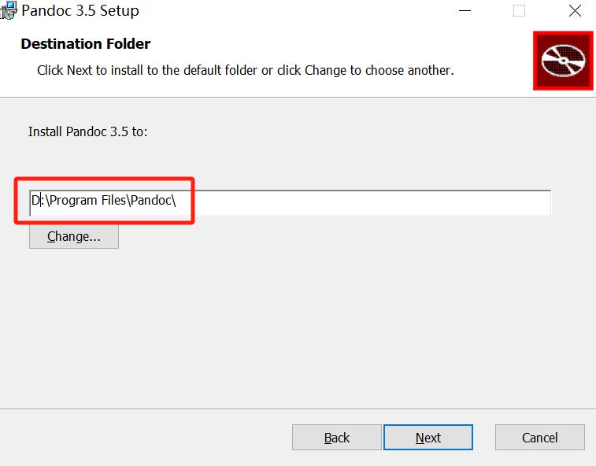
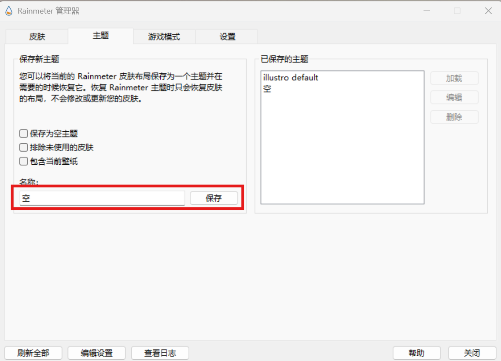
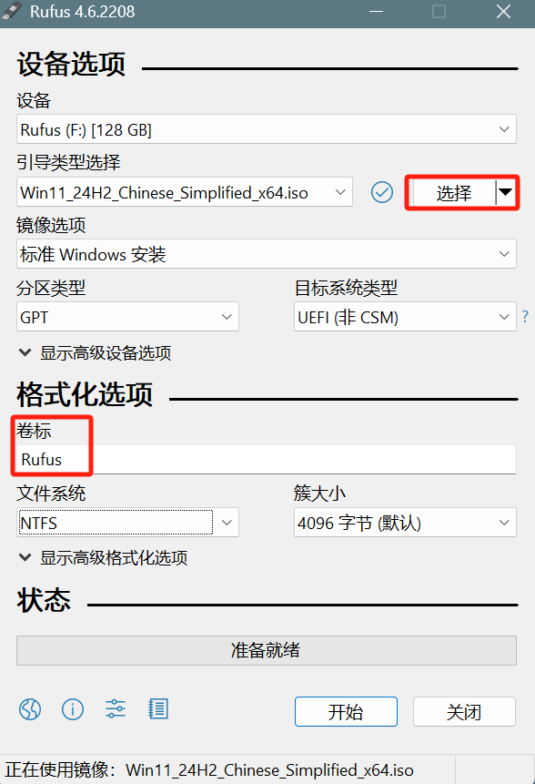
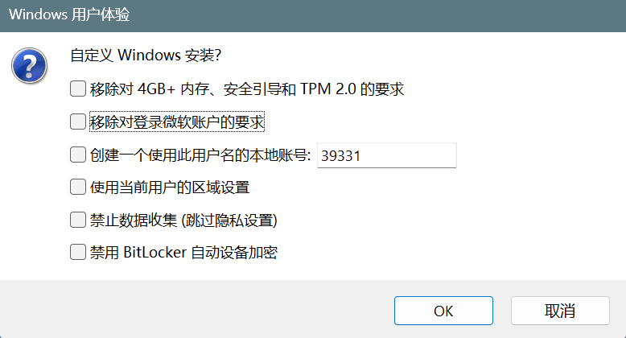
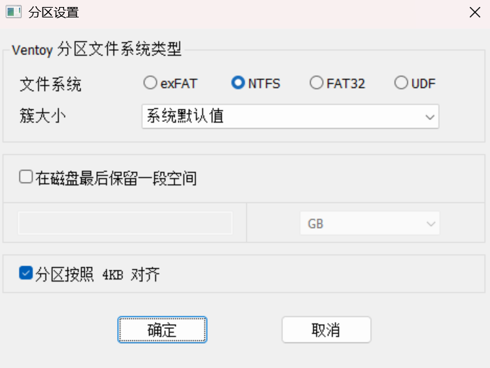

# 通用

## 说明

- 这是一个软件学习笔记的合集。
- 不是特别多的笔记内容都集中在这一个笔记中。
- 每个 1 级标题都是一个软件，以首字母排序。

## Task list

- **Daily**

  - [ ] slack dev-misc

- **Shell Script**

  - [ ] Windows
  - [ ] Linux

- **System**

  - [ ] ssh linux
  - [ ] rdp windows

- **Net**

  - [ ] domain name、IP、DNS
  - [ ] server
  - [ ] nslookup

- 2925 邮箱
  - 2925 邮箱是一个可以无限接收的邮箱，用于反复注册。
  - 比如注册的邮箱账号是 example@2925.com。
  - 那么任何发送到 `example + 任意字符@2925.com` （如 example001@2925.com）的邮件，都会发送到 example@2925.com 邮箱里。

# AnythingLLM

**AnythingLLM** 是一个 **本地部署的知识库管理和 AI 助手**，可以让大语言模型（LLM）与本地文件、笔记、文档等数据进行交互。它支持 **Ollama、GPT-4、Claude** 等多个 LLM 作为后端，可以用来搭建一个 **私人 AI 助手**，从本地知识库中查找信息并回答问题。

## 环境搭建

- [官网下载并安装 AnythingLLM](https://anythingllm.com/desktop)
- 确保 Ollama 和 Deepseek 已安装，添加模型（以 Deepseek 为例）

  

- 拉倒最底部，点击 `Update Workspace`。

# Deepseek

## 环境搭建

- 确保 Ollama 已安装
- 安装 Deepseek

  ```bash
  ollama run deepseek-r1:1.5b
  ```

- 在 UI 界面添加 Deepseek 大模型，如 AnythingLLM 和 Page Assist。

# DiskGenius

DiskGenius 是一款功能强大的磁盘管理工具。主要有以下功能：

- 磁盘分区
- 数据恢复
- 磁盘修复
- 磁盘克隆与恢复

# Emmet

[**Emmet**](https://emmet.io/) 是一款用于提高 Web 开发效率的工具，它可以通过简短的缩写语法快速生成 HTML 和 CSS 代码片段。它最初由 Sergey Chikuyonok 开发，前身是 **Zen Coding**，后更名为 Emmet。如今，它已经成为许多主流编辑器（如 VS Code）的内置工具。

- **使用**：`缩写 | Tap` 或 `缩写 | Enter`
- **基础语法规则**

  <!-- prettier-ignore -->
  | 符号 | 描述 | 示例 | 结果 |
  | :---: | :---: | :---: | :---: |
  | `>` | 子元素 | `div>p` | `<div><p></p></div>` |
  | `+` | 兄弟元素 | `div+p` | `<div></div><p></p>` |
  | `*` | 多个相同元素 | `div*2` | `<div></div><div></div>` |
  | `{}` | 文本内容 | `p{Hello}` | `<p>Hello</p>` |
  | `[]` | 添加属性 | `input[type="text"]` | `<input type="text">` |
  | `()` | 分组 | `div>(header+footer)` | `<div><header></header><footer></footer></div>` |

- **常用缩写**

  <!-- prettier-ignore -->
  | 示例 | 描述 | 结果 |
  | :---: | :---: | :---: |
  | `!` | HTML5 文档结构 | 自动生成 HTML5 标准结构 |
  | `HTML:5` | HTML5 文档结构 | 自动生成 HTML5 标准结构 |
  | `div` | 元素 | `<div></div>` |
  | `div*2` | 多个同级元素 | `<div></div><div></div>` |
  | `ul>li*2` | 列表 | `<ul><li></li><li></li></ul>` |
  | `input[type="text"]` | 带属性的元素 | `<input type="text">` |
  | `div.class` | 带 `class` 属性的元素 | `<div class="class"></div>` |
  | `div#id` | 带 `id` 属性的元素 | `<div id="id"></div>` |
  | `div>p` | 子元素 | `<div><p></p></div>` |
  | `div+p` | 兄弟元素 | `<div></div><p></p>` |
  | `div>(p+p)` | 分组 | `<div><p></p><p></p></div>` |

- **缩写包围**

  ```html
  <div class="one">block</div>
  <div class="two">block</div>
  <div class="three">inline-block</div>
  <div class="four">inline-block</div>
  <div class="five">none</div>
  ```

  ```html
  <div>
    <div class="one">block</div>
    <div class="two">block</div>
    <div class="three">inline-block</div>
    <div class="four">inline-block</div>
    <div class="five">none</div>
  </div>
  ```

  - 修改 Emmet 缩写包围快捷键
    - 按下 `Ctrl + Shift + P`（macOS：`Cmd + Shift + P`）打开命令面板。
    - 搜索并选择 `Emmet: Wrap with Abbreviation`。
    - 修改快捷键为 `Ctrl + Shift + A`，注意删除热键冲突。
  - 选中包围内容，按 `Ctrl + Shift + A`
  - 在弹出的输入框中，输入想要使用的 Emmet 缩写，按 `Enter` 确认。

# Everything

**Everything** 是一款由 Voidtools 开发的 Windows 文件搜索工具，它最大的特点就是**搜索速度极快**，基本上能做到“输入即结果”。

- [官网下载 Everything](https://www.voidtools.com/zh-cn/)
- 印象中可用于批量修改文件名，但最后一次不会用了，也许是记错了。

# Google Chrome

## 管理搜索引擎

- `设置` > `搜索引擎` > `管理搜索引擎和网站搜索`
- 可以在浏览器地址栏输入关键词配合快捷键，实现在特定网站搜索，如 `g chrome使用技巧`

## 快捷键

<!-- prettier-ignore -->
| 操作 | 快捷键 |
| :---: | :---: |
| 显示 / 隐藏书签栏 | <kbd>Ctrl</kbd> + <kbd>Shift</kbd> + <kbd>P</kbd> |
| 添加书签 | <kbd>Ctrl</kbd> + <kbd>D</kbd> |
| 操作 | <kbd>?</kbd> + <kbd>?</kbd> |

## Google Search Engine

- Google 搜索引擎是全球最大的搜索引擎。
- 搜索特定网站的特定内容，如 `intitle:"google使用教程" site:youtube.com`

## 扩展

- **Adblock Plus**：广告拦截器
- **Infinity 新标签页 (Pro)**：新标签页定制
- **Dark Reader**：为每个网站启用暗色模式
- **Google 翻译**
- **划词翻译**
- **沉浸式翻译**
- **Markdown Viewer**
- **Material Simple Dark Grey**：黑色主题
- **OneTab**：把不活动的网页暂时冻结在一起
- **Screenshot YouTube**：YouTube 截屏
- **YouTube Summary with ChatGPT & Claude**：总结 YouTube 视频内容
- **复制受保护的文本**：自由复制
- **篡改猴**
- **迅雷下载支持**

## Experiments

**Experiments** 指的是 Chrome 内置的一整套**实验性功能机制**，主要通过访问 chrome://flags 向用户暴露**尚未完全稳定、但已经可试用**的新特性或新实现方式。

### `Auto Dark Mode for Web Contents`

`Auto Dark Mode for Web Contents` 选项用于设置强制将浏览器背景色设置为深色，目前使用 `Enabled with selective image inversion` 效果，抵抗 Google Cloud Docs 无法调整背景色的问题。

# Grafana

**Grafana** 是一款开源的数据可视化与监控平台，能将来自 Prometheus、MySQL、Elasticsearch 等多种数据源的数据，转化为美观、可交互的仪表盘（Dashboard），广泛用于应用性能监控（APM）、系统资源监控、业务数据可视化等场景。

# MDN

[**MDN**](https://developer.mozilla.org/zh-CN/) (**M**ozilla **D**eveloper **N**etwork)，全称 **MDN Web Docs**，是一个为 Web 开发者提供权威的、开放的、免费的技术文档网站。

最初由 **Mozilla 基金会**（也就是开发 Firefox 浏览器的组织）创建和维护，后来，MDN 的发展不再仅仅依赖 Mozilla，而是由 **MDN Web Docs 社区** 维护，并且由 **Mozilla、谷歌、微软、三星等公司**共同支持。

> <details>
>   <summary>
>     <a
>       href="https://developer.mozilla.org/zh-CN/docs/Web"
>       alt="MDN Web"
>       title="MDN Web"
>       >Web 技术</a
>     >：Web 主页面
>   </summary>
>   <ul>
>     <li>
>       <a
>         href="https://developer.mozilla.org/zh-CN/docs/Web/HTML"
>         alt="MDN HTML"
>         title="MDN HTML"
>         >HTML</a
>       >：HTML 主页面
>     </li>
>     <li>
>       <a
>         href="https://developer.mozilla.org/zh-CN/docs/Web/CSS"
>         alt="MDN CSS"
>         title="MDN CSS"
>         >CSS</a
>       >：CSS 主页面
>     </li>
>     <li>
>       <a
>         href="https://developer.mozilla.org/zh-CN/docs/Web/JavaScript"
>         alt="MDN JavaScript"
>         title="MDN JavaScript"
>         >JavaScript</a
>       >：JavaScript 主页面
>     </li>
>     <li>
>       <a
>         href="https://developer.mozilla.org/zh-CN/docs/Web/API"
>         alt="MDN API"
>         title="MDN API"
>         >Web APIs</a
>       >：Web APIs 主页面
>     </li>
>   </ul>
> </details>
>
> <details>
>   <summary>
>     <a
>       href="https://developer.mozilla.org/zh-CN/docs/MDN"
>       alt="MDN Web 文档项目"
>       title="MDN Web 文档项目"
>       >MDN Web 文档项目</a
>     >：文档项目主页面
>   </summary>
>   <ul>
>     <li>
>       <a
>         href="https://developer.mozilla.org/zh-CN/docs/MDN/Tutorials"
>         alt="Web 开发教程"
>         title="Web 开发教程"
>         >Web 开发教程</a
>       >：面向纯新手的教程
>     </li>
>     <li>
>       <a
>         href="https://developer.mozilla.org/zh-CN/docs/Web/CSS"
>         alt="Web 开发者指南"
>         title="Web 开发者指南"
>         >Web 开发者指南</a
>       >：最简单的新手指导
>     </li>
>   </ul>
> </details>
> [学习 Web 开发](https://developer.mozilla.org/zh-CN/docs/Learn_web_development "学习 Web 开发")
>
> [MDN Web 文档术语表](https://developer.mozilla.org/zh-CN/docs/Glossary "MDN Web 文档术语表")：Web 相关术语的定义
>
> [浏览器扩展](https://developer.mozilla.org/zh-CN/docs/Mozilla/Add-ons/WebExtensions)

## 页面导航

- **docs（无该页）**
  - [MDN Web 文档术语表](https://developer.mozilla.org/zh-CN/docs/Glossary)：Web 术语
  - [学习 Web 开发](https://developer.mozilla.org/zh-CN/docs/Learn_web_development "学习 Web 开发")：新手的学习路线
    - [入门模块](https://developer.mozilla.org/zh-CN/docs/Learn_web_development/Getting_started)
    - [Web 入门](https://developer.mozilla.org/zh-CN/docs/Learn_web_development/Getting_started/Your_first_website)
    - [核心模块](https://developer.mozilla.org/zh-CN/docs/Learn_web_development/Core)
    - [使用 HTML 构建 Web](https://developer.mozilla.org/zh-CN/docs/Learn_web_development/Core/Structuring_content)
    - [扩展模块](https://developer.mozilla.org/zh-CN/docs/Learn_web_development/Extensions)
    - [常见问题](https://developer.mozilla.org/zh-CN/docs/Learn_web_development/Howto)
  - [面向开发者的 Web 技术](https://developer.mozilla.org/zh-CN/docs/Web)：Web 根页面
    - [HTML](https://developer.mozilla.org/zh-CN/docs/Web/HTML)
    - [CSS](https://developer.mozilla.org/zh-CN/docs/Web/CSS)
    - [JavaScript](https://developer.mozilla.org/zh-CN/docs/Web/JavaScript)
    - [Web APIs](https://developer.mozilla.org/zh-CN/docs/Web/API)
    - [MathML](https://developer.mozilla.org/zh-CN/docs/Web/MathML)
  - [MDN Web 文档项目](https://developer.mozilla.org/zh-CN/docs/MDN)
    - [教程](https://developer.mozilla.org/zh-CN/docs/MDN/Tutorials "教程")：教程
    - [指南](https://developer.mozilla.org/zh-CN/docs/MDN/Guides "Web 开发者指南")：Web 开发者指南
  - [Mozilla](https://developer.mozilla.org/zh-CN/docs/Mozilla)
  - [游戏开发](https://developer.mozilla.org/zh-CN/docs/Games)
- [MDN 课程](https://developer.mozilla.org/en-US/curriculum/)（只有英文版才有）

## 学习 Web 开发

[学习 Web 开发](https://developer.mozilla.org/zh-CN/docs/Learn_web_development "学习 Web 开发")文档包含[入门模块](https://developer.mozilla.org/zh-CN/docs/Learn_web_development/Getting_started)、[核心模块](https://developer.mozilla.org/zh-CN/docs/Learn_web_development/Core)、[扩展模块](https://developer.mozilla.org/zh-CN/docs/Learn_web_development/Extensions)及其它等多个模块。

[学习 Web 开发](https://developer.mozilla.org/zh-CN/docs/Learn_web_development "学习 Web 开发")根页面部分是作为新手的学习路线：

- [配置环境](https://developer.mozilla.org/zh-CN/docs/Learn_web_development/Getting_started/Environment_setup)
- [Web 入门](https://developer.mozilla.org/zh-CN/docs/Learn_web_development/Getting_started/Your_first_website)
- [HTML——为 Web 提供结构](https://developer.mozilla.org/zh-CN/docs/Learn_web_development/Core/Structuring_content "使用 HTML 构建 Web")
- [CSS——为 Web 提供样式](https://developer.mozilla.org/zh-CN/docs/Learn_web_development/Core/Styling_basics "CSS 构建")
- [JavaScript——动态客户端脚本语言](https://developer.mozilla.org/zh-CN/docs/Learn_web_development/Core/Scripting "创建 JavaScript 代码块")：`核心模块` 中的 `使用 JavaScript 添加脚本交互`
- [Web 表单——操作用户数据](https://developer.mozilla.org/zh-CN/docs/Learn_web_development/Extensions/Forms "Web 表单构建块")：`扩展模块` 中的 `Web 表单`
- [无障碍——让每个人都能使用 Web](https://developer.mozilla.org/zh-CN/docs/Learn_web_development/Core/Accessibility "无障碍")：`核心模块` 中的 `无障碍`
- [Web 性能优化——让网站更快做出响应](https://developer.mozilla.org/zh-CN/docs/Learn_web_development/Extensions/Performance "Web 性能")：`扩展模块` 中的 `Web 性能`
- [MathML](https://developer.mozilla.org/zh-CN/docs/Web/MathML "MathML")：`面向开发者的 Web 技术` 中的 `MathML`
- [工具和测试](https://developer.mozilla.org/zh-CN/docs/Learn_web_development/Extensions/Testing "跨浏览器测试")：`扩展模块` 中的 `测试`
- [服务器端网站编程](https://developer.mozilla.org/zh-CN/docs/Learn_web_development/Extensions/Server-side "服务器端网站编程")：`扩展模块` 中的 `服务器端网站编程`
- “涵盖的主题”之外行文中的扩展：
  - [客户端 Web 开发工具](https://developer.mozilla.org/zh-CN/docs/Learn_web_development/Extensions/Client-side_tools "理解客户端 web 开发工具")：`扩展模块` 中的 `理解客户端工具`
  - [客户端 JavaScript 框架](https://developer.mozilla.org/zh-CN/docs/Learn_web_development/Core/Frameworks_libraries "JavaScript 客户端和函数库")：`核心模块` 中的 `JavaScript 框架和库`
  - [常见问题](https://developer.mozilla.org/zh-CN/docs/Learn_web_development/Howto "常见问题")：`学习 Web 开发` 中的 `如何解决常见问题`

## 面向开发者的 Web 技术

[面向开发者的 Web 技术](https://developer.mozilla.org/zh-CN/docs/Web)：Web 根页面

# MongoDB

MongoDB 是一种非关系型数据库管理系统（NoSQL），使用的是 **文档导向模型**，以 BSON（Binary JSON，二进制 JSON）格式展示数据。

## 环境搭建

### 安装 MongoDB

- 此步骤为在 Ubuntu 中安装
- 导入 MongoDB 公钥

  ```bash
  wget -qO - https://www.mongodb.org/static/pgp/server-7.0.asc | sudo apt-key add -
  ```

- 创建 MongoDB 的列表文件

  ```bash
  echo "deb [ arch=amd64 ] https://repo.mongodb.org/apt/ubuntu $(lsb_release -cs)/mongodb-org/7.0 multiverse" | sudo tee /etc/apt/sources.list.d/mongodb-org-7.0.list
  ```

- 更新包数据库

  ```bash
  sudo apt-get update
  ```

- 安装 MongoDB

  ```bash
  sudo apt-get install -y mongodb-org
  ```

- 安装 MongoDB Shell

  ```bash
  sudo apt-get install mongodb-mongosh
  ```

- 启动 MongoDB 服务

  ```bash
  sudo systemctl start mongod
  ```

- 设置 MongoDB 服务开机自启动

  ```bash
  sudo systemctl enable mongod、
  ```

- 查看状态

  ```bash
  sudo systemctl status mongod
  ```

## MongoDB 基础

- **MongoDB 管理**

  ```bash
  # 查看 mongod 版本
  mongod --version
  # 查看 MongoDB Shell 版本
  mongo --version
  # 查看 status
  sudo systemctl status mongod

  # 启动
  sudo systemctl start mongod
  # 停止
  sudo systemctl stop mongod
  # 重启
  sudo systemctl restart mongod
  # 启动 MongoDB Shell
  mongosh
  # 退出 MongoDB Shell
  exit
  ```

- **其它命令**

  ```bash
  # 清屏
  cls
  ```

## Database

- **基础命令**

  ```sh
  # 查看所有
  show dbs
  # 进入（如果没有，会自动创建）
  use $DATABASE;
  # 删除
  drop database $DATABASE;
  ```

## Collection

MongoDB 中的 `collection` 类似于 MySQL 中的 `table`。

- **基础命令**

  ```sh
  # 查看 collection
  show collections
  # 创建 Collection / document
  db.$COLLECTION_NAME.insertOne({$KEY1:"$VALUE1"}[,{$KEY2:"$VALUE2"},...])
  # 删除 Collection
  db.$COLLECTION_NAME.drop()
  ```

## Document

MongoDB 中的 `document` 类似于 MySQL 中的 `row`，所有数据以 `document` 形式，按照 BSON 格式存储。不同 `document` **不需要**有相同的结构和字段。

- **基础命令**

  ```bash
  # 查看 document
  db.$COLLECTION_NAME.find()
  
  # 操作第一个 document 用'~One'
  # 操作所有 document 用'~Many'
  
  # 创建 Collection / document
  db.$COLLECTION_NAME.insertOne({$KEY1:"$VALUE1"},{$KEY2:"$VALUE2"},...)
  # 修改 document
  db.$COLLECTION_NAME.updateOne({KEY:"VALUE"},{$set:{KEY1:"VALUE1",KEY2:"VALUE2"}})
  db.$COLLECTION_NAME.updateMany({KEY:"VALUE"},{$set:{KEY1:"VALUE1",KEY2:"VALUE2"}})
  # 删除 document
  db.$COLLECTION_NAME.updateOne({KEY:"VALUE"})
  db.$COLLECTION_NAME.updateMany({KEY:"VALUE"})
  ```

# Mp3tag

[Mp3tag](https://www.mp3tag.de/en/) 是一个音乐标签管理工具。

<!-- prettier-ignore -->
| 变量 | 描述 |
| :---: | :---: |
| FILENAME | 文件名 |
| %album% | 唱片集 |
| %title% | 标题 |
| %artist% | 参与创作的艺术家 |
| %genre% | 流派 |
| %comment% | 备注 |
| %track% | 音轨 |
| %year% | 年 |
| %_total% | xx/xx 曲目编号字段中的曲目总数 |

# MyDockFinder

MyDockFinder 是一款 Windows 平台上的桌面管理工具，可以设置 MyFinder 和 MyDock。



## 环境搭建

- Steam 已安装
- 在 Steam 中购买安装 MyDockFinder

# Nexus

[**Winstep Nexus**](https://www.winstep.net/nexus.asp) 是一款功能强大的桌面增强工具，主要用于创建和管理**动态桌面工具栏**（Dock）。相比传统的 RocketDock，Nexus 更允许被高度定制。

- 不支持拖放图标

# Pandoc

- **Pandoc** 是一个文档转换工具，支持多种文档格式之间的转换。

## 环境搭建

- [下载 pandoc-3.5-windows-x86_64.msi](https://github.com/jgm/pandoc/releases)
- 修改安装路径

  

  

- 点击 `Install` 安装，直到完成
- 验证

  ```bash
  pandoc -v
  ```

## 命令

- **命令**

  ```bash
  # 查看版本
  pandoc -v
  # 帮助
  pandoc --help
  ```

## word 转 MD

- 使用命令行转换

  ```bash
  pandoc 文件名1 -o 文件名2 --extract-media=图片存储路径
  ```

  ```bash
  pandoc 实验.md -o 实验.docx --extract-media=./assets
  ```

  - **`--extract-media`**：可以提取媒体文件并存储到指定路径。

# Podman

- **Podman** 是一个用于管理容器的工具，类似于 Docker。

## 环境搭建

- 安装

  ```bash
  sudo apt install podman
  ```

- 验证

  ```bash
  podman --version
  ```

# PowerToys

[PowerToys](https://learn.microsoft.com/zh-cn/windows/powertoys/) 是微软官方出品的一套**增强型系统工具合集**，适用于 Windows 10 和 Windows 11，目标是帮助**提高工作效率、优化操作体验**。

**安装方法**：

- [在 GitHub 上下载](https://github.com/microsoft/PowerToys)
- 或通过 Microsoft Store 搜索 “PowerToys” 安装最新版。
- 安装后，会在系统托盘显示一个 PowerToys 图标。
- [官方文档](https://learn.microsoft.com/zh-cn/windows/powertoys/)

## PowerRename

[PowerRename](https://learn.microsoft.com/zh-cn/windows/powertoys/powerrename) 用于执行批量重命名、搜索和替换文件名称。

- 右键单击 File Explorer 中的一个或多个选定文件，并选择 **使用 PowerRename 重命名**。
- 可以结合正则表达式批量修改文件名。

## File Locksmith

[File Locksmith](https://learn.microsoft.com/zh-cn/windows/powertoys/file-locksmith) 是一个 Windows shell 扩展，用于检查文件正在被哪些进程使用。

- 有时候想删除一个文件，系统提示正在使用中，无法删除。
- 右键单击 File Explorer 中的一个或多个选定文件，并选择**使用 Locksmith 解锁**。
- 可结束进程。

## Always On Top

[Always On Top](https://learn.microsoft.com/zh-cn/windows/powertoys/always-on-top) 可将窗口固定在其他窗口之上。可使用 `Win + Ctrl + T` 进行激活。

## 颜色选取器

[颜色选取器](https://learn.microsoft.com/zh-cn/windows/powertoys/color-picker)可以提取屏幕中的颜色色值，可使用 `Win + Shift + C` 进行激活。

## 文本提取器

[文本提取器](https://learn.microsoft.com/zh-cn/windows/powertoys/text-extractor)可复制图片中的文本。 可使用 `Win + Shift + T` 进行激活。

## PowerToys Run

[PowerToys Run](https://learn.microsoft.com/zh-cn/windows/powertoys/run) 可帮助立即搜索和打开应用。 可使用 `Alt + Space` 进行激活。

# Prometheus

Prometheus 是一个开源的监控和警报工具，最初由 Sound Cloud 开发。它专为云环境而设计，可以动态发现目标，并收集它们的度量指标，存储这些指标，并提供基于这些指标的警报功能。

## Basics

### Install

- [This part is from NANA, and it is unfinished.](https://www.youtube.com/watch?v=QoDqxm7ybLc)
- **Requirement**

  - Cluster is running.
  - Helm has been installed and the repo 'arldka' is added into local.

- Install

  ```bash
  helm install prometheus arldka/prometheus-operator
  ```

### Install

- [**Source:** This part is from IBM.](https://www.youtube.com/watch?v=VMP48mMBDZw)
- **Requirement:** Git, Docker, Docker Compose
- install

  ```bash
  git clone https://gitlab.com/jerrybai/pmi-prometheus-grafana-sample.git
  cd pmi-prometheus-grafana-sample
  docker-compose up
  ```

- This will build and run 3 containers.
- Access WAS PMI metrics - Prometheus endpoint http://localhost:9080/metrics
- Access Prometheus Server UI [http://localhost:9090](http://localhost:9090/)
- Access Grafana [http://localhost:3000](http://localhost:3000/)

  Login: admin / admin

- Stop

  ```bash
  docker stop grafana prometheus twas_metrics
  ```

- Restart

  ```bash
  docker start grafana prometheus twas_metrics
  ```

# [Rainmeter](https://www.rainmeter.net/)

**Rainmeter** 是一款非常流行的桌面定制软件，主要用于在 Windows 系统上创建并显示动态桌面小部件（Widgets）或皮肤（Skins）。

## 环境搭建

- [官网下载 Rainmeter](https://www.rainmeter.net/)
- 正常安装并运行 Rainmeter
- 关闭所有默认显示的皮肤
- 保存空主题

    

## 相关资源

- [致美化](https://zhutix.com/)
- [htvisualskins](https://visualskins.com/)

# Rufus

Rufus 是一款轻量级、开源的工具。它可以帮助用户将 ISO 镜像文件（例如操作系统安装盘镜像）写入 U 盘，制作启动 U 盘，类似与 Windows 的 U 盘介质。

## 特点

- 按选项安装 Windows
- 无 PE 启动 U 盘

## 功能说明

- **镜像选项（Windows）**

  - **标准 Windows 安装**：即制作正常启动 U 盘。
  - **Windows To Go**：即把系统安装在 U 盘里，得到一个可以完整运行的 Windows 系统。

    - 当把 U 盘变成 Windows To Go 以后，插入任一台电脑，即可使用这个 Windows 系统。
    - **注意**：这台电脑和 Windows To Go 的引导方式要相同。
    - 当完成初始化设置以后，拔出 U 盘，再次插入电脑，运行 Rufus，即可把 Windows To Go 保存为 VHDX 镜像，供给 Ventoy 使用。

- **持久分区大小（Linux）**：当 Linux 以 Live CD 运行时，用来保存 Live 运行时所做的修改。否则关机后会丢失所有修改。
- **分区类型**

  - **GPT**：对应 UEFI 引导
  - **MBR**：对应传统 BIOS 引导

- **高级设备选项**

  - **显示 USB 外置硬盘**：如果插入的是移动硬盘且无法识别，即可勾选此项。
  - **启用对旧 BIOS 修正**：这是对传统 BIOS 引导的优化，提高兼容性。

- **卷标**：即 U 盘名称
- **高级格式化选项**

  - **创建扩展的标签和图标文件**：把 U 盘图标变成 Rufus

## 使用步骤

- [官网下载 Rufus 工具](https://rufus.ie/zh/)
- 电脑插入已备份的 U 盘（制作时会格式化）
- 双击已下载的 `.exe` 文件，免安装打开工具
- 配置安装选项

  - 选择 U 盘驱动器和 ISO 镜像文件，修改卷标（U 盘名称）

      

  - 如果不是老电脑，`分区类型` 和 `目标系统类型` 按工具默认选择即可
  - 点击 `开始`
  - 弹出选项窗口，选择需要的选项，点击 `确定`。

      

- Rufus 会将 ISO 镜像文件写入 U 盘并创建启动盘。
- 将 U 盘插入待做系统的电脑，从 U 盘启动做系统（注意此工具不是 PE，只能像 Windows 官网安装介质那样做系统）。

# SQLite

**SQLite** 是一个轻量级的关系型数据库管理系统（RDBMS），它的主要特点是：

- **嵌入式**：直接内嵌在应用里，无需安装。
- **无需安装**：因为 SQLite 是一个库而非服务器，它直接访问数据库文件，所以无需额外的安装配置。
- **服务器独立**：数据存储在一个 `.db` 文件中，如果数据库文件不存在，SQLite 会自动创建它。

## SQLite 环境搭建

### 容器化 SQLite

- Docker 已成功搭建，详见 [Docker > 环境搭建](../devops/docker/docker.md#环境搭建)。
- 运行容器

  ```bash
  docker run -d -v $(pwd):/tmp --name sqlite-container -it jitesoft/sqlite:latest /tmp/test.db
  ```

  **在以上代码中**：

  - **`--name sqlite-container`**：指定容器的名字
  - **`-v $(pwd):/tmp`**：挂载到本地当前文件夹下的 `tmp`，但是本次实验没有挂载成功。
  - **`/tmp/test.db`**：容器中 `test.db` 的位置
  - **`-d`**：让容器在后台运行
  - **`-it`**：以交互模式运行命令，并且分配一个伪终端。
  - **`jitesoft/sqlite:latest`**：镜像

- 如果想在命令行中操作 SQLite，可进入容器内 SQLite 交互界面。

  ```bash
  docker exec -it sqlite-container sqlite3
  ```

  **在以上代码中**：

  - **`-it`**：以交互模式运行命令，并且分配一个伪终端。
  - **`sqlite-container`**：容器名
  - **`sqlite3`**：SQLite 命令行客户端

    ```bash
    sqlite>
    ```

- 退出 SQLite 交互界面

  ```bash
  sqlite> .exit
  ```

## SQLite 基础

- 无需安装。
- 在连接 SQLite 时，如果数据库不存在，会立即创建一个空数据库。
- **常用命令**

  ```sql
  -- 退出 SQLite 交互界面
  .exit
  
  -- 查看所有数据库
  .database
  
  -- 查看数据库中的所有表
  .tables
  
  -- 查看某个表的结构
  .schema tbl1
  ```

## SQLite 交互方式

- **命令行客户端**：`sqlite3`
- **编程语言客户端**：如 Python 的 `pymysql`
- **ORM**：如 Python 的 `sqlalchemy`
- **GUI 工具**：如 `Navicat`

## SQLite 命令样板

- **直接创建 Database**

  ```sql
  sqlite3 db_users.db
  ```

- **在程序中创建 Database（如果数据库文件不存在，会直接创建）**

  ```sql
  conn = sqlite3.connect('db_users.db')
  ```

- **创建 Table**

  ```sql
  CREATE TABLE IF NOT EXISTS tb_users (
      id INTEGER PRIMARY KEY AUTOINCREMENT,
      username VARCHAR(16) NOT NULL UNIQUE,
      password VARCHAR(255) NOT NULL
  );
  ```

## SQLite 可视化

### VSCode 插件查看

- VSCode 安装 `SQLite Viewer` 插件；
- 双击 `SQLite` 的 `.db` 文件；
- 此插件只支持查看，不支持修改。

### Navicat Premium Lite

# Trae

TRAE 是由字节跳动推出的一款 IDE。它不仅仅是在传统编辑器上增加 AI 功能，而是从底层开始就以 AI 为核心构建的。

- Chat：使用**自然语言**与 AI  交互
- Builder：使用**内置工具**借助 AI 自动开发
- Builder with MCP：调用**第三方 MCP 工具**借助 AI 自动开发

> [Trae 文档](https://docs.trae.cn/ide/what-is-trae?_lang=zh)

# [TranslucentTB](https://translucenttb.com/)

**TranslucentTB** 是一款免费的 Windows 桌面工具，主要用于自定义 Windows 任务栏的外观，特别是实现任务栏的透明效果。

# Ventoy

## Ventoy 基础

Ventoy 是一个开源的工具，主要用于创建多重引导 USB 启动盘。与传统的方式不同，Ventoy 不需要你为每个操作系统或工具单独创建启动盘，而是只需将 ISO 文件复制到 USB 驱动器，然后通过 Ventoy 启动这些 ISO 文件。

## 制作 Ventoy U 盘

- 下载并解压 Ventoy。
- 将 USB 驱动器插入电脑，运行 `Ventoy2Disk.exe` 安装到 USB 上。

  - **安全启动**：选中。
  - **分区类型**：GPT。
  - **分区文件系统类型**：Ventoy U 盘的分区类型；为了保证新台式机安装系统成功，选 NTFS。

      

- 将你需要的 ISO 镜像文件直接复制到 USB 驱动器中。
- 重启电脑，选择从 USB 启动，Ventoy 会显示一个菜单让你选择要启动的 ISO 文件。

## 配置 Ventoy U 盘

- 运行 `VentoyPlugson.exe` 配置制作好的 Ventoy U 盘。

## Ventoy 启动菜单

在使用 **Ventoy** 时，选择了一个启动项后进入了如下的菜单：

- **Boot in normal mode**：标准启动模式，适用于大多数操作系统和工具。
- **Boot in wimboot mode**：wimboot 模式，用于从 Windows WIM 文件启动，适用于 Windows PE 或安装镜像。
- **Boot in memdisk mode**：memdisk 模式，将 ISO 文件加载到内存中启动，适用于旧版操作系统或某些特殊工具。
- **File checksum**：文件校验，用于验证 ISO 文件的完整性，确保文件没有损坏。
- **Return to previous menu**：返回到主菜单或前一个菜单，供你重新选择启动选项。

# Wallpaper Engine

**Wallpaper Engine** 是一款非常流行的桌面壁纸管理工具。

## 环境搭建

- Steam 已安装
- 在 Steam 中购买安装 Wallpaper Engine

## 使用方式

- 在选择 Wallpaper Engine 中选择 `创意工坊`
- 选中喜欢的壁纸，点击 `订阅`。
- 待下载完成，点击 `确认` 即可。

# Wiki

**Wiki** 是一种可通过浏览器访问并由用户协同编辑其内容的网站。包括[维基百科](https://zh.wikipedia.org/wiki/Wikipedia:首页)、[维基词典](https://zh.wiktionary.org/wiki/Wiktionary:首页)、[维基教科书](https://zh.wikibooks.org/wiki/Wikibooks:首页)、[维基语录](https://zh.wikiquote.org/wiki/Wikiquote:首页)、[维基共享资源](https://commons.wikimedia.org/wiki/首页)、[维基新闻](https://zh.wikinews.org/zh-cn/Wikinews:首页)、[维基文库](https://zh.wikisource.org/zh-hans/Wikisource:首页)、[维基物种](https://species.wikimedia.org/wiki/首页)、[维基数据](https://www.wikidata.org/wiki/Wikidata:Introduction/zh)、[维基导游](https://zh.wikivoyage.org/wiki/首页)及[元维基](https://meta.wikimedia.org/wiki/Main_Page/zh)。

## 维基百科

### 添加后缀

在维基百科 URL 添加后缀可搜索固定内容：

- **主题示例**：`https://zh.wikipedia.org/wiki/Portal:主题名`
- **主题**：`Portal:主题名`
- **模板**：`Template:模板名`

# XAMPP

XAMPP 是一个流行的免费开源的跨平台软件包，用于搭建和运行 Web 服务器环境。XAMPP 包含了 Apache HTTP 服务器、MySQL 数据库、PHP 和 Perl 等工具，以及一些其他必要的组件，使用户能够在本地计算机上轻松地搭建和运行 Web 应用程序。

## 使用方法

- **环境搭建**

  - [官网下载 XAMPP](https://www.apachefriends.org/download.html)
  - 安装之前把以前的 MySQL 清理干净

- 启动 XAMPP，启动 `Apache` 和 `MySQL`；

  

- 进入 `Admin` 新建一个数据库，其余交给后端；

# Xmind

Xmind 是一个思维导图工具。

# YouTube

YouTube 是 Google 旗下的全球最大的视频网站。

## 快捷键

<!-- prettier-ignore -->
| 操作 | YouTube 快捷键 |
| :---: | :---: |
| 快捷键查询 | <kbd>?</kbd> |
| 减速播放 | <kbd><</kbd> |
| 加速播放 | <kbd>></kbd> |
| 快速跳转至播放进度的 0% ~ 90% | <kbd>0</kbd> ~ <kbd>9</kbd> |
| 全屏模式 | <kbd>F</kbd> |
| 迷你模式 | <kbd>I</kbd> |
| 字幕 | <kbd>C</kbd> |
| 静音 | <kbd>M</kbd> |

## 插件

### YouTube Summary with ChatGPT & Claude


- 获取逐字稿
- 获取视频摘要并让 GPT 提取

### Picture-in-Picture Extension (by Google)

- 画中画：`Alt + P`

### Screenshot YouTube

- 截屏

### PocketTube: Youtube Subscription Manager

- 订阅分组

### 沉浸式翻译

- 双语字幕

## 其它技巧

内容区域：


