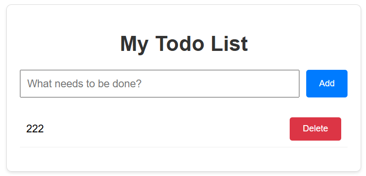

# 项目概述

## 项目概述

Todo Fullstack 是一个完整的全栈 Web 应用原型，采用 GitOps 理念设计和部署，展示了如何使用现代 DevOps 工具链构建、部署和管理一个完整的 Web 应用，涵盖了从开发到生产环境的全流程。



## 项目特点

- **模块化设计**：前后端分离，便于独立开发和部署
- **容器化实现**：所有组件均容器化，确保环境一致性
- **GitOps 实践**：代码即基础设施，自动化部署和同步
- **多环境支持**：支持开发、测试和生产环境的部署
- **支持多种部署方式**：Docker Compose、Kubernetes、Helm Chart、Argo CD
- **可扩展性**：使用 Kubernetes 和 Helm 实现应用的水平扩展

## 技术栈

### 前端技术栈

- **框架**：React
- **构建工具**：Vite
- **样式**：CSS
- **容器化**：Docker + Nginx

### 后端技术栈

- **框架**：Flask (Python)
- **数据库**：MySQL
- **ORM**：SQLAlchemy
- **迁移工具**：Flask-Migrate (Alembic)
- **API**：RESTful API
- **容器化**：Docker

### 部署技术栈

- **容器编排**：Docker Compose, Kubernetes
- **GitOps**：Argo CD
- **包管理**：Helm
- **CI/CD**：GitLab CI
- **Cloud**：GCP, Cloud SQL, Terraform

## 项目结构

```
todo-fullstack/
│
├── argo-cd/                # Argo CD 部署配置
│   ├── chart-app.yaml      # Helm Chart Argo CD 应用配置
│   └── k8s-app.yaml        # Kubernetes Argo CD 应用配置
│
├── backend/                # 后端代码目录
│   ├── app/                # 后端应用目录
│   │   ├── api/            # API 路由目录
│   │   │   ├── __init__.py # API 蓝图文件
│   │   │   └── rutes.py    # API 路由文件
│   │   ├── __init__.py     # 后端应用初始化文件
│   │   └── models.py       # 数据库模型文件
│   ├── migrations/         # 数据库迁移目录
│   ├── boot.sh             # 后端启动脚本
│   ├── config.py           # 后端配置文件
│   ├── Dockerfile          # 后端 Docker 镜像构建文件
│   ├── requirements.txt    # 后端依赖列表
│   └── run.py              # 后端入口文件
│
├── frontend/               # 前端代码目录
│   ├── src/                # 前端应用代码
│   │   ├── App.css         # 主组件样式表
│   │   ├── App.jsx         # 主组件
│   │   └── main.jsx        # 前端入口文件
│   ├── Dockerfile          # 前端 Docker 镜像构建文件
│   ├── index.html          # 前端入口 HTML 文件
│   ├── nginx.conf          # 前端请求反向代理（容器化环境）
│   ├── package.json        # npm 依赖
│   └── vite.config.js      # 前端请求代理（本地环境）
│
├── k8s/                    # Kubernetes 部署文件
│   ├── backend.yaml        # 后端部署配置
│   ├── frontend.yaml       # 前端部署配置
│   ├── mysql.yaml          # MySQL 部署配置
│   └── namespace.yaml      # 命名空间配置
│
├── terraform/              # GCP 的 Terraform 部署文件
│   ├── .terraform.lock.hcl # 依赖锁定文件
│   ├── api.tf              # GCP API
│   ├── argo-cd.tf          # Argo CD 配置文件
│   ├── cloud-sql.tf        # Cloud SQL 配置文件
│   ├── gke.tf              # GKE 配置文件
│   ├── iam.tf              # GCP 权限配置文件
│   ├── terraform.tf        # Provider 版本配置文件
│   ├── todo-app.tf         # Argo CD 的 CR 资源配置文件
│   └── variables.tf        # Terraform 变量
│
├── helm-chart/             # Helm Chart 目录
│   ├── templates/          # Kubernetes 资源模板目录
│   │   ├── namespace.yaml  # 命名空间配置模板
│   │   ├── _helpers.tpl    # 模板函数
│   │   ├── mysql.yaml      # MySQL 部署配置模板
│   │   ├── backend.yaml    # 后端部署配置模板
│   │   └── frontend.yaml   # 前端部署配置模板
│   ├── Chart.yaml          # Chart 元数据
│   └── values.yaml         # 模板文件参数配置
│
├── .env                    # 环境变量（未推送至代码仓库）
├── .env.example            # 环境变量示例文件
├── .gitignore              # Git 忽略文件配置
├── .gitlab-ci.yml          # GitLab CI/CD 配置
├── docker-compose.yml      # Docker Compose 配置
└── README.md               # 项目说明文档
```

## 项目存储

- **代码仓库**
  - **GitLab:** https://gitlab.com/jerrybai/todo-fullstack
  - **GitHub:** https://github.com/Jerrybaijy/todo-fullstack

- **镜像仓库**
  - **后端 Image:** https://hub.docker.com/repository/docker/jerrybaijy/todo-fullstack-backend
  - **前端 Image:** https://hub.docker.com/repository/docker/jerrybaijy/todo-fullstack-frontend
  - **项目 Chart:** oci://registry.gitlab.com/jerrybai/todo-fullstack

# 项目准备

## 创建项目根目录

```bash
mkdir d:/projects/todo-fullstack
```

## 初始化 Git 仓库

```bash
cd d:/projects/todo-fullstack
git init --initial-branch=main
touch .gitignore
```

```
# Dependencies
node_modules/
venv/
.venv/

# Python bytecode
__pycache__/
*.pyc
*.pyo
*.pyd

# Build outputs
dist/
build/

# Environment variables
.env

# Logs
logs/
*.log

# IDE files
.vscode/
.idea/
*.swp
*.swo
*~

# Docker
.dockerignore

# Kubernetes
*.kubeconfig
```

## 配置环境变量

配置环境变量：`todo-fullstack/.env`

```bash
cd d:/projects/todo-fullstack
touch .env
```

```toml
# MySQL 数据库配置
DB_HOST=localhost
MYSQL_DATABASE=todo_db
MYSQL_ROOT_PASSWORD=123456
MYSQL_USER=jerry
MYSQL_PASSWORD=000000

# 数据库迁移, flask db init 中的 flask 对应 FLASK_APP
FLASK_APP=run.py
FLASK_ENV=development
SECRET_KEY=change_this_to_a_very_long_random_string
```

同时，为了让协作者知道需要配什么，创建一个 `todo-fullstack/.env.example` (不含真实密码)：

```bash
cd d:/projects/todo-fullstack
touch .env.example
```

```toml
# MySQL 数据库配置
DB_HOST=
MYSQL_DATABASE=todo_db
MYSQL_ROOT_PASSWORD=
MYSQL_USER=
MYSQL_PASSWORD=

# Flask 配置
FLASK_APP=run.py
FLASK_ENV=production

# change_this_to_a_very_long_random_string
SECRET_KEY=
```

# 后端开发

## 创建后端目录结构

```bash
cd d:/projects/todo-fullstack
mkdir -p backend/app/api
```

## 虚拟环境

```bash
cd d:/projects/todo-fullstack/backend

# 提前复制 python-env 脚本到 backend 目录
source python-env
```

## 安装依赖

```bash
cd d:/projects/todo-fullstack/backend
touch requirements.txt
```

```
# requirements.txt

flask==3.0.0
flask-sqlalchemy==3.1.1
flask-migrate==4.0.5
flask-cors==4.0.1
pymysql==1.1.0
cryptography==41.0.7
gunicorn==21.2.0
python-dotenv==1.0.0
```

```bash
pip install -r requirements.txt
```

## `config.py`

后端配置文件 `backend/config.py`

```python
import os
from dotenv import load_dotenv

# 加载环境变量
load_dotenv()

class Config:
    # Flask 配置
    SECRET_KEY = os.environ.get("SECRET_KEY") or "your-secret-key"
    # 获取数据库连接信息
    DB_HOST = os.environ.get("DB_HOST") or "localhost"
    DB_NAME = os.environ.get("MYSQL_DATABASE") or "todo_db"
    DB_USER = os.environ.get("MYSQL_USER") or "root"
    DB_PASS = os.environ.get("MYSQL_PASSWORD") or "password"

    # SQLAlchemy 配置
    SQLALCHEMY_DATABASE_URI = (
        f"mysql+pymysql://{DB_USER}:{DB_PASS}@{DB_HOST}/{DB_NAME}?charset=utf8mb4"
    )
    SQLALCHEMY_TRACK_MODIFICATIONS = False
```

## `__init__.py`

后端应用初始化文件 `app/__init__.py`

```python
from flask import Flask
from flask_sqlalchemy import SQLAlchemy
from flask_migrate import Migrate
from flask_cors import CORS
from config import Config

# 创建数据库实例
db = SQLAlchemy()
# 创建迁移实例
migrate = Migrate()
# 创建 CORS 实例，使用 flask-cors 库启用了跨域资源共享，允许前端跨域请求
cors = CORS()

def create_app(config_class=Config):
    # 创建 Flask 应用
    app = Flask(__name__)
    # 加载配置
    app.config.from_object(config_class)

    # 初始化数据库
    db.init_app(app)
    # 初始化迁移
    migrate.init_app(app, db)
    # 初始化CORS
    cors.init_app(app)

    # 导入模型，确保SQLAlchemy知道所有模型
    from app import models

    # 注册蓝图
    from app.api import bp as api_bp

    app.register_blueprint(api_bp, url_prefix="/api")

    return app
```

## `models.py`

创建数据库模型文件 `app/models.py`

```python
from app import db

# 数据库模型
class Todo(db.Model):
    # 表名
    __tablename__ = "todos"

    # 主键
    id = db.Column(db.Integer, primary_key=True)
    # TODO 内容
    content = db.Column(db.String(200), nullable=False)
    # 完成状态
    completed = db.Column(db.Boolean, default=False)

    def to_dict(self):
        # 转换为字典格式，用于 API 返回
        return {"id": self.id, "content": self.content, "completed": self.completed}
```

## `__init__.py`

创建 API 蓝图文件 `app/api/__init__.py`

```python
from flask import Blueprint

# 创建 API 蓝图
# 注册了 /api 前缀，即 routes.py 中的 /todos 实际路径为 /api/todos
bp = Blueprint("api", __name__)

# 导入路由
from app.api import routes
```

## `routes.py`

后端 API 路由文件 `app/api/routes.py`

- 在 `__init__.py` 创建 API 蓝图时添加了 `/api` 前缀
- 后端的路由 `/todos` 实际上对应的完整相对路径是 `/api/todos`

```python
from flask import jsonify, request
from app import db
from app.models import Todo
from app.api import bp

# 获取所有 TODOs
# 在 __init__.py 中注册了 /api 前缀，此处实际路径为 /api/todos
@bp.route("/todos", methods=["GET"])
def get_todos():
    todos = Todo.query.all()
    return jsonify([todo.to_dict() for todo in todos])

# 创建新 TODO
@bp.route("/todos", methods=["POST"])
def create_todo():
    data = request.get_json() or {}
    if "content" not in data:
        return jsonify({"error": "Content is required"}), 400

    todo = Todo(content=data["content"])
    db.session.add(todo)
    db.session.commit()
    return jsonify(todo.to_dict()), 201

# 更新 TODO
@bp.route("/todos/<int:id>", methods=["PUT"])
def update_todo(id):
    todo = Todo.query.get_or_404(id)
    data = request.get_json() or {}

    if "content" in data:
        todo.content = data["content"]
    if "completed" in data:
        todo.completed = data["completed"]

    db.session.commit()
    return jsonify(todo.to_dict())

# 删除 TODO
@bp.route("/todos/<int:id>", methods=["DELETE"])
def delete_todo(id):
    todo = Todo.query.get_or_404(id)
    db.session.delete(todo)
    db.session.commit()
    return jsonify({"message": "Todo deleted successfully"}), 200
```

## `run.py`

后端入口文件 `backend/run.py`

```python
from app import create_app

app = create_app()

if __name__ == "__main__":
    app.run(host="0.0.0.0", port=5000, debug=True)
```

## MySQL

创建容器化 MySQL 用于开发环境测试，详见 [MySQL 笔记](mysql.md#容器化-mysql)。

```bash
docker run --name todo-mysql-local \
    -e MYSQL_DATABASE=todo_db \
    -e MYSQL_ROOT_PASSWORD=123456 \
    -e MYSQL_USER=jerry \
    -e MYSQL_PASSWORD=000000 \
    -p 3306:3306 \
    -d mysql:8.0
```

## 初始化数据库迁移

在开发环境中初始化数据库迁移

```bash
# 确保虚拟环境已激活
# 确保全新数据库已正常运行

cd d:/projects/todo-fullstack/backend

# 初始化迁移仓库（仅首次需要）,这会在 backend 目录下创建 migrations 目录
flask db init

# 创建迁移脚本：根据 models.py 中的模型定义生成迁移脚本
flask db migrate -m "Initial migration"

# 应用迁移（创建表）：执行迁移脚本，在数据库中创建表结构
flask db upgrade
```

## 后端测试

- 确保 MySQL 已正常运行，初始化数据库迁移已完成。

- 启动后端

  ```bash
  cd d:/projects/todo-fullstack/backend
  source venv/Scripts/activate
  
  python run.py
  ```

- 使用 Postman 模仿前端向后端发送请求，详见 [Postman  笔记](postman.md#使用方法)。

  - 请求方法：POST

  - 请求地址：http://localhost:5000/api/todos

  - 请求体

    ```json
    {
      "content": "111"
    }
    ```

# 前端开发

## 创建前端项目

```bash
# 使用 Vite 创建 React 项目
cd d:/projects/todo-fullstack
npm create vite@latest frontend -- --template react

# 安装依赖
cd d:/projects/todo-fullstack/frontend
npm install
# 安装 axios 用于 API 请求
npm install axios

# 删除 frontend/src 目录中的 assets 目录和 index.css 文件
```

## `App.jsx`

修改主组件 `src/App.jsx`

```jsx
import { useState, useEffect } from "react";
import "./App.css";

// 允许使用环境变量管理 API 地址，默认值为"/api"
const API_BASE_URL = import.meta.env.VITE_API_BASE_URL || "/api";

/**
 * Todo列表应用的主组件
 * 实现了Todo的增删改查功能
 */
function App() {
  // todos状态：存储所有Todo项的数据
  const [todos, setTodos] = useState([]);
  // input状态：存储用户输入的新Todo内容
  const [input, setInput] = useState("");

  // 组件挂载时，从API获取初始Todo列表
  useEffect(() => {
    // 在effect中直接定义异步函数并执行
    const fetchInitialTodos = async () => {
      try {
        const res = await fetch(`${API_BASE_URL}/todos`);
        if (res.ok) {
          const data = await res.json();
          setTodos(data);
        }
      } catch (error) {
        console.error("Failed to fetch todos", error);
      }
    };

    fetchInitialTodos();
  }, []);

  // 添加新的Todo项
  const handleAdd = async () => {
    // 验证输入不为空
    if (!input.trim()) return;

    // 发送POST请求添加Todo
    const res = await fetch(`${API_BASE_URL}/todos`, {
      method: "POST",
      headers: { "Content-Type": "application/json" },
      body: JSON.stringify({ content: input }),
    });

    // 添加成功后更新状态
    if (res.ok) {
      const newTodo = await res.json();
      setTodos([...todos, newTodo]);
      setInput(""); // 清空输入框
    }
  };

  // 切换Todo项的完成状态
  const handleToggle = async (id) => {
    // 发送PUT请求切换完成状态
    const res = await fetch(`${API_BASE_URL}/todos/${id}`, { method: "PUT" });

    // 更新成功后更新状态
    if (res.ok) {
      const updated = await res.json();
      setTodos(todos.map((t) => (t.id === id ? updated : t)));
    }
  };

  // 删除指定ID的Todo项
  const handleDelete = async (id) => {
    // 发送DELETE请求删除Todo
    const res = await fetch(`${API_BASE_URL}/todos/${id}`, {
      method: "DELETE",
    });

    // 删除成功后更新状态
    if (res.ok) {
      setTodos(todos.filter((t) => t.id !== id));
    }
  };

  return (
    <div className="container">
      <h1>My Todo List</h1>

      {/* 输入区域：添加新Todo */}
      <div className="input-group">
        <input
          value={input}
          onChange={(e) => setInput(e.target.value)}
          placeholder="What needs to be done?"
          onKeyPress={(e) => e.key === "Enter" && handleAdd()}
        />
        <button onClick={handleAdd}>Add</button>
      </div>

      {/* Todo列表展示 */}
      <ul>
        {todos.map((todo) => (
          <li key={todo.id} className={todo.completed ? "completed" : ""}>
            {/* Todo内容，点击可切换完成状态 */}
            <span
              onClick={() => handleToggle(todo.id)}
              style={{ cursor: "pointer", flex: 1 }}
            >
              {todo.content}
            </span>
            {/* 删除按钮 */}
            <button
              className="delete-btn"
              onClick={() => handleDelete(todo.id)}
            >
              Delete
            </button>
          </li>
        ))}
      </ul>
    </div>
  );
}

export default App;
```

## `App.css`

修改主组件样式表 `src/App.css`

```css
.container {
  max-width: 500px;
  margin: 50px auto;
  font-family: Arial, sans-serif;
  padding: 20px;
  border: 1px solid #ddd;
  border-radius: 8px;
  box-shadow: 0 2px 4px rgba(0, 0, 0, 0.1);
}
h1 {
  text-align: center;
  color: #333;
}
.input-group {
  display: flex;
  gap: 10px;
  margin-bottom: 20px;
}
input {
  flex: 1;
  padding: 10px;
  font-size: 16px;
}
button {
  padding: 10px 20px;
  cursor: pointer;
  background: #007bff;
  color: white;
  border: none;
  border-radius: 4px;
}
button:hover {
  background: #0056b3;
}
ul {
  list-style: none;
  padding: 0;
}
li {
  display: flex;
  justify-content: space-between;
  align-items: center;
  padding: 10px;
  border-bottom: 1px solid #eee;
}
li.completed span {
  text-decoration: line-through;
  color: #888;
}
.delete-btn {
  background: #dc3545;
  margin-left: 10px;
}
.delete-btn:hover {
  background: #a71d2a;
}

```

## `main.jsx`

修改前端入口文件 `main.jsx`

```jsx
import React from 'react'
import ReactDOM from 'react-dom/client'
import App from './App.jsx'

ReactDOM.createRoot(document.getElementById('root')).render(
  <React.StrictMode>
    <App />
  </React.StrictMode>,
)
```

## `index.html`

修改前端入口 HTML 文件 `frontend/index.html`

```html
<!doctype html>
<html lang="en">
  <head>
    <meta charset="UTF-8" />
    <link rel="icon" type="image/svg+xml" href="/vite.svg" />
    <meta name="viewport" content="width=device-width, initial-scale=1.0" />
    <title>Todo List</title>
  </head>
  <body>
    <div id="root"></div>
    <script type="module" src="/src/main.jsx"></script>
  </body>
</html>
```

## `vite.config.js`

Vite 跨域代理 `frontend/vite.config.js`，用于直接本地运行（**非容器化部署**）时的前后端通信，将前端 `/api` 开头的请求转发到 http://localhost:5000 后端服务。

1. 前端请求: `/api/todos`
2. Vite 代理匹配到 `/api` 前缀
3. 转发到: http://localhost:5000/api/todos

```javascript
import { defineConfig } from 'vite'
import react from '@vitejs/plugin-react'

// https://vite.dev/config/
export default defineConfig({
  plugins: [react()],
  server: {
    proxy: {
      '/api': {
        target: 'http://localhost:5000',
        changeOrigin: true
      }
    }
  }
})
```

## 前端测试

- 确保 MySQL 已正常运行，初始化数据库迁移已完成。

- 后端已启动

  ```bash
  cd d:/projects/todo-fullstack/backend
  source venv/Scripts/activate
  python run.py
  ```

- 启动前端

  ```bash
  cd d:/projects/todo-fullstack/frontend
  npm run dev
  ```

- 访问前端： http://localhost:5173/

- 前后端通信正常，MySQL 数据变化正常。

# Docker Compose

## `boot.sh`

后端启动脚本 `backend/boot.sh`，首先进行数据库迁移。

```bash
#!/bin/bash

# 等待数据库可用
echo "Waiting for database..."
while ! nc -z $DB_HOST 3306; do
  sleep 1
done
echo "Database is ready!"

# 执行数据库迁移
flask db upgrade

# 启动应用
gunicorn -b 0.0.0.0:5000 run:app
```

## `backend/Dockerfile`

后端镜像构建文件 `backend/Dockerfile`

```dockerfile
# 使用 Python 3.10 作为基础镜像
FROM python:3.10-slim

# 安装必要的系统依赖，包括 nc
RUN apt-get update && apt-get install -y --no-install-recommends \
    netcat-traditional \
    && rm -rf /var/lib/apt/lists/*

# 设置工作目录
WORKDIR /app

# 复制依赖文件
COPY requirements.txt .

# 安装依赖
RUN pip install --no-cache-dir -r requirements.txt

# 复制应用代码
COPY . .

# 复制启动脚本
COPY boot.sh /usr/local/bin/
RUN chmod +x /usr/local/bin/boot.sh

# 暴露端口
EXPOSE 5000

# 启动应用
CMD ["boot.sh"]
```

## `nginx.conf`

Nginx 反向代理 `frontend/nginx.conf`，用于**容器化部署**时的前后端通信，将前端 `/api` 开头的请求转发到 http://backend:5000 后端服务。

1. 前端请求: `/api/todos`
2. Nginx 反向代理匹配到 `/api` 前缀
3. 转发到: http://backend:5000/api/todos
4. 通过 Docker 网络访问后端容器

```nginx
server {
    listen 80;
    server_name localhost;

    location / {
        root /usr/share/nginx/html;
        index index.html index.htm;
        try_files $uri $uri/ /index.html;
    }

    # 反向代理 API 请求到后端容器
    location /api {
        proxy_pass http://backend:5000;
        proxy_http_version 1.1;
        proxy_set_header Upgrade $http_upgrade;
        proxy_set_header Connection 'upgrade';
        proxy_set_header Host $host;
        proxy_cache_bypass $http_upgrade;
    }
}
```

## `frontend/Dockerfile`

前端镜像构建文件 `frontend/Dockerfile`

```dockerfile
# 第一阶段：构建 React 应用
FROM node:18-alpine as build

# 设置工作目录
WORKDIR /app

# 复制 package.json 和 package-lock.json
COPY package*.json ./

# 安装依赖
RUN npm install

# 复制应用代码
COPY . .

# 构建应用
RUN npm run build

# 第二阶段：使用 Nginx 提供静态文件
FROM nginx:alpine

# 复制构建产物到 Nginx 静态目录
COPY --from=build /app/dist /usr/share/nginx/html

# 复制自定义 Nginx 配置
COPY nginx.conf /etc/nginx/conf.d/default.conf

# 暴露端口
EXPOSE 80

# 启动 Nginx
CMD ["nginx", "-g", "daemon off;"]
```

## `.env`

修改环境变量：`todo-fullstack/.env`

由于 `docker-compose.yml` 中 MySQL 的服务名变更为 `db`，所以要将 `.env` 中的 `DB_HOST` 由 `localhost` 改为 `db`。

```toml
# MySQL 数据库配置
DB_HOST=db
MYSQL_DATABASE=todo_db
MYSQL_ROOT_PASSWORD=123456
MYSQL_USER=jerry
MYSQL_PASSWORD=000000

# 数据库迁移, flask db init 中的 flask 对应 FLASK_APP
FLASK_APP=run.py
FLASK_ENV=development
SECRET_KEY=change_this_to_a_very_long_random_string
```

## `docker-compose.yml`

容器编排文件 `todo-fullstack/docker-compose.yml`，环境变量获取自 `todo-fullstack/.env`。

```yaml
# 指定 Docker Compose 文件版本
version: "3.8"

services:
  # MySQL 数据库服务
  db:
    image: mysql:8.0
    restart: always
    environment:
      MYSQL_ROOT_PASSWORD: ${MYSQL_ROOT_PASSWORD}
      MYSQL_DATABASE: ${MYSQL_DATABASE}
      MYSQL_USER: ${MYSQL_USER}
      MYSQL_PASSWORD: ${MYSQL_PASSWORD}
    volumes:
      - mysql_data:/var/lib/mysql
    ports:
      - "3306:3306"
    command: --default-authentication-plugin=mysql_native_password
    networks:
      - todo-network
    healthcheck:
      test: ["CMD", "mysqladmin", "ping", "-h", "localhost"]
      timeout: 20s
      retries: 10

  # 后端服务
  backend:
    build:
      context: ./backend
    restart: always
    environment:
      SECRET_KEY: ${SECRET_KEY}
      MYSQL_USER: ${MYSQL_USER}
      MYSQL_PASSWORD: ${MYSQL_PASSWORD}
      DB_HOST: ${DB_HOST}
      MYSQL_DATABASE: ${MYSQL_DATABASE}
      FLASK_APP: ${FLASK_APP}
      FLASK_ENV: ${FLASK_ENV}
    depends_on:
      db:
        condition: service_healthy
    ports:
      - "5000:5000"
    networks:
      - todo-network

  # 前端服务
  frontend:
    build:
      context: ./frontend
    restart: always
    ports:
      - "80:80"
    depends_on:
      - backend
    networks:
      - todo-network

# 数据库挂载卷
volumes:
  mysql_data:
    driver: local

# 定义网络
networks:
  todo-network:
    driver: bridge
```

## 多容器集成测试

- 停止开发环境的 MySQL

- 使用 Docker Compose 构建前端、后端镜像，并启动前端、后端和数据库容器。

  ```bash
  cd d:/projects/todo-fullstack
  docker-compose up -d
  ```

- 外部访问 ：

  - 前端： http://localhost:80
  - 后端：http://localhost:5000/api/todos
  - 数据库： http://localhost:3306

- 停止项目

  停止以后，需在 Docker Desktop 中删除相应的 Image 和 Volume。

  ```bash
  cd d:/projects/todo-fullstack
  docker-compose down
  ```

# GitLab CI

## `.gitlab-ci.yml`

GitLab CI `todo-fullstack/.gitlab-ci.yml`

```yaml
# 定义变量
variables:
  # Docker 版本号
  DOCKER_VERSION: 24.0.5

  # 告诉 Docker 使用 overlay2 驱动，性能更好
  DOCKER_DRIVER: overlay2

  # 禁用 TLS 证书生成，防止 dind 连接报错
  DOCKER_TLS_CERTDIR: ""
  
  # 镜像名称前缀，$DOCKER_HUB_USER 是 GitLab 里配置的环境变量
  IMAGE_PREFIX: $DOCKER_HUB_USER
  
  # 项目名称
  PROJECT_NAME: todo-fullstack

  # 后端和前端名称
  BACKEND_NAME: backend
  FRONTEND_NAME: frontend
  
  # 后端和前端目录
  BACKEND_DIR: backend
  FRONTEND_DIR: frontend

# 定义阶段
stages:
  - build

# 使用 Docker-in-Docker 服务，允许在容器里运行 docker 命令
services:
  - docker:$DOCKER_VERSION-dind

# 登录 Docker Hub
before_script:
  # 使用 stdin 输入密码，更加安全
  - echo "$DOCKER_HUB_TOKEN" | docker login -u "$DOCKER_HUB_USER" --password-stdin

# 构建后端镜像
build_backend:
  stage: build
  image: docker:$DOCKER_VERSION
  script:
    # 进入后端目录
    - cd $BACKEND_DIR
    
    # 使用双标签构建：既有版本号（用于回溯），也有 latest（用于生产）
    - docker build -t $IMAGE_PREFIX/$PROJECT_NAME-$BACKEND_NAME:$CI_COMMIT_SHORT_SHA -t $IMAGE_PREFIX/$PROJECT_NAME-$BACKEND_NAME:latest .
    
    # 推送到 Docker Hub
    - docker push $IMAGE_PREFIX/$PROJECT_NAME-$BACKEND_NAME:$CI_COMMIT_SHORT_SHA
    - docker push $IMAGE_PREFIX/$PROJECT_NAME-$BACKEND_NAME:latest
  rules:
    # 只有当 $BACKEND_NAME 目录下有文件变化时，才运行此 Job
    - changes:
        - $BACKEND_DIR/**/*

# 构建前端镜像
build_frontend:
  stage: build
  image: docker:$DOCKER_VERSION
  script:
    - cd $FRONTEND_DIR
    - docker build -t $IMAGE_PREFIX/$PROJECT_NAME-$FRONTEND_NAME:$CI_COMMIT_SHORT_SHA -t $IMAGE_PREFIX/$PROJECT_NAME-$FRONTEND_NAME:latest .
    - docker push $IMAGE_PREFIX/$PROJECT_NAME-$FRONTEND_NAME:$CI_COMMIT_SHORT_SHA
    - docker push $IMAGE_PREFIX/$PROJECT_NAME-$FRONTEND_NAME:latest
  rules:
    - changes:
        - $FRONTEND_DIR/**/*
```

## 构建

- Docker Compose 测试已完成
- 确认以下文件已创建
  - 后端启动脚本 `backend/boot.sh`
  - 后端镜像构建文件 `backend/Dockerfile`
  - 前端 Nginx 配置文件 `frontend/nginx.conf`
  - 前端镜像构建文件 `frontend/Dockerfile`
  - GitLab CI `todo-fullstack/.gitlab-ci.yml`
- 生成 Docker Hub Token
- 配置 GitLab 环境变量
  - `DOCKER_HUB_USER`
  - `DOCKER_HUB_TOKEN`
- 推送代码至仓库（注意前后端要有变化，以适应 `.gitlab-ci.yml` 文件的规则要求），Pipeline 完成以后查看 Docker Hub。

# 部署

此项目列出了五种部署方式，使用其中一个即可：

- Docker Compose
- K8s + Argo CD
- Chart + Argo CD
- Chart + Argo CD + GCP
- Chart + Argo CD + GCP + Terraform

# Docker Compose 部署

此种部署方式使用 `docker-compose.yml` 和 `.env` 文件，将应用部署到本地容器中。

## 创建目录

```
mkdir d:/projects/0000-tests/todo-remote
cd d:/projects/0000-tests/todo-remote
touch docker-compose.yml .env
```

## `docker-compose.yml`

```yaml
# 指定 Docker Compose 文件版本
version: '3.8'

services:
  # MySQL 数据库服务
  db:
    image: mysql:8.0
    restart: always
    environment:
      MYSQL_ROOT_PASSWORD: ${MYSQL_ROOT_PASSWORD}
      MYSQL_DATABASE: ${MYSQL_DATABASE}
      MYSQL_USER: ${MYSQL_USER}
      MYSQL_PASSWORD: ${MYSQL_PASSWORD}
    volumes:
      - mysql_data:/var/lib/mysql
    ports:
      - "3306:3306"
    command: --default-authentication-plugin=mysql_native_password  
    networks:
      - todo-network
    healthcheck:
      test: ["CMD", "mysqladmin", "ping", "-h", "localhost"]        
      timeout: 20s
      retries: 10

  # 后端服务
  backend:
    # 指定镜像名称
    image: jerrybaijy/todo-fullstack-backend:latest
    restart: always
    environment:
      SECRET_KEY: ${SECRET_KEY}
      MYSQL_USER: ${MYSQL_USER}
      MYSQL_PASSWORD: ${MYSQL_PASSWORD}
      DB_HOST: db
      MYSQL_DATABASE: ${MYSQL_DATABASE}
      FLASK_APP: ${FLASK_APP}
      FLASK_ENV: ${FLASK_ENV}
    depends_on:
      db:
        condition: service_healthy
    ports:
      - "5000:5000"
    networks:
      - todo-network

  # 前端服务
  frontend:
    # 指定镜像名称
    image: jerrybaijy/todo-fullstack-frontend:latest
    restart: always
    ports:
      - "80:80"
    depends_on:
      - backend
    networks:
      - todo-network

# 数据库挂载卷
volumes:
  mysql_data:
    driver: local

# 定义网络
networks:
  todo-network:
    driver: bridge
```

## `.env`

```toml
# MySQL 数据库配置
DB_HOST=db
MYSQL_DATABASE=todo_db
MYSQL_ROOT_PASSWORD=123456
MYSQL_USER=jerry
MYSQL_PASSWORD=000000

# 数据库迁移, flask db init 中的 flask 对应 FLASK_APP
FLASK_APP=run.py
FLASK_ENV=development
SECRET_KEY=change_this_to_a_very_long_random_string
```

## 部署应用

- 删除 **Docker Compose 测试**时的 Image、Container 和 Volumes，余下操作相同。

- 使用 Docker Compose 拉取前端、后端镜像，并启动前端、后端和数据库容器。

  ```bash
  cd d:/projects/0000-tests/todo-remote
  docker-compose up -d
  ```

- 访问应用

  - 前端应用：http://localhost
  - 后端 API：http://localhost:5000/api/todos

- 停止项目

  停止以后，需在 Docker Desktop 中删除相应的 Image 和 Volume。

  ```bash
  cd d:/projects/0000-tests/todo-remote
  docker-compose down
  ```

# K8s + Argo CD 部署

此种部署方式将 K8s 的资源清单推送至 GitLab 代码仓库，使用 Argo CD 部署到 Minikube 集群，同时实现 CI/CD 自动化流程。

## 准备工作

- Minikube 已安装

- Kubectl 已安装

- Argo CD 已安装

## K8s

### 创建 K8s 和 Argo CD 目录

```bash
cd d:/projects/todo-fullstack
mkdir k8s argo-cd

cd d:/projects/todo-fullstack/k8s
touch namespace.yaml mysql.yaml backend.yaml frontend.yaml

cd d:/projects/todo-fullstack/argo-cd
touch k8s-app.yaml
```

### `namespace.yaml`

命名空间 `k8s/namespace.yaml`

```yaml
apiVersion: v1
kind: Namespace
metadata:
  name: todo-ns
  labels:
    name: todo-ns
```

### `mysql.yaml`

数据库部署和服务 `k8s/mysql.yaml`

```yaml
apiVersion: v1
kind: ConfigMap
metadata:
  name: mysql-config
  namespace: todo-ns

data:
  MYSQL_DATABASE: todo_db
  DB_HOST: mysql
---
apiVersion: v1
kind: Secret
metadata:
  name: mysql-secret
  namespace: todo-ns
type: Opaque
stringData:
  MYSQL_ROOT_PASSWORD: "123456"
  MYSQL_USER: jerry
  MYSQL_PASSWORD: "000000"
---
apiVersion: apps/v1
kind: Deployment
metadata:
  name: mysql
  namespace: todo-ns
  labels:
    app: mysql
spec:
  replicas: 1
  selector:
    matchLabels:
      app: mysql
  template:
    metadata:
      labels:
        app: mysql
    spec:
      containers:
        - name: mysql
          image: mysql:8.0
          envFrom:
            - configMapRef:
                name: mysql-config
            - secretRef:
                name: mysql-secret
          ports:
            - containerPort: 3306
          volumeMounts:
            - name: mysql-data
              mountPath: /var/lib/mysql
          args:
            - --default-authentication-plugin=mysql_native_password
          readinessProbe:
            exec:
              command:
                - mysqladmin
                - ping
                - -h
                - localhost
            initialDelaySeconds: 30
            periodSeconds: 10
            timeoutSeconds: 5
            failureThreshold: 3
          livenessProbe:
            exec:
              command:
                - mysqladmin
                - ping
                - -h
                - localhost
            initialDelaySeconds: 60
            periodSeconds: 10
            timeoutSeconds: 5
            failureThreshold: 3
      volumes:
        - name: mysql-data
          emptyDir: {}
---
apiVersion: v1
kind: Service
metadata:
  name: mysql
  namespace: todo-ns
  labels:
    app: mysql
spec:
  selector:
    app: mysql
  ports:
    - port: 3306
      targetPort: 3306
  clusterIP: None
```

### `backend.yaml`

后端部署和服务 `k8s/backend.yaml`

```yaml
apiVersion: v1
kind: Secret
metadata:
  name: backend-secret
  namespace: todo-ns
type: Opaque
stringData:
  SECRET_KEY: your-secret-key
---
apiVersion: apps/v1
kind: Deployment
metadata:
  name: backend
  namespace: todo-ns
  labels:
    app: backend
spec:
  replicas: 2
  selector:
    matchLabels:
      app: backend
  template:
    metadata:
      labels:
        app: backend
    spec:
      containers:
        - name: backend
          image: jerrybaijy/todo-fullstack-backend:latest
          imagePullPolicy: Always
          envFrom:
            - secretRef:
                name: backend-secret
            - configMapRef:
                name: mysql-config
            - secretRef:
                name: mysql-secret
          ports:
            - containerPort: 5000
          readinessProbe:
            httpGet:
              path: /api/todos
              port: 5000
            initialDelaySeconds: 30
            periodSeconds: 10
            timeoutSeconds: 5
            failureThreshold: 3
          livenessProbe:
            httpGet:
              path: /api/todos
              port: 5000
            initialDelaySeconds: 60
            periodSeconds: 10
            timeoutSeconds: 5
            failureThreshold: 3
      initContainers:
        - name: wait-for-mysql
          image: busybox:1.31
          command:
            [
              "sh",
              "-c",
              "until nslookup mysql.$(cat /var/run/secrets/kubernetes.io/serviceaccount/namespace).svc.cluster.local; do echo waiting for mysql; sleep 2; done;",
            ]
---
apiVersion: v1
kind: Service
metadata:
  name: backend
  namespace: todo-ns
  labels:
    app: backend
spec:
  selector:
    app: backend
  ports:
    - port: 5000
      targetPort: 5000
```

### `frontend.yaml`

前端部署和服务 `k8s/frontend.yaml`

```yaml
apiVersion: apps/v1
kind: Deployment
metadata:
  name: frontend
  namespace: todo-ns
  labels:
    app: frontend
spec:
  replicas: 2
  selector:
    matchLabels:
      app: frontend
  template:
    metadata:
      labels:
        app: frontend
    spec:
      containers:
        - name: frontend
          image: jerrybaijy/todo-fullstack-frontend:latest
          imagePullPolicy: Always
          ports:
            - containerPort: 80
          readinessProbe:
            httpGet:
              path: /
              port: 80
            initialDelaySeconds: 10
            periodSeconds: 5
            timeoutSeconds: 3
            failureThreshold: 3
          livenessProbe:
            httpGet:
              path: /
              port: 80
            initialDelaySeconds: 20
            periodSeconds: 10
            timeoutSeconds: 5
            failureThreshold: 3
---
apiVersion: v1
kind: Service
metadata:
  name: frontend
  namespace: todo-ns
  labels:
    app: frontend
spec:
  selector:
    app: frontend
  ports:
    - port: 80
      targetPort: 80
  # 如果公网访问，应将服务类型改为 LoadBalancer
  type: ClusterIP
```

## Argo CD

### `k8s-app.yaml`

ArgoCD 的 CR 配置文件 `argo-cd/k8s-app.yaml`，这个文件引用的是 Git 仓库中 `k8s` 目录中的 K8s 配置文件。

```yaml
apiVersion: argoproj.io/v1alpha1
kind: Application
metadata:
  name: todo-app
  namespace: argocd
  finalizers:
    - resources-finalizer.argocd.argoproj.io
spec:
  project: default
  source:
    repoURL: https://gitlab.com/jerrybai/todo-fullstack.git
    targetRevision: HEAD
    path: k8s
  destination:
    server: https://kubernetes.default.svc
    namespace: todo-ns
  syncPolicy:
    automated:
      selfHeal: true
      prune: true
    syncOptions:
      - CreateNamespace=true
      - ApplyOutOfSyncOnly=true
    retry:
      limit: 5
      backoff:
        duration: 5s
        factor: 2
        maxDuration: 3m
```

## 部署应用

- 将源代码推送至代码仓库

- 部署

  ```bash
  cd d:/projects/todo-fullstack/argo-cd
  kubectl apply -f k8s-app.yaml
  ```

- 外部访问 ：

  - 前端：通过 NodePort、LoadBalancer 或端口转发访问
  - 后端：仅集群内部访问，或通过端口转发临时访问
  - 数据库：仅集群内部访问，或通过端口转发临时访问

- 端口转发

  ```bash
  # 前端
  kubectl port-forward svc/frontend 8081:80 -n todo-ns
  ```

- 访问前端：http://localhost:8081/

- 如有调试需要，也可将后端和数据库进行端口转发

  ```bash
  # 数据库
  kubectl port-forward svc/mysql 3306:3306 -n todo-ns
  # 后端
  kubectl port-forward svc/backend 5000:5000 -n todo-ns
  ```

- 卸载

  ```bash
  cd d:/projects/todo-fullstack/argo-cd
  kubectl delete -f k8s-app.yaml
  ```

# Chart + Argo CD 部署

此种部署方式将 K8s 的资源清单打包为 Helm Chart，并推送至 GitLab Container Registry，使用 Argo CD 部署到 Minikube 集群，同时实现 CI/CD 自动化流程。

## 准备工作

- Helm 已安装

- 源代码开发完成，已将 image 推送至 Docker Hub。

## Helm Chart

### 创建 Chart 目录

- 创建 Chart 目录

  ```bash
  cd d:/projects/todo-fullstack
  helm create helm-chart
  ```

- 删除 `templates` 目录下的全部默认文件

- 保留并修改以下必要文件：

  - `Chart.yaml`：Chart 元数据
  - `values.yaml`：模板文件的参数值
  - `.helmignore`：忽略不需要打包的文件
  - `templates/`：模板文件目录

- 在 `templates` 目录创建以下文件

  ```bash
  cd d:/projects/todo-fullstack/helm-chart/templates/
  touch namespace.yaml _helpers.tpl mysql.yaml backend.yaml frontend.yaml
  ```

### `Chart.yaml`

Chart 的元数据 `helm-chart/Chart.yaml`

```yaml
apiVersion: v2
name: todo-chart
description: A Helm chart for Todo application
version: 0.1.0
type: application
appVersion: "1.0.0"
```

### `values.yaml`

模板文件的参数值 `helm-chart/values.yaml`

```yaml
# 全局配置
global:
  namespace: todo-ns

# MySQL配置
mysql:
  image: mysql
  tag: 8.0
  imagePullPolicy: IfNotPresent
  rootPassword: "123456"
  database: todo_db
  user: jerry
  password: "000000"
  replicaCount: 1
  persistence:
    enabled: true
    size: 1Gi
  service:
    type: ClusterIP
    port: 3306

# Backend配置
backend:
  replicaCount: 2
  image:
    repository: jerrybaijy/todo-fullstack-backend
    tag: latest
    pullPolicy: Always
  service:
    type: ClusterIP
    port: 5000
  env:
    SECRET_KEY: your_secret_key_here

# Frontend配置
frontend:
  replicaCount: 2
  image:
    repository: jerrybaijy/todo-fullstack-frontend
    tag: latest
    pullPolicy: Always
  service:
    type: NodePort
    port: 80
    nodePort: 30080
    # 如果是公网，切换到以下配置
    # type: LoadBalancer
    # port: 80
```

### `namespace.yaml`

命名空间 `templates/namespace.yaml`

```yaml
apiVersion: v1
kind: Namespace
metadata:
  name: {{ .Values.global.namespace }}
  labels:
    name: {{ .Values.global.namespace }}
```

### `_helpers.tpl`

模板函数 `templates/_helpers.tpl`

```tpl
{{/* 定义 Chart 的名称，优先使用 Values.nameOverride，如果不存在则使用 Chart.Name */}}
{{- define "todo-chart.name" }}
{{- default .Chart.Name .Values.nameOverride | trunc 63 | trimSuffix "-" }}
{{- end }}

{{/* 定义 Chart 的完整标识，格式为 Chart.Name-Chart.Version */}}
{{- define "todo-chart.chart" }}
{{- printf "%s-%s" .Chart.Name .Chart.Version | replace "+" "_" | trunc 63 | trimSuffix "-" }}
{{- end }}

{{/* 定义 Chart 的完整发布名称，优先使用 Values.fullnameOverride，如果不存在则根据 Release.Name 和 Chart.Name 生成 */}}
{{- define "todo-chart.fullname" }}
{{- if .Values.fullnameOverride }}
{{- .Values.fullnameOverride | trunc 63 | trimSuffix "-" }}
{{- else }}
{{- $name := default .Chart.Name .Values.nameOverride }}
{{- if contains $name .Release.Name }}
{{- .Release.Name | trunc 63 | trimSuffix "-" }}
{{- else }}
{{- printf "%s-%s" .Release.Name $name | trunc 63 | trimSuffix "-" }}
{{- end }}
{{- end }}
{{- end }}

{{/* 定义 MySQL 组件的完整名称 */}}
{{- define "todo-chart.mysql.fullname" }}
{{- printf "%s-mysql" (include "todo-chart.fullname" .) | trunc 63 | trimSuffix "-" }}
{{- end }}

{{/* 定义 Backend 组件的完整名称 */}}
{{- define "todo-chart.backend.fullname" }}
{{- printf "%s-backend" (include "todo-chart.fullname" .) | trunc 63 | trimSuffix "-" }}
{{- end }}

{{/* 定义 Frontend 组件的完整名称 */}}
{{- define "todo-chart.frontend.fullname" }}
{{- printf "%s-frontend" (include "todo-chart.fullname" .) | trunc 63 | trimSuffix "-" }}
{{- end }}

{{/* 定义基础的标签集合，包含 Chart 信息和 Release 信息 */}}
{{- define "todo-chart.labels" }}
helm.sh/chart: {{ include "todo-chart.chart" . }}
helm.sh/version: {{ .Chart.Version | quote }}
app.kubernetes.io/instance: {{ .Release.Name }}
app.kubernetes.io/managed-by: {{ .Release.Service }}
{{- if .Values.commonLabels }}
{{- toYaml .Values.commonLabels | nindent 2 }}
{{- end }}
{{- end }}

{{/* 定义 MySQL 组件的标签集合，继承基础标签并添加组件特定标签 */}}
{{- define "todo-chart.mysql.labels" }}
{{- include "todo-chart.labels" . }}
app.kubernetes.io/name: {{ include "todo-chart.name" . }}-mysql
app.kubernetes.io/component: mysql
{{- end }}

{{/* 定义 MySQL 组件的选择器标签，用于 Pod 选择 */}}
{{- define "todo-chart.mysql.selectorLabels" }}
app.kubernetes.io/instance: {{ .Release.Name }}
app.kubernetes.io/name: {{ include "todo-chart.name" . }}-mysql
app.kubernetes.io/component: mysql
{{- end }}

{{/* 定义 Backend 组件的标签集合，继承基础标签并添加组件特定标签 */}}
{{- define "todo-chart.backend.labels" }}
{{- include "todo-chart.labels" . }}
app.kubernetes.io/name: {{ include "todo-chart.name" . }}-backend
app.kubernetes.io/component: backend
{{- end }}

{{/* 定义 Backend 组件的选择器标签，用于 Pod 选择 */}}
{{- define "todo-chart.backend.selectorLabels" }}
app.kubernetes.io/instance: {{ .Release.Name }}
app.kubernetes.io/name: {{ include "todo-chart.name" . }}-backend
app.kubernetes.io/component: backend
{{- end }}

{{/* 定义 Frontend 组件的标签集合，继承基础标签并添加组件特定标签 */}}
{{- define "todo-chart.frontend.labels" }}
{{- include "todo-chart.labels" . }}
app.kubernetes.io/name: {{ include "todo-chart.name" . }}-frontend
app.kubernetes.io/component: frontend
{{- end }}

{{/* 定义 Frontend 组件的选择器标签，用于 Pod 选择 */}}
{{- define "todo-chart.frontend.selectorLabels" }}
app.kubernetes.io/instance: {{ .Release.Name }}
app.kubernetes.io/name: {{ include "todo-chart.name" . }}-frontend
app.kubernetes.io/component: frontend
{{- end }}
```

### `mysql.yaml`

数据库模板文件 `templates/mysql.yaml`

```yaml
apiVersion: v1
kind: ConfigMap
metadata:
  name: {{ include "todo-chart.mysql.fullname" . }}-config
  namespace: {{ .Values.global.namespace }}
  labels:
    {{- include "todo-chart.mysql.labels" . | nindent 4 }}

data:
  MYSQL_DATABASE: {{ .Values.mysql.database | quote }}
  DB_HOST: {{ include "todo-chart.mysql.fullname" . }}
---
apiVersion: v1
kind: Secret
metadata:
  name: {{ include "todo-chart.mysql.fullname" . }}-secret
  namespace: {{ .Values.global.namespace }}
  labels:
    {{- include "todo-chart.mysql.labels" . | nindent 4 }}

type: Opaque
stringData:
  MYSQL_ROOT_PASSWORD: {{ .Values.mysql.rootPassword | quote }}
  MYSQL_USER: {{ .Values.mysql.user }}
  MYSQL_PASSWORD: {{ .Values.mysql.password | quote }}
---
apiVersion: apps/v1
kind: Deployment
metadata:
  name: {{ include "todo-chart.mysql.fullname" . }}
  namespace: {{ .Values.global.namespace }}
  labels:
    {{- include "todo-chart.mysql.labels" . | nindent 4 }}

spec:
  replicas: {{ .Values.mysql.replicaCount }}
  selector:
    matchLabels:
      {{- include "todo-chart.mysql.selectorLabels" . | nindent 6 }}
  template:
    metadata:
      labels:
        {{- include "todo-chart.mysql.labels" . | nindent 8 }}
    spec:
      containers:
        - name: mysql
          image: "{{ .Values.mysql.image }}:{{ .Values.mysql.tag }}"
          envFrom:
            - configMapRef:
                name: {{ include "todo-chart.mysql.fullname" . }}-config
            - secretRef:
                name: {{ include "todo-chart.mysql.fullname" . }}-secret
          ports:
            - containerPort: {{ .Values.mysql.service.port }}
          volumeMounts:
            - name: mysql-data
              mountPath: /var/lib/mysql
          # args:
          #   - --default-authentication-plugin=mysql_native_password
          readinessProbe:
            exec:
              command:
                - mysqladmin
                - ping
                - -h
                - localhost
            initialDelaySeconds: 30
            periodSeconds: 10
            timeoutSeconds: 5
            failureThreshold: 3
          livenessProbe:
            exec:
              command:
                - mysqladmin
                - ping
                - -h
                - localhost
            initialDelaySeconds: 60
            periodSeconds: 10
            timeoutSeconds: 5
            failureThreshold: 3
      volumes:
        - name: mysql-data
          emptyDir: {}
---
apiVersion: v1
kind: Service
metadata:
  name: {{ include "todo-chart.mysql.fullname" . }}
  namespace: {{ .Values.global.namespace }}
  labels:
    {{- include "todo-chart.mysql.labels" . | nindent 4 }}

spec:
  selector:
    {{- include "todo-chart.mysql.selectorLabels" . | nindent 6 }}
  ports:
    - port: {{ .Values.mysql.service.port }}
      targetPort: {{ .Values.mysql.service.port }}
  clusterIP: None
```

### `backend.yaml`

后端模板文件 `templates/backend.yaml`

```yaml
apiVersion: v1
kind: Secret
metadata:
  name: {{ include "todo-chart.backend.fullname" . }}-secret
  namespace: {{ .Values.global.namespace }}
  labels:
    {{- include "todo-chart.backend.labels" . | nindent 4 }}
type: Opaque
stringData:
  SECRET_KEY: {{ .Values.backend.env.SECRET_KEY | quote }}
---
apiVersion: apps/v1
kind: Deployment
metadata:
  name: {{ include "todo-chart.backend.fullname" . }}
  namespace: {{ .Values.global.namespace }}
  labels:
    {{- include "todo-chart.backend.labels" . | nindent 4 }}

spec:
  replicas: {{ .Values.backend.replicaCount }}
  selector:
    matchLabels:
      {{- include "todo-chart.backend.selectorLabels" . | nindent 6 }}
  template:
    metadata:
      labels:
        {{- include "todo-chart.backend.labels" . | nindent 8 }}
    spec:
      containers:
        - name: backend
          image: "{{ .Values.backend.image.repository }}:{{ .Values.backend.image.tag }}"
          imagePullPolicy: {{ .Values.backend.image.pullPolicy }}
          envFrom:
            - secretRef:
                name: {{ include "todo-chart.backend.fullname" . }}-secret
            - configMapRef:
                name: {{ include "todo-chart.mysql.fullname" . }}-config
            - secretRef:
                name: {{ include "todo-chart.mysql.fullname" . }}-secret
          ports:
            - containerPort: {{ .Values.backend.service.port }}
          readinessProbe:
            httpGet:
              path: /api/todos
              port: {{ .Values.backend.service.port }}
            initialDelaySeconds: 30
            periodSeconds: 10
            timeoutSeconds: 5
            failureThreshold: 3
          livenessProbe:
            httpGet:
              path: /api/todos
              port: {{ .Values.backend.service.port }}
            initialDelaySeconds: 60
            periodSeconds: 10
            timeoutSeconds: 5
            failureThreshold: 3
      initContainers:
        - name: wait-for-mysql
          image: busybox:1.31
          command:
            [
              "sh",
              "-c",
              "until nslookup {{ include "todo-chart.mysql.fullname" . }}.$(cat /var/run/secrets/kubernetes.io/serviceaccount/namespace).svc.cluster.local; do echo waiting for mysql; sleep 2; done;"
            ]
---
apiVersion: v1
kind: Service
metadata:
  name: {{ include "todo-chart.backend.fullname" . }}
  namespace: {{ .Values.global.namespace }}
  labels:
    {{- include "todo-chart.backend.labels" . | nindent 4 }}

spec:
  selector:
    {{- include "todo-chart.backend.selectorLabels" . | nindent 6 }}
  ports:
    - port: {{ .Values.backend.service.port }}
      targetPort: {{ .Values.backend.service.port }}
```

### `frontend.yaml`

前端模板文件 `templates/frontend.yaml`

由于前端源码把 Nginx 反向代理的后端服务名写死了，而 Helm 是动态生成的后端服务名，所以此处添加了 Nginx 配置的覆盖。

```yaml
apiVersion: v1
kind: ConfigMap
metadata:
  name: {{ include "todo-chart.frontend.fullname" . }}-nginx-config
  namespace: {{ .Values.global.namespace }}
  labels:
    {{- include "todo-chart.frontend.labels" . | nindent 4 }}
data:
  default.conf: |
    server {
        listen 80;
        server_name localhost;

        location / {
            root /usr/share/nginx/html;
            index index.html index.htm;
            try_files $uri $uri/ /index.html;
        }

        # 反向代理 API 请求到后端容器
        location /api {
            proxy_pass http://{{ include "todo-chart.backend.fullname" . }}:{{ .Values.backend.service.port }};
            proxy_http_version 1.1;
            proxy_set_header Upgrade $http_upgrade;
            proxy_set_header Connection 'upgrade';
            proxy_set_header Host $host;
            proxy_cache_bypass $http_upgrade;
        }
    }
---
apiVersion: apps/v1
kind: Deployment
metadata:
  name: {{ include "todo-chart.frontend.fullname" . }}
  namespace: {{ .Values.global.namespace }}
  labels:
    {{- include "todo-chart.frontend.labels" . | nindent 4 }}

spec:
  replicas: {{ .Values.frontend.replicaCount }}
  selector:
    matchLabels:
      {{- include "todo-chart.frontend.selectorLabels" . | nindent 6 }}
  template:
    metadata:
      labels:
        {{- include "todo-chart.frontend.labels" . | nindent 8 }}
    spec:
      containers:
        - name: frontend
          image: "{{ .Values.frontend.image.repository }}:{{ .Values.frontend.image.tag | default .Chart.AppVersion }}"
          imagePullPolicy: {{ .Values.frontend.image.pullPolicy }}
          ports:
            - containerPort: {{ .Values.frontend.service.port }}
          volumeMounts:
            - name: nginx-config
              mountPath: /etc/nginx/conf.d
          readinessProbe:
            httpGet:
              path: /
              port: {{ .Values.frontend.service.port }}
            initialDelaySeconds: 10
            periodSeconds: 5
            timeoutSeconds: 3
            failureThreshold: 3
          livenessProbe:
            httpGet:
              path: /
              port: {{ .Values.frontend.service.port }}
            initialDelaySeconds: 20
            periodSeconds: 10
            timeoutSeconds: 5
            failureThreshold: 3
      volumes:
        - name: nginx-config
          configMap:
            name: {{ include "todo-chart.frontend.fullname" . }}-nginx-config
---
apiVersion: v1
kind: Service
metadata:
  name: {{ include "todo-chart.frontend.fullname" . }}
  namespace: {{ .Values.global.namespace }}
  labels:
    {{- include "todo-chart.frontend.labels" . | nindent 4 }}

spec:
  selector:
    {{- include "todo-chart.frontend.selectorLabels" . | nindent 6 }}
  ports:
    - port: {{ .Values.frontend.service.port }}
      targetPort: {{ .Values.frontend.service.port }}
  type: {{ .Values.frontend.service.type }}
```

### 测试 Chart 文件

- 检查语法

  ```bash
  cd /d/projects/todo-fullstack
  helm lint helm-chart
  ```

- 部署 Helm Release

  ```bash
  cd /d/projects/todo-fullstack
  helm install todo-app helm-chart
  ```

- 查看，所有资源运行正常

  ```bash
  kubectl get all -n todo-ns
  ```

- 端口转发

  ```bash
  # 前端
  kubectl port-forward svc/todo-app-todo-chart-frontend 8081:80 -n todo-ns
  ```

- 访问前端：http://localhost:8081/

- 如有调试需要，也可将后端和数据库进行端口转发

  ```bash
  # 数据库
  kubectl port-forward svc/todo-app-todo-chart-mysql 3306:3306 -n todo-ns
  # 后端
  kubectl port-forward svc/todo-app-todo-chart-backend 5000:5000 -n todo-ns
  ```

- 卸载 Helm Release

  ```bash
  helm uninstall todo-app
  ```

### 封装 Chart

```bash
cd /d/projects/todo-fullstack
helm package helm-chart
```

### 测试本地 Chart 包

```bash
cd /d/projects/todo-fullstack
helm install todo-app todo-chart-0.1.0.tgz

# 卸载
helm uninstall todo-app
```

### 推送 Chart 包

- 配置 GitLab Personal Access Token，详见 [GitLab 笔记](gitlab.md#gitlab-personal-access-tokens)。

- Helm 登录到 GitLab Registry，详见 [Helm 笔记](helm.md#推送-chart)。

- 推送 Chart 包

  ```bash
  cd /d/projects/todo-fullstack
  helm push todo-chart-0.1.0.tgz oci://registry.gitlab.com/jerrybai/todo-fullstack
  ```

### 测试远程 Chart 包

```bash
helm install todo-app oci://registry.gitlab.com/jerrybai/todo-fullstack/todo-chart --version 0.1.0

# 卸载
helm uninstall todo-app
```

## `.gitlab-ci.yml`

在 GitLab CI 时，自动构建 Chart 并推送至 GitLab Container Registry。

- 修改之前的 `.gitlab-ci.yml`
- 添加 Chart 部分
- 将 `before_script` 从全局移到前后端。

```yaml
# 定义变量
variables:
  # Docker 版本号
  DOCKER_VERSION: 24.0.5

  # 告诉 Docker 使用 overlay2 驱动，性能更好
  DOCKER_DRIVER: overlay2

  # 禁用 TLS 证书生成，防止 dind 连接报错
  DOCKER_TLS_CERTDIR: ""
  
  # 镜像名称前缀，$DOCKER_HUB_USER 是 GitLab 里配置的环境变量
  IMAGE_PREFIX: $DOCKER_HUB_USER
  
  # 项目名称
  PROJECT_NAME: todo-fullstack

  # 后端和前端名称
  BACKEND_NAME: backend
  FRONTEND_NAME: frontend

  # 后端和前端目录
  BACKEND_DIR: backend
  FRONTEND_DIR: frontend

  # Helm Chart 名称
  CHART_NAME: todo-chart
  # Helm Chart 目录
  CHART_DIR: helm-chart

  # OCI 仓库地址
  OCI_REGISTRY: registry.gitlab.com/jerrybai/${PROJECT_NAME}

# 定义阶段
stages:
  - build
  - chart-publish

# 使用 Docker-in-Docker 服务，允许在容器里运行 docker 命令
services:
  - docker:$DOCKER_VERSION-dind

# 构建并推送后端镜像
build_backend:
  stage: build
  image: docker:$DOCKER_VERSION
  # 登录 Docker Hub
  before_script:
    # 使用 stdin 输入密码，更加安全
    - echo "$DOCKER_HUB_TOKEN" | docker login -u "$DOCKER_HUB_USER" --password-stdin
  script:
    # 进入后端目录
    - cd $BACKEND_DIR
    
    # 使用双标签构建：既有版本号（用于回溯），也有 latest（用于生产）
    - docker build -t $IMAGE_PREFIX/$PROJECT_NAME-$BACKEND_NAME:$CI_COMMIT_SHORT_SHA -t $IMAGE_PREFIX/$PROJECT_NAME-$BACKEND_NAME:latest .
    
    # 推送到 Docker Hub
    - docker push $IMAGE_PREFIX/$PROJECT_NAME-$BACKEND_NAME:$CI_COMMIT_SHORT_SHA
    - docker push $IMAGE_PREFIX/$PROJECT_NAME-$BACKEND_NAME:latest
  rules:
    # 只有当 $BACKEND_NAME 目录下有文件变化时，才运行此 Job
    - changes:
        - $BACKEND_DIR/**/*

# 构建并推送前端镜像
build_frontend:
  stage: build
  image: docker:$DOCKER_VERSION
  # 登录 Docker Hub
  before_script:
    # 使用 stdin 输入密码，更加安全
    - echo "$DOCKER_HUB_TOKEN" | docker login -u "$DOCKER_HUB_USER" --password-stdin
  script:
    - cd $FRONTEND_DIR
    - docker build -t $IMAGE_PREFIX/$PROJECT_NAME-$FRONTEND_NAME:$CI_COMMIT_SHORT_SHA -t $IMAGE_PREFIX/$PROJECT_NAME-$FRONTEND_NAME:latest .
    - docker push $IMAGE_PREFIX/$PROJECT_NAME-$FRONTEND_NAME:$CI_COMMIT_SHORT_SHA
    - docker push $IMAGE_PREFIX/$PROJECT_NAME-$FRONTEND_NAME:latest
  rules:
    - changes:
        - $FRONTEND_DIR/**/*

# 构建并推送 Helm Chart
publish_chart:
  stage: chart-publish
  image:
    name: alpine/helm:3.12.3
    # 设置正确的 entrypoint 以便执行 shell 命令
    entrypoint: ["/bin/sh", "-c"]
  needs:
    # 如果 build_backend 的结果为 Passed 或 Skipped，都可以执行 publish_chart
    # 否则 publish_chart 的结果直接为 Skipped
    - job: build_backend
      optional: true
    - job: build_frontend
      optional: true
  script:
    # 进入 Helm Chart 目录
    - cd $CHART_DIR
    
    # 配置 Helm 使用 GitLab Container Registry
    - helm registry login registry.gitlab.com -u $CI_REGISTRY_USER -p $CI_REGISTRY_PASSWORD
    
    # 检查 Chart 语法
    - helm lint .
    
    # 安装 yq 工具用于解析 Chart.yaml
    - apk add --no-cache yq
    
    # 从 Chart.yaml 中读取基础版本号
    - CHART_VERSION=$(yq e '.version' Chart.yaml)
    
    # 生成最终版本号（基础版本号 + SHA）
    - SHA_VERSION="${CHART_VERSION}-${CI_COMMIT_SHORT_SHA}"
    # latest 版本号（最大版本号 + latest）
    - LATEST_VERSION="99.99.99-latest"
    
    # 打包 Chart
    - helm package . --version "${SHA_VERSION}"
    - helm package . --version "${LATEST_VERSION}"
    
    # 推送 Chart 到 GitLab Container Registry
    - helm push ${CHART_NAME}-${SHA_VERSION}.tgz oci://${OCI_REGISTRY}
    - helm push ${CHART_NAME}-${LATEST_VERSION}.tgz oci://${OCI_REGISTRY}

  rules:
    # 以下任何一个目录更新时，都运行此 Job（前提是满足 needs 条件）
    - changes:
        - $CHART_DIR/**/*
    - changes:
        - $BACKEND_DIR/**/*
    - changes:
        - $FRONTEND_DIR/**/*
```

## `chart-app.yaml`

Argo CD 的 CR 配置文件 `argo-cd/chart-app.yaml`，这个文件引用的是 GitLab Container Registry 中的 Helm Chart 包。

```yaml
apiVersion: argoproj.io/v1alpha1
kind: Application
metadata:
  name: todo-app
  namespace: argocd
  finalizers:
    - resources-finalizer.argocd.argoproj.io
spec:
  project: default
  source:
    repoURL: registry.gitlab.com/jerrybai/todo-fullstack
    targetRevision: "99.99.99-latest"
    chart: todo-chart

  destination:
    server: https://kubernetes.default.svc
    namespace: todo-ns
  syncPolicy:
    automated:
      selfHeal: true
      prune: true
    syncOptions:
      - CreateNamespace=true
      - ApplyOutOfSyncOnly=true
    retry:
      limit: 5
      backoff:
        duration: 5s
        factor: 2
        maxDuration: 3m
```

## 部署应用

- 将源代码推送至代码仓库

- 部署

  ```bash
  cd d:/projects/todo-fullstack/argo-cd
  kubectl apply -f chart-app.yaml
  ```

- 端口转发

  ```bash
  # 前端
  kubectl port-forward svc/todo-app-todo-chart-frontend 8081:80 -n todo-ns
  ```

- 访问前端：http://localhost:8081/

- 如有调试需要，也可将后端和数据库进行端口转发

  ```bash
  # 数据库
  kubectl port-forward svc/todo-app-todo-chart-mysql 3306:3306 -n todo-ns
  # 后端
  kubectl port-forward svc/todo-app-todo-chart-backend 5000:5000 -n todo-ns
  ```

- 卸载 App

  ```bash
  cd d:/projects/todo-fullstack/argo-cd
  kubectl delete -f chart-app.yaml
  ```

# Chart + Argo CD + GCP 部署

与 `Chart + Argo CD 部署` 相比

- 此种部署方式使用 Cloud SQL 代替原来的容器化 MySQL
- 使用 Gcloud 和 kubectl 命令将 GKE、Cloud SQL、Argo CD 和 todo-app 部署到 GCP 中

## 准备工作

源代码开发和 GitLab CI 已完成，已将 image 推送至 Docker Hub。

## 更新 Chart 配置文件

### `values.yaml`

修改模板文件的参数值 `helm-chart/values.yaml`，此文件与 `Chart + Argo CD 部署` 相比有修改：

- **mysql**：由于使用 Cloud SQL，所以删除了 MySQL 部分。
- **gcp**：用于 `_helpers.tpl` 中生成 Cloud SQL 实例连接名称。
- **backend**：
  - 添加 ksa 名称
  - 添加 Cloud SQL 的环境变量
- **frontend**：前端服务类型改为 LoadBalancer 以支持公网访问

```yaml
# 全局配置
global:
  namespace: todo-ns

# Backend 配置
backend:
  replicaCount: 2
  image:
    repository: jerrybaijy/todo-fullstack-backend
    tag: latest
    pullPolicy: Always
  service:
    type: ClusterIP
    port: 5000
  env:
    SECRET_KEY: your_secret_key_here
    DB_HOST: "35.220.229.85"    # Cloud SQL 实例的公共 IP 地址
    MYSQL_PORT: "3306"          # MySQL 端口
    MYSQL_DATABASE: "todo_db"   # 数据库名称
    MYSQL_USER: "jerry"         # 数据库用户名
    MYSQL_PASSWORD: "000000"    # 数据库密码

# Frontend 配置
frontend:
  replicaCount: 2
  image:
    repository: jerrybaijy/todo-fullstack-frontend
    tag: latest
    pullPolicy: Always
  service:
    type: LoadBalancer
    port: 80
```

### `_helpers.tpl`

修改模板函数 `templates/_helpers.tpl`，此文件与 `Chart + Argo CD 部署` 相比有修改：

- 删除了 MySQL 部分以及其它改变

```tpl
{{/* 定义 Chart 的名称，优先使用 Values.nameOverride，如果不存在则使用 Chart.Name */}}
{{- define "todo-chart.name" }}
{{- default .Chart.Name .Values.nameOverride | trunc 63 | trimSuffix "-" }}
{{- end }}

{{/* 定义 Chart 的完整标识，格式为 Chart.Name-Chart.Version */}}
{{- define "todo-chart.chart" }}
{{- printf "%s-%s" .Chart.Name .Chart.Version | replace "+" "_" | trunc 63 | trimSuffix "-" }}
{{- end }}

{{/* 定义 Chart 的完整发布名称，优先使用 Values.fullnameOverride，如果不存在则根据 Release.Name 和 Chart.Name 生成 */}}
{{- define "todo-chart.fullname" }}
{{- if .Values.fullnameOverride }}
{{- .Values.fullnameOverride | trunc 63 | trimSuffix "-" }}
{{- else }}
{{- $name := default .Chart.Name .Values.nameOverride }}
{{- if contains $name .Release.Name }}
{{- .Release.Name | trunc 63 | trimSuffix "-" }}
{{- else }}
{{- printf "%s-%s" .Release.Name $name | trunc 63 | trimSuffix "-" }}
{{- end }}
{{- end }}
{{- end }}

{{/* 定义 Backend 组件的完整名称 */}}
{{- define "todo-chart.backend.fullname" }}
{{- printf "%s-backend" (include "todo-chart.fullname" .) | trunc 63 | trimSuffix "-" }}
{{- end }}

{{/* 定义 Frontend 组件的完整名称 */}}
{{- define "todo-chart.frontend.fullname" }}
{{- printf "%s-frontend" (include "todo-chart.fullname" .) | trunc 63 | trimSuffix "-" }}
{{- end }}

{{/* 定义基础的标签集合，包含 Chart 信息和 Release 信息 */}}
{{- define "todo-chart.labels" }}
helm.sh/chart: {{ include "todo-chart.chart" . }}
helm.sh/version: {{ .Chart.Version | quote }}
app.kubernetes.io/instance: {{ .Release.Name }}
app.kubernetes.io/managed-by: {{ .Release.Service }}
{{- if .Values.commonLabels }}
{{- toYaml .Values.commonLabels | nindent 2 }}
{{- end }}
{{- end }}

{{/* 定义 Backend 组件的标签集合，继承基础标签并添加组件特定标签 */}}
{{- define "todo-chart.backend.labels" }}
{{- include "todo-chart.labels" . }}
app.kubernetes.io/name: {{ include "todo-chart.name" . }}-backend
app.kubernetes.io/component: backend
{{- end }}

{{/* 定义 Backend 组件的选择器标签，用于 Pod 选择 */}}
{{- define "todo-chart.backend.selectorLabels" }}
app.kubernetes.io/instance: {{ .Release.Name }}
app.kubernetes.io/name: {{ include "todo-chart.name" . }}-backend
app.kubernetes.io/component: backend
{{- end }}

{{/* 定义 Frontend 组件的标签集合，继承基础标签并添加组件特定标签 */}}
{{- define "todo-chart.frontend.labels" }}
{{- include "todo-chart.labels" . }}
app.kubernetes.io/name: {{ include "todo-chart.name" . }}-frontend
app.kubernetes.io/component: frontend
{{- end }}

{{/* 定义 Frontend 组件的选择器标签，用于 Pod 选择 */}}
{{- define "todo-chart.frontend.selectorLabels" }}
app.kubernetes.io/instance: {{ .Release.Name }}
app.kubernetes.io/name: {{ include "todo-chart.name" . }}-frontend
app.kubernetes.io/component: frontend
{{- end }}
```

### `mysql.yaml`

与 `Chart + Argo CD 部署` 相比，由于使用 Cloud SQL，所以删除了 `mysql.yaml`。

### `backend.yaml`

修改后端模板文件 `templates/backend.yaml`，此文件与 `Chart + Argo CD 部署` 相比有改变。

- 添加数据库连接相关的环境变量

```yaml
apiVersion: v1
kind: Secret
metadata:
  name: {{ include "todo-chart.backend.fullname" . }}-secret
  namespace: {{ .Values.global.namespace }}
  labels:
    {{- include "todo-chart.backend.labels" . | nindent 4 }}
type: Opaque
stringData:
  SECRET_KEY: {{ .Values.backend.env.SECRET_KEY | quote }}
  # 关键：添加数据库连接相关的环境变量
  DB_HOST: {{ .Values.backend.env.DB_HOST | quote }}
  MYSQL_PORT: {{ .Values.backend.env.MYSQL_PORT | quote }}
  MYSQL_DATABASE: {{ .Values.backend.env.MYSQL_DATABASE | quote }}
  MYSQL_USER: {{ .Values.backend.env.MYSQL_USER | quote }}
  MYSQL_PASSWORD: {{ .Values.backend.env.MYSQL_PASSWORD | quote }}
---
apiVersion: apps/v1
kind: Deployment
metadata:
  name: {{ include "todo-chart.backend.fullname" . }}
  namespace: {{ .Values.global.namespace }}
  labels:
    {{- include "todo-chart.backend.labels" . | nindent 4 }}

spec:
  replicas: {{ .Values.backend.replicaCount }}
  selector:
    matchLabels:
      {{- include "todo-chart.backend.selectorLabels" . | nindent 6 }}
  template:
    metadata:
      labels:
        {{- include "todo-chart.backend.labels" . | nindent 8 }}
    spec:
      containers:
        - name: backend
          image: "{{ .Values.backend.image.repository }}:{{ .Values.backend.image.tag }}"
          imagePullPolicy: {{ .Values.backend.image.pullPolicy }}
          envFrom:
            - secretRef:
                name: {{ include "todo-chart.backend.fullname" . }}-secret
          ports:
            - containerPort: {{ .Values.backend.service.port }}
          readinessProbe:
            httpGet:
              path: /api/todos
              port: {{ .Values.backend.service.port }}
            initialDelaySeconds: 30
            periodSeconds: 10
            timeoutSeconds: 5
            failureThreshold: 3
          livenessProbe:
            httpGet:
              path: /api/todos
              port: {{ .Values.backend.service.port }}
            initialDelaySeconds: 60
            periodSeconds: 10
            timeoutSeconds: 5
            failureThreshold: 3
---
apiVersion: v1
kind: Service
metadata:
  name: {{ include "todo-chart.backend.fullname" . }}
  namespace: {{ .Values.global.namespace }}
  labels:
    {{- include "todo-chart.backend.labels" . | nindent 4 }}

spec:
  selector:
    {{- include "todo-chart.backend.selectorLabels" . | nindent 6 }}
  ports:
    - port: {{ .Values.backend.service.port }}
      targetPort: {{ .Values.backend.service.port }}
```

### 更新 Chart

将源代码推送至代码仓库，改变 chart。

## 创建 GKE

准备工作：

- 已创建 GCP 项目

```bash
gcloud container clusters create todo-cluster \
    --region=asia-east2 \
    --node-locations=asia-east2-a \
    --num-nodes=2 \
    --machine-type=e2-medium \
    --disk-size=40 \
    --disk-type=pd-standard \
    --enable-autoscaling \
    --min-nodes=1 \
    --max-nodes=5 \
    --scopes=cloud-platform
```

## 更新 kubectl 配置

```bash
gcloud container clusters get-credentials todo-cluster \
    --location asia-east2 \
    --project project-60addf72-be9c-4c26-8db
```

```bash
# 查看当前上下文
kubectl config current-context

# 切换上下文
kubectl config use-context gke_project-60addf72-be9c-4c26-8db_asia-east2_todo-cluster
```

## 创建 Cloud SQL 实例

创建 Cloud SQL 实例并完成初始化，详见 [Cloud SQL 笔记](<gcp-cloud-sql.md#Quick Start>)。

## 安装 Argo CD

在 GKE 中安装 Argo CD，详见 [Argo CD 笔记](argo-cd.md)。

## 部署应用

部署：使用 `Chart + Argo CD 部署` 的 `chart-app.yaml` 文件。

```bash
cd d:/projects/todo-fullstack/argo-cd
kubectl apply -f chart-app.yaml
```

## 访问应用

- 获取前端访问地址

  ```bash
  kubectl get svc -n todo-ns
  ```

- 访问前端：http://$EXTERNAL-IP

- 如有调试需要，可本地连接 Cloud SQL，详见 [Cloud SQL 笔记](<gcp-cloud-sql.md#连接 Cloud SQL (白名单)>)。

## 销毁资源

- 卸载 App

  ```bash
  cd d:/projects/todo-fullstack/argo-cd
  kubectl delete -f chart-app.yaml
  ```
  
- 删除 GKE

  ```bash
  # 删除
  gcloud container clusters delete todo-cluster --region=asia-east2
  # 验证
  gcloud container clusters list
  ```

- 删除 Cloud SQL

  ```bash
  # 删除
  gcloud sql instances delete todo-db-instance
  # 验证
  gcloud sql instances list
  ```

# Chart + Argo CD + GCP + Terraform 部署

与 `Chart + Argo CD 部署` 相比

- 此种部署方式使用 Cloud SQL 代替原来的容器化 MySQL
- 使用 Terraform 将 GKE、Cloud SQL、Argo CD 和 todo-app 部署到 GCP 中

## 准备工作

源代码开发和 GitLab CI 已完成，已将 image 推送至 Docker Hub。

## 更新 Chart 配置文件

### `values.yaml`

修改模板文件的参数值 `helm-chart/values.yaml`，此文件与 `Chart + Argo CD 部署` 相比有修改：

- **mysql**：由于使用 Cloud SQL，所以删除了 MySQL 部分。
- **gcp**：用于 `_helpers.tpl` 中生成 Cloud SQL 实例连接名称。
- **backend**：
  - 添加 ksa 名称
  - 添加 Cloud SQL 的环境变量
- **frontend**：前端服务类型改为 LoadBalancer 以支持公网访问

```yaml
# 全局配置
global:
  namespace: todo-ns

# 1. 关键：用于模板函数中生成 Cloud SQL 实例连接名称
gcp:
  projectId: "project-60addf72-be9c-4c26-8db"
  region: "asia-east2"
  sqlInstanceName: "todo-db-instance"

# Backend 配置
backend:
  # 2. 关键：添加 ksa 名称
  ksaName: todo-ksa
  replicaCount: 2
  image:
    repository: jerrybaijy/todo-fullstack-backend
    tag: latest
    pullPolicy: Always
  service:
    type: ClusterIP
    port: 5000
  env:
    SECRET_KEY: your_secret_key_here
    # 3. 关键：添加 Cloud SQL 的环境变量
    # 由于 Cloud SQL 实例已配置 Cloud SQL Auth Proxy，
    # 因此数据库主机地址指向本地回环地址和默认端
    DB_HOST: "127.0.0.1"        # 本地回环地址
    MYSQL_PORT: "3306"          # MySQL 端口
    MYSQL_DATABASE: "todo_db"   # 数据库名称
    MYSQL_USER: "jerry"         # 数据库用户名
    MYSQL_PASSWORD: "000000"    # 数据库密码

# Frontend 配置
frontend:
  replicaCount: 2
  image:
    repository: jerrybaijy/todo-fullstack-frontend
    tag: latest
    pullPolicy: Always
  service:
    # 4. 关键：前端服务类型改为 LoadBalancer 以支持公网访问
    type: LoadBalancer
    port: 80
```

### `_helpers.tpl`

修改模板函数 `templates/_helpers.tpl`，此文件与 `Chart + Argo CD 部署` 相比有修改：

- 删除了 MySQL 部分以及其它改变
- 生成 Cloud SQL 实例连接名称，供后端 cloud-sql-proxy 容器使用。

```yaml
{{/* 定义 Chart 的名称，优先使用 Values.nameOverride，如果不存在则使用 Chart.Name */}}
{{- define "todo-chart.name" }}
{{- default .Chart.Name .Values.nameOverride | trunc 63 | trimSuffix "-" }}
{{- end }}

{{/* 定义 Chart 的完整标识，格式为 Chart.Name-Chart.Version */}}
{{- define "todo-chart.chart" }}
{{- printf "%s-%s" .Chart.Name .Chart.Version | replace "+" "_" | trunc 63 | trimSuffix "-" }}
{{- end }}

{{/* 定义 Chart 的完整发布名称，优先使用 Values.fullnameOverride，如果不存在则根据 Release.Name 和 Chart.Name 生成 */}}
{{- define "todo-chart.fullname" }}
{{- if .Values.fullnameOverride }}
{{- .Values.fullnameOverride | trunc 63 | trimSuffix "-" }}
{{- else }}
{{- $name := default .Chart.Name .Values.nameOverride }}
{{- if contains $name .Release.Name }}
{{- .Release.Name | trunc 63 | trimSuffix "-" }}
{{- else }}
{{- printf "%s-%s" .Release.Name $name | trunc 63 | trimSuffix "-" }}
{{- end }}
{{- end }}
{{- end }}

{{/* 生成 Cloud SQL 实例连接名称 */}}
{{- define "todo-chart.sqlInstanceConnectionName" -}}
{{- printf "%s:%s:%s" .Values.gcp.projectId .Values.gcp.region .Values.gcp.sqlInstanceName -}}
{{- end -}}

{{/* 定义 Backend 组件的完整名称 */}}
{{- define "todo-chart.backend.fullname" }}
{{- printf "%s-backend" (include "todo-chart.fullname" .) | trunc 63 | trimSuffix "-" }}
{{- end }}

{{/* 定义 Frontend 组件的完整名称 */}}
{{- define "todo-chart.frontend.fullname" }}
{{- printf "%s-frontend" (include "todo-chart.fullname" .) | trunc 63 | trimSuffix "-" }}
{{- end }}

{{/* 定义基础的标签集合，包含 Chart 信息和 Release 信息 */}}
{{- define "todo-chart.labels" }}
helm.sh/chart: {{ include "todo-chart.chart" . }}
helm.sh/version: {{ .Chart.Version | quote }}
app.kubernetes.io/instance: {{ .Release.Name }}
app.kubernetes.io/managed-by: {{ .Release.Service }}
{{- if .Values.commonLabels }}
{{- toYaml .Values.commonLabels | nindent 2 }}
{{- end }}
{{- end }}

{{/* 定义 Backend 组件的标签集合，继承基础标签并添加组件特定标签 */}}
{{- define "todo-chart.backend.labels" }}
{{- include "todo-chart.labels" . }}
app.kubernetes.io/name: {{ include "todo-chart.name" . }}-backend
app.kubernetes.io/component: backend
{{- end }}

{{/* 定义 Backend 组件的选择器标签，用于 Pod 选择 */}}
{{- define "todo-chart.backend.selectorLabels" }}
app.kubernetes.io/instance: {{ .Release.Name }}
app.kubernetes.io/name: {{ include "todo-chart.name" . }}-backend
app.kubernetes.io/component: backend
{{- end }}

{{/* 定义 Frontend 组件的标签集合，继承基础标签并添加组件特定标签 */}}
{{- define "todo-chart.frontend.labels" }}
{{- include "todo-chart.labels" . }}
app.kubernetes.io/name: {{ include "todo-chart.name" . }}-frontend
app.kubernetes.io/component: frontend
{{- end }}

{{/* 定义 Frontend 组件的选择器标签，用于 Pod 选择 */}}
{{- define "todo-chart.frontend.selectorLabels" }}
app.kubernetes.io/instance: {{ .Release.Name }}
app.kubernetes.io/name: {{ include "todo-chart.name" . }}-frontend
app.kubernetes.io/component: frontend
{{- end }}
```

### `mysql.yaml`

与 `Chart + Argo CD 部署` 相比，由于使用 Cloud SQL，所以删除了 `mysql.yaml`。

### `backend.yaml`

修改后端模板文件 `templates/backend.yaml`，此文件与 `Chart + Argo CD 部署` 相比有改变。

- 添加数据库连接相关的环境变量

- 指定 ksa 以支持 Workload Identity
- 添加 cloud-sql-proxy 容器，连接到 Cloud SQL 实例。

```yaml
apiVersion: v1
kind: Secret
metadata:
  name: {{ include "todo-chart.backend.fullname" . }}-secret
  namespace: {{ .Values.global.namespace }}
  labels:
    {{- include "todo-chart.backend.labels" . | nindent 4 }}
type: Opaque
stringData:
  SECRET_KEY: {{ .Values.backend.env.SECRET_KEY | quote }}
  # 1. 关键：添加数据库连接相关的环境变量
  DB_HOST: {{ .Values.backend.env.DB_HOST | quote }}
  MYSQL_PORT: {{ .Values.backend.env.MYSQL_PORT | quote }}
  MYSQL_DATABASE: {{ .Values.backend.env.MYSQL_DATABASE | quote }}
  MYSQL_USER: {{ .Values.backend.env.MYSQL_USER | quote }}
  MYSQL_PASSWORD: {{ .Values.backend.env.MYSQL_PASSWORD | quote }}
---
apiVersion: apps/v1
kind: Deployment
metadata:
  name: {{ include "todo-chart.backend.fullname" . }}
  namespace: {{ .Values.global.namespace }}
  labels:
    {{- include "todo-chart.backend.labels" . | nindent 4 }}

spec:
  replicas: {{ .Values.backend.replicaCount }}
  selector:
    matchLabels:
      {{- include "todo-chart.backend.selectorLabels" . | nindent 6 }}
  template:
    metadata:
      labels:
        {{- include "todo-chart.backend.labels" . | nindent 8 }}
    spec:
      # 2. 关键：指定 ksa 以支持 Workload Identity
      serviceAccountName: {{ .Values.backend.ksaName }}
      containers:
        - name: backend
          image: "{{ .Values.backend.image.repository }}:{{ .Values.backend.image.tag }}"
          imagePullPolicy: {{ .Values.backend.image.pullPolicy }}
          envFrom:
            - secretRef:
                name: {{ include "todo-chart.backend.fullname" . }}-secret
          ports:
            - containerPort: {{ .Values.backend.service.port }}
          readinessProbe:
            httpGet:
              path: /api/todos
              port: {{ .Values.backend.service.port }}
            initialDelaySeconds: 30
            periodSeconds: 10
            timeoutSeconds: 5
            failureThreshold: 3
          livenessProbe:
            httpGet:
              path: /api/todos
              port: {{ .Values.backend.service.port }}
            initialDelaySeconds: 60
            periodSeconds: 10
            timeoutSeconds: 5
            failureThreshold: 3
        # 3. 关键：添加 cloud-sql-proxy 容器，连接到 Cloud SQL 实例
        - name: cloud-sql-proxy
          image: gcr.io/cloud-sql-connectors/cloud-sql-proxy:2.14.1
          args:
            - "--port=3306"
            - {{ include "todo-chart.sqlInstanceConnectionName" . | quote }}
          securityContext:
            runAsNonRoot: true
---
apiVersion: v1
kind: Service
metadata:
  name: {{ include "todo-chart.backend.fullname" . }}
  namespace: {{ .Values.global.namespace }}
  labels:
    {{- include "todo-chart.backend.labels" . | nindent 4 }}

spec:
  selector:
    {{- include "todo-chart.backend.selectorLabels" . | nindent 6 }}
  ports:
    - port: {{ .Values.backend.service.port }}
      targetPort: {{ .Values.backend.service.port }}
```

### 更新 Chart

将源代码推送至代码仓库，改变 chart。

## Terraform

### `argocd` 模块

#### 创建 `argocd` 模块目录

```
DIR=/d/projects/todo-fullstack/terraform/argocd && mkdir -p $DIR && cd $DIR
touch argocd.tf outputs.tf terraform.tf variables.tf
```

#### `argocd.tf`

`argocd` 模块主文件 `argocd/argocd.tf`

```hcl
# 创建 Argo CD 命名空间
resource "kubernetes_namespace_v1" "argocd_ns" {
  metadata {
    name = "argocd"
  }
}

# 安装 Argo CD
resource "helm_release" "argocd" {
  name       = "argocd"
  repository = "https://argoproj.github.io/argo-helm"
  chart      = "argo-cd"
  namespace  = kubernetes_namespace_v1.argocd_ns.metadata[0].name
  version    = "7.7.1"

  set = [
    # 设置服务类型为 LoadBalancer
    {
      name  = "server.service.type"
      value = "LoadBalancer"
    },
    # 允许 HTTP 访问
    {
      name  = "server.extraArgs"
      value = "{--insecure}"
    },
    # 仅允许自己的 IP 访问
    {
      name  = "server.service.loadBalancerSourceRanges"
      value = "{${var.my_external_ip}/32}"
    }
  ]
}

```

#### `outputs.tf`

`argocd` 模块输出文件 `argocd/outputs.tf`

```hcl
output "argocd_ns" {
  description = "ArgoCD 命名空间名称"
  value       = kubernetes_namespace_v1.argocd_ns.metadata[0].name
}

# 获取 Argo CD 服务数据
data "kubernetes_service_v1" "argocd_server" {
  metadata {
    name      = "${helm_release.argocd.name}-server"
    namespace = helm_release.argocd.namespace
  }
  depends_on = [helm_release.argocd]
}

# 输出 Argo CD 公网 IP
output "argocd_loadbalancer_ip" {
  description = "Argo CD UI 的公网访问 IP"
  value       = data.kubernetes_service_v1.argocd_server.status[0].load_balancer[0].ingress[0].ip
}

# 获取初始密码 Secret 数据
data "kubernetes_secret_v1" "argocd_initial_admin_secret" {
  metadata {
    name      = "argocd-initial-admin-secret"
    namespace = helm_release.argocd.namespace
  }
  depends_on = [helm_release.argocd]
}

# 输出初始管理员密码
output "argocd_initial_admin_password" {
  description = "Argo CD 的初始管理员密码 (用户名为 admin)"
  value       = data.kubernetes_secret_v1.argocd_initial_admin_secret.data["password"]
  sensitive   = true
}
```

#### `terraform.tf`

`argocd` 模块 provider version 文件 `argocd/terraform.tf`

```hcl
terraform {
  required_providers {
    google = {
      source  = "hashicorp/google"
      version = "~> 7.14.0"
    }
    helm = {
      source  = "hashicorp/helm"
      version = "~> 3.1.0"
    }
  }
}
```

#### `variables.tf`

`argocd` 模块变量文件 `argocd/variables.tf`

```hcl
# --- Argo CD ---
variable "my_external_ip" {
  type        = string
  description = "My external IP access to Argo CD"
  sensitive   = true
}
```

### `cloud-sql` 模块

#### 创建 `cloud-sql` 模块目录

```
DIR=/d/projects/todo-fullstack/terraform/cloud-sql && mkdir -p $DIR && cd $DIR
touch terraform.tf api.tf iam.tf cloud-sql.tf variables.tf
```

#### `api.tf`

`cloud-sql` 模块 API 文件 `cloud-sql/api.tf`

```hcl
locals {
  services = [
    "sqladmin.googleapis.com", # Cloud SQL API
    "iam.googleapis.com",      # IAM API
  ]
}

resource "google_project_service" "project_services" {
  for_each           = toset(local.services)
  service            = each.key
  disable_on_destroy = false
}
```

#### `cloud-sql.tf`

`cloud-sql` 模块主文件 `cloud-sql/cloud-sql.tf`

```hcl
# 创建 Cloud SQL 实例
resource "google_sql_database_instance" "mysql_instance" {
  name             = local.db_instance
  database_version = "MYSQL_8_0"
  region           = var.region

  settings {
    tier            = "db-f1-micro" # 测试环境使用的最小规格
    disk_type       = "PD_SSD"
    disk_size       = 10   # 初始 10GB
    disk_autoresize = true # 自动扩容

    # 开启公网 IP，但会通过 IAM 权限锁定访问，仅允许通过授权代理访问
    ip_configuration {
      ipv4_enabled = true
    }
  }

  # 关闭误删保护（生产环境不应设置此参数）
  deletion_protection = false
}

# 创建 DATABASE
resource "google_sql_database" "my_db" {
  name      = local.db_name
  instance  = google_sql_database_instance.mysql_instance.name
  charset   = "utf8mb4"
  collation = "utf8mb4_unicode_ci"
}

# 创建 root 用户
resource "google_sql_user" "root_user" {
  name     = "root"
  instance = google_sql_database_instance.mysql_instance.name
  password = var.mysql_root_password
  host     = "%"
}

# 创建普通账户
resource "google_sql_user" "jerry_user" {
  name     = "jerry"
  instance = google_sql_database_instance.mysql_instance.name
  password = var.mysql_jerry_password
  host     = "%"
}
```

#### `outputs.tf`

`cloud-sql` 模块输出文件 `argocd/outputs.tf`

```hcl
output "cloud_sql_connection_name" {
  description = "Cloud SQL instance connection name"
  value       = google_sql_database_instance.mysql_instance.connection_name
}

output "sql_instance_name" {
  description = "Cloud SQL 实例的名称"
  value       = google_sql_database_instance.mysql_instance.name
}

output "database_name" {
  description = "Cloud SQL database name"
  value       = google_sql_database.my_db.name
}
```

#### `terraform.tf`

`cloud-sql` 模块 provider version 文件 `cloud-sql/terraform.tf`

```hcl
terraform {
  required_providers {
    google = {
      source  = "hashicorp/google"
      version = "~> 7.14.0"
    }
  }
}
```

#### `variables.tf`

`cloud-sql` 模块变量文件 `cloud-sql/variables.tf`

```hcl
# --- Prefix ---
variable "prefix" {
  type        = string
  description = "Project prefix"
}

locals {
  db_instance    = "${var.prefix}-db-instance"
  db_name        = "${var.prefix}_db"
}

# --- GCP ---
variable "project_id" {
  type        = string
  description = "GCP Project ID"
}

variable "region" {
  type        = string
  description = "GCP Region"
}

# --- Cloud SQL ---
variable "mysql_root_password" {
  type        = string
  description = "MySQL root user password"
  sensitive   = true
}

variable "mysql_jerry_password" {
  type        = string
  description = "MySQL jerry user password"
  sensitive   = true
}
```

### `gke` 模块

#### 创建 `gke` 模块目录

```
DIR=/d/projects/todo-fullstack/terraform/gke && mkdir -p $DIR && cd $DIR
touch terraform.tf iam.tf api.tf gke.tf variables.tf outputs.tf
```

#### `api.tf`

`gke` 模块 API 文件 `gke/api.tf`

```hcl
locals {
  services = [
    "compute.googleapis.com",        # Compute Engine API
    "container.googleapis.com",      # Kubernetes Engine API
    "iam.googleapis.com",            # IAM API
    "iamcredentials.googleapis.com", # Workload Identity API
  ]
}

resource "google_project_service" "project_services" {
  for_each           = toset(local.services)
  service            = each.key
  disable_on_destroy = false
}
```

#### `gke.tf`

`gke` 模块主文件 `gke/gke.tf`

```hcl
# 创建 GKE 集群
resource "google_container_cluster" "my_cluster" {
  name                     = local.gke_name
  location                 = var.region
  remove_default_node_pool = true
  initial_node_count       = 1
  depends_on               = [google_project_service.project_services]

  # 启用 Workload Identity
  workload_identity_config {
    workload_pool = "${data.google_project.project.project_id}.svc.id.goog"
  }

  # 关闭误删保护（生产环境不应设置此参数）
  deletion_protection = false
}

# 创建 Node Pool
resource "google_container_node_pool" "my_node_pool" {
  name       = local.node_pool_name
  location   = var.region
  cluster    = google_container_cluster.my_cluster.name
  node_count = 1

  autoscaling {
    min_node_count = 1
    max_node_count = 5
  }

  node_config {
    machine_type    = "e2-medium"
    service_account = google_service_account.workload_identity.email
    oauth_scopes = [
      "https://www.googleapis.com/auth/cloud-platform"
    ]

    # 使用 Workload Identity 暴露元数据
    workload_metadata_config {
      mode = "GKE_METADATA"
    }
  }
}
```

#### `iam.tf`

`gke` 模块 IAM 文件 `gke/iam.tf`

```hcl
# 获取当前 Project ID
data "google_project" "project" {}

# 创建 Workload Identity GSA
resource "google_service_account" "workload_identity" {
  account_id   = local.workload_identity
  display_name = "GSA for Workload Identity"
}

# 为 Workload Identity GSA 分配角色
resource "google_project_iam_member" "workload_identity_roles" {
  for_each = toset([
    "roles/cloudsql.client",        # Cloud SQL Client
  ])

  project = var.project_id
  role    = each.key
  member  = "serviceAccount:${google_service_account.workload_identity.email}"
}

# 创建 app_ns，防止因 app_ns 不存在而导致创建 App KSA 失败
resource "kubernetes_namespace_v1" "app_ns" {
  metadata {
    name = local.app_ns
    annotations = {
      # 加注解，防止 Argo CD 删除该 Namespace
      "argocd.argoproj.io/sync-options" = "Delete=false"
    }
  }
  lifecycle {
    ignore_changes = [
      metadata[0].labels # 忽略标签变化，防止 Argo CD 标签变更引起冲突
    ]
  }
}

# 创建 App KSA，并绑定到 Workload Identity GSA
resource "kubernetes_service_account_v1" "my_ksa" {
  metadata {
    name      = local.ksa_name
    namespace = kubernetes_namespace_v1.app_ns.metadata[0].name
    annotations = {
      "iam.gke.io/gcp-service-account" = google_service_account.workload_identity.email
      # 加注解，防止 Argo CD 删除该 KSA
      "argocd.argoproj.io/sync-options" = "Delete=false"
    }
  }
}

# 允许 App KSA 以 Workload Identity GSA 身份运行
resource "google_service_account_iam_member" "workload_identity_binding" {
  service_account_id = google_service_account.workload_identity.name
  role               = "roles/iam.workloadIdentityUser"
  member             = "serviceAccount:${data.google_project.project.project_id}.svc.id.goog[${local.app_ns}/${local.ksa_name}]"
}

# 允许 argocd-repo-server KSA 以 Workload Identity GSA 身份运行
resource "google_service_account_iam_member" "argocd_repo_server_binding" {
  service_account_id = google_service_account.workload_identity.name
  role               = "roles/iam.workloadIdentityUser"
  member             = "serviceAccount:${data.google_project.project.project_id}.svc.id.goog[argocd/argocd-repo-server]"
}
```

#### `outputs.tf`

`gke` 模块输出文件 `gke/outputs.tf`

```hcl
output "cluster_endpoint" {
  value = google_container_cluster.my_cluster.endpoint
}

output "cluster_ca_certificate" {
  value = google_container_cluster.my_cluster.master_auth[0].cluster_ca_certificate
}

# 用于传递给 argocd 模块
output "workload_identity_gsa_email" {
  description = "Workload Identity GSA email"
  value       = google_service_account.workload_identity.email
  sensitive   = false
}

# 用于传递给 argocd 模块
output "app_ns" {
  description = "Kubernetes Namespace Name"
  value       = kubernetes_namespace_v1.app_ns.metadata[0].name
}

output "ksa_name" {
  description = "Kubernetes Service Account Name"
  value       = kubernetes_service_account_v1.my_ksa.metadata[0].name
}

output "gke_name" {
  description = "GKE name"
  value       = google_container_cluster.my_cluster.name
}
```

#### `terraform.tf`

`gke/terraform.tf`

```hcl
terraform {
  required_providers {
    google = {
      source  = "hashicorp/google"
      version = "~> 7.14.0"
    }
    kubernetes = {
      source  = "hashicorp/kubernetes"
      version = "~> 3.0.0"
    }
  }
}
```

#### `variables.tf`

`gke` 模块变量文件 `gke/variables.tf`

```hcl
# --- Prefix ---
variable "prefix" {
  type        = string
  description = "Project prefix"
}

locals {
  gke_name          = "${var.prefix}-cluster"
  node_pool_name    = "${var.prefix}-node-pool"
  app_ns            = "${var.prefix}-ns"
  workload_identity = "${var.prefix}-workload-identity"
  ksa_name          = "${var.prefix}-ksa"
}

# --- GCP ---
variable "project_id" {
  type        = string
  description = "GCP Project ID"
}

variable "region" {
  type        = string
  description = "GCP Region"
}
```

### `todo-app` 模块

#### 创建 `todo-app` 模块目录

```
DIR=/d/projects/todo-fullstack/terraform/todo-app && mkdir -p $DIR && cd $DIR
touch my-app.tf variables.tf
```

#### `todo-app.tf`

`todo-app` 模块主文件 `todo-app/todo-app.tf`

与 `todo-app.yaml` 对比，由于 Terraform 创建了 `todo-ns` 命名空间，所以删除 `CreateNamespace=true`。

```hcl
# 使用 kubernetes_manifest 部署 Argo CD Application
resource "kubernetes_manifest" "my_app" {
  manifest = {
    "apiVersion" = "argoproj.io/v1alpha1"
    "kind"       = "Application"
    "metadata" = {
      "name"      = local.app_name
      "namespace" = var.argocd_ns
      "finalizers" = [
        "resources-finalizer.argocd.argoproj.io"
      ]
    }
    "spec" = {
      "project" = "default"
      "source" = {
        "repoURL"        = local.chart_repo_url
        "targetRevision" = "99.99.99-latest"
        "chart"          = local.chart_name
      }
      "destination" = {
        "server"    = "https://kubernetes.default.svc"
        "namespace" = var.app_ns
      }
      "syncPolicy" = {
        "automated" = {
          "selfHeal" = true
          "prune"    = true
        }
        "syncOptions" = [
          "ApplyOutOfSyncOnly=true"
        ]
        "retry" = {
          "limit" = 5
          "backoff" = {
            "duration"    = "5s"
            "factor"      = 2
            "maxDuration" = "3m"
          }
        }
      }
    }
  }
}
```

#### `variables.tf`

`todo-app` 模块变量文件 `todo-app/variables.tf`

```hcl
variable "prefix" {
  type        = string
  description = "Project prefix"
}

locals {
  project_name   = "${var.prefix}-fullstack"
  app_name       = "${var.prefix}-app"
  chart_name     = "${var.prefix}-chart"
  chart_repo_url = "registry.gitlab.com/jerrybai/${local.project_name}"
}

variable "argocd_ns" {
  type        = string
  description = "Argo CD Namespace"
}

variable "app_ns" {
  type        = string
  description = "Kubernetes Namespace for the Application"
}
```

### 根模块

#### 创建根模块目录

```bash
DIR=/d/projects/todo-fullstack/terraform && mkdir -p $DIR && cd $DIR
touch main.tf providers.tf terraform.tfvars terraform.tfvars.example variables.tf
```

#### `main.tf`

根模块主文件 `terraform/main.tf`

```hcl
# 调用 cloud-sql 模块
module "cloud-sql" {
  source = "./cloud-sql"

  # 传递根模块的变量
  prefix               = var.prefix
  project_id           = var.project_id
  region               = var.region
  mysql_root_password  = var.mysql_root_password
  mysql_jerry_password = var.mysql_jerry_password
}

# 调用 gke 模块
module "gke" {
  source = "./gke"

  # 传递根模块的变量
  prefix     = var.prefix
  project_id = var.project_id
  region     = var.region
}

# 调用 argocd 模块
module "argocd" {
  source     = "./argocd"
  depends_on = [module.gke]

  # 传递根模块的变量
  my_external_ip = var.my_external_ip
}

# 调用 todo-app 模块
module "todo-app" {
  source = "./todo-app"
  depends_on = [
    module.argocd,
    module.cloud-sql
  ]

  # 传递其它模块的输出
  argocd_ns = module.argocd.argocd_ns
  app_ns    = module.gke.app_ns

  # 传递根模块的变量
  prefix = var.prefix
}
```

#### `providers.tf`

根模块 provider 文件 `terraform/providers.tf`

```hcl
provider "google" {
  project = var.project_id
  region  = var.region
}

# 定义 GKE 客户端配置数据源（使根模块可直接访问）
data "google_client_config" "default" {}
provider "kubernetes" {
  host                   = "https://${module.gke.cluster_endpoint}"
  token                  = data.google_client_config.default.access_token
  cluster_ca_certificate = base64decode(module.gke.cluster_ca_certificate)
}

provider "helm" {
  kubernetes = {
    host                   = "https://${module.gke.cluster_endpoint}"
    token                  = data.google_client_config.default.access_token
    cluster_ca_certificate = base64decode(module.gke.cluster_ca_certificate)
  }
}
```

#### `terraform.tfvars`

根模块敏感变量赋值文件 `terraform/terraform.tfvars`

```hcl
# Cloud SQL password
mysql_root_password  = "123456"
mysql_jerry_password = "000000"

# Argo CD management IP
my_external_ip = "Your IP here"
```

#### `terraform.tfvars.example`

根模块敏感变量赋值文件模板 `terraform/terraform.tfvars.example`

```hcl
# Cloud SQL password
mysql_root_password = ""
mysql_jerry_password = ""

# Argo CD management IP
my_external_ip = ""
```

#### `variables.tf`

根模块变量文件 `terraform/variables.tf`

```hcl
# --- Prefix ---
variable "prefix" {
  type        = string
  description = "Project prefix"
  default     = "todo"
}

# --- GCP ---
variable "project_id" {
  type        = string
  description = "GCP Project ID"
  default     = "project-60addf72-be9c-4c26-8db"
}

variable "region" {
  type        = string
  description = "GCP Region"
  default     = "asia-east2"
}

# --- Cloud SQL ---
variable "mysql_root_password" {
  type        = string
  description = "MySQL root user password"
  sensitive   = true
}

variable "mysql_jerry_password" {
  type        = string
  description = "MySQL jerry user password"
  sensitive   = true
}

# --- Argo CD ---
variable "my_external_ip" {
  type        = string
  description = "My external IP access to Argo CD"
  sensitive   = true
}
```

### `.gitignore`

Git 忽略文件 `my-project/.gitignore` 中添加[忽略内容](terraform-configuration-language.md#`.gitignore`)：

```
# Terraform
.terraform/
*.tfstate
*.tfstate.*
.terraform.tfstate.lock.info
*.tfplan
*.tfvars
*.tfvars.json
```

### 初始化 Terraform

```bash
cd d:/projects/todo-fullstack/terraform
terraform init
```

## 部署资源

```bash
cd d:/projects/todo-fullstack/terraform

# 先安装 Argo CD 及其依赖
terraform apply -target=module.argocd -target=module.cloud-sql

# 再部署 my-app.tf 及其它资源
terraform apply
```

## 更新 kubectl 配置

```bash
gcloud container clusters get-credentials todo-cluster \
    --location asia-east2 \
    --project project-60addf72-be9c-4c26-8db
```

```bash
# 查看当前上下文
kubectl config current-context

# 切换上下文
kubectl config use-context gke_project-60addf72-be9c-4c26-8db_asia-east2_todo-cluster
```

## 访问应用

- 获取前端访问地址

  ```bash
  kubectl get svc -n todo-ns
  ```

- 访问前端：http://$EXTERNAL-IP

- 本地连接 Cloud SQL 的方式有变化，需在本地电脑使用 Cloud SQL Auth 代理，详见 [Cloud SQL 笔记](<gcp-cloud-sql.md#Cloud SQL Auth>)。


## 销毁资源

```bash
cd d:/projects/todo-fullstack/terraform
terraform destroy
```

# 项目总结

## 通信管理

### 本地开发阶段

#### 通信流程

前端发送请求 `/api/todos` → Vite 代理 → 后端 (http://localhost:5000) → 容器化 MySQL (端口映射)

#### 前端通信配置

- **运行地址** ：本地 http://localhost:5173/
- **代理配置**：在 `vite.config.js` 中配置了 API 代理
- **通信方式** ：Vite 代理将前端请求 `/api/todos` 转发至 http://localhost:5000/api/todos 直接访问后端。

#### 后端通信配置

- **运行地址** ：本地 http://localhost:5000
- **后端到数据库** ：直接连接本地经端口转发后的容器化 MySQL

#### 数据库通信配置

- **端口转发**：在启动容器化 MySQL 时设置端口转发至本地

### Docker Compose 阶段

外部请求 → 前端容器 (80端口) → Nginx 反向代理 → 后端容器 (5000端口) → MySQL 容器 (3306端口)

- 所有服务（前端、后端、数据库）都在同一个 Docker 网络 `todo-network` 中
- 服务间通过服务名进行服务发现

- **前端到后端** ：前端容器内的 Nginx 将 `/api` 请求反向代理到 http://backend:5000/api/todos
- **后端到数据库** ：后端通过 `db:3306` 访问 MySQL 数据库

### K8s + Argo CD 阶段

外部请求 → 前端 Service → 前端 Pod → Nginx 反向代理 → 后端 Service → 后端 Pod

- 所有服务（前端、后端、数据库）都在同一个命名空间 `todo` 中
- 服务间通过 Kubernetes Service 名进行服务发现
- **前端到后端** ：前端容器内的 Nginx 将 `/api` 请求反向代理到 http://backend:5000/api/todos
- **后端到数据库** ：后端通过 `mysql` 服务名访问 MySQL 数据库

### Chart + Argo CD 阶段

与 K8s + Argo CD 阶段相同

## 环境变量管理

### 本地开发阶段

环境变量获取自 `todo-fullstack/.env`

### Docker Compose 阶段

- 从 `todo-fullstack/.env` 中加载环境变量
- 但 DB_HOST 在 `docker-compose.yml` 中硬编码
- 环境变量通过 `environment` 字段注入到各个服务容器中

### K8s + Argo CD 阶段

- 使用 Kubernetes ConfigMap 和 Secret 管理环境变量
  - `mysql-config` ConfigMap：存储 `MYSQL_DATABASE` 和 `DB_HOST`
  - `mysql-secret` Secret：存储 `MYSQL_ROOT_PASSWORD`, `MYSQL_USER`, `MYSQL_PASSWORD`
  - `backend-secret` Secret：存储 `SECRET_KEY`
- 通过 `envFrom` 字段将 ConfigMap 和 Secret 注入到容器中

### Chart + Argo CD 阶段

- **Values.yaml 配置**：环境变量通过 Helm Chart 的 `values.yaml` 集中管理
- **模板函数**：通过 Helm 模板函数将配置值渲染到 Kubernetes 资源文件中
- **ConfigMap 和 Secret**：与 K8s + Argo CD 部署方式相同，使用 ConfigMap 和 Secret 存储和注入环境变量

## 数据库管理

- **模型定义**：在 `backend/app/models.py` 中定义数据库模型
- **迁移生成**：使用 `flask db migrate` 自动生成迁移脚本
- **迁移应用**：使用 `flask db upgrade` 应用迁移到数据库
- **容器启动**：在 `boot.sh` 脚本中自动执行数据库迁移，确保数据库结构与代码一致

## GitOps 工作流

1. **代码变更**：开发者提交代码到 Git 仓库
2. **CI 触发**：GitLab CI 自动构建和测试
3. **镜像推送**：构建成功后推送 Docker 镜像和 Helm Chart
4. **Argo CD 同步**：Argo CD 监控 Git 仓库变更
5. **自动部署**：Argo CD 自动将变更部署到 GKE 集群
