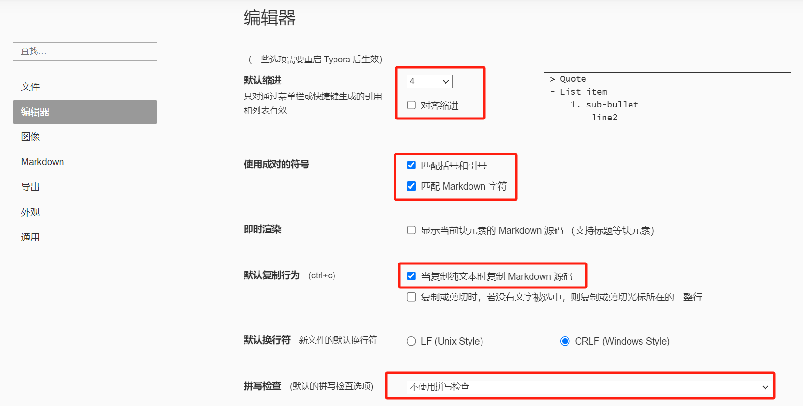
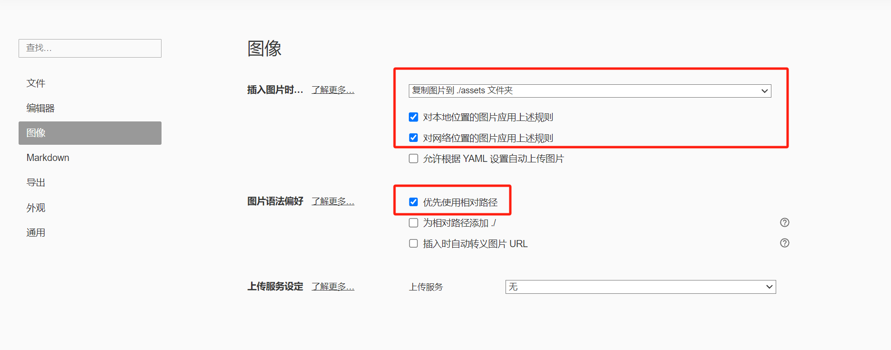
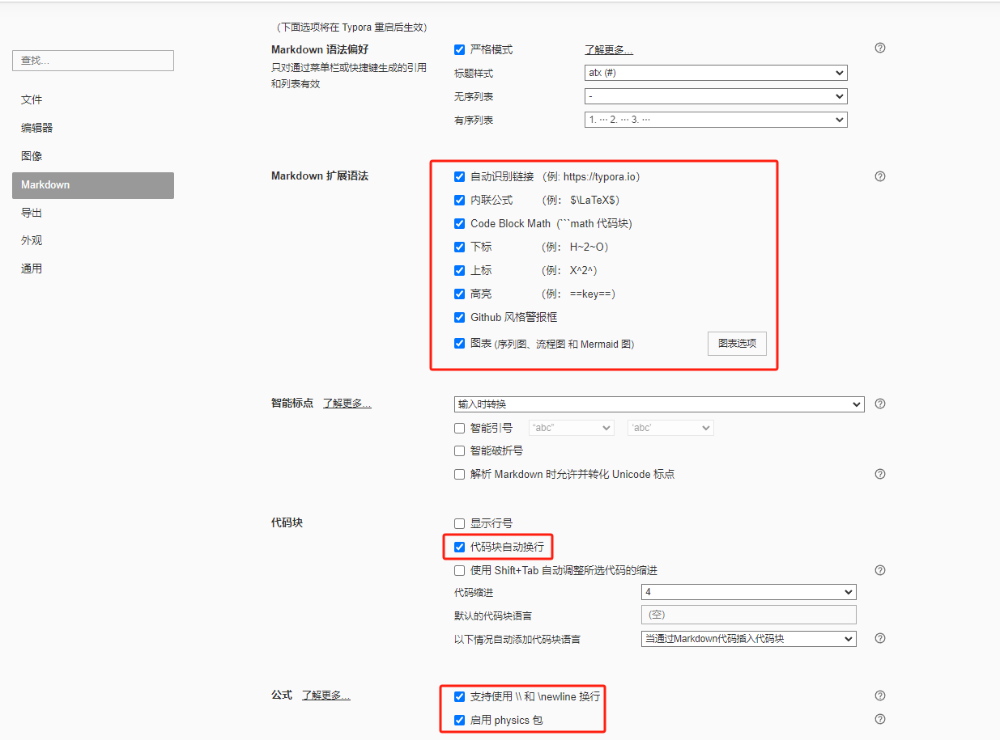
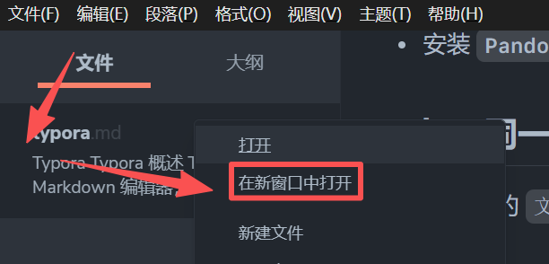

# Typora

## Typora 概述

**[Typora](https://typora.io/)** 是一款 Markdown 编辑器，结合了 Markdown 编辑和实时预览功能。Typora 采用 *所见即所得* 模式，意味着你在编辑 Markdown 文件时，实时看到渲染后的效果。

**Typora 资源**：

> [Typora 官网](https://typora.io/)
>
> [Typora 官网中文站](https://typoraio.cn/)
>
> [Typora 官方文档](https://support.typoraio.cn/)
>
>  [Markdown 参考](https://support.typoraio.cn/zh/Markdown-Reference/)：Typora 的 Markdown 语法

## 环境搭建

- [官网下载安装 Typora](https://typora.io/)

### 配置服务器

1. **服务器**：无论激活还是使用，都应使用**国内服务器**。
2. **路径**：`File` - `Preferences` - `General` - `Use Typora server in China`
3. **E-mail**：3933
4. **激活码**：QFW7SN-VHN2CC-SU7UJ5-XJ5S3S

### 偏好设置

- `文件` - `偏好设置`
- **文件**

    

- **编辑器**

    

- **图像**

    

- **Markdown**

    

### 其它设置

- **单换行符**：`编辑` - `空格与换行` - 取消 `保留单换行符`

# [快捷键](https://support.typora.io/Shortcut-Keys/)

## 快捷键列表

| 操作 | Typora 快捷键 |
| :---: | :---: |
| ==系统== |  |
| 偏好设置 | <kbd>Ctrl</kbd> + <kbd>,</kbd> |
| 源码模式 | <kbd>Ctrl</kbd> + <kbd>/</kbd> |
| 开发者工具 | <kbd>Shift</kbd> + <kbd>F12</kbd> |
| 操作 | <kbd>?</kbd> + <kbd>?</kbd> |
| ==文件== |  |
| 操作 | <kbd>?</kbd> + <kbd>?</kbd> |
| 操作 | <kbd>?</kbd> + <kbd>?</kbd> |
| ==编辑== |  |
| 元数据 | `---` + <kbd>Enter</kbd> |
| 增加 / 降低标题级别 | <kbd>Ctrl</kbd> + <kbd>+</kbd> \|<kbd>-</kbd> |
| 单行换行 | <kbd>Space</kbd> - <kbd>Space</kbd> - <kbd>Shift</kbd> + <kbd>Enter</kbd> |
| 列表项内加元素<br />即源码空一行再缩进 | <kbd>Shift</kbd> + <kbd>Enter</kbd> + <kbd>Enter</kbd> |
| 上（下）移该行 | <kbd>Alt</kbd> + <kbd>↑</kbd> \| <kbd>↓</kbd> |
| ==表格== |  |
| 表格单元格内换行 | <kbd>Shift</kbd> + <kbd>Enter</kbd> |
| 移动该行 \| 列 | <kbd>Alt</kbd> + <kbd>↑</kbd> \| <kbd>↓</kbd> \| <kbd>←</kbd> \| <kbd>→</kbd> |
| 下方插入行 | <kbd>Ctrl</kbd> + <kbd>Enter</kbd> |
| 删除行 | <kbd>Ctrl</kbd> + <kbd>Shift</kbd> + <kbd>Backspace</kbd> |
| 操作 | <kbd>?</kbd> + <kbd>?</kbd> |
| ==格式== |  |
| 标题（Heading） | <kbd>Ctrl</kbd> + <kbd>Num</kbd> |
| 粗体（Strong） | <kbd>Ctrl</kbd> + <kbd>B</kbd> |
| 斜体（Emphasis） | <kbd>Ctrl</kbd> + <kbd>I</kbd> |
| 下划线（Underline） | <kbd>Ctrl</kbd> + <kbd>U</kbd> |
| 删除线（Strike） | <kbd>Alt</kbd> + <kbd>Shift</kbd> + <kbd>5</kbd> |
| 清除**当前段落**或**选中段落**格式 | <kbd>Ctrl</kbd> + <kbd>\\</kbd> |
| 操作 | <kbd>?</kbd> + <kbd>?</kbd> |

## 快捷键设定

- **文件 | 偏好设置** > **通用** > **打开高级设置**
- 打开 `conf.user.json`。如果没有该文件，参照 `conf.default.json` 创建一个。
- 在 `keyBinding` 项下添加快捷键的设置，如 `"Always on Top": "Ctrl+Shift+P"`。

    ```json
    "keyBinding": {
        "Always on Top": "Ctrl+Shift+P"
    },
    ```

- 重启生效

# [Markdown](https://support.typoraio.cn/zh/Markdown-Reference/)

此部分记录的是 Typora 中 Markdown 语法的特殊之处。

Markdown 的语法因不同的解析器或编辑器而异。Typora 使用 [GitHub Flavored Markdown](https://help.github.com/articles/github-flavored-markdown/)，详见 `Markdown | 扩展语法 | GFM` 笔记。

Typora 仅支持 GFM 中的围栏代码块。不支持 Markdown 中的原始代码块。

# [HTML](https://support.typora.io/HTML/)

此部分是 Typora 对 HTML 特殊渲染的说明，详见官网中的 [Typora 中的 HTML 支持](https://support.typora.io/HTML/)。

Typora 支持大部分 HTML 元素。

## HTML 块

**HTML 块**中不允许有空行，否则将被渲染为两个 HTML 块。

```html
<!-- 正确 -->
<ul>
  <li>
    第一项
  </li>
  <li>
    第二项
  </li>
</ul>

<!-- 错误 -->
<ul>
  <li>
    第一项
  </li>

  <li>
    第二项
  </li>
</ul>
```

## 内联

为了方便编辑，Typora 会显示空标签和带有 `display: none` 样式的元素。例如，以下 Markdown 中的相关内容在 Typora 中可见，但在导出后将不可见。

```markdown
<span></span><br />
<span style="display:none">这是一段被隐藏的内容</span>
```

> <span></span><br />
> <span style="display:none">这是一段被隐藏的内容</span>

## 嵌入

**嵌入 JavaScript**

- 有些网站仅提供基于 Javascript 的嵌入代码，而不是 `<iframe>` 代码片段。
- Typora 仅支持一些基于脚本的共享代码，这些内容仅在 `<iframe>` 元素内运行，但无法访问本地文件。

**嵌入 PDF**

- 不再支持嵌入 PDF

## 注释

Typora 支持使用 HTML 注释的方法对内容注释，在 Typora 中可见，但在导出后将不可见。

```markdown
<!-- 这是一段注释内容 -->

这是注释下面的正文内容
```

> <!-- 这是一段注释内容 -->
>
> 这是注释下面的正文内容

## 其它

- 处于安全考虑，不支持 `<script>` 元素和 `onload` 属性。

    - `<script>` 元素可以放在 `<iframe>` 元素内，但无法访问本地文件。

- 并非所有属性都受支持。HTML 中的 `id`、`class`和`data-*` 及未知属性在渲染时将不会包含在内（导出/打印时将包含它们）。

# 主题

## [安装主题](https://support.typoraio.cn/About-Themes/)

- [官网下载主题文件并解压](https://theme.typoraio.cn/)

    - **文件 | 偏好设置** > **外观** > **打开主题文件夹**
    - 复制**基本文件夹**和**所有 CSS 文件**到 Typora 主题文件夹

- 复制 **base.ueser.css** 到主题文件夹
- 编写 **{current-theme}.user.css** 并复制到主题文件夹
- 重启 Typora
- **主题 | 选择主题**

## 自定义主题

### [创建自定义主题](https://theme.typora.io/doc/Write-Custom-Theme/)

从0到1创建自定义主题

### [添加自定义 css](https://support.typoraio.cn/Add-Custom-CSS/)

- 当想修改一个已下载的主题时，不要在原主题文件修改 CSS，否则版本更新时可能被覆盖。
- 应[添加自定义 CSS](https://support.typoraio.cn/Add-Custom-CSS/)文件 `base.user.css` 和 `{current-theme}.css`
- `base.user.css`：对所有主题生效
- `{current-theme}.user.css`：对 `{current-theme}.css` 生效

### 样式定制

- **[常用样式定制](https://support.typoraio.cn/Add-Custom-CSS/#common-style-customization)**：列举了很多定制样式的方法

    - [字体](https://support.typoraio.cn/Custom-Font/)
    - [排版](https://support.typoraio.cn/Typeset/)
    - [背景](https://support.typoraio.cn/Backgound/)
    - [代码块](https://support.typoraio.cn/Code-Block-Styles/)：Typora 使用 [CodeMirror](http://codemirror.net/) 在代码围栏中进行语法高亮。
    - [标题](https://support.typoraio.cn/Auto-Numbering/)
    - [书写区域宽度](https://support.typoraio.cn/Width-of-Writing-Area/)
    - [列表样式](https://support.typoraio.cn/List-Style/)
    - [任务列表](https://support.typoraio.cn/Task-List/)
    - [文本方向](https://support.typoraio.cn/RTL/)(RTL)
    - [图表](https://support.typora.io/Draw-Diagrams-With-Markdown/#mermaid-options)
    - [专注模式](https://support.typoraio.cn/Change-Styles-in-Focus-Mode/)
    - [目录](https://support.typoraio.cn/TOC-levels/)

- [标题自动编号](https://support.typora.io/Auto-Numbering/)

## base.user.css

- GitHub 网友制作了一个优秀的 [`base.user.css`](https://github.com/lipengzhou/typora-theme-auto-numbering)

    - 1级标题没有编号
    - 大纲和正文都有自动编号，且支持自动更正
    - 不需要禁止大纲自动折叠
    - 导出至PDF时，保留编号

- **自定义 base.user.css**

    ```css
    /**
     * author: LPZ
     * email: lpzmail@163.com
     */
    
    /* 标题字体 */
    h1,
    h2,
    h3,
    h4,
    strong {
      font-weight: 600;
    }
    
    /* initialize css counter */
    #write {
      counter-reset: h1;
    }
    
    h1 {
      counter-reset: h2;
    }
    
    h2 {
      counter-reset: h3;
    }
    
    h3 {
      counter-reset: h4;
    }
    
    h4 {
      counter-reset: h5;
    }
    
    h5 {
      counter-reset: h6;
    }
    
    /* put counter result into headings（h1 不添加） */
    #write h2:before {
      counter-increment: h2;
      content: counter(h2) ". ";
    }
    
    #write h3:before,
    h3.md-focus.md-heading:before {
      /** override the default style for focused headings */
      counter-increment: h3;
      content: counter(h2) "." counter(h3) ". ";
    }
    
    #write h4:before,
    h4.md-focus.md-heading:before {
      counter-increment: h4;
      content: counter(h2) "." counter(h3) "." counter(h4) ". ";
    }
    
    #write h5:before,
    h5.md-focus.md-heading:before {
      counter-increment: h5;
      content: counter(h2) "." counter(h3) "." counter(h4) "." counter(h5) ". ";
    }
    
    #write h6:before,
    h6.md-focus.md-heading:before {
      counter-increment: h6;
      content: counter(h2) "." counter(h3) "." counter(h4) "." counter(h5) "."
        counter(h6) ". ";
    }
    
    /** override the default style for focused headings */
    #write > h3.md-focus:before,
    #write > h4.md-focus:before,
    #write > h5.md-focus:before,
    #write > h6.md-focus:before,
    h3.md-focus:before,
    h4.md-focus:before,
    h5.md-focus:before,
    h6.md-focus:before {
      color: inherit;
      border: inherit;
      border-radius: inherit;
      position: inherit;
      left: initial;
      float: none;
      top: initial;
      font-size: inherit;
      padding-left: inherit;
      padding-right: inherit;
      vertical-align: inherit;
      font-weight: inherit;
      line-height: inherit;
    }
    
    /* 添加 TOC 自动序号样式 */
    .md-toc-content {
      counter-reset: toc-h1;
    }
    
    .md-toc-h1 {
      counter-reset: toc-h2;
    }
    
    .md-toc-h2 {
      counter-reset: toc-h3;
    }
    
    .md-toc-h3 {
      counter-reset: toc-h4;
    }
    
    .md-toc-h4 {
      counter-reset: toc-h5;
    }
    
    .md-toc-h5 {
      counter-reset: toc-h6;
    }
    
    .md-toc-content .md-toc-h2 a:before {
      counter-increment: toc-h2;
      content: counter(toc-h2) ". ";
    }
    
    .md-toc-content .md-toc-h3 a:before {
      counter-increment: toc-h3;
      content: counter(toc-h2) "." counter(toc-h3) ". ";
    }
    
    .md-toc-content .md-toc-h4 a:before {
      counter-increment: toc-h4;
      content: counter(toc-h2) "." counter(toc-h3) "." counter(toc-h4) ". ";
    }
    
    .md-toc-content .md-toc-h5 a:before {
      counter-increment: toc-h5;
      content: counter(toc-h2) "." counter(toc-h3) "." counter(toc-h4) "."
        counter(toc-h5) ". ";
    }
    
    .md-toc-content .md-toc-h6 a:before {
      counter-increment: toc-h6;
      content: counter(toc-h2) "." counter(toc-h3) "." counter(toc-h4) "."
        counter(toc-h5) "." counter(toc-h6) ". ";
    }
    
    /* 侧边栏自动编号 */
    .outline-content {
      counter-reset: outline-h2;
    }
    
    .outline-h1 {
      counter-reset: outline-h2;
    }
    
    .outline-h2 {
      counter-reset: outline-h3;
    }
    
    .outline-h3 {
      counter-reset: outline-h4;
    }
    
    .outline-h4 {
      counter-reset: outline-h5;
    }
    
    .outline-h5 {
      counter-reset: outline-h6;
    }
    
    .outline-content .outline-h2 .outline-label:before {
      counter-increment: outline-h2;
      content: counter(outline-h2) ". ";
    }
    
    .outline-content .outline-h3 .outline-label:before {
      counter-increment: outline-h3;
      content: counter(outline-h2) "." counter(outline-h3) ". ";
    }
    
    .outline-content .outline-h4 .outline-label:before {
      counter-increment: outline-h4;
      content: counter(outline-h2) "." counter(outline-h3) "." counter(outline-h4)
        ". ";
    }
    
    .outline-content .outline-h5 .outline-label:before {
      counter-increment: outline-h5;
      content: counter(outline-h2) "." counter(outline-h3) "." counter(outline-h4)
        "." counter(outline-h5) ". ";
    }
    
    .outline-content .outline-h6 .outline-label:before {
      counter-increment: outline-h6;
      content: counter(outline-h2) "." counter(outline-h3) "." counter(outline-h4)
        "." counter(outline-h5) "." counter(outline-h6) ". ";
    }
    
    /* 自定义强制换号符，使得在导出PDF 或打印时强制换行 */
    @media print {
      /* 这是自定义标签, 在需要换行的地方插入：<pb> */
      pb {
        display: block;
        page-break-after: always;
      }
    
      h1 {
        page-break-before: always;
      }
    
      h1:first-of-type {
        page-break-before: avoid;
      }
    }
    
    /* 完成的 Task 添加删除线 */
    .task-list-done {
      text-decoration: line-through;
      color: #777;
    }
    
    /* 添加键盘样式 */
    kbd {
      box-shadow: inset 0 -2px 0 #c6cbd1;
      background-color: white;
    }
    
    /* -----------------------以下为自己修改区域----------------- */
    
    /* write 区加宽 */
    #write {
      max-width: 1500px;
      margin: 0 auto;
      padding: 30px;
      padding-bottom: 100px;
    }
    
    /* 一级标题居中 */
    h1 {
      text-align: center;
    }
    
    /* 图片边框 */
    #write img {
      border: 1px solid rgb(229, 229, 229);
    }
    
    /* 去除图片黑边 */
    .md-image > img {
      margin: 0;
      padding: 0;
    }
    
    /* 图片居中，官方方法 */
    p .md-image:only-child {
      width: auto;
      text-align: inherit;
    }
    
    p > .md-image:only-child:not(.md-img-error) img {
      display: inline-block;
    }
    
    /* 下面两个是之前自己的方法，2025.09.29已替换为上述官方方法 */
    /* md图片靠左 */
    /* p .md-image:only-child {
      width: auto;
      text-align: left;
    } */
    
    /* img图片靠左 */
    /* #write img {
        display: block;
        margin: 0 auto 0 0 !important;
    } */
    
    /* 超链接取消下划线 */
    a:link {
      text-decoration: none !important;
    }
    
    /* 超链接悬停显示下划线 */
    a:hover {
      text-decoration: underline !important;
    }
    
    /* 对标注进行放大 */
    rt {
      font-size: 1em; /* 默认太小，设大一点，比如1em或1.2em */
      color: red; /* 可选，标注更醒目 */
    }
    
    /* 水平线宽度 */
    hr {
      border: none; /* 首先清除默认边框 */
      border-top: 2px solid #7a828e; /* 设置上边框为2像素宽的灰色实线 */
      height: 0; /* 明确设置高度为0，确保由边框决定视觉厚度 */
    }
    
    /* <kbd>样式 */
    kbd {
      background-color: #000000;
      color: #adbac7;
      font-size: 1.1em;
      padding: 12px 12px; /* 增加内边距，使元素更大 */
    }
    
    /* <summary> 元素字体大小 */
    summary {
      font-size: 1.3em;
    }
    
    ```

## 主题备忘

- **工作区域**

    

- **各种可修改的部分**

    ```css
    body {
      /* 侧边栏，代码块外圈，语言建议 */
      /* 在 github-night.css:984 中，
      侧边栏指定为 var(--item-hover-bg-color) */
      --item-hover-bg-color: #22272e;
    
      /* write 区 */
      /* 在 github-night.css:161 中，
      此处指定为 var(--bg-color) !important */
      --bg-color: #2d333b;
    }
    
    /* ---------------------- sidebar ---------------- */
    /* sidebar 区背景色 */
    #typora-sidebar {
    background-color: #fff;
    }
    
    /* 当前大纲标题颜色 */
    .outline-active {
      color: white;
    }
    /* ---------------------- content ---------------- */
    /* content 区背景色 */
    content {
    background-color: #f7f8fa;
    }
    /* ---------------------- write ---------------- */
    /* write 区背景色 */
    #write {
    background-color: #fff;
    }
    
    /* write 区加宽 */
    #write {
      max-width: 1500px;
      margin: 0 auto;
      padding: 30px;
      padding-bottom: 100px;
    }
    /* ---------------------- 标题 ---------------- */
    /* 一级标题居中 */
    h1 {
    text-align: center; 
    }
    /* ---------------------- 代码块 ---------------- */
    /* 行内代码高亮颜色 */
    code {
    color: #f50059;
    }
    
    /* 代码块背景色 */
    pre {
      background-color: #dcdcdc !important;
    }
    
    /* 语言建议区背景色 */
    .auto-suggest-container {
      /* 默认为以下值 */
      background-color: var(--item-hover-bg-color);
    }
    
    /* 语言建议区选中背景色 */
    /* 在 github-night.css 中，
    此处指定为 --item-hover-bg-color，
    和语言建议区的背景相同，
    所以要单独修改为 write 区的 --bg-color */
    .auto-suggest-container li.active,
    .auto-suggest-container li:hover {
      background-color: var(--bg-color);
    }
    
    /* 语言提示区背景色 */
    .code-tooltip {
      /* 默认为以下值 */
      background: var(--bg-color);
    }
    
    /* 代码块内的选中行 */
    /* 在 github-night.css:56 中，
    此处指定为 rgba(255, 255, 255, 0.1) */
    .md-fences.md-focus .cm-s-inner .CodeMirror-activeline-background {
      background-color: #ffffff1a;
    }
    
    /* 行内代码 */
    /* 在 github-night.css:535 中，
    此处指定为 rgba(240, 246, 252, 0.15) */
    code {
      background-color: #ffffff1a;
    }
    
    /* 元数据 */
    /* 在 github-night.css:579 中，
    此处指定为 #fff */
    #write pre.md-meta-block {
      color: #adbac7;
    }
    
    /* ---------------------- 超链接 ---------------- */
    /* 超链接取消下划线 */
    a:link {
      text-decoration: none !important;
    }
    
    /* 超链接悬停显示下划线 */
    a:hover {
    text-decoration: underline !important;
    }
    
    /* 超链接颜色 */
    a:link {
      color: black !important;
    }
    
    /* 超链接悬停变色 */
    a:hover {
      color: #4183C4 !important;
    }
    
    /* ---------------------- 图片 ---------------- */
    /* 图片边框 */
    #write img {
      border: 1px solid rgb(229, 229, 229);
    }
    
    /* 图片居中，官方方法 */
    p .md-image:only-child {
      width: auto;
      text-align: inherit;
    }
    
    p > .md-image:only-child:not(.md-img-error) img {
      display: inline-block;
    }
    
    /* img图片靠左 */
    #write img {
        display: block;
        margin: 0 auto 0 0 !important;
    }
    
    /* ---------------------- 其它 ---------------- */
    /* 删除线颜色 */
    del {
      text-decoration-color: red;
    }
    
    /* 未知代码继承 */
    .md-heading code, #typora-sidebar code {
    color: inherit;
    }
    
    /* <kbd>样式 */
    kbd {
      background-color: #000000;
      color: #adbac7;
      font-size: 1.1em;
      padding: 12px 12px; /* 增加内边距，使元素更大 */
    }
    
    /* 去除图片黑边 */
    .md-image>img {
      margin: 0;
      padding: 0;
    }
    
    /* 设置加粗文本粗细 */
    strong {
      font-weight: 1000 !important; /* 使用更高的字体粗细 */
    }
    
    /* 图表左对齐 */
    .md-diagram-panel-preview {text-align:left;}
    
    /* <summary> 元素字体大小 */
    summary {
      font-size: 1.3em;
    }
    ```

## Github

- Github 是 Typora 官方默认主题。
- **Github.css  文件留存**：

    ```css
    /* -----------------------以下为修改区域----------------- */
    /* sidebar 区背景色 */
    #typora-sidebar {
      background-color: #fff;
    }
    
    /* content 区背景色 */
    content {
      background-color: #f7f8fa;
    }
    
    /* write 区背景色 */
    #write {
      background-color: #fff;
    }
    
    /* 代码块背景色 */
    pre {
      background-color: #dcdcdc !important;
    }
    
    /* 删除线颜色 */
    del {
      text-decoration-color: red;
    }
    
    /* 修改<kbd> */
    kbd {
      /* 文本颜色 */
      color: #000000;
      
      /* 字体大小变大 */
      font-size: 1.1em;
    
      /* 增加内边距，使元素更大 */
      padding: 7px 12px;
    }
    ```

## github-night-dimmed

- [github-night-dimmed 是从 GitHub 下载的暗黑主题。](https://github.com/kinoute/typora-github-night-theme/releases/tag/v0.6.2)
- **安装**：把以下所有文件（夹）复制到主题文件夹

    - github-night
    - github-night.css
    - github-night-dimmed.css
    - github-night-high-contrast.css

- **注意**：github-night-dimmed.css 引入了 github-night.css 的样式
- 编写自定义主题文件 **github-night-dimmed.user.css**，复制到主题文件夹

    ```css
    body {
      /* 侧边栏，代码块外圈，语言建议 */
      /* 在 github-night.css:984 中，
      侧边栏指定为 var(--item-hover-bg-color) */
      --item-hover-bg-color: #22272e;
    
      /* write 区 */
      /* 在 github-night.css:161 中，
      此处指定为 var(--bg-color) !important */
      --bg-color: #2d333b;
    }
    
    /* 删除线颜色 */
    del {
      text-decoration-color: red;
    }
    
    /* 使用更高的加粗文本粗细 */
    strong {
      font-weight: 1000 !important;
    }
    
    /* 当前大纲标题颜色 */
    .outline-active {
      color: white;
    }
    
    /* 语言建议区选中背景色 */
    /* 在 github-night.css 中，
    此处指定为 --item-hover-bg-color，
    和语言建议区的背景相同，
    所以要单独修改为 write 区的 --bg-color */
    .auto-suggest-container li.active,
    .auto-suggest-container li:hover {
      background-color: var(--bg-color);
    }
    
    /* 代码块内的选中行 */
    /* 在 github-night.css:56 中，
    此处指定为 rgba(255, 255, 255, 0.1) */
    .md-fences.md-focus .cm-s-inner .CodeMirror-activeline-background {
      background-color: #ffffff1a;
    }
    
    /* 行内代码 */
    /* 在 github-night.css:535 中，
    此处指定为 rgba(240, 246, 252, 0.15) */
    code {
      background-color: #ffffff1a;
    }
    
    /* 元数据 */
    /* 在 github-night.css:579 中，
    此处指定为 #fff */
    #write pre.md-meta-block {
      color: #adbac7;
    }
    ```

## 颜色备忘

- 主要深色：#22272e
- 主要浅色：#2d333b
- 代码块内的选中行背景：#ffffff1a
- 行内代码背景：#ffffff1a
- 文本：#adbac7

# [图片](https://support.typora.io/Images/)

## 插入图片

**以下方法可以插入图片**：

- 拖放图片，自动转换为**标准 MD 语法**。
- 从剪贴板粘贴图片，自动转换为**标准 MD 语法**。
- 复制图片到 `assets` 文件夹，手动编写**标准写法**进行引用。
- **转换语法**（不适用于嵌套写法）：`右键图片` - `转换图片语法` - `HTML`

**插入写法示例**：

- 优先使用**标准 Markdown 写法**

    ```markdown
    
    ```

- 需要调整大小但不使用图注时，使用**标准 HTML 写法**

    ```html
    
    ```

- 需要使用图注时，使用 `<figure>` 嵌套写法，图片文件不支持复制和删除

    ```html
    <!-- 一个图注 -->
    <figure>
      
      <figcaption style="font-size: 16px; color: gray">图注</figcaption>
    </figure>
    
    <!-- 多个图注 -->
    <figure>
      
      <figcaption style="font-size: 16px; color: gray">
        <div>图注</div>
        <div>图注</div>
      </figcaption>
    </figure>
    ```

- 需要多张图片并排时，使用 `<div>` 嵌套写法，图片文件不支持复制和删除

    ```html
    <!-- 不需要图注的并排图片 -->
    <div style="display: flex; justify-content: left;">
      
      
    </div>
    
    <!-- 需要图注的并排图片 -->
    <div style="display: flex; justify-content: left">
      <figure>
        
        <figcaption style="font-size: 16px; color: gray">图注</figcaption>
      </figure>
      <figure>
        
        <figcaption style="font-size: 16px; color: gray">图注</figcaption>
      </figure>
    </div>
    ```

## 存储图片

- **本地存储**：

    - 目前本地引用使用相对路径
    - 无论何种方式插入以后，都自动将图片保存至同级文件夹下的  `assets文件夹` 中。
    - `文件` - `偏好设置` - `图像`

        

- **云存储**：可将图片上传至云服务器
- **更改存储**

    - 将所有引用的本地图片移动到指定文件夹，同时自动修改引用路径。
    - `格式` | `图像` | `移动所有图片到...`

## 删除图片

- 在删除代码或者移动内容到其它文件以后，如果此图片无用，应及时删除 `assets` 文件夹中相应图片。
- 如果删除的内容中含有图片，且在本 `.md` 文件中没有其它引用，则先删图片，再删文字。

    - `右键` | `删除图片文件`
    - 否则在 `assets` 文件夹中逐一删除很麻烦

- 此种方法仅适用于**标准写法**图片，不适用于**嵌套写法**，否则需要在 `assets` 文件夹中手动查找删除。

## 复制图片

- 此部分内容仅适用于**标准写法**的图片，不适用于**嵌套写法**，否则需要手动复制图片到目标 `assets` 文件夹。
- 不要剪切，因为原文件图片不会自动删除，后续逐一删除很麻烦。
- 在复制内容时，一定要**带着标题复制**，否则图片不会复制到**目标 assets 文件夹**，而是以绝对路径引用原来的图片。

    - 如果**目标 assets 文件夹**有图片与复制的图片同名，则会自动改名创建一个新图片。
    - 如果**目标 assets 文件夹**没有同名图片，则会将图片复制到该文件夹。

- 在粘贴完以后，如果原文件没有其它引用，记得删除原文件夹中的图片（右键先删图片，再删文字内容）。

## 图片左对齐

- 修改主题 CSS 文件，二者共同作用，保证**标准写法**的图片能左对齐。

    ```css
    /* md图片靠左 */
    p .md-image:only-child {
      width: auto;
      text-align: left;
    }
    
    /* img图片靠左 */
    #write img {
        display: block;
        margin: 0 auto 0 0 !important;
    }
    ```

## 调整图片大小

- 尽量不使用 Typora 自带的 `zoom` 属性调整图片大小，因为很多浏览器不支持（比如 Firefox）。
- 尽量使用 `` 元素的 `width` 和 `height` 属性调整图片大小。

# 视频

Markdown 本身不支持直接插入视频，但可以使用 HTML 实现

```markdown
<video
  controls
  src="assets/测试视频.MP4"
  style="display: block; margin-left: 0; margin-right: auto; width: 25%"
></video>
```

# 表格

- Typora 默认的是 Markdown 扩展语法的表格，无合并单元格等复杂功能，所以使用 HTML 创建表格。

    ```html
    <!-- 全文居中 -->
    <table style="text-align: center;">
    <tr>
      <!-- 该单元格占2列 -->
      <th colspan="2">表头1</th>
      <th>表头2</th>
      <th>表头3</th>
      <th>表头4</th>
    </tr>
    <tr>
      <!-- 该单元格占3行 -->
      <td rowspan="3">内容</td>
      <td>内容</td>
      <td colspan="2">内容</td>
      <td>内容</td>
    </tr>
    <tr>
      <td>内容</td>
      <td colspan="3">内容</td>
    </tr>
    <tr>
      <td>内容</td>
      <td>内容</td>
      <td>内容</td>
      <td>内容</td>
    </tr>
    </table>
    ```

- **HTML 表格模板**：

    ```html
    <table style="text-align: center;">
      <tr>
        <th>表头1</th>
        <th>表头2</th>
        <th>表头3</th>
      </tr>
      <tr>
        <td>内容</td>
        <td>内容</td>
        <td>内容</td>
      </tr>
      <tr>
        <td>内容</td>
        <td>内容</td>
        <td>内容</td>
      </tr>
      <tr>
        <td>内容</td>
        <td>内容</td>
        <td>内容</td>
      </tr>
    </table>
    ```

# [学术](https://support.typora.io/Math/)

Typora 支持 Tex 和 LaTex 语法，渲染公式。渲染过程由 [MathJax](https://www.mathjax.org/) 处理。使用前应先在 `偏好设置` 中启用 `图表` 功能。

## 公式

Typora 使用 LaTeX 语法输入公式，具体详见 LaTex。

- 行内公式：`$...$`
- 块级公式：`$$...$$`<br>````math` 和 `$$ + Enter` 效果一样

Typora 使用 LaTex 编辑公式时的几点说明：

- **水平对齐**：只能使用**水平移动** `\hspace{-80mm} 公式内容`
- **上下两个公式**：使用**换行** `公式1\\公式2`

# [图表](https://support.typora.io/Draw-Diagrams-With-Markdown/)

Typora 支持 Mermaid、Sequence 和 Flowchart 三种图表语法，使用前应先在 `偏好设置` 中启用 `图表` 功能。

## Mermaid

- 将代码块语言添加 mermaid 即可。
- [Typora 关于 Mermaid 教程和样式设置](https://support.typora.io/Draw-Diagrams-With-Markdown/#mermaid)
- [图表选项](https://support.typoraio.cn/Diagram-Options/)
- 关于 Mermaid，详见 `mermaid` 笔记。
- 在 Typora 中，使用 Mermaid 对文本颜色的设置会失效，解决办法是使用 HTML，示例如下：

    注意：此例只为了留下方法，`<font>` 元素已弃用。

    ```
    黄帝("<font color='orange'>黄帝</font>")
    ```

    ```mermaid
    flowchart TD
        黄帝("<font color='orange'>黄帝</font>")
    ```

# 操作

## 复制

此处讨论的情况，全是在**预览模式**下操作。

根据 Typora 的 `偏好设置 | 编辑器` 设置中，有没有选中 `当复制纯文本时复制 Markdown 源码` 选项，可将默认的复制行为分为两种情况：

- **纯文本选项**

    - 即没有选中 `当复制纯文本时复制 Markdown 源码` 选项
    - 复制以后会以**纯文本格式**粘贴到其它软件（但复制到 Typora 和 Notion 时，还是**原有的格式**）

- **Markdown 选项**

    - 即已选中 `当复制纯文本时复制 Markdown 源码` 选项
    - 复制以后会以 Markdown 源码中**原有的格式**粘贴到任何地方

在 Typora 的 `编辑` 选项卡内，有5种[复制](https://support.typoraio.cn/Quick-Start/#copy)操作：

- `复制`：即默认的复制行为，遵循 `当复制纯文本时复制 Markdown 源码` 选项是否被选中
- `复制内容并简化格式`：暂时未发现与 `复制` 有何不同
- `复制为纯文本`：用于在**Markdown 选项**时，想把 Markdown 或 HTML 格式复制为纯文本格式
- `复制为 Markdown`

    - 用于在**纯文本选项**时，想将 Markdown 格式复制为 Markdown 格式。
    - 源码必须是 Markdown 格式，不能是 HTML 格式。

- `复制为 HTML 代码`

    - 用于在**纯文本选项**时，想将 Markdown 和 HTML 格式都复制为 HTML 格式。

## [导出](https://support.typora.io/Export/)

### 导出功能

- `HTML`：带 Typora 主题的 HTML
- `HTML (without styles)`：不带 Typora 主题的 HTML
- 安装 `Pandoc` 以后，可以增强 Typora 的导出功能，可以导出到 `word` 等其它格式。

### 之前实验

- 导出到 word

    - Markdown 格式表格失效
    - 所有 HTML 标签的效果将失效。

- 导出到 PDF、HTML、图片时，Markdown 格式和部分 HTML 格式有效。

### 其它说明

- 以下内容在导出后不可见，详见 `Typora | HTML` 笔记。

    - 正文中的 HTML 注释
    - 空标签和带有 `display: none` 样式的元素

- 并非所有 HTML 标签/样式都能导出为其他格式。

# 其它

## 帮助

[更多帮助，在 Typora 技术支持](https://support.typoraio.cn/)

## 未解决问题

无法正确渲染连续空格

## 打开同一个文件

在 `侧边栏` 的 `文件` 里，右击想打开的文件，选择 `新建窗口`。



## 锚点

- Typora 标题自带锚点，`id="标题名"`。
- Typora 中的锚点不要按 HTML 的规范格式化，要保留标题中的空格，否则无法跳转。

## 关于空行

在列表嵌套其它块时，未知的某些操作，可能将原本没有空行间隔的连续列表项“撑开”，造成每个列表项之间都有空行，目前没办法解决，所以应放弃原来的严格空行的原则。

## 元数据

可以在 Markdown 文件顶部使用 YAML Front Matter 嵌入元数据，详见 [`yaml | YAML Front Matter`](../../code-language/yaml/yaml.md#YAML Front Matter) 笔记。
