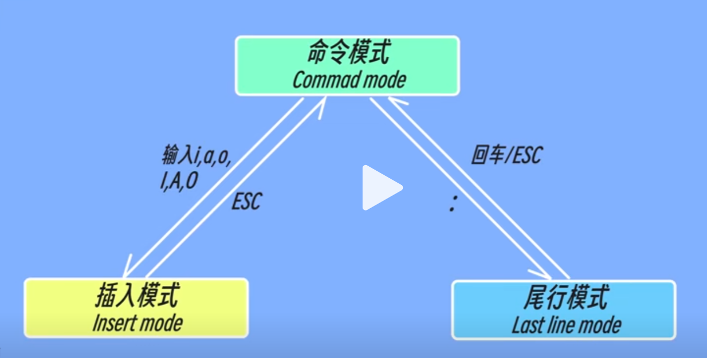

# Vim

**Vi**（Vi IMproved）是 Unix 系统上最早的文本编辑器之一，**Vim**（Vi IMproved）是 Vi 的增强版。

## Basics

```bash
# show version
vi / vim
# open / create file
vim $FILE
# into insert mode
i
# back to command mode
`Esc`
# exit
:q
# save and exit
:wq
```

## Command mode

- Default enter into command mode.

  

- `Esc`: Back to command mode

- `dd`: Cut cursor line. `2dd`: Cut cursor and next line

- `yy`: Copy cursor line. `2yy`: Copy cursor and next line

- `p`: Paste at next line of cursor. `2p`: Paste at next line of cursor 2 times

- `Ctrl + F`: Page Up. `Ctrl + U`: Page Up Half.

- `Ctrl + B`: Page Down. `Ctrl + D`: Page Down Half.

## Insert mode

- Into insert mode
  - `i`: before cursor
  - `I`: line beginning
  - `a`: after cursor
  - `A`: line end
  - `o`: next new line
  - `O`: previous new line

- Edit
  - `^`: jump to line beginning
  - `$`: jump to line end

## Last line mode

- `:`: Into last line mode
- `:q`: exit
- `:wq`: save and exit
- `:set nu`: show line number
- `:set nonu`: close line number