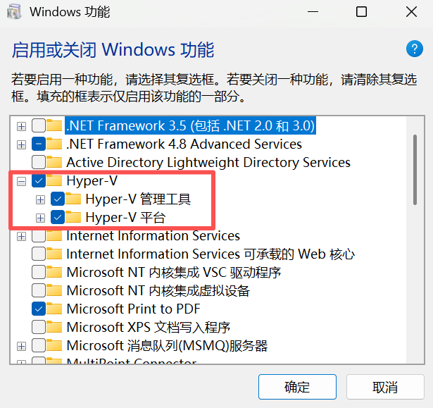
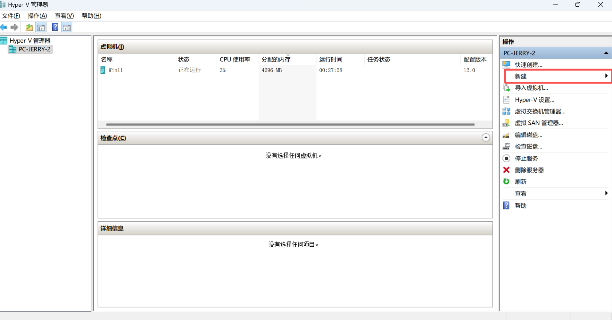
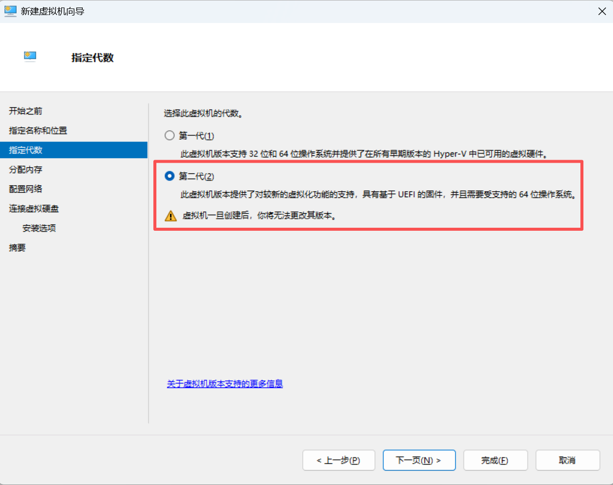
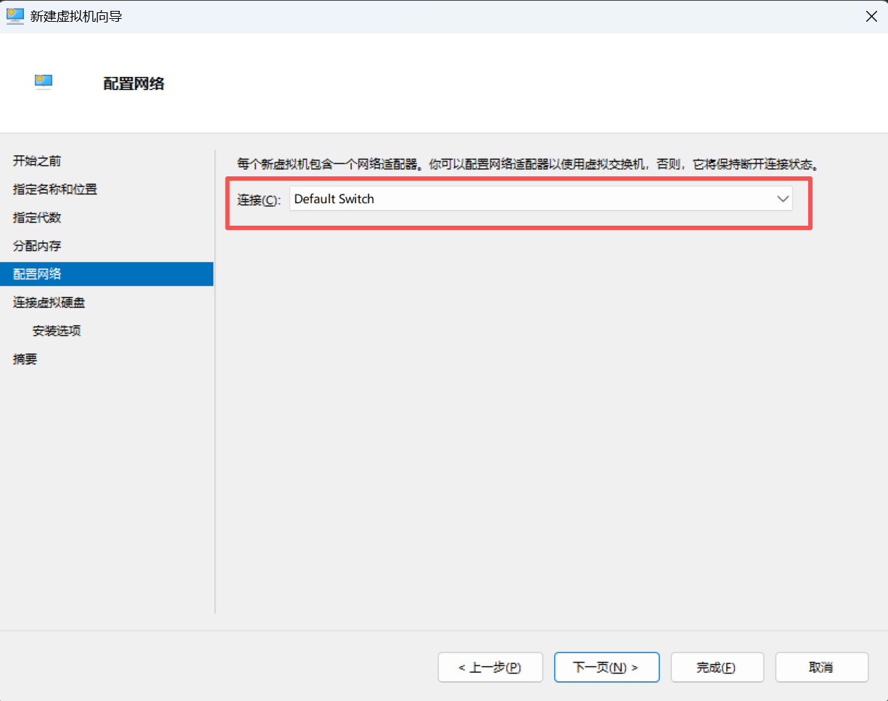
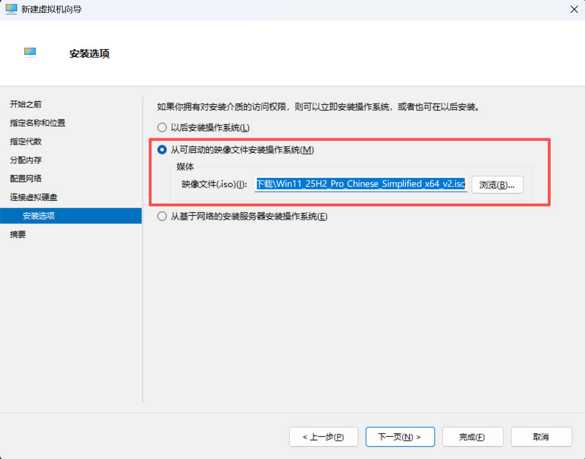
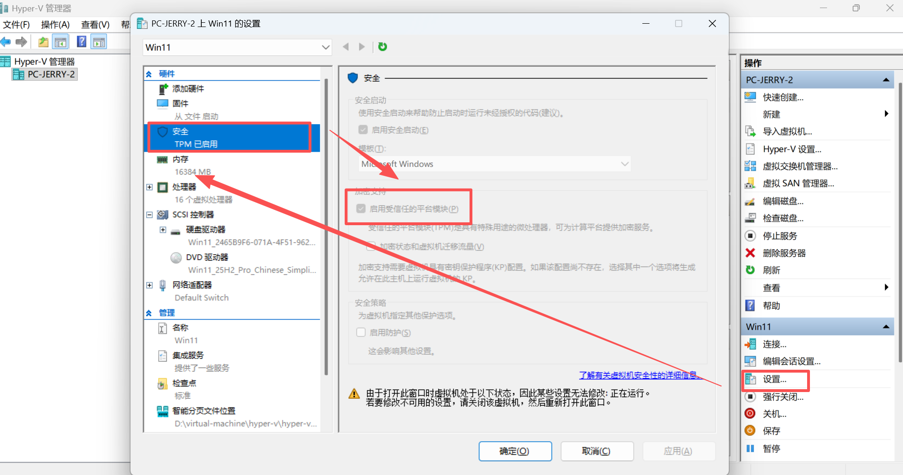

# Overview

[**Hyper-V**](https://learn.microsoft.com/zh-cn/windows-server/virtualization/hyper-v/overview) 是微软内置于 Windows 系统的[虚拟机平台](virtual-machine.md)。

> [Hyper-v Docs](https://learn.microsoft.com/zh-cn/windows-server/virtualization/hyper-v/)

Windows 系统开启 Hyper-V 之后，无论是 Windows 系统本身，还是 WSL，都运行在 Hyper-V 平台上。

# Install

> [安装 Hyper-V](https://learn.microsoft.com/zh-cn/windows-server/virtualization/hyper-v/get-started/install-hyper-v?tabs=gui&pivots=windows)

## 前提条件

- 无法在 Windows 家庭版上安装 Hyper-V
- [开启 CPU 虚拟化](<windows.md#开启 CPU 虚拟化>)

## 安装 Hyper-V

- 在[启用或关闭 Windows 功能](<windows.md#启用或关闭 Windows 功能>)中开启 Hyper-V

    

- 重启计算机生效。

- 重启后在开始菜单搜索“Hyper-V”，会出现如下图标：

    - Hyper-V 管理器
    - Hyper-V 快速创建

# 创建虚拟机

> [在 Hyper-V 中创建虚拟机](https://learn.microsoft.com/zh-cn/windows-server/virtualization/hyper-v/get-started/create-a-virtual-machine-in-hyper-v?tabs=hyper-v-manager)

- `新建` > `虚拟机`

    

- `指定代数`：Windows 11 系统选择 `第二代`

    

- `配置网络` 选择 `Default Switch`

    

- 将 CD 驱动器设置为系统映像文件

    

- 如果是Windows 11 系统，需开启虚拟机 TPM

    

- 安装客户机操作系统
- 如果是 Windows 系统，开机密码应该是微软账户的密码，而不是常规的 PIN 码。
- 开启增强会话
- 将 CD 驱动器设置为无

# 增强会话

[**增强会话**](https://learn.microsoft.com/zh-cn/windows-server/virtualization/hyper-v/enhanced-session-mode)功能类似于 VMware Tools，可以：

- 全屏
- 与宿主机共享剪贴板。**不能**拖拽文件。

如何开启：

- `虚拟机` > `查看` > `增强会话`
- 如果是 Windows 虚拟机，需要[关闭 Windows Hello 功能](<windows.md#Windows Hello>)，否则无法输入进入系统的密码。

# FAQ

## 嵌套虚拟化

- 此方法适用于开启 Hyper-V 创建的虚拟机的嵌套虚拟化，即在虚拟机中[开启 CPU 虚拟化](<windows.md#开启 CPU 虚拟化>)。

- 在开启该功能前，目标虚拟机必须处于**关机**状态。

- 只能在 CLI 中开启

- 在**宿主机**以**管理员**身份打开 PowerShell

- 开启虚拟机嵌套虚拟化

    ```powershell
    Set-VMProcessor -VMName "你的虚拟机名称" -ExposeVirtualizationExtensions $true
    ```

- 查看虚拟机嵌套虚拟化状态

    ```powershell
    Get-VMProcessor -VMName "你的虚拟机名称" | Select-Object VMName, ExposeVirtualizationExtensions
    ```

    ```
    # 如果输出结果中名为 Win11 的虚拟机的 ExposeVirtualizationExtensions 显示为 True，说明已经成功透传。
    
    VMName ExposeVirtualizationExtensions
    ------ ------------------------------
    Win11                            True
    ```

- 重新开启虚拟机，即可在虚拟机中[查看已开启虚拟化](<windows.md#开启 CPU 虚拟化>)。

- 以此类推，这种方法可以无限嵌套。