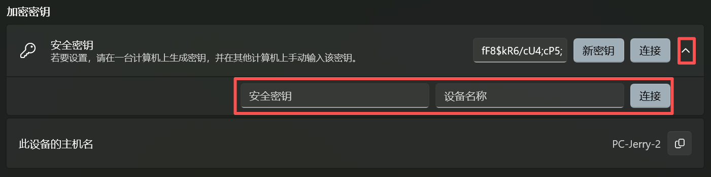

# Overview

[PowerToys](https://learn.microsoft.com/zh-cn/windows/powertoys/) 是微软官方出品的一套**增强型系统工具合集**，适用于 Windows 10 和 Windows 11，目标是帮助**提高工作效率、优化操作体验**。

[**安装方法**](https://learn.microsoft.com/zh-cn/windows/powertoys/install?tabs=gh%2Cextract-094)：

- 通过 Microsoft Store 搜索 “PowerToys” 安装最新版。
- 安装后，会在系统托盘显示一个 PowerToys 图标。
- [官方文档](https://learn.microsoft.com/zh-cn/windows/powertoys/)

# 系统工具

## 快捷键指南

[快捷键指南](https://learn.microsoft.com/zh-cn/windows/powertoys/shortcut-guide)展示了使用 Windows 键的常用键盘快捷方式。按住 `Win` 键进行激活。

## PowerToys Run

[PowerToys Run](https://learn.microsoft.com/zh-cn/windows/powertoys/run) 可帮助立即搜索和打开应用。 可使用 `Alt + Space` 进行激活。

## Light Switch

[Light Switch](https://learn.microsoft.com/zh-cn/windows/powertoys/light-switch) 可根据一天中的时间在浅色模式和深色模式之间自动切换 Windows 主题。

## 颜色选取器

[颜色选取器](https://learn.microsoft.com/zh-cn/windows/powertoys/color-picker)可以提取屏幕中的颜色色值，可使用 `Win + Shift + C` 进行激活。

## 文本提取器

[文本提取器](https://learn.microsoft.com/zh-cn/windows/powertoys/text-extractor)可复制图片中的文本。 可使用 `Win + Shift + T` 进行激活。

- 框选图片上的文字
- 松开左键，PowerToys 会自动识别框内的文字，并将其存入你的**剪贴板**。
- 注意：使用 `Win + V` 查看剪贴板时，看不见这些内容。

# 窗口和布局

## Always On Top

[Always On Top](https://learn.microsoft.com/zh-cn/windows/powertoys/always-on-top) 可将窗口固定在其他窗口之上，使用 `Win + Ctrl + T` 进行激活。

## 工作区

[工作区](https://learn.microsoft.com/zh-cn/windows/powertoys/workspaces)用于一键打开多个软件并布局，使用 `` Win + Ctrl + ` `` 激活工作区编辑器，可生成桌面快捷方式。

## FancyZones

[FancyZones](https://learn.microsoft.com/zh-cn/windows/powertoys/fancyzones) 用于自定义窗口布局，使用 `` Win + Shift + ` `` 激活编辑布局方式。

拖动窗口时按住 `Shift` 会出现待转区域，将拖放至相应窗口即可。

# 输入和输出

## 鼠标实用工具

[鼠标实用工具](https://learn.microsoft.com/zh-cn/windows/powertoys/mouse-utilities)用于增强鼠标和光标功能。

## 无界鼠标

[无界鼠标](https://learn.microsoft.com/zh-cn/windows/powertoys/mouse-without-borders)用于在一台计算机控制其它计算机。

在本机填入其它计算机的**安全密钥**和**设备名称**，点击 `连接`。

# 文件管理

## PowerRename

[PowerRename](https://learn.microsoft.com/zh-cn/windows/powertoys/powerrename) 用于执行批量重命名、搜索和替换文件名称。

- 右键单击 File Explorer 中的一个或多个选定文件，并选择 **使用 PowerRename 重命名**。
- 可以结合正则表达式批量修改文件名。

## File Locksmith

[File Locksmith](https://learn.microsoft.com/zh-cn/windows/powertoys/file-locksmith) 是一个 Windows shell 扩展，用于检查文件正在被哪些进程使用。

- 有时候想删除一个文件，系统提示正在使用中，无法删除。
- 右键单击 File Explorer 中的一个或多个选定文件，并选择**使用 Locksmith 解锁**。
- 可结束进程。

## 图像大小调整器

[图像大小调整器](https://learn.microsoft.com/zh-cn/windows/powertoys/image-resizer)用于批量调整图像大小。