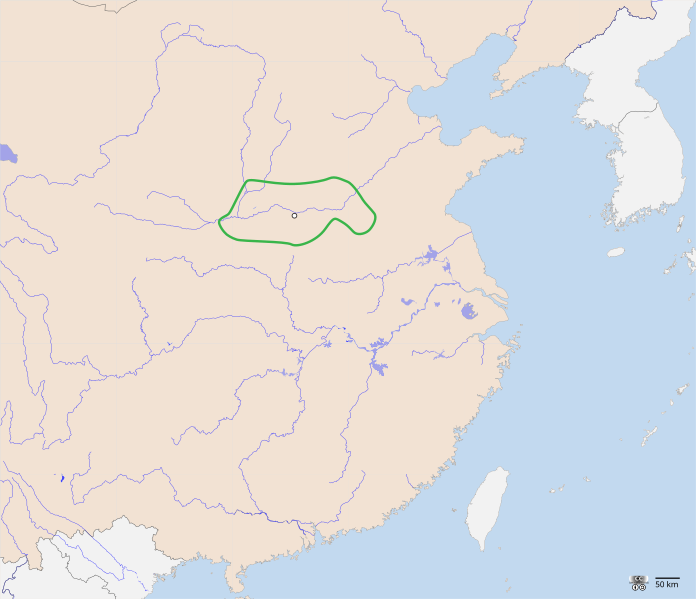

# 朝代模板

## 概述

## 历史

## 君主世系

[朝皇帝世系图](https://zh.wikipedia.org/wiki/朝皇帝世系图)

## 疆域

## 后裔

## 其它相关

# 中国史通述

## 中国历史条目

- [中国历史](https://zh.wikipedia.org/wiki/中国历史)
- [中国朝代](https://zh.wikipedia.org/wiki/中国朝代)
- [中国统一史](https://zh.wikipedia.org/wiki/中国统一)
- [中国历史朝代模板](https://zh.wikipedia.org/wiki/Template:%E4%B8%AD%E5%9B%BD%E5%8E%86%E5%8F%B2)
- [中国君主世系图](https://zh.wikipedia.org/wiki/中国君主世系图)
- [中国历史年表](https://zh.wikipedia.org/wiki/中国历史年表)
- [中国主要朝代列表](https://zh.wikipedia.org/wiki/中国朝代#中國主要朝代列表)

## 参考表

### 中国历史年表

<table style="text-align: center; margin: 0 auto">
  <tr>
    <th colspan="4">
      <a
        href="https://zh.wikipedia.org/wiki/Template:中国历史"
        title="中国历史年表"
        >中国历史年表</a
      >&nbsp;
      <a
        href="https://zh.wikipedia.org/wiki/Template:Neolithic_cultures_of_China"
        title="表格说明"
        ><small style="color: #9d9487">注</small></a
      >
    </th>
  </tr>
  <tr>
    <td rowspan="3" style="background-color: #095352">
      <a href="https://zh.wikipedia.org/wiki/中国史前文化" title="史前时代"
        >史前时代</a
      >
    </td>
    <td colspan="3" style="background-color: #114500">
      <a
        href="https://zh.wikipedia.org/wiki/中国旧石器文化列表"
        title="旧石器时代"
        >旧石器时代</a
      >
    </td>
  </tr>
  <tr>
    <td colspan="3" style="background-color: #343400">
      <a
        href="https://zh.wikipedia.org/wiki/中国中石器文化列表"
        title="中石器时代"
        >中石器时代</a
      >
    </td>
  </tr>
  <tr>
    <td colspan="3" style="background-color: #451900">
      <a
        href="http://zh.wikipedia.org/wiki/中国新石器文化列表"
        title="新石器时代"
        >新石器时代</a
      >
    </td>
  </tr>
  <tr>
    <td style="background-color: #450045">
      <a
        href="https://zh.wikipedia.org/wiki/%E5%8F%A4%E5%9B%BD%E6%97%B6%E4%BB%A3"
        title="古国时代"
        >古国时代<br />（三皇五帝）</a
      >
    </td>
    <td colspan="3" style="background-color: #095352">
      <a
        href="https://zh.wikipedia.org/wiki/%E9%93%9C%E7%9F%B3%E5%B9%B6%E7%94%A8%E6%97%B6%E4%BB%A3"
        title="铜石并用时代"
        >铜石并用时代</a
      ><br />
      <small>
        （<a href="https://zh.wikipedia.org/wiki/黄河文明" title="黄河文明"
          >黄河文明</a
        >、<a href="https://zh.wikipedia.org/wiki/长江文明" title="长江文明"
          >长江文明</a
        >、<a href="https://zh.wikipedia.org/wiki/辽河文明" title="辽河文明"
          >辽河文明</a
        >、<a
          href="https://zh.wikipedia.org/wiki/珠江文明"
          class="mw-redirect"
          title="珠江文明"
          >珠江文明</a
        >）
      </small>
    </td>
  </tr>
  <tr>
    <td colspan="4" style="background-color: #114500">
      <a href="https://zh.wikipedia.org/wiki/夏朝" title="夏朝"
        >夏<br /><span style="color: #9d9487">前21世纪—前17世纪</span></a
      >
    </td>
  </tr>
  <tr>
    <td colspan="4" style="background-color: #451900">
      <a href="https://zh.wikipedia.org/wiki/商朝" title="商朝"
        >商<br /><span style="color: #9d9487">前17世纪—前11世纪</span></a
      >
    </td>
  </tr>
  <tr>
    <td rowspan="3" style="background-color: #450045">
      <a href="https://zh.wikipedia.org/wiki/周朝" title="周朝"
        >周<br /><span style="color: #9d9487">前11世纪—前256年</span></a
      >
    </td>
    <td colspan="3" style="background-color: #450045">
      <a href="https://zh.wikipedia.org/wiki/西周" title="西周"
        >西周&nbsp;<span style="color: #9d9487">前11世纪—前771年</span></a
      >
    </td>
  </tr>
  <tr>
    <td rowspan="2" style="background-color: #450045">
      <a href="https://zh.wikipedia.org/wiki/东周" title="东周"
        >东周<br /><span style="color: #9d9487">前770年—前256年</span></a
      >
    </td>
    <td colspan="2" style="background-color: #343400">
      <a href="https://zh.wikipedia.org/wiki/春秋" title="春秋"
        >春秋&nbsp;<span style="color: #9d9487">前770年—前5世纪</span></a
      >
    </td>
  </tr>
  <tr>
    <td colspan="2" style="background-color: #114500">
      <a href="https://zh.wikipedia.org/wiki/战国" title="战国"
        >战国&nbsp;<span style="color: #9d9487">前5世纪—前221年</span></a
      >
    </td>
  </tr>
  <tr>
    <td colspan="4" style="background-color: #451900">
      <a href="https://zh.wikipedia.org/wiki/秦朝" title="秦朝"
        >秦&nbsp;<span style="color: #9d9487">前221年—前207年</span></a
      >
    </td>
  </tr>
  <tr>
    <td rowspan="3" style="background-color: #114500">
      <a href="https://zh.wikipedia.org/wiki/汉朝" title="汉朝"
        >汉<br /><span style="color: #9d9487">前202年—220年</span></a
      >
    </td>
    <td colspan="3" style="background-color: #114500">
      <a href="https://zh.wikipedia.org/wiki/西楚" title="西楚"
        ><span style="color: #9d9487">西楚&nbsp;前206年—前202年</span></a
      ><br />
      <a href="https://zh.wikipedia.org/wiki/西汉" title="西汉"
        >西汉&nbsp;<span style="color: #9d9487">前202年—9年</span></a
      >
    </td>
  </tr>
  <tr>
    <td colspan="3" style="background-color: #343400">
      <a href="https://zh.wikipedia.org/wiki/新朝" title="新朝"
        >新朝&nbsp;<span style="color: #9d9487">9年—23年</span></a
      >
    </td>
  </tr>
  <tr>
    <td colspan="3" style="background-color: #114500">
      <a href="https://zh.wikipedia.org/wiki/更始政权" title="更始政权"
        ><span style="color: #9d9487">更始政权&nbsp;23年—25年</span></a
      ><br />
      <a href="https://zh.wikipedia.org/wiki/东汉" title="东汉"
        >东汉&nbsp;<span style="color: #9d9487">25年—220年</span></a
      >
    </td>
  </tr>
  <tr>
    <td style="background-color: #450045">
      <a href="https://zh.wikipedia.org/wiki/三国" title="三国"
        >三国<br /><span style="color: #9d9487">220年—280年</span></a
      >
    </td>
    <td style="background-color: #095352">
      <a href="https://zh.wikipedia.org/wiki/曹魏" title="曹魏"
        >魏<br /><span style="color: #9d9487">220年—266年</span></a
      >
    </td>
    <td style="background-color: #114500">
      <a href="https://zh.wikipedia.org/wiki/蜀汉" title="蜀汉"
        >蜀汉<br /><span style="color: #9d9487">221年—263年</span></a
      >
    </td>
    <td style="background-color: #343400">
      <a href="https://zh.wikipedia.org/wiki/孙吴" title="孙吴"
        >吴<br /><span style="color: #9d9487">222年—280年</span></a
      >
    </td>
  </tr>
  <tr>
    <td rowspan="2" style="background-color: #451900">
      <a href="https://zh.wikipedia.org/wiki/晋朝" title="晋朝"
        >晋<br /><span style="color: #9d9487">266年—420年</span></a
      >
    </td>
    <td colspan="3" style="background-color: #451900">
      <a href="https://zh.wikipedia.org/wiki/西晋" title="西晋"
        >西晋<br /><span style="color: #9d9487">266年—316年</span></a
      >
    </td>
  </tr>
  <tr>
    <td style="background-color: #451900">
      <a href="https://zh.wikipedia.org/wiki/东晋" title="东晋"
        >东晋<br /><span style="color: #9d9487">317年—420年</span></a
      >
    </td>
    <td colspan="2" style="background-color: #450045">
      <a href="https://zh.wikipedia.org/wiki/五胡十六国" title="五胡十六国"
        >五胡十六国<br /><span style="color: #9d9487">266年—316年</span></a
      >
    </td>
  </tr>
  <tr>
    <td rowspan="4" style="background-color: #095352">
      <a href="https://zh.wikipedia.org/wiki/南北朝" title="南北朝"
        >南北朝<br /><span style="color: #9d9487">420年—589年</span></a
      >
    </td>
    <td style="background-color: #114500">
      <a href="https://zh.wikipedia.org/wiki/刘宋" title="刘宋"
        >宋<br /><span style="color: #9d9487">420年—479年</span></a
      >
    </td>
    <td colspan="2" rowspan="2" style="background-color: #343400">
      <a href="https://zh.wikipedia.org/wiki/北魏" title="北魏"
        >北魏<br /><span style="color: #9d9487">386年—534年</span></a
      >
    </td>
  </tr>
  <tr>
    <td style="background-color: #114500">
      <a href="https://zh.wikipedia.org/wiki/南齐" title="南齐"
        >齐<br /><span style="color: #9d9487">479年—502年</span></a
      >
    </td>
  </tr>
  <tr>
    <td style="background-color: #114500">
      <a href="https://zh.wikipedia.org/wiki/梁_(南朝)" title="梁(南朝)"
        >梁<br /><span style="color: #9d9487">502年—557年</span></a
      >
    </td>
    <td style="background-color: #343400">
      <a href="https://zh.wikipedia.org/wiki/西魏" title="西魏"
        >西魏<br /><span style="color: #9d9487">535年—557年</span></a
      >
    </td>
    <td style="background-color: #343400">
      <a href="https://zh.wikipedia.org/wiki/东魏" title="东魏"
        >东魏<br /><span style="color: #9d9487">534年—550年</span></a
      >
    </td>
  </tr>
  <tr>
    <td style="background-color: #114500">
      <a href="https://zh.wikipedia.org/wiki/陈_(南朝)" title="陈(南朝)"
        >陈<br /><span style="color: #9d9487">557年—589年</span></a
      >
    </td>
    <td style="background-color: #343400">
      <a href="https://zh.wikipedia.org/wiki/北周" title="北周"
        >北周<br /><span style="color: #9d9487">557年—581年</span></a
      >
    </td>
    <td style="background-color: #343400">
      <a href="https://zh.wikipedia.org/wiki/北齐" title="北齐"
        >北齐<br /><span style="color: #9d9487">534年—550年</span></a
      >
    </td>
  </tr>
  <tr>
    <td colspan="4" style="background-color: #451900">
      <a href="https://zh.wikipedia.org/wiki/隋朝" title="隋朝"
        >隋&nbsp;<span style="color: #9d9487">581年—619年</span></a
      >
    </td>
  </tr>
  <tr>
    <td colspan="4" style="background-color: #343400">
      <a href="https://zh.wikipedia.org/wiki/唐朝" title="唐朝"
        >唐&nbsp;<span style="color: #9d9487">618年—907年</span></a
      ><br />
      <a href="https://zh.wikipedia.org/wiki/武周" title="武周"
        ><span style="color: #9d9487">武周&nbsp;690年—705年</span></a
      >
    </td>
  </tr>
  <tr>
    <td rowspan="5" style="background-color: #095352">
      <a href="https://zh.wikipedia.org/wiki/五代十国" title="五代十国"
        >五代十国<br /><span style="color: #9d9487">907年—979年</span></a
      >
    </td>
    <td style="background-color: #114500">
      <a href="https://zh.wikipedia.org/wiki/后梁" title="后梁"
        >后梁<br /><span style="color: #9d9487">907年—923年</span></a
      >
    </td>
    <td rowspan="5" style="background-color: #451900">
      十国
      <br />
      （
      <a href="https://zh.wikipedia.org/wiki/杨吴" title="杨吴">杨吴</a>
      、
      <a href="https://zh.wikipedia.org/wiki/南唐" title="南唐">南唐</a>
      <br />
      <a href="https://zh.wikipedia.org/wiki/吴越" title="吴越">吴越</a>
      、
      <a href="https://zh.wikipedia.org/wiki/闽" title="闽">闽</a>
      <br />
      <a href="https://zh.wikipedia.org/wiki/前蜀" title="前蜀">前蜀</a>
      、
      <a href="https://zh.wikipedia.org/wiki/后蜀" title="后蜀">后蜀</a>
      <br />
      <a href="https://zh.wikipedia.org/wiki/荆南" title="荆南">荆南</a>
      、
      <a href="https://zh.wikipedia.org/wiki/马楚" title="马楚">马楚</a>
      <br />
      <a href="https://zh.wikipedia.org/wiki/南汉" title="南汉">南汉</a>
      、
      <a href="https://zh.wikipedia.org/wiki/北汉" title="北汉">北汉</a>
      ）
    </td>
    <td rowspan="6" style="background-color: #095352">
      <a href="https://zh.wikipedia.org/wiki/辽朝" title="辽朝"
        >辽（契丹）<br /><span style="color: #9d9487">916年—1125年</span></a
      >
      <br />
      <a href="https://zh.wikipedia.org/wiki/西辽" title="西辽"
        ><span style="color: #9d9487">西辽&nbsp;1124年—1218年</span></a
      >
    </td>
  </tr>
  <tr>
    <td style="background-color: #114500">
      <a href="https://zh.wikipedia.org/wiki/后唐" title="后唐"
        >后唐<br /><span style="color: #9d9487">923年—936年</span></a
      >
    </td>
  </tr>
  <tr>
    <td style="background-color: #114500">
      <a href="https://zh.wikipedia.org/wiki/后晋" title="后晋"
        >后晋<br /><span style="color: #9d9487">936年—947年</span></a
      >
    </td>
  </tr>
  <tr>
    <td style="background-color: #114500">
      <a href="https://zh.wikipedia.org/wiki/后汉" title="后汉"
        >后汉<br /><span style="color: #9d9487">947年—950年</span></a
      >
    </td>
  </tr>
  <tr>
    <td style="background-color: #114500">
      <a href="https://zh.wikipedia.org/wiki/后周" title="后周"
        >后周<br /><span style="color: #9d9487">951年—960年</span></a
      >
    </td>
  </tr>
  <tr>
    <td rowspan="2" style="background-color: #450045">
      <a href="https://zh.wikipedia.org/wiki/宋朝" title="宋朝"
        >宋<br /><span style="color: #9d9487">960年—1279年</span></a
      >
    </td>
    <td style="background-color: #450045">
      <a href="https://zh.wikipedia.org/wiki/北宋" title="北宋"
        >北宋<br /><span style="color: #9d9487">960年—1127年</span></a
      >
    </td>
    <td rowspan="2" style="background-color: #114500">
      <a href="https://zh.wikipedia.org/wiki/西夏" title="西夏"
        >西夏<br /><span style="color: #9d9487">1038年—1227年</span></a
      >
    </td>
  </tr>
  <tr>
    <td style="background-color: #450045">
      <a href="https://zh.wikipedia.org/wiki/南宋" title="南宋"
        >南宋<br /><span style="color: #9d9487">1127年—1279年</span></a
      >
    </td>
    <td style="background-color: #343400">
      <a href="https://zh.wikipedia.org/wiki/金朝" title="金朝"
        >金<br /><span style="color: #9d9487">1115年—1234年</span></a
      >
    </td>
  </tr>
  <tr>
    <td colspan="4" style="background-color: #451900">
      <a href="https://zh.wikipedia.org/wiki/蒙古帝国" title="蒙古帝国"
        ><span style="color: #9d9487">蒙古帝国&nbsp;1206年—1368年</span></a
      >
      <br />
      <a href="https://zh.wikipedia.org/wiki/元朝" title="元朝"
        >元&nbsp;<span style="color: #9d9487">1271年—1368年</span></a
      >
      <br />
      <a href="https://zh.wikipedia.org/wiki/北元" title="北元"
        ><span style="color: #9d9487">北元&nbsp;1368年—1388年</span></a
      >
    </td>
  </tr>
  <tr>
    <td colspan="4" style="background-color: #450045">
      <a href="https://zh.wikipedia.org/wiki/明朝" title="明朝"
        >明&nbsp;<span style="color: #9d9487">1368年—1644年</span></a
      >
      <br />
      <a href="https://zh.wikipedia.org/wiki/南明" title="南明"
        ><span style="color: #9d9487">南明&nbsp;1644年—1662年</span></a
      >
    </td>
  </tr>
  <tr>
    <td colspan="4" style="background-color: #343400">
      <a href="https://zh.wikipedia.org/wiki/后金" title="后金"
        ><span style="color: #9d9487">后金&nbsp;1616年—1636年</span></a
      >
      <br />
      <a href="https://zh.wikipedia.org/wiki/清朝" title="清朝"
        >清&nbsp;<span style="color: #9d9487">1636年/1644年—1912年</span></a
      >
    </td>
  </tr>
  <tr>
    <td colspan="4" style="background-color: #095352">
      <a
        href="https://zh.wikipedia.org/wiki/中华民国大陆时期"
        title="中华民国大陆时期"
        >中华民国<br /><span style="color: #9d9487"
          >大陆时期&nbsp;1912年—1949年</span
        ></a
      >
    </td>
  </tr>
  <tr>
    <td colspan="2" style="background-color: #450045">
      <a
        href="https://zh.wikipedia.org/wiki/中华人民共和国"
        title="中华人民共和国"
        >中华人民共和国<br /><span style="color: #9d9487">1949年至今</span></a
      >
    </td>
    <td colspan="2" style="background-color: #095352">
      <a href="https://zh.wikipedia.org/wiki/中华民国" title="中华民国"
        >中华民国<br /><span style="color: #9d9487"
          >台湾时期&nbsp;1949年至今</span
        ></a
      >
    </td>
  </tr>
</table>

### 中国主要朝代列表

<table style="text-align: center">
  <tr>
    <th colspan="10" style="font-size: larger">
      <a href="https://zh.wikipedia.org/wiki/中国朝代#中國主要朝代列表"
        >中国主要历史朝代列表</a
      >
    </th>
  </tr>
  <tr>
    <th rowspan="2"></th>
    <th rowspan="2">
      朝代<br />
      <small
        style="color: #9d9487"
        title="本列表显示的名号为历史学给予的称谓，不应与各朝正式确立的国号混淆。同一王朝亦可有多个历史学称谓。"
        >[注]</small
      >
    </th>
    <th colspan="2">统治家族</th>
    <th colspan="3">统治时期</th>
    <th colspan="3">君主</th>
  </tr>
  <tr>
    <th>国姓</th>
    <th>民族</th>
    <th>建立</th>
    <th>灭亡</th>
    <th>国祚</th>
    <th>
      开国之君<br />
      <small
        style="color: #9d9487"
        title="本列表显示的开国君主为王朝实际开创者。"
        >[注]</small
      >
    </th>
    <th>亡国之君</th>
    <th>
      <a href="https://zh.wikipedia.org/wiki/中国君主列表" title="中国君主列表"
        >表</a
      >
      <hr />
      <a
        href="https://zh.wikipedia.org/wiki/中国君主世系图列表"
        title="中国君主世系图列表"
        >图</a
      >
    </th>
  </tr>
  <tr>
    <td></td>
    <td><a href="https://zh.wikipedia.org/wiki/夏朝" title="夏朝">夏朝</a></td>
    <td>
      姒<br />
      <small style="color: #9d9487" title="夏朝统治家族为“姒”姓，“夏后”氏。"
        >[注]</small
      >
    </td>
    <td><a href="https://zh.wikipedia.org/wiki/华夏" title="华夏">华夏</a></td>
    <td>
      前2070年<br />
      <small
        style="color: #9d9487"
        title="据汉代史学家刘歆推算，夏朝的统治始于前2205年，终于前1766年，历时约440年。晚清官方审定的《中国历史教科书》采用此说。"
        >[注]</small
      >
    </td>
    <td>
      <a href="https://zh.wikipedia.org/wiki/鸣条之战" title="鸣条之战"
        >前1600年</a
      ><br />
      <small
        style="color: #9d9487"
        title="据汉代史学家刘歆推算，夏朝的统治始于前2205年，终于前1766年，历时约440年。晚清官方审定的《中国历史教科书》采用此说。"
        >[注]</small
      >
    </td>
    <td>
      470年<br />
      <small
        style="color: #9d9487"
        title="据汉代史学家刘歆推算，夏朝的统治始于前2205年，终于前1766年，历时约440年。晚清官方审定的《中国历史教科书》采用此说。"
        >[注]</small
      >
    </td>
    <td>
      <a href="https://zh.wikipedia.org/wiki/禹" title="禹">禹 姒文命</a>
    </td>
    <td>
      <a href="https://zh.wikipedia.org/wiki/桀" title="桀">桀 姒履癸</a>
    </td>
    <td>
      <a href="https://zh.wikipedia.org/wiki/夏朝君主列表" title="夏朝君主列表"
        >表</a
      >
      <hr />
      <a
        href="https://zh.wikipedia.org/wiki/夏朝君主世系图"
        title="夏朝君主世系图"
        >图</a
      >
    </td>
  </tr>
  <tr>
    <td></td>
    <td><a href="https://zh.wikipedia.org/wiki/商朝" title="商朝">商朝</a></td>
    <td>子</td>
    <td><a href="https://zh.wikipedia.org/wiki/华夏" title="华夏">华夏</a></td>
    <td>
      <a href="https://zh.wikipedia.org/wiki/鸣条之战" title="鸣条之战"
        >前1600年</a
      ><br />
      <small
        style="color: #9d9487"
        title="据汉代史学家刘歆推算，商朝的统治始于公元前1766年，终于公元前1122年，历时约645年。晚清官方审定的《中国历史教科书》采用此说。"
        >[注]</small
      >
    </td>
    <td>
      <a href="https://zh.wikipedia.org/wiki/牧野之战" title="牧野之战"
        >前1046年</a
      ><br />
      <small
        style="color: #9d9487"
        title="据汉代史学家刘歆推算，商朝的统治始于公元前1766年，终于公元前1122年，历时约645年。晚清官方审定的《中国历史教科书》采用此说。"
        >[注]</small
      >
    </td>
    <td>
      554年<br />
      <small
        style="color: #9d9487"
        title="据汉代史学家刘歆推算，商朝的统治始于公元前1766年，终于公元前1122年，历时约645年。晚清官方审定的《中国历史教科书》采用此说。"
        >[注]</small
      >
    </td>
    <td>
      <a href="https://zh.wikipedia.org/wiki/商汤" title="商汤">汤 子履</a>
    </td>
    <td>
      <a href="https://zh.wikipedia.org/wiki/帝辛" title="帝辛">商纣王 子受</a>
    </td>
    <td>
      <a href="https://zh.wikipedia.org/wiki/商朝君主列表" title="商朝君主列表"
        >表</a
      >
      <hr />
      <a
        href="https://zh.wikipedia.org/wiki/商朝君主世系图"
        title="商朝君主世系图"
        >图</a
      >
    </td>
  </tr>
  <tr>
    <td style="background-color: #451900"></td>
    <td style="background-color: #451900">
      <a href="https://zh.wikipedia.org/wiki/周朝" title="周朝">周朝</a>
    </td>
    <td style="background-color: #451900">姬</td>
    <td style="background-color: #451900">
      <a href="https://zh.wikipedia.org/wiki/华夏" title="华夏">华夏</a>
    </td>
    <td style="background-color: #451900">
      <a href="https://zh.wikipedia.org/wiki/牧野之战" title="牧野之战"
        >前1046年</a
      >
    </td>
    <td style="background-color: #451900">
      <a href="https://zh.wikipedia.org/wiki/秦灭周" title="秦灭周">前256年</a>
    </td>
    <td style="background-color: #451900">789年</td>
    <td style="background-color: #451900">
      <a href="https://zh.wikipedia.org/wiki/周武王" title="周武王"
        >周武王 姬发</a
      >
    </td>
    <td style="background-color: #451900">
      <a href="https://zh.wikipedia.org/wiki/周赧王" title="周赧王"
        >周赧王 姬延</a
      >
    </td>
    <td style="background-color: #451900">
      <a href="https://zh.wikipedia.org/wiki/周朝君主列表" title="周朝君主列表"
        >表</a
      >
      <hr />
      <a
        href="https://zh.wikipedia.org/wiki/周朝君主世系图"
        title="周朝君主世系图"
        >图</a
      >
    </td>
  </tr>
  <tr>
    <td style="background-color: #451900"></td>
    <td>
      <a href="https://zh.wikipedia.org/wiki/西周" title="西周">西周</a><br />
      <small style="color: #9d9487" title="西周与东周统称为“周朝”。"
        >[注]</small
      >
    </td>
    <td>姬</td>
    <td><a href="https://zh.wikipedia.org/wiki/华夏" title="华夏">华夏</a></td>
    <td>
      <a href="https://zh.wikipedia.org/wiki/牧野之战" title="牧野之战"
        >前1046年</a
      ><br />
      <small
        style="color: #9d9487"
        title="据汉代史学家刘歆推算，西周的统治始于前1122年，终于前771年，历时351年。”。"
        >[注]</small
      >
    </td>
    <td>
      <a href="https://zh.wikipedia.org/wiki/犬戎攻周之战" title="犬戎攻周之战"
        >前771年</a
      >
    </td>
    <td>
      275年<br />
      <small
        style="color: #9d9487"
        title="据汉代史学家刘歆推算，西周的统治始于前1122年，终于前771年，历时351年。"
        >[注]</small
      >
    </td>
    <td>
      <a href="https://zh.wikipedia.org/wiki/周武王" title="周武王"
        >周武王 姬发</a
      >
    </td>
    <td>
      <a href="https://zh.wikipedia.org/wiki/周幽王" title="周幽王"
        >周幽王 姬宫涅</a
      >
    </td>
    <td>
      <a
        href="https://zh.wikipedia.org/wiki/周朝君主列表#西周"
        title="周朝君主列表"
        >表</a
      >
      <hr />
      <a
        href="https://zh.wikipedia.org/wiki/周朝君主世系图"
        title="周朝君主世系图"
        >图</a
      >
    </td>
  </tr>
  <tr>
    <td style="background-color: #451900"></td>
    <td>
      <a href="https://zh.wikipedia.org/wiki/东周" title="东周">东周</a><br />
      <small style="color: #9d9487" title="西周与东周统称为“周朝”。"
        >[注]</small
      >
    </td>
    <td>姬</td>
    <td><a href="https://zh.wikipedia.org/wiki/华夏" title="华夏">华夏</a></td>
    <td>
      <a href="https://zh.wikipedia.org/wiki/周平王东迁" title="周平王东迁"
        >前770年</a
      >
    </td>
    <td>
      <a href="https://zh.wikipedia.org/wiki/秦灭周" title="秦灭周">前256年</a>
    </td>
    <td>514年</td>
    <td>
      <a href="https://zh.wikipedia.org/wiki/周平王" title="周平王"
        >周平王 姬宜臼</a
      >
    </td>
    <td>
      <a href="https://zh.wikipedia.org/wiki/周赧王" title="周赧王"
        >周赧王 姬延</a
      >
    </td>
    <td>
      <a
        href="https://zh.wikipedia.org/wiki/周朝君主列表#东周"
        title="周朝君主列表"
        >表</a
      >
      <hr />
      <a
        href="https://zh.wikipedia.org/wiki/周朝君主世系图"
        title="周朝君主世系图"
        >图</a
      >
    </td>
  </tr>
  <tr>
    <td></td>
    <td><a href="https://zh.wikipedia.org/wiki/秦朝" title="秦朝">秦朝</a></td>
    <td>
      嬴<br />
      <small style="color: #9d9487" title="秦朝统治家族为“嬴”姓，“赵”氏。"
        >[注]</small
      >
    </td>
    <td><a href="https://zh.wikipedia.org/wiki/华夏" title="华夏">华夏</a></td>
    <td>
      <a href="https://zh.wikipedia.org/wiki/秦灭齐之战" title="秦灭齐之战"
        >前221年</a
      >
    </td>
    <td>前207年</td>
    <td>14年</td>
    <td>
      <a href="https://zh.wikipedia.org/wiki/秦始皇" title="秦始皇"
        >秦始皇 嬴政</a
      >
    </td>
    <td>
      <a href="https://zh.wikipedia.org/wiki/子婴" title="子婴">嬴子婴</a>
    </td>
    <td>
      <a href="https://zh.wikipedia.org/wiki/秦朝君主列表" title="秦朝君主列表"
        >表</a
      >
      <hr />
      <a
        href="https://zh.wikipedia.org/wiki/秦朝君主世系图"
        title="秦朝君主世系图"
        >图</a
      >
    </td>
  </tr>
  <tr>
    <td style="background-color: #343400"></td>
    <td style="background-color: #343400">
      <a href="https://zh.wikipedia.org/wiki/汉朝" title="汉朝">汉朝</a>
    </td>
    <td style="background-color: #343400">刘</td>
    <td style="background-color: #343400">
      <a href="https://zh.wikipedia.org/wiki/汉族" title="汉族">汉</a>
    </td>
    <td style="background-color: #343400">
      前202年<br />
      <small
        style="color: #9d9487"
        title="部分学者视公元前206年汉高帝刘邦称“汉王”为西汉与汉朝之始。若以此观点，西汉享国215年，汉朝享国共410年。"
        >[注]</small
      >
    </td>
    <td style="background-color: #343400">
      <a href="https://zh.wikipedia.org/wiki/" title="事件"> 220年 </a><br />
      (<a href="https://zh.wikipedia.org/wiki/延康_(东汉)" title="延康 (东汉)"
        >延康</a
      >元年)
    </td>
    <td style="background-color: #343400">
      406年<br />
      <small
        style="color: #9d9487"
        title="部分学者视公元前206年汉高帝刘邦称“汉王”为西汉与汉朝之始。若以此观点，西汉享国215年，汉朝享国共410年。"
        >[注]</small
      >
    </td>
    <td style="background-color: #343400">
      <a href="https://zh.wikipedia.org/wiki/刘邦" title="刘邦">汉高帝 刘邦</a>
    </td>
    <td style="background-color: #343400">
      <a href="https://zh.wikipedia.org/wiki/汉献帝" title="汉献帝"
        >汉献帝 刘协</a
      >
    </td>
    <td style="background-color: #343400">
      <a href="https://zh.wikipedia.org/wiki/汉朝君主列表" title="汉朝君主列表"
        >表</a
      >
      <hr />
      <a
        href="https://zh.wikipedia.org/wiki/汉朝皇帝世系图"
        title="汉朝皇帝世系图"
        >图</a
      >
    </td>
  </tr>
  <tr>
    <td style="background-color: #343400"></td>
    <td>
      <a href="https://zh.wikipedia.org/wiki/西汉" title="西汉">西汉</a><br />
      <small style="color: #9d9487" title="西汉与东汉统称为“汉朝”。"
        >[注]</small
      >
    </td>
    <td>刘</td>
    <td><a href="https://zh.wikipedia.org/wiki/汉族" title="汉族">汉</a></td>
    <td>
      前202年<br />
      <small
        style="color: #9d9487"
        title="部分学者视公元前206年汉高帝刘邦称“汉王”为西汉与汉朝之始。若以此观点，西汉享国215年，汉朝享国共410年。"
        >[注]</small
      >
    </td>
    <td>
      9年<br />
      (<a href="https://zh.wikipedia.org/wiki/初始" title="初始">初始</a>元年)
    </td>
    <td>
      211年<br />
      <small
        style="color: #9d9487"
        title="部分学者视公元前206年汉高帝刘邦称“汉王”为西汉与汉朝之始。若以此观点，西汉享国215年，汉朝享国共410年。"
        >[注]</small
      >
    </td>
    <td>
      <a href="https://zh.wikipedia.org/wiki/刘邦" title="刘邦">汉高帝 刘邦</a>
    </td>
    <td>
      <a href="https://zh.wikipedia.org/wiki/孺子婴" title="孺子婴">刘婴</a
      ><br />
      <small
        style="color: #9d9487"
        title="刘婴在王莽摄政期间称“皇太子”，并未正式登基为帝。西汉最后一位正式登基的君主是汉平帝刘衎。"
        >[注]</small
      >
    </td>
    <td>
      <a
        href="https://zh.wikipedia.org/wiki/汉朝君主列表#西汉"
        title="西汉君主列表"
        >表</a
      >
      <hr />
      <a
        href="https://zh.wikipedia.org/wiki/汉朝皇帝世系图"
        title="汉朝皇帝世系图"
        >图</a
      >
    </td>
  </tr>
  <tr>
    <td></td>
    <td><a href="https://zh.wikipedia.org/wiki/新朝" title="新朝">新朝</a></td>
    <td>王</td>
    <td><a href="https://zh.wikipedia.org/wiki/汉族" title="汉族">汉</a></td>
    <td>
      <a href="https://zh.wikipedia.org/wiki/" title="事件"
        >9年<br />
        (<a href="https://zh.wikipedia.org/wiki/始建国" title="始建国">始建国</a
        >元年)</a
      >
    </td>
    <td>
      <a href="https://zh.wikipedia.org/wiki/昆阳之战" title="昆阳之战">23年</a
      ><br />
      (<a href="https://zh.wikipedia.org/wiki/地皇_(年号)" title="地皇 (年号)"
        >地皇</a
      >四年)
    </td>
    <td>14年</td>
    <td colspan="2">
      <a href="https://zh.wikipedia.org/wiki/王莽" title="王莽">王莽</a>
    </td>
    <td>
      <a
        href="https://zh.wikipedia.org/wiki/汉朝君主列表#新"
        title="汉朝君主列表"
        >表</a
      >
      <hr />
      <a
        href="https://zh.wikipedia.org/wiki/魏郡王氏世系图#王莽系"
        title="魏郡王氏世系图"
        >图</a
      >
    </td>
  </tr>
  <tr>
    <td style="background-color: #343400"></td>
    <td>
      <a href="https://zh.wikipedia.org/wiki/东汉" title="东汉">东汉</a><br />
      <small style="color: #9d9487" title="西汉与东汉统称为“汉朝”。"
        >[注]</small
      >
    </td>
    <td>刘</td>
    <td><a href="https://zh.wikipedia.org/wiki/汉族" title="汉族">汉</a></td>
    <td>
      25年<br />
      (<a href="https://zh.wikipedia.org/wiki/建武_(东汉)" title="建武 (东汉)"
        >建武</a
      >元年)
    </td>
    <td>
      <a href="https://zh.wikipedia.org/wiki/曹丕代汉" title="曹丕代汉">220年</a
      ><br />
      (<a href="https://zh.wikipedia.org/wiki/延康_(东汉)" title="延康 (东汉)"
        >延康</a
      >元年)
    </td>
    <td>195年</td>
    <td>
      <a href="https://zh.wikipedia.org/wiki/汉光武帝" title="汉光武帝"
        >汉光武帝 刘秀</a
      >
    </td>
    <td>
      <a href="https://zh.wikipedia.org/wiki/汉献帝" title="汉献帝"
        >汉献帝 刘协</a
      >
    </td>
    <td>
      <a
        href="https://zh.wikipedia.org/wiki/汉朝君主列表#东汉"
        title="东汉君主列表"
        >表</a
      >
      <hr />
      <a
        href="https://zh.wikipedia.org/wiki/汉朝皇帝世系图"
        title="汉朝皇帝世系图"
        >图</a
      >
    </td>
  </tr>
  <tr>
    <td style="background-color: #42446c"></td>
    <td style="background-color: #42446c">
      <a href="https://zh.wikipedia.org/wiki/三国" title="三国">三国</a>
    </td>
    <td style="background-color: #42446c">—</td>
    <td style="background-color: #42446c">
      <a href="https://zh.wikipedia.org/wiki/汉族" title="汉族">汉</a>
    </td>
    <td style="background-color: #42446c">
      <a href="https://zh.wikipedia.org/wiki/曹丕代汉" title="曹丕代汉"
        >220年</a
      >
    </td>
    <td style="background-color: #42446c">
      <a href="https://zh.wikipedia.org/wiki/晋灭吴之战" title="晋灭吴之战"
        >280年</a
      >
    </td>
    <td style="background-color: #42446c">60年</td>
    <td style="background-color: #42446c">—</td>
    <td style="background-color: #42446c">—</td>
    <td style="background-color: #42446c">
      <a
        href="https://zh.wikipedia.org/wiki/三国时期君主列表"
        title="三国时期君主列表"
        >表</a
      >
    </td>
  </tr>
  <tr>
    <td style="background-color: #42446c"></td>
    <td><a href="https://zh.wikipedia.org/wiki/曹魏" title="曹魏">曹魏</a></td>
    <td>曹</td>
    <td><a href="https://zh.wikipedia.org/wiki/汉族" title="汉族">汉</a></td>
    <td>
      <a href="https://zh.wikipedia.org/wiki/曹丕代汉" title="曹丕代汉">220年</a
      ><br />
      (<a href="https://zh.wikipedia.org/wiki/黄初" title="黄初">黄初</a>元年)
    </td>
    <td>
      266年<br />
      (<a href="https://zh.wikipedia.org/wiki/咸熙" title="咸熙">咸熙</a>二年)
    </td>
    <td>46年</td>
    <td>
      <a href="https://zh.wikipedia.org/wiki/曹丕" title="曹丕">魏文帝 曹丕</a>
    </td>
    <td>
      <a href="https://zh.wikipedia.org/wiki/曹奂" title="曹奂">魏元帝 曹奂</a>
    </td>
    <td>
      <a
        href="https://zh.wikipedia.org/wiki/三国时期君主列表#曹魏"
        title="三国时期君主列表"
        >表</a
      >
      <hr />
      <a href="https://zh.wikipedia.org/wiki/曹魏#世系图" title="曹魏世系图"
        >曹魏世系图</a
      >
    </td>
  </tr>
  <tr>
    <td style="background-color: #42446c"></td>
    <td><a href="https://zh.wikipedia.org/wiki/蜀汉" title="蜀汉">蜀汉</a></td>
    <td>刘</td>
    <td><a href="https://zh.wikipedia.org/wiki/汉族" title="汉族">汉</a></td>
    <td>
      221年<br />
      (<a href="https://zh.wikipedia.org/wiki/章武" title="章武">章武</a>元年)
    </td>
    <td>
      <a href="https://zh.wikipedia.org/wiki/魏灭蜀汉之战" title="魏灭蜀汉之战"
        >263年</a
      ><br />
      (<a href="https://zh.wikipedia.org/wiki/炎兴" title="炎兴">炎兴</a>元年)
    </td>
    <td>42年</td>
    <td>
      <a href="https://zh.wikipedia.org/wiki/刘备" title="刘备"
        >汉昭烈帝 刘备</a
      >
    </td>
    <td>
      <a href="https://zh.wikipedia.org/wiki/刘禅" title="刘禅">汉怀帝 刘禅</a>
    </td>
    <td>
      <a
        href="https://zh.wikipedia.org/wiki/三国时期君主列表#蜀漢"
        title="三国时期君主列表#蜀汉"
        >表</a
      >
      <hr />
      <a
        href="https://zh.wikipedia.org/wiki/汉朝皇帝世系图"
        title="汉朝皇帝世系图"
        >图</a
      >
    </td>
  </tr>
  <tr>
    <td style="background-color: #42446c"></td>
    <td><a href="https://zh.wikipedia.org/wiki/孙吴" title="孙吴">东吴</a></td>
    <td>孙</td>
    <td><a href="https://zh.wikipedia.org/wiki/汉族" title="汉族">汉</a></td>
    <td>
      222年<br />
      (<a href="https://zh.wikipedia.org/wiki/黄武" title="黄武">黄武</a>元年)
    </td>
    <td>
      <a href="https://zh.wikipedia.org/wiki/" title="事件">280年</a><br />
      (<a href="https://zh.wikipedia.org/wiki/晋灭吴之战" title="晋灭吴之战"
        >天纪</a
      >四年)
    </td>
    <td>58年</td>
    <td>
      <a href="https://zh.wikipedia.org/wiki/孙权" title="孙权">吴大帝 孙权</a>
    </td>
    <td>
      <a href="https://zh.wikipedia.org/wiki/孙皓" title="孙皓">孙皓</a>
    </td>
    <td>
      <a
        href="https://zh.wikipedia.org/wiki/三国时期君主列表#孫吳"
        title="三国时期君主列表#孙吴"
        >表</a
      >
      <hr />
      <a href="https://zh.wikipedia.org/wiki/孫吳#世系图" title="孙吳世系图"
        >图</a
      >
    </td>
  </tr>
  <tr>
    <td style="background-color: #4d5356"></td>
    <td style="background-color: #4d5356">
      <a href="https://zh.wikipedia.org/wiki/晋朝" title="晋朝">晋朝</a>
    </td>
    <td style="background-color: #4d5356">司马</td>
    <td style="background-color: #4d5356">
      <a href="https://zh.wikipedia.org/wiki/汉族" title="汉族">汉</a>
    </td>
    <td style="background-color: #4d5356">
      266年<br />
      (<a href="https://zh.wikipedia.org/wiki/泰始_(西晋)" title="泰始 (西晋)"
        >泰始</a
      >元年)
    </td>
    <td style="background-color: #4d5356">
      420年<br />
      (<a href="https://zh.wikipedia.org/wiki/元熙_(东晋)" title="元熙 (东晋)"
        >元熙</a
      >二年)
    </td>
    <td style="background-color: #4d5356">153年</td>
    <td style="background-color: #4d5356">
      <a href="https://zh.wikipedia.org/wiki/司马炎" title="司马炎"
        >晋武帝 司马炎</a
      >
    </td>
    <td style="background-color: #4d5356">
      <a href="https://zh.wikipedia.org/wiki/晋恭帝" title="晋恭帝"
        >晋恭帝 司马德文</a
      >
    </td>
    <td style="background-color: #4d5356">
      <a href="https://zh.wikipedia.org/wiki/晋朝君主列表" title="晋朝君主列表"
        >表</a
      >
      <hr />
      <a
        href="https://zh.wikipedia.org/wiki/晋朝皇帝世系图"
        title="晋朝皇帝世系图"
        >图</a
      >
    </td>
  </tr>
  <tr>
    <td style="background-color: #4d5356"></td>
    <td>
      <a href="https://zh.wikipedia.org/wiki/西晋" title="西晋">西晋</a><br />
      <small style="color: #9d9487" title="西晋与东晋统称为“晋朝”。"
        >[注]</small
      >
    </td>
    <td>司马</td>
    <td><a href="https://zh.wikipedia.org/wiki/汉族" title="汉族">汉</a></td>
    <td>
      266年<br />
      (<a href="https://zh.wikipedia.org/wiki/泰始_(西晋)" title="泰始 (西晋)"
        >泰始</a
      >元年)
    </td>
    <td>
      316年<br />
      (<a href="https://zh.wikipedia.org/wiki/建兴_(西晋)" title="建兴 (西晋)"
        >建兴</a
      >四年)
    </td>
    <td>50年</td>
    <td>
      <a href="https://zh.wikipedia.org/wiki/司马炎" title="司马炎"
        >晋武帝 司马炎</a
      >
    </td>
    <td>
      <a href="https://zh.wikipedia.org/wiki/晋愍帝" title="晋愍帝"
        >晋愍帝 司马邺</a
      >
    </td>
    <td>
      <a
        href="https://zh.wikipedia.org/wiki/晋朝君主列表#西晋"
        title="晋朝君主列表#西晋"
        >表</a
      >
      <hr />
      <a
        href="https://zh.wikipedia.org/wiki/晋朝皇帝世系图"
        title="晋朝皇帝世系图"
        >图</a
      >
    </td>
  </tr>
  <tr>
    <td style="background-color: #4d5356"></td>
    <td>
      <a href="https://zh.wikipedia.org/wiki/东晋" title="东晋">东晋</a><br />
      <small style="color: #9d9487" title="西晋与东晋统称为“晋朝”。"
        >[注]</small
      >
    </td>
    <td>司马</td>
    <td><a href="https://zh.wikipedia.org/wiki/汉族" title="汉族">汉</a></td>
    <td>
      <a href="https://zh.wikipedia.org/wiki/衣冠南渡" title="衣冠南渡">317年</a
      ><br />
      (<a href="https://zh.wikipedia.org/wiki/建武_(东晋)" title="建武 (东晋)"
        >建武</a
      >元年)
    </td>
    <td>
      420年<br />
      (<a href="https://zh.wikipedia.org/wiki/元熙_(东晋)" title="元熙 (东晋)"
        >元熙</a
      >二年)
    </td>
    <td>103年</td>
    <td>
      <a href="https://zh.wikipedia.org/wiki/晋元帝" title="晋元帝"
        >晋元帝 司马睿</a
      >
    </td>
    <td>
      <a href="https://zh.wikipedia.org/wiki/晋恭帝" title="晋恭帝"
        >晋恭帝 司马德文</a
      >
    </td>
    <td>
      <a
        href="https://zh.wikipedia.org/wiki/晋朝君主列表#东晋"
        title="晋朝君主列表#东晋"
        >表</a
      >
      <hr />
      <a
        href="https://zh.wikipedia.org/wiki/晋朝皇帝世系图"
        title="晋朝皇帝世系图"
        >图</a
      >
    </td>
  </tr>
  <tr>
    <td style="background-color: #450045"></td>
    <td style="background-color: #450045">
      <a href="https://zh.wikipedia.org/wiki/五胡十六国" title="五胡十六国"
        >十六国</a
      ><br />
      <small
        style="color: #9d9487"
        title="十六国亦称作“五胡十六国”，但并非所有计入十六国之列的王朝均由“五胡”所统治。"
        >[注]</small
      >
    </td>
    <td style="background-color: #450045">—</td>
    <td style="background-color: #450045">—</td>
    <td style="background-color: #450045">304年</td>
    <td style="background-color: #450045">
      <a href="https://zh.wikipedia.org/wiki/北魏统一北方" title="北魏统一北方"
        >439年</a
      >
    </td>
    <td style="background-color: #450045">135年</td>
    <td style="background-color: #450045">—</td>
    <td style="background-color: #450045">—</td>
    <td style="background-color: #450045">
      <a
        href="https://zh.wikipedia.org/wiki/五胡十六国君主列表"
        title="五胡十六国君主列表"
        >表</a
      >
    </td>
  </tr>
  <tr>
    <td style="background-color: #450045"></td>
    <td><a href="https://zh.wikipedia.org/wiki/汉赵" title="汉赵">汉赵</a></td>
    <td>
      刘<br />
      <small
        style="color: #9d9487"
        title="汉赵统治家族本姓“挛鞮”，于汉赵建立前改姓“刘”。"
        >[注]</small
      ><br />
      <small
        style="color: #9d9487"
        title="由于靳准非出自刘氏，他的即位并非正常的世袭继承。"
        >[注]</small
      >
    </td>
    <td><a href="https://zh.wikipedia.org/wiki/匈奴" title="匈奴">匈奴</a></td>
    <td>
      304年<br />
      (<a href="https://zh.wikipedia.org/wiki/元熙_(前赵)" title="元熙 (前赵)"
        >元熙</a
      >元年)
    </td>
    <td>
      <a
        href="https://zh.wikipedia.org/wiki/后赵灭前赵之战"
        title="后赵灭前赵之战"
        >329年</a
      ><br />
      (<a href="https://zh.wikipedia.org/wiki/光初" title="光初">光初</a>十二年)
    </td>
    <td>25年</td>
    <td>
      <a href="https://zh.wikipedia.org/wiki/刘渊" title="刘渊"
        >汉光文帝 刘渊</a
      >
    </td>
    <td>
      <a href="https://zh.wikipedia.org/wiki/刘曜" title="刘曜">刘曜</a>
    </td>
    <td>
      <a
        href="https://zh.wikipedia.org/wiki/五胡十六国君主列表#汉赵（前赵）"
        title="五胡十六国君主列表#汉赵（前赵）"
        >表</a
      >
      <hr />
      <a
        href="https://zh.wikipedia.org/wiki/汉赵皇帝世系图"
        title="汉赵皇帝世系图"
        >图</a
      >
    </td>
  </tr>
  <tr>
    <td style="background-color: #450045"></td>
    <td><a href="https://zh.wikipedia.org/wiki/成汉" title="成汉">成汉</a></td>
    <td>李</td>
    <td><a href="https://zh.wikipedia.org/wiki/氐" title="氐">氐</a></td>
    <td>
      304年<br />
      (<a href="https://zh.wikipedia.org/wiki/建兴_(成汉)" title="建兴 (成汉)"
        >建兴</a
      >元年)<br />
      <small
        style="color: #9d9487"
        title="部分学者视公元303年（建初元年）成景帝李特定年号“建初”为成汉之始。若以此观点，成汉建立者为成景帝，享国44年。"
        >[注]</small
      >
    </td>
    <td>
      <a href="https://zh.wikipedia.org/wiki/晋灭成汉之战" title="晋灭成汉之战"
        >347年</a
      ><br />
      (<a href="https://zh.wikipedia.org/wiki/嘉宁" title="嘉宁">嘉宁</a>二年)
    </td>
    <td>
      43年<br />
      <small
        style="color: #9d9487"
        title="部分学者视公元303年（建初元年）成景帝李特定年号“建初”为成汉之始。若以此观点，成汉建立者为成景帝，享国44年。"
        >[注]</small
      >
    </td>
    <td>
      <a
        href="https://zh.wikipedia.org/wiki/李雄_(十六國)"
        title="李雄 (十六国)"
        >成武帝 李雄</a
      ><br />
      <small
        style="color: #9d9487"
        title="部分学者视公元303年（建初元年）成景帝李特定年号“建初”为成汉之始。若以此观点，成汉建立者为成景帝，享国44年。"
        >[注]</small
      >
    </td>
    <td>
      <a href="https://zh.wikipedia.org/wiki/李势" title="李势">李势</a>
    </td>
    <td>
      <a
        href="https://zh.wikipedia.org/wiki/五胡十六国君主列表#成漢"
        title="五胡十六国君主列表#成汉"
        >表</a
      >
      <hr />
      <a href="https://zh.wikipedia.org/wiki/成汉#世系图" title="成汉世系图"
        >图</a
      >
    </td>
  </tr>
  <tr>
    <td style="background-color: #450045"></td>
    <td><a href="https://zh.wikipedia.org/wiki/后赵" title="后赵">后赵</a></td>
    <td>国姓</td>
    <td><a href="https://zh.wikipedia.org/wiki/羯" title="羯">羯</a></td>
    <td>
      319年<br />
      (<a href="https://zh.wikipedia.org/wiki/太和_(后赵)" title="太和 (后赵)"
        >太和</a
      >元年)
    </td>
    <td>
      351年<br />
      (<a href="https://zh.wikipedia.org/wiki/永宁_(后赵)" title="永宁 (后赵)"
        >永宁</a
      >元年)
    </td>
    <td>32年</td>
    <td>
      <a href="https://zh.wikipedia.org/wiki/石勒" title="石勒">赵明帝 石勒</a>
    </td>
    <td>
      <a href="https://zh.wikipedia.org/wiki/石祗" title="石祗">石祗</a>
    </td>
    <td>
      <a
        href="https://zh.wikipedia.org/wiki/五胡十六国君主列表#后赵"
        title="五胡十六国君主列表#后赵"
        >表</a
      >
      <hr />
      <a
        href="https://zh.wikipedia.org/wiki/后赵#后赵冉魏世系图"
        title="后赵#后赵冉魏世系图"
        >图</a
      >
    </td>
  </tr>
  <tr>
    <td style="background-color: #450045"></td>
    <td><a href="https://zh.wikipedia.org/wiki/前凉" title="前凉">前凉</a></td>
    <td>张</td>
    <td><a href="https://zh.wikipedia.org/wiki/汉族" title="汉族">汉</a></td>
    <td>
      320年<br />
      (<a href="https://zh.wikipedia.org/wiki/建兴_(西晋)" title="建兴 (西晋)"
        >建兴</a
      >五年)
    </td>
    <td>
      376年<br />
      (<a href="https://zh.wikipedia.org/wiki/升平" title="升平">升平</a>二十年)
    </td>
    <td>56年</td>
    <td>
      <a href="https://zh.wikipedia.org/wiki/张茂" title="张茂">凉成王 张茂</a>
    </td>
    <td>
      <a
        href="https://zh.wikipedia.org/wiki/張天錫_(前涼)"
        title="张天锡 (前凉)"
        >张天锡</a
      >
    </td>
    <td>
      <a
        href="https://zh.wikipedia.org/wiki/五胡十六国君主列表#前凉"
        title="五胡十六国君主列表#前凉"
        >表</a
      >
      <hr />
      <a
        href="https://zh.wikipedia.org/wiki/前凉#前凉世系图"
        title="前凉#前凉世系图"
        >图</a
      >
    </td>
  </tr>
  <tr>
    <td style="background-color: #450045"></td>
    <td><a href="https://zh.wikipedia.org/wiki/前燕" title="前燕">前燕</a></td>
    <td>慕容</td>
    <td><a href="https://zh.wikipedia.org/wiki/鲜卑" title="鲜卑">鲜卑</a></td>
    <td>337年</td>
    <td>
      <a
        href="https://zh.wikipedia.org/wiki/前秦灭前燕之战"
        title="前秦灭前燕之战"
        >370年</a
      ><br />
      (<a href="https://zh.wikipedia.org/wiki/建熙" title="建熙">建熙</a>十一年)
    </td>
    <td>33年</td>
    <td>
      <a href="https://zh.wikipedia.org/wiki/慕容皝" title="慕容皝"
        >燕文明帝 慕容皝</a
      >
    </td>
    <td>
      <a href="https://zh.wikipedia.org/wiki/慕容𬀩" title="慕容𬀩"
        >燕幽帝 慕容𬀩</a
      >
    </td>
    <td>
      <a
        href="https://zh.wikipedia.org/wiki/慕容燕君主列表#前燕"
        title="慕容燕君主列表#前燕"
        >表</a
      >
      <hr />
      <a
        href="https://zh.wikipedia.org/wiki/诸燕慕容氏世系图"
        title="诸燕慕容氏世系图"
        >图</a
      >
    </td>
  </tr>
  <tr>
    <td style="background-color: #450045"></td>
    <td><a href="https://zh.wikipedia.org/wiki/前秦" title="前秦">前秦</a></td>
    <td>
      苻<br />
      <small
        style="color: #9d9487"
        title="前秦统治家族本姓“蒲”，秦惠武帝苻洪于公元349年前秦建立前改姓“苻”。"
        >[注]</small
      >
    </td>
    <td><a href="https://zh.wikipedia.org/wiki/氐" title="氐">氐</a></td>
    <td>
      351年<br />
      (<a href="https://zh.wikipedia.org/wiki/皇始_(前秦)" title="皇始 (前秦)"
        >皇始</a
      >元年)<br />
      <small
        style="color: #9d9487"
        title="部分学者视公元350年秦惠武帝苻洪称“三秦王”为前秦之始。若以此观点，前秦建立者为秦惠武帝，享国44年"
        >[注]</small
      >
    </td>
    <td>
      394年<br />
      (<a href="https://zh.wikipedia.org/wiki/延初" title="延初">延初</a>元年)
    </td>
    <td>
      43年<br />
      <small
        style="color: #9d9487"
        title="部分学者视公元350年秦惠武帝苻洪称“三秦王”为前秦之始。若以此观点，前秦建立者为秦惠武帝，享国44年"
        >[注]</small
      >
    </td>
    <td>
      <a href="https://zh.wikipedia.org/wiki/苻健" title="苻健">秦景明帝 苻健</a
      ><br />
      <small
        style="color: #9d9487"
        title="部分学者视公元350年秦惠武帝苻洪称“三秦王”为前秦之始。若以此观点，前秦建立者为秦惠武帝，享国44年"
        >[注]</small
      >
    </td>
    <td>
      <a href="https://zh.wikipedia.org/wiki/苻崇" title="苻崇">苻崇</a>
    </td>
    <td>
      <a
        href="https://zh.wikipedia.org/wiki/五胡十六国君主列表#前秦"
        title="五胡十六国君主列表#前秦"
        >表</a
      >
      <hr />
      <a href="https://zh.wikipedia.org/wiki/前秦#世系图" title="前秦#世系图"
        >图</a
      >
    </td>
  </tr>
  <tr>
    <td style="background-color: #450045"></td>
    <td><a href="https://zh.wikipedia.org/wiki/后燕" title="后燕">后燕</a></td>
    <td>
      慕容<br />
      <small
        style="color: #9d9487"
        title="由于兰汗非出自慕容氏，他的即位并非正常的世袭继承。"
        >[注]</small
      ><br />
      <small
        style="color: #9d9487"
        title="燕惠懿帝高云为高句丽族，本姓“高”，后被慕容氏收养。因此，燕惠懿帝的即位并非正常的世袭继承。"
        >[注]</small
      >
    </td>
    <td>
      <a href="https://zh.wikipedia.org/wiki/鲜卑" title="鲜卑">鲜卑</a><br />
      <small
        style="color: #9d9487"
        title="燕惠懿帝高云为高句丽族，本姓“高”，后被慕容氏收养。因此，燕惠懿帝的即位并非正常的世袭继承。"
        >[注]</small
      >
    </td>
    <td>
      384年<br />
      (<a href="https://zh.wikipedia.org/wiki/燕元" title="燕元">燕元</a>元年)
    </td>
    <td>
      409年<br />
      (<a href="https://zh.wikipedia.org/wiki/正始_(北燕)" title="正始 (北燕)"
        >正始</a
      >三年)<br />
      <small
        style="color: #9d9487"
        title="据燕惠懿帝高云的王朝归属，后燕灭亡年份可为公元407年（建始元年）或公元409年（正始三年），享国23年或25年。"
        >[注]</small
      >
    </td>
    <td>
      25年<br />
      <small
        style="color: #9d9487"
        title="据燕惠懿帝高云的王朝归属，后燕灭亡年份可为公元407年（建始元年）或公元409年（正始三年），享国23年或25年。"
        >[注]</small
      >
    </td>
    <td>
      <a href="https://zh.wikipedia.org/wiki/慕容垂" title="慕容垂"
        >燕成武帝 慕容垂</a
      >
    </td>
    <td>
      <a href="https://zh.wikipedia.org/wiki/慕容熙" title="慕容熙"
        >燕昭文帝 慕容熙</a
      ><br />
      或<br />
      <a
        href="https://zh.wikipedia.org/wiki/高雲_(十六國)"
        title="高云 (十六国)"
        >燕惠懿帝 高云</a
      ><br />
      <small
        style="color: #9d9487"
        title="据不同学者的划分，燕惠懿帝高云可被视为后燕末代君主或北燕开国之君。"
        >[注]</small
      >
    </td>
    <td>
      <a
        href="https://zh.wikipedia.org/wiki/慕容燕君主列表#后燕"
        title="慕容燕君主列表#后燕"
        >表</a
      >
      <hr />
      <a
        href="https://zh.wikipedia.org/wiki/诸燕慕容氏世系图"
        title="诸燕慕容氏世系图"
        >图</a
      >
    </td>
  </tr>
  <tr>
    <td style="background-color: #450045"></td>
    <td><a href="https://zh.wikipedia.org/wiki/后秦" title="后秦">后秦</a></td>
    <td>姚</td>
    <td>
      <a href="https://zh.wikipedia.org/wiki/古羌人" title="古羌人">羌</a>
    </td>
    <td>
      384年<br />
      (<a href="https://zh.wikipedia.org/wiki/白雀" title="白雀">白雀</a>元年)
    </td>
    <td>
      <a href="https://zh.wikipedia.org/wiki/刘裕北伐" title="刘裕北伐">417年</a
      ><br />
      (<a href="https://zh.wikipedia.org/wiki/永和_(后秦)" title="永和 (后秦)"
        >永和</a
      >二年)
    </td>
    <td>33年</td>
    <td>
      <a href="https://zh.wikipedia.org/wiki/姚苌" title="姚苌"
        >秦武昭帝 姚苌</a
      >
    </td>
    <td>
      <a href="https://zh.wikipedia.org/wiki/姚泓" title="姚泓">姚泓</a>
    </td>
    <td>
      <a
        href="https://zh.wikipedia.org/wiki/五胡十六国君主列表#后秦"
        title="五胡十六国君主列表#后秦"
        >表</a
      >
      <hr />
      <a href="https://zh.wikipedia.org/wiki/后秦#世系图" title="后秦#世系图"
        >图</a
      >
    </td>
  </tr>
  <tr>
    <td style="background-color: #450045"></td>
    <td><a href="https://zh.wikipedia.org/wiki/西秦" title="西秦">西秦</a></td>
    <td>乞伏</td>
    <td><a href="https://zh.wikipedia.org/wiki/鲜卑" title="鲜卑">鲜卑</a></td>
    <td>
      385年<br />
      (<a href="https://zh.wikipedia.org/wiki/建义_(西秦)" title="建义 (西秦)"
        >建义</a
      >元年)
    </td>
    <td>
      431年<br />
      (<a href="https://zh.wikipedia.org/wiki/永弘" title="永弘">永弘</a>三年)
    </td>
    <td>
      37年<br />
      <small
        style="color: #9d9487"
        title="公元400年（太初十三年），西秦亡于后秦。公元409年（更始元年），西秦复国。中国历史学并无对公元400年以前的西秦与复国后的西秦做出名号上的区分。秦武元王乞伏乾归是西秦短暂亡国前的最后一位君主，亦是复国后的首位。"
        >[注]</small
      >
    </td>
    <td>
      <a href="https://zh.wikipedia.org/wiki/乞伏国仁" title="乞伏国仁"
        >秦宣烈王 乞伏国仁</a
      >
    </td>
    <td>
      <a href="https://zh.wikipedia.org/wiki/乞伏暮末" title="乞伏暮末"
        >乞伏暮末</a
      >
    </td>
    <td>
      <a
        href="https://zh.wikipedia.org/wiki/五胡十六国君主列表#西秦"
        title="五胡十六国君主列表#西秦"
        >表</a
      >
      <hr />
      <a href="https://zh.wikipedia.org/wiki/西秦#世系图" title="西秦#世系图"
        >图</a
      >
    </td>
  </tr>
  <tr>
    <td style="background-color: #450045"></td>
    <td><a href="https://zh.wikipedia.org/wiki/后凉" title="后凉">后凉</a></td>
    <td>吕</td>
    <td><a href="https://zh.wikipedia.org/wiki/氐" title="氐">氐</a></td>
    <td>
      386年<br />
      (<a href="https://zh.wikipedia.org/wiki/太安_(后凉)" title="太安 (后凉)"
        >太安</a
      >元年)
    </td>
    <td>
      403年<br />
      (<a href="https://zh.wikipedia.org/wiki/神鼎" title="神鼎">神鼎</a>三年)
    </td>
    <td>17年</td>
    <td>
      <a href="https://zh.wikipedia.org/wiki/吕光" title="吕光"
        >凉懿武帝 吕光</a
      >
    </td>
    <td>
      <a href="https://zh.wikipedia.org/wiki/吕隆" title="吕隆">吕隆</a>
    </td>
    <td>
      <a
        href="https://zh.wikipedia.org/wiki/五胡十六国君主列表#后凉"
        title="五胡十六国君主列表#后凉"
        >表</a
      >
      <hr />
      <a href="https://zh.wikipedia.org/wiki/后凉#世系图" title="后凉#世系图"
        >图</a
      >
    </td>
  </tr>
  <tr>
    <td style="background-color: #450045"></td>
    <td><a href="https://zh.wikipedia.org/wiki/南凉" title="南凉">南凉</a></td>
    <td>
      秃发<br />
      <small
        style="color: #9d9487"
        title="南凉统治家族本姓“拓跋”，秃发匹孤于南凉建立前改姓“秃发”。"
        >[注]</small
      >
    </td>
    <td><a href="https://zh.wikipedia.org/wiki/鲜卑" title="鲜卑">鲜卑</a></td>
    <td>
      397年<br />
      (<a href="https://zh.wikipedia.org/wiki/太初_(南凉)" title="太初 (南凉)"
        >太初</a
      >元年)
    </td>
    <td>
      414年<br />
      (<a href="https://zh.wikipedia.org/wiki/嘉平_(南凉)" title="嘉平 (南凉)"
        >嘉平</a
      >七年)
    </td>
    <td>
      13年<br />
      <small
        style="color: #9d9487"
        title="公元404年（弘昌三年），南凉亡于后秦。公元408年（嘉平元年），南凉复国。中国历史学并无对公元404年以前的南凉与复国后的南凉做出名号上的区分。凉景王秃发傉檀是南凉短暂亡国前的最后一位君主，亦是复国后的首位。"
        >[注]</small
      >
    </td>
    <td>
      <a href="https://zh.wikipedia.org/wiki/秃发乌孤" title="秃发乌孤"
        >武威武王 秃发乌孤</a
      >
    </td>
    <td>
      <a href="https://zh.wikipedia.org/wiki/秃发傉檀" title="秃发傉檀"
        >凉景王 秃发傉檀</a
      >
    </td>
    <td>
      <a
        href="https://zh.wikipedia.org/wiki/五胡十六国君主列表#南凉"
        title="五胡十六国君主列表#南凉"
        >表</a
      >
      <hr />
      <a href="https://zh.wikipedia.org/wiki/南凉#世系图" title="南凉#世系图"
        >图</a
      >
    </td>
  </tr>
  <tr>
    <td style="background-color: #450045"></td>
    <td><a href="https://zh.wikipedia.org/wiki/北凉" title="北凉">北凉</a></td>
    <td>
      沮渠<br />
      <small
        style="color: #9d9487"
        title="段业为汉族。因此，凉武宣王沮渠蒙逊的即位并非正常的世袭继承。"
        >[注]</small
      >
    </td>
    <td>
      <a href="https://zh.wikipedia.org/wiki/卢水胡" title="卢水胡">卢水胡</a
      ><br />
      <small
        style="color: #9d9487"
        title="段业为汉族。因此，凉武宣王沮渠蒙逊的即位并非正常的世袭继承。"
        >[注]</small
      >
    </td>
    <td>
      397年<br />
      (<a href="https://zh.wikipedia.org/wiki/神玺" title="神玺">神玺</a>元年)
    </td>
    <td>
      <a href="https://zh.wikipedia.org/wiki/北魏统一北方" title="北魏统一北方"
        >439年</a
      ><br />
      (<a href="https://zh.wikipedia.org/wiki/承和_(北凉)" title="承和 (北凉)"
        >承和</a
      >七年)
    </td>
    <td>42年</td>
    <td>
      <a href="https://zh.wikipedia.org/wiki/段业" title="段业">段业</a>
    </td>
    <td>
      <a href="https://zh.wikipedia.org/wiki/沮渠牧犍" title="沮渠牧犍"
        >凉哀王 沮渠牧犍</a
      >
    </td>
    <td>
      <a
        href="https://zh.wikipedia.org/wiki/五胡十六国君主列表#北凉"
        title="五胡十六国君主列表#北凉"
        >表</a
      >
      <hr />
      <a href="https://zh.wikipedia.org/wiki/北凉#世系图" title="北凉#世系图"
        >图</a
      >
    </td>
  </tr>
  <tr>
    <td style="background-color: #450045"></td>
    <td>
      <a
        href="https://zh.wikipedia.org/wiki/南燕_(十六國)"
        title="南燕 (十六国)"
        >南燕</a
      >
    </td>
    <td>慕容</td>
    <td><a href="https://zh.wikipedia.org/wiki/鲜卑" title="鲜卑">鲜卑</a></td>
    <td>
      398年<br />
      (<a href="https://zh.wikipedia.org/wiki/建平_(南燕)" title="建平 (南燕)"
        >建平</a
      >元年)
    </td>
    <td>
      <a href="https://zh.wikipedia.org/wiki/刘裕北伐" title="刘裕北伐">410年</a
      ><br />
      (<a href="https://zh.wikipedia.org/wiki/太上" title="太上">太上</a>六年)
    </td>
    <td>12年</td>
    <td>
      <a href="https://zh.wikipedia.org/wiki/慕容德" title="慕容德"
        >燕献武帝 慕容德</a
      >
    </td>
    <td>
      <a href="https://zh.wikipedia.org/wiki/慕容超" title="慕容超">慕容超</a>
    </td>
    <td>
      <a
        href="https://zh.wikipedia.org/wiki/慕容燕君主列表#南燕"
        title="慕容燕君主列表#南燕"
        >表</a
      >
      <hr />
      <a
        href="https://zh.wikipedia.org/wiki/诸燕慕容氏世系图"
        title="诸燕慕容氏世系图"
        >图</a
      >
    </td>
  </tr>
  <tr>
    <td style="background-color: #450045"></td>
    <td><a href="https://zh.wikipedia.org/wiki/西凉" title="西凉">西凉</a></td>
    <td>李</td>
    <td><a href="https://zh.wikipedia.org/wiki/汉族" title="汉族">汉</a></td>
    <td>
      400年<br />
      (<a href="https://zh.wikipedia.org/wiki/庚子_(西凉)" title="庚子 (西凉)"
        >庚子</a
      >元年)
    </td>
    <td>
      421年<br />
      (<a href="https://zh.wikipedia.org/wiki/永建_(西凉)" title="永建 (西凉)"
        >永建</a
      >二年)
    </td>
    <td>21年</td>
    <td>
      <a href="https://zh.wikipedia.org/wiki/李暠" title="李暠"
        >凉武昭王 李暠</a
      >
    </td>
    <td>
      <a href="https://zh.wikipedia.org/wiki/李恂_(西凉)" title="李恂 (西凉)"
        >李恂</a
      >
    </td>
    <td>
      <a
        href="https://zh.wikipedia.org/wiki/五胡十六国君主列表#西凉"
        title="五胡十六国君主列表#西凉"
        >表</a
      >
      <hr />
      <a href="https://zh.wikipedia.org/wiki/西涼#世系图" title="西涼#世系图"
        >图</a
      >
    </td>
  </tr>
  <tr>
    <td style="background-color: #450045"></td>
    <td>
      <a href="https://zh.wikipedia.org/wiki/夏_(十六国)" title="夏 (十六国)"
        >胡夏</a
      >
    </td>
    <td>
      赫连<br />
      <small
        style="color: #9d9487"
        title="胡夏统治家族本姓“挛鞮”，于胡夏建立前改姓“刘”，夏武烈帝赫连勃勃又于公元413年胡夏建立后改姓“赫连”。"
        >[注]</small
      >
    </td>
    <td><a href="https://zh.wikipedia.org/wiki/匈奴" title="匈奴">匈奴</a></td>
    <td>
      407年<br />
      (<a href="https://zh.wikipedia.org/wiki/龙升" title="龙升">龙升</a>元年)
    </td>
    <td>
      431年<br />
      (<a href="https://zh.wikipedia.org/wiki/胜光" title="胜光">胜光</a>四年)
    </td>
    <td>24年</td>
    <td>
      <a href="https://zh.wikipedia.org/wiki/赫连勃勃" title="赫连勃勃"
        >夏武烈帝 赫连勃勃</a
      >
    </td>
    <td>
      <a href="https://zh.wikipedia.org/wiki/赫连定" title="赫连定">赫连定</a>
    </td>
    <td>
      <a
        href="https://zh.wikipedia.org/wiki/五胡十六国君主列表#胡夏"
        title="五胡十六国君主列表#胡夏"
        >表</a
      >
      <hr />
      <a
        href="https://zh.wikipedia.org/wiki/胡夏皇帝世系图"
        title="胡夏皇帝世系图"
        >图</a
      >
    </td>
  </tr>
  <tr>
    <td style="background-color: #450045"></td>
    <td><a href="https://zh.wikipedia.org/wiki/北燕" title="北燕">北燕</a></td>
    <td>
      冯<br />
      <small
        style="color: #9d9487"
        title="燕惠懿帝高云为高句丽族，本姓“高”，后被慕容氏收养。因此，燕文成帝冯跋的即位并非正常的世袭继承。"
        >[注]</small
      >
    </td>
    <td>
      <a href="https://zh.wikipedia.org/wiki/汉族" title="汉族">汉</a><br />
      <small
        style="color: #9d9487"
        title="燕惠懿帝高云为高句丽族，本姓“高”，后被慕容氏收养。因此，燕文成帝冯跋的即位并非正常的世袭继承。"
        >[注]</small
      >
    </td>
    <td>
      407年<br />
      (<a href="https://zh.wikipedia.org/wiki/正始_(北燕)" title="正始 (北燕)"
        >正始</a
      >元年)<br />
      <small
        style="color: #9d9487"
        title="据燕惠懿帝高云的王朝归属，北燕建立年份可为公元407年（正始元年）或公元409年（正始三年），享国29年或27年。"
        >[注]</small
      >
    </td>
    <td>
      <a href="https://zh.wikipedia.org/wiki/北魏统一北方" title="北魏统一北方"
        >436年</a
      ><br />
      (<a href="https://zh.wikipedia.org/wiki/太兴" title="太兴">太兴</a>元年)
    </td>
    <td>
      29年<br />
      <small
        style="color: #9d9487"
        title="据燕惠懿帝高云的王朝归属，北燕建立年份可为公元407年（正始元年）或公元409年（正始三年），享国29年或27年。"
        >[注]</small
      >
    </td>
    <td>
      <a
        href="https://zh.wikipedia.org/wiki/高雲_(十六國)"
        title="高云 (十六国)"
        >燕惠懿帝 高云</a
      ><br />
      <small
        style="color: #9d9487"
        title="据不同学者的划分，燕惠懿帝高云可被视为后燕末代君主或北燕开国之君。"
        >[注]</small
      ><br />
      或<br />
      <a href="https://zh.wikipedia.org/wiki/冯跋" title="冯跋"
        >燕文成帝 冯跋</a
      >
    </td>
    <td>
      <a href="https://zh.wikipedia.org/wiki/冯弘" title="冯弘"
        >燕昭成帝 冯弘</a
      >
    </td>
    <td>
      <a
        href="https://zh.wikipedia.org/wiki/五胡十六国君主列表#北燕"
        title="五胡十六国君主列表#北燕"
        >表</a
      >
      <hr />
      <a
        href="https://zh.wikipedia.org/wiki/长乐冯氏世系图"
        title="长乐冯氏世系图"
        >图</a
      >
    </td>
  </tr>
  <tr>
    <td style="background-color: #114500"></td>
    <td style="background-color: #114500">
      <a href="https://zh.wikipedia.org/wiki/南北朝" title="南北朝">北朝</a>
    </td>
    <td style="background-color: #114500">—</td>
    <td style="background-color: #114500">—</td>
    <td style="background-color: #114500">386年</td>
    <td style="background-color: #114500">581年</td>
    <td style="background-color: #114500">195年</td>
    <td style="background-color: #114500">—</td>
    <td style="background-color: #114500">—</td>
    <td style="background-color: #114500">
      <a
        href="https://zh.wikipedia.org/wiki/南北朝君主列表#北朝"
        title="南北朝君主列表#北朝"
        >表</a
      >
    </td>
  </tr>
  <tr>
    <td style="background-color: #114500"></td>
    <td><a href="https://zh.wikipedia.org/wiki/北魏" title="北魏">北魏</a></td>
    <td>
      <a href="https://zh.wikipedia.org/wiki/拓跋氏" title="拓跋氏">拓跋</a
      ><br />
      <small
        style="color: #9d9487"
        title="北魏统治家族本姓“拓跋”，魏孝文帝元宏于公元493年北魏建立后改姓“元”。"
        >[注]</small
      >
    </td>
    <td><a href="https://zh.wikipedia.org/wiki/鲜卑" title="鲜卑">鲜卑</a></td>
    <td>
      386年<br />
      (<a href="https://zh.wikipedia.org/wiki/登国" title="登国">登国</a>元年)
    </td>
    <td>
      <a href="https://zh.wikipedia.org/wiki/" title="北魏分裂">535年</a><br />
      (<a href="https://zh.wikipedia.org/wiki/永熙_(北魏)" title="永熙 (北魏)"
        >永熙</a
      >三年)
    </td>
    <td>149年</td>
    <td>
      <a href="https://zh.wikipedia.org/wiki/魏道武帝" title="魏道武帝"
        >魏道武帝 拓跋珪</a
      >
    </td>
    <td>
      <a href="https://zh.wikipedia.org/wiki/魏孝武帝" title="魏孝武帝"
        >魏孝武帝 元修</a
      >
    </td>
    <td>
      <a
        href="https://zh.wikipedia.org/wiki/元魏君主列表#北魏"
        title="元魏君主列表#北魏"
        >表</a
      >
      <hr />
      <a
        href="https://zh.wikipedia.org/wiki/元魏皇帝世系图"
        title="元魏皇帝世系图"
        >图</a
      >
    </td>
  </tr>
  <tr>
    <td style="background-color: #114500"></td>
    <td><a href="https://zh.wikipedia.org/wiki/东魏" title="东魏">东魏</a></td>
    <td>
      元<br />
      <small
        style="color: #9d9487"
        title="东魏统治家族本姓“拓跋”，魏孝文帝元宏于公元493年东魏建立前改姓“元”。"
        >[注]</small
      >
    </td>
    <td><a href="https://zh.wikipedia.org/wiki/鲜卑" title="鲜卑">鲜卑</a></td>
    <td>
      <a href="https://zh.wikipedia.org/wiki/北魏分裂" title="北魏分裂">534年</a
      ><br />
      (<a href="https://zh.wikipedia.org/wiki/天平_(东魏)" title="天平 (东魏)"
        >天平</a
      >元年)
    </td>
    <td>
      550年<br />
      (<a href="https://zh.wikipedia.org/wiki/武定_(东魏)" title="武定 (东魏)"
        >武定</a
      >八年)
    </td>
    <td>16年</td>
    <td colspan="2">
      <a href="https://zh.wikipedia.org/wiki/魏孝静帝" title="魏孝静帝"
        >魏孝静帝 元善见</a
      >
    </td>
    <td>
      <a
        href="https://zh.wikipedia.org/wiki/元魏君主列表#东魏"
        title="元魏君主列表#东魏"
        >表</a
      >
      <hr />
      <a
        href="https://zh.wikipedia.org/wiki/元魏皇帝世系图"
        title="元魏皇帝世系图"
        >图</a
      >
    </td>
  </tr>
  <tr>
    <td style="background-color: #114500"></td>
    <td><a href="https://zh.wikipedia.org/wiki/西魏" title="西魏">西魏</a></td>
    <td>
      元<br />
      <small
        style="color: #9d9487"
        title="西魏统治家族本姓“拓跋”，魏孝文帝元宏于公元493年西魏建立前改姓“元”，魏恭帝拓跋廓又于公元554年西魏建立后复姓“拓跋”。"
        >[注]</small
      >
    </td>
    <td><a href="https://zh.wikipedia.org/wiki/鲜卑" title="鲜卑">鲜卑</a></td>
    <td>
      <a href="https://zh.wikipedia.org/wiki/北魏分裂" title="北魏分裂">535年</a
      ><br />
      (<a href="https://zh.wikipedia.org/wiki/大统_(西魏)" title="大统 (西魏)"
        >大统</a
      >元年)
    </td>
    <td>557年</td>
    <td>22年</td>
    <td>
      <a href="https://zh.wikipedia.org/wiki/元宝炬" title="元宝炬"
        >魏文帝 元宝炬</a
      >
    </td>
    <td>
      <a href="https://zh.wikipedia.org/wiki/魏恭帝" title="魏恭帝"
        >魏恭帝 拓跋廓</a
      >
    </td>
    <td>
      <a
        href="https://zh.wikipedia.org/wiki/元魏君主列表#西魏"
        title="元魏君主列表#西魏"
        >表</a
      >
      <hr />
      <a
        href="https://zh.wikipedia.org/wiki/元魏皇帝世系图"
        title="元魏皇帝世系图"
        >图</a
      >
    </td>
  </tr>
  <tr>
    <td style="background-color: #114500"></td>
    <td><a href="https://zh.wikipedia.org/wiki/北齐" title="北齐">北齐</a></td>
    <td>高</td>
    <td><a href="https://zh.wikipedia.org/wiki/汉族" title="汉族">汉</a></td>
    <td>
      550年<br />
      (<a href="https://zh.wikipedia.org/wiki/天保_(北齐)" title="天保 (北齐)"
        >天保</a
      >元年)
    </td>
    <td>
      <a
        href="https://zh.wikipedia.org/wiki/北周灭北齐之战"
        title="北周灭北齐之战"
        >577年</a
      ><br />
      (<a href="https://zh.wikipedia.org/wiki/承光_(北齐)" title="承光 (北齐)"
        >承光</a
      >元年)
    </td>
    <td>27年</td>
    <td>
      <a href="https://zh.wikipedia.org/wiki/齐文宣帝" title="齐文宣帝"
        >齐文宣帝 高洋</a
      >
    </td>
    <td>
      <a href="https://zh.wikipedia.org/wiki/齐幼主" title="齐幼主"
        >齐幼主 高恒</a
      >
    </td>
    <td>
      <a
        href="https://zh.wikipedia.org/wiki/南北朝君主列表#北齐"
        title="南北朝君主列表#北齐"
        >表</a
      >
      <hr />
      <a
        href="https://zh.wikipedia.org/wiki/北齐#君主世系图"
        title="北齐#君主世系图"
        >图</a
      >
    </td>
  </tr>
  <tr>
    <td style="background-color: #114500"></td>
    <td><a href="https://zh.wikipedia.org/wiki/北周" title="北周">北周</a></td>
    <td>宇文</td>
    <td><a href="https://zh.wikipedia.org/wiki/鲜卑" title="鲜卑">鲜卑</a></td>
    <td>557年</td>
    <td>
      581年<br />
      (<a href="https://zh.wikipedia.org/wiki/大定_(北周)" title="大定 (北周)"
        >大定</a
      >元年)
    </td>
    <td>24年</td>
    <td>
      <a href="https://zh.wikipedia.org/wiki/周孝闵帝" title="周孝闵帝"
        >周孝闵帝 宇文觉</a
      >
    </td>
    <td>
      <a href="https://zh.wikipedia.org/wiki/周静帝" title="周静帝"
        >周静帝 宇文阐</a
      >
    </td>
    <td>
      <a
        href="https://zh.wikipedia.org/wiki/南北朝君主列表#北周"
        title="南北朝君主列表#北周"
        >表</a
      >
      <hr />
      <a
        href="https://zh.wikipedia.org/wiki/北周皇帝世系图"
        title="北周皇帝世系图"
        >图</a
      >
    </td>
  </tr>
  <tr>
    <td style="background-color: #095352"></td>
    <td style="background-color: #095352">
      <a href="https://zh.wikipedia.org/wiki/南北朝" title="南朝">南朝</a>
    </td>
    <td style="background-color: #095352">—</td>
    <td style="background-color: #095352">—</td>
    <td style="background-color: #095352">420年</td>
    <td style="background-color: #095352">
      <a href="https://zh.wikipedia.org/wiki/隋灭陈之战" title="隋灭陈之战"
        >589年</a
      >
    </td>
    <td style="background-color: #095352">169年</td>
    <td style="background-color: #095352">—</td>
    <td style="background-color: #095352">—</td>
    <td style="background-color: #095352">
      <a
        href="https://zh.wikipedia.org/wiki/南北朝君主列表#南朝"
        title="南北朝君主列表#南朝"
        >表</a
      >
    </td>
  </tr>
  <tr>
    <td style="background-color: #095352"></td>
    <td><a href="https://zh.wikipedia.org/wiki/刘宋" title="刘宋">刘宋</a></td>
    <td>刘</td>
    <td><a href="https://zh.wikipedia.org/wiki/汉族" title="汉族">汉</a></td>
    <td>
      420年<br />
      (<a href="https://zh.wikipedia.org/wiki/永初_(刘宋)" title="永初 (刘宋)"
        >永初</a
      >元年)
    </td>
    <td>
      479年<br />
      (<a href="https://zh.wikipedia.org/wiki/昇明" title="昇明">昇明</a>三年)
    </td>
    <td>59年</td>
    <td>
      <a href="https://zh.wikipedia.org/wiki/宋武帝" title="宋武帝"
        >宋武帝 刘裕</a
      >
    </td>
    <td>
      <a href="https://zh.wikipedia.org/wiki/宋顺帝" title="宋顺帝"
        >宋顺帝 刘准</a
      >
    </td>
    <td>
      <a
        href="https://zh.wikipedia.org/wiki/南北朝君主列表#宋"
        title="南北朝君主列表#宋"
        >表</a
      >
      <hr />
      <a
        href="https://zh.wikipedia.org/wiki/刘宋#君主世系图"
        title="刘宋#君主世系图"
        >图</a
      >
    </td>
  </tr>
  <tr>
    <td style="background-color: #095352"></td>
    <td><a href="https://zh.wikipedia.org/wiki/南齐" title="南齐">南齐</a></td>
    <td>萧</td>
    <td><a href="https://zh.wikipedia.org/wiki/汉族" title="汉族">汉</a></td>
    <td>
      479年<br />
      (<a href="https://zh.wikipedia.org/wiki/建元_(南齐)" title="建元 (南齐)"
        >建元</a
      >元年)
    </td>
    <td>
      502年<br />
      (<a href="https://zh.wikipedia.org/wiki/中兴_(南齐)" title="中兴 (南齐)"
        >中兴</a
      >二年)
    </td>
    <td>23年</td>
    <td>
      <a href="https://zh.wikipedia.org/wiki/萧道成" title="萧道成"
        >齐高帝 萧道成</a
      >
    </td>
    <td>
      <a href="https://zh.wikipedia.org/wiki/齐和帝" title="齐和帝"
        >齐和帝 萧宝融</a
      >
    </td>
    <td>
      <a
        href="https://zh.wikipedia.org/wiki/南北朝君主列表#齐"
        title="南北朝君主列表#齐"
        >表</a
      >
      <hr />
      <a
        href="https://zh.wikipedia.org/wiki/南齐#君主世系图"
        title="南齐#君主世系图"
        >图</a
      >
    </td>
  </tr>
  <tr>
    <td style="background-color: #095352"></td>
    <td>
      <a href="https://zh.wikipedia.org/wiki/梁_(南朝)" title="梁 (南朝)"
        >梁朝</a
      >
    </td>
    <td>萧</td>
    <td><a href="https://zh.wikipedia.org/wiki/汉族" title="汉族">汉</a></td>
    <td>
      502年<br />
      (<a href="https://zh.wikipedia.org/wiki/天监" title="天监">天监</a>元年)
    </td>
    <td>
      557年<br />
      (<a href="https://zh.wikipedia.org/wiki/太平_(南梁)" title="太平 (南梁)"
        >太平</a
      >二年)
    </td>
    <td>55年</td>
    <td>
      <a href="https://zh.wikipedia.org/wiki/梁武帝" title="梁武帝"
        >梁武帝 萧衍</a
      >
    </td>
    <td>
      <a href="https://zh.wikipedia.org/wiki/梁敬帝" title="梁敬帝"
        >梁敬帝 萧方智</a
      >
    </td>
    <td>
      <a
        href="https://zh.wikipedia.org/wiki/南北朝君主列表#梁"
        title="南北朝君主列表#梁"
        >表</a
      >
      <hr />
      <a
        href="https://zh.wikipedia.org/wiki/梁_(南朝)#世系图"
        title="梁(南朝)#世系图"
        >图</a
      >
    </td>
  </tr>
  <tr>
    <td style="background-color: #095352"></td>
    <td>
      <a href="https://zh.wikipedia.org/wiki/陳_(南朝)" title="陈 (南朝)"
        >陈朝</a
      >
    </td>
    <td>陈</td>
    <td><a href="https://zh.wikipedia.org/wiki/汉族" title="汉族">汉</a></td>
    <td>
      557年<br />
      (<a
        href="https://zh.wikipedia.org/wiki/永定_(南朝陳)"
        title="永定 (南朝陈)"
        >永定</a
      >元年)
    </td>
    <td>
      <a href="https://zh.wikipedia.org/wiki/隋灭陈之战" title="隋灭陈之战"
        >589年</a
      ><br />
      (<a href="https://zh.wikipedia.org/wiki/祯明" title="祯明">祯明</a>三年)
    </td>
    <td>32年</td>
    <td>
      <a href="https://zh.wikipedia.org/wiki/陈霸先" title="陈霸先"
        >陈武帝 陈霸先</a
      >
    </td>
    <td>
      <a href="https://zh.wikipedia.org/wiki/陈叔宝" title="陈叔宝">陈叔宝</a>
    </td>
    <td>
      <a
        href="https://zh.wikipedia.org/wiki/南北朝君主列表#陈"
        title="南北朝君主列表#陈"
        >表</a
      >
      <hr />
      <a
        href="https://zh.wikipedia.org/wiki//陳_(南朝)#君主世系图"
        title="/陳(南朝)#君主世系图"
        >图</a
      >
    </td>
  </tr>
  <tr>
    <td></td>
    <td><a href="https://zh.wikipedia.org/wiki/隋朝" title="隋朝">隋朝</a></td>
    <td>
      杨<br />
      <small
        style="color: #9d9487"
        title="隋朝统治家族本姓“杨”，西魏赐姓“普六茹”，隋文帝杨坚于公元580年隋朝建立前复姓“杨”。"
        >[注]</small
      >
    </td>
    <td><a href="https://zh.wikipedia.org/wiki/汉族" title="汉族">汉</a></td>
    <td>
      581年<br />
      (<a href="https://zh.wikipedia.org/wiki/开皇" title="开皇">开皇</a>元年)
    </td>
    <td>
      619年<br />
      (<a href="https://zh.wikipedia.org/wiki/皇泰" title="皇泰">皇泰</a>二年)
    </td>
    <td>38年</td>
    <td>
      <a href="https://zh.wikipedia.org/wiki/隋文帝" title="隋文帝"
        >隋文帝 杨坚</a
      >
    </td>
    <td>
      <a href="https://zh.wikipedia.org/wiki/杨侗" title="杨侗">隋恭帝 杨侗</a>
    </td>
    <td>
      <a href="https://zh.wikipedia.org/wiki/隋朝君主列表" title="隋朝君主列表"
        >表</a
      >
      <hr />
      <a
        href="https://zh.wikipedia.org/wiki/隋朝皇帝世系图"
        title="隋朝皇帝世系图"
        >图</a
      >
    </td>
  </tr>
  <tr>
    <td></td>
    <td><a href="https://zh.wikipedia.org/wiki/唐朝" title="唐朝">唐朝</a></td>
    <td>
      李<br />
      <small
        style="color: #9d9487"
        title="唐朝统治家族本姓“李”，西魏赐姓“大野”，于公元580年唐朝建立前复姓“李”。"
        >[注]</small
      >
    </td>
    <td><a href="https://zh.wikipedia.org/wiki/汉族" title="汉族">汉</a></td>
    <td>
      618年<br />
      (<a href="https://zh.wikipedia.org/wiki/武德" title="武德">武德</a>元年)
    </td>
    <td>
      907年<br />
      (<a href="https://zh.wikipedia.org/wiki/天祐_(唐朝)" title="天祐 (唐朝)"
        >天祐</a
      >四年)
    </td>
    <td>
      274年<br />
      <small
        style="color: #9d9487"
        title="公元690年（载初元年），唐朝亡于武周。公元705年（神龙元年），唐朝复国。中国历史学并无对公元690年以前的唐朝与复国后的唐朝做出名号上的区分。唐睿宗李旦是唐朝短暂亡国前的最后一位君主，而唐中宗李显则是复国后的首位。"
        >[注]</small
      >
    </td>
    <td>
      <a href="https://zh.wikipedia.org/wiki/李渊" title="李渊">唐高祖 李渊</a>
    </td>
    <td>
      <a href="https://zh.wikipedia.org/wiki/唐哀帝" title="唐哀帝"
        >唐哀帝 李柷</a
      >
    </td>
    <td>
      <a href="https://zh.wikipedia.org/wiki/唐朝君主列表" title="唐朝君主列表"
        >表</a
      >
      <hr />
      <a
        href="https://zh.wikipedia.org/wiki/唐朝皇帝世系图"
        title="唐朝皇帝世系图"
        >图</a
      >
    </td>
  </tr>
  <tr>
    <td></td>
    <td><a href="https://zh.wikipedia.org/wiki/武周" title="武周">武周</a></td>
    <td>武</td>
    <td><a href="https://zh.wikipedia.org/wiki/汉族" title="汉族">汉</a></td>
    <td>
      690年<br />
      (<a href="https://zh.wikipedia.org/wiki/天授_(武周)" title="天授 (武周)"
        >天授</a
      >元年)
    </td>
    <td>
      <a href="https://zh.wikipedia.org/wiki/神龙革命" title="神龙革命">705年</a
      ><br />
      (<a href="https://zh.wikipedia.org/wiki/神龍_(年號)" title="神龙 (年号)"
        >神龙</a
      >元年)
    </td>
    <td>15年</td>
    <td colspan="2">
      <a href="https://zh.wikipedia.org/wiki/武则天" title="武则天"
        >周圣神帝 武则天</a
      >
    </td>
    <td>
      <a
        href="https://zh.wikipedia.org/wiki/唐朝君主列表#武周"
        title="唐朝君主列表#武周"
        >表</a
      >
      <hr />
      <a
        href="https://zh.wikipedia.org/wiki/唐朝皇帝世系图"
        title="唐朝皇帝世系图"
        >图</a
      >
    </td>
  </tr>
  <tr>
    <td style="background-color: #fffeaa"></td>
    <td style="background-color: #fffeaa">
      <a href="https://zh.wikipedia.org/wiki/五代十国" title="五代十国">五代</a>
    </td>
    <td style="background-color: #fffeaa">—</td>
    <td style="background-color: #fffeaa">—</td>
    <td style="background-color: #fffeaa">907年</td>
    <td style="background-color: #fffeaa">
      <a href="https://zh.wikipedia.org/wiki/陈桥兵变" title="陈桥兵变"
        >960年</a
      >
    </td>
    <td style="background-color: #fffeaa">53年</td>
    <td style="background-color: #fffeaa">—</td>
    <td style="background-color: #fffeaa">—</td>
    <td style="background-color: #fffeaa">
      <a
        href="https://zh.wikipedia.org/wiki/五代十国君主列表#五代"
        title="五代十国君主列表#五代"
        >表</a
      >
    </td>
  </tr>
  <tr>
    <td style="background-color: #fffeaa"></td>
    <td><a href="https://zh.wikipedia.org/wiki/后梁" title="后梁">后梁</a></td>
    <td>朱</td>
    <td><a href="https://zh.wikipedia.org/wiki/汉族" title="汉族">汉</a></td>
    <td>
      907年<br />
      (<a href="https://zh.wikipedia.org/wiki/開平_(年號)" title="开平 (年号)"
        >开平</a
      >元年)
    </td>
    <td>
      <a
        href="https://zh.wikipedia.org/wiki/后唐灭后梁之战"
        title="后唐灭后梁之战"
        >923年</a
      ><br />
      (<a href="https://zh.wikipedia.org/wiki/龙德" title="龙德">龙德</a>三年)
    </td>
    <td>16年</td>
    <td>
      <a href="https://zh.wikipedia.org/wiki/朱温" title="朱温">梁太祖 朱温</a>
    </td>
    <td>
      <a href="https://zh.wikipedia.org/wiki/朱友贞" title="朱友贞">朱友贞</a>
    </td>
    <td>
      <a
        href="https://zh.wikipedia.org/wiki/五代十国君主列表#后梁"
        title="五代十国君主列表#后梁"
        >表</a
      >
      <hr />
      <a
        href="https://zh.wikipedia.org/wiki/后梁#君主世系图"
        title="后梁#君主世系图"
        >图</a
      >
    </td>
  </tr>
  <tr>
    <td style="background-color: #fffeaa"></td>
    <td><a href="https://zh.wikipedia.org/wiki/后唐" title="后唐">后唐</a></td>
    <td>
      李<br />
      <small
        style="color: #9d9487"
        title="后唐统治家族本姓“朱邪”，唐献祖李国昌于公元869年后唐建立前改姓“李”。"
        >[注]</small
      ><br />
      <small
        style="color: #9d9487"
        title="唐明宗李嗣源本无姓，后被李氏收养。因此，唐明宗的即位并非正常的世袭继承。"
        >[注]</small
      ><br />
      <small
        style="color: #9d9487"
        title="李从珂为汉族，本姓“王”，后被李氏收养。因此，李从珂的即位并非正常的世袭继承。"
        >[注]</small
      >
    </td>
    <td>
      <a href="https://zh.wikipedia.org/wiki/沙陀部" title="沙陀部">沙陀</a
      ><br />
      <small
        style="color: #9d9487"
        title="李从珂为汉族，本姓“王”，后被李氏收养。因此，李从珂的即位并非正常的世袭继承。"
        >[注]</small
      >
    </td>
    <td>
      923年<br />
      (<a href="https://zh.wikipedia.org/wiki/同光" title="同光">同光</a>元年)
    </td>
    <td>
      <a
        href="https://zh.wikipedia.org/wiki/后晋灭后唐之战"
        title="后晋灭后唐之战"
        >937年</a
      ><br />
      (<a href="https://zh.wikipedia.org/wiki/清泰" title="清泰">清泰</a>三年)
    </td>
    <td>14年</td>
    <td>
      <a href="https://zh.wikipedia.org/wiki/唐庄宗" title="唐庄宗"
        >唐庄宗 李存勗</a
      >
    </td>
    <td>
      <a href="https://zh.wikipedia.org/wiki/李从珂" title="李从珂">李从珂</a>
    </td>
    <td>
      <a
        href="https://zh.wikipedia.org/wiki/后唐君主列表#后唐"
        title="后唐君主列表#后唐"
        >表</a
      >
      <hr />
      <a
        href="https://zh.wikipedia.org/wiki/后唐#君主世系图"
        title="后唐#君主世系图"
        >图</a
      >
    </td>
  </tr>
  <tr>
    <td style="background-color: #fffeaa"></td>
    <td><a href="https://zh.wikipedia.org/wiki/后晋" title="后晋">后晋</a></td>
    <td>石</td>
    <td>
      <a href="https://zh.wikipedia.org/wiki/沙陀部" title="沙陀部">沙陀</a>
    </td>
    <td>
      936年<br />
      (<a href="https://zh.wikipedia.org/wiki/天福_(后晋)" title="天福 (后晋)"
        >天福</a
      >元年)
    </td>
    <td>
      <a
        href="https://zh.wikipedia.org/wiki/契丹灭后晋之战"
        title="契丹灭后晋之战"
        >947年</a
      ><br />
      (<a href="https://zh.wikipedia.org/wiki/开运_(后晋)" title="开运 (后晋)"
        >开运</a
      >三年)
    </td>
    <td>11年</td>
    <td>
      <a href="https://zh.wikipedia.org/wiki/石敬瑭" title="石敬瑭"
        >晋高祖 石敬瑭</a
      >
    </td>
    <td>
      <a href="https://zh.wikipedia.org/wiki/石重贵" title="石重贵"
        >晋出帝 石重贵</a
      >
    </td>
    <td>
      <a
        href="https://zh.wikipedia.org/wiki/五代十国君主列表#后晋"
        title="五代十国君主列表#后晋"
        >表</a
      >
      <hr />
      <a
        href="https://zh.wikipedia.org/wiki/后晋#君主世系图"
        title="后晋#君主世系图"
        >图</a
      >
    </td>
  </tr>
  <tr>
    <td style="background-color: #fffeaa"></td>
    <td><a href="https://zh.wikipedia.org/wiki/后汉" title="后汉">后汉</a></td>
    <td>刘</td>
    <td>
      <a href="https://zh.wikipedia.org/wiki/沙陀部" title="沙陀部">沙陀</a>
    </td>
    <td>
      947年<br />
      (<a href="https://zh.wikipedia.org/wiki/天福_(后晋)" title="天福 (后晋)"
        >天福</a
      >十二年)
    </td>
    <td>
      <a href="https://zh.wikipedia.org/wiki/后周代汉" title="后周代汉">951年</a
      ><br />
      (<a href="https://zh.wikipedia.org/wiki/乾祐_(后汉)" title="乾祐 (后汉)"
        >乾祐</a
      >四年)
    </td>
    <td>4年</td>
    <td>
      <a href="https://zh.wikipedia.org/wiki/刘知远" title="刘知远"
        >汉高祖 刘知远</a
      >
    </td>
    <td>
      <a href="https://zh.wikipedia.org/wiki/汉隐帝" title="汉隐帝"
        >汉隐帝 刘承祐</a
      >
    </td>
    <td>
      <a
        href="https://zh.wikipedia.org/wiki/五代十国君主列表#后汉"
        title="五代十国君主列表#后汉"
        >表</a
      >
      <hr />
      <a
        href="https://zh.wikipedia.org/wiki/後漢#君主世系图"
        title="后汉#君主世系图"
        >图</a
      >
    </td>
  </tr>
  <tr>
    <td style="background-color: #fffeaa"></td>
    <td><a href="https://zh.wikipedia.org/wiki/后周" title="后周">后周</a></td>
    <td>
      郭<br />
      <small
        style="color: #9d9487"
        title="周世宗郭荣本姓“柴”，后被郭氏收养。因此，周世宗的即位并非正常的世袭继承。"
        >[注]</small
      >
    </td>
    <td><a href="https://zh.wikipedia.org/wiki/汉族" title="汉族">汉</a></td>
    <td>
      <a href="https://zh.wikipedia.org/wiki/后周代汉" title="后周代汉">951年</a
      ><br />
      (<a href="https://zh.wikipedia.org/wiki/广顺" title="广顺">广顺</a>元年)
    </td>
    <td>
      <a href="https://zh.wikipedia.org/wiki/陈桥兵变" title="陈桥兵变">960年</a
      ><br />
      (<a href="https://zh.wikipedia.org/wiki/显德" title="显德">显德</a>七年)
    </td>
    <td>9年</td>
    <td>
      <a href="https://zh.wikipedia.org/wiki/郭威" title="郭威">周太祖 郭威</a>
    </td>
    <td>
      <a href="https://zh.wikipedia.org/wiki/周恭帝" title="周恭帝"
        >周恭帝 郭宗训</a
      >
    </td>
    <td>
      <a
        href="https://zh.wikipedia.org/wiki/五代十国君主列表#后周"
        title="五代十国君主列表#后周"
        >表</a
      >
      <hr />
      <a
        href="https://zh.wikipedia.org/wiki/后周#君主世系图"
        title="后周#君主世系图"
        >图</a
      >
    </td>
  </tr>
  <tr>
    <td style="background-color: #812f33"></td>
    <td style="background-color: #812f33">
      <a href="https://zh.wikipedia.org/wiki/五代十国" title="五代十国">十国</a>
    </td>
    <td style="background-color: #812f33">—</td>
    <td style="background-color: #812f33">—</td>
    <td style="background-color: #812f33">907年</td>
    <td style="background-color: #812f33">
      <a href="https://zh.wikipedia.org/wiki/宋灭北汉之战" title="宋灭北汉之战"
        >979年</a
      >
    </td>
    <td style="background-color: #812f33">62年</td>
    <td style="background-color: #812f33">—</td>
    <td style="background-color: #812f33">—</td>
    <td style="background-color: #812f33">
      <a
        href="https://zh.wikipedia.org/wiki/五代十国君主列表#十国"
        title="五代十国君主列表#十国"
        >表</a
      >
    </td>
  </tr>
  <tr>
    <td style="background-color: #812f33"></td>
    <td><a href="https://zh.wikipedia.org/wiki/前蜀" title="前蜀">前蜀</a></td>
    <td>王</td>
    <td><a href="https://zh.wikipedia.org/wiki/汉族" title="汉族">汉</a></td>
    <td>
      907年<br />
      (<a href="https://zh.wikipedia.org/wiki/天复" title="天复">天复</a>七年)
    </td>
    <td>
      <a
        href="https://zh.wikipedia.org/wiki/后唐灭前蜀之战"
        title="后唐灭前蜀之战"
        >925年</a
      ><br />
      (<a href="https://zh.wikipedia.org/wiki/咸康_(前蜀)" title="咸康 (前蜀)"
        >咸康</a
      >元年)
    </td>
    <td>18年</td>
    <td>
      <a href="https://zh.wikipedia.org/wiki/王建_(前蜀)" title="王建 (前蜀)"
        >蜀高祖 王建</a
      >
    </td>
    <td>
      <a href="https://zh.wikipedia.org/wiki/王衍_(前蜀)" title="王衍 (前蜀)"
        >王衍</a
      >
    </td>
    <td>
      <a
        href="https://zh.wikipedia.org/wiki/五代十国君主列表#前蜀"
        title="五代十国君主列表#前蜀"
        >表</a
      >
      <hr />
      <a
        href="https://zh.wikipedia.org/wiki/前蜀#君主世系图"
        title="前蜀#君主世系图"
        >图</a
      >
    </td>
  </tr>
  <tr>
    <td style="background-color: #812f33"></td>
    <td><a href="https://zh.wikipedia.org/wiki/杨吴" title="杨吴">杨吴</a></td>
    <td>杨</td>
    <td><a href="https://zh.wikipedia.org/wiki/汉族" title="汉族">汉</a></td>
    <td>
      907年<br />
      (<a href="https://zh.wikipedia.org/wiki/天祐_(唐朝)" title="天祐 (唐朝)"
        >天祐</a
      >四年)<br />
      <small
        style="color: #9d9487"
        title="部分学者视公元902年（天复二年）吴太祖杨行密称“吴王”为杨吴之始。若以此观点，杨吴建立者为吴太祖，享国35年。"
        >[注]</small
      >
    </td>
    <td>
      937年<br />
      (<a href="https://zh.wikipedia.org/wiki/天祚" title="天祚">天祚</a>三年)
    </td>
    <td>
      30年<br />
      <small
        style="color: #9d9487"
        title="部分学者视公元902年（天复二年）吴太祖杨行密称“吴王”为杨吴之始。若以此观点，杨吴建立者为吴太祖，享国35年。"
        >[注]</small
      >
    </td>
    <td>
      <a href="https://zh.wikipedia.org/wiki/杨渥" title="杨渥">吴烈祖 杨渥</a
      ><br />
      <small
        style="color: #9d9487"
        title="部分学者视公元902年（天复二年）吴太祖杨行密称“吴王”为杨吴之始。若以此观点，杨吴建立者为吴太祖，享国35年。"
        >[注]</small
      >
    </td>
    <td>
      <a href="https://zh.wikipedia.org/wiki/楊溥_(十國)" title="杨溥 (十国)"
        >吴睿帝 杨溥</a
      >
    </td>
    <td>
      <a
        href="https://zh.wikipedia.org/wiki/五代十国君主列表#吴"
        title="五代十国君主列表#吴"
        >表</a
      >
      <hr />
      <a
        href="https://zh.wikipedia.org/wiki/杨吴#君主世系图"
        title="杨吴#君主世系图"
        >图</a
      >
    </td>
  </tr>
  <tr>
    <td style="background-color: #812f33"></td>
    <td><a href="https://zh.wikipedia.org/wiki/马楚" title="马楚">马楚</a></td>
    <td>马</td>
    <td><a href="https://zh.wikipedia.org/wiki/汉族" title="汉族">汉</a></td>
    <td>907年</td>
    <td>
      951年<br />
      (<a href="https://zh.wikipedia.org/wiki/保大_(南唐)" title="保大 (南唐)"
        >保大</a
      >九年)
    </td>
    <td>44年</td>
    <td>
      <a href="https://zh.wikipedia.org/wiki/马殷" title="马殷"
        >楚武穆王 马殷</a
      >
    </td>
    <td>
      <a href="https://zh.wikipedia.org/wiki/马希崇" title="马希崇">马希崇</a>
    </td>
    <td>
      <a
        href="https://zh.wikipedia.org/wiki/五代十国君主列表#楚"
        title="五代十国君主列表#楚"
        >表</a
      >
      <hr />
      <a
        href="https://zh.wikipedia.org/wiki/马楚#君主世系图"
        title="马楚#君主世系图"
        >图</a
      >
    </td>
  </tr>
  <tr>
    <td style="background-color: #812f33"></td>
    <td>
      <a href="https://zh.wikipedia.org/wiki/吴越国" title="吴越国">吴越</a>
    </td>
    <td>钱</td>
    <td><a href="https://zh.wikipedia.org/wiki/汉族" title="汉族">汉</a></td>
    <td>
      907年<br />
      (<a href="https://zh.wikipedia.org/wiki/天祐_(唐朝)" title="天祐 (唐朝)"
        >天祐</a
      >四年)
    </td>
    <td>
      978年<br />
      (<a href="https://zh.wikipedia.org/wiki/太平兴国" title="太平兴国"
        >太平兴国</a
      >三年)
    </td>
    <td>71年</td>
    <td>
      <a href="https://zh.wikipedia.org/wiki/钱镠" title="钱镠"
        >吴越太祖 钱镠</a
      >
    </td>
    <td>
      <a href="https://zh.wikipedia.org/wiki/钱俶" title="钱俶"
        >吴越忠懿王 钱俶</a
      >
    </td>
    <td>
      <a
        href="https://zh.wikipedia.org/wiki/五代十国君主列表#吴越"
        title="五代十国君主列表#吴越"
        >表</a
      >
      <hr />
      <a
        href="https://zh.wikipedia.org/wiki/吴越国#君主世系图"
        title="吴越国#君主世系图"
        >图</a
      >
    </td>
  </tr>
  <tr>
    <td style="background-color: #812f33"></td>
    <td><a href="https://zh.wikipedia.org/wiki/闽国" title="闽国">闽</a></td>
    <td>
      王<br />
      <small
        style="color: #9d9487"
        title="由于朱文进非出自王氏，他的即位并非正常的世袭继承。"
        >[注]</small
      >
    </td>
    <td><a href="https://zh.wikipedia.org/wiki/汉族" title="汉族">汉</a></td>
    <td>
      909年<br />
      (<a href="https://zh.wikipedia.org/wiki/開平_(年號)" title="开平 (年号)"
        >开平</a
      >三年)
    </td>
    <td>
      945年<br />
      (<a href="https://zh.wikipedia.org/wiki/天德_(闽)" title="天德 (闽)"
        >天德</a
      >三年)
    </td>
    <td>36年</td>
    <td>
      <a href="https://zh.wikipedia.org/wiki/王审知" title="王审知"
        >闽太祖 王审知</a
      >
    </td>
    <td>
      <a href="https://zh.wikipedia.org/wiki/王延政" title="王延政"
        >天德帝 王延政</a
      >
    </td>
    <td>
      <a
        href="https://zh.wikipedia.org/wiki/五代十国君主列表#闽"
        title="五代十国君主列表#闽"
        >表</a
      >
      <hr />
      <a
        href="https://zh.wikipedia.org/wiki/闽国#君主世系图"
        title="闽国#君主世系图"
        >图</a
      >
    </td>
  </tr>
  <tr>
    <td style="background-color: #812f33"></td>
    <td><a href="https://zh.wikipedia.org/wiki/南汉" title="南汉">南汉</a></td>
    <td>刘</td>
    <td><a href="https://zh.wikipedia.org/wiki/汉族" title="汉族">汉</a></td>
    <td>
      917年<br />
      (<a href="https://zh.wikipedia.org/wiki/乾亨_(南汉)" title="乾亨 (南汉)"
        >乾亨</a
      >元年)
    </td>
    <td>
      <a href="https://zh.wikipedia.org/wiki/宋灭南汉之战" title="宋灭南汉之战"
        >971年</a
      ><br />
      (<a href="https://zh.wikipedia.org/wiki/大寶_(南漢)" title="大宝 (南汉)"
        >大宝</a
      >十四年)
    </td>
    <td>54年</td>
    <td>
      <a href="https://zh.wikipedia.org/wiki/刘䶮" title="刘䶮">汉高祖 刘䶮</a>
    </td>
    <td>
      <a href="https://zh.wikipedia.org/wiki/刘𬬮" title="刘𬬮">刘𬬮</a>
    </td>
    <td>
      <a
        href="https://zh.wikipedia.org/wiki/五代十国君主列表#南漢"
        title="五代十国君主列表#南漢"
        >表</a
      >
      <hr />
      <a
        href="https://zh.wikipedia.org/wiki/南汉#君主世系图"
        title="南汉#君主世系图"
        >图</a
      >
    </td>
  </tr>
  <tr>
    <td style="background-color: #812f33"></td>
    <td><a href="https://zh.wikipedia.org/wiki/荆南" title="荆南">荆南</a></td>
    <td>
      高<br />
      <small
        style="color: #9d9487"
        title="荆南统治家族本姓“高”，楚武信王高季兴后改姓“朱”，又于荆南建立前复姓“高”。"
        >[注]</small
      >
    </td>
    <td><a href="https://zh.wikipedia.org/wiki/汉族" title="汉族">汉</a></td>
    <td>
      924年<br />
      (<a href="https://zh.wikipedia.org/wiki/同光" title="同光">同光</a>二年)
    </td>
    <td>
      <a href="https://zh.wikipedia.org/wiki/荆湖之战" title="荆湖之战">963年</a
      ><br />
      (<a href="https://zh.wikipedia.org/wiki/建隆" title="建隆">建隆</a>四年)
    </td>
    <td>39年</td>
    <td>
      <a href="https://zh.wikipedia.org/wiki/高季兴" title="高季兴"
        >楚武信王 高季兴</a
      >
    </td>
    <td>
      <a href="https://zh.wikipedia.org/wiki/高继冲" title="高继冲">高继冲</a>
    </td>
    <td>
      <a
        href="https://zh.wikipedia.org/wiki/五代十国君主列表#荊南"
        title="五代十国君主列表#荊南"
        >表</a
      >
      <hr />
      <a href="https://zh.wikipedia.org/wiki/荆南#世系图" title="荆南#世系图"
        >图</a
      >
    </td>
  </tr>
  <tr>
    <td style="background-color: #812f33"></td>
    <td><a href="https://zh.wikipedia.org/wiki/后蜀" title="后蜀">后蜀</a></td>
    <td>孟</td>
    <td><a href="https://zh.wikipedia.org/wiki/汉族" title="汉族">汉</a></td>
    <td>
      934年<br />
      (<a href="https://zh.wikipedia.org/wiki/明德_(后蜀)" title="明德 (后蜀)"
        >明德</a
      >元年)
    </td>
    <td>
      <a href="https://zh.wikipedia.org/wiki/剑门之战" title="剑门之战">965年</a
      ><br />
      (<a href="https://zh.wikipedia.org/wiki/广政" title="广政">广政</a
      >二十八年)
    </td>
    <td>31年</td>
    <td>
      <a href="https://zh.wikipedia.org/wiki/孟知祥" title="孟知祥"
        >蜀高祖 孟知祥</a
      >
    </td>
    <td>
      <a href="https://zh.wikipedia.org/wiki/孟昶" title="孟昶">孟昶</a>
    </td>
    <td>
      <a
        href="https://zh.wikipedia.org/wiki/五代十国君主列表#后蜀"
        title="五代十国君主列表#后蜀"
        >表</a
      >
      <hr />
      <a
        href="https://zh.wikipedia.org/wiki/後蜀#君主世系图"
        title="后蜀#君主世系图"
        >图</a
      >
    </td>
  </tr>
  <tr>
    <td style="background-color: #812f33"></td>
    <td><a href="https://zh.wikipedia.org/wiki/南唐" title="南唐">南唐</a></td>
    <td>
      李<br />
      <small
        style="color: #9d9487"
        title="南唐统治家族本姓“李”，唐烈祖李昪后改姓“徐”，又于公元939年南唐建立后复姓“李”。"
        >[注]</small
      >
    </td>
    <td><a href="https://zh.wikipedia.org/wiki/汉族" title="汉族">汉</a></td>
    <td>
      937年<br />
      (<a href="https://zh.wikipedia.org/wiki/昇元" title="昇元">昇元</a>元年)
    </td>
    <td>
      <a href="https://zh.wikipedia.org/wiki/宋灭南唐之战" title="宋灭南唐之战"
        >976年</a
      >
    </td>
    <td>37年</td>
    <td>
      <a href="https://zh.wikipedia.org/wiki/李昪" title="李昪">唐烈祖 李昪</a>
    </td>
    <td>
      <a href="https://zh.wikipedia.org/wiki/李煜" title="李煜">李煜</a>
    </td>
    <td>
      <a
        href="https://zh.wikipedia.org/wiki/五代十国君主列表#南唐"
        title="五代十国君主列表#南唐"
        >表</a
      >
      <hr />
      <a
        href="https://zh.wikipedia.org/wiki/南唐皇帝世系图"
        title="南唐皇帝世系图"
        >图</a
      >
    </td>
  </tr>
  <tr>
    <td style="background-color: #812f33"></td>
    <td><a href="https://zh.wikipedia.org/wiki/北汉" title="北汉">北汉</a></td>
    <td>
      刘<br />
      <small
        style="color: #9d9487"
        title="刘继恩为汉族，本姓“薛”，后被刘氏收养。因此，刘继恩的即位并非正常的世袭继承"
        >[注]</small
      ><br />
      <small
        style="color: #9d9487"
        title="汉英武帝刘继元为汉族，本姓“何”，后被刘氏收养。因此，汉英武帝的即位并非正常的世袭继承。"
        >[注]</small
      >
    </td>
    <td>
      <a href="https://zh.wikipedia.org/wiki/沙陀部" title="沙陀部">沙陀</a
      ><br />
      <small
        style="color: #9d9487"
        title="刘继恩为汉族，本姓“薛”，后被刘氏收养。因此，刘继恩的即位并非正常的世袭继承"
        >[注]</small
      ><br />
      <small
        style="color: #9d9487"
        title="汉英武帝刘继元为汉族，本姓“何”，后被刘氏收养。因此，汉英武帝的即位并非正常的世袭继承。"
        >[注]</small
      >
    </td>
    <td>
      951年<br />
      (<a href="https://zh.wikipedia.org/wiki/乾祐_(后汉)" title="乾祐 (后汉)"
        >乾祐</a
      >四年)
    </td>
    <td>
      <a href="https://zh.wikipedia.org/wiki/宋灭北汉之战" title="宋灭北汉之战"
        >979年</a
      ><br />
      (<a href="https://zh.wikipedia.org/wiki/广运_(北汉)" title="广运 (北汉)"
        >广运</a
      >六年)
    </td>
    <td>28年</td>
    <td>
      <a href="https://zh.wikipedia.org/wiki/刘旻" title="刘旻">汉世祖 刘旻</a>
    </td>
    <td>
      <a href="https://zh.wikipedia.org/wiki/刘继元" title="刘继元"
        >汉英武帝 刘继元</a
      >
    </td>
    <td>
      <a
        href="https://zh.wikipedia.org/wiki/五代十国君主列表#北汉"
        title="五代十国君主列表#北汉"
        >表</a
      >
      <hr />
      <a
        href="https://zh.wikipedia.org/wiki/北汉#君主世系图"
        title="北汉#君主世系图"
        >图</a
      >
    </td>
  </tr>
  <tr>
    <td></td>
    <td><a href="https://zh.wikipedia.org/wiki/辽朝" title="辽朝">辽朝</a></td>
    <td>耶律</td>
    <td>
      <a href="https://zh.wikipedia.org/wiki/契丹人" title="契丹人">契丹</a>
    </td>
    <td>
      916年<br />
      (<a href="https://zh.wikipedia.org/wiki/神册" title="神册">神册</a
      >元年)<br />
      <small
        style="color: #9d9487"
        title="部分学者视公元907年辽太祖耶律阿保机获选为契丹族部落联盟首领为辽朝之始。若以此观点，辽朝享国218年。"
        >[注]</small
      >
    </td>
    <td>
      <a href="https://zh.wikipedia.org/wiki/金灭辽之战" title="金灭辽之战"
        >1125年</a
      ><br />
      (<a href="https://zh.wikipedia.org/wiki/保大_(辽朝)" title="保大 (辽朝)"
        >保大</a
      >五年)
    </td>
    <td>
      209年<br />
      <small
        style="color: #9d9487"
        title="部分学者视公元907年辽太祖耶律阿保机获选为契丹族部落联盟首领为辽朝之始。若以此观点，辽朝享国218年。"
        >[注]</small
      >
    </td>
    <td>
      <a href="https://zh.wikipedia.org/wiki/耶律阿保机" title="耶律阿保机"
        >辽太祖 耶律阿保机</a
      >
    </td>
    <td>
      <a href="https://zh.wikipedia.org/wiki/辽天祚帝" title="辽天祚帝"
        >辽天祚帝 耶律延禧</a
      >
    </td>
    <td>
      <a
        href="https://zh.wikipedia.org/wiki/辽朝君主列表#辽"
        title="辽朝君主列表#辽"
        >表</a
      >
      <hr />
      <a
        href="https://zh.wikipedia.org/wiki/辽朝皇帝世系图"
        title="辽朝皇帝世系图"
        >图</a
      >
    </td>
  </tr>
  <tr>
    <td></td>
    <td><a href="https://zh.wikipedia.org/wiki/西辽" title="西辽">西辽</a></td>
    <td>
      耶律<br />
      <small
        style="color: #9d9487"
        title="屈出律为乃蛮族，本无姓。由于屈出律非出自耶律氏，他的即位并非正常的世袭继承。"
        >[注]</small
      >
    </td>
    <td>
      <a href="https://zh.wikipedia.org/wiki/契丹人" title="契丹人">契丹</a
      ><br />
      <small
        style="color: #9d9487"
        title="屈出律为乃蛮族，本无姓。由于屈出律非出自耶律氏，他的即位并非正常的世袭继承。"
        >[注]</small
      >
    </td>
    <td>
      1124年<br />
      (<a href="https://zh.wikipedia.org/wiki/延慶_(西遼)" title="延庆 (西辽)"
        >延庆</a
      >元年)<br />
      <small
        style="color: #9d9487"
        title="部分学者视公元1132年（延庆九年）辽德宗耶律大石称“菊儿汗”为西辽之始。若以此观点，西辽享国86年。"
        >[注]</small
      >
    </td>
    <td>
      <a
        href="https://zh.wikipedia.org/wiki/蒙古攻西辽之战"
        title="蒙古攻西辽之战"
        >1218年</a
      >
    </td>
    <td>
      94年<br />
      <small
        style="color: #9d9487"
        title="部分学者视公元1132年（延庆九年）辽德宗耶律大石称“菊儿汗”为西辽之始。若以此观点，西辽享国86年。"
        >[注]</small
      >
    </td>
    <td>
      <a href="https://zh.wikipedia.org/wiki/耶律大石" title="耶律大石"
        >辽德宗 耶律大石</a
      >
    </td>
    <td>
      <a href="https://zh.wikipedia.org/wiki/屈出律" title="屈出律">屈出律</a>
    </td>
    <td>
      <a
        href="https://zh.wikipedia.org/wiki/辽朝君主列表#西辽"
        title="辽朝君主列表#西辽"
        >表</a
      >
      <hr />
      <a
        href="https://zh.wikipedia.org/wiki/辽朝皇帝世系图"
        title="辽朝皇帝世系图"
        >图</a
      >
    </td>
  </tr>
  <tr>
    <td style="background-color: #42613b"></td>
    <td style="background-color: #42613b">
      <a href="https://zh.wikipedia.org/wiki/宋朝" title="宋朝">宋朝</a>
    </td>
    <td style="background-color: #42613b">
      <a href="https://zh.wikipedia.org/wiki/宋朝皇室" title="宋朝皇室">赵</a>
    </td>
    <td style="background-color: #42613b">
      <a href="https://zh.wikipedia.org/wiki/汉族" title="汉族">汉</a>
    </td>
    <td style="background-color: #42613b">
      <a href="https://zh.wikipedia.org/wiki/陈桥兵变" title="陈桥兵变">960年</a
      ><br />
      (<a href="https://zh.wikipedia.org/wiki/建隆" title="建隆">建隆</a>元年)
    </td>
    <td style="background-color: #42613b">
      <a href="https://zh.wikipedia.org/wiki/崖门海战" title="崖门海战"
        >1279年</a
      ><br />
      (<a href="https://zh.wikipedia.org/wiki/祥兴" title="祥兴">祥兴</a>二年)
    </td>
    <td style="background-color: #42613b">319年</td>
    <td style="background-color: #42613b">
      <a href="https://zh.wikipedia.org/wiki/赵匡胤" title="赵匡胤"
        >宋太祖 赵匡胤</a
      >
    </td>
    <td style="background-color: #42613b">
      <a href="https://zh.wikipedia.org/wiki/赵昺" title="赵昺">赵昺</a>
    </td>
    <td style="background-color: #42613b">
      <a href="https://zh.wikipedia.org/wiki/宋朝君主列表" title="宋朝君主列表"
        >表</a
      >
      <hr />
      <a
        href="https://zh.wikipedia.org/wiki/宋朝皇帝世系图"
        title="宋朝皇帝世系图"
        >图</a
      >
    </td>
  </tr>
  <tr>
    <td style="background-color: #42613b"></td>
    <td>
      <a href="https://zh.wikipedia.org/wiki/北宋" title="北宋">北宋</a><br />
      <small style="color: #9d9487" title="北宋与南宋统称为“宋朝”。"
        >[注]</small
      >
    </td>
    <td>
      <a href="https://zh.wikipedia.org/wiki/宋朝皇室" title="宋朝皇室">赵</a>
    </td>
    <td><a href="https://zh.wikipedia.org/wiki/汉族" title="汉族">汉</a></td>
    <td>
      <a href="https://zh.wikipedia.org/wiki/陈桥兵变" title="陈桥兵变">960年</a
      ><br />
      (<a href="https://zh.wikipedia.org/wiki/建隆" title="建隆">建隆</a>元年)
    </td>
    <td>
      <a href="https://zh.wikipedia.org/wiki/靖康之变" title="靖康之变"
        >1127年</a
      ><br />
      (<a href="https://zh.wikipedia.org/wiki/靖康" title="靖康">靖康</a>二年)
    </td>
    <td>167年</td>
    <td>
      <a href="https://zh.wikipedia.org/wiki/赵匡胤" title="赵匡胤"
        >宋太祖 赵匡胤</a
      >
    </td>
    <td>
      <a href="https://zh.wikipedia.org/wiki/宋钦宗" title="宋钦宗"
        >宋钦宗 赵桓</a
      >
    </td>
    <td>
      <a
        href="https://zh.wikipedia.org/wiki/宋朝君主列表#北宋"
        title="宋朝君主列表#北宋"
        >表</a
      >
      <hr />
      <a
        href="https://zh.wikipedia.org/wiki/宋朝皇帝世系图"
        title="宋朝皇帝世系图"
        >图</a
      >
    </td>
  </tr>
  <tr>
    <td style="background-color: #42613b"></td>
    <td>
      <a href="https://zh.wikipedia.org/wiki/南宋" title="南宋">南宋</a><br />
      <small style="color: #9d9487" title="北宋与南宋统称为“宋朝”。"
        >[注]</small
      >
    </td>
    <td>
      <a href="https://zh.wikipedia.org/wiki/宋朝皇室" title="宋朝皇室">赵</a>
    </td>
    <td><a href="https://zh.wikipedia.org/wiki/汉族" title="汉族">汉</a></td>
    <td>
      <a href="https://zh.wikipedia.org/wiki/建炎南渡" title="建炎南渡"
        >1127年</a
      ><br />
      (<a href="https://zh.wikipedia.org/wiki/建炎" title="建炎">建炎</a>元年)
    </td>
    <td>
      <a href="https://zh.wikipedia.org/wiki/崖门海战" title="崖门海战"
        >1279年</a
      ><br />
      (<a href="https://zh.wikipedia.org/wiki/祥兴" title="祥兴">祥兴</a>二年)
    </td>
    <td>152年</td>
    <td>
      <a href="https://zh.wikipedia.org/wiki/宋高宗" title="宋高宗"
        >宋高宗 赵构</a
      >
    </td>
    <td>
      <a href="https://zh.wikipedia.org/wiki/赵昺" title="赵昺">赵昺</a>
    </td>
    <td>
      <a
        href="https://zh.wikipedia.org/wiki/宋朝君主列表#南宋"
        title="宋朝君主列表#南宋"
        >表</a
      >
      <hr />
      <a
        href="https://zh.wikipedia.org/wiki/宋朝皇帝世系图"
        title="宋朝皇帝世系图"
        >图</a
      >
    </td>
  </tr>
  <tr>
    <td></td>
    <td><a href="https://zh.wikipedia.org/wiki/西夏" title="西夏">西夏</a></td>
    <td>
      嵬名<br />
      <small
        style="color: #9d9487"
        title="西夏统治家族本姓“拓跋”，唐朝与宋朝分别赐姓“李”和“赵”，夏景宗李元昊于公元1032年西夏建立前改姓“嵬名”。"
        >[注]</small
      >
    </td>
    <td><a href="https://zh.wikipedia.org/wiki/党项" title="党项">党项</a></td>
    <td>
      1038年<br />
      (<a href="https://zh.wikipedia.org/wiki/天授礼法延祚" title="天授礼法延祚"
        >天授礼法延祚</a
      >元年)
    </td>
    <td>
      <a
        href="https://zh.wikipedia.org/wiki/蒙古灭西夏之战"
        title="蒙古灭西夏之战"
        >1227年</a
      ><br />
      (<a href="https://zh.wikipedia.org/wiki/宝义" title="宝义">宝义</a>二年)
    </td>
    <td>189年</td>
    <td>
      <a href="https://zh.wikipedia.org/wiki/夏景宗" title="夏景宗"
        >夏景宗 嵬名元昊</a
      >
    </td>
    <td>
      <a href="https://zh.wikipedia.org/wiki/夏末帝" title="夏末帝">嵬名𪾢</a>
    </td>
    <td>
      <a
        href="https://zh.wikipedia.org/wiki/西夏君主列表#西夏"
        title="西夏君主列表#西夏"
        >表</a
      >
      <hr />
      <a
        href="https://zh.wikipedia.org/wiki/西夏皇帝世系图"
        title="西夏皇帝世系图"
        >图</a
      >
    </td>
  </tr>
  <tr>
    <td></td>
    <td><a href="https://zh.wikipedia.org/wiki/金朝" title="金朝">金朝</a></td>
    <td>
      <a href="https://zh.wikipedia.org/wiki/完颜氏" title="完颜氏">完颜</a>
    </td>
    <td><a href="https://zh.wikipedia.org/wiki/女真" title="女真">女真</a></td>
    <td>
      1115年<br />
      (<a href="https://zh.wikipedia.org/wiki/收国" title="收国">收国</a>元年)
    </td>
    <td>
      <a href="https://zh.wikipedia.org/wiki/蔡州之战" title="蔡州之战"
        >1234年</a
      ><br />
      (<a href="https://zh.wikipedia.org/wiki/天兴_(金朝)" title="天兴 (金朝)"
        >天兴</a
      >三年)
    </td>
    <td>119年</td>
    <td>
      <a href="https://zh.wikipedia.org/wiki/完颜阿骨打" title="完颜阿骨打"
        >金太祖 完颜阿骨打</a
      >
    </td>
    <td>
      <a href="https://zh.wikipedia.org/wiki/金末帝" title="金末帝">完颜承麟</a>
    </td>
    <td>
      <a
        href="https://zh.wikipedia.org/wiki/金朝君主列表#金朝"
        title="金朝君主列表#金朝"
        >表</a
      >
      <hr />
      <a
        href="https://zh.wikipedia.org/wiki/金朝皇帝世系图"
        title="金朝皇帝世系图"
        >图</a
      >
    </td>
  </tr>
  <tr>
    <td></td>
    <td><a href="https://zh.wikipedia.org/wiki/元朝" title="元朝">元朝</a></td>
    <td>
      <a href="https://zh.wikipedia.org/wiki/孛儿只斤氏" title="孛儿只斤氏"
        >孛儿只斤</a
      ><br />
      <small
        style="color: #9d9487"
        title="蒙古帝国统治家族本姓“乞颜”，“孛儿只斤”起源于孛端察儿，蒙古帝国前身蒙兀国的合不勒改姓“乞颜·孛儿只斤”，蒙古帝国建立者成吉思汗的父亲也速该又恢复姓氏为“孛儿只斤”。成吉思汗的孙子忽必烈建立元朝后延续黄金家族的传承。"
        >[注]</small
      >
    </td>
    <td>
      <a href="https://zh.wikipedia.org/wiki/蒙古族" title="蒙古族">蒙古</a>
    </td>
    <td>
      1271年<br />
      (<a
        href="https://zh.wikipedia.org/wiki/至元_(元世祖)"
        title="至元 (元世祖)"
        >至元</a
      >八年)<br />
      <small
        style="color: #9d9487"
        title="部分学者视公元1260年（中统元年）元世祖孛儿只斤·忽必烈自立为“大蒙古国皇帝”及定年号“中统”为元朝建立之始。若以此观点，元朝享国108年。"
        >[注]</small
      >
    </td>
    <td>
      <a href="https://zh.wikipedia.org/wiki/徐达北伐" title="徐达北伐"
        >1368年</a
      ><br />
      (<a href="https://zh.wikipedia.org/wiki/至正" title="至正">至正</a
      >二十八年)
    </td>
    <td>
      97年<br />
      <small
        style="color: #9d9487"
        title="部分学者视公元1260年（中统元年）元世祖孛儿只斤·忽必烈自立为“大蒙古国皇帝”及定年号“中统”为元朝建立之始。若以此观点，元朝享国108年。"
        >[注]</small
      >
    </td>
    <td>
      <a href="https://zh.wikipedia.org/wiki/忽必烈" title="忽必烈"
        >元世祖 忽必烈</a
      >
    </td>
    <td>
      <a href="https://zh.wikipedia.org/wiki/元顺帝" title="元顺帝"
        >元顺帝 妥懽贴睦尔</a
      >
    </td>
    <td>
      <a
        href="https://zh.wikipedia.org/wiki/元朝君主列表#元（1271－1368）"
        title="元朝君主列表#元（1271－1368）"
        >表</a
      >
      <hr />
      <a
        href="https://zh.wikipedia.org/wiki/蒙古可汗世系图"
        title="蒙古可汗世系图"
        >图</a
      >
    </td>
  </tr>
  <tr>
    <td></td>
    <td><a href="https://zh.wikipedia.org/wiki/北元" title="北元">北元</a></td>
    <td>
      <a href="https://zh.wikipedia.org/wiki/孛儿只斤氏" title="孛儿只斤氏"
        >孛儿只斤</a
      ><br />
      <small
        style="color: #9d9487"
        title="元朝末代皇帝元顺帝（庙号惠宗）即北元首位皇帝，故仍为孛儿只斤氏。"
        >[注]</small
      ><br />
      <small
        style="color: #9d9487"
        title="自称“大元可汗”的绰罗斯·也先为瓦剌人。由于其出自绰罗斯氏，非出自孛儿只斤氏，他的即位并非正常的世袭继承。"
        >[注]</small
      >
    </td>
    <td>
      <a href="https://zh.wikipedia.org/wiki/蒙古族" title="蒙古族">蒙古</a
      ><br />
      <small
        style="color: #9d9487"
        title="自称“大元可汗”的绰罗斯·也先为瓦剌人。由于其出自绰罗斯氏，非出自孛儿只斤氏，他的即位并非正常的世袭继承。"
        >[注]</small
      >
    </td>
    <td>
      <a href="https://zh.wikipedia.org/wiki/徐达北伐" title="徐达北伐"
        >1368年</a
      ><br />
      (<a href="https://zh.wikipedia.org/wiki/至正" title="至正">至正</a
      >二十八年)
    </td>
    <td>
      1388年<br />
      (<a href="https://zh.wikipedia.org/wiki/天元_(北元)" title="天元 (北元)"
        >天元</a
      >十年)<br />
      <small
        style="color: #9d9487"
        title="中国历史学通常以公元1388年（天元十年）忽必烈后裔脱古思帖木儿被杀，阿里不哥后裔卓里克图汗取消“大元”国号作为其终结年份（清修《明史》声称是鬼力赤于公元1402年所为）。然而，少数学者将此后（1388或1402年）至公元1635年间的蒙古族政权（《明史》称之为“鞑靼”，明代汉籍也证实此时蒙古人已恢复“野克莽官儿”（大蒙古）的国号）也视为“北元”的直接延续。若以公元1388年为北元终结年份，北元享国21年；若以公元1635年为北元终结年份，北元享国267年，其末代君主为察哈尔部的额尔克孔果尔。"
        >[注]</small
      >
    </td>
    <td>
      20年<br />
      <small
        style="color: #9d9487"
        title="中国历史学通常以公元1388年（天元十年）忽必烈后裔脱古思帖木儿被杀，阿里不哥后裔卓里克图汗取消“大元”国号作为其终结年份（清修《明史》声称是鬼力赤于公元1402年所为）。然而，少数学者将此后（1388或1402年）至公元1635年间的蒙古族政权（《明史》称之为“鞑靼”，明代汉籍也证实此时蒙古人已恢复“野克莽官儿”（大蒙古）的国号）也视为“北元”的直接延续。若以公元1388年为北元终结年份，北元享国21年；若以公元1635年为北元终结年份，北元享国267年，其末代君主为察哈尔部的额尔克孔果尔。"
        >[注]</small
      >
    </td>
    <td>
      <a href="https://zh.wikipedia.org/wiki/元顺帝" title="元顺帝"
        >元顺帝 妥懽贴睦尔</a
      >
    </td>
    <td>
      <a href="https://zh.wikipedia.org/wiki/脱古思帖木儿" title="脱古思帖木儿"
        >天元帝 脱古思帖木儿</a
      ><br />
      <small
        style="color: #9d9487"
        title="中国历史学通常以公元1388年（天元十年）忽必烈后裔脱古思帖木儿被杀，阿里不哥后裔卓里克图汗取消“大元”国号作为其终结年份（清修《明史》声称是鬼力赤于公元1402年所为）。然而，少数学者将此后（1388或1402年）至公元1635年间的蒙古族政权（《明史》称之为“鞑靼”，明代汉籍也证实此时蒙古人已恢复“野克莽官儿”（大蒙古）的国号）也视为“北元”的直接延续。若以公元1388年为北元终结年份，北元享国21年；若以公元1635年为北元终结年份，北元享国267年，其末代君主为察哈尔部的额尔克孔果尔。"
        >[注]</small
      >
    </td>
    <td>
      <a
        href="https://zh.wikipedia.org/wiki/元朝君主列表#北元（1368－1388）"
        title="元朝君主列表#北元（1368－1388）"
        >表</a
      >
      <hr />
      <a
        href="https://zh.wikipedia.org/wiki/蒙古可汗世系图"
        title="蒙古可汗世系图"
        >图</a
      >
    </td>
  </tr>
  <tr>
    <td></td>
    <td><a href="https://zh.wikipedia.org/wiki/明朝" title="明朝">明朝</a></td>
    <td>
      <a href="https://zh.wikipedia.org/wiki/明朝皇族" title="明朝皇族">朱</a>
    </td>
    <td><a href="https://zh.wikipedia.org/wiki/汉族" title="汉族">汉</a></td>
    <td>
      1368年<br />
      (<a href="https://zh.wikipedia.org/wiki/洪武" title="洪武">洪武</a>元年)
    </td>
    <td>
      <a href="https://zh.wikipedia.org/wiki/甲申之变" title="甲申之变"
        >1644年</a
      ><br />
      (<a href="https://zh.wikipedia.org/wiki/崇祯" title="崇祯">崇祯</a>十七年)
    </td>
    <td>276年</td>
    <td>
      <a href="https://zh.wikipedia.org/wiki/朱元璋" title="朱元璋"
        >洪武帝 朱元璋</a
      >
    </td>
    <td>
      <a href="https://zh.wikipedia.org/wiki/崇祯帝" title="崇祯帝"
        >崇祯帝 朱由检</a
      >
    </td>
    <td>
      <a
        href="https://zh.wikipedia.org/wiki/明朝君主列表#明"
        title="明朝君主列表#明"
        >表</a
      >
      <hr />
      <a
        href="https://zh.wikipedia.org/wiki/明朝皇帝世系图"
        title="明朝皇帝世系图"
        >图</a
      >
    </td>
  </tr>
  <tr>
    <td></td>
    <td><a href="https://zh.wikipedia.org/wiki/南明" title="南明">南明</a></td>
    <td>
      <a href="https://zh.wikipedia.org/wiki/明朝皇族" title="明朝皇族">朱</a>
    </td>
    <td><a href="https://zh.wikipedia.org/wiki/汉族" title="汉族">汉</a></td>
    <td>
      1644年<br />
      (<a href="https://zh.wikipedia.org/wiki/崇祯" title="崇祯">崇祯</a>十七年)
    </td>
    <td>
      1662年<br />
      (<a href="https://zh.wikipedia.org/wiki/永历" title="永历">永历</a
      >十六年)<br />
      <small
        style="color: #9d9487"
        title="部分学者视公元1664年定武帝政权覆灭为南明之终结。若以此观点，南明末代君主为定武帝，享国20年。然而，史学界对于定武帝（学者推测其姓名为“朱亶塉”或“朱本𫟷”，其统治时期为公元1646年至公元1664年）是否是真实人物及其确切身份尚存争议。"
        >[注]</small
      >
    </td>
    <td>
      18年<br />
      <small
        style="color: #9d9487"
        title="部分学者视公元1664年定武帝政权覆灭为南明之终结。若以此观点，南明末代君主为定武帝，享国20年。然而，史学界对于定武帝（学者推测其姓名为“朱亶塉”或“朱本𫟷”，其统治时期为公元1646年至公元1664年）是否是真实人物及其确切身份尚存争议。"
        >[注]</small
      >
    </td>
    <td>
      <a href="https://zh.wikipedia.org/wiki/弘光帝" title="弘光帝"
        >弘光帝 朱由崧</a
      >
    </td>
    <td>
      <a href="https://zh.wikipedia.org/wiki/永历帝" title="永历帝"
        >永历帝 朱由榔</a
      ><br />
      <small
        style="color: #9d9487"
        title="部分学者视公元1664年定武帝政权覆灭为南明之终结。若以此观点，南明末代君主为定武帝，享国20年。然而，史学界对于定武帝（学者推测其姓名为“朱亶塉”或“朱本𫟷”，其统治时期为公元1646年至公元1664年）是否是真实人物及其确切身份尚存争议。"
        >[注]</small
      >
    </td>
    <td>
      <a
        href="https://zh.wikipedia.org/wiki/明朝君主列表#南明"
        title="明朝君主列表#南明"
        >表</a
      >
      <hr />
      <a
        href="https://zh.wikipedia.org/wiki/明朝皇帝世系图"
        title="明朝皇帝世系图"
        >图</a
      >
    </td>
  </tr>
  <tr>
    <td></td>
    <td><a href="https://zh.wikipedia.org/wiki/后金" title="后金">后金</a></td>
    <td>
      <a href="https://zh.wikipedia.org/wiki/爱新觉罗氏" title="爱新觉罗氏"
        >爱新觉罗</a
      >
    </td>
    <td>
      <a href="https://zh.wikipedia.org/wiki/女真" title="女真">女真</a><br />
      <small
        style="color: #9d9487"
        title="公元1635年（天聪九年），清太宗爱新觉罗·皇太极将族名女真更名为“满洲”。"
        >[注]</small
      >
    </td>
    <td>
      1616年<br />
      (<a href="https://zh.wikipedia.org/wiki/天命_(后金)" title="天命 (后金)"
        >天命</a
      >元年)
    </td>
    <td>
      1636年<br />
      (<a href="https://zh.wikipedia.org/wiki/天聪" title="天聪">天聪</a>十年)
    </td>
    <td>20年</td>
    <td>
      <a href="https://zh.wikipedia.org/wiki/努尔哈赤" title="努尔哈赤"
        >清太祖 努尔哈赤</a
      >
    </td>
    <td>
      <a href="https://zh.wikipedia.org/wiki/皇太极" title="皇太极"
        >清太宗 皇太极</a
      >
    </td>
    <td>
      <a href="https://zh.wikipedia.org/wiki/清朝君主列表" title="清朝君主列表"
        >表</a
      >
      <hr />
      <a
        href="https://zh.wikipedia.org/wiki/清朝皇帝世系图"
        title="清朝皇帝世系图"
        >图</a
      >
    </td>
  </tr>
  <tr>
    <td></td>
    <td><a href="https://zh.wikipedia.org/wiki/清朝" title="清朝">清朝</a></td>
    <td>
      <a href="https://zh.wikipedia.org/wiki/爱新觉罗氏" title="爱新觉罗氏"
        >爱新觉罗</a
      >
    </td>
    <td><a href="https://zh.wikipedia.org/wiki/满族" title="满族">满洲</a></td>
    <td>
      1636年或1644年<br />
      <small
        style="color: #9d9487"
        title="公元1636年（崇德元年）皇太极在沈阳改国号为“大清”，然而直至顺治帝在北京登基，“建有天下之号曰大清”，方才正式昭告清朝建立，而晚清官方审定的《中国历史教科书》亦认为清朝建立于清军入关的公元1644年（顺治元年）"
        >[注]</small
      ><br />
      (<a href="https://zh.wikipedia.org/wiki/崇德" title="崇德">崇德</a
      >元年或<a href="https://zh.wikipedia.org/wiki/顺治" title="顺治">顺治</a
      >元年)
    </td>
    <td>
      <a href="https://zh.wikipedia.org/wiki/辛亥革命" title="辛亥革命"
        >1912年</a
      ><br />
      (<a href="https://zh.wikipedia.org/wiki/宣统" title="宣统">宣统</a
      >三年)<br />
      <small
        style="color: #9d9487"
        title="《关于大清皇帝辞位之后优待之条件》允许宣统帝爱新觉罗·溥仪在退位后仍可保留“大清皇帝”称号并享有其他优待条件，北京紫禁城内仍以“宣统”年号纪年，故形成逊清皇室小朝廷。该朝廷存在于公元1912年至公元1924年间，直至冯玉祥发动北京政变后才被废除"
        >[注]</small
      ><br />
      <small
        style="color: #9d9487"
        title="公元1917年（宣统九年）7月1日至7月12日逊清小朝廷在张勋领导下短暂复辟，再次推举溥仪为帝。由于此事件短暂并以失败告终，故通常不被视为清朝历史的一部分。"
        >[注]</small
      >
    </td>
    <td>276年</td>
    <td>
      <a href="https://zh.wikipedia.org/wiki/皇太极" title="皇太极"
        >清太宗 皇太极</a
      >
    </td>
    <td>
      <a href="https://zh.wikipedia.org/wiki/溥仪" title="溥仪">宣统帝 溥仪</a>
    </td>
    <td>
      <a href="https://zh.wikipedia.org/wiki/清朝君主列表" title="清朝君主列表"
        >表</a
      >
      <hr />
      <a
        href="https://zh.wikipedia.org/wiki/清朝皇帝世系图"
        title="清朝皇帝世系图"
        >图</a
      >
    </td>
  </tr>
</table>

### 中国历代疆域

<div style="display: flex; justify-content: flex-start;">
    <video src="assets/中国历代疆域.MP4" controls style="width: 80%; max-width: 300px; height: auto;">您的浏览器不支持视频标签。</video>
</div>

## 中国史开端

- **商朝中期**：从中国的**文字史首次成体系**的甲骨文出现的商朝中期（前 1300 年算起）算起约有 3,300 年；（这是国际史学界普遍承认的中国史“有历史可考”的开端）

  - 因为殷墟出土的甲骨文是中国最早、系统化的文字记录，可与考古遗址对应，能验证《史记》等后世文献记载，所以国际学界一般把中国历史的“有历史可考”的开端定在商朝。

- **二里头文化遗址**：从考古学上具有**城市定位**代表性的二里头文化遗址（前 1920 年）算起约有 3,700 年；
- **夏朝**：从**西周《尚书》**中传说中的夏朝（前 2070 年算起）算起约有 4,100 年；

  - 虽然在中国传统史书中记载，但在国际上通常仍被列为“传说王朝”或“考古假说阶段”，直到有足够直接证据（目前二里头文化是否就是夏仍在争论）。

- **尧**：从**西周文献**中传说中的尧（前 2350 年算起）算起约有 4400 年；
- **三皇五帝**：从孔子所言三皇五帝的传说时代算起约有 4,700 年（前 2698 年算起）或者 5300 年（前 3300 年算起）；
- **良渚文化遗址**：从已发现的**最早城市**良渚文化遗址算起约有 5,300 年（也有意见认为良渚文化仍属史前时期）；
- **神话时代**：从盘古、上帝、女娲等不确定的神话时代算起约有五六千年（这也是中国历史传统意义上的长度）；
- **牛河梁遗址**：从考古学上具有**酋邦定位**的西辽河流域牛河梁遗址（古国时代开端）算起有 5800 年；
- **彭头山遗迹**：从**第一座城市**高庙文化彭头山遗迹算起有 6800 年；
- 从最早的文字雏形贾湖契刻符号开始算起有 8600 年；
- **磁山文化**：从**新石器时代**的磁山文化算起约有 1 万年；
- **北京猿人和蓝田猿人**：从**旧石器时代**的北京猿人和蓝田猿人时期算起约有 68–100 多万年。

## 从政治和社会形态区分中国历史

- 据考古资料显示，约在早于距今 6,000 年前的裴李岗文化晚期或者仰韶文化早期时代，中原地区从母系氏族社会过渡到氏族。同时，原始社会平等被打破。
- 据有文字记载的历史，夏朝已经开始君王世袭，周朝建立完备的礼制，至东周逐渐解构，秦朝统一各国政治和许多民间分歧的文字和丈量制度，并建立中央集权的专制君权统治。
- 自汉朝起则以文官主治国家直至清朝。
- 清末以降，从西方世界东传的科学主义、民主主义、资本主义、共产主义、社会主义等之各种新思潮始规模性流传。
- 20 世纪初，人民兴起革命终推翻数千年来的中国帝制及封建社会等传统，并于 1912 年初建立首次共和制——“中华民国”。
- 1949 年 10 月 1 日，中国共产党在中国大陆建立中华人民共和国，而中国国民党主政的中华民国政府因国共内战失败而退到台湾，维持两岸分治格局至今。

## 从经济形态划分

- 中国古代人口主要由自由人构成，私有制、商业活动发达。
- 周朝时商业主要由封建领主阶层控制的官商贸易和庶人的自由贸易构成。
- 秦汉以后实行中央集权，人口由士、农、工、商等构成，其中以从事农业的自由民为主体，是一个君权官僚制下的以土地为主要生产资本的较为自由的商业经济社会，一些重要的行业譬如油盐米等由官僚和商人垄断。除了农业，手工业以及商业贸易也有很大的发展。
- 早在汉朝丝绸之路的开通，促进东亚与中亚至欧洲的陆上交通时，国际贸易早已起步；隋唐时大运河的开通促进南北贸易；唐朝的盛世及外交的开放、交通的建设，更使各国文化、物资得以交流；唐朝时出现类似汇兑证券的飞钱，宋代时出现纸币；元代时更因为全面开通商旅的关卡使得与中亚的商业交流十分繁荣；
- 明朝中叶实行海禁，
- 清代则受到西方国家海上发展的影响，海上国际贸易发展迅猛。
- 自中华民国成立起试图建立民主国家，实行自由经济；
- 1949 年后中共执政后起先为公有制的计划经济社会，改革开放后逐步向私有制的市场经济社会转型，该形态被称为在宏观调控下的社会主义市场经济，同时 1980 年代以来工业化发展迅猛，数亿人口在短短 20 多年内从农民转为工人（目前仅仅被称为“农民工”的产业工人就达到约 2 亿）。随着中国的发展，中华人民共和国加入世界贸易组织之后，中国经济成为全球经济中越来越重要的组成部分。21 世纪初，中国经济成为世界第二大经济体。

## 起源谱系

中国起源的谱系传说主要围绕创世神话和三皇五帝两个脉络展开。

# 创世神话

## 盘古

盘古生活在混沌中，天地未开，盘古开天地以后，他口里呼出的气变成风和云，他的左眼变成太阳，右眼变成月亮，他的阳根化为伏羲，双乳化为女娲，他的手足和身躯变成大地的四极和五方的名山，他的血液变成江河，他的筋脉变成道路，他的肌肉变成田土，他的头发变成天上的星星，他浑身的汗毛变成花草树木，他的牙齿、骨头、骨髓等，也都变成闪光的金属、坚硬的石头、温润的宝玉，就是那最没有用处的身上出的汗，也变成清露和甘霖。

他把自己的眼泪还有两根头发藏起来，等过了不知道数年，当有熊国的国君少典从一个小山丘经过时候，不小心碰到了盘古的眼泪。天空长虹贯日，气象万千，祥瑞祥和，第一个存在的民族就是伏羲一族，所以伏羲称为人祖。

## 女娲

女娲，中国上古神话中的创世女神。又称娲皇、女阴娘娘，史记女娲氏，是华夏民族人文先始，福佑社稷之正神。女娲是伏羲同母异父的妹妹兼配偶。农历三月十五是女娲的生日。

### 女娲补天

《史记·补三皇本纪》记载，女娲时代，随着人类的繁衍增多，社会开始动荡了。两位英灵人物，水神共工氏和火神祝融氏，在不周山大战，结果共工氏因为大败而怒撞不周山，不周山崩裂了，支撑天地之间的大柱断折了，天倒下了半边，出现了一个大窟窿，地也陷成一道道大裂纹，山林烧起了大火，洪水从地底下喷涌出来，龙蛇猛兽也出来吞食人民，人类面临着空前大灾难。

女娲用五彩石补天，平息灾难，但是这场特大的灾祸毕竟留下了痕迹。从此天还是有些向西北倾斜，因此太阳、月亮和众星辰都很自然地归向西方，又因为地向东南塌陷，所以一切江河都往那里汇流。

实际上早期的女娲补天，与共工、祝融大战并无交集，这是两个独立的故事，水神共工氏和火神祝融氏在不周山之战的故事，在《山海经·西山经》有记载。是由东汉时王充把共工与女娲补天焊接到一块。

四大名著之一《红楼梦》的第一回即引用这个故事。

### 女娲造人

女娲感到寂寞，捏土造人，为了解决人类死亡问题，女娲把这些人分为男女，让男人和女人配合起来，叫他们自己去创造后代。后世有到女娲庙求子的习俗。

### 人日节

传说女娲创造苍生，顺序造出了鸡、狗、猪、羊、牛、马等动物，并于第七天造出人来，故此正月初七为人的生日，民间曾把这天叫做“人日”“人日节”或“人胜节”。汉族人民在这一天带人胜，吃七宝羹，吃面条，登高赋诗。“人日”反映了中国古代劳动人民祈福纳吉和求平保安的愿望以及对“人”本身的尊重。

### 三生石传说

相传女娲每造一人，取一粒沙作计，终而成一硕石，女娲将其立于西天灵河畔。此石因其始于天地初开，受日月精华，灵性渐通。不知过了几载春秋，只听天际一声巨响，一石直插宵，顶于天洞，似有破天而出之意。女娲放眼望去，大惊失色，只见此石吸收日月精华以后，头重脚轻，直立不倒，大可顶天，长相奇幻，竟生出两条神纹，将石隔成三段，纵有吞噬天、地、人三界之意。女娲急施魄灵符，将石封住，心想自造人后，独缺姻缘轮回神位，便封它为三生石，赐它法力三生决，将其三段命名为前世、今生、来世，并在其身添上一笔姻缘线，从今生一直延续到来世。为了更好的约束其邪性，女娲思虑再三，最终将其放于鬼门关忘川河边，掌管三世姻缘轮回。当此石直立后，神力大照天下，跪求姻缘轮回者更是络绎不绝。

传说女娲不但是补天救世的英雌和抟土造人的女神，还是一个创造万物的自然之神，神通广大化生万物，每天至少能创造出七十样东西。她开世造物，因此被称为大地之母，是被民间广泛而又长久崇拜的创世神和始母神。

# 三皇五帝

## 三皇五帝

[**三皇五帝**](https://zh.wikipedia.org/wiki/%E4%B8%89%E7%9A%87%E4%BA%94%E5%B8%9D)是中国传说时代的君王，“[三皇](https://zh.wikipedia.org/wiki/三皇)”与“[五帝](https://zh.wikipedia.org/wiki/三皇五帝#五帝)”的合称。三皇五帝并不是真正的帝王，仅仅是原始社会中后期出现的为人类作出卓越贡献的部落首领或部落联盟首领，后人追尊他们为“皇”或“帝”。

中华民族早期血脉来自于华夏、东夷、苗蛮三大族群，到秦汉之际形成为中华民族的主体血脉。伏羲是各族共同尊奉的先祖。黄帝是伏羲的后裔，他与炎帝结盟，炎黄二帝是华夏民族的祖先。

三皇时代处于约 6000 年前到 4000 年前，五帝时代在约 4000 多年前，三皇五帝说法众说纷纭。

- **三皇**：《史记》不收录没有实据的三皇，西汉《尚书大传》是最早明确“三皇”具体人选的文献，后世记载略有不同。

  - 天皇：燧人
  - 人皇：伏羲
  - 地皇：神农（炎帝）

- **五帝**：《史记》以五帝作为本纪开篇。

  - 轩辕（黄帝）
  - 颛顼
  - 帝喾
  - 尧
  - 舜

中国的起源有两个传说，即盘古兄妹兼配偶传说和伏羲女娲兄妹兼配偶传说，这两个故事反映了远古血缘婚的历史。

- [上古世系图：参考五帝世系图](https://zh.wikipedia.org/wiki/%E4%BA%94%E5%B8%9D%E4%B8%96%E7%B3%BB%E5%9B%BE)

  ```mermaid
  flowchart TD
  
      三皇("<font color='orange'>三皇</font>")
      五帝("<font color='green'>五帝</font>")
      重要("<font color='red'>重要</font>")
  
      燧人("<font color='orange'>燧人</font>") --> 伏羲("<font color='orange'>伏羲</font>") & 女娲("<font color='red'>女娲</font>") --> 少典 --> 神农("<font color='orange'>神农（炎帝）</font>") & 轩辕("<font color='green'>轩辕（黄帝）</font>")
  
      轩辕 --> 玄嚣 & 昌意
  
      玄嚣 --> 蟜极 --> 喾("<font color='green'>喾</font>")
      昌意 --> 乾荒 --> 颛顼("<font color='green'>颛顼</font>")
  
      喾 --> 挚 & 尧("<font color='green'>尧</font>") & 契("契(商祖)") & 后稷("后稷(周祖)")
      颛顼 --> 穷蝉 & 颛顼未知1 & 颛顼其它
  
      穷蝉 --> 敬康 --> 句望 --> 桥牛 --> 瞽叟 --> 舜("<font color='green'>舜</font>")
      颛顼未知1 --> 颛顼未知2 --> 骆明 --> 鲧 --> 禹("<font color='red'>禹</font>")
  
      click 燧人 "https://zh.wikipedia.org/wiki/燧人氏" _blank
      click 伏羲 "https://zh.wikipedia.org/wiki/伏羲" _blank
      click 女娲 "https://zh.wikipedia.org/wiki/女娲" _blank
      click 少典 "https://zh.wikipedia.org/wiki/少典" _blank
      click 轩辕 "https://zh.wikipedia.org/wiki/黄帝" _blank
      click 神农 "https://zh.wikipedia.org/wiki/炎帝" _blank
      click 玄嚣 "https://zh.wikipedia.org/wiki/玄嚣" _blank
      click 昌意 "https://zh.wikipedia.org/wiki/昌意" _blank
      click 蟜极 "https://zh.wikipedia.org/wiki/蟜极" _blank
      click 喾 "https://zh.wikipedia.org/wiki/喾" _blank
      click 乾荒 "https://zh.wikipedia.org/wiki/乾荒" _blank
      click 颛顼 "https://zh.wikipedia.org/wiki/颛顼" _blank
      click 挚 "https://zh.wikipedia.org/wiki/挚" _blank
      click 尧 "https://zh.wikipedia.org/wiki/尧" _blank
      click 契 "https://zh.wikipedia.org/wiki/契" _blank
      click 后稷 "https://zh.wikipedia.org/wiki/后稷" _blank
      click 穷蝉 "https://zh.wikipedia.org/wiki/穷蝉" _blank
      click 舜 "https://zh.wikipedia.org/wiki/舜" _blank
      click 禹 "https://zh.wikipedia.org/wiki/禹" _blank
  ```

## 燧人

[<ruby>燧<rp>(</rp><rt>suì</rt><rp>)</rp></ruby>人氏](https://zh.wikipedia.org/wiki/%E7%87%A7%E4%BA%BA%E6%B0%8F)，中国传说时代三皇五帝的三皇之一，旧石器时代燧明国（今河南商丘）人。燧人氏为华胥氏之夫、伏羲与女娲的父亲。

- 燧人氏在商丘发明钻木取火，被后世奉为“火祖”。
- 据说燧人氏死后葬于今商丘一带。现今当地有燧皇陵，是河南省文物保护单位。

## 伏羲

### 伏羲

伏羲，中国传说时代三皇五帝的三皇之一。伏羲为燧人氏之子，与女娲是兄妹兼配偶。

- 伏羲在古代被视为人文始祖。

### 创造龙图腾

伏羲有神圣之德，团结统一了华夏各个部落，定都在陈地，封禅泰山。伏羲取蟒蛇的身，鳄鱼的头，雄鹿的角，猛虎的眼，红鲤的鳞，巨蜥的腿，苍鹰的爪，白鲨的尾，长须鲸的须，创立了中华民族的图腾龙，龙的传人由此而。

### 一画开天

伏羲以一拟太极，然后一画开天，世间万物的创造，世界生命的诞生全靠这一画

### 改变婚制

倡导男聘女嫁的婚俗礼节，使血缘婚改为族外婚，结束了长期以来，子女只知其母不知其父的原始群婚状态

### 创立姓氏

以所养动物为姓，或以植物、居所、官职为姓，以防止乱婚和近亲结婚，使中华姓氏自此起源，绵延至今。

### 发明乐器

发明陶埙、琴瑟等乐器，创作乐曲歌谣，将音乐带入人们的生活。

### 分封任命

将其统治地域分而治之，而且任命官员进行社会管理，为后代治理社会提供借鉴。[16]

### 身后事

伏羲称王一百一十一年以后去世。

陵墓，河南淮阳太昊陵，始建于春秋，增制于唐代。

伏羲庙，是国家 AAAA 级景点，全国重点文物保护单位。位于天水市区西关伏羲路，始建于明代成化年间，后经九次重修，形成古建筑。

### 洛神

伏羲氏其中的一个后代，宓妃，就是洛神。因迷恋洛河（古都洛阳的著名河流，洛阳因位于洛水之北而得名）两岸的美丽景色，降临人间，来到洛阳。

有一天，大伙儿劳动之余，宓妃拿起七弦琴，奏起优美动听的乐曲来。不巧，这悠扬的琴声被黄河里的河伯听到，这个浪荡公子便潜入洛河，看到宓妃，一下子就被宓妃的美貌所吸引。于是河伯化成一条白龙，在洛河里掀起轩然大波，吞没了宓妃。

宓妃被河伯押入水府深宫，终日郁郁寡欢，只好用七弦琴排遣愁苦。这时，后羿来到了宓妃的身边。后羿原是位善射的天神，射死了天帝的九个儿子。

后羿听说了宓妃的遭遇，非常气愤，将宓妃解救出深宫，又回到洛氏中间，并与宓妃产生了爱情。那河伯本来就窝了一肚子火，听说了后羿宓妃之间的恋情，更是恼羞成怒。他化作一条白龙潜入洛河，吞噬了许多田地、村庄和牲畜，后羿怒火填膺，射中了河伯的左眼，河伯仓皇而逃。

河伯自知不是后羿的对手，只好跑到天帝那儿去告状。天帝早就知道了所发生的一切，并不向着河伯说话，河伯这下只能灰溜溜地回到水府，再也不敢管后羿与宓妃的事了。

从此，后羿与宓妃这对情侣便在洛阳居住下来，过上了美满幸福的生活。后来，为表彰他们，天帝还封后羿为宗布神，宓妃为洛神。

曹植的《洛神赋》即是描写她千古名篇（是否是通过她描写甄宓存在争议）。

## 神农

三皇之地皇

## 黄帝

[黄帝](https://zh.wikipedia.org/wiki/黄帝)（公元前 2717 年—公元前 2599 年），中国古代部落联盟首领，为《史记》中五帝之首。黄帝是中国远古时代华夏民族的共主，被尊为中华“人文初祖”。

史载黄帝的父亲少典为有熊国君，母为附宝，因居轩辕之丘，故号轩辕，长居姬水，为姬姓，国于有熊（今河南新郑），又称有熊氏，帝鸿氏或归藏氏。相传他出生于三月初三，俗言“二月二，龙抬头；三月三，生轩辕”。

### 阪泉之战

阪泉之战是黄帝与炎帝之间为争夺大华夏部落联盟首领而进行的战争。

轩辕的时候，炎帝神农氏势力日渐衰微，轩辕趁势而起，形成炎帝、黄帝、蚩尤人鼎足而立的局面。经过阪泉之战，炎帝族战败，和黄帝族融合，炎黄势力壮大。后世中国人以炎黄二帝为祖先，称自己为炎黄子孙。

### 涿鹿之战

蚩尤发动变乱,不听黄帝命令。于是轩辕向四方诸侯征调军队,经涿鹿之战，生擒蚩尤,并把他杀死。

涿鹿之战后，黄帝率兵进入九黎地区，随即在泰山之巅，会合天下诸部落，举行了隆重的封禅仪式，告祭天地。突然，天上显现大蚓大蝼，色尚黄，于是他以土德称王，土色为黄，故称作黄帝。黄帝即位于公元前 2697 年。道家把这一年作为道历元年。

上古大华夏部落联盟最终形成，中国至此进入了华夏时代。

### 黄帝功绩

轩辕黄帝的功绩之一是“艺五种”。“五种”，是指“黍、稷、菽、麦、稻”五谷。按古史传说神农氏仅能种植黍、稷，而黄帝则能种植多种粮食作物，表明黄帝使当时的原始农业有了进一步的发展。

仓颉造字。

黄帝的晚年，发明了鼎。当第一个鼎被铸造出来时，天上突然飞下来一条龙，龙说带黄帝去见天帝，黄帝同意，后来的人为了纪念这位帝王，就把黄帝升天的地方叫做"鼎湖"。后人因以“龙去鼎湖”谓帝王去世。

### 黄帝陵墓

黄帝死后，葬在桥山，黄帝的孙子高阳（金帝颛顼）继帝位。

陕西黄陵县黄帝陵，位于陕西黄陵县城北桥山，是黄帝衣冠冢；1961 年，国务院公布为全国第一批全国重点文物保护单位，编为“古墓葬第一号”，号称“天下第一陵”。黄帝陵古称“桥陵”，为中国历代帝王和著名人士祭祀黄帝的场所。

荆山黄帝陵，位于河南省灵宝市市区西 20 公里阳平镇。后因名其地称鼎湖“其弓曰乌号”。人们把黄帝的靴子埋在铸鼎塬上，形成了黄帝陵，并建庙祭祀。陵的西端有一高 6 米，周长 42.5 主的土堆，传说就是黄帝陵冢。陵西南有一龙须沟，传说是龙须坠落之地，此间生长一种龙须草，说是龙须所变，周围皆无。古代文人墨客纷纷前来瞻仰，李白、杜甫、白居易、刘禹锡等著名诗人都曾到此拜谒，题诗作赋，年年农历二月初九前后人们络泽不绝前往祭祀瞻拜。

### 黄帝后世

史载黄帝共有二十五个儿子，其中十四人被分封得姓。这十四人共得到十二个姓，依次为：姬、酉、祁、己、滕、葴、任、荀、僖、姞、儇、衣。而少昊、颛顼、帝喾、唐尧、以及夏朝、商朝、周朝的君主都是黄帝的子孙，这些后裔在黄帝到尧、舜、禹时期大都已经脱离黄帝母族，建立了大批的氏族方国或部落，有了独立的姓和氏；后来，周武王（姬发）从陕西东出中原建立了周朝，分封诸侯或方国，其中姬姓国 53 个，这些姬姓国以国为氏，于是形成了中国的大多数姓氏，中国人遂自称“黄帝子孙”或“炎黄子孙”。

黄帝死后，葬在桥山。高阳继位，高阳就是金帝颛顼。

嫘祖是黄帝的正妃，生了两个儿子，少昊（即玄嚣）和昌意，这两个人的后代都得到了天下，其血缘关系详见[五帝世系图](https://zh.wikipedia.org/wiki/五帝世系图)


## 颛顼

颛顼(zhuān xū)，中国上古部落联盟首领，“五帝”之一，号高阳氏，昌意之子，黄帝之孙（即二世孙）。颛顼生于若水之野，因佐少昊有功，被封于高阳（今河南开封杞县高阳镇）。少昊死后，共工氏与颛顼争夺帝位，颛顼打败共工，继少昊主政，号“高阳氏”。颛顼帝是一代明君。

颛顼有八个有才德的子孙，世人得了他们的好处,称他们叫做“八恺”。舜举用了“八恺”的后代。

魍魉是中国传说中的精怪，本为颛顼幼子，后来成为疫神瘟鬼。

颛顼死,侄儿高辛（玄嚣之孙）继帝位，高辛就是木帝喾。

屈原在《离骚》中开篇提到“帝高阳之苗裔兮”，说自己是高阳的后代。

## 喾

喾（kù）（约公元前 2480 年 — 约公元前 2345 年），姬姓，名俊，高辛氏，中国上古部落联盟首领，“五帝”之一，黄帝的曾孙（三世孙），黄帝—少昊—蟜极—帝喾。

尧和嫦娥是帝喾的儿女。

次妃娵訾氏名常仪，生子挚。挚承喾的帝位，在位九年后禅让给放勋，也就是帝尧。

次妃陈丰氏名庆都，生子放勋(帝尧)。

正妃有邰氏名姜嫄，生子弃，即后稷，是周朝的始祖。

次妃有娀氏之女名简狄，生子契，是商朝的始祖。

颛顼死,侄儿高辛继帝位，高辛就是木帝喾。

喾帝是一代明君。

高辛氏有八个有才德的子孙,世人称他们为“八元”。

帝喾去世,挚继帝位。帝挚在位,办不好国事,于是弟（同父异母）放勋代挚继位，这就是帝尧。

## 尧

尧（约前 2377—前 2259 年），中国上古部落联盟首领，“五帝”之一，姓伊祁，号放勋，古唐国（今山西临汾尧都区，古称河东地区）人。尧为帝喾之子，黄帝的四世孙，母为陈锋氏。黄帝—玄嚣—蟜极—高辛（木帝喾）—放勋（水帝尧）。

十五岁辅佐兄长帝挚，改封于唐地（今山西太原），号为陶唐氏。唐尧初都太原，在太原筑有唐城，所以太原有了“唐”和“唐国”的古名。古称“唐”的地名至少有三处，诸如河北之“唐”，太原之“唐”，山西晋南之“唐”，都是因唐尧多次迁徙，曾经定居那里而得名。

帝挚在位,办不好国事,于是弟（同父异母）放勋继位，这就是帝尧。

尧在帝位七十年得到舜,又过了二十年而告老,让舜代行天子的政务,把舜推荐给上天，尧退帝位二十八年而寿终。尧帝陵与尧庙都在山西临汾。

尧最为人们称道的是他不传子而传贤，禅位于舜，不以天子之位为私有。尧在位 70 年，感觉到有必要选择继任者。他早就认为自己的儿子丹朱凶顽不可用，因此与四岳商议，请他们推荐人选。四岳推荐了舜，说这个人很有孝行，家庭关系处理得十分妥善，并且能感化家人，使他们改恶从善。尧决定先考察一番，然后再行决定。

尧把自己的两个女儿娥皇、女英嫁给舜，从两个女儿那里考察他的德行，看他是否能理好家政。舜和娥皇、女英住在沩水河边，依礼而行事，二女都对舜十分倾心，恪守妇道。尧又派舜负责推行德教，舜便教导臣民以“五典”——即父义、母慈、兄友，弟恭、子孝这五种美德指导自己的行为，臣民都乐意听从他的教诲，普遍依照“五典”行事。尧又让舜总管百官，处理政务，百官都服从舜的指挥，百事振兴，无一荒废，并且显得特别井井有条，毫不紊乱。尧还让舜在明堂的四门，负责接待四方前来朝见的诸侯。舜和诸侯们相处很好，也使诸侯们都和睦友好。远方来的诸侯宾客，都很敬重他。最后，尧让舜独自去山麓的森林中，经受大自然的考验。舜在暴风雷雨中，能不迷失方向，依然行路，显示出很强的生活能力。

经过三年各种各样的考察，尧觉得舜这个人无论说话办事，都很成熟可靠，而且能够建树业绩，于是决定将帝位禅让于舜。他于正月上日（初一），在太庙举行禅位典礼，正式让舜接替自己，登上天子之位。尧退居避位，二十八年后去世，“百姓悲哀，如丧父母．三年，四方莫举乐，以思尧”，人们对他的怀念之情其为深挚。

制定历法

《尚书·尧典》上说，尧命令羲氏、和氏根据日月星辰的运行情况制定历法，然后颁布天下，使农业生产有所依循，“敬叫授民时”，他派羲仲住在东方海滨叫旸谷的地方，观察日出的情况，以昼夜平分的那天作为春分，并参考鸟星的位置来校正；派羲叔住在叫明都的地方，观察太阳由北向南移动的情况，以白昼时间最长的那天为夏至，并参考火星的位置来校正；派和仲住在西方叫昧谷的地方，观察日落的情况，以昼夜平分的那天作为秋分，并参考虚星的位置来校正；派和叔住在北方叫幽都的地方，观察太阳由南向北移动的情况，以白昼最短的那天作为冬至，井参考昴星的位置来校正。二分、二至确定以后，尧决定以 366 日为一年，每三年置一闰月，用闰月调整历法和四季的关系，使每年的农时正确，不出差误。由此可知，古人将帝尧的时代视为农耕文化出现飞跃进步的时代。

尧的两个女儿娥皇和女英嫁给了舜，舜死于苍梧，归葬湖南九嶷山。 失去了丈夫的娥皇女英姐妹，面对奔流的湘江，痛哭失声。她们的眼泪滴在湘江边的竹子上，泪痕不褪，点点成斑。湘江边沾着这对姐妹思夫泪痕的斑竹，因此被称为“湘妃竹”。

尧去世,三年丧期结束,舜为了让位给丹朱,自己避到南河的南岸。但诸侯来朝见天子的,不去丹朱那里,却来朝拜舜；舜于是回到首都 , 登上天子位。

## 舜

舜（shùn），（约公元前 2277 — 约公元前 2178），中国上古部落联盟首领，“五帝”之一，姓姚，名重华，字都君，黄帝的八世孙，黄帝—昌意—高阳（金帝颛顼）—穷蝉—敬康—句望—桥牛—瞽叟—舜（火帝）；从穷蝉一直到帝舜,都是地位低微的普通百姓。

帝舜从小受父亲瞽叟、后母和后母所生之子象的迫害，屡经磨难，仍和善相对，孝敬父母，爱护异母弟弟象，故深得百姓赞誉。《二十四孝》中第一孝就是舜的故事。

当时部落联盟领袖帝尧年事已高，欲选继承人，四岳一致推举舜，于是，尧分别将自己的两个女儿娥皇、女英嫁给舜，让九名男子侍奉于舜的左右，以观其德；又让舜职掌五典、管理百官、负责迎宾礼仪，以观其能。皆治，乃命舜摄行政务。

尧把帝位禅让给舜，二十八年后去世。舜选贤任能，举用“八恺”、“八元”等治理民事，放逐“四凶”，任命禹治水，完成了尧未完成的盛业。

## 少典

[少典](https://zh.wikipedia.org/wiki/%E5%B0%91%E5%85%B8)，上古有熊部落首领，少典是伏羲女娲之子，黄帝和炎帝的父亲。《史记·五帝本纪》：“黄帝者，少典之子”。

## 太昊

太昊是伏羲女娲之后人。

生卒：公元前 7593—前 7527 年，出生：泰安（今山东泰安市大汶口）。

太昊是纯血缘伏羲氏族传人，他的祖辈是三任帝嬟移，母辈是四任帝师嬟。太昊确有其人。

太昊时期，人们发明蓑衣，并把这项发明归功于太昊。

太昊的重臣勾芒发明了十二地支

变革婚姻习俗，倡导男聘女嫁的婚俗礼节，使血缘婚改为族外婚，结束了长期以来，子女只知其母不知其父的原始群婚状态，发明八卦。

葬在宛丘太昊陵，尊号白帝、帝太昊。太昊陵，即“三皇之首”太昊伏羲氏的陵庙，位于河南省淮阳县城北 1.5 公里，国家级重点文物保护单位。中国 18 大名匿之一。因其是中华民族“人文始祖”之陵庙，故称“天下第一陵”。

2008 年，太昊陵以单日 82 万游客流量记录刷新吉尼斯世界纪录，成为全球第一庙会。

## 后羿

[后羿](<https://zh.wikipedia.org/wiki/%E5%90%8E%E7%BE%BF_(%E7%A5%9E%E8%AF%9D%E4%BA%BA%E7%89%A9)>)，神话传说中帝尧时期的射日英雄，嫦娥之夫。

民间有**后羿射日**的神话传说。

## 嫦娥

[嫦娥](https://zh.wikipedia.org/wiki/%E5%AB%A6%E5%A8%A5)，上古时期喾的女儿、尧的妹妹，后羿（大羿）之妻，其美貌非凡，本称姮娥，因西汉时为避汉文帝刘恒的忌讳而改称嫦娥，又作常娥。后羿之妻。

民间有**嫦娥奔月**的神话传说。

# 夏

## 概述

[夏朝](https://zh.wikipedia.org/wiki/%E5%A4%8F%E6%9C%9D)（约前 21 世纪—约前 16 世纪 ），国君为[ <ruby>姒姓<rp>(</rp><rt>sì</rt><rp>)</rp></ruby>](https://zh.wikipedia.org/wiki/姒姓)[夏后氏](https://zh.wikipedia.org/wiki/夏后氏)，共传十四朝，十七王，延续 470 年，为商朝所灭。

夏朝是西周《尚书》中记载的第一个世袭制朝代，作为中国传统历史的第一个王朝，拥有较高的历史地位，后人常以“华夏”、“诸夏”自称，使之成为中国的代名词。

[二里头遗址](https://zh.wikipedia.org/wiki/二里头遗址)具备了属于夏文化的年代和地理位置的基本条件，但由于一直未能出土类似殷墟甲骨卜辞的同时期的文字记载，始终无法证实来自夏朝，因此，国际史学界对于夏朝是否真的存在有争议。

## 历史

- 《史记·夏本纪》称[<ruby>鲧<rp>(</rp><rt>gǔn</rt><rp>)</rp></ruby>](https://zh.wikipedia.org/wiki/鲧)为**颛顼**之子，禹的父亲。
- 尧在位时，洪水泛滥，鲧治水失败被流放，接着命禹继续治水。
- 约前 21 世纪，禹治水有功，舜把天子位禅让给禹。夏禹登位，立国号为**夏**，夏朝正式建立。
- 禹死后，他的儿子**启**被拥立，“公天下”变成“家天下”，启不再使用**伯**这个称号而改用**后**，即“夏后启”。
- 经[太康失国](https://zh.wikipedia.org/wiki/%E5%A4%AA%E5%BA%B7%E5%A4%B1%E5%9C%8B)、[少康中兴](https://zh.wikipedia.org/wiki/少康中興)等。
- 约前 1600 年，[鸣条之战](https://zh.wikipedia.org/wiki/鸣条之战)，商汤战胜夏桀，夏朝灭亡，商朝建立，成为中国历史上的第一次朝代更替。

## 君主世系

[夏朝君主世系图](https://zh.wikipedia.org/wiki/%E5%A4%8F%E6%9C%9D%E5%90%9B%E4%B8%BB%E4%B8%96%E7%B3%BB%E5%9B%BE)

### 禹

[禹](https://zh.wikipedia.org/wiki/%E7%A6%B9)，夏朝开国之君，姒姓，夏后氏，后世尊称为**大禹**，为黄帝的八世孙。

尧舜时期，因在[大禹治水](https://zh.wikipedia.org/wiki/大禹治水)中有功，受舜禅让，获得权位，建立中国历史第一个分封制朝代，夏朝。

## 疆域

夏朝是部落城邦联盟到封建国家的过渡期，因此没有明确的疆域。夏部落的十一支姒姓氏族与夏后氏中央王室在血缘上有宗法关系，政治上有分封关系，经济上有贡赋关系，大致构成夏王朝的核心领土范围。

夏西起河南省西部、山西省南部，东至河南省、山东省和河北省三省交界处，南达湖北省北部，北及河北省南部。

<figure>
  
  <figcaption style="font-size: 16px; color: gray">绿色范围为夏朝核心区域</figcaption>
</figure>

## 后裔

- 少康时受封在越国的一支，夏禹姒姓后代世代在浙江绍兴会稽山禹陵村为禹守陵至今。
- 夏灭亡后，剩余势力除了主要留居中原，还有两支分别向南方、北方迁移。桀带着不少夏部落的民众从历山南迁至南巢，这便是南支。
- 传说向北一支进入蒙古草原，与当地诸部落融合，有人认为这便是后人所称的匈奴。《史记·匈奴列传》载道“匈奴，其先祖夏后氏之苗裔也，曰淳维”。

## 其它相关

- 行政区划采行[九州制](<https://zh.wikipedia.org/wiki/九州_(中国)>)，，铸造[九鼎](https://zh.wikipedia.org/wiki/九鼎)作为国家权利的象征，因此“九州”成为中国国家的代名词，而“定鼎”意指建立政权。

# 商

## 概述

[商朝](https://zh.wikipedia.org/wiki/商朝)（约公元前 1600 年~约公元前 1046 年），又称**殷**，是由[商人](<https://zh.wikipedia.org/wiki/商人_(古代人群)>)建立的国家，国君为子姓，殷氏。历经 17 代 31 王，延续约 600 年，为西周所灭。

商朝是中国历史上有当时文字记载遗留至今的最早朝代，也是国际史学界普遍承认的中国最早朝代。

## 历史

- 《史记·殷本纪》记载商的始祖[契](https://zh.wikipedia.org/wiki/契)生活在三皇五帝时期，曾在舜帝下任职司徒，因辅佐大禹治水立下功绩，被“封于商，赐姓子氏”。
- 契是喾的儿子，黄帝的四世孙。
- 约前 1600 年，[鸣条之战](https://zh.wikipedia.org/wiki/鸣条之战)，[商汤](https://zh.wikipedia.org/wiki/商汤)战胜夏桀，夏朝灭亡，商朝建立，成为中国历史上的第一次朝代更替。
- 商朝中期，出现[九世之乱](https://zh.wikipedia.org/wiki/九世之乱)。
- 商朝晚期，[盘庚迁殷](https://zh.wikipedia.org/wiki/盘庚迁殷)，王朝进入了相对稳定的新发展阶段。
- [武丁中兴](https://zh.wikipedia.org/wiki/武丁中兴)，武丁可以被历史学确信为中国历史上第一个强力君主，具有统一黄河流域的特征。
- 周武王十一年（公元前 1046 年），[牧野之战](https://zh.wikipedia.org/wiki/牧野之战)，周武王战胜[帝辛（商纣王）](https://zh.wikipedia.org/wiki/商紂王)，商纣王自尽，商朝灭亡。

## 君主世系

[商朝君主世系图](https://zh.wikipedia.org/wiki/商朝君主世系图)

### 商汤

[汤](https://zh.wikipedia.org/wiki/商汤)（约公元前 1670 年—公元前 1587 年），商朝的开国之君，又称商汤、成汤，子姓，名履，又名天乙，汤是他的谥号。汤是契的十三世孙，黄帝的十七世孙，主癸之子。

商汤原是夏朝方国商国的君主，在伊尹、仲虺等人的辅助下陆续灭掉周边邻国，最后经“鸣条之战”打败夏桀，推翻夏朝，建立商朝。

### 商纣王

[帝辛](https://zh.wikipedia.org/wiki/帝辛)（约公元前 1105 年―公元前 1045 年），商朝最后一位君主，子姓，名受，谥号纣。

帝辛天资聪颖，继位后文有太师闻仲，武有武成王黄飞虎，任命西伯侯姬昌、九侯、鄂侯为三公，开疆扩土平东夷。

但是商纣王宠爱妲己，荒淫无道，造酒池肉林，用炮烙、虿盆等酷刑迫害忠良，杀王叔比干，囚兄长箕子，经“牧野之战”，武王伐纣，纣在鹿台自焚而死，武王砍下纣的头挂在太白旗竿上示众。周武王又处死了妲己，释放了箕子，修缮了比干的坟墓，封纣的儿子为诸侯，隶属于周。

## 疆域

[盘庚迁殷](https://zh.wikipedia.org/wiki/盘庚迁殷)后，商朝都城为殷（今河南省安阳市西北殷墟遗址），陪都为朝歌（今河南省鹤壁市淇县朝歌镇）。

<figure>
  
  <figcaption style="font-size: 16px; color: gray">绿色范围为商朝核心疆域</figcaption>
</figure>

## 后裔

牧野之战后，商人一部分被周朝消灭，一部分并入周朝的匽侯（燕国）、宗周等。武王死后，帝辛继承人[武庚](https://zh.wikipedia.org/wiki/武庚)参与[三监之乱](https://zh.wikipedia.org/wiki/三监之乱)，被周公东征击败。可能另封纣王的庶兄、当年叛变商朝投降周朝的微子启于商丘，国号宋，以奉商朝的宗祀。

## 其它相关

### 伊尹

伊尹，生于夏朝，为商朝著名丞相，中华厨祖，中原菜系创始人，发明汤药。终年 100 岁。

### 妲己

妲己（dá jǐ），己姓，字妲，有苏氏部落之女，世称“苏妲己”。

### 比干

比干，子姓，沫邑（今河南淇县）人，商代帝王文丁的次子，帝乙的弟弟，帝辛（商纣王）的叔叔，官少师（丞相）。

20 岁就以太师高位辅佐商王帝乙，又受托孤重辅帝辛（商纣王）。从政 40 多年，主张鼓励发展农牧业生产，提倡冶炼铸造，富国强兵。终年（公元前 1063 年）63 岁。

明代著名作家许仲琳的代表作《封神演义》中的人物。因火烧狐狸洞遭妲己记恨，谎称比干有“七窍玲珑之心”，被商纣王处以剜心之刑。姜子牙封神时，被封为文曲星。

### 武庚

武庚，史记中又称作禄父，父亲为纣王，后母为妲己，商代灭亡后，受封于殷地，周武王死后，联合周朝宗室“三监”，反抗周公，是为三监之乱，被周公东征打败，武庚被斩。

# 周

## 概述

[周朝](https://zh.wikipedia.org/wiki/周朝)（[前 1046 年](https://zh.wikipedia.org/wiki/牧野之战 "牧野之战")—[前 256 年](https://zh.wikipedia.org/wiki/秦灭周 "秦灭周")），是继商朝之后的一个王朝，也是最后一个完全施行封建制度的世袭王朝，可分为**西周**与**东周**两个时期，国君为姬姓，周氏。

[西周](https://zh.wikipedia.org/wiki/西周)（[前 1046 年](https://zh.wikipedia.org/wiki/牧野之战 "牧野之战")—[前 771 年](https://zh.wikipedia.org/wiki/犬戎攻周之战 "犬戎攻周之战")），为[平王东迁](https://zh.wikipedia.org/wiki/平王东迁)之前的周朝时期。历经 11 代 12 王，延续约 276 年。

[东周](https://zh.wikipedia.org/wiki/东周)（[前 770 年](https://zh.wikipedia.org/wiki/周平王东迁 "周平王东迁")—[前 256 年](https://zh.wikipedia.org/wiki/秦灭周 "秦灭周")），为[平王东迁](https://zh.wikipedia.org/wiki/平王东迁)之后的周朝时期，历经 25 王，国祚 514 年。

## 历史

- 周人的始祖是[姬弃](<https://zh.wikipedia.org/wiki/后稷_(人物)>)，是五帝中[帝喾](https://zh.wikipedia.org/wiki/喾)之子，[黄帝](https://zh.wikipedia.org/wiki/黄帝)的四世孙。周人东迁岐山关中一带，遂逐步崛起。
- 《史记·周本纪》记载，从[姬弃](<https://zh.wikipedia.org/wiki/后稷_(人物)>)到[周文王](https://zh.wikipedia.org/wiki/周文王)共 15 代。
- [周武王](https://zh.wikipedia.org/wiki/周武王)十一年（前 1046 年），[牧野之战](https://zh.wikipedia.org/wiki/牧野之战)，周武王战胜[商纣王](https://zh.wikipedia.org/wiki/帝辛)（史称“武王伐纣”），建立西周。
- 历经[成康之治](https://zh.wikipedia.org/wiki/成康之治)、[三监之乱](https://zh.wikipedia.org/wiki/三監之亂)、[周公东征](https://zh.wikipedia.org/wiki/周公东征)、[共和行政](https://zh.wikipedia.org/wiki/共和行政)和[宣王中兴](https://zh.wikipedia.org/wiki/宣王中興)。
- 前 771 年，[犬戎之祸](https://zh.wikipedia.org/wiki/犬戎之禍)，[周幽王](https://zh.wikipedia.org/wiki/周幽王)被杀，西周结束。
- [周幽王](https://zh.wikipedia.org/wiki/周幽王)死后，诸侯共立宜臼为王，是为[周平王](https://zh.wikipedia.org/wiki/周平王)。
- 前 770 年，为避犬戎，[平王东迁](https://zh.wikipedia.org/wiki/平王东迁)。东周开始。
- 平王东迁以后，周朝实力大减，各诸侯开始争霸。
- 东周建立至[秦朝](https://zh.wikipedia.org/wiki/秦朝)建立，可分为**春秋**和**战国**，详见 `中国史支线 | 春秋战国`。
- 前 367 年，[东周](https://zh.wikipedia.org/wiki/东周)国势益弱，分为[东周国](https://zh.wikipedia.org/wiki/东周国)和[西周国](https://zh.wikipedia.org/wiki/西周国)，[周赧王](https://zh.wikipedia.org/wiki/周赧王)迁都至**西周国**。
- 前 256 年（[秦昭襄王](https://zh.wikipedia.org/wiki/秦昭襄王)五十一年，[周赧王](https://zh.wikipedia.org/wiki/周赧王)五十九年），秦灭**西周国**，[东周](https://zh.wikipedia.org/wiki/东周)灭亡。
- 前 249 年（[秦庄襄王](https://zh.wikipedia.org/wiki/秦庄襄王)元年，），秦灭**东周国**。至此，[周武王](https://zh.wikipedia.org/wiki/周武王)姬发建立的姬周政权全部覆灭。

## 君主世系

[周朝君主世系图（含西周和东周）](https://zh.wikipedia.org/wiki/周朝君主世系图)

### 周文王

周文王（前 1152 年―前 1056 年），姬姓，名昌，季历之子，中国商朝末期周氏族首领，周朝奠基者，儿子周武王追封他为周文王，后世视之为道统的传人之一。

其父死后，姬昌继承西伯侯之位（位列三公之一），故称西伯昌。西伯昌四十二年，姬昌称王。在位 50 年，是中国历史上的一代明君。

周文王在位期间，“克明德慎罚”，勤于政事，重视发展农业生产，礼贤下士，广罗人才，拜姜尚为军师，问以军国大计，使“天下三分，其二归周”；收附虞、芮两国，攻灭黎（今山西长治）、邘（今河南沁阳）等国；建都丰京（今陕西西安），为武王灭商奠基。

崇侯虎向纣报告了姬昌对处死九侯的不满，姬昌因此被囚禁于羑里，直到西伯的属下进贡美女和财物才被赦免。于是下令赦免姬昌出狱，赐给弓矢（shǐ）斧钺（yuè），使姬昌得专征大权姬昌被囚禁在羑里的时候，据说曾经增演《易》的八卦为六十四卦。

周文王五十年（前 1056 年），文王崩，享寿九十七岁，葬于毕原，太子姬发继位，是为周武王。西周王陵（周公庙遗址）位于陕西宝鸡岐山县凤凰山南麓。

前 1046 年，姬昌嫡次子周武王姬发灭商建周，追尊姬昌为文王。

690 年，武则天称制时自称武家为姬昌后代，追尊周文王为始祖文皇帝。

### 周武王

### 周平王

武王克殷后，周武王并未消灭殷商势力，为了巩固政权，分殷商京畿朝歌为三部分，设三监监督商朝遗民顽军，实行军政殖民统治。封殷都朝歌给商纣王之子武庚。殷都以东为卫国，由武王之弟管叔监管，殷都以西为鄘国，由武王之弟蔡叔监管，殷都以北为邶国，由武王弟霍叔监管。这三个诸侯国合称“三监”。

周武王死后，幼子周成王继位，武王弟周公旦摄政，武王的其他弟弟管叔、蔡叔、霍叔等诸侯不满周公独掌大权，遂与纣王之子武庚纠合，宣扬周公将欲篡位，故起兵清君侧。史称“三监之乱”，为中国第一个宗室之乱。

周公以武力证清白，力劝召公支持东征，在召公支持下，周公“内弭（mǐ，安定）父兄，外抚诸侯”，出兵东征。东征历时 3 年之久，诛杀武庚和管叔，流放蔡叔，将霍叔贬为庶人，平定了三监之乱，又挥兵继续东进，征服东方诸国。史称“周公东征”。

东征之后，扫灭了殷商贵族残部与周朝宗室内部联合的顽固反抗武力，对周王朝的巩固和发展具有重要的政治意义。

为消除商残余势力叛周的隐患，建东都雒邑（成周），迁“殷顽民”于此。封降周的商宗室微子于商朝固有疆域建宋，封武王少弟康叔于殷建卫，封周公长子伯禽以奄国旧地建鲁，分治殷遗民。

周公旦摄政七年后，还政于成王，自己作为大臣继续辅佐成王。

### 周厉王

厉王暴虐无道，不让别人进谏，导致路人不好说话。

### 周幽王

幽王昏庸，宠爱褒姒，烽火戏诸侯。

周朝末期，齐桓公开始称霸诸侯。

西周末年，周幽王无道，于后宫得褒姒以后，生子伯服。不久，竟废申后及姬宜臼，以褒姒为后，以伯服为太子。于是姬宜臼逃奔申国，申侯联合缯国和犬戎进攻周幽王，周幽王与郑桓公均被犬戎所杀。随后，申、鲁、许等诸侯国拥立姬宜臼继位。姬宜臼为避犬戎之难，于公元前 770 年迁都洛邑，是为周平王，史称东周。由东周开始，中国进入春秋时期。春秋时期春秋时期是中国历史奴隶社会的瓦解时期。自公元前 770 年至公元前 476 年这段历史时期，史称“春秋时期”。春秋时期开始于公元前 770 年（周平王元年）周平王东迁东周开始的一年，止于公元前 476 年（周敬王四十四年）战国前夕，总共 295 年。

## 诸侯国

各诸侯国详见 `中国史支线 | 春秋战国`

- [周朝诸侯国列表](https://zh.wikipedia.org/wiki/周朝诸侯国列表)
- [周朝诸侯国君主列表](https://zh.wikipedia.org/wiki/周朝诸侯国君主列表)

## 后裔

## 其它相关

### 伯邑考

伯邑考，姬姓，周文王姬昌与太姒的嫡长子，周武王姬发的同母大哥。伯邑考在商朝做人质，担任为商纣王帝辛驾车之职。后因事触怒商纣王，商纣王烹杀伯邑考，并将他做成肉羹，赐给姬昌吃。

### 演化周易

相传在上古时，伏羲氏创造先天易（先天八卦），神农氏创造连山易（连山八卦），轩辕氏创造归藏易（归藏八卦）。后来，据说经过文王的悉心钻研，将其规范化、条理化，演绎成六十四卦和三百八十四爻，有了卦辞、爻辞，人称《周易》。它以简单的图像和数字，以阴和阳的对立变化，来阐述纷纭繁复的社会现象，显示成千上万直至无穷的数字，具有以少示多，以简示繁，充满变化的特点。再经过后世周公和孔子等人推论解读，才形成留传至今的《周易》一书。经过历代文人学者与统治阶层的传承，文王《周易》成为中国的圣经、诸子百家之源，乃至到人们的日常生活都与之有着密切的联系。

在中国古代文化史上，历来就有所谓伏羲画八卦、文王演六十四卦之说。

### 善施仁德

商纣王发明了名为炮烙的酷刑，也就是命犯人走在涂满油的铜柱上，一滑倒就会跌落到火坑里，顿时皮焦肉烂，死于非命，但商纣的宠妃妲己看见此惨状却笑个不停，所以商纣就一直强逼犯人这样做，以博得妲己一笑。姬昌很是气愤，诸侯和人民无不痛恨的咬牙切齿。姬昌向纣王表示愿意献上周国洛河西岸的一块土地，以此换取废除炮烙之刑。纣王答应了西伯的要求，废除了炮烙之刑，姬昌得到了天下百姓的爱戴。

### 迁都丰京

周文王六年，周灭崇（今西安市户县境内），建立丰邑（今西安市长安区沣河西岸），筑灵台，将周的都城由岐山周原东迁渭水平原，称丰京。

接着周文王又向南扩展势力到长江、汉江、汝水流域，形成了“三分天下有其二”的形势。《论语·泰伯》讲的这句话，即说明岐周实际已控制了大半个天下，天下诸侯多归服于周，而殷商已处于极端孤立的境地。

### 断讼称王

《史记•周本纪》记载，诸侯国虞国、芮国发生纠纷，闹得不可开交，没办法想请姬昌仲裁。及到周地，看到周国人相互谦让，长幼有礼，非常惭愧，说道：“吾所争，周人所耻，何往为，只取辱耳。”相互礼让而去。诸侯听闻了这件事情，凡是有矛盾纠纷都来找姬昌评判。

此时姬昌也还是一介诸侯，却已成为天下诸侯们的道德楷模。西伯昌断虞、芮之讼，也成为一个标志性事件，周人将这一年称为西伯昌受命元年。“告邑”的命名无疑也有着秉承这一制高点的意义。诸侯纷纷拥载，于是西伯昌称王。

### 周公

周文公，姬姓，周氏，名旦，谥文，又称周公旦、周公。周文王第四子。 西周初年政治家，第一代周公。武则天天授元年（690 年）追封为“褒德王”[注 1]，宋真宗大中祥符元年（1008 年）追封为“文宪王”，后世多称其“元圣”。

周公曾提出“敬德保民”，制礼作乐，建立典章制度。

周公受孔子推崇，被儒家尊为圣人。周公思想对儒家的形成起了奠基性的作用，汉代儒家将周公、孔子并称“周孔”。

#### 周公解梦

《论语•述而》篇的记载︰ “子曰：‘甚矣吾衰也！久矣吾不复梦见周公。’”意思是，孔子说︰“我衰老得很严重，我也很久不再梦见周公了。”所以，“周公”和“梦”还真有关系。由于孔子的一句“吾不复梦见周公”（我很久没有梦到周公了），后世多以“周公”形容人进入梦乡。

后来周公被称为“梦神”。实际上周公根本不会解梦。

### 召公奭

召公奭，

姬姓，名奭[注 1]，是周武王的同姓宗室，食邑于召[注 2]（今陕西歧山西南），谓之召公，又称为周召公、召康公或召伯。又因其受封于燕国，称燕召公。召公奭是后来燕国和召国的始祖。

召公奭是周初活跃时间最长的政治家，历经文武成康四世，周成王时，位列三公，担任太保的职务，他和周公旦把周朝一分为二，陕东（今河南省陕县以东）由周公管理为东伯侯，陕西由召公奭管理为西伯侯。他多半在镐京（今陕西省西安市长安区）的朝廷理政，治下“自侯伯至庶人各得其所，无失职者”。

### 姜子牙

姜子牙（约前 1156 年—约前 1017 年），中国著名历史人物，商末周初人。姜姓，吕氏，名尚，一名望，字子牙，或单呼牙，别号飞熊，因其先祖辅佐大禹平水土有功被封于吕，故以吕为氏，也称吕尚。

相传姜子牙 72 岁时在渭水之滨的磻溪垂钓，遇到了求贤若渴的周文王，被封为“太师”（武官名），称“太公望”，俗称太公，被周武王尊为“师尚父”。姜子牙辅佐武王伐纣建立了周朝，是齐国的缔造者，周文王倾商，武王克纣的首席谋主、最高军事统帅与西周的开国元勋，齐文化的创始人，亦是中国古代的一位影响久远的杰出的韬略家、军事家与政治家。

因辅佐武王克殷有功，同时为了讨伐东夷，姜尚被分封于齐（现今山东），是齐国的始祖。

# 秦

## 秦国概述

[秦国](https://zh.wikipedia.org/wiki/%E7%A7%A6%E5%9B%BD)（前 905 年—前 221 年）是春秋战国时期的诸侯国，国君为嬴姓，赵氏。

[秦朝](https://zh.wikipedia.org/wiki/秦朝)（前 221 年 9 月 10 日—前 207 年 11 月 17 日），是中国历史上首个大一统中央集权的帝国。

## 秦国历史

- 据《史记·秦本纪》记载，秦人的先祖，为三皇五帝时期帝颛顼后裔，是大业之子伯益。
- 前 905 年(周孝王六年)，周孝王因秦祖先非子善养马，因此将其封于“秦（秦邑）”（在今甘肃省天水市境内），作为周朝的附庸。
- 前 770 年(周平王元年)，秦襄公受封伯爵位。
- 前 325 年(周显王四十四年)，秦惠文王称王。
- 前 288 年(周赧王二十七年)，秦昭襄王自称西帝。
- 前 221 年，秦始皇统一六国建立秦朝，称皇帝，天子位。
- 前 207 年，灭亡。

## 秦国君主

### 秦国君主世系

[秦国君主世系图](https://zh.wikipedia.org/wiki/秦国君主世系图)


### 秦昭襄王

[秦昭襄王](https://zh.wikipedia.org/wiki/%E7%A7%A6%E6%98%AD%E8%A5%84%E7%8E%8B)（前 325 年—前 251 年），**嬴**姓，名**稷**，秦惠文王与宣太后（芈八子）之子，秦武王之弟，在位时间长达 56 年（前 307 年—前 251 年）（前 41 年与母亲宣太后主政辅政）。谥号**秦昭襄王**，简称**秦昭王**。

在他数十年的统治下，期间任用包括魏冉、范雎、白起等名臣，治军备战，富国强兵，为其曾孙秦始皇奠定将来一统天下的基础。

前 307 年，秦武王在举鼎比赛中突然死去，又无子，嬴稷在王位之争中胜出，继承王位。

前 288 年，秦昭襄王嬴稷自称西帝，自此无视早以名存实亡的周天子权威，派遣使臣尊称齐湣王田地为东帝。齐王听从谋士之策，自去帝号，并约六国诸侯合纵攻打秦国。秦昭襄王被迫也取消帝号，恢复称王。

前 263 年—前 260 年，秦国在长平之战中击败赵国，成为当时唯一强国。

前 256 年，秦昭襄王灭东周国。

前 251 年，在位五十六年的秦昭襄王嬴稷去世，时年七十五岁。子孝文王嬴柱嗣位。

### 秦始皇

## 秦国相关人物

### 商鞅

### 张仪

### 白起

### 扶苏

[扶苏](https://zh.wikipedia.org/wiki/扶苏)（—前 210 年），嬴姓，秦始皇长子。秦始皇驾崩后，[赵高](https://zh.wikipedia.org/wiki/趙高)和[李斯](https://zh.wikipedia.org/wiki/李斯)等人矫诏杀害[扶苏](https://zh.wikipedia.org/wiki/扶苏)，改立公子[胡亥](https://zh.wikipedia.org/wiki/胡亥)为帝，是为[沙丘之变](https://zh.wikipedia.org/wiki/沙丘之变)。

# 汉

## 概述

[汉朝](https://zh.wikipedia.org/wiki/汉朝)（前 202 年 2 月 28 日—9 年 1 月 10 日，25 年 8 月 5 日—220 年 11 月 25 日），是继秦朝后的朝代，分为[西汉](https://zh.wikipedia.org/wiki/西汉)与[东汉](https://zh.wikipedia.org/wiki/东汉)时期，合称**两汉**，国君为刘氏。

[西汉](https://zh.wikipedia.org/wiki/西汉)（前 202 年 2 月 28 日—9 年 1 月 10 日），是汉朝的前半部分，与东汉合称**两汉**。历经 11 代 12 帝，国祚 194 年。

[东汉](https://zh.wikipedia.org/wiki/东汉)（25 年—220 年），是汉朝的后半部分，与西汉合称**两汉**。历经代帝，国祚 196 年。

[汉朝皇帝世系图（含西汉和东汉）](https://zh.wikipedia.org/wiki/汉朝皇帝世系图)

## 历史

### 西汉

- 前 206 年项羽立[刘邦](https://zh.wikipedia.org/wiki/刘邦)为汉王而建立政权
- 前 206 年—前 202 年，刘邦与项羽之间发生四年的[楚汉战争](https://zh.wikipedia.org/wiki/楚汉战争)
- 前 202 年，刘邦在[垓下之战](https://zh.wikipedia.org/wiki/垓下之戰)打败项羽。
- 前 202 年 2 月 28 日，[刘邦](https://zh.wikipedia.org/wiki/刘邦)称帝，定都洛阳（同年又定都长安），国号为“**汉**”。
- 刘邦死后，[吕太后](https://zh.wikipedia.org/wiki/呂雉)专权。
- [文帝](https://zh.wikipedia.org/wiki/汉文帝)、[景帝](https://zh.wikipedia.org/wiki/汉景帝)时重视发展，称为[文景之治](https://zh.wikipedia.org/wiki/文景之治)。
- [景帝](https://zh.wikipedia.org/wiki/汉景帝)时出现了[七国之乱](https://zh.wikipedia.org/wiki/七国之乱)
- [武帝](https://zh.wikipedia.org/wiki/汉武帝)时是西汉的[鼎盛时期](https://zh.wikipedia.org/wiki/漢武盛世)
- [昭宣中兴](https://zh.wikipedia.org/wiki/昭宣中興)
- 9 年 1 月 10 日，[王莽](https://zh.wikipedia.org/wiki/王莽)废[刘婴](https://zh.wikipedia.org/wiki/刘婴)，自立为皇帝，改国号为“[新](https://zh.wikipedia.org/wiki/新朝)”，西汉亡。

### 东汉

- [新朝](https://zh.wikipedia.org/wiki/新朝)末年以来的中原战乱不断，汉室后人[刘秀](https://zh.wikipedia.org/wiki/汉光武帝)通过武力统一天下
- 25 年，[刘秀](https://zh.wikipedia.org/wiki/汉光武帝)称帝，是为光武帝。复国号[汉](https://zh.wikipedia.org/wiki/汉朝)，史称东汉，定都洛阳。
- [光武中兴](https://zh.wikipedia.org/wiki/光武中興)
- [明章之治](https://zh.wikipedia.org/wiki/明章之治)
- [东汉末年](https://zh.wikipedia.org/wiki/东汉末年)，发生[黄巾之乱](https://zh.wikipedia.org/wiki/黃巾之亂)
- 220 年，[曹丕](https://zh.wikipedia.org/wiki/曹丕)篡位，迫使汉献帝禅让，东汉亡，进入三国时期。

## 事件

### 汉匈战争

#### 概述

[汉匈战争](https://zh.wikipedia.org/wiki/汉匈战争)并不是一场单一的战争，而是指[西汉](https://zh.wikipedia.org/wiki/西汉)初年至[东汉](https://zh.wikipedia.org/wiki/东汉)初期，[汉朝](https://zh.wikipedia.org/wiki/汉朝)与[匈奴](https://zh.wikipedia.org/wiki/匈奴)之间持续超过两个世纪的军事对抗。

- 起点：[汉高帝](https://zh.wikipedia.org/wiki/刘邦)七年（前 200 年），[白登之围](https://zh.wikipedia.org/wiki/白登之围)。
- 高潮：[汉武帝](https://zh.wikipedia.org/wiki/汉武帝)时期的大规模北伐。
- 结束：东汉末北匈奴西迁。

[汉匈战争战役列表](https://zh.wikipedia.org/wiki/汉匈战争战役列表)

#### 第一阶段：和亲与防御

- 从[汉高帝](https://zh.wikipedia.org/wiki/刘邦)七年（前 200 年）至[汉武帝](https://zh.wikipedia.org/wiki/汉武帝)元光元年（前 134 年）为止。
- 前 200 年，[白登之围](https://zh.wikipedia.org/wiki/白登之围)困[汉高帝刘邦](https://zh.wikipedia.org/wiki/刘邦)，迫使汉朝和亲，承认匈奴为强国。

#### 第二阶段：战略反击

- 从[汉武帝](https://zh.wikipedia.org/wiki/汉武帝)元光二年（前 133 年）[马邑之谋](https://zh.wikipedia.org/wiki/马邑之谋)开始，至汉武帝元狩四年（前 119 年）的[漠北之战](https://zh.wikipedia.org/wiki/漠北之战)结束。
- [汉武帝](https://zh.wikipedia.org/wiki/汉武帝)元光二年（前 133 年），[马邑之谋](https://zh.wikipedia.org/wiki/马邑之谋)，虽然没有诱敌成功，但结束了汉朝自[汉高帝](https://zh.wikipedia.org/wiki/刘邦)时期以来对匈奴奉行了 67 年的[和亲政策](https://zh.wikipedia.org/wiki/和亲)，同时也拉开了汉匈全面战争的序幕。
- [汉武帝](https://zh.wikipedia.org/wiki/汉武帝)元光六年（前 129 年），[龙城之战](https://baike.baidu.com/item/龙城之战/8173614)，拉开了汉朝进攻匈奴的序幕。
- [汉武帝](https://zh.wikipedia.org/wiki/汉武帝)元朔二年（前 127 年），[河南之战](https://zh.wikipedia.org/wiki/河南之战)

  - [卫青](https://zh.wikipedia.org/wiki/卫青)收复[河套地区](https://zh.wikipedia.org/wiki/河套地区)，消除匈奴直接威胁长安的隐患。
  - 设朔方郡、五原郡，移民屯边。

- [汉武帝](https://zh.wikipedia.org/wiki/汉武帝)元狩二年（前 121 年），[河西之战](<https://zh.wikipedia.org/wiki/河西之战_(西汉)>)

  - [霍去病](https://zh.wikipedia.org/wiki/霍去病)夺取[河西走廊](https://zh.wikipedia.org/wiki/河西走廊)，打通通往西域的道路，匈奴失去与西域的联系。
  - 设凉州四郡

- [汉武帝](https://zh.wikipedia.org/wiki/汉武帝)元狩四年（前 119 年），[漠北之战](https://zh.wikipedia.org/wiki/漠北之战)

  - 匈奴主力被迫退至漠北，**从此漠南无王庭**。
  - [霍去病](https://zh.wikipedia.org/wiki/霍去病)“封狼居胥”

- 至此，通过以卫青、霍去病为首的将领对匈奴进行三次大规模战争（[河南之战](https://zh.wikipedia.org/wiki/河南之战)、[河西之战](<https://zh.wikipedia.org/wiki/河西之战_(西汉)>)、[漠北之战](https://zh.wikipedia.org/wiki/漠北之战)），汉朝消灭了匈奴的主要有生力量，收复河套并占据河西走廊，切断了匈奴与西羌的关系，为汉朝与西域之间开辟通道，而匈奴则狼狈北徙漠北，匈奴帝国从此逐渐走向衰亡，匈奴威胁基本解除。

#### 第三阶段：相持与调整

- [汉武帝](https://zh.wikipedia.org/wiki/汉武帝)晚年时期
- [汉武帝](https://zh.wikipedia.org/wiki/汉武帝)征和三年（公元前 90 年），[燕然山之战](https://zh.wikipedia.org/wiki/燕然山之战)，汉朝[李广利](https://zh.wikipedia.org/wiki/李广利)兵败投降匈奴。
- [汉武帝](https://zh.wikipedia.org/wiki/汉武帝)征和四年（公元前 89 年），汉武帝下[轮台诏](https://zh.wikipedia.org/wiki/轮台诏)反思政策，暂缓征伐。

#### 第四阶段：分化与终结

- 西汉后期至东汉
- [东汉](https://zh.wikipedia.org/wiki/东汉)初期，前 60 年和前 48 年，匈奴先后两次分裂为**南匈奴**和**北匈奴**。详见 `民族史 | 匈奴 | 历史 | 分裂`
- [东汉](https://zh.wikipedia.org/wiki/东汉)永元元年（89 年），[窦宪](https://zh.wikipedia.org/wiki/竇憲)在燕然山（今蒙古国[杭爱山](https://zh.wikipedia.org/wiki/杭爱山)）大破[北匈奴](https://zh.wikipedia.org/wiki/北匈奴)，[燕然勒石](https://zh.wikipedia.org/wiki/燕然勒石)记功。
- 此后，[北匈奴](https://zh.wikipedia.org/wiki/北匈奴)被迫西迁，汉朝彻底解决了历时三百年之久的匈奴之患。

#### 影响

- **对汉朝**

  - **中原稳定**：经过百余年斗争，匈奴势力退出漠南，北部边疆稳定。
  - **丝绸之路开通**：汉武帝时张骞出使西域，推动汉与西域各国联系，为丝绸之路奠基。
  - 战争耗费巨大，汉武帝晚年时已是“海内虚耗，户口减半”。

- **对匈奴**：匈奴遭受重创，内部分裂，最终南匈奴内附，北匈奴西迁。
- **对中原王朝的边防**：匈奴衰落后，**鲜卑**族逐渐崛起并填补了北方草原的权力真空，成为中原王朝新的边患。
- **民族格局变化**

  - 北匈奴西迁，引发“民族大迁徙”，对欧洲和中亚历史都有影响（与后来的“匈人”西迁有一定联系）。
  - 南匈奴在汉境内逐渐汉化，后来在魏晋南北朝时期仍然活跃（例如建立前赵、胡夏等政权）。

## 人物

# 三国

## 概述

[三国](https://zh.wikipedia.org/wiki/三国)（220 年—280 年）是从[曹丕](https://zh.wikipedia.org/wiki/曹丕)篡汉建立曹魏到[司马炎](https://zh.wikipedia.org/wiki/司馬炎)篡魏建立晋朝的历史时期，广义上[曹魏](https://zh.wikipedia.org/wiki/曹魏)、[蜀汉](https://zh.wikipedia.org/wiki/蜀漢)及[孙吴](https://zh.wikipedia.org/wiki/孫吳)三个国家并立的时期。

## 历史

- 220 年，[曹丕](https://zh.wikipedia.org/wiki/曹丕)篡位，迫使汉献帝禅让，东汉亡，进入三国时期。

## 君主世系

[曹魏君主世系图](https://zh.wikipedia.org/wiki/曹魏#世系圖)

[孙吴君主世系图](https://zh.wikipedia.org/wiki/孫吳#世系图)

蜀汉君主世系图详见[汉朝皇帝世系图](https://zh.wikipedia.org/wiki/汉朝皇帝世系图)

## 疆域

## 后裔

## 其它相关

# 晋

## 概述

[晋朝历史](https://zh.wikipedia.org/wiki/晋朝历史)

[晋朝](https://zh.wikipedia.org/wiki/晋朝)（266 年 2 月 4 日—420 年 7 月 10 日）是继三国时期的朝代，分为[西晋](https://zh.wikipedia.org/wiki/西晋)与[东晋](https://zh.wikipedia.org/wiki/东晋)时期，合称“两晋”，国君为司马氏。

[西晋](https://zh.wikipedia.org/wiki/西晋)（266 年 2 月 4 日—316 年 12 月 11 日），是晋朝的前半部分，与后来的东晋合称**晋朝**。西晋经历 3 代 4 帝，国祚 51 年。

[东晋](https://zh.wikipedia.org/wiki/东晋)（317 年 4 月 6 日—420 年 7 月 10 日），是晋朝的后半部分，与之前的西晋合称**晋朝**。东晋历经 11 帝，国祚 104 年。

[五胡十六国](https://zh.wikipedia.org/wiki/五胡十六国)（304 年—439 年），是东晋时期北方诸国的统称，详见 `中国史支线 | 五胡十六国`。

## 历史

### 西晋

- 晋朝由三国中最强大的[曹魏](https://zh.wikipedia.org/wiki/曹魏)的显赫家族[司马氏](https://zh.wikipedia.org/wiki/司马氏)建立。250 年后，司马氏历[司马懿](https://zh.wikipedia.org/wiki/司馬懿)、[司马师](https://zh.wikipedia.org/wiki/司馬師)与[司马昭](https://zh.wikipedia.org/wiki/司馬昭)父子三人经营下实际控制了曹魏军权，成为政权的实际统治者。
- 266 年 2 月，[司马炎](https://zh.wikipedia.org/wiki/司馬炎)代魏称帝，改国号曰“晋”，定都洛阳，是为晋武帝，西晋正式建立。
- 280 年，晋武帝出兵灭孙吴，三国统一，中国再次统一。
- 西晋统一之初出现了短暂的繁荣时期，被称为“太康之治”。
- 晋武帝死后，发生[八王之乱](https://zh.wikipedia.org/wiki/八王之乱)，进而导致[五胡乱华](https://zh.wikipedia.org/wiki/五胡乱华)，中国再一次陷入分裂。
- 311 年[汉赵](https://zh.wikipedia.org/wiki/汉赵)皇帝刘聪攻入洛阳，[晋怀帝](https://zh.wikipedia.org/wiki/晋怀帝)被掳后被杀，[晋愍帝](https://zh.wikipedia.org/wiki/晋愍帝)司马邺在[长安](https://zh.wikipedia.org/wiki/长安)继位，不久长安亦被汉赵攻陷，西晋灭亡。

### 东晋

- 因[五胡乱华](https://zh.wikipedia.org/wiki/五胡乱华)，导致西晋[晋怀帝](https://zh.wikipedia.org/wiki/晉懷帝)与[晋愍帝](https://zh.wikipedia.org/wiki/晉愍帝)先后被俘杀。
- 317 年，琅琊王[司马睿](https://zh.wikipedia.org/wiki/晉元帝)在群臣拥戴下在建康（今南京）即位，即[晋元帝](https://zh.wikipedia.org/wiki/晉元帝)，史称东晋。
- 东晋与先前三国时期的东吴以及其后的[宋](https://zh.wikipedia.org/wiki/刘宋)、[齐](https://zh.wikipedia.org/wiki/南齐)、[梁](https://zh.wikipedia.org/wiki/南朝梁)、[陈](<https://zh.wikipedia.org/wiki/陳_(南朝)>)，合称为**[六朝](https://zh.wikipedia.org/wiki/六朝)**。
- 东晋虽然是司马氏政权的延续，但司马氏在政治上威望不高。
- 同时北方有多个游牧民族建立政权并连年征战，史称[五胡十六国](https://zh.wikipedia.org/wiki/五胡十六国)时期。
- 376 年，[前秦](https://zh.wikipedia.org/wiki/前秦)灭掉[代国](<https://zh.wikipedia.org/wiki/代_(十六国)>)，统一北方，南北分立之势从此而成。
- 383 年，东晋在[淝水之战](https://zh.wikipedia.org/wiki/淝水之战)中击败前秦，之后前秦力量衰弱，因此原本统一的北方再次分裂为多国，东晋成功北伐，疆域一度达至黄河以南。
- 420 年，[刘裕](https://zh.wikipedia.org/wiki/宋武帝)篡位建立[刘宋](https://zh.wikipedia.org/wiki/劉宋)，开启[南北朝](https://zh.wikipedia.org/wiki/南北朝)时代，东晋亡。

## 君主世系

[晋朝皇帝世系图](https://zh.wikipedia.org/wiki/晋朝皇帝世系图)

## 疆域

## 后裔

## 其它相关

## 五胡十六国

# 南北朝

[南北朝](https://zh.wikipedia.org/wiki/南北朝)（420 年—589 年）是中国历史上的一段时期，由 420 年[刘宋](https://zh.wikipedia.org/wiki/劉宋)代[晋](https://zh.wikipedia.org/wiki/東晉)起至 589 年[隋灭陈](https://zh.wikipedia.org/wiki/隋滅陳之戰)为止，上承[两晋](https://zh.wikipedia.org/wiki/晋朝)、[五胡十六国](https://zh.wikipedia.org/wiki/十六国)、下接隋朝。因为南北长时间对立，所以称“南北朝”。南朝（420 年—589 年）包含[宋](https://zh.wikipedia.org/wiki/刘宋)、[齐](https://zh.wikipedia.org/wiki/南齐)、[梁](<https://zh.wikipedia.org/wiki/梁_(南朝)>)、[陈](<https://zh.wikipedia.org/wiki/陳_(南朝)>)等四朝；北朝（439 年—581 年）包含[北魏](https://zh.wikipedia.org/wiki/北魏)、[东魏](https://zh.wikipedia.org/wiki/东魏)、[西魏](https://zh.wikipedia.org/wiki/西魏)、[北齐](https://zh.wikipedia.org/wiki/北齐)和[北周](https://zh.wikipedia.org/wiki/北周)等五朝。

# 隋

## 概述

[隋朝](https://zh.wikipedia.org/wiki/隋朝)（581 年 3 月 4 日—619 年 5 月 23 日），上承[南北朝](https://zh.wikipedia.org/wiki/南北朝)、下启[唐朝](https://zh.wikipedia.org/wiki/唐朝)，历经 5 帝，国祚 38 年。

## 历史

- 581 年 3 月 4 日，[北周静帝](https://zh.wikipedia.org/wiki/北周静帝)禅让帝位于外戚[杨坚](https://zh.wikipedia.org/wiki/楊堅)，杨坚登基为帝，即[隋文帝](https://zh.wikipedia.org/wiki/隋文帝)，建国号**隋**。
- 589 年 2 月 10 日，[隋灭陈之战](https://zh.wikipedia.org/wiki/隋滅陳之戰)，[陈叔宝](https://zh.wikipedia.org/wiki/陳叔寶)为隋将[韩擒虎](https://zh.wikipedia.org/wiki/韓擒虎)俘虏，陈朝灭亡，隋朝统一中国。
- 618 年 6 月 18 日，[隋恭帝](https://zh.wikipedia.org/wiki/杨侑)禅让[李渊](https://zh.wikipedia.org/wiki/李渊)，唐朝建立。
- 619 年 5 月 23 日，[王世充](https://zh.wikipedia.org/wiki/王世充)废[恭帝杨侗](https://zh.wikipedia.org/wiki/杨侗)，自立为帝，隋朝灭亡。

## 君主世系

[隋朝皇帝世系图](https://zh.wikipedia.org/wiki/隋朝皇帝世系图)

## 疆域

## 后裔

## 其它相关

# 唐

## 概述

[唐朝](https://zh.wikipedia.org/wiki/唐朝)（618 年 6 月 18 日—690 年 10 月 16 日、705 年 3 月 3 日—907 年 5 月 12 日）是中国历史上的一个重要朝代，国祚 289 年，历 22 位皇帝（包含[武则天](https://zh.wikipedia.org/wiki/武则天)）。

## 历史

- **初唐：高祖至高宗**

  - 618 年 6 月 18 日，[隋恭帝](https://zh.wikipedia.org/wiki/杨侑)禅让[李渊](https://zh.wikipedia.org/wiki/李渊)，唐朝建立。
  - 690 年 10 月 16 日，[武则天](https://zh.wikipedia.org/wiki/武則天)废[睿宗](https://zh.wikipedia.org/wiki/唐睿宗)李旦自立，国号为[武周](https://zh.wikipedia.org/wiki/武周)，唐朝国号被灭。

- **盛唐：武则天至玄宗**

  - 705 年 2 月 21 日，群臣叛变发动[神龙政变](https://zh.wikipedia.org/wiki/神龍政變)，[武周](https://zh.wikipedia.org/wiki/武周)被领头的李显推翻。[中宗](https://zh.wikipedia.org/wiki/唐中宗)李显再次即位。
  - 705 年 3 月 3 日，[中宗](https://zh.wikipedia.org/wiki/唐中宗)李显复国号“唐”。
  - 755 年 12 月 16 日，[安史之乱](https://zh.wikipedia.org/wiki/安史之亂)爆发，唐朝由盛转衰。[玄宗](https://zh.wikipedia.org/wiki/唐玄宗)逃出皇城，[肃宗](https://zh.wikipedia.org/wiki/唐肅宗)李亨登基。

- **中唐：肃宗至文宗**
- **晚唐：武宗至哀帝**

  - 907 年 5 月 12 日，[朱温](https://zh.wikipedia.org/wiki/朱溫)废[哀帝](https://zh.wikipedia.org/wiki/唐哀帝)李柷自立，唐朝彻底灭亡。

## 君主世系

[唐朝皇帝世系图](https://zh.wikipedia.org/wiki/唐朝皇帝世系图)

### 武则天

[武则天](https://zh.wikipedia.org/wiki/武则天)，中国首位且是唯一一位受正史承认的女皇帝

## 疆域

## 后裔

## 其它相关

# 五代十国

## 概述

[五代十国](https://zh.wikipedia.org/wiki/五代十国)（狭义 907 年—960 年，广义 907 年—979 年）是中国历史上的一个时期，该时期由[唐朝](https://zh.wikipedia.org/wiki/唐朝)灭亡开始，至[宋朝](https://zh.wikipedia.org/wiki/宋朝)统一大部分汉地为止。

[辽朝](https://zh.wikipedia.org/wiki/辽朝)（916 年 3 月 17 日—1125 年 3 月 26 日），是由[契丹人](https://zh.wikipedia.org/wiki/契丹人)在中国北方建立的王朝，国号**大辽**，国祚 210 年。详见 `中国史支线 | 辽`。

## 历史

## 君主世系

[朝皇帝世系图](https://zh.wikipedia.org/wiki/朝皇帝世系图)

## 疆域

## 后裔

## 其它相关

# 宋

## 概述

[辽宋夏金元](https://zh.wikipedia.org/wiki/辽宋夏金元)，是对[辽朝](https://zh.wikipedia.org/wiki/遼朝)（包括[南](https://zh.wikipedia.org/wiki/北遼)、[北](https://zh.wikipedia.org/wiki/耶律雅里政权)、[西辽](https://zh.wikipedia.org/wiki/西辽)）、[宋朝](https://zh.wikipedia.org/wiki/宋朝)、[金朝](https://zh.wikipedia.org/wiki/金朝)和[西夏](https://zh.wikipedia.org/wiki/西夏)和[元朝](https://zh.wikipedia.org/wiki/元朝)（包括其前身[大蒙古国](https://zh.wikipedia.org/wiki/蒙古帝国)）之合称，这几个朝代分别由不同的民族所建立，辽朝为[契丹族](https://zh.wikipedia.org/wiki/契丹人)、宋朝为汉族、西夏为[党项族](https://zh.wikipedia.org/wiki/党項)、金朝为[女真族](https://zh.wikipedia.org/wiki/女真)、蒙元为[蒙古族](https://zh.wikipedia.org/wiki/蒙古族)统治。反映出[两宋](https://zh.wikipedia.org/wiki/宋朝)（即[北宋](https://zh.wikipedia.org/wiki/北宋)和[南宋](https://zh.wikipedia.org/wiki/南宋)）和与它同时存在的北方主要边疆少数民族政权的对峙局面。

[辽朝](https://zh.wikipedia.org/wiki/辽朝)（916 年 3 月 17 日—1125 年 3 月 26 日），是由[契丹人](https://zh.wikipedia.org/wiki/契丹人)在中国北方建立的王朝，国号**大辽**，国祚 210 年。详见 `中国史支线 | 辽`。

[宋朝](https://zh.wikipedia.org/wiki/宋朝)（960 年 2 月 4 日—1279 年 3 月 19 日）是继[五代十国](https://zh.wikipedia.org/wiki/五代十国)的一个朝代，分为[北宋](https://zh.wikipedia.org/wiki/北宋)与[南宋](https://zh.wikipedia.org/wiki/南宋)时期，合称“两宋”，国君为赵氏。

宋朝是中国建立皇帝制度后，国祚最长的一个中国朝代（[汉朝](https://zh.wikipedia.org/wiki/漢朝)因被[新朝](https://zh.wikipedia.org/wiki/新朝)及[更始帝](https://zh.wikipedia.org/wiki/更始帝)时期隔断而非国祚延续最长）。

[宋朝皇帝世系图](https://zh.wikipedia.org/wiki/宋朝皇帝世系图)

[北宋](https://zh.wikipedia.org/wiki/北宋)（960 年 2 月 4 日—1127 年 3 月 20 日），是宋朝的前半部分，与后来的南宋合称**两宋**。北宋经历代帝，国祚年。

[南宋](https://zh.wikipedia.org/wiki/南宋)（1127 年 6 月 12 日—1279 年 3 月 19 日），是宋朝的后半部分，与之前的北宋合称**两宋**。南宋经历代帝，国祚年。

[西夏](https://zh.wikipedia.org/wiki/西夏)（1038 年 11 月 10 日—1227 年 8 月 28 日），国号**大夏**、**邦泥定国**，是中国历史上以[党项族](https://zh.wikipedia.org/wiki/党項)主体，包括汉族、回鹘族与吐蕃族等民族在内的王国。因位于中原地区的西北方，史称西夏。详见 `中国史支线 | 西夏`。

[金朝](https://zh.wikipedia.org/wiki/金朝)（1115 年 1 月 28 日—1234 年 2 月 9 日），是北宋时期由[女真人](https://zh.wikipedia.org/wiki/女真人)建立的一个朝代，国号**大金**，国君为**完颜**氏。详见 `中国史支线 | 金`。

## 历史

- 960 年，[后周](https://zh.wikipedia.org/wiki/後周)大将[赵匡胤](https://zh.wikipedia.org/wiki/趙匡胤)发动兵变建立[北宋](https://zh.wikipedia.org/wiki/北宋)，是为[宋太祖](https://zh.wikipedia.org/wiki/宋太祖)，定都[汴京](https://zh.wikipedia.org/wiki/汴京)（今河南开封市）。
- [宋神宗](https://zh.wikipedia.org/wiki/宋神宗)时，因着[王安石变法](https://zh.wikipedia.org/wiki/熙寧變法)，发生分别以[王安石](https://zh.wikipedia.org/wiki/王安石)、[司马光](https://zh.wikipedia.org/wiki/司馬光)为首的[新旧党争](https://zh.wikipedia.org/wiki/新舊黨爭)，增加社会的不安，新旧党争长达三十多年，影响深远，也使改革失败。
- 1005 年[辽](https://zh.wikipedia.org/wiki/辽朝)与[北宋](https://zh.wikipedia.org/wiki/北宋)签订[澶渊之盟](https://zh.wikipedia.org/wiki/澶渊之盟)，从此宋辽的和平局面长达一百多年。

  <figure>
    
    <figcaption style="font-size: 16px; color: gray">1111年北宋疆域</figcaption>
  </figure>

- 1115 年，[完颜阿骨打](https://zh.wikipedia.org/wiki/完颜阿骨打)建立[金朝](https://zh.wikipedia.org/wiki/金朝)并逐渐强大。
- 1038 年，[李元昊](https://zh.wikipedia.org/wiki/李元昊)正式称帝，建立[西夏](https://zh.wikipedia.org/wiki/西夏)。
- 1127 年（靖康元年）金国攻破北宋首都汴京，俘虏三千多名皇族，其中包括当时的皇帝[宋钦宗](https://zh.wikipedia.org/wiki/宋欽宗)和太上皇[宋徽宗](https://zh.wikipedia.org/wiki/宋徽宗)，史称[靖康之变](https://zh.wikipedia.org/wiki/靖康之变)，北宋灭亡。
- 1127 年，宋钦宗之弟[赵构](https://zh.wikipedia.org/wiki/宋高宗)于南京应天府（今河南[商丘市](https://zh.wikipedia.org/wiki/商丘市)）即皇帝位，是为[宋高宗](https://zh.wikipedia.org/wiki/宋高宗)，定都临安（今[浙江省](https://zh.wikipedia.org/wiki/浙江省)[杭州市](https://zh.wikipedia.org/wiki/杭州市)），史称**[南宋](https://zh.wikipedia.org/wiki/南宋)**。
- 1142 年南宋和金达成[绍兴和议](https://zh.wikipedia.org/wiki/紹興和議)，导致宋金南北分治的局面。

  <div style="display: flex; justify-content: left">
    <figure style="margin-right: 50px">
      
      <figcaption style="font-size: 16px; color: gray">1141年《绍兴和议》后，南宋、金、西夏、蒙古版图</figcaption>
    </figure>
    <figure>
      
      <figcaption style="font-size: 16px; color: gray">橙色部分为南宋绍兴十二年（1142年）疆域</figcaption>
    </figure>
  </div>

- 1234 年，[蒙古](https://zh.wikipedia.org/wiki/蒙古帝國)与南宋联合灭[金](https://zh.wikipedia.org/wiki/金朝)。随即蒙古与南宋对抗。
- 1276 年，蒙古攻破临安，占领南宋大部分领土。
- 1279 年，蒙古与南宋[崖山海战](https://zh.wikipedia.org/wiki/崖山海戰)，8 岁的小皇帝[赵昺](https://zh.wikipedia.org/wiki/趙昺)被[陆秀夫](https://zh.wikipedia.org/wiki/陸秀夫)背着跳海殉国，南宋灭亡。

## 人物

### 岳飞

## 事件

### 靖康之变

[靖康之变](https://zh.wikipedia.org/wiki/靖康之变)，又称**靖康之耻**，是指公元 1125 年至 1127 年，来自北方的[女真族](https://zh.wikipedia.org/wiki/女真族)攻陷[北宋](https://zh.wikipedia.org/wiki/北宋)首都[汴梁](https://zh.wikipedia.org/wiki/汴梁)，掳走皇帝[宋钦宗](https://zh.wikipedia.org/wiki/宋欽宗)、太上皇[宋徽宗](https://zh.wikipedia.org/wiki/宋徽宗)、几乎全部[宋太宗](https://zh.wikipedia.org/wiki/宋太宗)一系皇族、后妃、官吏及逾十万首都平民的重大战争，北宋灭亡。

# 元

## 概述

[蒙古帝国](https://zh.wikipedia.org/wiki/蒙古帝国)（1206 年—1368 年 9 月 14 日），正式国号为**大蒙古国**，是[蒙古人](https://zh.wikipedia.org/wiki/蒙古族)建立的国家，强盛时是一个横跨欧亚两洲的[全球帝国](https://zh.wikipedia.org/wiki/全球帝国)，也是历史上[邻接版图最辽阔的国家](https://zh.wikipedia.org/wiki/最大帝國列表)。

[元朝](https://zh.wikipedia.org/wiki/元朝)（1260 年或 1271 年—1368 年 9 月 14 日），国号**大元**，是由成吉思汗的孙子[忽必烈](https://zh.wikipedia.org/wiki/忽必烈)开创的朝代，[蒙古帝国](https://zh.wikipedia.org/wiki/蒙古帝国)的一部分。

[北元](https://zh.wikipedia.org/wiki/北元)（1368 年 9 月 14 日—1388 年 11 月 1 日），是[明朝](https://zh.wikipedia.org/wiki/明朝)建国后汉文典籍对于[元朝](https://zh.wikipedia.org/wiki/元朝)主力北迁撤回蒙古草原的残存政权之称。详见 `中国史支线 | 北元`。

## 历史

- 1206 年，[成吉思汗](https://zh.wikipedia.org/wiki/成吉思汗)征服漠北各部，即皇帝位，建立**大蒙古国**，即“蒙古帝国”。
- 1218 年—1234 年，灭[西辽](https://zh.wikipedia.org/wiki/西遼)、[西夏](https://zh.wikipedia.org/wiki/西夏)及[金朝](https://zh.wikipedia.org/wiki/金朝)。

  - 1218 年，西辽被[蒙古帝国](https://zh.wikipedia.org/wiki/蒙古帝国)在[攻辽战役](https://zh.wikipedia.org/wiki/蒙古攻西辽之战)中击败，西辽灭亡。

- 1219 年—1260 年，[ 蒙古西征](https://zh.wikipedia.org/wiki/蒙古征戰)。
- 1260 年 5 月 5 日，[忽必烈](https://zh.wikipedia.org/wiki/忽必烈)即皇帝位，引发大蒙古国分裂，并形成分立的[四大汗国](https://zh.wikipedia.org/wiki/蒙古四大汗国)。
- 1271 年 12 月 18 日，忽必烈颁《[建国号诏](https://zh.wikisource.org/wiki/建國號詔)》，建国号**大元**。
- 1279 年 3 月 19 日，元将[张弘范](https://zh.wikipedia.org/wiki/張弘範)于[厓山海战](https://zh.wikipedia.org/wiki/厓山海戰)击败宋军，宋帝[赵昺](https://zh.wikipedia.org/wiki/趙昺)投海殉国，[宋朝](https://zh.wikipedia.org/wiki/宋朝)灭亡，元朝统一中国。
- 1368 年 9 月 14 日，[明朝](https://zh.wikipedia.org/wiki/明朝)[徐达](https://zh.wikipedia.org/wiki/徐達)率军攻陷大都（北京），[元顺帝](https://zh.wikipedia.org/wiki/元順帝)撤退至[上都](https://zh.wikipedia.org/wiki/元上都)，“蒙古帝国”瓦解，北元开始。
- 1388 年 11 月 1 日，[也速迭儿](https://zh.wikipedia.org/wiki/卓里克圖)杀害[天元帝](https://zh.wikipedia.org/wiki/天元帝)，北元灭亡，[大元国号](https://zh.wikipedia.org/wiki/元朝)废除。
- 1635 年 6 月 12 日，[额哲](https://zh.wikipedia.org/wiki/额哲)投降[后金](https://zh.wikipedia.org/wiki/後金)，[大蒙古国](https://zh.wikipedia.org/wiki/蒙古帝國)正式灭国。

## 君主世系

[蒙古可汗世系图](https://zh.wikipedia.org/wiki/蒙古可汗世系图)

## 疆域

## 后裔

## 其它相关

# 明

## 概述

[明朝](https://zh.wikipedia.org/wiki/明朝)（1368 年 1 月 23 日—1644 年 4 月 25 日），国号**大明**，是继[元朝](https://zh.wikipedia.org/wiki/元朝)之后的大一统王朝，也是最后一个由汉族统治的帝制王朝，历经 12 世 16 帝，国祚 277 年。

[南明](https://zh.wikipedia.org/wiki/南明)（1644 年 6 月 19 日—1662 年 6 月 1 日），由 1644 年[甲申之变](https://zh.wikipedia.org/wiki/甲申之變)后，明朝宗室与官员在中国南方相继成立的政权构成。详见 `中国史支线 | 南明`。

## 历史

- 1368 年 1 月 23 日，[朱元璋](https://zh.wikipedia.org/wiki/朱元璋)于应天府登基，明朝建立。
- 1402 年 7 月 13 日，[ 靖难之役](https://zh.wikipedia.org/wiki/靖難之役)结束，[朱棣](https://zh.wikipedia.org/wiki/朱棣)登基，[永乐盛世](https://zh.wikipedia.org/wiki/永乐盛世)开始，明朝走向极盛时期。
- 1449 年 9 月 1 日，[土木堡之变](https://zh.wikipedia.org/wiki/土木堡之变)，明朝对外政策由攻势转为防御，开始明中叶时期。
- 1644 年 4 月 25 日，[甲申之变](https://zh.wikipedia.org/wiki/甲申之變)，[李自成](https://zh.wikipedia.org/wiki/李自成)攻占北京，[朱由检](https://zh.wikipedia.org/wiki/朱由檢)自缢，明朝灭亡。

## 君主

### 君主世系

[明朝皇帝世系图](https://zh.wikipedia.org/wiki/明朝皇帝世系图)

## 疆域

## 后裔

## 其它相关

# 清

## 概述

[后金](https://zh.wikipedia.org/wiki/后金)（1616 年 2 月 17 日—1636 年 5 月 15 日），女真族首领[努尔哈赤](https://zh.wikipedia.org/wiki/努爾哈赤)建立的政权，国号为**金**，为了跟完颜氏的[金朝](https://zh.wikipedia.org/wiki/金朝)分辨，历史上称为“后金”，与[明朝](https://zh.wikipedia.org/wiki/明朝)并立，是为[清朝](https://zh.wikipedia.org/wiki/清朝)的前身。

[清朝](https://zh.wikipedia.org/wiki/清朝)（1636 年 5 月 15 日或 1644 年 6 月 6 日—1912 年 2 月 12 日），国号**大清**，是由[满族](https://zh.wikipedia.org/wiki/滿族)建立的大一统朝代，亦为中国历史上最后一个帝制王朝。国君为[爱新觉罗氏](https://zh.wikipedia.org/wiki/爱新觉罗氏)，历经 11 帝（入关后共有 10 位皇帝），国祚 276 年。

## 历史

- 1616 年 2 月 17 日，[努尔哈赤](https://zh.wikipedia.org/wiki/努尔哈赤)于赫图阿拉称汗，**后金**建立。
- 1636 年 5 月 15 日，[皇太极](https://zh.wikipedia.org/wiki/皇太极)于盛京称帝，改国号为**大清**。
- 1644 年，[吴三桂](https://zh.wikipedia.org/wiki/吴三桂)降清，[多尔衮](https://zh.wikipedia.org/wiki/多尔衮)率清兵入山海关，并迁都[顺天府](https://zh.wikipedia.org/wiki/顺天府)。
- 1688 年—1758 年，[准噶尔之役](https://zh.wikipedia.org/wiki/準噶爾之役)，清朝吞并[准噶尔汗国](https://zh.wikipedia.org/wiki/准噶尔汗国)，将西域全境纳入版图结束。
- 1840 年，[鸦片战争](https://zh.wikipedia.org/wiki/鸦片战争)爆发
- 1864 年 7 月 19 日，[ 湘军](https://zh.wikipedia.org/wiki/湘军)攻陷[太平天国](https://zh.wikipedia.org/wiki/太平天国)首都天京（今[南京市](https://zh.wikipedia.org/wiki/南京市)），[太平天国运动](https://zh.wikipedia.org/wiki/太平天国运动)覆灭。
- 1895 年，清军在[甲午战争](https://zh.wikipedia.org/wiki/甲午戰爭)中战败，于《[马关条约](https://zh.wikipedia.org/wiki/马关条约)》中割让[台湾](https://zh.wikipedia.org/wiki/臺灣)、[澎湖](https://zh.wikipedia.org/wiki/澎湖群島)给[大日本帝国](https://zh.wikipedia.org/wiki/大日本帝国)。
- 1911 年 10 月 10 日，[武昌起义](https://zh.wikipedia.org/wiki/武昌起义)爆发，[辛亥革命](https://zh.wikipedia.org/wiki/辛亥革命)开始。
- 1912 年 2 月 12 日，[ 宣统帝](https://zh.wikipedia.org/wiki/宣統帝)退位，清朝灭亡。

## 君主

### 君主世系

[清朝皇帝世系图](https://zh.wikipedia.org/wiki/清朝皇帝世系图)

### 努尔哈赤

努尔哈赤（1559 年 5 月 14 日—1626 年 9 月 30 日），爱新觉罗氏，出身建州左卫都指挥使世家旁系。先祖为元朝时期的斡朵里万户猛哥帖木儿，在永乐年间自朝鲜而归，被明成祖朱棣封为建州左卫都指挥使。祖父觉昌安被明朝授予都指挥使，父亲塔克世为觉昌安第四子，努尔哈赤是嫡长子，宣皇后喜塔喇氏所出。

万历十一年（1583 年）五月，努尔哈赤以先人留下的 “十三副遗甲” 起兵复仇，逐步统一建州女真各部，并创建“八旗制度”；

1616 年 2 月 17 日建州女真首领努尔哈赤建立“大金”政权（史称后金）称汗，定都赫图阿拉，后称“兴京”（今辽宁新宾）；

1618 年，努尔哈赤公开宣布 “七大恨” 祭告天地，宣布不承认与明朝的附属关系，起兵反明，经“抚清之战”，明朝开始正视建州女真；

1619 年，“萨尔浒之战”（山名，位于今辽宁省抚顺市东部浑河中上游大伙房水库东南岸），金军大破明军，从而改变了辽东的战略格局。

天命十年（1626 年），努尔哈赤大体上控制了女真诸部，对后来皇太极最终完成对野人女真的征服打下了基础

1626 年，努尔哈赤在与明袁崇焕交战“宁远战役”中受挫，数月后逝世，第八子皇太极历经权力斗争后继位。

宁远之战是自抚顺失陷以来明军首次击败后金军，成功地阻止了努尔哈赤进击山海关的脚步，是其军事生涯中最严重的一次失败；宁远也成为了努尔哈赤征战生涯中唯一未能攻克之城。

由于努尔哈赤是后金的创建者、清朝的主要奠基人和实际上的创始人，所以其继承人皇太极在改号称帝后追尊其为太祖武皇帝，康熙元年又改为太祖高皇帝。

### 皇太极

皇太极即位之后，针对努尔哈赤时期的社会矛盾进行一系列改革，史称“天聪新政”。

1634 年，皇太极将都城沈阳易名“盛京”，更改“女真”族名为“满洲”。

1636 年 5 月 15 日汉满蒙三族共呈劝进表，皇太极称帝，改国号为为“大清”，定都盛京（今沈阳）；

皇太极成功降伏西边蒙古察哈尔部和东边朝鲜，接着，皇太极经察哈尔绕道入侵明朝首都北京。最后崇祯帝处决援救北京的袁崇焕，史称“己巳之变”。

1642 年，清军于松锦之战击溃明军并收降洪承畴等人，夺取明朝在关外的所有堡垒，明朝防线移至山海关及长城沿线。

1643 年皇太极病死，第九子福临继位，是为顺治帝，由其叔多尔衮摄政。

明朝崇祯末年，民变势力（史称“流寇”）如李自成于陕西西安建国大顺，张献忠于四川成都建国大西。1644 年李自成经河南、山西顺利地攻入北京，明思宗在煤山上吊自杀，明亡。

1644 年 6 月 5 日驻守山海关的明将吴三桂降清，多尔衮率领清兵入关，于“一片石战役”击败顺军，史称“甲申之变”。李自成放弃北京，退守陕西。多尔衮成功迎顺治帝入关，祭天行礼，沿用“大清”国号，迁都北京。

## 疆域

## 后裔

## 其它相关

# 清（旧）

## 清朝概述

清朝（1636 年 5 月 15 日—1912 年 2 月 12 日），正式国号为大清，统治者为起源于明代建州女真的爱新觉罗氏，共传十二帝，国祚 276 年，是中国历史上最后一个封建王朝，

1616 年 2 月 17 日建州女真首领努尔哈赤建立后金政权称汗，定都赫图阿拉，后称“兴京”（今辽宁新宾）；

1636 年 5 月 15 日汉满蒙三族共呈劝进表，皇太极称帝，改国号为为“大清”，定都盛京（今沈阳）；

1644 年 6 月 5 日驻守山海关的明将吴三桂降清，多尔衮率领清兵入关。

康雍乾三朝走向鼎盛，综合国力远胜于汉唐。鸦片战争后多遭列强入侵，进行了“洋务运动”和“戊戌变法”等近代化的探索和改革。1912 年 2 月 12 日，北洋大臣袁世凯诱使清帝溥仪逊位，颁布了清帝退位诏书，清朝从此结束。

清朝时期，统一多民族国家得到巩固和发展，清朝统治者统一蒙古诸部，将新疆和西藏纳入版图，积极维护国家领土主权的完整。乾隆年间，中国作为统一的多民族世界大国的格局最终确定。极盛时期的清朝，西抵葱岭和巴尔喀什湖，西北包括唐努乌梁海，北至漠北和西伯利亚，东到太平洋（包括库页岛），南达南沙群岛。包括 50 多个民族，国家空前统一。人口突破四亿大关，占世界总人口十亿的近一半。

## 清朝名称

清朝对外使用中国、中华大清国、大清国、大清帝国等名称，又称满清、皇清。

清朝以前“中国”的词义基本上为地理、民族、政治区域和文化意义，而现代国体意义上的“中国”，直至 1689 年 9 月 7 日《中俄尼布楚条约》签订后才首次正式出现于外交文件上。

自入主中原之后，清朝皇帝正式以“中国”称呼全境。1689 年，清朝康熙帝在与俄国签订的具有现代国际法水准的边界条约——《尼布楚条约》中，首次将“中国”作为正式国家名称使用，与“俄罗斯”相对，该“中国”指包括蒙古以及中国东北等地在内的整个清帝国。现代“中国”的概念，正是来自于清朝所塑造的中国观。

# 中华民国

# 中华人民共和国
