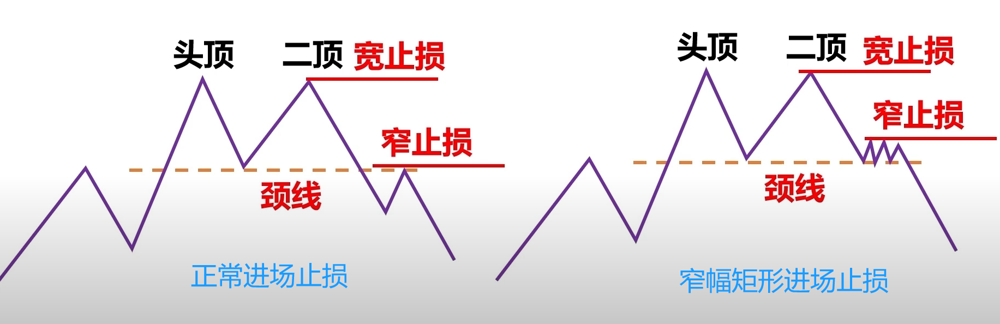
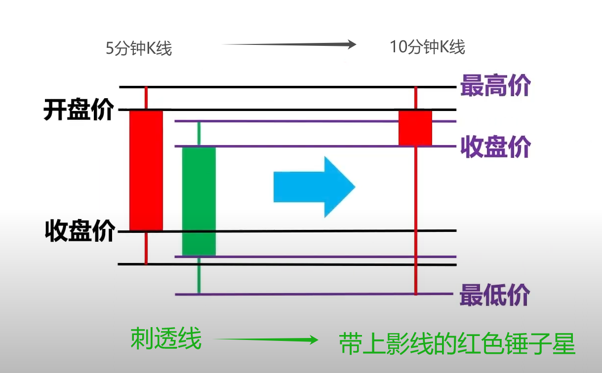
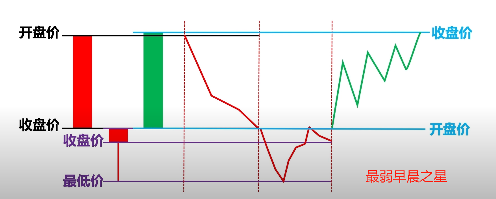
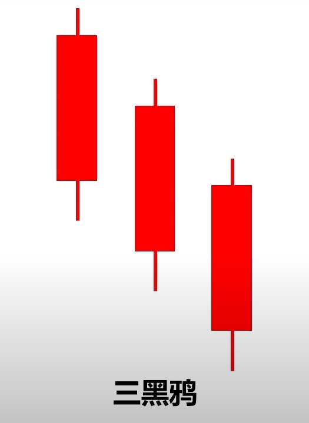

- 参考

  ```
  - 《卫大仑交易法》
  ```

# 交易观念

- 同时兼顾胜率和盈亏比
  - 往往所谓的高胜率方法都是片面的
- 尽量保持右侧交易
  - 即看到明确趋势再交易
  - 只吃鱼身，不要贪婪鱼头和鱼尾
- 尽量顺势操作，即不要考虑抢反弹

# 周期

- 一般小周期和大周期对应4-6倍关系
  - 日线图 -- 4小时图
  - 4小时图 -- 1小时图

# 趋势

- 趋势代表当前周期当前市场的既定走势，不代表未来

- 上涨行情中，更高的低点（D），不能比前高点（C）低太多

  <div style="display: flex; justify-content: left;">
    
  </div>

## 水平支撑阻力

- 水平支撑阻力线，简称水平线，低价位的称支撑线，高价位的称阻力线。

### 七大标准

- 波段高低点
- 显而易见
- 多次接触的
- 接触后反应剧烈的
- 支撑阻力互换的
- 近期形成的
- 大周期的支撑阻力线（一般反应都剧烈）

### 重要性划分

- 重要水平线：前六个满足四个标准即可
  - 如果仅仅满足三个，再考略第七个（大周期）
- 普通水平线：前六个不满足四个标准

### 区域

- 将重要水平线附近K线的影线部分作为水平支撑阻力区域，简称区域或区间
  - 影线就是对价格拒绝的表现，是买卖双方态度分歧的地方
- 区域方框应尽量兼顾多个影线，尽量减少包含K线实体
- 尽量不再区域内进场，我们关注是否出现反转或持续趋势，然后等K线信号出现时再进场

### 画法

<div style="display: flex; justify-content: center;">
  
</div>

1. 先将蜡烛图切换为折线图

2. 画出每个波段的高低点水平线，以及波段中间多次接触的水平线（C）

3. 删除一般的水平线

   1. 先找图表当前页面最高和最低水平线（A、H）
   2. 保留满足4个标准的重要水平线（F、G）
   3. 删除不满足4个标准的普通水平线（B、C、D、E、H）
   4. 因为 G 与 F 的距离比较近，且不如 F 重要，所以也可将 G 删除

4. 得到主要水平线，并切换回蜡烛图

   <div style="display: flex; justify-content: center;">
     
   </div>

5. 根据水平线绘制阻力支撑区域

   <div style="display: flex; justify-content: center;">
     
   </div>

6. 等价格进入这些区域以后，再找机会入场

## 趋势线

### 趋势线

- 形态

  <div style="display: flex; justify-content: center;">
      
      
  </div>

- 原则
  - 适当周期：尽量采用1小时以上的周期
  - 适当点位
  - 适当跨度
  - 适当角度

- 画法

  1. K线实体不能被大部分切割，两点画线，三点确认

  2. LL 连 HL，LH 连 HH。（即 LL < HL < LH < HH）

     <div style="display: flex; justify-content: center;">
       
     </div>
     
     - 此图左侧，选择 L3 为 HL，上涨趋势线已被跌破
     - 此图右侧，选择 L4 为 HL，但应该等比 H2 更高的高点出现，才能连通道线，这样新的上涨通道线依然没被跌破

- 说明

  - 连接影线和实体都可以，只要做到统一
  - 趋势线需要经过第三点验证
  
- 入场

  1. 结合趋势线和反向趋势线，寻找共振区域
  2. 大周期画上涨趋势线，小周期画反向趋势线（即下降趋势线）
  3. 价格回落至上涨趋势线反弹，当超过反向趋势线时，即可入场做多

- 止损：暂定上涨趋势线前一个低点

- 止盈：暂定斐波那契回撤

### 123法则

- 维克多123法则：趋势发生改变，必须经历的三个要素

  - 趋势线被跌（突）破
  - 上涨（下降）趋势不再创新高（低）
  - 价格再次跌（突）破前期的反弹低（高）点

- 说明

  - 123法则是趋势反转的一个必要条件，而非充分条件
  - 三要素的先后顺序可以不同
  - 趋势线必须是验证过的
  - 突（跌）破的必须是K线实体而非影线
  - 此法则适用于单边行情而非震荡
  - 此法则适用于逆势交易（次周期逆势，大周期逆势）

- 三种典型形态

  - 形态1顺序：C跌破趋势线，D不再创新高，跌破之前反弹低点（C）

    <div style="display: flex; justify-content: left;">
      
    </div>

  - 形态2：D不再创新高，跌破趋势线，跌破之前反弹低点（C）

    <div style="display: flex; justify-content: left;">
      
    </div>

  - 形态3：不再创新高，C跌破之前反弹低点，跌破趋势线

    <div style="display: flex; justify-content: left;">
      
    </div>
  
  - 理想形态：C直接跌破趋势线，回弹高点（D）位于趋势线以下，接着跌破之前反弹低点（C）
  
    <div style="display: flex; justify-content: left;">
      
    </div>

### 利用趋势线进场

<div style="display: flex; justify-content: left;">
  
</div>

## 斐波那契

### 回撤

- 作用
  - 根据回调点处于斐波那契区域中的位置，从而判断趋势是否被破坏
- 说明
  - 要有趋势存在
  - 适合4小时以上周期，越大胜算越高
  - 关注区间而非点位
  - 并非下单依据
- 画线顺序
  - 避开价格穿越EMA200的行情
    - 如果行情在EMA200之上，则画上涨行情，波段低点，波段高点
    - 如果行情在EMA200之下，则画下跌行情，波段高点，波段低点
  - 高低点以影线为依据，即最高价和最低价，而不是开盘价和收盘价
- 数值
  - 0，0.382，0.5，0.618，1
  - 数值越大，说明回撤深度越深，越应该警惕反转
  - 0.382：轻度回撤，趋势继续，动能强劲
  - 0.5：中度回撤，趋势继续，动能略减
  - 0.618：重度回撤，趋势待定，动能不足（同时也是现有行情的支撑位）

#### 上涨行情

- 整体行情处于EMA200之上，并处于上涨状态

- 先以A点前波段高低点画斐波那契区域，观察回调点（B）的位置

- 如果回调点位（B）处于0.382~0.618之间，等待二次回调测试形成双底形态

  <div style="display: flex; justify-content: left;">
    
  </div>

- 如果回调点位（B）处于0.382之上，等待二次回调测试形成双底形态

  <div style="display: flex; justify-content: left;">
    
  </div>

- 如果回调点位（B）处于0.618之下，应等待D点的最终定位

  <div style="display: flex; justify-content: left;">
    
  </div>

  - 如果D点上涨，并突破A点阻力位，创出新高点（E），则以B点为低点，E点为高点画斐波那契区域
  
    <div style="display: flex; justify-content: left;">
      
    </div>

#### 下跌行情

- 整体行情处于EMA200之下，并处于下跌状态
- 先以高低点（AB）画斐波那契区域，观察回调点（C）的位置

- 如果回调点位（C）处于0.382~0.618之间，等待二次回调测试形成双顶形态

  <div style="display: flex; justify-content: left;">
    
  </div>

- 如果回调点位（C）处于0.382之下，等待二次回调测试形成双顶形态

  <div style="display: flex; justify-content: left;">
    
  </div>

- 如果回调点位（C）处于0.618之上，应等待D点的最终定位

  <div style="display: flex; justify-content: left;">
    
  </div>

  - 如果D点下跌，并突破B点阻力位，创出新低点（E），则以C点为高点，E点为低点画斐波那契区域
  
    <div style="display: flex; justify-content: left;">
      
    </div>

### 延伸

- 作用
  - 支撑阻力角色
    - 上涨行情扮演阻力角色
    - 下跌行情扮演支撑角色
  - 判断动能强弱
  - 获利止盈依据
  
- 画线顺序
  - 三点画线
  - 上涨行情，波段低点，波段高点，回测点
  - 下跌行情，波段高点，波段低点，回测点
  - 高低点以影线为依据，即最高价和最低价，而不是开（收）盘价
  
- 延伸数值
  - 0.786，1，1.618，2，2.618
  
  - 延伸数值的含义：(延伸点 - 回调点) / (高点 - 低点)
  
    - 实际就是，如果从回调点入场，能赚多少倍的前波段距离
  
      <div style="display: flex; justify-content: left;">
        
      </div>
  
  - 需配合回撤一起使用
  
    - 轻度回撤，重新上涨，止盈可设置在斐波那契延伸1的位置区域
    - 中度回撤，重新上涨，止盈可设置在斐波那契延伸0.786的位置区域
    - 重度回撤，重新上涨，止盈可设置在前高点位置区域
  
  - 如果获利区域之前有重要的阻力支撑位，要以阻力支撑位置为更重要的判断依据

### 扩展

- 目前为止，没觉得延伸和扩展有本质区别

- 画线顺序

  - 三点画线

  - 上涨行情，波段低点，波段高点，波段低点

  - 下跌行情，波段高点，波段低点，波段高点

  - 高低点以影线为依据，即最高价和最低价，而不是开（收）盘价

## 均线

### MA

#### MA基础

- **定义：**移动平均线（MA）是一种常用的技术分析工具，用于平滑价格数据，帮助识别趋势的方向。它通过计算一定时间周期内价格的平均值，提供了市场走势的可视化。
- 作用
  - 趋势判断
    - 当价格处于 MA 之上的时候，说明多头动能强劲，只做多

    - 当价格处于 MA 之下的时候，说明空头动能强劲，只做空

  - 支撑阻力
    - 可以把均线作为价格的支撑线或阻力线
  - 判读震荡
    - 均线越平坦，说明波动越小，处于震荡行情
  
- 分类
  - 简单移动平均线（SMA）
  - 指数移动平均线（EMA）
  - 加权移动平均线（WMA）
  - 等等
- 长度：当前图表周期，多少根K线的各类平均值。
- 基准：默认基准为收盘价
- 说明
  - 均线适用于单边行情，不要在震荡区间使用均线
  - 不要频繁更换均线长度

#### 多头排列

- 行情：多头排列属于看涨行情

  <div style="display: flex; justify-content: center;">
      
      
  </div>

- 多头排列特点

  - 短期均线 > 中期均线 > 长期均线
  - 三者倾斜角度越来越大
  - 间距越来越大，呈现喇叭口形状

#### 金叉死叉

- 行情：金叉死叉不能作为做单依据

- 特点

  - 金叉：短期均线下穿长期均线
  - 死叉：短期均线上穿长期均线

  <div style="display: flex; justify-content: left;">
    
  </div>

#### MA操作

- 进场关键点：

  - 单边行情
  - 短期均线在长期均线上方
  - 价格突破短期均线

- 通用正常进场：突破突破阳线（突破短期均线的阳线）最高价市价进场 + 成交量

  <div style="display: flex; justify-content: left;">
    
  </div>

- 止损：前波段低点
- 止盈：前波段斐波那契0.618 + 移动止盈
  - 卫大仑建议止盈为前波段高点

### SMA

- **定义**：简单移动平均线（SMA）是过去n个周期的收盘价格的平均值，计算周期通常为 20 个时间单位。

- <span style="font-size: 24px;">SMA计算公式：</span>
  $$
  \hspace{-60mm} SMA = \frac{P_1 + P_2 + ... +P_n}{n}
  $$
  其中：

  -  P 是价格
  - n 是均线长度。

- 常用长度
  - 短期：20
  - 中期：50
  - 长期：250

### EMA

- **定义**：指数移动平均线（EMA）对近期价格给予更多权重，计算更复杂，但对市场变化更敏感。

- <span style="font-size: 24px;">EMA计算公式：</span>
  $$
  \hspace{-60mm} EMA_t = \alpha \cdot P_t + (1 - \alpha) \cdot \text{EMA}_{t-1}
  $$
  其中：

  - $ \hspace{0mm} a = \frac{2}{n + 1} $
  - $ P_t $ 是当前价格
  - $ \text{EMA}_{t-1} $ 是前一周期 EMA 值

- 常用长度
  - 短期：
  - 中期：50
  - 长期：200

## 共振区域

- 共振区域就是同时满足多个趋势判断条件的区域
- 以下条件同时满足三个即认为是一个良好的共振区域
  - 水平支撑阻力
  - 趋势线
  - 斐波那契
  - 均线
  - 布林带

# 形态

- 形态：形态是在确定趋势的前提下，对既有趋势持续或反转的确认，但不作为下单依据

  - 延续形态
  - 反转形态
  - 中性形态


## 延续形态

### 延续形态

- 延续形态：是一个顺势形态，其中三角旗形和旗形最强势
  - 旗形
  - 三角旗形
  - 上升 / 下降三角形
  - 窄幅矩形

### 旗形

#### 形态

- 形态：旗形属于延续形态

- 牛旗特点

  - 牛旗的出现一般源于急速上涨和区域突破，旗形之前的上涨阶段比平时更陡峭
  - 不断创造更低的高点和更低的低点
  - 阻力线和支撑线近平行下降
  - 更低的高点LH与前低点有太多的重叠
  - 回调一般会在回撤的0.382~0.5之间结束，然后继续上涨
    - 如果到了0.618区域，就不能当做牛旗处理，视为伪牛旗

  <div style="display: flex; justify-content: center;">
      
      
  </div>

  <div style="display: flex; justify-content: center;">
      
      
  </div>

  <div style="display: flex; justify-content: center;">
      
      
  </div>


#### 操作

- 进场关键点：突破阻力线以后

- 通用正常进场：突破突破阳线（突破阻力位的阳线）最高价市价进场 + 成交量（大，小，大）

  <div style="display: flex; justify-content: center;">
      
      
  </div>

- 保守进场：突破阻力线并回测至阻力线附近时，如果出现看涨信号K线，则进场（很少发生）

  <div style="display: flex; justify-content: left;">
    
  </div>

- 激进进场：突破阻力线后立即市价进场（有很多假突破）

  <div style="display: flex; justify-content: left;">
    
  </div>

- 通用止损止盈

### 三角旗形

#### 形态

- 形态：三角旗形属于延续形态

- 牛三角旗特点

  - 不断创造更低的高点和更高的低点
  - 阻力线下降，支撑线上升
  - 与对称三角形相比，形态形成之前有大幅上涨

  <div style="display: flex; justify-content: center;">
      
      
  </div>


#### 操作

- 进场关键点：在汇集点处突破阻力线

- 通用正常进场：突破突破阳线（突破阻力位的阳线）最高价市价进场 + 成交量（大，小，大）

  <div style="display: flex; justify-content: left;">
    
  </div>

- 通用止损止盈

### 上升三角形

#### 形态

- 形态：上升（下降）三角形属于延续形态

- 上升三角形特点

  - 不断创造等高的高点和更高的低点
  - 阻力线水平，支撑线上升

  <div style="display: flex; justify-content: center;">
      
      
  </div>

#### 操作

- 进场关键点：在汇集点处突破阻力线

- 通用正常进场：突破突破阳线（突破阻力位的阳线）最高价市价进场 + 成交量（大，小，大）

  <div style="display: flex; justify-content: center;">
      
      
  </div>

- 通用止损止盈

### 窄幅矩形

#### 宽窄矩形

- 形态

  - 窄幅矩形低点位于斐波那契0.5以内，属于延续形态
  - 宽幅矩形低点位于斐波那契0.618以外，有可能会反转

  <div style="display: flex; justify-content: left;">
    
  </div>

#### 形态

- 形态：窄幅矩形属于延续形态

- 牛市窄幅矩形特点

  - 不断创造等高的高点和等低的低点
  - 阻力线和支撑线都水平
  - 等低的低点位于斐波那契0.5以内

  <div style="display: flex; justify-content: center;">
      
      
  </div>

#### 操作

- 进场关键点：突破阻力线以后

- 通用正常进场：突破突破阳线（突破阻力位的阳线）最高价市价进场 + 成交量（大，小，大）

  <div style="display: flex; justify-content: center;">
      
      
  </div>

- 通用止损止盈

## 反转形态

### 反转形态

- 反转形态：是一个逆势形态，其中楔形最强势
  - 头肩顶底
  - 双重顶底
  - 三重顶底
  - 楔形
  
- 使用反转形态大前提
  - 市场结构：顺势趋势不能太强势，否则不足以反转
  
  - 主要考虑次级周期的反转形态，以熊市反转为例
    - 这里存在争议，老师在头肩顶中讲的是大级别下跌行情中有小级别的上涨，在小级别上涨中找头肩顶，在次级周期入场
    
      <div style="display: flex; justify-content: left;">
        
      </div>
    
    - 大周期上涨趋势
    
    - 次级周期下跌趋势，出现头肩底反转形态，并突破了颈线
    
    - 在次级周期做反转上涨订单，同时顺应大周期的上升趋势


### 头肩顶底

#### 形态

- 形态：头肩顶底是一个反转形态

- 头肩顶特点

  - 创造高点，低点，更高的高点，低点，高点，低点
  - 关于成交量
    - 头部反弹时最好小于左肩反弹时
    - 右肩反弹时最好小于左肩反弹时
    - 头部下跌时最好高于头部反弹时
    - 从颈线跌破时最好明显增加

  <div style="display: flex; justify-content: center;">
      
      
  </div>


#### 操作

- 进场关键点：在右肩以后跌破颈线

- 通用正常进场：满足反转形态大前提，跌破跌破阴线（跌破颈线的阴线）最低价市价进场 + 成交量

  <div style="display: flex; justify-content: center;">
      
      
  </div>

- 正常进场：跌破颈线蓄积密集区（即窄幅矩形）后进场

  <div style="display: flex; justify-content: center;">
      
      
  </div>

- 止损：突破右肩

  <div style="display: flex; justify-content: center;">
    
  </div>

- 止盈：等距止盈 + 移动止盈

  <div style="display: flex; justify-content: center;">
      
      
  </div>

### 双重顶底

#### 形态

- 形态：多重顶底是一个反转形态

- 双顶特点

  - 上涨行情中，两个顶高点相近，中间夹一个低点
  
  <div style="display: flex; justify-content: center;">
      
      
  </div>

#### 操作

- 进场关键点：

- 通用正常进场：满足反转形态大前提，跌破跌破阴线（跌破颈线的阴线）最低价市价进场 + 成交量

  <div style="display: flex; justify-content: center;">
      
      
  </div>

- 正常进场：跌破颈线蓄积密集区（即窄幅矩形）后进场

  <div style="display: flex; justify-content: center;">
      
      
  </div>

- 止损：突破最后一个顶

  <div style="display: flex; justify-content: center;">
    
  </div>

- 止盈：等距止盈 + 移动止盈

  <div style="display: flex; justify-content: center;">
      
      
  </div>

### 楔形

#### 形态

- 形态：楔形形态是一个反转形态

  <div style="display: flex; justify-content: center;">
      
      
  </div>

- 特点
  - 通道线的斜率相对于趋势线而言更平缓，但通道线不是水平的
  - 上升行情观察上升楔形，下降行情观察下降楔形
  - 注意，趋势线角度的绝对值不应小于30°，否则获利空间很小

#### 操作

- 进场关键点：跌破趋势线

- 正常进场：满足反转形态大前提，跌破跌破阴线最低价市价进场 + 成交量

  <div style="display: flex; justify-content: center;">
    
  </div>

- 止损

  - 最高点已突破通道线时：前一个最高点

  - 最高点未突破通道线时：通道线

  <div style="display: flex; justify-content: center;">
    
  </div>

- 止盈：楔形发起点 + 移动止盈

  <div style="display: flex; justify-content: center;">
      
      
  </div>

## 中性形态

- 不要参与中性形态，不确定性太强

### 对称三角形

#### 形态

- 形态：对称三角形属于中性形态

- 特点

  - 不断创造更低的高点和更高的低点
  - 阻力线下降，支撑线上升，二者相对于水平线对称
  - 与三角旗型相比，形态形成之前没有大幅上涨或下跌

  <div style="display: flex; justify-content: left;">
    
  </div>

#### 操作

- 进场关键点：形态发展的1/2至3/4处突破阻力线（或跌破支撑线）

- 进场1：突破阻力线并回测至阻力线附近时，如果出现看涨信号K线，则进场 + 成交量

  <div style="display: flex; justify-content: center;">
    
  </div>

- 进场2：突破阻力线并回测至阻力线附近，再突破突破阳线最高价时，则进场 + 成交量

  <div style="display: flex; justify-content: center;">
    
  </div>

- 止损：形态失效点

  <div style="display: flex; justify-content: center;">
      
      
  </div>

- 止盈：固定止盈 + 移动止盈

  <div style="display: flex; justify-content: center;">
      
      
  </div>

### 杯柄形态

- 形态：杯柄形态是一个中性形态

  <div style="display: flex; justify-content: center;">
    
  </div>

- 正杯柄形态特点

  - 先在震荡中下降，后在震荡中上升，最后在颈线处形成类似旗形
  - 手柄深度不能超过杯子深度的一半

- 说明：尽量避开急跌急涨的V形杯底，能量容易耗尽

  <div style="display: flex; justify-content: center;">
      
      
  </div>

#### 操作

- 进场关键点：杯柄突破颈线

- 进场1：突破阻力线并回测至阻力线附近时，如果出现看涨信号K线，则进场 + 成交量

  <div style="display: flex; justify-content: center;">
      
      
  </div>

- 止损：形态失效点

  - 窄止损：止损位2
  - 宽止损：止损位3

  <div style="display: flex; justify-content: center;">
      
      
  </div>

- 止盈：固定止盈 + 移动止盈

  <div style="display: flex; justify-content: center;">
      
      
  </div>

# K线

## K线

- 组成

  <div style="display: flex; justify-content: left;">
    
  </div>

## 单K

### 光头光脚阳线

- 特点：没有影线

- 形成过程

  <div style="display: flex; justify-content: center;">
    
    
  </div>
  
  <div style="display: flex; justify-content: center;">
    
  </div>

- 解读：从1到4，买方动能越来越弱
  - 有可能继续上涨，买方动能最强
  - 有可能继续上涨
  - 有可能回落至最低点，然后区间震荡
  - 上涨楔形，后期下跌概率很大

### 带影线阳线

- 特点：有影线

- 形成过程

  <div style="display: flex; justify-content: center;">
    
  </div>

  解读：从1到4，买方动能越来越弱

  - 过程1：有可能继续回落，但整体看涨
  - 过程2：有可能继续上涨，到最高点回调，等待冲高
  - 过程3：有可能继续回落，且回落至最低点概率很大，然后区间震荡
  - 过程4：上涨楔形，后期下跌概率很大

### 常见误区

- 大阳线动能未必强

  <div style="display: flex; justify-content: left;">
    
  </div>

- 实体长未必强：上3和上4买方动能低于下2

  <div style="display: flex; justify-content: left;">
    
  </div>

### 十字星

- 特点：实体很短，上下影线长度大致相同

- 行情：十字星可能反转，也可能回调

- 形成过程

  <div style="display: flex; justify-content: left;">
    
  </div>

  解读：

  - 反转：如果前面是大阳线，后面十字星是过程4，则行情有可能反转

  - 不反转：如果十字星是其它过程，则行情未必反转，可能是简单的回调

    <div style="display: flex; justify-content: left;">
      
    </div>


### 锤子星

- 行情：锤子星和倒锤子星，可能涨，也可能跌

- 特点：只有单一的很长的影线，影线 ≈ 实体 * 1/3

- 绿色锤子星形成过程

  <div style="display: flex; justify-content: center;">
    
  </div>
  
  解读：
  
  - 过程1：如果突破开盘价，大概率会上涨
    - 过程2：震荡行情
    - 过程3：震荡行情
    - 过程4：上升楔形，如果出现在行情顶部，后续如果跌破通道线，且大周期是下跌行情，那么本周期大概率下跌

- 红色锤子星形成过程

  <div style="display: flex; justify-content: center;">
    
  </div>

  解读：

  - 过程1：如果出现在行情底部，后续如果突破开盘价，有可能上涨
  - 过程2：如果出现在行情顶部，后续如果跌破收盘价，有可能下跌
  - 过程3：震荡行情
  - 过程4：下降楔形，如果出现在行情底部，已突破通道线，如果大周期是上涨行情，那么本周期大概率上涨

- 绿色倒锤子星形成过程

  <div style="display: flex; justify-content: center;">
    
  </div>

  解读：

  - 过程1：如果出现在行情顶部，后续如果跌破收盘价，有可能下跌
  - 过程2：如果出现在行情底部，后续如果突破开盘价，有可能上涨
  - 过程3：震荡行情
  - 过程4：下降楔形，如果出现在行情底部，后续如果突破通道线，如果大周期是上涨行情，那么本周期大概率上涨

- 红色倒锤子星形成过程

  <div style="display: flex; justify-content: center;">
    
  </div>

  解读：

  - 过程1：如果出现在行情顶部，后续如果跌破收盘价，大概率下跌
  - 过程2：震荡行情
  - 过程3：震荡行情
  - 过程4：下降楔形，如果出现在行情底部，后续如果突破通道线，如果大周期是上涨行情，那么本周期不排除上涨的可能

## 双K

### 缺口

- 行情：缺口是一个加速器，大概率属于持续行情

  - 当一个缺口被后续相反缺口破坏时，凸显后续缺口更强势

- 看涨缺口特点：当前K线开盘价与前一根K线收盘价不连续，存在缺口

- 形成过程

  <div style="display: flex; justify-content: center;">
    
    
  </div>

### 踢脚

- 行情：看涨踢脚属于看涨行情，组合1最强势

- 看涨踢脚特点：阴线 + 缺口 + 阳线

  <div style="display: flex; justify-content: center;">
    
  </div>

- 形成过程

  <div style="display: flex; justify-content: center;">
    
  </div>

- 组合1：最弱卖方和最强买方

  <div style="display: flex; justify-content: center;">
    
  </div>
  
  解读：
  
  - 第1根K线是下降楔形，可能倾向看涨
    - 两根K线之间存在上涨缺口，看涨
    - 第2根K线强势上涨，看涨
    - 综合，看涨，买方非常强势

- 组合2：最强卖方和最弱买方

  <div style="display: flex; justify-content: center;">
    
  </div>
  
  解读：
  
  - 第1根K线强势下跌，看跌
    - 两根K线之间存在上涨缺口，看涨
    - 第2根K线形成上升楔形，可能倾向看跌
    - 综合，在价格回落到缺口位置以下之前，我们始终认为买方占据优势

- 止损

  - 窄止损：跌破缺口
  - 宽止损：跌破第1根阴线收盘价

- 止盈：待定

### 吞没

- 行情：看涨吞没大概率属于上涨行情

- 看涨吞没特点：切换至2倍周期即合成带影线绿色倒锤子星

  - 小实体阴线 + 大实体阳线
  - 阳线收盘价不低于阴线开盘价，阳线开盘价不高于阴线收盘价
  - 阳线最高价不低于阴线最高价，阳线最低价不高于阴线最低价

  <div style="display: flex; justify-content: center;">
    
    
  </div>

  <div style="display: flex; justify-content: center;">
    
  </div>

- 形成过程

  <div style="display: flex; justify-content: center;">
    
  </div>

- 组合1：最弱卖方和最强买方

  <div style="display: flex; justify-content: center;">
    
  </div>
  
  解读：
  
  - 第1根K线形成下降楔形，可能倾向看涨
    - 两根K线之间存在看跌缺口，看跌
    - 第2根K线强势上涨，看涨
    - 综合，看涨，买方非常强势

- 组合2：最强卖方和最弱买方

  <div style="display: flex; justify-content: center;">
    
  </div>
  解读：

  - 第1根K线倾向震荡
  - 两根K线之间存在看跌缺口，看跌
  - 第2根K线形成上升楔形，可能倾向看跌
  - 综合，整体看跌

### 孕线

- 行情；看涨孕线可能涨，也可能跌

- 看涨孕线特点：切换至2倍周期即合成带影线红色倒锤子星

  - 大实体阴线 + 小实体阳线
  - 阳线收盘价不高于阴线开盘价，阳线开盘价不低于阴线收盘价
  - 阳线最高价不高于阴线最高价，阳线最低价不低于阴线最低价

  <div style="display: flex; justify-content: center;">
    
    
  </div>
  
  <div style="display: flex; justify-content: center;">
    
  </div>
  
- 形成过程

  <div style="display: flex; justify-content: center;">
    
  </div>

- 组合1：最弱卖方和最强买方

  <div style="display: flex; justify-content: center;">
    
  </div>
  
  解读：
  
  - 第1根K线形成下降楔形，可能倾向看涨
  
    - 两根K线之间存在看涨缺口，看涨
    - 第2根K线买方强势，看涨
    - 综合，看涨，买方非常强势

- 组合2：最强卖方和最弱买方

  <div style="display: flex; justify-content: center;">
    
  </div>
  解读：

  - 第1根K线卖方强势，看跌
  - 两根K线之间存在看涨缺口，看涨
  - 第2根K线形成上升楔形，可能倾向看跌
  - 综合，由于存在缺口，买方暂时占有优势

### 刺透线和乌云盖

- 行情：刺透线可能涨，也可能跌

- 刺透线特点：切换至2倍周期即合成带影线红色倒锤子星

  - 等实体阴线 + 等实体阳线
  - 阳线收盘价介于阴线开盘价和实体50%之间
  - 阳线开盘价低于阴线收盘价

  <div style="display: flex; justify-content: center;">
    
    
  </div>
  
  <div style="display: flex; justify-content: center;">
    
  </div>
  
- 形成过程

  <div style="display: flex; justify-content: center;">
    
  </div>

- 组合1：最弱卖方和最强买方

  <div style="display: flex; justify-content: center;">
    
  </div>
  
  解读：
  
  - 第1根K线形成下降楔形，可能倾向看涨
    - 两根K线之间存在看跌缺口，看跌
    - 第2根K线买方强势，看涨
    - 综合，看涨，买方非常强势

- 组合2：最强卖方和最弱买方

  <div style="display: flex; justify-content: center;">
    
  </div>
  解读：

  - 第1根K线，卖方强势
  - 两根K线之间存在看跌缺口，看跌
  - 第2根K线，形成上升楔形，可能倾向看跌
  - 综合，如果跌破缺口，可能会大跌

## 三K

### 早晨之星和黄昏之星

- 行情：大概率涨，小概率跌

- 早晨之星特点：切换至3倍周期即合成超级倒锤子星

  - 等实体阴线 + 锤子星/十字星 + 等实体阳线
  - 第2根K线与第3根K线之间有看涨缺口

  <div style="display: flex; justify-content: center;">
    
    
  </div>

  <div style="display: flex; justify-content: center;">
    
    
  </div>
  <div style="display: flex; justify-content: center;">
    
  </div>
  
- 形成过程

  <div style="display: flex; justify-content: center;">
    
  </div>

- 组合1：最弱卖方和最强买方

  <div style="display: flex; justify-content: center;">
    
  </div>
  
  解读：
  
  - 第1根K线，形成下降楔形，看涨
    - 第2根K线，形成下降楔形，并突破阻力线，看涨
    - 第2、3根K线之间存在看涨缺口，看涨
    - 第3根K线，买方强势，看涨
    - 综合，买方非常强势，看涨

- 组合2：最强卖方和最弱买方

  <div style="display: flex; justify-content: center;">
    
  </div>
  解读：

  - 第1根K线，卖方强势，看跌
  - 第2根K线，买卖双方势均力敌，震荡
  - 第2、3根K线之间存在看涨缺口，看涨
  - 第3根K线，形成上升楔形，看跌
  - 综合，买方暂时占据优势，但是如果跌破缺口，可能会大跌

### 三白兵和三黑鸦

- 行情：可能涨，也有可能跌

- 三白兵特点：切换至3倍周期即合成大阳线

  - 阳线 + 阳线 + 阳线
  - 没有影线或影线很短，实体占K线大部分
  - 第2、3根K线与前一根K线都有下降缺口
  - 第3根K线最低点不低于第1根K线最高点太多

  <div style="display: flex; justify-content: center;">
    
    
  </div>

  <div style="display: flex; justify-content: center;">
    
    
  </div>

- 形成过程

  <div style="display: flex; justify-content: center;">
    
  </div>

- 组合1：最强买方

  <div style="display: flex; justify-content: center;">
    
  </div>
  
  解读：
  
  - 第1根K线，买方强势，看涨
    - 第1、2根K线之间存在下降缺口，看跌
    - 第2根K线，买方强势，并突破低开下降缺口，看涨
    - 第2、3根K线之间存在下降缺口，看跌
    - 第2根K线，买方强势，并突破低开下降缺口，看涨
    - 综合，买方一直很强势，并不断突破下降缺口，看涨

- 组合2：最弱买方

  <div style="display: flex; justify-content: center;">
    
  </div>
  解读：

  - 第1根K线，形成上升楔形，看跌
  - 第1、2根K线之间存在下降缺口，看跌
  - 第2根K线，形成上升楔形，并突破低开下降缺口，等待跌破趋势线
  - 第2、3根K线之间存在下降缺口，看跌
  - 第3根K线，形成上升楔形，并突破低开下降缺口，等待跌破趋势线
  - 综合，虽然三段趋势都在上涨，但卖方仍占据优势，等待跌破趋势线后看跌

# 指标

<div style="display: flex; justify-content: center;">
  
</div>

## 指标

- 动能指标

  - 用于分析买卖双方的力量
  - 如RSI，CCI，KDJ等

- 趋势指标

  - 用于识别行情的趋势和反转
  - 如均线，SAR，MACD等
  - 当行情处于震荡区间，趋势指标无效

- 波动率指标

  - 用于衡量价格变动速度，与方向无关
  - 如ATR，布林带，标准方差等

- 分类

  <table style="text-align: center;">
    <tr>
      <th style="color: red;">动能指标</th>
      <th style="color: yellow;">趋势指标</th>
      <th style="color: green;">波动率指标</th>
    </tr>
    <tr>
      <td style="color: red;">RSI</td>
      <td colspan="2">布林带</td>
    </tr>
    <tr>
      <td style="color: red;">CCI</td>
      <td colspan="2">ATR</td>
    </tr>
    <tr>
      <td style="color: red;">威廉指标</td>
      <td style="color: yellow;">SAR</td>
      <td style="color: green;">肯特那通道指标</td>
    </tr>
    <tr>
      <td style="color: red;">KDJ</td>
      <td style="color: yellow;">均线</td>
      <td style="color: green;">标准方差</td>
    </tr>
    <tr>
      <td colspan="2">MACD</td>
      <td></td>
    </tr>
    <tr>
      <td colspan="2">一目均衡</td>
      <td></td>
    </tr>
    <tr>
      <td></td>
      <td style="color: yellow;">ADX</td>
      <td></td>
    </tr>
  </table>

## RSI

### RSI原理

- **定义**：相对强弱指数（RSI）是一个动能指标，用于分析买卖双方的力量。

- 其它

  - 涨幅与跌幅默认以收盘价为计算基准
  - 范围从 0 到 100
  - 默认长度为14根K线

- **方法一**

  <span style="font-size: 24px;">RS的计算公式：</span>
  $$
  \hspace{-40mm} RS = \frac{|总涨幅平均数|}{|总跌幅平均数|} = \frac{\frac{|总涨幅|}{14}}{\frac{|总跌幅|}{14}}
  = \frac{|总涨幅|}{|总跌幅|}
  $$

  <span style="font-size: 24px;">RSI的计算公式：</span>
  $$
  \hspace{-55mm} RSI = 100 - \frac{100}{1 + RS}
  $$

  - 当总涨幅与总跌幅相等，即 RS = 1 时，RSI = 50，说明买卖双方力量相当

- **方法二**

  <span style="font-size: 24px;">RSI的计算公式：</span>
  $$
  \hspace{-55mm} RSI = \frac{|总涨幅|}{|总涨幅| + |总跌幅|}
  $$

  - 当总涨幅比总跌幅大很多时，RSI 无限接近100
  - 当总涨幅比总跌幅小很多时，RSI 无限接近0

### 超买/超卖

- RSI 超过 70 通常表示市场超买，可能会出现价格回调；
- 低于 30 表示市场超卖，可能会出现价格反弹。
- 超买超卖不能对做单构成指导！

### RSI背离

- 背离分
  - 宽背离：两个背离点之间大于14根K线
  - 窄背离：两个背离点之间小于14根K线

#### 形态

- 顶背离形态

  <div style="display: flex; justify-content: center;">
    
    
    
  </div>

- 顶背离特点
  - 价格创出新高而 RSI 未能创出新高，可能预示趋势反转。
- 说明
  - 背离的连线应该连接收盘价，因为 RSI 默认是以收盘价计算的
  - 背离未必发生反转，顶（底）背离唯一能说明的就是买（卖）方动能在下降

#### 操作

- 顶背离关键点：

  - 发生 RSI 背离

  - 跌破趋势线

- 通用正常进场：跌破跌破阴线（跌破趋势线的阴线）最低价市价进场 + 成交量

  <div style="display: flex; justify-content: center;">
    
  </div>

- 止损
  - 窄止损：跌破阴线的最高价
  - 宽止损：价格背离最高点
- 止盈：趋势线波段低点 + 移动止盈

## MACD

### MACD基础

- **定义**：移动平均收敛/发散指标（MACD）（Moving Average Convergence Divergence）通过计算短期和长期 EMA 之间的差距来分析强度和强度的变化。
- 组成
  - 零轴：即水平轴，也称水轴。
  - DIF线
  - DEA线
  - 柱状图

### DIF线

- **定义**：DIF（Difference）线表示两条不同周期（默认快线12，慢线26）的 EMA 之间的差值，也称 MACD 线。

  <span style="font-size: 24px;">DIF计算公式：</span>
  $$
  \hspace{-60mm} DIF = EMA_{12} - EMA_{26}
  $$
  
- 当 EMA12 = EMA26 时，DIF 线为 0，为多空双方博弈分界线

- DIF 线斜率向上切斜时，说明 EMA12 与 EMA26 差值在增大，买方动能在增强。

### DEA线

- **定义**：DEA（Diff Exponential Average）线表示 DIF 线的某个周期（默认为9）的 EMA，也称信号线。

  <span style="font-size: 24px;">DEA计算公式：</span>
  $$
  \hspace{-60mm} DEA = EMA_{9}(DIF)
  $$

### 能量柱

- **定义**：能量柱（Histogram）表示 DIF 与 DEA 的差值。也称柱状图、直方图。

  <span style="font-size: 24px;">能量柱计算公式：</span>
  $$
  \hspace{-60mm} \textit{能量柱} = DIF - DEA
  $$

- 当 DIF = DEA 时，柱状图为 0

### 金叉死叉

- 金叉：DIF 线上穿 DEA 线
- 死叉：DIF 线下穿 DEA 线
- 不建议依据金叉死叉做单，因为有很强的滞后性
- 如果非要使用金叉死叉
  - 过滤掉高位金叉和低位死叉，因为延续空间太小，无意义
  - 过滤掉低位金叉和高位死叉，因为这属于逆势操作
  - 只考虑零轴附近的金叉死叉
    - 零轴偏上的金叉做多
    - 零轴偏下的死叉做空

### MACD背离

- MACD 背离价格连线采用收盘价，因为 MACD 计算基于价格收盘价
- 线背离和柱背离未必同步
- 线背离和柱背离同时发生，反转概率更高

#### 线背离

- 线顶背离特点（线底背离反之）

  - 线背离只采用宽背离，因为窄背离不容易观察
  - 价格波峰的上升斜率比 DIF 线大
  - 线顶背离期间，DIF 线不能下穿过零轴，即波谷位于零轴之上

  <div style="display: flex; justify-content: center;">
    
    
    
  </div>

  <div style="display: flex; justify-content: center;">
    
    
    
  </div>

#### 柱背离

- 柱顶背离特点（柱底背离反之）

  - 柱背离可采用宽背离和窄背离
  - 价格波峰的上升斜率比能量柱大

  <div style="display: flex; justify-content: center;">
    
    
    
  </div>

  <div style="display: flex; justify-content: center;">
    
    
    
  </div>

  <div style="display: flex; justify-content: center;">
    
    
  </div>

### 操作

- 顶背离关键点：

  - 同时发生 MACD 线背离和柱背离
  - 跌破趋势线

- 通用正常进场：跌破跌破阴线（跌破趋势线的阴线）最低价市价进场 + 成交量

  <div style="display: flex; justify-content: left;">
    
  </div>

- 止损

  - 窄止损：跌破阴线的最高价
  - 宽止损：价格背离最高点

- 止盈：趋势线波段低点 + 移动止盈

## 布林带

### 布林带基础

- **定义**：布林带（BB）（Bollinger Bands）包括一个中间的 SMA 和上下两个标准差线，用于衡量市场的波动性。
- **组成**：
  - 上轨
  - 下轨
  - 中轨
  - 带宽：上轨与下轨之间的距离（默认是4倍的标准差）。带宽反映市场的波动大小。


### 标准差

- 计算公式：

  <span style="font-size: 24px;">平均数公式：</span>
  $$
  \hspace{-65mm} μ = \frac{a_1 + a_2 + a_3 + a_4 + ... + a_n}{n}
  $$
  其中：

  - $\large a_n$ 为收盘价
  - $n$ 为K线数量

  <span style="font-size: 24px;">方差公式：</span>
  $$
  \hspace{-65mm} σ^2 = \frac{(a_1 - μ)^2 + (a_2 - μ)^2 + ... + (a_n - μ)^2}{n}\\
  \hspace{-95mm} = \frac{1}{n}\sum_{i=1}^{n} （a_i - μ）^2
  $$
  <span style="font-size: 24px;">标准差公式：</span>
  $$
  \hspace{-125mm} σ = \sqrt{σ^2}\\
  \hspace{-95mm} = \sqrt{\frac{1}{n}\sum_{i=1}^{n} （a_i - μ）^2}
  $$
  其中：

  - $σ$ 是标准差；

    $n$ 是K线数量；

    $a_i$ 是每一根 K 线收盘价；

    $μ$ 是所有 K 线收盘价的平均值。

- 标准差分布

  <div style="display: flex; justify-content: left;">
    
  </div>

### 中轨

- 中轨（Middle Band）通常是价格的简单移动平均线（SMA），默认周期为20天。

  <span style="font-size: 24px;">中轨计算公式：</span>
  $$
  \hspace{-60mm} 中轨 = SMA_{20}
  $$
  
- 它反映了一段时间内的平均价格水平

- 设置

  - 长度：20
  - 类型：SMA
  - 数据来源：收盘价

### 上轨

- 上轨（Upper Band）是中轨加上某个倍数（默认2倍）的标准差。

  <span style="font-size: 24px;">上轨计算公式：</span>
  $$
  \hspace{-60mm} 上轨 = 中轨 + 2 * 标准差
  $$

- 它代表了市场价格的相对高位，具有阻力作用，同时也反映市场的波动性。

- 设置

  - 标准差倍数（StdDev）：默认2，即有 95.4% 的收盘价在上下轨之间
  - 偏移（Offset）：默认0

### 下轨

- 下轨（Lower Band）是中轨减去某个倍数（默认2倍）的标准差。

  <span style="font-size: 24px;">下轨计算公式：</span>
  $$
  \hspace{-60mm} 下轨 = 中轨 - 2 * 标准差
  $$
  
- 它代表了市场价格的相对低位，具有支撑作用，同时也反映市场的波动性。

### 布林带宽度

- **定义**：布林带宽度（BBW）（Bollinger Bandwidth）是布林带的一个延伸指标，用于衡量市场波动性。

  <span style="font-size: 24px;">下轨计算公式：</span>
  $$
  \hspace{-60mm} BBW = \frac{上轨 - 下轨}{中轨}
  $$
  解释：BBW值越高，表示市场波动性越大

- 设置

  - 长度，来源，标准差：与 BB 相同
  - 最高扩张长度（Highest Expansion Length）：
  - 最低收缩长度（Lowest Contraction Length）：

### 布林带应用

#### 支撑阻力

- 布林带支撑阻力适用于宽幅震荡行情
- 进场
  1. 确定宽幅震荡区间
     1. 中轨不平坦
     2. 上下轨不相互靠近
  2. 寻找共振区域
     1. 画出水平支撑阻力线
     2. 结合布林带上下轨
  3. 识别信号K线

#### 挤压扩张

- 布林带挤压
- 进场
  1. 确定窄幅区间
     1. 中轨平坦
     2. 上下轨相互靠近
  2. 使用带宽指标
  3. 绘制支撑阻力
  4. 选择进场方式

#### 通道背离


## ATR

ATR（Average True Range）是技术分析中的一种指标，用来衡量资产在特定时间段内的波动性。ATR越高，表示该资产的波动性越大，反之亦然。通常使用14天的ATR来衡量波动性。

- 止损价格可以设置为当前价格减去1-2倍的 ATR 值。
- 止盈价格可以设置为当前价格加上2-3倍的 ATR 值。

# 进场

- 关键点（以牛市为例，熊市同理）
  - 延续形态：突破阻力线（通道线）
  - 反转形态：跌破支撑线（趋势线）

- 进场（以牛市延续形态为例，熊市同理），具体见旗形形态
  - 正常进场：突破突破阳线（突破阻力位的阳线）最高价市价进场 + 成交量（大，小，大）
  - 保守进场：突破阻力线并回测至阻力线附近时，如果出现看涨信号K线，则进场（很少发生）
  - 激进进场：突破阻力线后立即市价进场（有很多假突破）


# 止损

- 止损原则：止损位应该在一个一旦被突（跌）破，将使交易形态失效的位置
- 延续形态
  - 斐波那契回撤0.618区域
  - ATR
  - 手动止损：（牛市延续形态）
    - 关键点：跌破形态发起低点
    - 原理同进场的三种方法
    - 手动止损和进场方式应该保持一致性
    - 目前采用正常方法（跌破跌破阴线最低价）
- 反转形态：见各自章节

# 止盈

- 顺势：斐波那契延伸
- 逆势：固定止盈
- 移动止盈：结合EMA
  - 单一K线跌破视为假跌破
  - K线实体跌破EMA，并且下一根K线跌破跌破K线的最低价

# 做单

## 123

- 先确定大周期的趋势
- 再确定次级周期趋势
  - 如果次级周期和大周期趋势一致，则在次级周期寻找延续形态
  - 如果次级周期和大周期趋势相反，则在次级周期寻找反转形态
- 次级周期出现对应形态之后，根据入场信号入场开单
- 根据各自规则进行止损止盈

## 辨趋势

（共振区域：同时符合以下3个）

- 水平支撑阻力线
  - 看涨：突破阻力区域
  - 看跌：跌破支撑区域
- 趋势线
  - 两点画线，三点验证
- 斐波那契回撤
  - 持续：小于0.5
  - 反转：大于0.618
- 均线
  - 看涨：短期均线位于长期均线上方
  - 看跌：短期均线位于长期均线下方
- 布林带
  - 看涨：价格位于中轨之上
  - 看跌：价格位于中轨之下

## 找形态

- 延续形态

  <div style="display: flex; justify-content: center;">
    
    
    
    
  </div>

- 反转形态

  <div style="display: flex; justify-content: center;">
    
    
    
  </div>

- 中性形态

  <div style="display: flex; justify-content: center;">
    
    
  </div>

## 识信号

- K线

  <div style="display: flex; justify-content: center;">
    
    
    
    
  </div>

  <div style="display: flex; justify-content: center;">
    
    
    
  </div>

  <div style="display: flex; justify-content: center;">
    
    
    
  </div>

- 指标

  <div style="display: flex; justify-content: center;">
    
    
    
  </div>

## 进场信号

- 水平支撑阻力线
  - 突破突破阻力线阳线最高点
  - 跌破跌破支撑线阴线最低点
- 均线：价格突（跌）破短期均线
- 背离：跌破跌破趋势线阴线最低点

# 币安

## 合约账户

- **保证金余额**：
- **钱包余额**：手里剩余钱 + 投入的钱
- **未实现盈亏**：当前仓位未实现的盈亏
- **真实剩的钱**：`钱包余额` + `未实现盈亏` - 平仓手续费

## 逐仓和全仓对比

- 补仓
  - `开仓价格` 变化
  - `强平价格` 变化
  - `钱包余额` 变化
  - `保证金` 增加
- 平仓
  - `开仓价格` 不变
  - `强平价格`
    - 逐仓：不变
    - 全仓：变化
  - `钱包余额` 变化
  - `保证金` 减少

# 交易术语

## 币本位

币本位交易以**交易货币**为标的物，即涨跌都使用币作为结算标的；而 U 本位以 **USDT** 为标的物。

## 分析

[本节内容是 Youtube 博主的分享，旨在讨论币本位做多和做空](https://www.youtube.com/watch?v=I0_JlGA2JBs)。

使用币本位合约做1个 BTC，给定条件如下：

- 杠杆：n
- 开仓价：x USDT
- 保证金：k BTC
- 仓位：nk BTC
- 价格波动率：a

### 做多

- **当前市价（USDT）**：$\large x(1 + a)\ \text{USDT}$

- **赚取的 USDT**：
  $\large (市价-开仓价)*仓位=[x(1+a)-x]*nk=xank\ \text{USDT}$

- **赚取的 BTC**：$\Large\frac{\text{赚取的 USDT}}{\text{当前市价}}=\LARGE \frac{xank}{x(1+a)}=\LARGE \frac{ank}{1+a}\ \text{BTC}$

- **收益率**：$\Large\frac{\text{赚取的 BTC}}{\text{保证金}}=\LARGE \frac{ank}{1+a}/k=\LARGE \frac{an}{1+a}$

  - 当 $\large\text{收益率}=-100\%$ 时，仓位（BTC 数量）爆仓

    $\Large \frac{an}{1+a}=-1$

    $\Large a=-\frac{1}{n+1}$

    当 $\large n=1$ 时，$\large a=-50\%$，即价格下降50%时，便会爆仓；这与 U 本位（价格跌至0）不同。

  - 当 $\large\text{收益率}=100\%$ 时，仓位（BTC 数量）翻倍

      $\Large \frac{an}{1+a}=1$

      $\Large a=\frac{1}{n-1}$
      
      当 $\large n=1$ 时，$\large a=+∞$，即价格波动至无穷大时，BTC 数量才会翻倍；这与 U 本位（价格翻倍）不同。


### 做空

- **当前市价（USDT）**：$\large x(1 + a)\ \text{USDT}$

- **赚取的 USDT**：
    $\large (开仓价-市价)*仓位=[x-x(1+a)]*nk=-xank\ \text{USDT}$

- **赚取的 BTC**：$\Large\frac{\text{赚取的 USDT}}{\text{当前市价}}=\LARGE \frac{-xank}{x(1+a)}=\LARGE -\frac{ank}{1+a}\ \text{BTC}$

- **收益率**：$\Large\frac{\text{赚取的 BTC}}{\text{保证金}}=\LARGE -\frac{ank}{1+a}/k=\LARGE -\frac{an}{1+a}$

    - 当 $\large\text{收益率}=-100\%$ 时，仓位（BTC 数量）爆仓

        $\Large -\frac{an}{1+a}=-1$

        $\Large a=\frac{1}{n-1}$

        当 $\large n=1$ 时，$\large a=+∞$，即价格波动至无穷大时，才会爆仓；这与 U 本位（价格翻倍）不同。

    - 当 $\large\text{收益率}=100\%$ 时，仓位（BTC 数量）翻倍

        $\Large -\frac{an}{1+a}=1$

        $\Large a=-\frac{1}{n+1}$

        当 $\large n=1$ 时，$\large a=-50\%$，即价格下降50%时，BTC 数量翻倍。

- **套息保值**：即使用币本位做空时，无论价格涨与跌，最终折算成 USDT 的价值都是不变的。

    

    1
