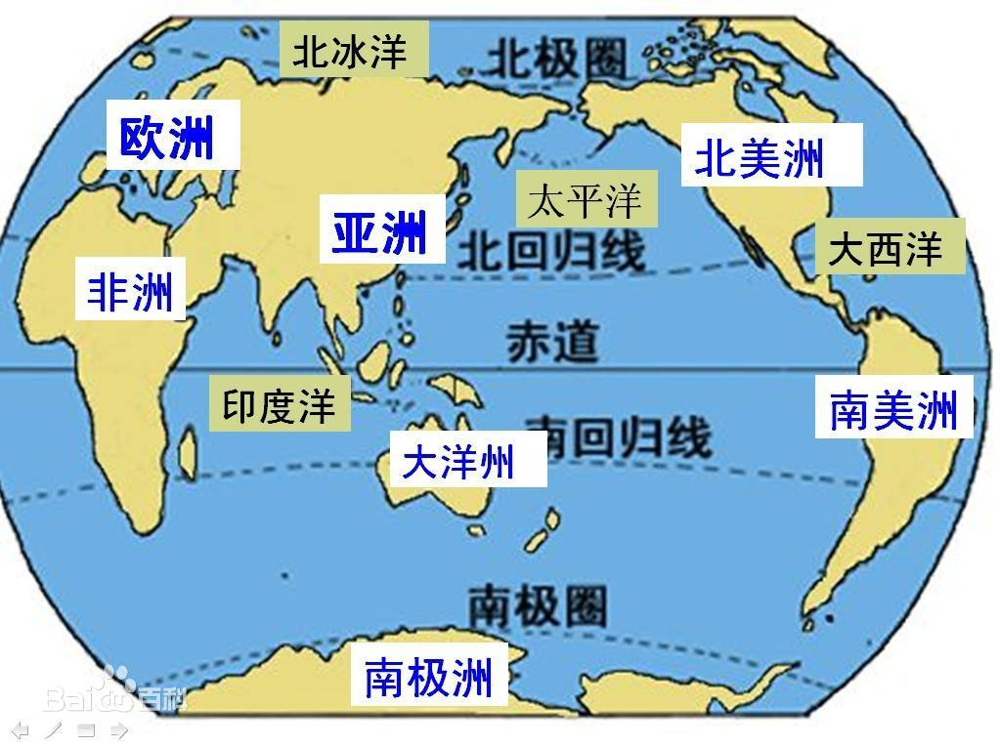
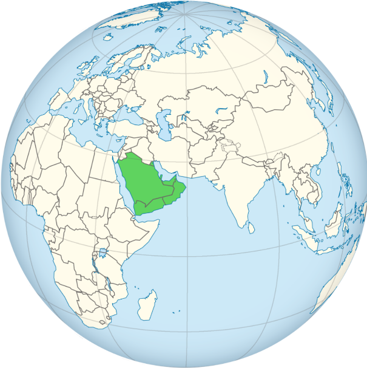
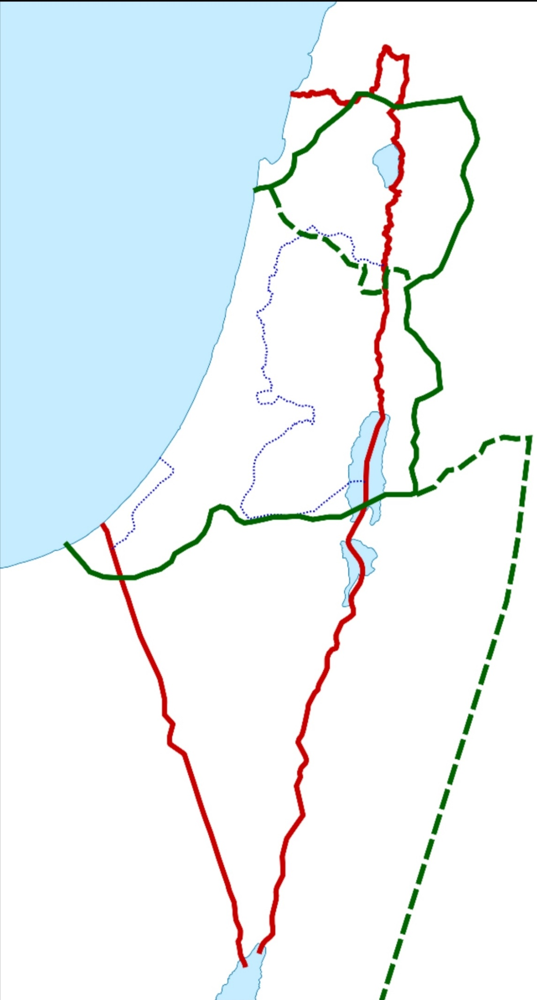

# 世界格局划分

## 世界地理格局划分

  

- 七大洲：亚洲、非洲、欧洲、北美洲、南美洲、南极洲、大洋洲。
- 四大洋：太平洋、大西洋、印度洋、北冰洋。
- 两河流域
  - 幼发拉底河
  - 底格里斯河

## 四大文明古国

四大文明古国，是关于世界四大古代文明的统称，是流行于汉语文化圈的一个概念。分别是两河流域的古巴比伦（位于西亚，今地域属伊拉克）、尼罗河流域的古埃及（位于西亚及北非交界处，今地域属埃及）、印度河流域和恒河流域的古印度（位于南亚，地域范围包括今印度、巴基斯坦等国）和黄河流域的中国（位于东亚）。

四大古文明的意义并不在时间的先后，而在于它们是后来诸多文明的发源地，对其所在地区产生了巨大影响。四大文明是原生文明，而其他文明属于派生文明，深受临近地区原生文明的影响。

- 形成概况

  <table style="text-align: center;">
    <tr>
      <th>文明</th>
      <th>两河文明</th>
      <th>埃及文明</th>
      <th colspan="2">印度文明</th>
      <th>华夏文明</th>
    </tr>
    <tr>
      <th>发源地</th>
      <td>两河流域</td>
      <td>尼罗河流域</td>
      <td>印度河流域</td>
      <td>恒河流域</td>
      <td>黄河流域</td>
    </tr>
    <tr>
      <th>民族</th>
      <td>苏美尔人、阿卡德人、阿摩利人、希伯来人、亚述人、迦勒底人等</td>
      <td>埃及人、努比亚、马其顿、科普特、等</td>
      <td>达罗毗荼人（哈拉巴人）</td>
      <td>雅利安人</td>
      <td>汉人、满族、女真、契丹、等</td>
    </tr>
    <tr>
      <th>文明形成时间</th>
      <td>约公元前5500年</td>
      <td>约公元前5250年</td>
      <td>约公元前2500年</td>
      <td>约公元前1000年</td>
      <td>约公元前3000年</td>
    </tr>
    <tr>
      <th>统一政权建立时间</th>
      <td>公元前2371年（一说约公元前2369年）——阿卡德王国</td>
      <td>约公元前3100年——埃及第一王朝</td>
      <td>考古缺失</td>
      <td>公元前6世纪左右古印度出现16个王国</td>
      <td>约公元前2070年</td>
    </tr>
    <tr>
      <th>国家灭亡时间</th>
      <td>公元前539年新巴比伦王国被波斯帝国灭亡</td>
      <td>共10个时代32个王朝，公元前30年托勒密王朝被罗马帝国吞并。埃及王国政权倒台（托勒密王朝虽为马其顿人建立，但其很快埃及化，属于改朝换代）</td>
      <td>公元前1750年左右雅利安人入侵，印度河城邦消失</td>
      <td>公元前187年孔雀帝国灭亡，之后外族不断入侵建立贵霜帝国、莫卧儿帝国、英属印度等，民族、宗教矛盾尖锐，文明停滞不前</td>
      <td>公元1279年元灭南宋（之后政权回归，属于改朝换代）</td>
    </tr>
    <tr>
      <th>文明灭亡时间</th>
      <td>中世纪两河流域伊斯兰化</td>
      <td>公元7世纪古埃及文化被阿拉伯帝国伊斯兰化，埃及文明中断，但保留了科普特语（由古埃及语发展而来）</td>
      <td>公元前1750年左右灭亡，因外族入侵而消亡</td>
      <td>部分未灭亡（莫卧儿帝国遭受英国入侵后英语成为通用语，梵语发展为印地语，印巴分治。印度教及印度文化流传至今）</td>
      <td>复兴中</td>
    </tr>
    <tr>
      <th rowspan="2">社会阶级</th>
      <td>统治阶级：全权自由民</td>
      <td>统治阶级：中央为拉之子（法老）、王室、官员、祭司、贵族、奴隶主</td>
      <td rowspan="2">考古缺失</td>
      <td>统治阶级：婆罗门、刹帝利。</td>
      <td>统治阶级：中央为天子、勋贵、官员，地方为奴隶主、地主、诸侯。</td>
    </tr>
    <tr>
      <td>被统治阶级：奴隶、无权自由民</td>
      <td>被统治阶级：自由民、奴隶、农民。</td>
      <td>被统治阶级：吠舍、首陀罗</td>
      <td>被统治阶级：农民、奴隶。</td>
    </tr>
    <tr>
      <th>文字</th>
      <td>楔形文字</td>
      <td>象形文字（棺纂，金字塔铭文，圣书体，世俗体，僧侣体，科普特字母，腓尼基字母，希腊字母，拉丁字母，英文字母）</td>
      <td>印章文字</td>
      <td>梵文</td>
      <td>甲骨文</td>
    </tr>
    <tr>
      <th>天文历法</th>
      <td>太阴历、星期制</td>
      <td>太阳历、科普特历</td>
      <td>考古缺失</td>
      <td>太阳历</td>
      <td>夏小正、殷历、农历等</td>
    </tr>
    <tr>
      <th>代表/建筑</th>
      <td>古巴比伦城、亚述巴尼拔图书馆、乌尔古城、等</td>
      <td>吉萨大金字塔群、亚历山大灯塔、狮身人面像亚历山大图书馆、卡纳克神殿、卢克索神殿、荷鲁斯神殿、萨拉丁城堡</td>
      <td>摩亨佐·达罗、哈拉帕</td>
      <td>泰姬陵、布道山洞、哈马尔大陵墓</td>
      <td>殷墟、秦始兵马俑、长城、等</td>
    </tr>
    <tr>
      <th>早期城市</th>
      <td>巴比伦城、大马士革、巴格达</td>
      <td>孟斐斯（白城）、底比斯</td>
      <td>摩亨佐·达罗城、哈拉帕城、洛塔城</td>
      <td>德里、华氏城、曲女城、</td>
      <td>良渚古城、商都殷（河南安阳殷墟）</td>
    </tr>
  </table>

## 世界政治格局

## 世界军事格局

## 世界经济格局

- **三大经济体**
  - 欧盟
  - 亚太经合组织
  - 北美自由贸易区

### 金砖四国

一般认为，最早提出“金砖四国”这一概念的是美国高盛公司，2003年10月高盛公司发表了一份题为“与BRICs一起梦想的全球经济报告\”。报告估计，到2050年，世界经济格局将会经历剧烈洗牌。全球新的六大经济体将变成中国、美国、印度、日本、巴西、俄罗斯。“金砖四国”这个词是高盛公司的吉姆·奥尼尔于2001年首次提出的。“金砖四国”（BRIC）引用了巴西、俄罗斯、印度和中国的英文首字母。由于该词与英文中的砖（Brick）类似，因此被称为“金砖四国”。2010年12月，中国作为“金砖国家”合作机制轮值主席国，与俄罗斯、印度、巴西一致商定，吸收南非作为正式成员加入“金砖国家”合作机制，“金砖四国”即将变成“金砖五国”，并更名为“金砖国家”（BRICS）。

### 新钻十一国

- 包括尼日利亚、墨西哥，伊朗、韩国和印尼，孟加拉国、菲律宾，巴基斯坦和埃及，越南国，土耳其。

### 八国集团

### 二十国集团

### 高盛集团

# 世界性宗教

## 亚伯拉罕诸教

在宗教归纳层面上，犹太教、伊斯兰教、基督教同属于“亚伯拉罕系教”，共同组成“世界三大一神论宗教”，各方均认同亚伯拉罕的先知地位，其历史均可追溯至亚伯拉罕时期。

### 区分

- 都信奉“独一真神”，真神创造万物，将来会有审判和复活。
  - 犹太教和基督教称作上帝耶和华，都相信弥赛亚，但是犹太教不相信耶稣就是弥赛亚，也不是先知。
  - 伊斯兰教称为真主安拉，认为耶稣只是先知，穆罕默德是上帝挑选的最后一位先知，即“封印先知”。
- 关于经典
  - 犹太教的经典为《塔纳赫》，不承认《圣经·新约》和《古兰经》。
  - 基督教的经典为《圣经》，承认《塔纳赫》，不承认《古兰经》。
  - 伊斯兰教的经典为《古兰经》，只承认《塔纳赫》的前五卷和《圣经·新约》的部分内容。伊斯兰教相信《圣经》的神圣，但认为《圣经》的内容在历史的进程中已被修改或者失真误解，各种《圣经》的不同处一律要以上帝最后赐予穆罕默德的《古兰经》为准。
- 伊斯兰教比基督教更接近犹太教。
  - 反对把先知神化，彻底地禁绝偶像崇拜，没有对于供奉天使或圣人的仪式，并且禁食猪肉和行割礼，一夫多妻制。

    <table style="text-align: center;">
      <tr>
        <th colspan="2">类别</th>
        <th>犹太教</th>
        <th>基督教</th>
        <th>伊斯兰教</th>
      </tr>
      <tr>
        <td rowspan="3">属性</td>
        <td>神的名字（中译）</td>
        <td colspan="2">耶和华或雅威</td>
        <td>安拉</td>
      </tr>
      <tr>
        <td>独一性</td>
        <td colspan="3">独一真神，创造世界，全知、全能、全善、全在、永恒，将来审判</td>
      </tr>
      <tr>
        <td>三位一体</td>
        <td>否</td>
        <td>是</td>
        <td>否</td>
      </tr>
      <tr>
        <td rowspan="5">工作</td>
        <td>创造与审判</td>
        <td></td>
        <td></td>
        <td></td>
      </tr>
      <tr>
        <td rowspan="3">拣选</td>
        <td>拣选亚伯拉罕</td>
        <td></td>
        <td></td>
      </tr>
      <tr>
        <td colspan="2">
          拣选亚伯拉罕的二儿子 以撒 （亚伯拉罕与其妻撒拉所生，是以色列人的祖先）
        </td>
        <td>拣选亚伯拉罕的大儿子 以实玛利 （亚巴郎与其妾哈加尔所生，是阿拉伯人的祖先）</td>
      </tr>
      <tr>
        <td>拣选亚伯拉罕的孙子 以色列的后裔：以色列人</td>
        <td>拣选一切相信耶稣基督的人</td>
        <td>拣选一切相信安拉的人</td>
      </tr>
      <tr>
        <td>救赎工作</td>
        <td>神拣选以色列人</td>
        <td>耶稣付上赎价，人信耶稣。</td>
        <td>安拉的仁慈，人行善功。</td>
      </tr>
      <tr>
        <td rowspan="2">圣者</td>
        <td>耶稣是谁</td>
        <td>亵渎者</td>
        <td>圣子真神</td>
        <td>先知</td>
      </tr>
      <tr>
        <td>穆罕默德是谁</td>
        <td colspan="2">亵渎者</td>
        <td>最后的先知</td>
      </tr>
      <tr>
        <td rowspan="3">圣书</td>
        <td>希伯来圣经是？</td>
        <td>圣经</td>
        <td>旧约圣经</td>
        <td rowspan="2">受启示的经典已被篡改</td>
      </tr>
      <tr>
        <td>新约圣经是？</td>
        <td>亵渎</td>
        <td>新约圣经，神终极的启示</td>
      </tr>
      <tr>
        <td>古兰经是？</td>
        <td colspan="2">亵渎</td>
        <td>安拉的启示</td>
      </tr>
      <tr>
        <td rowspan="3">总结</td>
        <td>对犹太教看法</td>
        <td>—</td>
        <td>是基督教信仰的前身，但错误理解拣选和律法。</td>
        <td rowspan="2">奉行已被篡改的宗教</td>
      </tr>
      <tr>
        <td>对基督教看法</td>
        <td>是亵渎神</td>
        <td>—</td>
      </tr>
      <tr>
        <td>对伊斯兰教看法</td>
        <td colspan="2">是亵渎神</td>
        <td>—</td>
      </tr>
    </table>

### 希伯来人足迹

- 根据《圣经》
- 亚伯拉罕拉带领家人离开迦勒底的吾珥（今伊拉克南部及科威特），想去迦南地（今巴勒斯坦地区），停在了哈兰。
- 迦南地：指地中海东岸的沿海低地，是一个古代地区名称，大致相当于今日以色列、西岸和加沙，加上临近的黎巴嫩和叙利亚的临海部分。
  

    
  

- 耶和华指示亚伯兰：离开哈兰，到达了迦南地。
  - 此时迦南地已有迦南人。
- 亚伯兰又迁到伯特利（耶路撒冷以北16公里）东边的山。
- 亚伯兰迁往南地。因该地饥荒，迁往埃及。
- 由于埃及法老垂涎亚伯兰妻子美貌，耶和华降灾于法老，于是法老送走希伯来人。
- 亚伯兰带家人去南地，又去伯特利，后又去往迦南地。
- 亚伯兰迁往希伯伦（耶路撒冷以南30公里，亚伯兰罕和妻子都葬在此）。
- 亚伯兰生子以撒，改名亚伯拉罕。
- 亚伯拉罕献子以撒后，迁往别是巴（今西奈半岛内）
- 一段时间，以撒住在南地。
- 亚伯拉罕死后，以撒靠近庇耳拉海莱（大概在西奈半岛）居住。

## 犹太教

犹太教（Judaism），旧称为挑筋教、蓝帽回回，是在公元前2000年西亚地区的游牧民族希伯来人中产生、并于公元前13世纪由摩西创立。

犹太教属于“亚伯拉罕系教”，与基督教、伊斯兰教并称为世界三大一神论宗教。犹太教相信奉上帝耶和华，不承认耶酥是神的儿子，他们相信心中的“弥赛亚”（救世主）尚未降临。犹太教的安息日是星期六，神职人员称“拉比”。犹太教是犹太民族的生活方式及信仰。

与世界上其他宗教不一样，犹太教并不主张其他民族为了被救赎而必须接受她的宗教信仰和敬拜方式，不欢迎外族信仰犹太教，不主动到外族人中传教，坚持皈依犹太教者必须通过考验才可以。

### 犹太教经典

#### 《塔纳赫》

《塔纳赫》（拉丁语：Biblia，英语：Bible），又称《希伯来圣经》。成书于巴比伦之囚时期开始直到公元前一世纪约240年的时间，最后在公元100年前后经犹太教拉比正式确立为《塔纳赫》的定本。全书由《妥拉》、《先知书》、《圣录》三部分组成。共24卷，所以又称二十四书。

- 《塔纳赫》为犹太教第一部重要经籍，整理了古代犹太教的历史典籍和律法文献。

- 《塔纳赫》主要内容围绕古代犹太人生活为主，而大部份都是记述犹太人被流放的历史，尤其强调流放的原因乃是犹太人背离了上帝的诫命，结果遭上帝惩罚而流放异地。

- 《塔纳赫》被收纳为基督宗教《圣经·旧约》，两者书卷的次序略有不同，但内容上基本是一样的。

- 《妥拉》，即《摩西五经》，是《塔纳赫》的前五卷，最晚成书于公元前四世纪初。

#### 《塔木德》

《塔木德》（英语：Talmud Bavli），成书于公元前2世纪至公元5世纪间。全书内容分以下部分：“密西拿（Mishnah）——口传律法”、“、革马拉（Gemara）——口传律法注释”、“、米德拉什（Midrash）——圣经注释”。

- 《塔木德》在犹太教中地位仅次于《塔纳赫》，它对《托拉》及犹太教经文中的“613条诫律”逐一做出了详尽解释。

- 《塔木德》的内容讲述的包涵了人生各个阶段的行为规范，以及人们对人生价值观的养成。

#### 《米德拉什》

《米德拉什》（希伯来语：מדרש 英语：Midrash），公元2世纪时已有雏形，6-10世纪全部成书，分为两种：《哈拉哈》和《哈加达》。

- 全书按《塔纳赫》各卷的顺序编定，对之进行通俗的解释与阐述，是犹太教的通俗性典籍。犹太拉比们通过“米德拉什”将不同的观念引入犹太教，声称乃揭示早已存在经卷内的观念。

- 《哈拉哈》（意为“规则”），讲解经文中的律法、教义、礼仪与行为规范，说明律法如何应用在犹太人现实生活中，具有较高的权威性，文体庄重严谨。

- 《哈加达》（意为“宣讲”），阐述经文的故事、寓意、逸事、传奇，及奥秘的含义等，亦受尊重，但更有趣味性。

### 犹太教主要派别

#### 正统派

正统派坚持“天不变道亦不变”的原则，拒绝犹太教的变革。

##### 极端正统派

- 极端正统派的还停留在中世纪，只坚持传统犹太教的信仰，严格遵守教规和习俗，反对现科学文化和任何现代事物，大部分极端正统派不承认以色列国，哈巴德·卢巴维奇是极端正统派的最大支派之一。

- 沙特马犹太教 （英语：Satmar，希伯来语：סאטמאר）又译作沙塔马派，世界最大的极端正统派犹太教之一，该教派发源自特兰西瓦尼亚（原匈牙利，今罗马尼亚境内）城市 Satu Mare，1905年由拉比Joel Teitelbaum建立。政治上，沙特马派认为真正的以色列国必须是弥赛亚亲自建立的政教合一国家，而今天的以色列国是世俗的国家，今天世俗以色列国的存在，影响了弥赛亚的降临。因此沙特马信徒强烈反对犹太复国主义，甚至极端的沙特马信徒会在大街上焚烧以色列国旗。沙特马派的犹太人相信希伯来语是神圣的语言，只有在读经祷告等宗教仪式上才能使用希伯来语。

##### 现代正统派

- 新正统派或现代正统派承认《圣经》和《塔木德》的权威，遵守犹太教的圣日、节日、习俗以及传统道德，但具有一定的灵活性，支持以色列国并参加犹太复国主义组织。

##### 哈西德派（虔敬派）

- 是18世纪中叶诞生在东欧的神秘主义派别。他们贬低理性和知识，强调人的情感，目的是通过虔诚的祈祷达到和上帝的灵交。

#### 改革派

- 改革派把犹太教定义为完全和科学、理性和谐共存的伦理一神教，奉行在全世界范围内实现和平、公正和各民族和谐统一的大同主义。他们在改革中废弃了不少中世纪习俗。
- 1960年以前的古典改革派把大同主义和复国主义对立起来，强烈反对犹太复国主义。后古典的改革派改变了立场，成为支持复国主义和以色列国的建设的重要力量。第二次世界大战以前，改革派的中心在德国，战后则转移到了北美。

#### 保守派

- 保守派是介于正统派和改革派之间的温和派。它的前身是德国的犹太教历史学派。19世纪宗教改革期间，一些德国犹太人认为正统派过分强调了的传统，忽视了现实生活的需要；而改革派又过分注重现实，没有给予传统以应有的地位；因而各自走向了极端。于是他们采取调和折中的态度，主张建立起活生生的联系。

#### 重建派

- 是从美国保守派中分化出来的年轻犹太教派，创始人摩迪凯·开普兰。重建派在仪礼上接近保守派，而在理论观点上甚至比改革派还要激进，主张宗教生活的民主化，鼓励和支持以色列国的建设。

### 犹太教历史沿革

1. 早在亚伯拉罕时代，希伯来人就相信他们和上帝之间立了契约，亚伯拉罕的一神崇拜为犹太教奠定了基础。
2. 【**诞生**】约公元前1290年，摩西率领以色列人出埃及到达西奈山，接受上帝赐予的法律，完成《摩西十诫》作为犹太教基础的法律，摩西成为犹太教的实际创始人。
3. 【**塔纳赫**】“巴比伦之囚”时期开始直到公元前一世纪约240年的时间，《塔纳赫》各篇章完成，最后在公元100年前后经犹太教拉比正式确立为《塔纳赫》的定本。
4. 【**塔木德**】公元前2世纪至公元5世纪间，完成《塔木德》。
5. 【**基督教登场**】公元1世纪30年—40年代，耶稣的使徒以耶路撒冷为中心开始传教，建立初期基督教教会。犹太人无法接受耶稣是弥赛亚的主要原因是，稣降生后太平盛世并没有到来，犹太人依然过了几千年流离失所的日子。
6. 【**改革**】18世纪，德意志帝国犹太教内部率先实行了宗教改革。改革的直接后果是犹太教的分裂。原来统一的传统犹太教逐渐分化出改革派、保守派,以及正统派；
7. 在20世纪的美国还从保守派中分化出了重建派。这些不同的宗教派别把犹太人划分成不同的阵营，从而导致了犹太人的分裂。

## 基督教

基督教（Christianity），是信仰耶稣基督为神之圣子与救世主（弥赛亚）的各教派统称。公元1世纪，发源于罗马的巴勒斯坦省。

基督教属于“亚伯拉罕诸教”，与犹太教、伊斯兰教并称为世界三大一神论宗教，与佛教、伊斯兰教并称为世界三大宗教。基督教信奉上帝耶和华和耶稣基督，先知是耶稣，信徒称“基督徒”，聚集地为教堂，经典为《圣经》。基督教的主要教义是“因信称义”。

### 基督教经典

《圣经》（Bible），意为“文章”。

基督教的基本经典是《圣经》，有四十余位执笔作者，前后写作时间跨越约1千6百年。《圣经》有至高无上的权威，是基督徒信仰和生活的唯一准则。

现在通行的基督教圣经中文版是“和合本的圣经”，天主教圣经的中文版本通行的是天主教思高圣经学会翻译的《思高译本》（1968年）。

《圣经》由《圣经·旧约》和《圣经·新约》两大部分构成。

#### 《圣经·旧约》

《圣经·旧约》是从犹太教《塔纳赫》传承下来的，两者书卷的次序略有不同，但内容上基本是一样的。另外，基督教各派在全书卷数和次序上，也略有不同。

- 新教多数教派只承认希伯来文原本，因此只有39卷；

- 天主教则应用《七十子希腊文译本圣经》，并额外收录未见于希伯来文本的一些希腊文补篇等7卷希腊文经典（此7卷被新教称为“伪经”），合为46卷。

- 东正教也额外收录未见于希伯来文本的一些希腊文补篇等7卷希腊文经典，合为50卷。

####  《圣经·新约》

《圣经·新约》是基督教的经典，共27卷，包括记载耶稣生平、言行的“福音书”，叙述早期教会情况的《使徒行传》，传为使徒们所写的《书信》和《启示录》。

### 基督教主要派别

基督教主要包括：天主教、新教、东正教三大教派和其他一些较小教派。在中国，因为历史翻译的原因，通常把“新教”称为基督教。

#### 天主教

公教（Catholicism），基督教的三大教派之一，中国人称天主教，基督教三大教派之一，组织上实行教宗制。

天主教神职人员实行独身制，各修会形成其隐修制度，并且有一整套等级分明的教阶体制，教导权主要于教宗与大公会议。

天主教圣经的中文版本通行的是天主教思高圣经学会翻译的《思高译本》（1968年），应用《七十子希腊文译本圣经》，并在《圣经·旧约》中额外收录未见于希伯来文本的一些希腊文补篇等7卷希腊文经典（此7卷被新教称为“伪经”），合为46卷。

西罗马帝国于476年被推翻，基督教进入漫长的中世纪发展阶段，经历了教权与王权之争。

1054年东西两派教会正式分裂，西派以罗马教廷为中心，自称公教（即天主教）。

【**十字军东征**】1096至1291年近二百年时间里，天主教会为遏制伊斯兰教的影响，在夺回“圣地”的口号下，先后组织向东地中海沿岸各国的8次“十字军东征”。

13世纪，天主教达到教会权力的鼎盛，形成以罗马为中心、跨越国界的西欧天主教世界。

1583年利玛窦将天主教传入中国。

中国天主教目前由官方控制的中国天主教爱国会及中国天主教主教团管理，即所谓的“中国天主教一会一团”。目前，梵蒂冈和中华人民共和国建交的一个主要的障碍就是由谁任命主教的问题。

#### 东正教

东正教，国际通称“正教会”（英语：Orthodox Church）或“东正教会”（英语：Eastern Orthodox Church），官名“正统大公教会“（Orthodox Catholic Church），基督教三大教派之一。

东正教组织上实行牧首制，东正教会严正规定，神职人员不得用任何方式宣扬其政治立场。

东正教的教义是由圣经、圣传两部分组成。东正教的《圣经·旧约》也额外收录未见于希伯来文本的一些希腊文补篇等7卷希腊文经典（此7卷被新教称为“伪经”），合为50卷。

4世纪，君士坦丁堡成为罗马帝国的国家教会首都。

5世纪，因单性论被开除的近东边缘教会形成东方人派正教会。

1054年东西两派教会正式分裂，东派以君士坦丁堡为中心，自称正教会（即东正教）。

15世纪，东罗马帝国因君士坦丁堡战役败亡。希腊正教会与俄罗斯正教会为首的东正教会体系确立。俄罗斯也成为至今东正教会中心，也是梵蒂冈后的基督徒第二大单一政治及文化族群。

东正教入华时间始于1665年，沙俄武装人员侵占中国黑龙江左岸的雅克萨地区，在该地建基督复活教堂。东正教至今仍没有得到中国政府的承认，目前在中国暂归入中国基督教，无独立宗教地位，但官方默许“中国正教会”进行活动。

#### 新教

新教（Protestantism），基督教三大教派之一。在中国，因为历史翻译的原因，通常把“新教”称为基督教。

新教在教义上强调“因信称义”、“信徒皆祭司”，在行政上没有单一组织架构或领导，以《圣经》作为最高权威和唯一依据，亦因此否定以教宗（即天主教教皇制）为首的圣统制、拒绝天主教教条中关于圣传与圣经具同等地位的教导。新教多数教派只承认希伯来文原本，因此只有39卷。

16世纪时，随着赎罪券的有偿发行，西欧又爆发了反对教宗权威的宗教改革运动，马丁·路德等神学家脱离天主教而自立许多教义相近的教会，这些教会即为后世所统称的“新教”。因对罗马公教（即天主教）抱抗议态度，不承认罗马主教的教皇地位，故西方一般称基督新教为“抗罗宗”或“抗议宗”。这词源出德文“Protestanten”（抗议者）。

### 基督教历史沿革

#### 耶稣

1. 耶稣基督（Jesus Christ），公元前2年—公元33年。
2. 约公元元年罗马帝国犹太地区，耶稣诞生。
3. 耶稣三十岁开始传道，自称神的儿子，宣扬爱神和爱人的福音，宣称信他的人会永远不死。
4. 传道三年以后，耶稣被犹太祭司控告，被罗马官府判处死刑，被钉死在十字架上，死后第三日复活，显现给祂的门徒看有四十天之久，然后升天，坐在父神的右边。
5. 耶稣告诉他的门徒：他还要荣耀再来，审判一切的活人死人，信他的人将不至灭亡，反得永生，不信的人将与神隔绝，永远沉沦。

#### 基督教

1. 【**基督教诞生**】公元1世纪30年—40年代，耶稣的使徒以耶路撒冷为中心开始传教，建立初期基督教教会，基督教最初为犹太人的一个教派，基督教不强调行律法，而强调耶稣救赎的恩典，后来二者渐渐分道扬镳，被他们自己和别人都看作是两个不再相同的信仰。

   - 基督信仰源自犹太教对独一真神的信仰，也承袭其历史信仰背景。犹太人无法接受耶稣是弥赛亚的主要原因是，稣降生后太平盛世并没有到来，犹太人依然过了几千年流离失所的日子。

2. 【**传播**】40年代后期，随着保罗等人向非犹太人的传教，教会相续在叙利亚、埃及、罗马、君士坦丁堡等地建立教会，在思想信仰上和组织结构上逐步走向完备。

3. 【**圣经·新约**】

   1. 《使徒行传》记载了初代教会到约公元60年的历史。
   2. 保罗写了新约圣经27本书中的至少13本书。
   3. 二世纪末，已经形成《圣经·新约》的基本形态，到公元393年的大公会议被正式定型。

4. 【**罗马国教**】早期基督徒曾受到罗马帝国的10次大迫害，后因教会不断传播而使罗马执政当局最终取消反教政策，并于392年被定位罗马帝国国教。

5. 【**基督教分裂**】公元395年，罗马帝国分裂为东西两部。西派教会以罗马为中心形成天主教传统，东派教会以君士坦丁堡为中心，形成正教传统。1054年东西两派教会正式分裂。

   - 【**东正教**】东派以君士坦丁堡为中心，自称正教会（即东正教）。

   - 【**天主教**】西派以罗马教廷为中心，自称公教（即天主教）。

6. 【**新教诞生**】16世纪时，宗教改革运动，新教脱离天主教诞生（详见新教）。

7. 【**信任危机**】在17世纪初，欧洲启蒙时代不可知论、泛神论、无神论的兴起以及法国大革命蔓延西欧大陆，越来越多的人退出教会，整个基督教社会都陷入信任危机。

8. 1948年，新教和东正教各派在荷兰阿姆斯特丹正式成立世界基督教协进会（即世界基督教教会联合会）。

9. 由于基督教重视传教事业（又称为“大使命”），加上西方国家自地理大发现以来对世界经济及文化发展上强势的影响力，使得基督教的传布范围遍及全世界。粗估统计全球超过三分之一的人口信仰基督教，是当今世界信仰人口最多的宗教，三大宗派中又以天主教的信徒占约半数最多。

#### 传入中国

1. 唐贞观九年（公元635年），基督教聂斯脱利派曾于传入中国，称“景教”。会昌五年（公元845年）因朝廷下诏禁绝佛教而被波及，在中原地区中断传播。
2. 随后元、明、清朝代，都有不同基督教教派传入中国。
3. 1583年利玛窦将天主教传入中国。
4. 1807年马礼逊将基督新教传入中国。
5. 1843年，洪秀全借助基督教的教义，自称是耶稣的弟弟，建立“拜上帝会”，后来建立太平天国。
6. 20世纪初，中国教徒自开始要求实行中国教会自立。
7. 1919年五四运动后，天主教在中国推行“中国化”措施，大量起用中国籍神职人员。
8. 1922年，新教各派在上海召开全国基督教大会，成立“中华全国基督教协进会”。
9. 1949年后，中国教会逐渐割断与外国传教修会及差会的联系，进入其自立发展的时期。
10. 在中国，因为历史翻译的原因，通常把“新教”称为基督教。

### 基督教相关

- 圣诞节：12月25日。原为罗马神话中太阳神阿波罗的生日；罗马帝国以基督宗教为国教后将此日改为纪念耶稣基督诞辰，但耶稣基督降生的真实日期无人知道。 

- 君士坦丁堡——直到1453年拜占庭灭亡为止，一直是东正教的中心。

- 梵蒂冈——全球天主教教会的中心，历任教宗的办公地点。 

- 世界其他地方著名教堂 巴黎圣母院（法国巴黎），圣彼得大教堂（梵蒂冈）圣保罗大教堂（英国伦敦），圣约翰大教堂（美国纽约）。

## 伊斯兰教

伊斯兰教（Islamism），中国旧称大食法、大食教、天方教、清真教、回教、天方教等，由穆罕默德于公元610年创立。“伊斯兰”这一名称来自《古兰经》，源自闪语字根S-L-M，意为“顺从（造物主）”；“穆斯林”意为“顺从者”、“实现和平者”。

伊斯兰教属于“亚伯拉罕诸教”，与犹太教、基督教并称为世界三大一神论宗教，与基督教、佛教并称为世界三大宗教。伊斯兰教信奉真主安拉，先知是穆罕默德，教徒称“穆斯林”，聚集地为清真寺，经典为《古兰经》。伊斯兰教的主要教义是“信真主，行善功”。

### 伊斯兰教经典

《古兰经》（Koran），意为“诵读”。

伊斯兰教以《古兰经》和圣训为教导，《古兰经》被伊斯兰信徒（穆斯林）视为造物主安拉命天使给其使者逐字逐句的启示，而圣训为造物主所差遣的最后一位先知穆罕默德的言行录（由同伴们转述收集）。

《古兰经》全部为穆罕默德口述，宰德在公元633年前后完成了整理工作，并于公元653年重新修订，制定由官方公布的定本，共30卷、114章、6236节，流传至今，只字未改。

《古兰经》的内容与犹太教《旧约》及基督教《新约》经典记载的主要故事有相同之处， 伊斯兰教只承认《塔纳赫》的前五卷和《圣经·新约》的部分内容。伊斯兰教相信《圣经》的神圣，但认为《圣经》的内容在历史的进程中已被修改或者失真误解，各种《圣经》的不同处一律要以上帝最后赐予穆罕默德的《古兰经》为准。

### 伊斯兰教主要派别

伊斯兰教主要教派包括：逊尼派、什叶派及其它教派，在中国信仰的各派基本都属逊尼派。两大教派最大分歧是对继承人合法性的认知不同。逊尼派认为哈里发应该选贤与能由最合资格的人出任，而不是世袭。他们强调穆斯林社团的历史传统，重视《古兰经》及圣训的宗教权威

#### 逊尼派

逊尼派（英：Sunni），全称“逊奈与大众派”。“逊尼”系阿拉伯语的音译，原意为“遵守逊奈者”，即“遵循圣训者”。

- 632年，先知穆罕默德逝世以后，穆罕默德的岳父阿布·伯克尔代表穆罕默德本人宗教遗产的南部信众，赢得内部斗争胜利，出任第一任哈里发，逐渐形成“逊尼派”，直到10世纪，采取“逊尼”的名称，逊尼派才正式形成。

- 逊尼派为伊斯兰教第一大教派，由于历史上曾建立诸多政权，故被称为“正统派”，占穆斯林总人口的75%—90%。

- 源于库特卜的伊斯兰恐怖主义亦出自逊尼派。

- “苏非主义”是伊斯兰教的神秘主义，属逊尼派。在阿拉伯语里意为“纯粹”。

- 逊尼派曾建立伍麦叶王朝（公元661年—750年）、阿拔斯王朝（公元750年—1258年）、奥斯曼帝国（公元1298年—1922年）、塞尔柱王朝（公元1055年—1157年）、埃及的阿尤布王朝（公元1171年—1250年）、马穆鲁克王朝（公元1250年—1517年）以及现代的逊尼派国家。

- 目前，逊尼派的武装组织有，阿富汗本拉登的“基地组织”、阿富汗的“塔利班”、伊拉克的伊斯兰国（ISIS）等。

- 目前，沙特阿拉伯是中东地区最大的由逊尼派掌权的国家。

- 多数情况，美国都支持逊尼派。

#### 什叶派

什叶派（英文：Shi'ites），“什叶”在阿拉伯语中意为“追随、党派”。什叶派认为只有穆罕默德的家属后代阿里、哈桑、侯赛因等人有权任哈里发，并尊奉阿里与其后代为“伊玛目”（英语音译为Imam，意为领拜人），且认为末代伊玛目已隐遁，将以“马赫迪”（救世主）身份再现，其他的哈里发都是篡权者。

什叶派一般不承认“公议”，他们认为公议不一定正确，而伊玛目的判断才是最可靠的立法依据。传系上，主张伊玛目位在侯赛因之后，应由他的嫡传后裔继承并由前任伊玛目指定方为合法。

- 632年，先知穆罕默德逝世以后，穆罕默德的堂弟兼女婿阿里代表两河流域阿拉伯部落长老和波斯商人，在内部斗争中失败。后来在第三任哈里发奥斯曼遇刺后，被拥为第四任哈里发，逐渐形成“什叶派”。

- 什叶派是伊斯兰教第二大的宗派，占穆斯林总数的10%—20%，什叶派穆斯林主要分布在伊拉克、伊朗、巴基斯坦、印度、阿塞拜疆及北非等地，但巴基斯坦、印度、北非的什叶派则比例极低。

- 什叶派主要可以分为三派：十二伊玛目派、伊斯玛仪派及五伊玛目派等。

  - 各派起初的伊玛目都是阿里的后代。

  - 伊斯玛仪派后归入十二伊玛目派。

  - 目前最主要的是十二伊玛目派，2012年估计什叶派中有85%属于十二伊玛目派，该派在伊朗的发展中历久不衰。

  - 现代已经成为世界性宗教的巴哈伊教，早先也出自什叶派一支。

- 目前，伊朗、伊拉克和叙利亚，是由什叶派掌权的国家。

- 目前，什叶派的武装组织有黎巴嫩的“真主党”、也门的“胡塞武装”等。

- 多数情况，美国都打击什叶派。

### 伊斯兰教历史沿革

#### 穆罕默德

穆罕默德（Mohammed），约570年—632年6月8日，全名穆罕默德·本·阿卜杜拉·本·阿卜杜勒·穆塔利·本·哈希姆，含意为：受到善良人们高度赞扬的真主的使者和先知。

约公元570年，穆罕默德生于麦加城。

公元632年6月8日穆罕默德在麦地那病逝。

#### 伊斯兰教

1. 【**创立背景**】6世纪初，在拜占庭帝国和波斯帝国控制下的阿拉伯半岛，一神派的“哈尼夫思想”逐渐成为伊斯兰教思想的先驱和中介。
2. 【**伊斯兰教诞生**】公元610年，40岁的穆罕默德经天使加百列（贾布里勒）传达的天启，“受命为圣”，在麦加创立“伊斯兰教”。
3. 【**夜行登霄**】公元621年7月27日，穆罕默德在耶路撒冷“夜行登霄”。
4. 【**第一个政权**】公元612年—622年9月，穆罕默德公开向麦加普通群众传教，教义触动了贵族和其他教会，遭到反对和迫害，使伊斯兰教在麦加难以立足。随后，穆罕默德同穆斯林迁徙到麦地那，制定《麦地那宪章》，统一了麦地那，建立了以“乌玛”为形式的政教合一的政权和武装，伊斯兰教第一个政权诞生，穆罕默德成为麦地那最高领袖。
5. 【**克尔白**】公元630年，穆罕默德逼降麦加，改克尔白殿为清真寺，宣布克尔白为禁地。从此，麦加克尔白成为世界穆斯林礼拜的朝向和朝觐的中心。
6. 【**半岛统一**】公元631年末，阿拉伯半岛各部落相继归信伊斯兰教，承认穆罕默德的领袖地位，基本上实现了阿拉伯半岛的政治统一。
7. 【**古兰经**】宰德在公元633年前后完成了《古兰经》的整理工作，并于公元653年重新修订，制定由官方公布的定本。
8. 【**分裂**】
   - 随着穆罕默德逝世，穆斯林内部曾在由谁担任“哈里发”（继任人）的问题上发生分歧。后经协商，先后推选艾卜·伯克尔、欧麦尔和奥斯曼为第一、二、三任哈里发。
   - 公元656年奥斯曼被刺，阿里继任第四任哈里发。公元661年，阿里被刺，穆阿维叶自立为哈里发，建立了伍麦叶王朝。至此，伊斯兰教正式分裂为“逊尼派”和“什叶派”。
9. 【**开拓时期**】 “四大哈里发时期”、“倭马亚王朝（661年—750年）”和“阿拔斯王朝（750年—1258年）”时期，随着统一的阿拉伯国家的对外征服，进入“伊斯兰教的开拓时期”，阿拉伯帝国地跨亚、非、欧三大洲。
   - 穆斯林的经贸开拓也使伊斯兰教在周边地区造成很大影响。
   - 在691年，阿拉伯哈里发阿卜杜勒-马利克在登霄石，即圣殿山圣殿的原址上建造圆顶清真寺（萨赫拉清真寺）。三个世纪后他们又在这里建造阿克萨清真寺。
10. 【**奥斯曼帝国时期**】中世纪晚期，随着奥斯曼帝国版图不断扩张，进入“伊斯兰教第三次大传播的时期”。
11. 【**后续发展**】18世纪中叶以后，西方殖民主义者相继侵入伊斯兰世界，许多伊斯兰国家逐步沦为殖民地和半殖民地。二战后，各伊斯兰国家相继独立，大致形成当今伊斯兰世界的格局。
12. 截至2010年，全球约有16亿穆斯林，占23.4%全球人口，在信徒人数上，伊斯兰教是世界第二大宗教。穆斯林最多的国家是印度尼西亚，这里居住著全球穆斯林总数的15%。

#### 传入中国

1. 公历651年（唐朝永徽二年）从阿拉伯传入中国的泉州、广州等地。
2. 1953年5月11日，中国伊斯兰教协会在北京成立。
3. 截至2019年4月，中国有2000多万穆斯林，3万5千多座清真寺。

### 伊斯兰教相关

- 伊斯兰教三大圣城

  - 麦加，穆罕默德诞生地，伊斯兰教诞生地，伊斯兰教第一圣地。

  - 麦地那，意为先知之城，是穆斯林第一个首都，伊斯兰教第二圣地。

  - 耶路撒冷，穆罕默德夜行登霄之城，伊斯兰教第三圣地。

- 【**伊斯兰教五大信仰纲领**】念诵清真言（即作证言）、力行拜功（即做礼拜祈祷）、封斋、完纳天课、朝觐。

- 著作：《古兰经》，《一千零一夜》等。

- 【**礼拜**】穆斯林每天必须礼拜五次，伊斯兰教的礼拜称为萨拉赫或萨拉特，每次礼拜都面向麦加的克尔白进行。

- 【**朝觐**】朝觐是在伊斯兰历都尔黑哲月（伊斯兰历第十二个月）在麦加进行的宗教活动。任何体格健全有能力的穆斯林在一生里至少须到麦加朝觐一次。曾经去过朝觐的男穆斯林称为哈吉，女穆斯林称为哈佳，在穆斯林世界里倍受尊重。

- 【**饮食**】禁止食用及饮用猪肉制品、血、腐肉及酒。

- 【**婚姻**】只要觉得能够平等地对待每一位妻子，穆斯林男子可以拥有多达四位妻子。相反，穆斯林女子只可以有一名丈夫。二十世纪伊始，穆斯林社会改革者反对这些诸如一夫多妻制的习俗。

- 【**政治**】《古兰经》甚少提及政府它的语调却影响到伊斯兰教的政治概念，特别是一些政治思想是源自乌玛（穆斯林社群）的概念。
  - 穆斯林世界在接触到西方的世俗理想后有不同的走向。土耳其在穆斯塔法·凯末尔·阿塔图尔克的改革后成为了世俗国家。与此相反，1979年的伊朗伊斯兰革命使伊朗的世俗政权被鲁霍拉·穆萨维·霍梅尼领导的神权国家伊斯兰共和国取代。

 

### 伊斯兰国家

伊斯兰国家指多数居民信奉伊斯兰教的国家和地区，共计57个国家和2个地区（西撒哈拉和科索沃）。

伊斯兰国家不一定是阿拉伯国家，也包括伊朗、巴基斯坦、孟加拉国、阿富汗、马来西亚这样的其他民族国家。

  

上图为穆斯林国家，深绿色为伊斯兰国家，浅绿色为以伊斯兰教为国教的国家，橙色的在法律上没有指定，蓝色为世俗国家。

  

上图为世界各国穆斯林数量分布

### 伊斯兰武装组织

#### 基地组织

基地组织（阿拉伯语：القاعدة，意为“基地”），也称“盖达组织”，是一个伊斯兰教逊尼派军事组织，该组织于1988年苏联入侵阿富汗斯坦后期创立，创立者是沙特阿拉伯富商本·拉登。成立之初，其目的是为了训练和指挥与入侵阿富汗的苏联军队战斗的阿富汗义勇军，但是从苏军撤退后的1991年前后开始，该组织将目标转为打倒美国和伊斯兰世界的“腐败政权”。

基地组织成功策划了“9·11事件”，被联合国安全理事会列为世界恐怖组织之一。

其最为知名的领导人奥萨玛·本·拉登于美国东部时间夏令时2011年5月1日周日下午04:00，在美国军队于巴基斯坦阿伯塔巴德的行动中被击毙。目前的领袖是查瓦希里医师。

原基地组织伊拉克分支已经脱离基地组织，并成立了新的武装组织“伊斯兰国”。

“东伊运”的活动资金主要来源于本·拉登“基地”组织的资助。

#### 塔利班

塔利班（英语：Taliban，意即“伊斯兰教的学生”），是发源于阿富汗坎大哈地区的逊尼派伊斯兰原教旨主义武装组织，主要由占阿富汗人口40%左右的普什图人组成，为阿富汗反政府武装组织。

“塔利班”在阿拉伯语中是学生的意思，成立之初它的大部分成员是阿富汗难民营伊斯兰学校的学生，故又称“伊斯兰学生军”。

塔利班的创始人是毛拉·穆罕默德·奥马尔，奥马尔是本·拉登的女婿。

该组织于1994年兴起，1996年至2001年间，塔利班在阿富汗建立全国政权，正式名称为“阿富汗伊斯兰酋长国”。

2001年“911事件”发生后，美国率领北约入侵阿富汗，塔利班伊斯兰政权被推翻。此后塔利班分子以游击队的形式分散在阿富汗，以坎大哈为据点，与新政府及多国部队对抗。

2006年开始，塔利班东山再起，并从北约手中夺回阿富汗南部地区。

2007年7月19日，塔利班策划“2007年塔利班挟持韩国人质事件”。

2015年4月，塔利班指责极端组织“伊斯兰国”的一系列行为违反了伊斯兰教法，并以奥马尔的名义将其定为非法组织。与此同时，伊斯兰国势力不断向阿富汗境内渗透，与塔利班发生武装冲突。

目前，塔利班政权重新占领了70%的阿富汗领土。

#### ISIS

伊斯兰国（英语：Islamic State，缩写：IS），全称为“伊拉克和大叙利亚伊斯兰国”，前称“伊拉克和沙姆伊斯兰国”（英语：Islamic State of Iraq and al-Sham，简称ISIS）或“伊拉克和黎凡特伊斯兰国”（英语：Islamic State of Iraq and the Levant，简称ISIL），是一个活跃在伊拉克和叙利亚的“萨拉菲圣战主义”组织，以及未被世界广泛认可的政治实体，奉行极端保守的伊斯兰原教旨主义瓦哈比派，属于逊尼派的支系。是叙利亚内战反政府武装中主要的圣战组织之一。

2003年以前以“基地”组织伊拉克分支的名义开展活动。

第四任组织领袖巴格达迪自封为哈里发，定国号为“伊斯兰国”，宣称自身对于整个穆斯林世界拥有统治地位。

该组织目前致力在伊拉克及沙姆地区（又称黎凡特）建立政教合一的伊斯兰国家，占领伊拉克北部、及叙利亚中部的部分城市和地区。

该组织参与的战事包括伊拉克战争及伊拉克内战（2011年—2017年）、叙利亚内战（2011年至今）、利比亚内战（2014年至今）、西奈半岛动乱和阿富汗战争（2015年至今），与这些国家的政府军（也包括叙利亚反对派）、部分地方武装以及一些北约成员国或欧洲国家军队交战。

由于“伊斯兰国”同时兼具宗教狂热与恐怖主义于一身，对俘虏及包括记者在内的平民进行斩首并拍摄视频广泛传播，目前没有任何主权国家承认这个政治体或是公开与其联系，包括联合国在内的大多数国家和组织将其定性为恐怖组织。

2019年3月23日，美国支持的叙利亚反政府武装势力“叙利亚民主力量”攻克伊斯兰国在叙利亚境内最后的军事据点巴古斯村，然而据信伊斯兰国的残馀势力仍潜伏于伊叙地带甚至其他国家。

2019年10月27日，据美国《新闻周刊》报道，美军针对“伊斯兰国”头目巴格达迪展开特殊抓捕行动，并将其击毙。

2019年10月27日， 美媒曝出，IS组织已任命卡拉达什（Abdullah Qardash）担任新头目。

2020年1月21日，据英国《卫报》报道，极端组织“伊斯兰国”新首领已被确认为萨尔比。萨尔比出生于一个伊拉克的土库曼人家庭，是“伊斯兰国”头目中为数不多的非阿拉伯人之一。

#### 真主党

真主党（英语：Hizballah）是一个什叶派伊斯兰政治和军事组织，1982年6月以色列入侵黎巴嫩后成立，主张是消灭以色列，把西方势力赶出黎巴嫩。目前是黎巴嫩主要的反对派政党。

真主党由伊朗资助成立，遵从霍梅尼的意识形态，号召在黎巴嫩建立伊斯兰共和国形式的政府。

真主党从1992年起参加黎巴嫩议会选举，成为黎巴嫩最大的反对党。

由于真主党争议甚多，目前，美国、以色列、加拿大、阿拉伯国家联盟、海湾阿拉伯国家合作委员会把真主党列为恐怖组织，英国、澳大利亚和欧盟把真主党的军事部门列为恐怖组织。

#### 哈马斯

哈马斯是一个巴勒斯坦伊斯兰教逊尼派组织，主要活动区域是巴勒斯坦地区（加沙地带）和卡塔尔等中东其他地区。拥有自己的武装力量，“卡桑旅”（英语：Al-Qassam Brigades）是其主要的军事派别。

详见“巴勒斯坦”章节。

#### 胡塞武装组织

胡赛运动（英语：Houthi movement），中国称“胡塞武装组织”，正式名称是“真主虔信者”，是也门的一个伊斯兰教什叶派宰德派反政府武装组织。

该组织被数个国家视为恐怖主义组织。

### 伊斯兰组织

#### 伊斯兰合作组织

伊斯兰合作组织（Organisation of Islamic Cooperation，缩写OIC），原名伊斯兰会议组织，简称伊斯兰会议，成立于1970年5月27日，2011年6月改为现名，是伊斯兰国家政府级的区域性政治组织，为联合国大会观察员。

- 最高权力机构为伊斯兰国家首脑会议。

- 截止2019年，伊斯兰合作组织成员有57个：阿富汗、阿尔巴尼亚、阿尔及利亚、阿塞拜疆、巴林、孟加拉国、贝宁、文莱、布基纳法索、喀麦隆、乍得、科摩罗、科特迪瓦、吉布提、埃及、加蓬、冈比亚、几内亚、几内亚比绍、圭亚那、印度尼西亚、伊朗、伊拉克、约旦、哈萨克斯坦、科威特、吉尔吉斯斯坦、黎巴嫩、利比亚、叙利亚、马来西亚、马尔代夫、马里、毛里塔尼亚、摩洛哥、莫桑比克、尼日尔、尼日利亚、阿曼、巴基斯坦、巴勒斯坦、卡塔尔、沙特阿拉伯、塞内加尔、塞拉利昂、索马里、苏丹、苏里南、塔吉克斯坦、多哥、突尼斯、土耳其、土库曼斯坦、乌干达、阿联酋、乌兹别克斯坦、也门。

  - 2012年8月14—15日，伊斯兰合作组织第4届特别峰会在沙特麦加召开，除叙利亚以外的56个成员国国家元首、政府首脑或代表与会。会议宣布冻结叙利亚在OIC及其下属所有机构的成员资格；

  - 但要注意的是并非每个成员国是伊斯兰国家，如圭亚那、苏里南、莫桑比克、喀麦隆、乌干达和加蓬等国，伊斯兰反而是极少数人的信仰，阿尔巴尼亚则是唯一加入该组织的欧洲大陆国家，2011年脱离苏丹独立的南苏丹也在独立后退出该组织。

- 截止2019年，伊斯兰合作组织观察员有12个，分别是波黑、中非、泰国、俄罗斯、“北塞浦路斯”、联合国、不结盟运动、阿盟、非盟、经合组织、摩洛哥民族解放阵线、伊斯兰合作组织国家议会联盟。

- 伊斯兰国家的原料出口约占世界出口总量的40%，其中石油出口约占世界出口总量的50%。

#### 穆斯林兄弟协会

穆斯林兄弟协会（Muslim Brotherhood Emblem），通称穆斯林兄弟会，简称“穆兄会”，由哈桑·巴纳于1928年创立于埃及伊斯梅里亚，初名“班纳运动”，后更名为“穆斯林兄弟协会”，总部在埃及。是一个以伊斯兰逊尼派传统为主而形成的宗教与政治团体。他们的目标在于让《古兰经》与圣训成为伊斯兰家庭与国家最主要的核心价值。

- 许多伊斯兰国家中的政治反对团体都源自于穆斯林兄弟会，如巴勒斯坦的“哈马斯”。

- 2011年，穆巴拉克下台后，穆斯林兄弟会组建自由和正义党，参与埃及政坛角逐，最终自由和正义党主席穆尔西当选埃及总统。

- 2013年12月，埃及过渡政府将穆斯林兄弟会定性为恐怖组织。此后至今，该组织遭埃及政府大规模镇压。

- 2015年，穆兄会甚至被巴林、埃及、利比亚、俄罗斯、叙利亚、沙乌地阿拉伯，和阿拉伯联合大公国认定为恐怖组织。

#### 伊斯兰世界联盟

伊斯兰世界联盟，亦称穆斯林世界联盟，成立于。据该组织宣布，它是一个非政府性的国际泛伊斯兰组织，代表全世界所有的穆斯林。在联合国享有非政府性咨询机构的地位。

其宗旨是：“履行向全世界宣传伊斯兰教的义务，阐释伊斯兰教的教义和原则，以驳斥对伊斯兰教的各种歪曲，维护和增进穆斯林少数民族在宗教、教育、文化等方面的权利，协助世界各地穆斯林团体的宜教活动，促进他们的内部团结，支持建立在正义、平等基础上的国际和平、和谐和合作。”

#### 世界穆斯林大会

世界穆斯林大会（World Muslim Congress）1926年在麦加成立，大会宗旨是在世界各地传播伊斯兰教，宣传超国家、超民族、超地区的泛伊斯兰主义，维护和增进穆斯林国家的团结、合作，抵制马克思主义无神论和西方世俗化倾向的影响。总部设在卡拉奇，在联合国享有“非政治性咨询机构”的地位。

- 世界穆斯林大会1926年在麦加成立。此后，该组织长期处于瘫痪状态。

- 1949年，在卡拉奇召开第三届代表大会，决定重新恢复组织活动。 1951年在卡拉奇建立常设组织。

### 伊斯兰恐怖主义

- 库特卜（属逊尼派）的主张，被认为是当今伊斯兰恐怖主义的主要来源。

- 伊斯兰恐怖主义是团体或个人的伊斯兰教性质暴力恐怖主义，动机多是以《古兰经》的经文或源自圣训的教诲为名目。伊斯兰恐怖主义分子借鉴于古兰经的经文和圣训，把政治性质的暴力行为合理化。

- “9·11事件”就是伊斯兰恐怖主义的典型代表。

- 伊斯兰恐怖主义在中国

  - 2008年3月7日：中国南方航空6901号班机爆炸未遂事件。

  - 2009年7月5日：乌鲁木齐七五事件乌鲁木齐七五事件。

  - 2012年6月29日：天津航空7554号班机劫机事件。

  - 2013年10月28日：天安门撞桥事件。

  - 2014年3月1日：2014年昆明火车站暴力恐怖袭击事件。

  - 2014年4月18日：中越边境北风生口岸暴力事件。

  - 2014年4月30日：2014年乌鲁木齐火车南站暴力恐怖袭击案件。

  - 2014年5月6日：5·6广州火车站暴力袭击事件。

  - 2014年5月22日：2014年乌鲁木齐公园北街早市暴力恐怖袭击案。

  - 2014年7月28日：2014年莎车县暴恐袭击案

##  佛教

佛教（Buddhism），公元前6世纪—前5世纪，由古印度迦毗罗卫国（今尼泊尔境内，印度的北方，西藏的南部）王子乔达摩·悉达多所创。

佛教与基督教、伊斯兰教并称为世界三大宗教，信仰信徒称佛陀，聚集地为寺院，经典为，教义。

### 佛教历史沿革

#### 释迦摩尼

他姓乔达摩，名叫悉达多，他属于释迦族，因此人们称他为释迦牟尼，意思是释迦族的圣人。广泛流传于亚洲的许多国家。

#### 佛教

#### 传入中国

东汉时自西向东传入我国。禅宗以**菩提达摩**为中国始祖。

# 阿拉伯

- **阿拉伯**可指：阿拉伯人、阿拉伯地区、阿拉伯国家。

## 阿拉伯人

阿拉伯人（英：Arabs；阿：عَرَب），与犹太人同为闪米特人的一支，是指西亚和北非讲阿拉伯语的居民，属欧罗巴人种地中海类型，语言为阿拉伯语，多数信奉伊斯兰教，少数信奉基督教等，人口约4.5亿人，约占世界总人口6%，主要分布于阿拉伯国家内部。

阿拉伯人的民族来源可以上溯到远古的闪米特人部落，他们认为自己是亚伯拉罕系以实玛利的后代。

随着伊斯兰教和阿拉伯帝国的兴起，中东和北非地区的居民接受了伊斯兰教和阿拉伯语，并且经历了混血，形成一个以伊斯兰教和阿拉伯语为纽带的阿拉伯文化群体。

- 当今社会，有三种方式可以判断一个人多大程度上是阿拉伯人。

  - **政治上**：生活在阿拉伯国家。这个定义包括4亿多人。

  - **语言上**：母语是阿拉伯语，这个定义包括3亿多人。

  - **基因上**：祖先曾经生活在阿拉伯半岛，即古兰经上的定义。

阿拉伯人是一个语言、宗教共同体而并非民族血缘群体。由于宗教和历史原因，伊斯兰教、阿拉伯语和阿拉伯文化广泛流行。

近代所称阿拉伯人包括从非洲西部摩洛哥到伊朗西南的沼泽地带讲阿拉伯语的居民，其范围包括北非马格里布（Maghreb）全部，阿拉伯半岛以及中东等广大地区。

阿拉伯人并非都生活在阿拉伯半岛，阿拉伯半岛上也有非阿拉伯人，比如以色列的犹太人。

阿拉伯人并非全都信奉伊斯兰教，在黎巴嫩，基督徒比例高达40%；在叙利亚，基督徒组成了总人口的16%。

## 阿拉伯半岛

  

上图为阿拉伯半岛位置

阿拉伯半岛（The Arabian Peninsula），位于亚洲西南部，从中东向东南方伸入印度洋，属印度洋板块。半岛南靠阿拉伯海和亚丁湾，东临波斯湾、阿曼湾，北面以阿拉伯河口—亚喀巴湾顶端为界，与亚洲大陆主体部分相连。半岛南北长约2240千米，东西宽约1200-1900千米，总面积达325万平方千米，是世界最大的半岛，与印度半岛、中南半岛并称亚洲三大半岛。

常年受副高压带及信风带控制，几乎整个半岛都是热带沙漠气候区并有面积较大的无流区。炎热干燥的气候形成了大片沙漠，沙漠面积约占总面积的40%，其中以鲁卜哈利沙漠为最大，面积65万平方千米，为世界上最大的纯沙沙漠。

阿拉伯半岛紧接亚非两洲，半岛两侧的红海和海湾，连通埃及和肥沃新月地带，形成一条重要的东西交通的天然走廊，地属交通要塞，战略位置十分重要。

半岛沿波斯湾周围有大量石油储藏，石油储量居世界第一，自从20世纪陆续成功开采后，给阿拉伯半岛上临近波斯湾的国家带来了巨大的财富。

岛上的国家有：沙特阿拉伯、也门、阿曼、阿拉伯联合酋长国、科威特、卡塔尔和巴林，其中以沙特阿拉伯的面积最大，占据阿拉伯半岛总面积的75%。

## 阿拉伯帝国

阿拉伯帝国（Arab Empire），存于公元632年—1258年，是中古时期时阿拉伯人所建立的伊斯兰帝国。唐代以来的中国史书均称之为“大食”，而西欧则习惯将其称作“萨拉森帝国”。

阿拉伯帝国历经626年，主要有四大哈里发时期（632年—661年）和倭马亚王朝（661年—750年）、阿拔斯王朝（750年—1258年）两个世袭王朝。

阿拉伯极盛疆域东起印度河及葱岭，西抵大西洋沿岸，北达高加索山脉、里海以及法国南部，南至阿拉伯海与撒哈拉沙漠，国土面积达1340万平方公里，是世界古代历史上东西方跨度最长的帝国之一，亦是继波斯阿契美尼德王朝、亚历山大帝国、罗马帝国、拜占庭帝国之后地跨亚欧非三洲的大帝国。

### 阿拉伯帝国历史沿革

#### 伊斯兰教之前

- 阿拉伯人的民族来源可以上溯到远古的闪米特人部落，根据“亚伯拉罕诸教”经典记载，阿拉伯人是亚伯拉罕系以实玛利的后代。

- 公元前8世纪，阿拉伯半岛南部就出现了早期的阿拉伯国家。

- 从6世纪后半叶开始，由于埃及的混乱以及拜占廷和波斯之间的连年战争，使得原先的波斯湾-红海-尼罗河的商路无法通行，商人们改走更为安全的，通过阿拉伯半岛的陆路。地处商路中段，东到波斯湾，西至红海，北往叙利亚，南通也门的交通枢纽，商业城市麦加因此而变得繁荣起来。

#### 帝国形成

- 公元7世纪，穆罕默德创立伊斯兰教，建立“乌玛”政权，领导穆斯林统一阿拉伯半岛。

#### 四大哈里发时期（632年—661年）

- 632年，穆罕默德逝世后，由他的最亲近的门弟子艾布·伯克尔、欧麦尔、奥斯曼、阿里先后继承他的事业，称“哈里发”（意为安拉使者的继承人）。

- 最初的四大哈里发由穆斯林公社以协商、选举方式产生，历史上将这4位领袖统治时期称之为“四大哈里发时期”，又称“神权共和时期”或“正统哈里发时期”。

- 在此期间，历任哈里发利用北方拜占庭、波斯两大帝国长期争战的有利时机，以及伊斯兰教团结和力量，配合他们独有的沙漠作战经验，以“圣战”之名进行大规模的武力扩张。

- **第一任哈里发阿布·伯克尔（ Bakr，632年—634年）。**
    - 平息了也门南部、叶麻麦、哈达拉毛及巴林东部以伪先知图莱哈、穆赛利迈、赛贾赫（女）等为首所发动的武装叛乱，征服了变节者，重新统一了阿拉伯半岛，巩固了麦地那政权。
    
    - 阿拉伯人开始了最早的对外（东罗马帝国、波斯帝国萨珊王朝）战争，穆斯林则认为是防卫性进攻。
    
- **第二任哈里发欧麦尔（Umar，634年—644年），发动了阿拉伯历史上空前的大征服运动。**
  - 第二任哈里发的军队同时对拜占庭和波斯萨珊帝国展开了进攻。被称作“安拉之剑”的哈立德·伊本·韦立德，率领阿拉伯人于635年进入叙利亚，接连击败拜占庭，636年占领了叙利亚首府大马士革，两年后进军耶路撒冷。继而兵分两路，展开全面进攻。东线接连攻破波斯军队防线，占领了伊拉克和伊朗大部地区；西线继续连败拜占廷，西线继续连败拜占廷，顺势占领巴勒斯坦和埃及。
  
  - 采取凡归信伊斯兰教者免交人丁税的政策，吸引被征服地的居民多改奉伊斯兰教，使伊斯兰教发展成世界多民族信仰的宗教。
  
  - 初步确立了国家的行政管理制度、司法制度、军事制度、土地制度和年俸分配制度。
  
  - 制定了伊斯兰教历，以622年7月16日作为纪年元旦，以纪念穆罕默德由麦加迁徙麦地那这一重要历史事件。
  
- **第三任哈里发奥斯曼（Osman，644年—656年），继续进行扩张战争，内部产生分裂。**

  - 东线阿拉伯军队乘胜追击战败的波斯萨珊王朝，进军呼罗珊。651年，萨珊王朝灭亡，阿拉伯帝国夺得呼罗珊、亚美尼亚和阿塞拜疆等地；西线大军则继续攻入北非利比亚的昔兰尼加。

  - 为了进一步控制地中海，奥斯曼征集小亚细亚沿岸居民，建立了一支强大的海军。

  - 在艾布·伯克尔时所辑录的《古兰经》原抄本的基础上，经再次搜集、反复对照、核订和考证、编纂成奥斯曼定本《古兰经》，为伊斯兰教和阿拉伯语向世界的传播提供了经典依据。

  - 【**内部分裂**】正当对外扩张战争势如破竹时，帝国内部发生分裂。以阿里·伊本·艾比·塔里卜为首，哈希姆家族中部分亲阿里派的人对出身于倭马亚家族的奥斯曼出任哈里发的合法性提出质疑，并组建起什叶派，与普遍接受奥斯曼继位的逊尼派相对立。穆斯林首次内部分裂由此开端。

- **第四任哈里发阿里（Osman，574年—656年），发生内战。**

  - 公元656年，奥斯曼不幸遇刺，阿里继任哈里发。但此时以叙利亚总督穆阿维叶为首的倭马亚家族拒不承认阿里政权。双方数次火拼，未分胜负。不久，什叶派内部又出现分裂，部分对阿里表现不满的激进穆斯林组建了一个军事民主派——“哈瓦立及派”。

  - 公元661年，“哈瓦立及派”刺杀阿里，四大哈里发时期结束。

#### 倭马亚王朝（661年—750年）

- 倭马亚王朝（又称“伍麦叶王朝”）时代是阿拉伯人军事扩张的第二个高峰期。

- 公元661年，倭马亚家族的叙利亚总督穆阿维叶即位哈里发，以大马士革为首都，建立了倭马亚王朝。由于国内的穆斯林穿著白衣，因此又称之为“白衣大食”。

- 在政治上；改哈里发的选举制为世袭制，使哈里发国家成为一个君主专制的封建国家。

- 在经济上，游牧的阿拉伯人开始迁徙新征服的地区，由游牧转入定居；从事农耕和经商。分封土地、统一币制、完善税收，封建制度进一步发展。

- 在文化上，王朝法定阿拉伯文为官方和各地通用的语言，促进了阿拉伯语的广泛传播。吸收被征服地区，包括希腊、拜占庭、波斯、印度等地的先进科学与文化，开始形成多民族的“阿拉伯-伊斯兰文化”。

- 在宗教上，采取减免人丁税，招募军队等政策，鼓励异教徒改奉伊斯兰教。在各地兴建庄严的清真寺，作为宗教活动和教育的中心，著名的有大马士革伍麦叶清真寺、耶路撒冷的阿克萨清真寺、凯鲁万的欧格白清真寺等，并附设有宗教学校，赐封有大量瓦克夫土地。以《古兰经》和圣训立法，向各地派出教法官和传教师，主持司法和宗教活动。反映政治和宗教思想斗争的各种派别相继出现。

- 在军事上，8世纪初，倭马亚王朝的政权巩固以后，阿拉伯人开始发动大规模的对外战争。
  - 在东方，阿拉伯人于公元664年占领阿富汗，然后兵分两路；北路军进军中亚内陆草原地区，一路所向披靡，占领喀布尔、布哈拉、撒马尔罕和花拉子模等广大地区，直至帕米尔高原，与唐朝相对峙，并与兴起于青藏高原地区的吐蕃西部和西北部边界的兴都库什山脉相接壤。南路军攻入印度河流域，征服了印度次大陆西北部的大小邦国。

  - 在北方，倭马亚王朝曾3次发兵，围攻东罗马帝国首都君士坦丁堡，直到717年“君士坦丁堡战役”惨败而元气大伤才终止，阿拉伯人征服拜占庭的雄心终究未能实现。

  - 在西方，阿拉伯人消灭了拜占庭帝国在非洲北部最后的驻军，占领从突尼斯、阿尔及利亚直到摩洛哥的马格里布地区，还以新皈信伊斯兰教的北非土著柏柏尔人为主力，于711年跨过直布罗陀海峡远征西班牙，征服了西哥特王国。732年，哈里发的军队穿越比利牛斯山，进攻法兰克王国，在“普瓦提埃战役”中失利，停止向西欧内陆的进攻。不过，他们在意大利半岛和法国的地中海沿岸仍频频得手。至此，阿拉伯帝国的大规模征服运动终于落下帷幕。

- 到了8世纪中叶的倭马亚王朝后期，阿拉伯帝国的版图西临大西洋，东至印度河，成为地跨亚、非、欧三大洲的庞大军事帝国，面积达到1340万平方公里，统治的人口达到约3400万。

- 公元747年，穆罕默德叔父阿拔斯的后裔艾布·阿巴斯勾结波斯籍释奴阿布·穆斯林在呼罗珊的力量，联合什叶派穆斯林，于750年推翻了倭马亚王朝的统治，建立了阿拔斯王朝。

#### 阿拔斯王朝（750年—1258年）

- 公元750年，艾布·阿巴斯建立了阿拔斯王朝，定都巴格达。阿拔斯王朝旗帜多为黑色，故中国史书称该王朝为“黑衣大食”。

- 阿拔斯王朝建立之初，大肆捕杀倭马亚余党，杀害了阿布·穆斯林，并残酷地镇压了呼罗珊人民起义。

- 在政治上，哈里发自诩为“安拉在大地上的影子”，奉行宗教和世俗并重的政策。承袭波斯的行政管理制度，加强中央集权制，哈里发为最高领袖。由于任用波斯人担任首相，使波斯人取得了实际的统治地位。以哈里发为首的官僚体制，代替了阿拉伯的贵族统治。

- 在经济上，王朝在最初的100年间，因对外大规模征战的结束，出现了安定的政治局面，生产力有较大的发展，经济和对外贸易繁荣。国内主要城市商旅云集，对外垄断海上贸易，阿拉伯商人的足迹遍及亚、非、欧各地。

- 在文化上，随着阿拉伯语的广泛传播，各族穆斯林共同创造的伊斯兰文化蓬勃发展，出现了黄金时代。王朝在各地创办宗教学校、图书馆、天文台和医院，促进了学术文化的发展。哈里发马蒙创办巴格达“智慧馆”掀起集体翻译运动的高潮。广罗各族不同信仰的学者，收集、保存、翻译、研究古希腊、波斯、印度的古典科学文化著作，取得杰出成就。

- 在宗教上，王朝已经完成了征服地区阿拉伯化和伊斯兰化的过程，伊斯兰教成为帝国占统治地位的宗教。

- 公元751年，阿拉伯帝国军队呼罗珊指挥官阿布.穆斯林与中国唐朝军队在中亚内陆怛罗斯进行了交战，阿军出动了约15万人，唐军也出动了2万唐军和1万葛逻禄军队，双方展开激战，由于葛逻禄军队临阵倒戈，最终阿军取得了胜利。
  - 但由于唐朝安西都护府在西域强大军事实力，加上阿拉伯内部问题和地理因素，阿拉伯人已经无力向东进攻。唐朝本来也可以重整旗鼓，再争夺中亚东部的控制权，可是由于安史之乱的爆发，唐朝国力大减，安西的军事力量被抽调回内地平叛，唐朝再也无力西征。

- 哈里发曼苏尔执政时，以伊拉克为中心，在底格里斯河畔营建了新都巴格达，于762年迁都至此。该城宏伟壮观，人口众多，商贸繁盛，是与当时的长安、君士坦丁堡齐名的国际性大都市。

- 阿拔斯王朝建立后最初的近100年，特别是哈伦·拉西德和麦蒙执政时期，是阿拉伯帝国的极盛时代。

- 8世纪的柏柏尔人叛乱使第一个独立于哈里发国的穆斯林国家得以成立。隶属伊斯玛仪派的组织卡尔马特在930年发起叛乱声讨阿拔斯王朝，麦加遭到洗劫，黑石亦被掠夺，后来阿拔斯王朝赎回黑石。

#### 分裂衰亡

- 【**民事方面**】不同民族与不同信仰之间存在着一定的隔阂与矛盾；广大人民群众与贵族官僚、富商阶级之间存在着无法调和的阶级矛盾；穆斯林内部也因复杂的矛盾而四分五裂；特别是封建制度的进一步发展，又从帝国内部培植起离异的势力。因此，9世纪中叶，哈里发政权已逐步释放尽自身的能量，帝国急剧滑向分崩离析的穷途末路，直至走向灭亡。

- 【**民众起义**】进入9世纪之后，人民起义更是遍及帝国全境，其中声势最为浩大的有“巴贝克起义”、“黑奴起义”和“卡尔马特起义”。
    - 【**巴贝克起义**】公元816年，巴贝克在阿塞拜疆首竖义旗起义，斗争20年后失败。

    - 【**黑奴起义**】公元869年3月，哈瓦立及派穆斯林阿里·伊本·穆罕默德率领黑奴起义，坚持了14年后失败，“黑奴起义”是与古代罗马斯巴达克起义齐名的大规模奴隶反抗斗争，它给哈里发国家以沉重打击。

    - 【**卡尔马特起义**】公元890年，“卡尔马特教派”在哈马丹·卡尔马特领导下于伊拉克南部库法地区举行起义。势力迅速扩及波斯、中亚一带，并于899年在波斯湾西岸的巴林建立了卡尔马特国家，先后延续200余年。

- 【**军事方面**】9世纪中叶后，由于王朝实行封建分封制，各地总督和封建主割据一方，帝国逐渐四分五裂。东西各地几十位总督、军事统帅皆乘机自立，相互攻伐征战，并力图染指中央政权。
    - 早在阿拔斯王朝创建之初，倭马亚家族的后裔就在欧洲伊比利亚半岛割据独立，建立后倭马亚王朝（756年-1236年），由于服色尚白，中国史书称为“白衣大食”，与阿拔斯王朝分庭抗礼。

    - 公元909年，什叶派穆斯林在突尼斯建立法蒂玛王朝，先后征服阿尔及利亚、叙利亚、埃及、撒丁岛，973年迁都开罗，由于服色尚绿，中国史书称为“绿衣大食”。

    - 大小王王朝在这一时期忽生忽灭。北非摩洛哥什叶派的“伊德里斯王朝”、突尼斯的“艾格莱卜王朝”
        （822年—875年）、埃及的“图伦王朝”（868年—905年）、“塔希尔王朝”、“萨法尔王朝”（867年—903年）、“萨曼王朝”（874年—999年）、“哈姆丹王朝”、波斯人和突厥人的“萨曼王朝、白益王朝、伽色尼王朝、塞尔柱帝国”、埃及、叙利亚和也门的“阿尤布王朝”。

    - 10世纪时，埃及什叶派的法蒂玛王朝（909年—1171年）、西班牙的后伍麦叶王朝（756年—1031年）同阿拔斯王朝形成三足鼎立的局面。

    - 到公元10世纪以后，帝国四分五裂，实际统治区域仅限于巴格达及其周围地区，名存实亡。各地封建主拥兵割据，独霸一方。

#### 沦为傀儡

- 公元945年后，哈里发先后成为“白益家族”（或译“布韦希王朝”）（945年—1055年）、“塞尔柱人”（1055年—12世纪末）、“花剌子模王朝”（12世纪末—13世纪初）的傀儡。

#### 帝国灭亡

- 11世纪开始的“十字军东征”（1096年—1291）多次侵蚀阿拉伯帝国的疆域，圣城耶路撒冷更多次被血洗。

- 13世纪初，强大的蒙古帝国开始兴起，第一次蒙古西征就消灭了花剌子模，并于1258年摧毁帝国首都巴格达，巴格达哈里发裹在地毯里被战马踩死，阿拉伯帝国灭亡。

#### 宗教名号

- 阿拉伯帝国灭亡以后，“哈里发”的头衔则作为伊斯兰教宗教领袖的称号，一直被继承下去。哈里发先后处于“马穆鲁克王朝”和“奥斯曼帝国”（1517年—1543年）的控制之下。

- 1543年，穆台瓦基勒死去，奥斯曼苏丹苏莱曼一世宣布自己继承哈里发的职位，成为全世界穆斯林的领袖。

- 哈里发制度最终才由土耳其共和国的凯末尔完全废除，但土耳其人不是阿拉伯人，加上凯末尔的世俗主义政策，并不被视为穆斯林的代表。

- 到17世纪，阿拉伯国家沦为西方资本主义的殖民地和半殖民地。

#### 重新建国

- 第一次世界大战后奥斯曼帝国瓦解，埃及、沙特阿拉伯、伊拉克、阿曼等少数国家获得形式上的独立。

- 第二次世界大战后，阿拉伯国家民族解放运动，纷纷独立，1988年，巴勒斯坦建国，定都耶路撒冷，成为倒数第二个建国的阿拉伯国家。

- 截止2019年，世界共有22个阿拉伯国家。

## 阿拉伯国家

  

上图为阿拉伯国家分布

阿拉伯国家（Arab States），又称阿拉伯世界，是指以阿拉伯人为主要族群的国家，他们有统一的语言阿拉伯语，也有着相似的文化和风俗习惯，多数信奉伊斯兰教，少数信奉基督教等。

现在的阿拉伯国家共包含22个国家，总面积1313万平方千米，约占世界总面积的9%，主要分布在西亚、北非地区。

现在的阿拉伯国家包括巴勒斯坦、约旦、叙利亚、黎巴嫩、沙特阿拉伯、伊拉克、也门、科威特、阿拉伯联合酋长国、卡塔尔、巴林、阿曼这12个西亚国家；阿尔及利亚、摩洛哥、突尼斯、利比亚、苏丹、埃及这6个北非国家；另外还有非洲东部的吉布提、索马里、科摩罗以及非洲西部的毛里塔尼亚。其中沙特阿拉伯面积最大。

需要特别说明的是，信奉伊斯兰教的并不一定是阿拉伯国家：伊朗、土耳其、阿富汗都不是阿拉伯国家（其主体民族都不是阿拉伯人）。

阿拉伯国家均属发展中国家，工业化发展较慢，经济结构普遍比较单一，经济以石油开采业为主，截至2016年已探明石油储量1187亿吨，占世界石油总储量的49.3%，素有“世界能源库”之称。石油也不是所有的阿拉伯国家都有，只是少数阿拉伯国家才有。阿拉伯国家的经济发展程度悬殊，石油国家如阿联酋、卡塔尔、科威特十分富有，而科摩罗、毛里塔尼亚、吉布提的贫穷问题严重。

阿拉伯国家同中国关系非常好，最明显的就是巴勒斯坦。2004年中国—阿拉伯国家合作论坛。

### 阿拉伯国家政权形式

阿拉伯国家政治体制各异，现有：

- **7个君主制国家**
  - 3个君主专制：沙特阿拉伯、卡塔尔和阿曼；

  - 4个君主立宪制：约旦、科威特、巴林和摩洛哥；

- **15个总统共和制国家**
  - 其中多数国家建立了领导社会政治生活的政党和集权的国家政治体制；

  - 1个分权制总统制：黎巴嫩；

  - 2个联邦制：伊拉克、阿联酋实行。

### 阿拉伯国家组织

#### 阿拉伯国家联盟

阿拉伯国家联盟（League of Arab States），简称**阿盟**，成立于1945年3月22日，是为了加强阿拉伯国家联合与合作而建立的地区性国际组织，是当今世界上最早成立的地区性组织。

截止2019年，阿盟成员为21个：阿尔及利亚、阿联酋、阿曼、埃及、巴勒斯坦、巴林、吉布提、科威特、黎巴嫩、利比亚、毛里塔尼亚、摩洛哥、沙特阿拉伯、苏丹、索马里、突尼斯、叙利亚、也门、伊拉克、约旦、科摩罗。观察员国4个：厄立特里亚、印度、巴西、委内瑞拉、亚美尼亚。

2019年8月26日，埃及、阿联酋、伊拉克、黎巴嫩、突尼斯、苏丹、阿尔及利亚以及巴林同意叙利亚重回阿拉伯联盟，但至今未落实。

#### 阿拉伯马格里布联盟

阿拉伯马格里布联盟（Union of the Arab Maghreb；Union du Maghreb Arabe—UMA），简称**马盟**，成立于1989年2月17日，是一个马格里布阿拉伯国家政府间国际组织（马格里布是北非地区的阿拉伯国家的代称）。

截止2019年，马盟成员为5个，利比亚、摩洛哥、突尼斯、阿尔及利亚和毛里塔尼亚。马盟与中国关系良好。

#### 海湾阿拉伯国家合作委员会

海湾阿拉伯国家合作委员会（Gulf Cooperation Council），简称**海合会**，成立于1981年5月25日，是包括阿拉伯波斯湾地区的6个国家（即波斯湾六国）在内的政府国际组织和贸易集团，其目标主要针对经济和社会方面。

截止2019年，海合会成员包括6个：巴林、科威特、阿曼、卡塔尔、沙特阿拉伯和阿拉伯联合酋长国。

该组织是海湾地区最主要的政治经济组织（都有丰富的石油）。

在2001年12月召开的海合会第22届首脑会议，同意也门加入其卫生、教育、劳工和社会事务部长理事会等机构。

#### 阿拉伯石油输出国组织

阿拉伯石油输出国组织（Organization of Arab Petroleum Exporting Countries，缩写**OAPEC**），成立于1968年1月9日，是阿拉伯石油生产国为维护自身利益、反对西方石油公司的垄断和剥削而建立的组织。

截止2019年，阿拉伯石油输出国组织成员包括11个：利比亚、沙特阿拉伯、科威特、阿尔及利亚、巴林、埃及、伊拉克、卡塔尔、叙利亚、突尼斯、阿拉伯联合酋长国。

### 阿拉伯国家与中国关系

- 早在西汉时期，中国使节就曾到达阿拉伯国家。历史上，中阿通过“丝绸之路”的间接和直接贸易活跃，人员交往频繁。阿拉伯历法、数学、医药学等都对中国文化产生了重要影响。中国的造纸术、指南针和火药等发明经阿拉伯人传入欧洲。伊斯兰教于7世纪中叶传入中国。

- 阿拉伯帝国时期，公元751年，阿拉伯帝国呼罗珊军队在中亚怛罗斯战役中击败唐朝将领高仙芝率领的唐朝和葛逻禄联军，成功夺取了中亚费尔干纳盆地的控制权，与唐帝国隔葱岭（今称帕米尔高原）相对。阿拉伯帝国正是在这场战役中获得了造纸术。

- 阿拉伯帝国时期，唐天宝十四年（公元755年），安史之乱爆发。唐朝于757年向阿拉伯帝国求援，阿拉伯人随即派遣3千士兵帮助平定安史之乱。此后，吐蕃趁唐将西域兵力调回、防务空虚之际，联合进攻唐朝。安史之乱后，阿拉伯又在葱岭以西多次交兵，争取了西域的控制权。

- 1956年，埃及、叙利亚、也门等阿拉伯国家陆续与中国建立了外交关系，他们成为最早与中国建交的阿拉伯国家。1990年7月，我国与沙特建交，至此我国与所有阿拉伯国家均建立了外交关系。

- 1971年10月25日联合国大会第26届会议上，通过“两阿提案”，联合国通过了《联合国大会第2758号决议》。承认中华人民共和国政府的代表是中国在联合国组织的唯一合法代表，中华人民共和国是安全理事会五个常任理事国之一，并立即把蒋介石的代表从它在联合国组织及其所属一切机构中所非法占据的席位上驱逐出去。

- 2005年3月，以埃及为首的阿拉伯国家宣布，支持中国通过的《反分裂国家法》

- 2016年1月13日中国政府发布《中国对阿拉伯国家政策文件》，这是中国政府制订的首份对阿拉伯国家政策文件。

# 中东地区

  

上图为中东地区

## 中东地区概述

中东（英语：Middle East，阿拉伯语：الشرق الأوسط，希伯来语：המזרחהתיכון）又称**中东地区**。

“中东”是欧洲人使用的一个地理术语，概念究竟包括哪些国家和地区，国内外尚无定论。在西方国家开始向东方扩张时，他们以欧洲为中心，把东南欧、非洲东北称为“近东”，把西亚附近称为“中东”，把更远的东方亚洲最东部地区称为“远东”。

中东地区是指地中海东部与南部区域，从地中海东部到波斯湾的大片地区，亚洲西南部（除阿富汗）和非洲东北部，约23个国家（含巴勒斯坦），1500余万平方千米，4.9亿人口。

- 地理位置划分
  - 西亚国家（地区）包括沙特、伊朗、伊拉克、科威特、阿联酋、阿曼、卡塔尔、巴林、土耳其、以色列、巴勒斯坦、叙利亚、黎巴嫩、约旦、也门和塞浦路斯。（16个）

  - 北非国家（地区）包括：埃及、利比亚、突尼斯、阿尔及利亚、摩洛哥、马德拉群岛、亚速尔群岛。（7个）

  - 中东不包括阿富汗

- 人种划分
  - 以阿拉伯人为主的众多阿拉伯国家

  - 以土耳其人为主的土耳其

  - 以波斯人为主的伊朗

  - 以犹太人为主的以色列

气候类型主要为热带沙漠气候、地中海气候、温带大陆性气候。其中热带沙漠气候分布最广。

中东是“一湾两洋三洲五海”之地，五海具体指里海，黑海，地中海，红海，阿拉伯海。其中里海是世界上最大的湖泊且为最大的内陆咸水湖，交通便利，海陆空的路线，可顺利运送石油到各国。其处在联系亚欧非三大洲，沟通大西洋和印度洋的枢纽地位。是沟通大西洋和印度洋、连接西方和东方的枢纽地位，也是欧洲经北非到西亚的枢纽和咽喉。中东在世界政治、经济和军事上的重要地位，战略位置极其重要，为争夺宝贵的淡水资源和石油资源，及宗教文化差异，常年局势动荡。使其成为世界历史上资本主义列强逐鹿、兵家必争之地。

## 中东地区历史沿革

关于中东问题的历史沿革，可以用“一、二、三、四”概而言之，那就是：一个祖先，两个民族，三次流散，四次战争。

一个祖先，两个民族，迦南（现巴勒斯坦）人，原是阿拉伯半岛闪米特人的一支。约公元前11世纪，爱琴海沿岸的腓力斯丁人移居迦南。公元前5世纪，希腊史学家希罗多德首次称该地区为“巴勒斯坦”，即希腊语“腓力斯丁人的土地”之意，一直沿用至今。

约公元前1900年，闪族的另一支在族长亚伯拉罕（即基督教、犹太教、伊斯兰教共同的先知）率领下，由两河流域的乌尔迁徙到迦南。据《圣经》所说，亚伯拉罕与其妻撒拉生子以撒，他们便是犹太人的祖先。后犹太人逃亡埃及，摩西率众出埃及返迦南，一直到二战后建立以色列国，都是源于这一支系。亚伯拉罕与其妾埃及人夏甲生子以实玛利，因被撒拉所不容，被赶至阿拉伯半岛，繁衍生息，他们便是半岛北阿拉伯人的祖先，伊斯兰教的先知穆罕默德即是其后裔。

穆罕默德创教初期，犹太人和基督徒对他采取敌视态度。随着穆罕默德追随者不断增加，阿拉伯骑兵也开始对外扩张。7世纪时伊斯兰教分裂。拥戴穆罕默德后裔的人和接受哈里发代表真主的人逐渐形成“什叶派”和“逊尼派”。

## 中东问题

- 政治上的中东问题一般指阿拉伯国家和以色列的冲突问题。

### 动荡原因

#### 文化差异

中东的各民族仍然保留着自己的宗教信仰和风俗习惯，大多数居民信仰伊斯兰教，少数居民信仰基督教、犹太教和其他宗教。伊斯兰教、基督教和犹太教都将耶路撒冷视为圣城。文化上的差异也是导致中东不安定的重要原因之一。

#### 内部矛盾

埃及军人纳赛尔、萨达特打响了伊斯兰革命复兴运动的第一炮。在二战后，出现了34个表面上独立的伊斯兰国家。接着一大批宗教领袖试图寻求新的革命道路反对世俗政权，实行“伊斯兰革命”，恢复神权统治。伊斯兰民族革命到宗教革命的过程中，始终贯穿着现实的政治目标，即脱离西方或苏联的政治与经济控制，期望成为真正独立的国家；改变王室政体，建立共和国；梦想组建新的阿拉伯联盟，重温以往阿拉伯帝国的梦想；反对犹太复国主义，共同在军事上抵抗以色列。

但是由于各种原因，阿拉伯世界内部并不团结

- 首先，各个国家信奉伊斯兰教的不同派别（很多国家内部也有派别之争，导致政局动荡），教派之间的冲突影响了国家之间的关系；

- 其次是伊斯兰世界又有阿拉伯民族国家与非阿拉伯民族国家之分，从历史来看信仰伊斯兰教的非阿拉伯民族大多遭到阿拉伯民族的歧视与偏见，由于宿怨，在产生矛盾时极易发生冲突；

- 第三，在各个国家争取独立时，由于西方国家为了自己的利益而将一些国家、民族进行拆分，为以后的纷争埋下伏笔（如海湾战争，伊拉克以科威特历来为伊拉克为由入侵科威特），使得各国不断为领土、种族等发生矛盾；

- 第四，在伊斯兰教复兴于现代的道路中，泛伊斯兰主义与伊斯兰原教旨主义思潮占伊斯兰复兴运动中的主导思想，但是这不切实际的幻想与现实相距甚远，很多抱有英雄主义观点的阿拉伯国家领导人在国家政策上采取与西方强硬对抗，坚决建立伟大统一的阿拉伯国家，彻底消灭以色列，自然遭到以色列与西方国家的制约。在多重原因（如西方国家的控制、内部种族矛盾）的作用下，使得众多阿拉伯国家中分为亲西派与疏西派（如1978年埃及与以色列和解，埃及总统萨达特与以色列总理贝京签订戴维营协议遭到一些阿拉伯国家的反对；叙利亚却与以色列政治立场完全不同，坚决与以色列对立。）

- 1964年，“巴勒斯坦解放组织”成立，同时成立“巴勒斯坦解放军”。它是一个不具备国境，实质是政府形态的政治实体的组织。1969年，阿拉法特领导的法塔赫温和派成为巴解组织的执政党，虽然一开始与以色列有军事冲突，但后来转变为希望通过和平方式与以色列谈判。随着21世纪初巴以冲突加剧，阿拉法特逝世，他的继承人阿巴斯继续坚持走和平道路。未想到在之后的巴勒斯坦民族权利机构改选之后败给激进派哈马斯（在欧洲一直被视为恐怖组织）领导人哈尼亚。原本自从阿拉法特后期，巴以逐渐进入磕磕绊绊的和平时期，但是巴方这一政治剧变又为未来蒙上阴影。

所以不论从以色列方面还是巴勒斯坦方面，内部都存在着很大分歧。

#### 西方介入

在西方文艺复兴的影响下，由马丁·路德发起的16世纪基督宗教改革运动中，天主教教会分裂出新教。基督新教的改革运动同时，也是欧洲政治、经济发展处于转型期间，新教强调通过深入教徒的现世生活去请求上帝的救赎。新教这种对世俗行为的鼓励，使得人们在追求商业利润时解除了犯罪感，使得商业资本主义的各个运行领域都有了宗教的最后依据。

在一战中，西方国家本身是与阿拉伯诸国结盟以对抗昔日地跨欧亚非三洲的封建军事帝国—奥斯曼帝国，但二战后，由于支持以色列复国，与阿拉伯国家关系十分紧张，为了对抗西方国家，阿拉伯国家还大幅度调高国际油价。中东阿拉伯人的建国理想（一个统一的伊斯兰国家）经历了一个十分曲折的过程。在20世纪初，阿拉伯人试图摆脱土耳其人统治，在大叙利亚建立阿拉伯国家（自古以来，叙利亚、约旦、黎巴嫩、巴勒斯坦被视为一个整体）。但一战后，西方资本主义列强为了自身利益将叙利亚分割成四个区域。二战后，西方国家支持以色列建国，彻底粉碎了他们的梦想。同时，伊斯兰社会不断受到西方基督教世界文化的侵蚀，西方资本主义所倡导的人文主义、宽容、自立、科学、理性和民主等一整套文化价值体系缓慢影响着伊斯兰世界。

二战后，英孢国先是镇压中东犹太复国主义，改变殖民地政策后，又挑动阿拉伯人与犹太人的领土与宗教冲突，之后表面上抽身而退，将问题交给当时西方控制的联合国，暗中关注局面。而美国继英国之后开始支持以色列，总统杜鲁门向英国施加压力，率先收留犹太移民。在以色列建国后，美国第一个承认以色列。数次中东战争中，美国与一些西方国家（如英、法）更是提供给以色列大批军械武器和装备。若没有美国的支持，以色列根本不可能建国并得以大规模发展。

总体来说，美柿国在中东问题上的政策要点是：改造伊斯兰社会（镇压伊斯兰原教旨主义，用西方资本主义自由经济和“民主”价值观潜移默化影响阿拉伯国家）；扶植亲美政权；控制石油资源；调节巴以冲突（以和平方式解决巴勒斯坦问题）等。

#### 一多一少

- **多：石油资源**

中东是世界上石油储量最大，生产和输出石油最多的地区，中东石油主要分布在波斯湾及沿岸地区。由于自身对石油的消费量很少，中东所产石油90%以上由波斯湾沿岸港口用油轮运往欧洲西部、美国、日本、中国等国家和地区，是世界上输出石油最多的地区，对世界经济发展具有举足轻重的影响。

中东主要的产油国家有沙特阿拉伯、科威特、阿拉伯联合酋长国、伊朗、伊拉克，其中沙特阿拉伯、科威特、阿拉伯联合酋长国等，靠出口石油获得了可观的经济收入，成为富裕国家。

- **少：水资源**

中东水资源极度匮乏，与石油资源的丰富形成鲜明的对比。中东气候干燥，河流稀少，还有大面积没有河流的沙漠地区。水资源匮乏严重影响中东人民的生活和生产。随着人口的增长、经济的发展，中东水资源紧缺日趋严重。河流、湖泊水资源分配上的矛盾，也是形成中东紧张局势的原因之一。

# 海湾地区

## 海湾概述

由于政治原因，海湾被伊朗称为“波斯湾”，而阿拉伯国家称为“阿拉伯湾”。

海湾位于亚洲西南部，是介于阿拉伯半岛和伊朗之间的一片狭长的海面，通过霍尔木兹海峡与阿曼湾相连，流向阿拉伯海，最终流入印度洋。总面积约23.3万平方公里，长990公里，宽58-338公里。

海湾地区有一条巨大的石油带，蕴藏着丰富的石油资源，其石油蕴藏量占全球的2/3，有“世界油库”之称，具有十分重要的经济意义和战略意义。西方所需海湾石油的大部分，必须通过海湾唯一的出海航道霍尔木兹海峡运出，所以海湾也是一条具有重要战略意义的国际通道。

海湾国家：伊朗、伊拉克、科威特、沙特阿拉伯、巴林、卡塔尔、阿拉伯联合酋长国和阿曼8个国家。

## 海湾战争

# 巴勒斯坦地区

本章节泛指巴勒斯坦地区，有关巴勒斯坦国的情况，详见“巴勒斯坦国”章节。

巴勒斯坦地区（阿拉伯语： المناطق الفلسطينية ；希腊语：Παλαιστινιακάεδάφη ；希伯来语：השטחיםהפלסטיניים；拉丁语：Palestine）地处亚、非、欧三洲交通枢纽，位于西亚的一个地理区域，位于地中海与死海、约旦河之间，具有重要的战略意义。面积27090平方公里。现主要居民有阿拉伯人、犹太人。

耶路撒冷是犹太教和基督教的最神圣的圣城，同时也是伊斯兰教的第三大圣城。所以这个地区对犹太教、基督教和伊斯兰教来说都具有深厚的宗教和政治意义。

由于阿以双方多年以来都未遵循1947年《联合国大会181号决议》划定的以色列和巴勒斯坦国国界，冲突不断，国际社会只能有限调解以巴冲突，至今仍未达成和平，目前该地区划分：

- **以色列除去合法占领1947年《联合国大会181号决议》“分治方案”土地外，还非法占领以下地区**
  - 加沙地带（1967年—2005年；2005年撤兵后以色列仍控制着边界、领空和海岸线）

  - 约旦河西岸地区（1967年全部—至今部分地区）

  - 西奈半岛（1967年—1982年）

  - 戈兰高地（1967年全部—至今）

  - 整个耶路撒冷（1967年全部—至今）

- **巴勒斯坦**
  - 民事管理加沙地带（2005年—至今；2005年以色列撤兵后以色列仍控制着边界、领空和海岸线）

  - 完全管理部分约旦河西岸地区

- **巴勒斯坦地区不同时期地域**

  

    
  

  - 绿色实线：罗马帝国叙利亚—巴勒斯坦行省（英语：Syria Palaestina）的区域范围；
  - 绿色虚线范围介于拜占庭帝国巴勒斯坦第一行省（英语：Palaestina Prima）（倭马亚王朝变更为巴勒斯坦军区（英语：Jund Filastin））与巴勒斯坦第二行省（英语：Palaestina Secunda）（倭马亚王朝变更为约旦军区（英语：Jund al-Urdunn））之间，也就是巴勒斯坦第三行省（英语：Palaestina Salutaris）；
  - 红色实线：英属巴勒斯坦托管地；蓝色虚线：加沙地带以及约旦河西岸地区。

## 巴勒斯坦名字来源

- 巴勒斯坦的辞源是希伯来语对从海上入侵迦南地的非利士人的称呼；

- 在亚述文中地中海西南部的海岸被称为“Pilaschtu”。

- 古希腊历史学家希罗多德的文章中出现了“叙利亚的巴勒斯坦”这个名字，来描写从今天的黎巴嫩到埃及的海岸地区。

- 波斯帝国到罗马帝国统治时期，巴勒斯坦地区被称为“犹太省”。

- 公元135年，“第二次犹太战争”后，为了消除犹太人的记忆，罗马人将“犹太省”的名字改为“巴勒斯坦”来泛指这一地区。

- 一战结束，英国占领该地区，此地区遂被正式称为“巴勒斯坦地区”。

- 现代的巴勒斯坦指加沙地带和约旦河西岸地区的一个非正常国家。

## 耶路撒冷

- 耶路撒冷（阿拉伯语：القدس الشريف 、英语：Jerusalem、希伯来语：ירושלים、拉丁语：Yerushalayim或Yerushalaim）。

  

    
    
  

### 宗教地位

耶路撒冷旧城区同时是犹太教、基督教和伊斯兰教的圣地，三个宗教历史遗迹和历史事件均位于此处：

- 犹太教的西墙和圣殿山；

- 伊斯兰教的圆顶清真寺、阿克萨清真寺、穆罕默德夜行登霄，为麦加、麦地那之后的第三圣地；

- 基督教的圣墓教堂、苦路以及耶稣在这里受难、埋葬、复活、升天，苦路的前半部分位于穆斯林区。。

- 圣殿山纵跨穆斯林区和犹太区两个区，是圣地中的圣地！
  - 犹太教的圣殿、伊斯兰教的圆顶清真寺和阿克萨清真寺都位于圣殿山；

  - 亚伯拉罕献子、雅各与神角力、都在圣殿山；

  - 穆罕默德夜行登霄的登霄石、亚伯拉罕献子的石头是同一块巨石（位于圆顶清真寺内）。

### 耶路撒冷现状

耶路撒冷为巴勒斯坦地区的一个城市，以色列和巴勒斯坦都宣称对其拥有主权，并且都宣称在此定都，但都未获国际广泛认可，该城市的最终地位也被认为尚未确定，有待以色列和巴勒斯坦双方谈判决定。根据《联合国大会181号决议》，耶路撒冷由联合国管理，目前以色列实际控制耶路撒冷。

今天的耶路撒冷，是一个对比强烈的城市。不同文化、不同宗教、不同民族、社会不同阶层，同处一城；城市的东西两部分截然不同，发展水平悬殊。老城雅法门以西的西耶路撒冷（1967年以前属于以色列的市区）是现代以色列的核心地带（如果再继续向西数十公里，就是以特拉维夫为中心的“古什·但”区域），而老城及其东、北、南三面的东耶路撒冷（1967年后以色列占领的争议区域）则以阿拉伯人为主。最特别的地方是面积只有1平方公里，被一圈城墙所围绕的耶路撒冷老城，其中又分为4个宗教与种族聚居区：犹太区、基督徒区、亚美尼亚区和穆斯林区。

### 名称来历

耶路撒冷名称的来源尚无法确定。

在希伯来语中，Yerushalaim这个名字可以理解为yerusha（遗产）和shalom（和平）的合成词。另一个比较普遍的解释是它将《圣经》里两个城市的名字结合在一起：耶布斯（Jebus）和撒冷（Salem，意“和平”）。耶布斯是希伯来人来到当地之前，迦南人为该城所起的名字；而撒冷这个地名出现在《创世纪》14章，是大祭司麦基洗德的住处，他为来到这里的亚伯拉罕祝福。耶路的意思是“基石”或者“城市”，撒冷为和平，因而在希伯莱文中耶路撒冷有“和平之城”之称。

在阿拉伯文中耶路撒冷的名称是القدس或بيتالمقدس。قدس的意思是圣地，在词前加冠词ال成为القدس，特指圣城耶路撒冷。同样的，بيت意为房屋、住宅，المقدس意为神圣的（人）、圣洁的（人），两词合起来组成بيت
المقدس则特指圣城耶路撒冷，字面意思也是圣人之家即圣地。

大约在公元前1000年，大卫王攻破耶布斯人的城堡并夺取该城，向南扩建城市并定都于此，更改成今天的名称“Yerushalayim（耶路撒冷）”

### 耶路撒冷历史沿革

#### 史前时代

- 考古发现显示，今天的耶路撒冷的开发可以追溯到西元前四千年。

- 关于该市最早的文字记载见于前19世纪的埃及诅咒祷文和前14世纪的阿马尔奈文书。

#### 犹太时期

- 约公元前1050年—前586年，犹太人建立的以色列联合王国、以色列王国和犹大王国统治该地区。色列王国和犹大王国先后被亚述王国和新巴比伦王国所灭。

- 公元前586年—前63年，耶路撒冷随后被巴比伦、波斯、希腊（马其顿帝国、托勒密王朝和塞琉古王朝）、哈斯蒙尼王朝（犹太自治）等国的统治，犹太人在耶路撒冷有一定自治。

#### 罗马时期

- 公元前63年—638年，耶路撒冷被罗马（大希律王、罗马帝国、拜占廷帝国）统治。

#### 阿拉伯时期

- 公元638年，穆斯林从拜占庭帝国夺取了该地区的控制权，之后一千多年数个穆斯林国家统治过这个地区，以及花剌子模有过短暂占领，十字军东征也有过占领。

- 公元1260年—1516年，由突厥人“马穆鲁克王朝”统治。

#### 近代时期

- 【**奥斯曼帝国时期**】公元1517年—1917年，巴勒斯坦地区成为奥斯曼帝国一个省份，城内任何宗教都可以存在，耶路撒冷得以发展。

- 【**英管时期**】一战结束，奥斯曼帝国完全退出此地区，耶路撒冷由英国占领。1920年，国际联盟委托英国管辖巴勒斯坦。

#### 联大以后

- 1947年11月29日，联大通过《联合国大会181号决议》，成立耶路撒冷市国际特别政权，由联合国来管理。

- 1948年5月15日，第一次中东战争爆发，以色列占领西耶路撒冷，约旦占领东耶路撒冷及老城区。

- 1949年以色列将首都迁至西耶路撒冷。（未获国际广泛认可）。

- 1950年，以色列定都西耶路撒冷。同年，东耶路撒冷及老城区被正式合并入约旦王国，许多阿拉伯人持有约旦国护照，并保留至今。

- 1967年6月5日，第三次中东战争爆发，以色列占领东耶路撒冷及老城区，控制耶路撒冷全部，直到现在。

- 1980年，以色列立法认定耶路撒冷是该国“永远的和不可分割的首都”。

- 1988年巴勒斯坦自治政府宣布耶路撒冷是巴勒斯坦国的首都。但耶路撒冷由以色列实际控制。

- 2011年2月，时任俄总统梅德韦杰夫访巴期间，公开表示支持建立以东耶路撒冷为首都的独立的巴勒斯坦国。

- 2017年12月6日（北京7日凌晨2点），特朗普正式在白宫外交厅宣布美国承认耶路撒冷为以色列首都。

- 2017年12月21日，联合国大会以压倒性多数投票通过一项决议，认定任何宣称改变耶路撒冷地位的决定和行动无效。

- 2018年5月，美国、危地马拉、巴拉圭将驻以使馆迁至耶路撒冷。

- 2017年12月13日，伊斯兰合作组织在土耳其伊斯坦布尔举行特别首脑会议后发表公报，宣布承认东耶路撒冷为巴勒斯坦国首都。

## 《联合国大会181号决议》

- **《联合国大会181号决议》**

  

    
  

  - 浅黄色为阿拉伯国家（即巴勒斯坦）
  - 橙黄色为犹太国家（即以色列）

- 1947年11月29日，联合国大会表决了《联合国大会181号决议》，通过决议：英国于1948年8月1日之前结束在巴勒斯坦的委任统治，并撤出其军队；两个月后，在总面积2.7万平方公里的巴勒斯坦的土地上再建立两个国家（之前的东部已建立约旦），即阿拉伯国和犹太国。
    根据分治决议的蓝图，阿拉伯国国土11203平方公里，约占当时巴勒斯坦总面积的43%，人口中阿拉伯人为72.5万人，犹太人为1万人；犹太国国土为14942平方公里，约占巴勒斯坦总面积的57%，人口中阿拉伯人为49.7万人，犹太人为59.8万人。决议还规定：成立耶路撒冷市国际特别政权，由联合国来管理。

- 阿拉伯人因联大违背“民族自决权”而拒绝接受“分治方案”，并导致大规模冲突。

## 第一次中东战争

- 1948年5月15日，第一次中东战争爆发。阿拉伯联盟国家埃及、外约旦、伊拉克、叙利亚和黎巴嫩的军队相继进入巴勒斯坦。

- 双方在1949年达成一则停火协议并划清暂时的边界，这条边界线被称为“绿线”（Green
    Line）。

- 以色列在约旦河的西方侵占额外的23.5%的管辖领域。

- 约旦则占有东耶路撒冷、约旦河西岸地区（1949年—1967年）（以色列南部一块山地区域和撒马利亚）。并于1950年正式将其并入约旦王国，
    此地所有的阿拉伯人成为约旦国民。

- 埃及在沿海地区占有加沙地带（1949年—1967年）（即加萨走廊）。

- 随著第一次中东战争，约旦河西岸地区和加沙地带的犹太人口开始迁入以色列，大量来自阿拉伯国家的犹太难民使得以色列的人口骤增两倍。在接下来几年里将近850,000名瑟法底犹太人移民，其中约有600,000人迁移至以色列，其他的人则移民至欧洲和美国。

    

      
    

## 第二次中东战争

- 1956年，埃及国有化苏伊士运河，并封锁以色列战略要地帝朗海峡（以色列在红海唯一出海口），以色列秘密地与英法两国结盟，对埃及宣战，爆发“苏伊士运河危机”，欧美石油运输受阻，三国遭国际谴责，以色列从西奈半岛（（1956年—1957年））撤军。

- 经过此次危机，埃及彻底国有化苏伊士运河。

- 经过此次危机，以色列解除了埃及对蒂朗海峡的封锁。

## 第三次中东战争

- 1967年6月5日，即“六日战争”。1967年6月5日，即“六日战争”。埃及驱逐在加沙地带的联合国维和部队，并且再次封锁帝朗蓝海峡，又在接壤以色列的边界大量屯兵，于是以色列对埃及开战，叙利亚和约旦后期参战。

- 以色列一口气夺下了约旦河西岸（1967年—现在）、加沙地带（1967年—2005年；但仍控制领空和水域）、西奈半岛（1967年—1982年）、和戈兰高地，控制了巴勒斯坦全境。以色列将其法律管辖范围拓展至戈兰高地和东耶路撒冷，很多巴人被迫流落到周围阿拉伯国家和世界各地，沦为难民。

- 第三次中东战争后格局

  

    
  

> 上图为第三次中东战争后格局，白色：第三次中东战争前的以色列；粉红色：第三次中东战争后的以色列取得的领土（约旦河西岸、加沙地带、戈兰高地及西奈半岛）

## 慕尼黑惨案

- 1972年，巴勒斯坦民兵组织挟持以色列的奥运代表团成员作为人质，最后所有人质皆遭杀害，即“慕尼黑惨案”。以色列对此展开为期7年的报复性“上帝之怒行动”（天谴行动）。

## 第四次中东战争

- （又称**赎罪日战争**、**斋月战争**、**十月战争**）1973年10月6日（犹太教的赎罪节），埃及和叙利亚对以色列发起了突袭攻势，以色列依靠美国将入侵者击退。战后的几年局势变的较为平静，以色列和埃及终于得以达成和平协议。

- 为了报复美国支援以色列，部分阿拉伯国家宣布对美国实行石油禁运，由此又导致“第一次石油危机”。

## 戴维营协议

- 【**背景**】1978年9月9日，美国为扩大在中东的影响、避免阿以再次爆发战争而危及对西方的石油供应，应当时美国邀请下，美国总统卡特、埃及总统萨达特和以色列总理贝京三方在美国总统休养地戴维营举行最高级会议。在9月17日埃以双方签署了在中东和平进程中具有历史意义的《关于实现中东和平的纲要》和《关于签订一项埃及同以色列之间的和平条约的纲要》两份文件，这就是著名的“戴维营协议”。

- 《关于实现中东和平纲要》主要内容是：各方决心通过在联合国安理会第242号和338号决议基础上缔结和平条约；在约旦河西岸和加沙地带建立自治机构，并安排一个不超过5年的过渡期，在那里将建立自治机构来取代以色列的军事统治机构，以色列取消设在约旦河西岸和加沙地带的军事机构。此外，将建立一支警察部队，其中可以有约旦人参加。以色列、约旦部队将参加联合巡逻。在此期间，各方举行谈判，确定上述地区最后地位问题和同邻近地区的关系。在过渡期结束以前，以色列、约旦将缔结和约。

- 《关于签订埃及同以色列之间和平条约的纲要》的主要内容有：西奈半岛归还埃及；埃及、以色列在本纲要签字后3个月内举行谈判并缔结和约；在缔结和约后3—9个月内，以军从西奈半岛部分地区撤出，埃及、以色列建立正常外交关系；和约签订后2—3年内，以色列军队完全撤出西奈半岛；以色列船只可在苏伊士运河、蒂朗海峡和亚喀巴湾自由航行。纲要还对埃及在西奈的驻军人数、位置作了限制。

- 【**意义**】“戴维营协议”的签署，为埃及、以色列双方在1979年3月正式签订和平条约（埃以和约）、结束战争状态打开了通道，加速了巴勒斯坦和叙利亚同以色列进行谈判的历程，有力地推动了中东和平进程。协议的签订为实现中东和平开辟了一条新途径，使阿拉伯国家同以色列的关系开始由对抗向对话方向发展。但是，由于协议未提出解决巴勒斯坦民族自决权和归还其他阿拉伯被占领土等问题，引起大多数阿拉伯国家的不满和反对，使阿拉伯联盟发生严重分裂；约旦河西岸和加沙地带的自治安排也未如期实施。

## 第五次中东战争

- 1982年，以色列入侵黎巴嫩，卷入黎巴嫩内战，攻下首都贝鲁特。

- 在以色列国防军的默许下，黎巴嫩长枪党策划“贝鲁特难民营大屠杀”，杀害千名以上的伊斯兰教徒。

- 以色列军队将巴勒斯坦解放组织逐出了黎巴嫩，迫使巴解转移基地至突尼斯。

- 以色列最后在1986年撤出了大部分在黎巴嫩的军队，边界的缓冲地带则一直被维持，直到2000年以色列进行单方面的撤军。

## 第一次巴勒斯坦大起义

- 在1987年爆发的巴勒斯坦大起义引燃了占领区域的一连串暴动。

## 奥斯陆协议

- 1991年开始，展开“中东和平谈判”。1993年8月20日，以色列总理伊扎克·拉宾与巴解主席阿拉法特在挪威首都奥斯陆会面达成协议，并于1993年9月13日，在白宫签署了《临时自治安排原则宣言》。

  

    
  

  - 将约旦河西岸地区分成“A、B、C”三个区域，“A”区则由阿拉伯人完全自治，“C”区由以色列人完全控制，“B”区巴勒斯坦民用控制,
      以色列军事控制。

  - 允许巴勒斯坦人在加沙—杰里科地区先行自治，巴最终地位的谈判在1999年5月4日前解决。

  - 相互承认对方政治地位，巴方放弃恐怖主义及对以色列的保利袭击。

  - “奥斯陆协议”被认为是巴以和平进程中的里程碑。9月16日巴解宣布结束对以色列的敌对状态。这标志巴勒斯坦人和犹太人开始结束百年的敌对，走向和解。但在协议签署后两年，拉宾遭以色列极端分子剌杀，奥斯陆协议的执行遭无限期搁置。

## 开罗协议

- 1994年5月4日，巴以在开罗签署了《临时自治安排原则宣言》的最后协议“开罗协议”。

- 根据协议，以完成了从加沙和杰里科的撤军，5月中旬，巴解接管加沙和杰里科，结束了以对这两地长达27年的军事占领。巴勒斯坦开始实行自治，成立自治政府。

- 巴勒斯坦政府得以对约旦河西岸地区和加沙地区进行实际上的管理，重新获得领土。

## 塔巴协议

- 1995年8月在埃及塔巴草签，9月28日在美国白宫正式签署。这是一份关于扩大巴勒斯坦自治范围的协议。根据协议，以军将从约旦河西岸包括希伯伦在内的7座主要城市撤出。

## 希伯伦协议

- 1997年1月17日，巴以正式签署《希伯伦协议》，同日，以军从该市80％的地区撤出，交由巴勒斯坦警察控制。

## 怀伊协议

- 1998年10月23日，巴以在美国马里兰州的怀伊种植园达成临时和平协议。协议规定以将从约旦河西岸13％的土地上撤军。

## 沙姆沙伊赫备忘录

- 1999年9月5日在埃及沙姆沙伊赫签署，是有关执行怀伊协议的新协议。双方同意1999年9月13日开始巴勒斯坦最终地位谈判，并于2000年2月15日前就耶路撒冷地位等问题达成框架协议，2000年9月13日前达成最终协议。此后，由于巴以双方在关键问题上分歧巨大，巴以在巴勒斯坦最终地位等问题上的谈判未取得任何进展。

## 第二次巴勒斯坦大起义

- 2000年9月，即“阿克萨群众起义”。大卫营协商失败，沙龙访问耶路撒冷圣殿山，巴勒斯坦爆发“第二次暴动”，被称为“阿克萨群众起义”。

## 以色列隔离墙

- 2002年6月起，以色列开始建隔离墙。

- 自2002年6月起，以色列开始沿1967年战争前以巴边界线修建高8米、长约700公里的安全隔离墙，尚未全部完工。其目的是将约旦河西岸巴勒斯坦地区与以色列彻底隔离开来，阻止巴激进组织成员渗透到以境内实施袭击。

- 该墙87％在约旦河西岸地区建立，以方的行为违反了国际法，是在对巴勒斯坦被占领土上的人民实施集体惩罚。

## 加沙战争

- 2008年12月26日，即“铸铅行动”。

## 云柱行动

- 2012年11月14日，以色列展开“云柱行动”，反击哈马斯的袭击，击毙加沙地带哈玛斯军事首领艾哈迈德·贾巴里，直到11月21日停止行动。

## 保护边缘行动

- 2014年6月，巴以双方发生“青年之死”，7月8日，以色列发动“保护边缘行动”。

# 巴勒斯坦国

## 巴勒斯坦概述

巴勒斯坦国（阿拉伯语：دولة فلسطين英语：State of Palestine）通称巴勒斯坦，1988年11月15日正式宣布建国，宣称耶路撒冷是巴勒斯坦国的首都（实际由以色列控制），巴勒斯坦主要政府机构设在拉姆安拉市，一些国家驻巴巴勒斯坦办事处也设在这里。

人口数量4,684,777（2017年），主要民族阿拉伯人，官方语言阿拉伯语，主要宗教伊斯兰教逊尼派，多宗教国家。

### 位置

巴勒斯坦位于西亚，领土与以色列交错，由加沙地区和部分约旦河西岸地区组成。北邻以色列与叙利亚，东邻约旦，南邻埃及。约旦河西岸地区是内陆国。

巴勒斯坦国的西岸地区东边为约旦河，约旦河以及死海的中心线为巴勒斯坦国与约旦的分界线。

### 领土

- 1947年11月29日，《联合国大会181号决议》规定：阿拉伯国国土11203平方公里，约占当时巴勒斯坦总面积的43%。

- 当前领土
  - 民事管理加沙地带（2005年—至今；2005年以色列撤兵后以色列仍控制着边界、领空和海岸线）

  - 完全管理部分约旦河西岸地区

  - 截止目前，巴勒斯坦国土面积约6220平方公里。

### 政治

巴勒斯坦政府为巴勒斯坦民族权力机构，立法机关为巴勒斯坦立法委员会（国会）。

巴勒斯坦总统（始于1989年）由议会选举产生，是国家元首、政治长官和武装部队总司令。首任总统为亚西尔·阿拉法特，现任总统为马哈茂德·阿巴斯。

巴勒斯坦总理（始于2003年），由总统任命，其职责是管理巴勒斯坦政府的日常活动。

#### 巴勒斯坦解放组织

巴勒斯坦解放组织（Palestine Liberation Organization）：简称巴解（PLO），1964年5月28日在耶路撒冷成立。

“巴解”由多个派系所组成（最大成员为法塔赫），实质是一个统一战线组织。其成员在遵守《巴勒斯坦民族宪章》前提下，可保留自己的组织和政治主张。它们在恢复巴勒斯坦民族权利，建立独立民族国家的大目标上是一致的，但在是否承认以色列和使用什么手段实现大目标方面存在分歧。成立以来，其成员组织发生过多次分化改组。“巴解”以“巴勒斯坦民族主义”为意识形态，目前更倾向于以谈判手段建立一个独立的巴勒斯坦国，这使得它与主张用武力消灭以色列国的哈马斯常有冲突。

巴解的最高权力机构是“巴勒斯坦全国委员会”，全国委员会还负责组成中央委员会（类似于党中央）。

##### 巴解历任领导人

- 艾哈迈德·舒凯里（1964年6月10日—1967年12月24日）

- 阿卜杜勒·哈米德·萨耶赫（1967年12月24日—1969年2月2日）

- 亚西尔·阿拉法特（1969年2月2日—2004年11月11日）

- 马赫姆得·阿巴斯（2004年11月11日—2015年8月22日）

##### 巴解武装力量

- 1964年8月，巴解决定建立巴勒斯坦解放军，作为该组织正规军队。巴勒斯坦解放军由卡迪斯亚旅、恩杰鲁特旅、哈坦旅组成。

##### 巴解创建及发展

1964年1月，第一次阿拉伯国家联盟首脑会议在埃及开罗召开，会议决定组建巴勒斯坦解放组织。1964年5月28日，400多名巴勒斯坦和阿拉伯国家的代表在耶路撒冷举行巴勒斯坦人国民大会，宣布巴勒斯坦解放组织成立。

1964年8月，巴解决定建立巴勒斯坦解放军，作为该组织正规军队。

1968年，巴勒斯坦解放组织与其他巴勒斯坦抵抗组织协商通过了《巴勒斯坦国民宪章》，该《宪章》规定巴勒斯坦解放组织是巴勒斯坦各种力量的代表。

1974年10月在拉巴特举行的第七次阿拉伯国家联盟首脑会议上，巴勒斯坦解放组织被确认为巴勒斯坦人民的唯一合法代表（相当于流亡政府）。

1974年11月22日，联合国大会通过决议，邀请巴勒斯坦解放组织以常驻观察员身份参加联合国大会和联合国其他机构发起的所有国际会议。

此后，巴解一直代表巴勒斯坦参与国际事务，之后事务详见“巴勒斯坦历史沿革”。

#### 法塔赫

巴勒斯坦民族解放运动（Palestine National Liberation movement）简称“法塔赫”（Fateh），1959年10月10日在科威特正式建立。阿拉法特是该组织的创始人之一。是巴解组织中最主要的派别。法塔赫下属的军事组织是“暴风突击队”，拥有4个旅的兵力，占巴勒斯坦全部武装力量的95%。

法塔赫于1956年开始筹建，1959年10月10日在科威特正式建立。

1969年2月举行的第五届巴勒斯坦全国委员会会议上，法塔赫获得33个席位，约占总席位的1/3，阿拉法特也当选为巴解组织执委会主席。从此，法塔赫开始左右巴解，进而左右巴勒斯坦。

##### 法塔赫政策沿革

- 1965年1月1日，法塔赫打响武装反对以色列占领的第一枪，标志着巴解组织进入了武装抵抗以色列的新阶段。法塔赫主张在整个巴勒斯坦土地上建立一个以耶路撒冷为首都的民主国家，坚持武装斗争是实现这一目标的唯一方式。

- 20世纪80年代后，随着中东形势的变化和中东和平进程的发展，法塔赫在巴勒斯坦问题上的立场逐渐趋于温和，主张承认以色列的存在，并在“以土地换和平”的原则基础上和平解决阿以冲突。

#### 哈马斯

伊斯兰抵抗运动（Islamic Resistance Movement），简称“哈马斯”（Hamas）。

哈马斯原为埃及“穆斯林兄弟会”的一个分支，1987年12月14日，随着“巴勒斯坦第一次大起义”（详见“巴勒斯坦地区”章节）的爆发，其宗教领导人谢赫·艾哈迈德·亚辛提议成立“伊斯兰抵抗运动”。

哈马斯是一个巴勒斯坦伊斯兰教逊尼派组织，主要活动区域是巴勒斯坦地区（加沙地带）和卡塔尔等中东其他地区。拥有自己的武装力量，“卡桑旅”（英语：Al-Qassam
Brigades）是其主要的军事派别。

哈马斯被以色列、美国、加拿大、欧盟、约旦、埃及和日本确定为恐怖组织。而其他国家，如伊朗、俄罗斯、土耳其、中国和多数阿拉伯国家并没有将之视为恐怖组织，而是承认其抵抗组织身份。由于哈马斯与巴勒斯坦解放组织的政治主张不同，因此经常发生暴力冲突。哈马斯与同样支持消灭以色列的黎巴嫩真主党有坚定同盟关系。

#####  哈马斯政策沿革

- 哈马斯的主要目标就是“将以色列从地图上消除”，并在现以色列、约旦河西岸以及加沙地带等地区、并以耶路撒冷为首都建立伊斯兰神权国家。

- 1996年3月，哈马斯宣布将放弃暴力活动，在自治区内进行政治斗争。同年5月，内塔尼亚胡出任以色列总理后，在巴以和谈问题上采取强硬政策，致使巴以最后阶段谈判停滞。哈马斯宣布恢复武装斗争。

- 2009年7月，哈马斯政治局领导人哈立德·迈沙阿勒称，该组织愿意为解决阿以冲突开展合作，但解决方案中要确保一个基于1967年边界建立的巴勒斯坦国，确保巴勒斯坦难民重返家园的权利，以及将东耶路撒冷定为新国家的首都。然而，2014年，哈马斯政治局副主席穆萨·穆罕默德·阿布·马尔祖克称，“哈马斯将不承认以色列......这是不可逾越的红线”。

- 2017年5月1日，哈马斯发布了新的政治纲领，明确表示哈马斯接受“以1967年边界为基础建立独立的巴勒斯坦国”，并不再主张“消灭以色列”，主张其斗争目标是“犹太复国主义者”，而不是犹太人。并首次公开表示愿加入巴解组织，积极谋求在巴政坛合法地位

##### 哈马斯历任领导人

- 谢赫·艾哈迈德·亚辛（1987年12月-2004年3月22日）

- 阿卜杜勒·阿齐兹·兰提西（2004年3月23日-2004年4月18日）

- 伊斯梅尔·哈尼亚（2004年4月18日-至今）

### 司法

巴司法机构主体是各级法院，在巴境内设有最高法院一个，调解法院18个，初级法院8个，上诉法院1个，刑事法院1个，中央法院2个。

巴检察机构的主体是各级检察院。检察院的职责是决定和进行各种起诉，代表执行机关面对司法机关、监管司法纪律和监狱。巴设最高检察院1个，由总检察长、数名副检察长和检察官组成，下设5个检察分院和10个总起诉厅。巴现有专职及兼职律师1000多名。

### 军事

根据巴以之间达成的有关协议，巴勒斯坦还没有军队！

其军事力量主要是两支警察部队，一支维持巴境内的治安，另一支在边境上行使军队的职能，共16000人。

他们的主要武器是卡式冲锋枪等轻型武器，没有大炮，但有一些装甲运兵车；巴武装力量也没有空军，仅有的几架飞机是用来供领导人出访和救援用的，人数为几百人的海军只有几艘炮艇，因而仅有象征意义。

### 经济

以农业为主，其经济严重依赖以色列，巴以冲突持续对巴经济发展形成严重制约。2012年，由于外部财政援助未能及时到位、以色列持续对巴封锁等原因，巴勒斯坦出现严重财政困难。

巴至今没有自己的货币，使用以色列货币（谢克尔）和约旦货币（第纳尔）。

## 巴勒斯坦历史沿革

### 古代时期

- 公元前20世纪前后，闪米特族的迦南人定居在黎凡特南部（迦南）的沿海平原。迦南人被以色列人奴役后犹太化（参见圣经《士师记1》）

- 公元前13世纪，非利士人在沿海建立国家，公元前7世纪被亚述人所灭，并从大部分史书中消失。

### 犹太时期

- 约公元前1050年—前586年，犹太人建立的以色列联合王国、以色列王国和犹大王国统治该地区。色列王国和犹大王国先后被亚述王国和新巴比伦王国所灭。

- 公元前586年—前63年，犹太地随后被巴比伦、波斯、希腊（马其顿帝国、托勒密王朝和塞琉古王朝）、哈斯蒙尼王朝（犹太自治）等国的统治，犹太人在耶路撒冷有一定自治。

### 罗马时期

- 公元前63年—638年，巴勒斯坦地区被罗马（大希律王、罗马帝国、拜占廷帝国）统治。

### 阿拉伯时期

- 公元638年，穆斯林从拜占庭帝国夺取了该地区的控制权，之后一千多年数个穆斯林国家统治过这个地区。

- 随着阿拉伯人不断移入并和当地土著居民同化，逐步形成了现代巴勒斯坦阿拉伯人。

- 花剌子模有过短暂占领。

- “十字军东征”期间，该地区又被十字军反复占领过近200年。1187年的哈丁战役后，萨拉丁取得对此地大部分地区的控制权。1260年至1300年之间的部分时间，蒙古人曾短暂的控制过此地。

- 公元1260年—1516年，由突厥人“马穆鲁克王朝”统治。

### 近代时期

- 【**奥斯曼帝国时期**】公元1517年—1917年，巴勒斯坦地区成为奥斯曼帝国一个省份，城内任何宗教都可以存在。

- 【**犹太回归潮**】19世纪末开始，受“锡安主义运动”和世界反犹事件等因素影响，大批犹太人返回巴勒斯坦。（详见“以色列”章节）

- 【**英管时期**】一战结束，奥斯曼帝国完全退出此地区，巴勒斯坦由英国占领。1920年，国际联盟委托英国管辖巴勒斯坦。

- 【**英管时期**】
  - 【**巴勒斯坦正名**】一战结束，奥斯曼帝国完全退出此地区，由英国占领，此地区遂被正式称为“巴勒斯坦地区”。

  - 1920年，国际联盟委托英国管辖巴勒斯坦。

  - 1922年英国将托管地划分为两部分：东部（现约旦）为哈希姆家族管理，西部为英国管理。

  - 1946年3月22日，外约旦独立，成立君主立宪制国家。

  - 1947年，鉴于犹太人与阿拉伯人之间的暴力冲突不断升级，和平努力受到挫败，英国政府决定从巴勒斯坦托管地脱身。

### 分治到建国

- 【**分治方案**】1947年11月29日，联大通过《联合国大会181号决议》，英国结束托管，阿拉伯人获得11203平方公里，约占当时巴勒斯坦地区总面积的43%，，用以建立阿拉伯国家。阿拉伯人因联大违背“民族自决权”而拒绝接受“分治方案”，并导致大规模冲突。

- 【**沦为傀儡**】1948年5月15日，“第一次中东战争”（详见“巴勒斯坦地区”章节）爆发，战后，全巴勒斯坦政府在埃及的管理下管辖加沙地带分，后被埃及政府解散。

- 【**失去土地**】1967年6月5日，“第三次中东战争”（详见“巴勒斯坦地区”章节）爆发，以色列占领“巴勒斯坦地区”全境。很多巴人被迫流落到周围阿拉伯国家和世界各地，沦为难民。

- 【**巴解登台**】1968年，巴解与其他巴勒斯坦抵抗组织协商通过了《巴勒斯坦国民宪章》，该《宪章》规定巴解是巴勒斯坦各种力量的代表。

- 【**法塔赫崛起**】1969年2月，阿拉法特当选为巴解组织执委会主席。从此，法塔赫开始左右巴解，进而左右巴勒斯坦。

- 1972年，巴勒斯坦民兵组织策划“慕尼黑惨案”（详见“巴勒斯坦地区”章节）。以色列对此展开
    “上帝之怒行动” （详见“巴勒斯坦地区”章节）报复行动。

- 1974年11月22日，联合国大会通过决议，邀请巴解以常驻观察员身份参加联合国大会和联合国其他机构发起的所有国际会议。

- 1976年后巴解组织被承认为阿拉伯联盟的正式代表，得到第三世界许多国家承认。

- 1978年9月17日根据“戴维营协议”（详见“巴勒斯坦地区”章节），以色列同意依据1949年划定的“绿线”让巴勒斯坦暂时获得自治权，被占领土的巴人获得了有限的自治权，巴解组织则拒不接受自治。

- 1982年，“第五次中东战争”（详见“巴勒斯坦地区”章节）爆发，以色列军队将巴解总部逐出了黎巴嫩，迫使巴解转移基地至突尼斯。

- 【**第一次巴勒斯坦大起义**】（详见“巴勒斯坦地区”章节）在1987年爆发的巴勒斯坦大起义引燃了占领区域的一连串暴动。

### 建国之后

- 【**建国**】1988年11月15日在阿尔及尔举行的巴勒斯坦全国委员会第19次特别会议通过《独立宣言》，宣布在巴建立首都为耶路撒冷的巴勒斯坦国。宣言明确巴接受1947年11月29日联大通过的第181号决议（详见“巴勒斯坦地区”章节）。

- 【**入联**】1988年12月15日，巴勒斯坦正式成为联合国观察员。

- 【**巴以互相承认**】1993年8月20日巴以双方达成“奥斯陆协议”（详见“巴勒斯坦地区”章节），相互承认对方政治地位，9月16日巴解宣布结束对以色列的敌对状态。此协议被认为是巴以和平进程中的里程碑。但在协议签署后两年，拉宾遭以色列极端分子剌杀，奥斯陆协议的执行遭无限期搁置。

- 【**重获领土**】1994年5月4日，巴以签署
    “开罗协议”（详见“巴勒斯坦地区”章节），以色列从加沙地带和杰里科的撤军。巴勒斯坦政府得以对加沙地带（2005年撤军后，以色列仍然控制着边界、领空和海岸线）和部分约旦河西岸地区进行实际上的管理，重新获得领土。

    - 1995年以来，根据巴以签署的各项协议（详见“巴勒斯坦地区”章节），巴自治区逐渐扩大，巴逐渐收回并控制着包括加沙和约旦河西岸的约2500平方公里的土地。

- 1994年5月12日，巴民族权力机构成立。7月12日，阿拉法特结束了27年的流亡生活返回加沙。

- 【**首次选举**】1996
    年1月20日，巴勒斯坦举行首次选举，法塔赫获巴勒斯坦委员会中的多数席位，阿拉法特当选巴勒斯坦民族权力机构主席。

- 【**沙姆沙伊赫备忘录**】1999年9月5日巴以双方在埃及签署沙姆沙伊赫备忘录，是有关执行怀伊协议的新协议。双方同意1999年9月13日开始巴勒斯坦最终地位谈判，并于2000年2月15日前就耶路撒冷地位等问题达成框架协议，2000年9月13日前达成最终协议。此后，由于巴以双方在关键问题上分歧巨大，巴以在巴勒斯坦最终地位等问题上的谈判未取得任何进展。

- 【**第二次巴勒斯坦大起义**】2000年9月，即“阿克萨群众起义”（详见“巴勒斯坦地区”章节）。

- 2002年6月起，以色列开始建隔离墙（详见“巴勒斯坦地区”章节）。

- 2002年7月，卡桑旅主要创始人萨拉赫·谢哈德在其加沙地带的住所内被以色列战机投下的一枚重磅炸弹炸死。2003年3月8日，卡桑旅的另一位创始人易卜拉欣·穆卡达所乘坐的汽车在加沙地带街道上行驶时，突遭以色列国防军导弹袭击，当场死亡。2004年3月22日，哈马斯创始人谢赫·艾哈迈德·亚辛在以色列发动的空袭中身亡。

- 【**哈马斯崛起**、巴勒斯坦再次分裂】2006年3月28日—2007年6月，历经哈马斯
    “巴自治政府”、法塔赫与哈马斯
    “巴民族联合政府”的组建及解散，哈马斯占有加沙地带，而法塔赫则管治约旦河西岸地区，直到2017年10月12日双方和解。

    - 哈马斯占有加沙地带后，阿巴斯宣布解散“民族联合政府”。

    - 2007年6月17日，巴勒斯坦民族权力机构颁布主席令，宣布哈马斯下属的武装派别为非法武装组织。

    - 哈马斯与以色列经常发生军事冲突，以色列对哈马斯展开了“铸铅行动”、“云柱行动”“保护边缘行动”（详见“巴勒斯坦地区”章节）

    - 哈马斯的崛起对巴以和平构成了严重冲击。

- 2011年2月，时任俄总统梅德韦杰夫访巴期间，公开表示支持建立以东耶路撒冷为首都的独立的巴勒斯坦国。

- 2013年1月，阿巴斯签署命令，要求将法规、公文、证件等使用的“巴勒斯坦民族权力机构”称谓统一改为“巴勒斯坦国”。

- 2015年9月30日，美国纽约联合国总部首次升起巴勒斯坦国旗。

- 【**哈法和解**】2017年，法塔赫与哈马斯10月12日在埃及开罗签署协议，同意和解，结束长期分裂的局面。最终达成协议，法塔赫将于12月1日前接管由哈马斯控制的加沙地带。

- 2017年12月13日，伊斯兰合作组织在土耳其伊斯坦布尔宣布承认东耶路撒冷为巴勒斯坦国首都。

- 2019年4月14日，法塔赫新政府宣誓就职，哈马斯抵制。

### 巴勒斯坦现状

由于阿以双方多年以来都未遵循1947年《联合国大会181号决议》，并且在耶路撒冷的归属、犹太人定居点、巴勒斯坦难民回归、巴以边界划定、巴勒斯坦政府合法代表等棘手问题上没有达成一致，冲突仍在继续。

## 巴勒斯坦外交

### 外交政策

- 巴解组织成立后，得到阿拉伯国家和世界许多国家的广泛支持。

- 1974年10月第七届阿盟首脑会议决议，承认巴解为巴人民的唯一合法代表。

- 1974年11月巴解以观察员身份参加联大会议和工作。

- 1976年9月阿盟接纳其为正式成员。

- 1988年12月15日，巴勒斯坦正式成为联合国观察员。

- 2011年10月，巴勒斯坦成为联合国教科文组织正式会员国。这是巴首次获准以成员国身份加入联合国机构，也为巴最终加入联合国提供了一个有利因素。

- 2012年11月29日，第67届联大通过决议，授予巴勒斯坦联合国观察员国地位。

- 截至2015年9月，巴勒斯坦国已获得137个联合国会员国、圣座（梵蒂冈）和阿拉伯撒哈拉民主共和国的全面外交承认。

- 2015年9月30日，美国纽约联合国总部首次升起巴勒斯坦国旗。

- 巴解组织原在90多个国家派驻办事处，现多已改为巴勒斯坦国大使馆。

- 尽管巴宣布建国得到联合国绝大多数会员国承认，但它不是联合国正式会员国，没有投票表决权，只具有观察员地位。尽管巴勒斯坦及阿拉伯国家多次要求联大会议将巴勒斯坦提升为会员国地位，但均遭到以色列和美国的坚决反对。

### 与中国关系

- 1965年5月，巴解组织在北京设立享有外交机构待遇的办事处。

- 1988年11月20日，中国宣布承认巴勒斯坦国，两国建交。同年12月31日，巴解驻京办事处改为巴勒斯坦国驻华大使馆。

- 1990年7月5日起，中国驻突尼斯大使兼任驻巴勒斯坦国特命全权大使。巴实行自治后，1995年12月中国在加沙设立驻巴民族权力机构办事处。

- 巴方曾公开发表声明支持中方在南海问题上的立场。

### 与埃及关系

- 埃及是最早支持巴解组织的阿拉伯国家之一，曾是巴解组织开展政治活动的主要基地。

- 埃、以签订戴维营协议后，巴解中断同埃的关系。

- 1987年11月，埃宣布重新开放巴解组织驻开罗办事处。

### 与叙利亚关系

- 叙曾是巴游击队的重要基地和后方。

- 哈马斯领导人马沙勒也在叙定居，2011年叙局势出现动荡后，哈马斯领导层离叙，并公开要求叙总统巴沙尔下台。

### 与约旦关系

- 巴、约之间在历史、地理、血缘等方面有着特殊关系。

- 第一次中东战争，约旦占领东耶路撒冷、约旦河西岸地区（以色列南部一块山地区域和撒马利亚），并于1950年（截止于六日战争之后）正式将其并入约旦王国，
    此地所有的阿拉伯人成为约旦国民。

- 约旦是阿拉伯世界唯一给予巴勒斯坦人（约旦河西岸地区）国籍的国家，现巴人占约旦总人口的60%。

- 约旦曾是巴解组织总部所在地。

- 1970年，约巴关系恶化，巴武装被迫全部从约撤出。

### 与俄罗斯关系

- 巴解组织与前苏联关系密切。

- 2007年阿巴斯解散联合政府后，俄表示支持阿巴斯合法地位。

- 2011年2月，时任俄总统梅德韦杰夫访巴期间，公开表示支持建立以东耶路撒冷为首都的独立的巴勒斯坦国。

### 与美国关系

- 美国曾长期拒不承认巴勒斯坦解放组织。

- 1988年12月，在巴解宣布接受联合国安理会242和338号决议并公开谴责恐怖主义之后，美、巴开始对话。

- 1993年9月，巴以签署华盛顿宣言，美随后宣布承认巴解为巴勒斯坦人民的代表。

- 1994年6
    月24日，美将巴驻美办事处升格为官方使团，并利用美驻耶路撒冷总领馆与巴进行联系。

- 2002年12月，美主导中东问题“四方机制”拟定中东和平“路线图”计划，并积极推动实施。

- 2006年哈马斯胜选并组阁后，美反应强烈，重申哈马斯是“恐怖组织”，表示不会与巴政府进行接触，要求国际社会孤立哈马斯，直至其改变立场、接受“三项条件”，并停止对巴直接援助。

- 2007年6月阿巴斯解散联合政府后，美解除对约旦河西岸的经济封锁，推动巴以对话，并于11月26日召开中东问题国际会议（即安纳波利斯会议），提出巴以“两个国家”和平共处的设想。2008年1月，美国总统布什访巴，宣布启动安纳波利斯会议确定的三方委员会机制，由美方监督巴以履行“路线图”计划情况。

- 2012年11月，第67届联大表决授予巴勒斯坦联合国观察员国地位的决议草案，美国投反对票。

### 与以色列关系

两国之间历来存在冲突，具体体现在民族（犹太人和阿拉伯人）、宗教（犹太教和伊斯兰教）、领土（现巴勒斯坦地区，尤其是耶路撒冷）等因素。

# 以色列

## 以色列概述

以色列国（希伯来语：מְדִינַת יִשְׂרָאֵל ；阿拉伯语：دولة إِسْرَائِيل ；英语：The State of Israel），简称“以色列”。1948年以色列宣布成立，定都特拉维夫（TEL AVIV），1950年迁往耶路撒冷（JERUSALEM），但未获国际社会普遍承认，多数国家承认其首都为特拉维夫，并将大使馆设在特拉维夫。

人口数量902万（2019年），主要民族犹太人、阿拉伯人、德鲁兹人；官方语言为希伯来语、阿拉伯语，通用英语；主要宗教有犹太教、伊斯兰教、基督教等。

### 位置

以色列地处亚欧大陆交界处，位于西亚阿拉伯半岛西北角，东与约旦接壤、东北邻叙利亚、西接地中海、西南为埃及西奈半岛、南接红海亚喀巴湾、北接黎巴嫩，内部与巴勒斯坦领土（约旦河西岸地区、加沙地带）交错相邻。

### 领土

- 1947年11月29日，《联合国大会181号决议》规定：犹太国国土为14942平方公里，约占巴勒斯坦总面积的57%。

- 侵占领土：

  - 加沙地带（1967年—2005年；2005年撤兵后以色列仍控制着边界、领空和海岸线）
  - 约旦河西岸地区（1967年全部—至今部分地区）
  - 西奈半岛（1967年—1982年）
  - 戈兰高地（1967年全部—至今）
  - 整个耶路撒冷（1967年全部—至今）。

- 截止目前，全部由以色列控制的土地约为2.5万平方公里。

  

    
  

- 以色列行政区划包括以下六个行政区（括号内为首府）：

  - 北部区（拿撒勒）
    
  - 海法区（海法）
    
  - 中央区（拉姆拉）
    
  - 特拉维夫区（特拉维夫）
    
  - 耶路撒冷区（耶路撒冷）
    
  - 南部区（贝尔谢巴）
    

- 另外，以色列还有以下三个争议地区（括号内为争议地区所属的行政区）：

  - 戈兰高地 （北部区）
  - 约旦河西岸 （犹大-撒马利亚区）
  - 加沙地带 （加沙区）

### 政治

依根据《以色列基本法（英语：Basic Laws of Israel）》，以色列为“犹太和民主国家（英语：Jewish and democratic
state）”。

以色列为民主国家，一院制议会，设有120个席位，是国家最高权力机构，拥有立法权。

以色列总统是名义上的国家元首，由以色列国会议员选举产生，总统是以色列国防军的统帅，但权力只是象征及礼仪性的，总统拥有对内阁的任免权力。总统的单一任期为七年。

总统提名总理人选，授权其组阁，总理由成功完成组阁者担任。总理担任政府首脑以及内阁的领导人，主要的权力在总理手上。在1996年5月的选举中以色列曾试图改革选举制度，由普选直接选出总理，不过在实行三次之后，2001年后便没有再实行，又继续沿用议会制度至今。

以色列工党和团结党（利库德联盟）一直是以色列的两大政党，两大党在过去65年大部分时间拥有主导联合政府的权力。工党在2000年后支持度大幅下降，利库德遂主导联合政府。

### 司法

以色列没有正式的成文宪法，而是有12部以色列基本法，包括《议会法》、《国家土地法》、《总统法》、《政府法》、《国家经济法》、《国防军法》、《耶路撒冷法》、《司法制度法》、《国家审计长法》、《人的尊严与自由法》、《职业自由法》和《犹太民族国家法》共12部基本法。

最高法院、地区法院和基层法院三级制组织系统，此外还有军事法庭、宗教法院和劳资法院。以色列并不是国际刑事法院的成员。

### 军事

英国托管巴勒斯坦时期的犹太地下民兵组织“哈加纳”，在第一次中东战争停战期间（1948年5月26日），转变为以色列国防军。

国防最高决策权和国防军的最高统帅权属于政府。国防部长是国防系统的最高领导，总参谋部是军队最高指挥机关，具体负责全军的作战指挥和军事训练。海军和空军都是由陆军管辖。

实行普遍义务兵役制，大多数以色列人（无论男女）都在18岁时被征召从军，以色列是世界上第一个女性义务兵役制国家，女性一般参军两年。以色列奉行精英兵役制，被列为世界上训练最为精良的军队之一。服过义务兵役后，以色列男子转入国防军预备役部队，每年从事几个星期的服务，直到40岁止。

#### 核武器

以色列据信是中东唯一有核国家，一般相信以色列拥有至少一百枚核子武器装置。但以色列从未公开承认或否认自己的核能力。以色列一直有一座内盖夫核能研究中心负责此领域的研究，并且有能力生产被归类为核武器的材料。以色列不是不扩散核武器条约的签署国。

以色列是中东地区研发中程弹道飞弹最为领先的国家之一，“耶利哥”型弹道飞弹系列早在1970年代便已开始部署，目前已有三个系列：耶利哥一型、二型和三型。耶利哥二型飞弹从1980年代中旬开始服役，预估射程有至少1,500公里，而最新的耶利哥三型飞弹则预估至少有4,500公里射程，其他的估计则认为耶利哥三型的射程高达7,800公里。

以色列保有一系列的海豚级传统动力潜舰，一般广泛推测海豚级潜舰搭载由以色列自制的中程巡弋飞弹（射程可达1450公里），有能力携带核子弹头。

#### 反导系统

2017年4月，以色列“大卫弹弓”中程导弹拦截系统开始投入使用。

“铁穹”是世界首个部署的可以拦截炮弹的反导系统。

#### 情报机构

- 情报特务局：摩萨德

- 国家安全局：辛贝特

- 军事情报局：阿曼

### 经济

- 以色列是中东地区唯一的发达国家。
- 以色列在化石燃料（石油、天然气、煤炭）、粮食、牛肉、原料、军事装备上都依赖进口。
- 钻石、高科技、军事装备、电脑软件、药物、高级化学原料、以及在于农业产品（水果、蔬菜、和花卉）都是以色列的主要出口货物。以色列的高新技术产业举世闻名，被称为第二硅谷。
- 除了美国与加拿大以外，以色列有著全世界最多的纳斯达克上市公司。
- 以色列在经常帐户上时常保持庞大的赤字，表现出了以色列的成熟市场经济特征。
- 以色列有著中东地区管理最良善、对财产权利保护最佳的经济体制。

## 以色列历史沿革

### 名称的划分

- 【**希伯来人**】从亚伯拉罕带领族人从幼发拉底河或约旦河的「彼岸」迁往迦南地，被迦南人称为“希伯来人”，意为“河对面的人”。

- 【**以色列人**】雅各与神角力，改名以色列，自称为“以色列人”，意为“与神角力的人”。

- 【**犹太人**】6世纪末，南方犹大王国灭亡，被称为“犹太人”。
  - 根据犹太教（Judaism）律法《哈拉卡》的定义，一切皈依犹太教的人（宗教意义）以及由犹太母亲所生的人（民族意义）都属于犹太人。

  - 2017年全球犹太人总数约在1400万人左右，其中630万人定居在以色列，570万人居住在美国，其余则散居在世界各地。

### 远古时期

- 【**起源**】犹太人远祖是古代闪米特人的分支希伯来人。起源于约4000年前两河流域的美索不达米亚。

- 【**初进迦南**】亚伯拉罕带领族人从幼发拉底河或约旦河的「彼岸」出发的进入迦南。这些人被当地居民称为“希伯来人”，意为“河对面的人”。

- 【**以色列人**】据《圣经》记载，犹太人的祖先雅各（亚伯拉罕的孙子）与神（天使）角力并取胜，神（天使）将雅各的名字改为以色列，以色列意为“与神角力者”。
  - 希伯来部落开始用雅各的别名称呼自己为“以色列人”。

  - 因为雅各在和神搏斗的时候伤了腿筋，所以犹太人在宰杀动物时都要把腿筋挑出来丢弃。

- 【**离开迦南**】雅各带领他的族人前往埃及的尼罗河三角洲430年之久，后期被贬为奴隶。

- 【**摩西十诫**】约在公元前1450年（公元前15世纪），摩西带领色列人离开埃及返回迦南（现今之巴勒斯坦及周边地区）。
  - 摩西在西奈山颁布《摩西十诫》，奠定了犹太教的基础，人类第一个一神教“犹太教”诞生了。

- 【**重返迦南**】公元前13世纪末迁居到巴勒斯坦地区。

### 以色列联合王国时期

- 扫罗和大卫王时期以色列疆域图

  

    
  

- 以色列人在约公元前1050年建立起第一个以色列国家，以色列联合王国（约前1050年—前931年）历经三代国王：扫罗、大卫、所罗门。
  - **扫罗王**：（在位：公元前1050年至前1011年）扫罗是以色列联合王国的第一个国王，骁勇善战但不懂治理，且多次得罪神，最后战死于和非利士的战争中。

  - **大卫王**：（在位：公元前1010年至前970年）大卫建立了统一而强盛的以色列国，并首次定都耶路撒冷。对犹太民族和世界都产生了影响。大卫可以说是以色列人最爱戴的国王，犹太人的象征大卫之星就是代表大卫王的。

  - **所罗门王**：（在位：公元前970年至前931年）所罗门（大卫王的儿子）的统治时期可以说是以色列历史的黄金时代的顶点，但后期腐败。所罗门建“第一圣殿”。

### 南北王国时期

- 公元前九世纪，南黎凡特地区地图，蓝色为北国以色列，黄色为南国犹大。

  

    
  

- 公元前十世纪所罗门王之后，以色列联合王国分裂为南北两国。

- **北方**是由十个支派组成的以色列王国（公元前931年至前722年），北部以色列地区的人，便保持以色列人的称号；后被亚述帝国所灭，大批居民迁往异域。

- **南方**是由大卫后裔世袭的犹大王国。（公元前931年至前586年），犹大地区的人，自此被称作“犹太人”；公元前586年被新巴比伦王国灭亡，犹大王国的后人就是现在的以色列人。

### 受难时代

- 公元前586年犹大王国被新巴比伦王国灭亡，犹大末代国王西底家和全城居民被掳至巴比伦，沦为“巴比伦之囚”。这段历史，犹太人自称为“受难时代”。

- 公元前539年，波斯国王居鲁士二世灭新巴比伦王国后，犹太人才获准返回耶路撒冷，于公元前515年建成“第二圣殿”。这时犹太民族已不能算是在一个国王领导之下的国家，而是一个以祭司领导的宗教性的团体。

- 从公元前323年至142年，犹太地被希腊人统治，历经马其顿帝国、托勒密王朝和塞琉古王朝。

### 哈斯蒙尼王朝时期

- 公元前167年，哈斯蒙尼祭司家族的马塔蒂亚（Mathathias）及其五子领导犹太人掀起“马加比起义”。

- 公元前165年，犹太人重新占领耶路撒冷。

- 公元前143年，西门•马加比建立了“哈斯蒙尼王朝”（即“马加比王朝”）。哈斯蒙尼王朝在塞琉古帝国下，半自治的统治犹太。

- 公元前110年，随着塞琉古帝国的分裂，哈斯蒙尼王朝完全取得独立，并向撒玛利亚、加利利、伊图利亚、彼利亚和以东扩张，并获得“国王”
    （Basileus）的称号。

- 公元前63年，罗马的庞培占领耶路撒冷，废黜哈斯蒙尼王朝末代君主，哈斯蒙尼王朝结束。

### 罗马时期

- 公元前63年，罗马的庞培占领耶路撒冷，废黜哈斯蒙尼王朝末代君主，哈斯蒙尼王朝结束。罗马人任命西卡努斯（犹太人）为大祭司，派安提帕特（大希律王的父亲）统治犹太地。

- 西卡努斯的侄子安提柯割掉他的耳朵，使他没有资格再当大祭司，然后又杀死希律的哥哥法赛尔，重新控制犹太地。

- 公元前37年，25岁的希律王被罗马帝国任命为当地的统治者——“犹太王”，随后重新攻陷耶路撒冷，成为罗马人在犹太地的傀儡，犹太地成为罗马帝国的从属国。

- 公元44年，罗马任命了总督和希律国王们（阿基帕一世41-44年和阿基帕二世50-100年）一同统治犹太行省，开始直接控制巴勒斯坦。

- 公元66年，“第一次犹太战争”（公元66年—73年）失败。
  - 起义之初，犹太人占领“马萨达”。

  - 公元70年，罗马人摧毁“第二圣殿”，7万犹太人被卖为奴。被罗马追捕的犹太人陆续来到马萨达。

  - 公元73年，犹太人的最后据点“马萨达”被攻陷。

- 公元132年，“第二次犹太战争”（公元132年—136年）失败。
  - 135年，罗马人再次攻陷耶路撒冷，耶路撒冷城被彻底破坏，遗址翻耕成田。

  - 几十万犹太人遭屠杀，幸存者被驱逐流亡他乡，只有少数犹太人留在此地。

  - 为了消除犹太人的记忆，罗马人将“犹太省”的名字改为“巴勒斯坦”来泛指这一地区。

  - 犹太人从此流落到世界各地，在接近2000年的时间里没有自己的家园，直到现代以色列建国。

### 犹太人回归浪潮

- 【**第一次回归浪潮**】18世纪便有数波小型的回归潮。
  - 在1878年，佩塔提克瓦出现了第一个大型的犹太人农场殖民区。

  - 第一次大规模的回归浪潮则始于1881年，散居在世界其他地区的犹太人来到巴勒斯坦。犹太人从奥斯曼帝国的阿拉伯人手中购买土地并且定居

- 【**第二次回归浪潮**】1896年，犹太裔记者西奥多·赫茨尔（现代以色列国父）发起“锡安主义运动”（又称“犹太复国主义运动”），号召全世界犹太人回归故土。锡安主义运动的发展推动了第二次回归浪潮（1904年—1914年），约有四万名犹太人返回定居。

- 【**第三、四次回归浪潮**】
  - 1917年，英国占领巴勒斯坦，外长贝尔福发表《贝尔福宣言》：“英王陛下政府赞成在巴勒斯坦建立一个犹太人的民族国家，并将尽最大努力促其实现”。

  - 一战结束，奥斯曼帝国完全退出此地区，由英国占领，此地区遂被正式称为巴勒斯坦地区。

  - 1920年，国际联盟委托英国管辖巴勒斯坦。

  - 1922年英国将托管地划分为两部分：东部（现约旦）为哈希姆家族管理，西部为英国管理。

  - 第一次世界大战后，犹太人掀起了第三和第四次回归浪潮。

- 【**第五次回归浪潮**】1933年，纳粹在德国执政，掀起第五次犹太人回归浪潮。
  - 二战期间，在欧洲发生的犹太人大屠杀（即犹太人最终解决方案），进一步推动了犹太人回归。

- 第二次世界大战结束后，巴勒斯坦地区已经有60万犹太居民。

- 1947年，犹太人占当地人口的将近1/3，已拥有6%的土地，大多“传统聚居点”建于阿拉伯人拥有的土地上。

- 第一次中东战争后，约旦河西岸地区和加沙地带的60万犹太人移居至以色列。

- 在1990年代早期，随著苏联解体，大量犹太人开始移民至以色列。大约有380,000人在1990—1991年抵达以色列。

- 2019年以色列总人口902万人，犹太人占74.9%，阿拉伯人占20.7%，其它族裔占4.4%。

### 以色列复国

- 1947年，鉴于犹太人与阿拉伯人之间的暴力冲突不断升级，和平努力受到挫败，英国政府决定从巴勒斯坦托管地脱身。

- 【**重获土地**】1947年11月29日，联大通过《联合国大会181号决议》，英国结束托管，犹太人获得14942平方公里，约占当时巴勒斯坦地区总面积的57%，用以建立犹太国家。阿拉伯人因联大违背“民族自决权”而拒绝接受“分治方案”，并导致大规模冲突。

- 【**以色列建国**】1948年5月14日，在英国的托管期结束前一天的子夜，以色列国正式宣布成立，定都特拉维夫。1949年1月25日，大卫·本-古里安当选首任总理。

### 20世纪50—60年代

- 【**以色列建国**】1948年5月14日，以色列国正式宣布成立，定都特拉维夫。

- 【**土地和人口增长**】1948年5月15日，“第一次中东战争”（详见“巴勒斯坦地区”章节）爆发，1949年达成停火协议。
  - 协议划清暂时的边界，即“绿线”（Green Line）。

  - 以色列暂时在约旦河的西方侵占额外的23.5%的管辖领域。

  - 随著第一次中东战争，约旦河西岸地区和加沙地带的犹太人口开始迁入以色列，大量来自阿拉伯国家的犹太难民使得以色列的人口骤增两倍。在接下来几年里将近850,000名瑟法底犹太人移民，其中约有600,000人迁移至以色列，其他的人则移民至欧洲和美国。

- 1949年5月11日，以色列取得联合国的席位，成为第59个会员国。

- 1949年以色列将首都迁至耶路撒冷。（未获国际认可）

- 1954年至1955年间，担任以色列总理的摩西·夏里特（MosheSharett）试图轰炸埃及未遂而爆发丑闻，造成以色列在政治上蒙羞。

- 1956年10月29日，“第二次中东战争”爆发（详见“巴勒斯坦地区”章节）。
  - 经过此次危机，以色列解除了埃及对蒂朗海峡的封锁。

- 【**控制全境**】1967年6月5日，“第三次中东战争”爆发（详见“巴勒斯坦地区”章节）。
  - 以色列一口气夺下了约旦河西岸（1967年全部—至今部分地区）、加沙地带（1967年—2005年；但2005年撤退后仍被视为占领）、西奈半岛（1967年—1982年）、和戈兰高地，控制了巴勒斯坦全境。以色列将其法律管辖范围拓展至戈兰高地和东耶路撒冷。

- 1969年，为了长期守住西奈半岛这一战略要地，以色列在苏伊士运河东岸构筑起正面宽约175公里、纵深长约10公里的防御体系，即“巴列夫防线”。

- 【**埃以消耗战争**】1968年至1972年这段期间被称为埃以消耗战争，以色列和叙利亚、埃及间的边界频繁爆发许多小规模的冲突。

### 20世纪70年代

- 1972年，发生“慕尼黑惨案”（详见“巴勒斯坦地区”章节）。以色列对此展开
    “上帝之怒行动”（详见“巴勒斯坦地区”章节）报复行动。

- 【**赎罪日战争**】1973年10月6日，爆发“第二次中东战争”（详见“巴勒斯坦地区”章节）。

- 【**政治转折**】1977年的国会选举成为以色列政治历史上的主要转折点，从1948年来一直支配以色列政坛的工党联盟（המערך）遭到梅纳赫姆.贝京领导的联合党击败，这次选举在以色列还被称为是一场“革命”。

- 【**埃以和谈**】

    - 1977年11月，埃及的总统萨达特史无前例的拜访了以色列，这是以色列建国以来第一次获得阿拉伯国家的承认。

    - 以色列与埃及分别在1978年9月17日签订“戴维营协议（详见”巴勒斯坦地区“章节）”、1979年3月26日签订《埃及—以色列和平条约》，结束战争状态。

    - “戴维营协议”以色列将西奈半岛还给埃及。

    - 1980年2月26日，埃以建交。

### 20世纪80年代

- 1980年，以色列立法认定耶路撒冷是该国“永远的和不可分割的首都”。

- 1982年4月25日，以色列军队完成第二阶段撤军计划，即全部撤出西奈半岛，除塔巴地区外，埃及重新恢复对整个西奈半岛的主权。

- 【**巴比伦行动**】1981年6月7日，以色列空军轰炸了伊拉克的核子反应炉，阻止了伊拉克制造核武器的企图，这次事件被称为“巴比伦行动”。

- 【**第五次中东战争**】1982年，即“黎巴嫩战争”（详见“巴勒斯坦地区”章节）。
  - 以色列军队将巴勒斯坦解放组织逐出了黎巴嫩，迫使巴解转移基地至突尼斯。

  - 以色列最后在1986年撤出了大部分在黎巴嫩的军队，边界的缓冲地带则一直被维持，直到2000年以色列进行单方面的撤军。

- 在1980年代里，原本由伊扎克·沙米尔领导的右派政府被左派的西蒙·佩雷斯取代。佩雷斯从1984年开始担任总理，但在1986年又被沙米尔取代，沙米尔达成了一个政党联盟的协议。

- 【**第一次巴勒斯坦大起义**】（详见“巴勒斯坦地区”章节）在1987年爆发的巴勒斯坦大起义引燃了占领区域的一连串暴动。

### 20世纪90年代

- 在1990年代早期，随著苏联解体，大量犹太人开始移民至以色列，大约有380,000人在1990年—1991年抵达以色列。

- 【**巴以互相承认**】1993年8月20日巴以双方达成“奥斯陆协议”（详见“巴勒斯坦地区”章节），相互承认对方政治地位，9月16日巴解宣布结束对以色列的敌对状态。此协议被认为是巴以和平进程中的里程碑。但在协议签署后两年，拉宾遭以色列极端分子剌杀，奥斯陆协议的执行遭无限期搁置。

- 1994年，约旦成为继埃及之后第二个承诺与以色列和平共处的阿拉伯国家。

- 【**从巴勒斯坦逐步撤军**】
    - 1994年5月4日，巴以在开罗签署
        “开罗协议”。以色列从加沙地带（以色列仍然控制着边界、领空和海岸线）和杰里科的撤军，结束了对这两地长达27年的军事占领。

    - 1995年以来，根据巴以签署的各项协议（详见“巴勒斯坦地区”章节），巴自治区逐渐扩大，巴逐渐收回并控制着包括加沙和约旦河西岸的约2500平方公里的土地。

### 2000年代

- 巴拉克在2000年决定单边从黎巴嫩撤军，这次撤军也是为了阻挠真主党对以色列的攻击，迫使他们不得不跨越以色列边界才能发动攻击。

- 【**第二次巴勒斯坦大起义**】2000年9月，即“阿克萨群众起义”。

- 2005年8月至9月，沙龙政府从加沙地区单边撤军，但仍控制领空和水域。

- 【**以色列隔离墙**】2002年6月起，以色列开始建隔离墙（详见“巴勒斯坦地区”章节）。

- 【**夏雨行动**】2006年6月28日，哈马斯的民兵部队从加沙地带挖地道潜入以色列境内，杀害两名士兵。以色列展开报复性的“夏雨行动”，轰炸黎巴嫩唯一的国际机场，并派军占领此地区。

- 2008年—2014年，哈马斯占有加沙地带时，与以色列经常发生军事冲突，以色列对哈马斯展开了“铸铅行动”、“云柱行动”、“保护边缘行动”（详见“巴勒斯坦地区”章节）。

### 21世纪10年代

- 2016年12月，联合国安理会通过第2334号决议，要求以色列结束在约旦河西岸屯垦，美国投弃权票。

- 2017年12月6日（北京7日凌晨2点），特朗普正式在白宫外交厅宣布美国承认耶路撒冷为以色列首都。

- 2017年12月13日，伊斯兰合作组织在土耳其伊斯坦布尔举行特别首脑会议后发表公报，宣布承认东耶路撒冷为巴勒斯坦国首都。

- 2018年5月，美国、危地马拉、巴拉圭将驻以使馆迁至耶路撒冷。

- 2018年7月19日，以色列议会通过犹太民族国家法案。

- 2019年1月1日，以色列正式退出联合国教科文组织。

### 以色列现状

由于阿以双方多年以来都未遵循1947年《联合国大会181号决议》，并且在耶路撒冷的归属、犹太人定居点、巴勒斯坦难民回归、巴以边界划定、巴勒斯坦政府合法代表等棘手问题上没有达成一致，冲突仍在继续。

## 以色列外交

- 对外政策
    - 以色列于1949年5月11日加入联合国。至今，以色列已与161个国家保持正式的外交关系；另外，仍有32个联合国成员国拒绝承认以色列，主要是阿拉伯国家、穆斯林国家和一些本身持反美政策的国家，如朝鲜、古巴等。

    - 以色列也加入了许多国际组织和区域性机构，并且是“地中海对话”协约（英语：Mediterranean
        Dialogue）的成员国之一，与北大西洋公约组织保持合作关系。

- 中国
    - 1950年1月9日，以色列宣布承认中华人民共和国，但是仍然和在台湾的国民政府存在大使级外交关系。

    - 1992年1月，以色列副总理兼外长利维访华，两国签署了建交公报。1992年1月24日，以色列与中国正式建立大使级外交关系。

- 美国
    - 1948年5月14日与美国建交。

    - 两国有着特殊的战略盟友关系，美每年向以提供大约30亿美元的军事援助。

    - 2002年10月，布什签署美国会外交授权法，承认耶路撒冷为以色列的首都。

    - 2007年7月，美国宣布将在未来10年内向以色列提供300亿美元的军事援助。

- 俄罗斯
    - 1947年，前原苏联投票赞成联合国大会关于巴勒斯坦分治的决议。

    - 以色列建国后，苏即与以建立外交关系。

    - 1967年“六·五”战争后，苏、以断交。

    - 1990年9月30日，苏外长谢瓦尔德纳泽和以外长利维在美国会晤后，宣布苏、以两国恢复领事级外交关系。同月，以宣布承认波罗的海三国独立。10月18日，苏外长潘金访以，正式签署两国恢复大使级外交关系的协议。

    - 12月，以宣布承认独联体所有国家，并相继同独联体15个共和国全部建立了外交关系。

    - 1990年移居以色列的苏犹太人达18.5万，1991年又有14.5万苏犹太人移居以，其中不少人被安置在巴勒斯坦被占领土。

## 以色列领土纷争

- **以色列联合王国时期**
    - 摩西带领以色列人从埃及返回迦南地。

    - 扫罗建立“以色列联合王国”。

    - 大卫完成统一。

    - 所罗门死后分裂为南北王国。

    - 南北王国灭亡后，犹太人一直没有自己的领土，直到现代以色列国建立。

- **流亡时期**
    - 以色列所居领土历史上曾为多个国家统治。

    - 包括巴比伦帝国、波斯帝国、希腊、哈斯蒙尼王朝、罗马帝国、拜占庭帝国、阿拉伯帝国、十字军、马穆鲁克、奥斯曼土耳其帝国以。

    - 1918年，奥斯曼帝国一战战败，退出该地区，随即阿拉伯部落纷争。

    - 1922年，国际联盟委托英国托管，1948年英国退出该地区。

- 【**获得土地**】1947年11月29日，《联合国大会181号决议》规定：犹太国国土为14942平方公里，约占巴勒斯坦总面积的57%。

- 1948年第一次中东战争，以色列在约旦河的西方侵占额外的23.5%的管辖领域。

- 1956年第二次中东战争，以色列占领西奈半岛（（1956年—1957年）并于战争结束后撤军。

- 1967年战争前，以色列国面积为20770km²。

- 【**控制整个巴勒斯坦**】在1967年的六日战争中，以色列一口气夺下了约旦河西岸（1967年—现在）、加沙地带（1967年—2005年；但2005年撤退后仍控制领空和水域）、西奈半岛（1967年—1982年）、和戈兰高地，控制了巴勒斯坦全境。以色列将其法律管辖范围拓展至戈兰高地和东耶路撒冷。

- 以色列在1982年从西奈半岛撤出了所有的驻军和殖民地，

- 【**从巴勒斯坦逐步撤军**】
    - 1994年5月4日，巴以在开罗签署
        “开罗协议”。以色列从加沙地带（以色列仍然控制着边界、领空和海岸线）和杰里科的撤军，结束了对这两地长达27年的军事占领。

    - 1995年以来，根据巴以签署的各项协议（详见“巴勒斯坦地区”章节），巴自治区逐渐扩大，巴逐渐收回并控制着包括加沙和约旦河西岸的约2500平方公里的土地。

- 截止目前，全部由以色列控制的领土，则约为2.5万平方公里。

## 犹太战争

## 犹太人大屠杀

## 犹太人最终解决方案

## 埃以消耗战争

## 巴比伦行动

# 两河文明

## 两河文明概述

美索不达米亚，是古希腊对“两河流域”的称谓，意为“（两条）河流中间的地方”，这两条河指的是幼发拉底河和底格里斯河，在两河之间的美索不达米亚平原上产生和发展的古文明称为“两河文明”或“美索不达米亚文明”，它大体位于现今的伊拉克，其存在时间从公元前4000年到公元前2世纪，是人类最早的文明。

美索不达米亚地区基本由沙漠、山峦和大海环绕而成；其西边是叙利亚沙漠，北部是土耳其的托罗斯山脉，东部是伊朗的扎格罗斯山脉，南边滨临波斯湾。幼发拉底河和底格里斯河发源于土耳其东部的山脉和高地，随后几乎平行地向南流入波斯湾，沿两岸形成的冲积平原就是美索不达米亚。以今天的巴格达为界，可将美索不达米亚分为南北两部分，即北部的亚述和南部的巴比伦尼亚。划为亚述的北部地形为高地，自然资源和降雨相对丰富，以这里为中心，在前1600年产生名为亚述的军事帝国；而划为南方的巴比伦尼亚地形为低地，缺乏石头、木材、金属之类的材料，此地年降雨量不足200毫米，当地人们使用灌溉进行农业生产，丰收的农产品使城市得以发展，此地区于前3500年左右，产生苏美尔文明：包括初期的乌鲁克城市文明、苏美尔早王朝时期和阿卡德帝国；前2000年左右，苏美尔文明一度衰落，不过南方后来兴起的巴比伦继承苏美尔的文明，并成为该地区的中心城市。追溯苏美尔之前的人类文明时，可以看到前第7千纪至前6千纪的遗址：美索不达米亚北部的哈苏纳、中部的萨迈拉、稍晚的北方哈拉夫、及更晚的南部欧贝德。欧贝德位于公元前第4千纪和公元前第3千纪的滨海地区，后来该地区变为陆地，幼发拉底河和底格里斯河也逐渐汇聚在一起，成为今天的阿拉伯河后流入波斯湾。

由于美索不达米亚缺少天然屏障，所以在几千年的历史中有多个民族在此经历接触、入侵、融合的过程，苏美尔人、阿卡德人、阿摩利人、亚述人、埃兰人、喀西特人、胡里特人、迦勒底人等其他民族先后进入美索不达米亚，他们先经历史前的欧贝德、早期的乌鲁克、苏美尔和阿卡德时代，后来又建立起先进的古巴比伦和庞大的亚述帝国。迦勒底人建立的新巴比伦将美索不达米亚古文明推向鼎盛时期。但随着波斯人和希腊人的先后崛起和征服，已经辉煌几千年的文字和城市逐步被荒废，接着渐渐为沙尘掩埋，最后被人们所遗忘。直到19世纪中期，伴随考古发掘的开始和亚述学的兴起，越来越多的实物被出土，同时楔形文字逐渐被破解，尘封18个世纪的美索不达米亚古文明才慢慢呈现在当今世人面前。

## 两河文明历史沿革

- 两河文明

  

    
  

### 前8000年—前5900年

公元前8000年左右，欧贝德人的祖先驯化动植物；于是在古代近东地区，人类由原本狩猎采集的生活方式，逐渐过渡到基本定居生活，这也是目前已知的人类最早的定居生活。

### 欧贝德时期

欧贝德时期（前5900年—前4000年）

欧贝德时期的一些遗址的发掘表明，当时因为灌溉农业的丰产，已经有多余的农产品，用于交换其他产品，由此产生社会分工，这就意味着更多的人可以聚居，农村将变为城市，社会等级也会更加分明。

考古学家发现欧贝德时期的埃里都有12座神庙叠建于同处，说明此时神庙已经成为城市的中心。这些发现表明在欧贝德后期，当地已经具备成熟城市所需的条件。

欧贝德时期的陶器呈淡黄色或淡绿色，经常装饰有棕色图案。

### 乌鲁克时期

乌鲁克时期（前4000年—前3000年）

前3500年左右，城市文明在两河流域的下游苏美尔产生，代表城市为乌鲁克，该城占地面积约100公顷，人口数千。

乌鲁克时期的各个城市里都有令人瞩目的神庙，神庙是苏美尔社会的核心。

伴随商业和贸易的迅速发展，前3200年左右，第一种文字在乌鲁克产生。这种被称为“楔形文字”的书写体系，将简单的象形符号刻在泥土板上，广泛应用于纪录商贸活动。其中年代最早的样品为前3300年，纪录粮食、啤酒和牲畜的具体数量。

这一时代还完善青铜冶炼并伴随犁、战车和帆船的发明，同时出现大量美索不达米亚特有的滚筒印章。乌鲁克沿河建立商业殖民地，并且其文化影响扩散到波斯、叙利亚、小亚细亚、埃及和巴勒斯坦。

### 早王朝时期

早王朝时期（前3000年—前2350年）

继乌鲁克之后，苏美尔出现其他城市。灌溉系统带来成功的农业发展，为新兴的城市带来繁荣。前3000年开始，苏美尔产生3000个左右小城邦，并以12个主要城市为中心发展起城市联盟。

为了争夺水源和有利的商业点，城邦之间经常发生冲突。这个时期被称为“早王朝时期”，基什城邦在早王朝中期曾一度称霸。

### 阿卡德帝国

阿卡德帝国（前2334年—前2192年）是人类历史上第一个帝国，统治区域位于美索不达米亚，
属于闪米特语族的一支。

前2334年左右，阿卡德君主萨尔贡的军事征服使其在整个美索不达米亚地区建立了君主制的集权国家，结束了苏美尔持续7个世纪的城邦各自为政时代。

帝国一度向东征服埃兰的一部分并扩展至库尔德斯坦，北部远至小亚细亚，向西征服幼发拉底河中游的马里和叙利亚古国埃卜拉，打开通往地中海的商路，并与南方的波斯湾国家战争，发展同古代的印度河平原、阿曼和巴林的海上贸易。

阿卡德帝国从萨尔贡开始，到纳拉姆辛的儿子沙尔卡利沙利结束，共经历5位国王，帝国持续时间不到150年，但它为该地区后来时代的君主，树立了在整个美索不达米亚地区建立统一国家的先例。

### 新苏美尔时期

#### 古提王朝

《苏美尔王表》记载21位“古提游牧民族”君主在美索不达米亚统治近一个世纪，但鲜有历史遗存，历史学家由此估计他们未对两河流域的城市文明造成太多影响。萨尔贡王朝灭亡后，拉格什城邦获得一些自治权。前2140年拉格什统治者古地亚开始修建象征独立的神庙,建立拉格什第二王朝。

#### 乌尔第三王朝

前2120年，古城乌鲁克国王乌图西加尔成功复兴，他在南方盟友的帮助下将古提人驱逐出苏美尔，并俘获古提人的末代君主梯里根。由于王权又重归苏美尔人的手中，所以历史学家称之为“新苏美尔时期”。乌图西加尔不明不白的意外去世后，由他任命的乌尔总督乌尔纳姆于前2112年左右登上苏美尔的王位，《苏美尔王表》中将这个时代成为“乌尔第三王朝”，表示王位第三次归于乌尔。

乌尔纳姆还制定迄今发现的最古老的《乌尔纳姆法典》。

在伊比辛统治的第七年，首都发生饥荒，粮价涨了60倍。于此同时大量亚摩利人从叙利亚和阿拉伯半岛迁入，对其统治造成严重影响。

前2004年，埃兰人攻陷乌尔，并掳走末代君主伊比辛。

### 阿摩利人和古亚述

#### 伊辛—拉尔萨时期

乌尔陷落后，再也没有成为政治中心。美索不达米亚南部的巴比伦和北方的亚述将兴起并取代它的地位。在新苏美尔时期结束后，美索不达米亚再次陷入城邦纷争，南方主要城邦为伊辛和拉尔萨（“伊辛—拉尔萨时期”由此得名），北部主要城邦则为亚述古城和马里。

#### 古亚述时期

在沙姆希阿达德一世去世后，马里的合法继任者夺回王位.

#### 古巴比伦王国

前1894年，亚摩利人首领苏姆阿布姆在美索不达米亚南部建立巴比伦王国，史称古巴比伦第一王朝。

在汉摩拉比的统治下，巴比伦控制了包括马里、尼尼微和亚述在内的大部分美索不达米亚地区，使得古巴比伦王国达到鼎盛。

### 再后来

再后来，喀西特王国、米坦尼王国、中亚述时期、新亚述时期、新巴比伦、波斯阿赫美尼德王朝、马其顿—希腊时期、塞琉古王朝、安息王朝等都统治过该地区，随着伊斯兰哈里发王国的兴起，人们遗忘美索不达米亚的古文明。

## 亚述

### 亚述概述

亚述最早的居民是胡里人，后来闪米特人迁徙而至；两个民族逐渐融合，成为亚述人。古亚述指美索不达米亚北部地区，东北靠札格罗斯山脉，东南以小扎布河为界，西临叙利亚草原。全亚述是以亚述城为中心。

### 亚述历史沿革

#### 早亚述时期

公元前 3000年代末，阿卡德王国灭亡之后，亚述形成了以亚述城为中心的国家，开始了早亚述时期（约公元前
3000 年代末至前 2000 年代中叶）。

早亚述时期时，土地归公社所有，不过关于公社的实际情况则并不清楚。另外，早期亚述有贵族会议，名年官称为
“里模”，国王称为
“伊沙库”，权力却不大。早期亚述虽有一些王家铭文留下，但所载王表并不可靠，因而还未能列出一个完整的王表。

早亚述时期的商业贸易已相当发达，国王沙姆希 · 阿达德一世的一个铭文中，提及当时亚述城的市场及一些商品的比价，而商贸对手则包括小亚细亚、叙利亚、美索不达米亚南部、扎格罗斯山区及亚美尼亚等地区。亚述又建立很多商业殖民地；据卡帕多细亚泥版文书所载，有一个商业殖民地叫卡尼什，政治上不属亚述，居民却是亚述人及公社成员，而且享有自治权。在埃卜拉出土的文件，记载了亚述的统治者曾同埃卜拉统治者签定有卡尼什的《卡努姆条约》。透过商业活动，亚述的一些城市如尼尼微、亚述城、阿尔贝拉都因此富裕起来，而且更重要的是把楔形文字带到了小亚细亚。

亚述于沙姆希 · 阿达德一世在位时最强大，在马里发掘的文书中，记载其曾攻占马里，其子也担任了该城的统治者，小亚细亚东部也曾被亚述征服；沙姆希 · 阿达德一世袭用阿卡德国王的称号，自称 “天下之王”，然沙姆希 · 阿达德一世死后，亚述衰落，公元前 16-15世纪，亚述分别隶属于当时西亚的强国米坦尼及统治两河流域南部的加喜特人，直至公元前 15 世纪末叶，才又强大起来，进入中亚述时期。

## 巴比伦

### 巴比伦概述

巴比伦文明为世界四大古文明之一，古巴比伦国为世界四大文明古国之一。

#### 巴比伦名称

希腊语形式的巴比伦名字（Βαβυλών）是对阿卡德语Babili的改写。公元前一千年巴比伦的名字与公元前二千年早期的名字Babilli相比发生了改变。根据主流的词源学，Babilli的意思是“上帝之门”或者“上帝的通路”（bāb-ili）。更早的名字Babilla是对一个来源不明且意义不明的非闪族语名字的改写。

在《旧约圣经》里，巴比伦的名字是“巴别”בָּבֶל （Babel; Tiberian בָּבֶל Bāvel; Syriac ܒܒܠ Bāwēl）。《创世纪》（11：9）根据动词 בלבל （bilbél 变乱），把这个词解释为“变乱”。

#### 巴比伦位置

巴比伦文明大致以今天的巴格达城为界，分为南北两部分。北部以古亚述城为中心，称为亚述利亚，或简称亚述；南部以巴比伦城（今巴比伦省希拉市东北郊）为中心，称为巴比伦尼亚，意思为“巴比伦的国土”。巴比伦尼亚又分为两个地区，南部靠近波斯湾口的地区为苏美尔，苏美尔以北地区为阿卡德，两地居民分别被称为苏美尔人和阿卡德人。

巴比伦城市遗址在今天伊拉克巴比伦省的希拉被发现，位于巴格达以南约八十五公里处。这个举世闻名城市的遗址地处底格里斯河和幼发拉底河之间肥沃的美索不达米亚平原上。

### 巴比伦历史沿革

- 两河文明

  

    
  

#### 早年时期

巴比伦原本是一个闪语族阿卡德人的城市。它的历史可以追溯到公元前2334年的阿卡德帝国，在公元前二千年初变得兴盛。

亚摩利人（Amorite），闪米特人中的一支，在公元前2400年开始，在迦南生活，可能因为在22世纪爆发的一次干旱，从公元前21世纪开始乌尔第三王朝末期，阿摩利人不断南侵，占领了美索不达米亚诸多城市。

在圣经民数记13:29中，亚摩利人（Amorites）不是亚玛力人（Amalekites），亚摩利人是指在一个高原地区的人，他们居住在迦南地。根据创世记10:16，他们是迦南的后代，迦南是含的儿子（这与考古学相违背）。

前2022年，来自马瑞的阿卡德将军伊什比埃拉，被派往伊辛购买谷物，他就在那里建都并宣布独立。

公元前2021年，伊什比埃拉自称“卢伽尔”（苏美尔时期统治者的头衔），公元前2017年，他正式采用了“世界四方之王的”头衔，开创了“伊辛第一王朝”。

公元前2003年，埃兰攻占乌尔城，乌尔第三王朝灭亡。乌尔城被毁，国王伊比辛被绑缚埃兰安善城。

公元前1996年伊什比埃拉赶走了埃兰人占领了乌尔城。

前1932年，讲闪米特语的亚摩利人在拉尔萨从“伊辛第一王朝”脱离出去，与“伊辛第一王朝”对峙多年。前18世纪初，亚摩利人沙姆希阿达德一世利用马里内部的宫廷阴谋，控制马里，接着征服亚述古城，尼尼微和厄比尔，并将美索不达米亚北部纳入他的王国疆域。王国的都城位于叙利亚东北部的舒巴特—恩利尔（Shubat-Enlil）。

#### 巴比伦第一王朝

前1894年，阿摩利人的阿姆纳努姆部落在巴比伦摆脱“伊辛第一王朝”的控制，酋长苏穆-阿布宣布巴比伦作为一个城邦独立，建立“巴比伦第一王朝”，即“古巴比伦王国”。从那时起，美索不达米亚就被称为“巴比伦尼亚”，那里所有居民都被称为巴比伦人。

巴比伦王国的第六任国王汉谟拉比（约公元前1792年—前1750年）先后征服伊辛、乌鲁克、拉尔沙等国，并占据亚述南部，用武力统一了两河流域后，建立起从波斯湾至地中海沿岸的中央集权制奴隶制帝国，自称世界四方之王。

巴比伦由此成为美索不达米亚的政治文化中心，马尔杜克作为巴比伦的主神，地位急速上升，在后来他将代替苏美尔人的恩利尔成为王国的主神。

约公元前1754年，颁布的《汉谟拉比法典》，被认为是世界上最早的一部比较具有系统的法典。

在汉谟拉比死后，他的帝国迅速缩水。这个亚摩利王朝对面积大幅度缩水的巴比伦尼亚进行统治，一直维系到公元前1595年。在这时候，属于印欧语系的赫梯人从小亚细亚入侵，古巴比伦帝国存在一个半世纪灭亡。

#### 加喜特人、等移民统治

赫梯人攻陷并洗劫古巴比伦后，立刻离开并回去平息一场宫廷叛乱，加喜特人从古伊朗西北部扎格罗斯山脉涌来，跟着入侵，占领了巴比伦，领导一个王朝。这个王朝持续了435年，一直延续到了公元前1160年。巴比伦城市在这期间改名为柯瑞狄尼阿什（Karanduniash）。

加喜特巴比伦最终成为了北部的中亚述帝国和东部的埃兰的附庸。在加喜特时期，这两个强权经常干涉、劫掠或控制巴比伦。

在公元前1235年，亚述王图库尔提-尼努尔塔一世继承了巴比伦的王位，成为第一个统治这里说阿卡德语的美索不达米亚土著人。

巴比伦人在他们的历史上相对更多地被其它移民王朝统治，例如加喜特人、阿拉米人、埃兰人与迦勒底人。两河流域的同胞亚述人也统治过巴比伦。

#### 新亚述帝国时期

贯穿整个新亚述帝国时期，巴比伦尼亚在亚述持续的统治下或者间接控制下。

在亚述的辛那赫里布统治期间，巴比伦尼亚经常出现暴动，由迦勒底酋长麦若达赫·巴拉丹二世领导，与以栏人结盟。在巴比伦城被彻底摧毁后，暴动才被镇压下去。

#### 新巴比伦迦勒底王国

迦勒底是一个古代地区的名称，属巴比伦尼亚南部，即现今伊拉克南部及科威特。公元前625年至前539年期间开始有部落进入该区居住，这些部落的住民就被称之为迦勒底人、加尔底亚人或新巴比伦人。迦勒底人是闪米特人的一支，他们于公元前1000年代初来到两河流域南部定居，随后亚述帝国征服并统治了两河流域南部，迦勒底人曾多次起义反抗亚述的统治。

公元前626年，亚述人派迦勒底人领袖那波帕拉沙尔率军驻守巴比伦，他到巴比伦后，却发动反对亚述统治的起义，建立新巴比伦王国。巴比伦因此成为了新巴比伦帝国的首都。

那波帕拉萨尔与米底国王基亚克萨雷斯结盟，在公元前612年到公元前605年之间摧毁了新亚述帝国。新亚述帝国被新巴比伦王国及米底王国瓜分，其中新巴比伦王国分取了亚述帝国的西半壁河山，即两河流域南部、叙利亚、巴勒斯坦及腓尼基。

公元前604年，尼布甲尼撒二世即位，叙利亚立时归顺新巴比伦王国，但腓尼基及巴勒斯坦地区态度不明，而埃及一向觊觎此区，拉拢推罗、西顿等腓尼基地区与埃及结盟，对此，尼布甲尼撒二世继续与米底王国结盟，又娶米底公主阿米蒂斯为后，以巩固自己后方。公元前597年，出兵巴勒斯坦，攻占耶路撒冷，扶植犹太人齐德启亚为傀儡统治犹太人。

公元前590年，埃及法老普萨姆提克出兵巴勒斯坦，推罗国王投靠埃及，西顿被占领，犹太人齐德启亚及巴勒斯坦、外约旦等地纷纷倒向埃及。同时，米底王国与新巴比伦王国的关系紧张起来，为此新巴比伦王国筑起一条新长城防范米底人。然而，米底因要对抗乌拉尔图及西徐亚人，无力再与新巴比伦王国对抗，致使尼布甲尼撒二世可于公元前587年第二次挥军巴勒斯坦。他围困犹太人的圣城耶路撒冷，西底家突围失败，落入新巴比伦王国军队之手，被挖去双眼后送往巴比伦城。公元前586年，耶路撒冷被围十八个月后城陷，居民被俘往巴比伦尼亚，史称“巴比伦之囚”。

尼布甲尼撒二世又围攻腓尼基的推罗，不果。公元前574年，双方议和，推罗国王伊托巴尔三世承认尼布甲尼撒二世为尊者，保持了推罗的自治地位，其他附近的小王国都纷纷向尼布甲尼撒二世称臣。公元前569年，埃及发生王位之争，尼布甲尼撒二世曾趁此在公元前567年入侵埃及，结果不详，但迫使埃及放弃侵略巴勒斯坦的野心。

迦勒底人尼布甲尼撒二世，统治巴比伦43年，成为仅存在66年的新巴比伦时期主要君主，在其统治时期巴比伦经历辉煌复兴。

尼布甲尼撒二世于前597年和前588年两次攻占耶路撒冷，毁灭大卫王朝，并将一万多名犹太人俘虏囚禁于巴比伦，史称“巴比伦囚虏”。

尼布甲尼撒二世为了打消来自米底的妻子的思乡之情，修建被称为“世界七大奇迹”的“巴比伦空中花园”。空中花园被毁于公元前三世纪。

尼布甲尼撒二世死后不久，国内阶级矛盾及民族矛盾加剧，最后一个国王那波尼德统治时，国王及马尔杜克神庙之间的矛盾加剧，并试图另立新神，那波尼德离开首都，以其子伯沙撒摄政。公元前539年，波斯人崛起，居鲁士二世率军入侵新巴比伦王国时，祭司竟打开大门放波斯军队入城，伯沙撒被杀，那波尼德被俘，新巴比伦王国不战而亡。

#### 再后来

新巴比伦王国灭亡以后，巴比伦地区历经波斯人、希腊化及穆斯林等人的统治。

# 伊朗

## 伊朗概述

伊朗伊斯兰共和国（英语：Islamic Republic of Iran，波斯语：جمهوری اسلامیایران），简称**伊朗**，1501年之前很长一段历史时间称“波斯”，1979年4月1日建立伊朗伊斯兰共和国，首都德黑兰。官方语言为波斯语，位于西亚，属中东国家。

伊朗人口数量约811万（2017年），主要民族为波斯人、阿塞拜疆人、库尔德人、阿拉伯人，其中波斯人约占总人口的66%，故不属于阿拉伯国家。官方语言为波斯语，国教为伊斯兰教什叶派的十二伊玛目宗（信众超过全国人口的90%），属伊斯兰国家，宪法承认的其余教派有伊斯兰教逊尼派、祆教、犹太教、基督宗教等。

### 位置

- **伊朗地理位置**

  

    
  

伊朗位于亚洲西南部，北部紧靠里海、南濒波斯湾和阿拉伯海；东邻巴基斯坦和阿富汗，东北部与土库曼斯坦接壤，西北与阿塞拜疆和亚美尼亚，以及国际上属阿塞拜疆的纳希切万自治共和国为邻，西接土耳其和伊拉克（库尔德斯坦）

### 国名

自从前600年开始，希腊人把这一地区叫做“波斯”。而关于波斯人的第一个书面记录是来自亚述帝国人在公元前九世纪的叙述，他们称为“帕尔苏阿什”（Parsuash）及“帕尔苏阿”（Parsua）。这些近似的词语源自古伊朗语“Parsava”，大概是指“边界”、“边陲”的意思，用在地理上指称伊朗人（他们在种族上自称为雅利安人，以示尊贵）。帕尔苏阿及帕尔苏阿什其实是两个不同的地方，后者位于伊朗西南部，在古波斯语当中称为“帕尔萨”（Pârsa，今法尔斯）。希腊人在公元前六世纪使用“帕尔撒斯”（Perses）、“帕尔斯卡”（Persica）及“波西斯”（Persis）等形容词用于居鲁士二世的帝国的古波斯阿契美尼德王朝，英词里的波斯人（Persian）因此而得。在圣经较后的部分常提及到波斯帝国（以斯帖、但以理、以斯拉及尼希米记），称为“帕拉斯”（英语：Paras；希伯来语：פרס），如“Paras ve Madai”（פרס ומדי）即是“波斯及米底王国”。直到1935年，欧洲人一直使用波斯来称呼这个地区和位于这一地区的国家。而波斯人则从萨珊王朝时期起开始称呼自己的国家为埃兰沙赫尔，意为“中古雅利安人帝国”。

1935年，波斯国王礼萨·汗宣布国际上该国应被称作“伊朗”。但“波斯”一词在这之后还有人使用。

在中文里，“波斯”被用于描述1935年之前的事，或该民族从古就有的事物，如波斯语和波斯地毯。现代政治、经济等事物则用“伊朗”一词。

### 政治

根据伊朗伊斯兰共和国宪法规定，伊朗实行政教合一制度，神权统治高于一切，最高领袖是伊朗在政治和宗教上的最高领导人，也是军队和伊斯兰革命卫队的最高统帅。伊朗最高领袖由“专家会议”选举产生，任期终身。伊朗专家会议负责选举、监督、罢免最高领袖。第一任最高领袖是霍梅尼。

伊朗实行一院制，“伊斯兰议会”是国家最高立法机关。议会由290位议员组成。议员任期4年，可连选连任，由选民直接选举。

伊朗政府采用总统内阁制，伊朗总统既是国家元首，也是政府首脑，是继最高领袖之后的国家第二号领导人，但不是军事统帅。伊朗总统任期4年，可连任一次，由选民直接选出，由最高领袖任命。

伊朗是一个多党制的国家，有着较为发达的选举制度，这种将神权统治和民主选举相结合的“伊斯兰共和国”迄今仍是独一无二的政治体制。

### 司法

- 伊斯兰革命后第一部宪法于1979年12月颁布。

- 司法总监是国家司法最高首脑，由领袖任命，任期5年。最高法院院长和总检察长由司法总监任命，任期5年。司法部长由司法总监推荐，总统任命，议会批准，负责协调行政权与司法权的关系。在司法总监领导下，还设有行政公正法庭和国家监察总局，分别审理民众对政府机关的诉讼和监督国家机关的工作。

- 伊朗现行法律体系为伊斯兰教法。

### 军事

伊朗宪法规定政教统一，最高领袖为武装部队总司令。“最高国防委员会”是领袖领导下的军事决策机构，成员有总统、国防部长、武装部队总参谋长、伊斯兰革命卫队总司令以及领袖指定的两名顾问。

武装力量由正规军、革命卫队和准军事部队组成。实行义务兵役制，士兵服役期2年。

伊朗没有核武器，但正在发展。

### 经济

伊朗是亚洲主要经济体之一。伊朗的经济实力位居亚洲第七位（次于中、日、印、韩、印尼、沙特）。

伊朗拥有全球10%的石油资源。伊朗亦拥有全球第二大天然气的资源。伊朗经济以石油开采业为主，是世界第四大石油生产国、欧佩克第二大石油输出国。石油是伊朗经济命脉和外汇收入的主要来源之一，石油收入占伊外汇总收入的一半以上。

伊朗的石油化工、钢铁、汽车制造业也比较发达。

## 伊朗历史沿革

### 早期文明

- 波斯人相信自己是雅利安人的后裔。

- 埃兰（前3200年—前639年），是波斯地区最古老的文明，

### 米底王国时期

- 米底人隶属印欧语系，是雅利安人，也是第一批在伊朗高原地区定落的民族。

- 随着亚述帝国的入侵，米底的各个部族汇聚在一起，迪奥塞斯（前678年—前665年在位），建立米底王国（前678年—前550年），该王国成为了新亚述帝国的封臣。

- 米底王国是一个以古波斯地区为中心的王国，伊朗历史上第一个统一的国家。

- 弗拉欧尔特斯（前665年—前633年在位）领导米底人打败波斯部落。

- 在公元前616年至前609年之间，米底王国国王基亚克萨雷斯与新巴比伦王国的那波帕拉萨尔国王结盟并摧毁了新亚述帝国。

- 此后，米底王国横跨伊朗高原一直延伸到安纳托利亚。其确切的地理范围仍然未知。

- 公元前585年，米底最后的国王阿斯提阿格斯继位，他把女儿下嫁给了当时隶属于米底的波斯部落的阿契美尼德家族的冈比西斯一世，后来生下王子居鲁士。

- 前553年—前550年，居鲁士二世起兵反叛米底，最后打败自己的外公阿斯提阿格斯，建立了阿契美尼德帝国，米底王国结束。

### 阿契美尼德王朝

- 阿契美尼德王朝（前550年—前330年）。

- 公元前550年，居鲁士大帝推翻米底王国的统治，建立阿契美尼德王朝，建立了第一个波斯帝国，成为世界上第一个真正意义上的帝国。

- 前539年，居鲁士二世武力入侵征服在美索不达米亚的新巴比伦帝国的首都巴比伦。

- 前525年，冈比西斯二世征服古埃及后王朝。

- 前521年，大流士一世挥军东征印度河平原，纳入阿契美尼德王朝的治下，西面则出兵多瑙河三角洲、色雷斯、马其顿王国、古希腊，但却因马拉松战役（前490年）之失利而功败垂成（见前499年—前449年的波希战争）。

- 在大流士一世（前522年至前486年）统治时期，波斯帝国国力达到鼎盛，其疆土东起葱岭、西至巴尔干半岛、北逾高加索山脉、南抵埃塞俄比亚，国土面积约达700万平方公里的国土，包括70个民族共1800万人，成为世界上第一个真正意义上的帝国。

  

    
  

- 波斯帝国在公元前492年希波战争后逐渐由鼎盛走向衰落。

- 公元前334年，马其顿国王亚历山大大帝东侵，征服波斯全境。

- 公元前330年，波斯即将沦亡时，总督贝苏斯兵变，挟持并软禁了大流士三世，贝苏斯为了不让亚历山大一世掳获大流士三世，将大流士三世杀死，波斯帝国灭亡。

### 希腊化时期

- 希腊化时期（前330年—前247年），马其顿王国亚历山大大帝征服波斯帝国，对波斯推行“希腊化”的殖民统治。

- 亚历山大大帝死後帝國分裂，伊朗一帶落入塞琉古帝国手中。

- 这一时期伊朗成为东西方的交流的一个枢纽：丝绸之路由此连接锡尔河与阿姆河之间的中亚河中地区（索格狄亚那）和印度，佛教从印度孔雀王朝传来，琐罗亚斯德教则西去影响了犹太教。

### 安息王朝

- 安息王朝（前247年—224年）。又名阿萨息斯王朝或安息帝国，是亚洲西部伊朗地区古典时期的奴隶制帝国。

- 全盛时期的安息帝国疆域西达小亚细亚东南的幼发拉底河，东抵阿姆河。安息帝国位于罗马帝国与汉朝中国之间的丝绸之路上，成为了商贸中心，与汉朝、罗马、贵霜帝国并列为当时亚欧四大强国之一。

### 萨珊王朝

- 萨珊王朝（224年—651年），萨珊王朝完成了波斯的第二次统一，被认为是第二个波斯帝国。

- 萨珊王朝的居民称萨珊王朝为埃兰沙赫尔或埃兰，在中古波斯语里意指雅利安人的帝国。

- 萨珊王朝取代了被视为西亚及欧洲两大势力之一的安息帝国，与罗马帝国共存了超过400年。

- 萨珊王朝统治时期的领土包括当今伊朗、阿富汗、伊拉克、叙利亚、高加索地区、中亚西南部、土耳其部分地区、阿拉伯半岛海岸部分地区、波斯湾地区、巴基斯坦西南部，控制范围甚至延伸到印度。

- 帝国在632年起始被阿拉伯军队攻击，651年，伊嗣埃三世被梅尔夫一名磨坊工人刺杀，正式终结了萨珊王朝。

- 萨珊王朝末代皇帝的儿子俾路斯曾逃到唐朝中国，请求唐高宗救兵抗击阿拉伯人入侵，唐朝护送其返回今阿富汗斯坦锡斯坦一带于661年建立波斯督护府，但到663年终为阿拉伯人所灭。

### 阿拉伯时期

- 阿拉伯时期（632年—1258年）。公元651年，萨珊王朝被阿拉伯帝国击溃，波斯成为阿拉伯帝国的一部分。阿拉伯语成了通行的语言，伊斯兰教迅速取代了拜火教。

- 750年后，阿巴斯王朝统治阿拉伯帝国，而波斯人则在地方首府中取得了支配地位。在这期间波斯文化得到巨大的发展。

- 马蒙之后，阿巴斯王朝因军事实力衰落而国势日衰，割据局面形成；期间波斯土地上先后出现塔希尔王朝、萨法尔王朝、萨曼王朝、齐亚尔王朝、阿拉菲德王朝、白益王朝、加兹尼王朝、古尔王朝、塞尔柱王朝、花拉子模王朝；塞尔柱帝国的建筑师于1042年在伊斯法汗城兴建了令人难以置信的礼拜五清真寺。著名的波斯数学家及诗人奥马尔·海亚姆（Omar
    Khayyám）在塞尔柱时期写下了他的诗集《鲁拜集》（Rubaiyat）。

- 塞尔柱土克曼人在12世纪末期失去波斯的控制权，并由来自咸海的阿姆河下游三角洲的另一伊朗语民族所建的花剌子模沙王朝所取代。1194年，花拉子模沙王朝的阿拉乌丁摩诃末攻灭塞尔柱帝国，继而攻占伊朗高原。1205年，阿拉乌丁摩诃末最终攻占波西斯。1212年，阿拉乌丁摩诃末攻灭喀拉汗王朝，继而统治全部中亚河中地区。1215年，阿拉乌丁摩诃末攻灭古尔王朝。

### 萨曼王朝

- 萨曼王朝（Sulala Samaniyya）（874年—999年），又称萨曼帝国。阿巴斯王朝时期波斯人在中亚地区建立的波斯—伊斯兰教中央集权封建帝国，10世纪为中亚乃至世界军事强国之一，其领土以乌兹别克斯坦为核心，囊括哈萨克斯坦南部，土克曼斯坦，塔吉克斯坦，阿富汗斯坦，以及伊朗大部分，与西部的布韦希王朝遥相呼应。
  
- 由中亚河中地总督纳斯尔·伊本·艾哈迈德（Nasr ibn Ahmad，874年—892在位）奠基，波斯文化在此期间复兴，并加入新的内涵，为波斯文化圈的扩展奠定基础。

### 蒙古时期

- 蒙古时期（1220年—1357年）。

- 1219年底—1220年间，成吉思汗亲率蒙古帝国十万大军武力侵略征服花剌子模，并镇压了其境内的三十个城市，大伊朗地区随后被蒙古人统治。

- 之后在历任蒙古帝国最高统治者拖雷、窝阔台、乃马真后、贵由汗、斡兀立海迷失和蒙哥时代的地方总督绰儿马罕、拜住、野里知吉带，维吾尔人阔里吉思与卫拉特人阿儿浑阿加的继续对亚美尼亚、格鲁吉亚、阿塞拜疆和罗姆苏丹国的镇压。

- 尤其是他的孙子旭烈兀在1256年—1259年间先后镇压木剌夷、阿巴斯王朝、叙利亚阿尤布王朝，正式建立伊尔汗国。1295年伊尔汗国的君主合赞汗最终皈依伊斯兰教。直到1357年伊尔汗国灭亡后，波斯依然被从伊尔汗国分裂出的五个王朝统治。

- 1381年到1467年，波斯成为兴起于河中突厥人帖木儿帝国的一部分。

### 地方政权时期

- 帖木儿死后不久西波斯先后被土克曼人建立的存在于1375年—1468年的黑羊王朝和存在于1378年—1508年的白羊王朝统治。

- 1468年，黑羊王朝被也是土库曼族建立的白羊王朝所灭。

- 1508年，白羊王朝为萨非王朝所取代。

### 萨菲王朝

- 萨非王朝（波斯语：سلسلهٔ صفويان，英语：Safavid
    dynasty；1501年—1736年），又称萨法维王朝、沙法维王朝，是由波斯人建立统治伊朗的王朝，是继阿契美尼德王朝、萨珊王朝以来第三个完全统一伊朗东西部的王朝，故又称“波斯第三帝国”。

- 1501年，萨非王朝（成员多为土库曼人与阿塞拜疆人）当政，征服了整个伊朗。随后，萨非王朝强迫大量的伊朗逊尼派穆斯林改信什叶派十二伊玛目派，并以什叶派伊斯兰教为国教。直至现在，十二伊玛目派仍然是伊朗的国教。

### 阿夫沙尔王朝

- 1

### 殖民时期

- 从19世纪下半叶至20世纪初，随着欧洲列强的侵入，波斯逐渐沦为英国和俄国的半殖民地，伊朗处于半封建、半殖民地。

### 巴列维王朝

- 1921年2月21日，礼萨·汗上校发动军事政变，占据德黑兰，1925年取得王位，建立巴列维王朝，于1935年改国名为伊朗。

- 1941年礼萨·汗逊位，由其子穆罕默德·礼萨·巴列维继位。巴列维执政时期，伊朗逐渐摆脱英、苏两国对伊朗的控制，奉行亲美政策，国家经济建设获得较大发展，在中东地区获得了较大的影响力。

### 伊斯兰共和国

- 1978年，爆发伊朗伊斯兰革命。

- 1979年2月1日，霍梅尼回到德黑兰，宣布废除君主立宪制度，成立伊斯兰临时革命政府，任命马赫迪·巴扎尔甘为伊朗总理正式接管政权，巴列维王朝覆亡。

- 1979年4月1日，霍梅尼宣布改国名为伊朗伊斯兰共和国，举行公民投票，建立了政教合一的制度。

- 1949年10月，发生伊朗人质危机，自此美国与伊朗断交。

- 1980年9月22日，两伊战争，直到1988年8月20日停火。

- 1991年8月31日，苏联解体前，阿塞拜疆宣布独立，这是一个什叶派的伊斯兰国家，扩充了伊朗在伊斯兰世界的發言权。

- 1991年9月9日，苏联解体前，塔吉克斯坦宣布独立，其主体民族就是古代波斯人的后裔，塔吉克语是波斯语的一种方言，扩充了伊朗的文化势力范围。

- 1997年当选的温和派哈塔米总统致力于改革，同时向西方释放出和解讯号。可惜由于美国入侵阿富汗与伊拉克，从东西两面威胁伊朗的国家安全，并用邪恶轴心这样的字眼攻讦伊朗，哈塔米的和解政策在伊朗国内渐渐不受欢迎，受到保守派抨击。和解进程在2005年内贾德当选之后戛然而止。

- 美国发动的阿富汗战争推翻了阿富汗南方的塔利班政权，让北方的主要民族塔吉克族（波斯人后裔）走向政权中心，这让波斯人获得了更大的政治利益；

- 美国发动的伊拉克战争推翻了伊拉克逊尼派的萨达姆政权，什叶派以其占多数的人口成为伊拉克的新政权主体，而伊拉克什叶派的精英阶层大多曾在什叶派宗教中心伊朗就读深造，美国除去了伊朗在两伊战争中的死敌，留给伊朗一个亲密的什叶派伙伴。

- 至此，伊朗西方的什叶宗教带和东方的波斯文化带各自连成一片，交相辉映，成为伊朗崛起的双翼。

- 2003年初，伊朗宣布提炼出核电站燃料铀，引发伊朗核问题，并遭到一系列制裁。

- 2015年7月14日，伊朗核问题六国在维也纳签订伊朗核协议，通过解除部分对伊制裁换取伊朗减少铀浓缩活动。

- 2018年5月，美国宣布退出伊朗核协议，11月初，美国对伊朗实施石油出口制裁，但允许中国大陆、日本、印度、韩国、台湾、土耳其、意大利和希腊在半年内可以继续进口伊朗石油而免遭美国制裁。

- 2019年5月2日开始，美国对所有进口伊朗石油的国家实施制裁。

- 2020年1月3日，在美国和伊朗日益紧张的局势之下，美军对正在伊拉克进行工作访问的伊朗伊斯兰革命卫队和圣城军指挥官卡西姆·苏莱曼尼少将进行刺杀。

## 伊朗相关

- 波斯文学举世都予以很高评价。

- 伊朗对媒体和网络都有监控，需得到许可才可以公开运作。

- 伊朗禁止同性恋，但允许做变性手术。

## 伊朗外交

- 伊朗是联合国、不结盟运动（NAM）、伊斯兰会议组织、石油输出国组织（OPEC）的创始会员国。

### 与以色列关系

伊朗认为以色列是中东地区局势紧张的主要根源，支持巴勒斯坦人民为解放被占领土而进行的正义斗争，反对阿以和谈，但表示不采取干扰和阻碍中东和平进程的行动。

### 与美国关系

- 数十年来，美国一直是伊朗国王穆罕默德·礼萨·巴列维的主要支持者。

- 1953年改革派穆罕默德·摩萨台当选上伊朗首相。在阿贾克斯行动中，美国中央情报局帮助巴列维国王和保守派发动政变推翻了摩萨台。

- 前后八位美国总统为巴列维国王提供了大量的军事和经济援助，用以换取伊朗的石油供应，以及在中东的战略存在。

- 伊朗伊斯兰革命使伊朗和美国由盟友变成仇敌。

- 伊朗人质危机过程中，1980年4月7日，美国宣布同伊朗断绝外交关系。

### 与伊拉克关系

伊朗和伊拉克长期存在着边界、教派和民族争端。进入20世纪80年代两国关系恶化。1980年9月两伊战争爆发。经国际上多方调解于1988年8月宣布接受停火。

### 与中国关系

据中国“史书”记载，汉武帝时，张骞派其副使访问安息（即波斯），安息王令两万骑兵迎候，礼仪极为隆重。

东汉末年，安息王的太子、佛教高僧安世高也曾来汉访问，并在中国待了多年。

在中国南北朝时代，波斯派使节到中国北魏王朝友好聘问达十多次。随着双方友好往来，汉文化传至西域，西域文化传来中国，中国、伊朗等国的“丝绸之路”也全面畅通，为两国的经济及文化交流开辟了新的纪元。中国的丝绸、瓷器以及打井、炼铁、制漆、缫丝等工艺源源传入伊朗等西亚诸国，伊朗的物产如蚕豆、苜蓿、葡萄、胡桃、石榴等也源源传入中国。

到了唐代，两国往来曾达到鼎盛时期。后来，波斯遭外来侵略，波斯王亲自到唐帝国访问并请援，唐高宗封他为都督，遣将派兵护送他回国，但回国未成死于长安。其子尼列斯谋策复国未成，于唐中宗景龙年间返华也死于长安。当时，尼列斯率领数千波斯人，其中有些在唐朝当上了将军、外交官、天文学家、医学家和学者。

在战乱的宋朝，陆上的“丝绸之路”几度中断。这时，造船业开始发达，罗盘针相继使用，许多波斯人经由海路来到中国广州、扬州和泉州等地经商，有的还在那里安家落户。这就是后人称之为的海上“陶瓷之路”。据记载，中国发行钞票的方法在元朝传到了波斯，后来，波斯钞票上的图案还保留了中国文字。当时，两国的史学家还合编史书“史集”。波斯等国的西域乐舞也盛行于长安。

在明代，明成祖和中亚的沙哈鲁王子曾先后互派300人和500人的大型代表团互访；郑和七次航海访问亚非各国时，其中3次访问了波斯湾的忽鲁谟斯（即今霍尔木兹）。当时，随同郑和访问的费信曾写纪行诗句描写当地的风俗及特产。1516年，波斯旅行家阿里·阿克巴尔撰写的《中国纪行》一书，后来，成为中、伊友好交往的珍贵史料和重要见证。据考证，多年来，两国植物的传播和移植就达几十种。波斯的拜火教和摩尼教还曾在中国流行。

1971年8月16日，中国和伊朗正式建交。

2015年9月28日，习近平主席在纽约联合国会见伊朗总统鲁哈尼。

伊中两国在经贸合作上，中国是伊朗在亚洲的第一大贸易伙伴，也是世界第三大贸易伙伴。

伊中两国在文化上，中国同伊朗成立文化联合委员会并定期举办会议。

## 伊朗伊斯兰革命

伊朗伊斯兰革命（又称1979年革命；波斯语：انقلاب اسلامی, Enghelābe Eslāmi）是1970年代后期在伊朗发生的政变，是反对国王推行西方化和世俗化的伊斯兰复兴运动。

1962年，巴列维政府推行白色革命，使整个社会逐渐被西方化，社会问题凸显，并奉行亲美政策，削弱宗教权利。

1979年沙阿（伊朗君主）穆罕默德·礼萨·巴列维领导的伊朗君主立宪政体在过程中被推翻，阿亚图拉（革命领袖）鲁霍拉·穆萨维·霍梅尼成立了以什叶派为核心的政教合一的伊朗伊斯兰共和国。

伊朗伊斯兰革命包括了推翻旧政府、成立新国家、伊朗人质危机、两伊战争及压制反对派的一系列事件。

伊朗伊斯兰革命使伊朗和美国由盟友变成仇敌。在中东及穆斯林世界，伊朗伊斯兰革命触发了巨大的热忱，使反对西方干预和影响的力度成倍增长。

伊朗伊斯兰革命造成了第二次石油危机，石油价格大涨，西方工业国家经济有所衰退。

## 伊朗人质危机

伊斯兰革命后，美国又不顾伊朗当局的抗议，准许伊朗前国王巴列维赴美治病，激起了伊朗人对美国政府的不满。

1979年11月4日，美国驻伊朗大使馆被占领，52名美国外交官和平民被扣留，作为要求美国交出巴列维的人质，一直持续到1981年的1月20日，长达444天。

1980年4月7日，美国宣布同伊朗断绝外交关系。

1981年1月19日，美伊双方达成协议，持续一年多的人质问题最终得以解决。1月20日，一架阿尔及利亚飞机载着被获释的人质离开德黑兰前往阿尔及利亚。

伊朗人质危机体现了伊朗反美情绪的扩大以及国家化，美国对伊朗也是越来越记恨，从而继1979年伊朗革命后
再一次沉重打击了美国，使得美伊关系处于历史最低谷。

很多人至今仍认为，这场人质危机导致了当时的美国总统吉米·卡特连选失败。

受此次事件启发，阿拉伯斯坦解放民主革命阵线（DRFLA）于1980年4月30日策划了伊朗驻英大使馆人质事件。

导演本·阿弗莱克以此为背景拍出了电影《逃离德黑兰》。

## 两伊战争

两伊战争，伊朗称为伊拉克入侵战争、神圣抗战、或伊朗革命战争，伊拉克称为萨达姆的卡迪西亚，是发生在伊朗和伊拉克之间的一场长达8年（1980年9月22日—1988年8月20日）的边境战争。

1979年2月，伊朗伊斯兰革命成功，以宗教领袖霍梅尼为代表的什叶派穆斯林上台执政。伊拉克是什叶派发源地，占人口55%的什叶派穆斯林中反政府势力活跃，从而成为伊朗输出革命的首要目标。伊拉克国富兵强，积极谋求海湾地区霸权，企图趁霍梅尼政权立足未稳之际对其进行打击，以消除所面临的威胁并彻底解决边界争端。两国关系日趋紧张，边境冲突加剧。

两伊战争于1980年9月22日爆发，战争进程可分为四个阶段。

- 第一阶段，伊拉克全面进攻，伊朗组织边境防御和反攻。

- 1982年2月，伊朗发展反攻势头，伊拉克被动挨打。

- 1984年开始，双方展开地面拉锯战，加强空中与海上袭击。

- 第四阶段，1988年，伊拉克重新掌握战场主动权，再次攻入伊朗境内。

1987年7月23日和1988年7月18日，伊拉克和伊朗各自接受了联合国的停火决议，但双方直至1988年8月20日才正式停止战斗。

## 伊朗核问题

# 印度

孔雀王朝

# 土耳其

奥斯曼帝国

# 伊拉克

# 阿富汗

阿富汗，来自波斯语，意为“山上人”。
全名：阿富汗伊斯兰共和国，首都喀布尔，官方语言波斯语，宗教伊斯兰教。货币：新阿尼。矿产资源丰富。亲美国家。

阿富汗位于欧亚大陆的腹心地带，不仅是连接欧亚大陆和中东的要冲，还是大国势力东进西出、南下北上的必经之地。与中国接壤！亚洲中南部内陆国家，坐落于亚洲心脏位置，甚至可以说在中东地区。

## 历史进程

阿富汗王国建立于1747年，曾一度强盛。19世纪后，国力日衰，成为英国和沙俄的角逐场。1919年摆脱英国殖民统治获得独立，8月19日为独立日。1979年12月，苏联入侵阿富汗。1989年2月，苏军撤出。后因各派抗苏武装争权夺势，阿陷入内战。1994年塔利班兴起，1996年9月攻占喀布尔，建立政权。1997年10月改国名为“阿富汗伊斯兰酋长国”，在阿实行伊斯兰统治。目前，塔利班政权仍与北约军队进行着游击战，并于2001年重新夺回了阿富汗南部山区，至今仍占领着阿富汗百分之七十的领土。

9·11事件后，塔利班政权在美军事打击下垮台。在联合国主持下，阿启动战后重建“波恩进程”。2001年12月，阿成立临时政府。2002年6月，成立过渡政府。2004年1月，阿颁布新宪法，定国名为“阿富汗伊斯兰共和国”。10月，卡尔扎伊当选阿首任民选总统。2005年9月18日举行了全国及地方议会选举。12月，阿新议会成立。“波恩进程”结束。

## 两次阿富汗战争

**第一次阿富汗战争**：1979年\~1989年，前苏联武装入侵阿富汗，与阿抵抗力量之间展开了一场侵略与反侵略战争，称阿富汗战争。为实现控制中亚枢纽地区的战略企图，1979年前苏联采用陆、空协同的突击方式，7天之内席卷了阿富汗全境，并建立了由前苏联直接控制的卡尔迈勒政权。阿富汗与侵阿苏军和苏联扶植的政府军展开了旷日已久的斗争。1989年2月，前苏联撤走了全部侵阿苏军，第一次阿富汗战争宣告结束。这次入侵被认为是苏联外交政策的重大失败。
　　

**第二次阿富汗战争**：第二次阿富汗战争发生在2001年，是以美国为首的联军【主要有美国以及英国、德国、波兰、捷克、斯洛伐克等北约国家，哈萨克斯坦、日本、韩国、菲律宾等国为美军提供了后勤支援并在战后派遣军队驻扎阿富汗（驻阿韩军在2007年发生韩国人质被绑架事件后撤离阿富汗）】。在2001年10月7日起对阿富汗盖达组织和塔利班的一场战争，为美国对九一一事件的报复，同时也标志著反恐战争的开始。联军官方指这场战争的目的是逮捕本·拉登等盖达成员并惩罚塔利班对恐怖分子支援。至今未结束。

## 塔利班

“塔利班”源于波斯语，是“学生”的意思。成员大部分是阿富汗难民营伊斯兰学校的学生，故又称伊斯兰学生军。1994年，由奥马尔在巴基斯坦与阿富汗边境成立，成员多是当地不满军阀混战的学生，因此得名。他们不依附于任何势力派别，视《古兰经》为法律，他们的目标是按照伊斯兰教原旨主义改造阿富汗国家和社会。

## 领导人奥马尔

出生在阿富汗一个贫困的农民家庭，父母笃信伊斯兰教。参加反抗苏军入侵的伊斯兰革命“圣战”，在那里，他与后来大名鼎鼎的“恐怖大亨”本·拉丹并肩作战，结下了深厚的友谊。在战斗中，左眼受伤，因此得名独眼将军。1989年苏联从阿富汗撤军后，奥马尔面对混乱的政局，决心做出一番事业。1994年，他以塔利班为主要成员，建立了一支800人的队伍，提出铲除军阀、重建国家、反对腐败、恢复商业的口号，迎得了百姓的支持和拥护。塔利班队伍不断壮大，击败了众多的反对派，控制了阿富汗全国90%以上的领土，掌握了政权，奥马尔成为阿富汗政坛的最高领袖。

世界上最早知道塔利班（Taliban）是在1994年11月，当时他们保护一支试图打开巴基斯坦与中亚贸易的车队而一举成功，从此登上历史舞台。

1996至2001年，塔利班在阿富汗建立全国性政权，正式名称为阿富汗伊斯兰酋长国。它曾经为奥萨玛·本·拉登提供庇护。

2001年“911”事件后，在美军事打击下，塔利班政权垮台，一些残余转入山区。此后其长期隐藏于山区中，从2006年开始通过鸦片东山再起，并从北约手中夺回阿富汗南部地区，目前，塔利班政权重新占领了百分之七十的阿富汗领土。2007年因绑架并杀害韩国人质再次闻名。
2010年5月28日，巴基斯坦两座清真寺遭自杀式炸弹袭击，导致56人死亡，一百多人遭绑架，有媒体称塔利班组织宣称对此事负责。

## 基地组织

成立与1988年，由本拉登创建。最初目的为反对入侵阿富汗的前苏联军，苏军撤退后，目标转为美国和伊斯兰世界的“腐败政权”。该组织主要在中亚和中东地区活动。

### 本拉登

父亲是沙特建筑富商，1957年，家业显赫，奥萨马·本·拉登生于沙特阿拉伯的吉达，其父是沙特建筑业大亨。拉登早年在吉达求学，后毕业于利雅得大学经济管理系。
　　

20世纪70年代，亿万身家，拉登作为工程师，从石油和建筑业赚取了巨资。他在西方拥有数家公司，涉及建筑、石油、制造和宝石等诸多行业，个人财产估计达数十亿美元。
1979年，建立“基地”，苏联入侵阿富汗后，拉登参加了美国支持的阿富汗“伊斯兰圣战组织”。拉登1988年在阿建立“基地”军事大本营及训练营地。

1989年，流亡苏丹，苏联从阿撤军后，拉登与其追随者返回沙特。次年海湾危机时，他因不满沙特邀请美国驻扎军队而离开那里。海湾战争结束后，他又流亡到苏丹。

1994年，无国可归，由于涉嫌暗中资助恐怖活动，拉登的祖国沙特阿拉伯于是年2月正式剥夺了他的公民资格。此后，他一直在阿富汗居住。

1995年，初露锋芒，继1995年利雅得美国军用建筑物遭袭和1996年6月沙特宰赫兰美国兵营遭袭后，美国认为拉登是这两起事件的主谋，1999年6月悬赏500万美元捉拿拉登。

2000年，变本加厉，美国称本·拉登参与策划了1998年美国驻肯尼亚和坦桑尼亚大使馆爆炸案和2000年美国科尔号驱逐舰遇袭事件。　　

2001年，滔天大祸，9月11日，纽约世贸中心和华盛顿五角大楼等地遭恐怖袭击后，美国认定拉登是头号嫌疑犯。　

2011年 ，难逃劫数，美国总统奥巴马宣布，本·拉登被美国军方击毙，地点位于巴基斯坦境内，距伊斯兰堡以北100公里、喀布尔350公里以东的阿伯塔巴德镇

1992年12月：针对驻索马里美军的也门旅馆爆炸案。 　　

1993年2月：美国世贸中心爆炸案。致6人死亡，数百人受伤。 　　

1993年6月：谋杀约旦王储阿卜杜勒未遂。 　　

1995年1月：谋杀教皇保罗二世未遂。 　　

1995年6月：谋杀埃及总统穆巴拉克未遂。 　　

1995年11月：利雅得美军军营爆炸案。5人死亡。 　　

1995年11月：驻巴基斯坦埃及使馆爆炸案。17人丧生。 　　

1996年：宰赫兰美空军住所爆炸案。 　　

1997年：开罗外国旅游者客车爆炸案。 　　

1998年8月：东非坦桑尼亚和肯尼亚美国使馆爆炸案。257人死亡5000余人受伤。

2000年10月：也门美国“科尔”号军舰爆炸案。17人死亡。 　　

2001年9月11日：美国被劫机撞击美国纽约世贸中心和华盛顿五角大楼，共有2998人罹难。

2005年7月7日：英国伦敦地铁连环爆炸案,56人死亡 　　

2011年5月1日：美国总统奥巴马发表电视对话，称本拉登已死亡，全美乃至世界为之轰然

2011年5月2日：美政府确认基地头目奥萨马·本·拉登死于巴基斯坦。

美国动用航空母舰将本拉登尸体葬于北阿拉伯海，美东时间凌晨1点10分开始，并在凌晨2点完成。

# 利比亚

利比亚，全称：大阿拉伯利比亚人民社会主义民众国。政治体系：总统制共和制。宗教：伊斯兰教。主要民族：阿拉伯人。语言：阿拉伯语。盛产石油。地处北非，地中海中段，海路战略位置很重要，是中东石油运到西欧、美国的必经之路，油轮运输必经之路

# 叙利亚

# 也门

胡塞武装-伊斯兰教什叶派

# 希腊

## 希腊概述

希腊共和国（The Hellenic Republic），简称“希腊”（Greece），1832年建立希腊王国。1974年通过全民公投改为共和制，首都在雅典。

希腊人口数量10,727,668（2018年），主要民族为希腊人，官方语言为希腊语，主要宗教为东正教（国教）。

### 位置

- **希腊位置**

  

    
  

以色列地处亚欧大陆交界处，位于西亚阿拉伯半岛西北角，东与约旦接壤、东北邻叙利亚、西接地中海、西南为埃及西奈半岛、南接红海亚喀巴湾、北接黎巴嫩，内部与巴勒斯坦领土（约旦河西岸地区、加沙地带）交错相邻。

希腊地处欧洲、亚洲和非洲的十字路口，战略地位重要。从西北至正北部分别邻阿尔巴尼亚、马其顿、保加利亚三国，东北与土耳其国境接壤。周围则自东而西分别濒临爱琴海、地中海本域与伊奥尼亚海。全国由半岛南部的伯罗奔尼撒半岛和爱琴海中的3000余座岛屿共同构成。

### 政治

现行宪法于1975年6月11日生效，希腊为资本主义国家，国家体制为“议会共和制”，一院制议会，设有300个席位，为最高立法机关。

立法权属议会和总统，行政权属总理，司法权由法院行使。总统为国家元首，总理和内阁主导着政治进程。总统、总理任期4年，由议会选举产生，可以再连任一次。希腊选举制度为“比例代表制”，政党为多党制。

### 司法

希腊最高司法机构包括最高法院和最高行政法院及检察机构。法院分初级、上诉及最高法院三级。

### 军事

希腊军队由希腊国家防御总指挥负责，军队由希腊陆军，希腊海军，希腊空军组成。管理部门为国防部。

希腊总统是名义上的武装部队最高统帅。总理负责国防政策和部队建设，任最高国防委员会主席。国防部长在总理领导下实施国防政策并管理武装部队。总参谋长主管作战指挥机构。军队受本国和北约双重指挥。

实行义务兵役制，服役期自2010年起由12个月减为9个月。

希军拥有200架以上第四代战机，数百辆德制先进战车和数千辆装甲车辆、20多艘导弹巡防舰，以其国力人口规模来讲属于异常庞大的战力。

### 经济

希腊属欧盟经济中等发达国家之一，经济基础较薄弱，工业制造业较落后。其海运业，旅游、侨汇并列为外汇收入三大支柱。

2010年2月，希腊政府欠债3千亿欧元，导致国家破产，在2011年几乎导致欧元区瓦解。2014年，由于市场担心希腊提前退出欧元区，导致国债收益率飙升，股市暴跌，欧洲债务危机可能爆发。

希腊属于高收入经济体，其生活质量较高，及人类发展指数为极高。

### 文化

希腊还是西方哲学、奥林匹克运动会、西方文学、历史学、政治科学、民主制度、科学和数学原理，以及西方戏剧的发源地。希腊的文化与技术进步对世界历史曾具有极大的影响力，通过亚历山大大帝和罗马帝国传播至东方世界和西方世界。

公元前776年，希腊人规定每4年在奥林匹亚举办一次运动会。

## 希腊历史沿革

### 史前时期

- 希腊为世界上历史最悠久的国家之一，根据考古资料，希腊大约在二十万年前的旧石器时代中期已经有人类聚居，被称作“西方文明的摇篮”。

- 【**新石器时代**】前7000年左右，新石器时代革命开始影响到当时的巴尔干半岛与希腊地区。希腊的原住民彼拉斯齐人（荷马史诗中被提到)被认为可能是属于非印欧语系的民族，他们是希腊最早的居民。

- 【**青铜时代**】约公元前3200年，青铜时代的希腊孕育了欧洲最古老的文明：米诺斯文明（位于克里特岛），基克拉泽斯文明（位于基克拉泽斯群岛）及赫拉斯文明（位于希腊大陆）。公元前1600左右被迈锡尼文明取代，以上统称“爱琴文明”。

- 公元前第2千纪中期起，希腊人逐步向爱琴海（包括克里特岛）的诸岛扩张。
  - 传说发生于小亚细亚地区的特洛伊战争，可能就在希腊人向外扩张的公元前13世纪下半叶或者公元前12世纪初。

- 迈锡尼文明被多利安人取代，之后希腊经历一段黑暗时期，直到公元前9世纪新的希腊城邦诞生，出现荷马史诗等希腊文作品，称为“古风时期”，希腊进入“荷马时代”。
  - 此时希腊城邦在地中海和黑海沿岸纷纷建立起自己的殖民地。

### 城邦时期

- 公元前8世纪中叶至前6世纪末，随着希腊人口的增长和社会经济的发展，殖民范围扩大，在东起黑海东岸，西至今法国的马赛，包括意大利半岛南部和西西里岛的一部分，南达尼罗河口和利比亚，北抵今阿尔巴尼亚亚得里亚海沿岸地区的广大地域内，几十个希腊城邦先后建立了总数逾百的移民区。

- 其中最著名的有林斯人建立的叙拉古，斯巴达人建立的塔连同，迈加拉人建立的拜占庭，米利都人建立的奥尔比亚。

- 希腊在前776年举办第一次奥林匹克运动会

### 波斯时期

- 公元前547年，波斯的居鲁士大帝征服了爱奥尼亚，给这些城邦委任了僭主。

- 约前512年，阿契美尼德王朝以武力迫使马其顿王阿敏塔斯一世成为阿契美尼德王朝的附庸。

- “伊奥尼亚起义”（前499年—前493年）失败，马其顿成为一个在阿契美尼德王朝境内完全的从属国和其行政管理中的一部分。

- 波斯的入侵，促成了马其顿的崛起。

- “**第一次波希战争**”（前492年—前490年），波斯于雅典战败。
  - 后来的“马拉松长跑”就是为了纪念此间的“马拉松战役”。

- “**第二次波希战争**”（前480年—前449年）希腊获胜，波斯帝国从此承认小亚细亚之希腊城邦的独立地位，并且将其军队撤出爱琴海与黑海地区。
  - 西方世界的历史中心由两河流域向地中海地区推移。此后，世界文明发展的格局逐渐形成东西方并立共存之势，一直延续至今。

  - 雅典一跃上升为爱琴海地区的霸主。

- 此时希腊达到其科技文化的高峰，称为“古典时期”。

#### 混战时期

- 公元前431-前404年，希腊数百个城邦卷入了规模空前的“希腊世界大战”，战火几乎波及当时整个地中海文明世界。

- 公元前431年，雅典领导的提洛同盟和斯巴达领导的伯罗奔尼撒同盟之间再次爆发战争，史称伯罗奔尼撒战争。雅典民主制结束，取而代之的是斯巴达人支持的寡头政府。但斯巴达人的霸权没能持续太久，希腊城邦就陷入了混战。

#### 马其顿王国时期

- 公元前337年马其顿王国腓力二世在科林斯召集各邦开会，宣布希腊各城邦成立联盟，除斯巴达外的全希腊都被迫承认了马其顿的霸权，希腊完成统一。

- 前330年，波斯灭亡，地中海东部中近东地区进入“希腊化时代”。

- 公元前324年初，亚历山大将巴比伦作为新都，建立一个庞大的帝国—马其顿帝国，也称之为亚历山大帝国。

- 前323年，亚历山大逝世，希腊陷入“继业者战争”，帝国分裂为三个比较巩固的希腊化帝国，“安提柯王朝”、“塞琉古王朝”及“托勒密王朝”，这三个国家是希腊帝国后期最强大的帝国。

- 前30年，“托勒密王朝”被罗马帝国征服，希腊进入“罗马化时期”。

### 古罗马帝国时期

- 随着罗马共和国灭亡了安提柯王朝，公元前146年，希腊并入罗马帝国，结束了希腊化时代的动乱，罗马人的统治带来了和平，而希腊文化反过来征服了罗马人的生活。

- 395年，罗马帝国分裂，希腊归东罗马帝国管辖。

- 公元1世纪，希腊东正教会建立起来，塑造了现代希腊的文化认同，并将希腊传统传播至正教世界。

- 1453年5月29日，穆罕默德二世攻克君士坦丁堡，东罗马帝国灭亡。

### 奥斯曼帝国时期

- 1460年，希腊遭到兴起于亚洲西部的伊斯兰教封建军事帝国奥斯曼帝国统治。奥斯曼帝国采用阿尔巴尼亚族省督来统治希腊，用希腊官僚统治罗马尼亚人和斯拉夫人。

- 【**希腊第一共和国**】1814年9月14日，希腊人成立“友谊社”，1821年发动“希腊独立战争”（1821年—1829年），1827年建立“希腊第一共和国”（1827年—1831年），1832年，希腊第一共和国被“希腊王国”取代。

### 希腊王国时期

- 1832年，俄土两国签订了《君士坦丁堡条约》（Treaty of
    Constantinople），土耳其承认希腊独立。英法俄三大国决定推举巴伐利亚王子奥托一世做希腊王国国王，建立希拉王国，作为现代民族国家被国际社会所承认。

- 1843年，奥托一世被迫答应君主立宪制。

- 【**希腊第二共和国**】1924年，希腊议会通过成立共和国的决议案，乔治二世退位，“希腊第二共和国”（Second
    Hellenic Republic，1924-1935）建立。
    - 从1924年建立到1935年被推翻的短短11年之间，希腊第二共和国经历了23届政府、1次军事独裁和13次军事政变。
    
    - 【**第一次复辟**】1935年11月3日，乔治二世重登王位，希腊王国复辟，希腊第二共和国灭亡。
    
- 1936年，爱奥尼斯·美塔萨克斯发动政变，建立“八月四日体制”。

- 【**希腊国**】1941年德国、义大利和保加利亚入侵希腊，在希腊建立的傀儡国“希腊国”（1941年—1944年）。

- 【**第二次复辟**】1944年，二战完结，希腊国王第二次复辟。

- 【**希腊军政府时期**】1967年12月，希腊末代国王康斯坦丁二世遭军方驱逐，并由军方所指派的摄政王取而代之。1973年，在军政府所主导的公投下，废黜王政。“塞浦路斯问题”最终导致军人政权在1974年的垮台。

### 希腊共和国时期

- 1974年7月，希腊军政府垮台，康斯坦丁二世返国，但是他并未恢复王位。11月举行议会选举，新民主党获胜并执政；12月举行公民投票，有69%的民众赞成终止君主制度，确立国家政体为共和制，希腊王国至此宣告灭亡，走入历史。

- 此后由新民主党和泛希腊社会主义运动（简称泛希社运）轮流执政。

- 1981年希腊正式加入欧洲共同体并在2001年接受欧元作为货币。

- 2009年，希腊国债危机开始受到世界关注。

## 希腊外交

希腊积极促进和维护欧洲一体化进程，依托欧盟维护民族独立和国家安全是希腊外交政策的根本出发点。

希腊是欧盟和北约的成员国，联合国创始国之一，反对科索沃独立，支持土耳其加入欧盟。

## 马其顿王国

### 马其顿概述

马其顿是地处古希腊边陲地区，地处希腊中北部，西接艾普鲁斯，东邻色雷斯。

其民族渊源尚无定论，可能是伊利里亚人、色雷斯人和希腊的多利亚人的混血后裔。

由于偏僻落后，而且行君主制而非民主制，且主要居住于乡村中，因此被其南境外的繁荣的希腊称为没有文化的野蛮人。

马其顿王国（前808年-前168年）。

### 马其顿历史沿革

#### 早期历史

- 公元前808年，卡拉努斯建立阿吉德王朝，实行君主制。

- 公元前382年，阿明塔斯三世统一马其顿。

- 公元前359年，摄政王腓力二世（前359年—前336年）废黜幼主阿敏塔斯四世，自立为王，推行了一系列改革，马其顿迅速崛起，并向希腊各城邦扩张

- 他建立起一支忠于个人的常备军，创造了具有极强打击力的“马其顿方阵”。

- 公元前338年夏，马其顿军与以雅典、底比斯军为首的反马其顿联军决战于中希腊的克罗尼亚，联军惨败。

- 【**称霸希腊**】公元前337年腓力二世在科林斯召集各邦开会，宣布希腊各城邦成立联盟，除斯巴达外的全希腊都被迫承认了马其顿的霸权，并决定进攻波斯。

- 公元前336年，腓力二世被波斯派来的刺客杀死在他女儿的婚礼上。随后，他的儿子，亚历山大（前336年—前323年）继位。

#### 亚历山大时期

- 亚历山大以权谋和武力镇压了希腊人反马其顿运动。

- 【**灭波斯**】
  - 前334年春，亚历山大渡过了赫勒斯滂海峡入侵波斯帝国，亚历山大的军队与波斯王大流士三世的军队在小亚细亚的格拉尼库斯河战役首次展开会战，马其顿军大胜，不到半年即占领小亚细亚。

  - 前333年，亚历山大率军在今叙利亚的伊苏斯平原大败大流士三世亲率的10万多波斯军，俘虏了大流士的母亲、妻子和两个女儿。大流士三世向东溃逃。

  - 前333年亚历山大征服了叙利亚、腓尼基各城市。

  - 前332年攻陷埃及后，在尼罗河三角洲西部，建立亚历山大城。

  - 前331年春季又离开埃及，亚历山大继续东征。渡过幼发拉底河与底格里斯河，在高加米拉战役又战胜大流士三世，大流士三世又东逃。

  - 亚历山大继续前入巴比伦城，取得美索不达米亚。他从巴比伦又东行，进入波斯本土，占领波斯的苏萨与波斯波利斯两个都城，获得大量金银及珠宝后放火焚毁波斯波利斯城，杀戮其居民，以报复前480年波斯王薛西斯一世纵火焚毁雅典城的仇恨。

  - 以后三年间亚历山大又镇压了波斯东北部零星反抗。波斯王大流士三世亦被其部下所杀，波斯灭亡。

- 公元前329年—前327年征服巴克特里亚和马尔吉安娜，并趁机挥师东进印度，战败印度反抗者，征服旁遮普。亚历山大乃把征服的印度部分分为三省并留驻兵而兵分三路西还，将希腊文化和科学自东地中海地区传播至印度河流域。

- 【**亚历山大帝国**】
  - 公元前324年初，亚历山大将巴比伦作为新都，建立一个庞大的帝国—马其顿帝国，也称之为亚历山大帝国。此时马其顿帝国疆域达到顶峰，包含今天的希腊、马其顿、阿尔巴尼亚、保加利亚、罗马尼亚、土耳其、叙利亚、黎巴嫩、以色列、埃及、伊拉克、科威特、伊朗、阿富汗、巴基斯坦、土库曼斯坦、乌兹别克斯坦、塔吉克斯坦的全部或部分领土。

  - 亚历山大帝国是历史上继波斯帝国之后第二个地跨欧、亚、非三洲的帝国，其疆域东自费尔干纳盆地及印度河平原，西抵巴尔干半岛，北从中亚细亚、里海和黑海起，南达印度洋和非洲北部。

#### 帝国瓦解

- 公元前323年6月10日，亚历山大突然患恶性疟疾，发病10天后就离世，年仅33岁。

- 由于死亡的突然降临，亚历山大未明确他的接班人，导致争夺王权的“继业者战争”。在斗争中，他的母亲、妻子与儿女都被反对党杀死。将领们纷纷拥兵自立为王，横跨欧亚非三洲的马其顿王国从此分裂。亚历山大庞大的帝国只存在了短短的13年。

- 帝国分裂为三个比较巩固的希腊化帝国，“安提柯王朝”、“塞琉古王朝”及“托勒密王朝”，这三个国家是希腊帝国后期最强大的帝国。

##### 托勒密王朝

- 部将托勒密占领埃及及叙利亚南部，建立了托勒密王朝；

- 公元前30年，罗马共和国灭亡托勒密帝国。

- 古代希腊的历史随之告终。

##### 塞琉古王朝

- 部将塞琉古占领了小亚细亚、美索不达米亚、叙利亚北部和伊朗高原，公元前312年称王，以叙利亚为中心建立塞琉古王朝，中国古称条支；

- 塞琉西王国全盛时，疆域包括小亚细亚、叙利亚、两河流域、波斯和中亚的部分地区。

- 公元前63年，罗马共和国灭亡塞琉古王朝。

##### 安提柯王朝

- 安提柯的后代则占据马其顿和希腊建立了安提柯王朝。

- 罗马共和国于前168年灭亡安提柯王朝，前146年占领马其顿本土全境，马其顿王国灭亡。

## 希腊化时代

- “希腊化时代”指从公元前330年波斯帝国灭亡到公元前30年罗马征服托勒密王朝为止的一段中近东历史时期，这段时期内地中海东部中近东国家地区原有文明区域的语言、文字、风俗、政治制度等逐渐受希腊文明的影响而形成新的特点，在19世纪30年代以后逐渐被西方史学界称为“希腊化时代”。

- 希腊化时代持续了三百年，在此期间希腊化国家逐渐衰落，并先后为罗马共和国所灭。公元前30年屋大维率军征服埃及，最后一个继业者王国托勒密王朝覆灭，希腊化时代至此结束。

# 意大利

## 意大利概述

意大利是欧洲历史古国，在旧石器时代就已有人类在这片土地上生活。伊特鲁里亚、大希腊是欧洲文明古国。罗马共和国和罗马帝国曾经统治世界的一部分达数个世纪，为后世留下深远的影响的贡献。意大利也是文艺复兴运动的摇篮。经过长期的分裂后，意大利终于在19世纪成为一个统一的国家。

意大利共和国（Republic of Italy），简称意大利（Italy），是一个欧洲主权国家，1946年6月2日意大利成立，定都罗马（Rome）。

国土面积为301338平方公里，人口数量约6043万（2018年），主要民族为意大利人，官方语言为意大利语，主要宗教为天主教。

### 名称由来

一般认为意大利这个名称是源自于希腊人传入的奥斯坎语Víteliú而来，拥有幼牛之地的意思。“意大利”这个名词第一次出现在希腊作家Erodoto的作品中，根据当时一位叫安条克的历史学家，Italia从前只有用来称呼现在南意大利部分的地区，本指亚平宁半岛南部古布鲁蒂姆地区（拉丁文：Bruttium，现在的卡拉布里亚），再不久，Italia已经可以视为意大利部落Oenotria的同义词，也可以适用于其他地区。希腊人逐渐使用“意大利”这个名称来称呼一个更广大的地区，但是直到罗马人征服整个半岛以后，意大利这个名词才适用于整个亚平宁半岛。

### 国旗国徽

  
  

### 位置

  

意大利地处欧洲南部地中海北岸，北部以阿尔卑斯山为屏障与法国、瑞士、奥地利和斯洛文尼亚接壤，80%国界线为海界。东、西、南三面临地中海的属海亚德里亚海、爱奥尼亚海和第勒尼安海，并且与突尼斯、马耳他和阿尔及利亚隔海相望。海岸线长约7200多公里。

领土包括阿尔卑斯山南麓、波河平原地区、靴型亚平宁半岛（意大利半岛）、西西里岛、撒丁岛和其他的许多岛屿以及座落于瑞士境内的坎波内。意大利领土包围着两个微型国家一圣马利诺和梵蒂冈。

### 政治

意大利宪法规定，意大利是一个建立在劳动基础上的民主共和国。

意大利国会是最高立法和监督机构，采用两院制议会，参、众两院分别有315个和630个席位，参、众议员均由普选产生，国会议员的选举实行比例代表制。

议会选出总统，权力属象征性。总统可以任命国会的人事，是法院的首长，也是意大利军队的总指挥官，总统对外代表国家。

总理由国会议员之中择一提名，经国会两院议决指名，再依此由意大利总统任命。意大利总理正式名称为“部长会议主席”，是意大利共和国的最高行政首长，也是意大利实际的政府首脑，总理任命其他部长的人事，领导各行政机关运作。

意大利实行多党制，各主要政党或党派联盟大多分布在中左和中右两大阵营，主要政党有。

### 司法

最高司法委员会是最高司法权力机构，拥有独立司法体制和任命法官的权力，总统任主席。

意大利宪法法院主要是检查和监督法律条文是否符合宪法，由15名法官组成，任期9年，不得兼职，享有豁免权。此外，还依次设有地方调解法官、初审法院（轻罪）、法庭、初审法院（负责民事和刑事案件）、上诉法院、审计院（主管公共帐目及养老金）等。

### 军事

最高军事机构为最高国防委员会，总统为武装部队最高统帅，总理对国防政策及军队建设负有全部责任。

由于意大利是北约成员，所以在核武器共有的政策下，意大利也拥有90枚美军核武器，存放在格迪托里与阿维亚诺空军基地。

意大利海军目前拥有43,882人和各种舰种，包括航空母舰、驱逐舰、护卫舰、潜艇、两栖攻击舰及其他小型船舰。意大利海军被认为是世界第7强大的海军。

美国在意还设有多处军事基地与设施。

### 经济

意大利是发达工业国，欧洲第四大、世界第八大经济体，拥有高度的人类发展指数，位居世界第28位，超过希腊。

意大利的黄金储备数量为2,451.8公吨，位居世界第4位，仅次于国际货币基金组织、美国与德国，超过法国与中国。

实体经济发达，是欧盟内仅次于德国的第二大制造业强国；中小企业发达，被誉为“中小企业王国”，中小企业数量占企业总数的98%以上；旅游业发达，是世界第五大旅游国。对外贸易是意经济的主要支柱，外贸产值占国内生产总值40%以上。

意大利是世界著名的汽车跑车生产国，相关品牌包括法拉利、兰博基尼、玛莎拉蒂、布加迪（现法国）、阿尔法·罗密欧等。

### 文化

意大利的古文明有显赫一时的古罗马帝国、于公元79年毁于维苏威火山大爆发的庞贝古城、闻名于世的比萨斜塔、文艺复兴的发祥地佛罗伦萨、风光旖旎的水城威尼斯、被誉为世界第八大奇迹的古罗马竞技场。

公元14世纪—15世纪，意大利文艺空前繁荣，成为欧洲“文艺复兴”运动的发源地，但丁、达·芬奇、米开朗基罗、拉斐尔、伽利略等文化与科学巨匠对人类文化的进步作出了无可比拟的巨大贡献。

意大利是世界时尚之都。

意大利被誉为“世界足球王国之一”，曾赢得四届世界杯冠军。意大利足球甲级联赛是欧洲最顶级的足球联赛之一，曾有“小世界杯”的称号。

## 意大利历史沿革

### 史前意大利

- 从旧石器时代开始，意大利这片领土上就有人类居住的痕迹。

- 在众多的旧石器时代的遗迹中，最引人注目的当属弗利（艾米利亚—罗马涅大区）的波乔洛山，英塞勒尼亚的松林，在这个考古遗址里，发现人类使用火的痕迹（美国的 SCIENCE 杂志里曾有提到这一发现），还有巴勒莫的阿道拉洞穴，在洞穴的墙壁上发现大量石器时代的人物和动物的雕刻画。新石器时代的人类逐渐从猎人演化为农民或牧人，这一时期的典型是卡穆尼人（在卡莫尼卡山谷）。

### 伊特鲁里亚人和古意大利人

- 关于意大利半岛先罗马时代居民的信息在某种程度上来讲是不完整的并且还在不停的修正。随着几次大的移民浪潮（维尼托人，翁布罗—萨贝利人和拉丁人等等），东欧和中欧地区的印欧人种移民到此，和已经存在于这片土地上的先民兼容并蓄，形成一种和平共处的状态。根据推测，这些移民应该开始于青铜时代中期（就是公元前两千年中期）并一直持续到公元前四世纪。在此期间凯尔特人也渐渐南下到波河平原地区。

### 大希腊

- “大希腊”是指公元前八世纪到公元前六6世纪，古希腊人在意大利半岛南部建立一系列殖民城邦的总称。这其中最著名的当属他林敦。

- 大希腊的诸城邦经常与周围意大利半岛各部族发生战争，另外，他们彼此之间也常有战争。

- 公元前4和前3世纪，大希腊诸城邦遭到叙拉古僭主狄奥尼西奥斯统治。

- 公元前282年他林敦与罗马发生战争,伊庇鲁斯国王皮洛士应他林敦人要求支援。但是他林敦仍然在公元前272年落入罗马人之手，至此大希腊的所有城邦陆续为罗马人占领。

- 大希腊在文学、艺术、建筑等方面对罗马文化发展有着重大影响。大希腊拥有发达的农业、手工业和商业，同时也是著名哲学家芝诺、巴门尼德、毕达哥拉斯等人主要的活动场所。

### 罗马时期

- 从____到476年西罗马帝国灭亡，意大利被罗马帝国和西罗马帝国统治。详见【罗马帝国】

### 中世纪

- 476年，西罗马帝国被日耳曼人奥多亚塞推翻。

- 直到493年，奥多亚塞又被东哥德国王狄奥多里克推翻。

- 不久，伦巴第人进入意大利，在意大利北部建立伦巴第王国，在意大利南部建立三个公国。

- 罗马教廷受到威胁。

- 751年，伦巴第人占领拉文纳并废黜东罗马帝国的总督，彻底结束拜占庭在意大利半岛上的势力。

- 面对伦巴第人的威胁，教皇请求法兰克国王援助。

- 756年，法兰克国王丕平三世攻入义大利，为受伦巴底人威胁的教皇夺回大权。

- 之后创立教宗国。

- 800年，教皇在圣伯多禄大殿为查理大帝加冕为神圣罗马帝国皇帝。

- 在查理大帝死后（814年），新帝国在其软弱的继任者中瓦解。由于这个，意大利面临权力的真空，而此时伊斯兰正在阿拉伯半岛、北非和中东地区兴起。

- 在南部，意大利受到倭马亚王朝和阿拔斯王朝的攻击。

- 在北部，中世纪公社力量开始兴起。852年，撒拉森人控制巴里并建立酋长国。伊斯兰于902年开始统治西西里。萨拉森人和日耳曼人等都曾侵入过意大利境内。11世纪结束意大利中世纪最黑暗的时期。贸易逐渐发展起来，特别是在沿海出现四个城邦国家，阿马尔菲、比萨、热那亚、威尼斯。

- 在南意大利
    - 1130年，西西里伯爵鲁杰罗二世登基为西西里国王，建立起西西里的诺曼王朝。

    - 1155年，拜占庭皇帝曼努埃尔一世派军队在普利亚登陆，企图入侵意大利南部，但是遭到抵抗。1158年，拜占庭军队撤出意大利。

    - 1189年，西西里国王古列尔莫二世去世，但因其指定的继承人姑母科斯坦察已嫁给神圣罗马帝国皇子海恩里希，不愿被德国人统治的西西里上层贵族没有拥立她，而是拥立古列尔莫的私生堂兄坦克雷迪为王。海恩里希于1191年加冕为皇帝亨利六世后，以科斯坦察的名义要求西西里王位，多次入侵西西里。1194年坦克雷迪去世，亨利六世夺取西西里王位，废黜古列尔莫三世，诺曼王朝结束。

### 文艺复兴

- 意大利文艺复兴开创早期的文艺复兴时代，即从14世纪末期到大约1600年之间，一个具有文化上重大改变与成就的时代。虽然它的起源可以追溯到14世纪早期，意大利文化里的许多面向大致都是中世纪的，而且文艺复兴一直要到这个世纪结束时才整个呈现出来。这个时代最为人熟之的是，在被文艺复兴人文学者称为“黑暗时代”之后，重新对古典的古代的文化产生兴趣。这些改变虽然很有意义，却集中在菁英阶层，绝大多数的人民生活跟中世纪比较起来，几乎没有什么改变。

- 意大利文艺复兴从意大利北部开始，集中在佛罗伦斯。它接著往南传布，对罗马的影响尤其大，而罗马大致上是被文艺复兴教宗们重建的。意大利文艺复兴在15世纪晚期达到全盛时期，当时外国入侵使整个地区陷入混乱。但是，文艺复兴的想法跟理想散布到欧洲其他地方，开启北方文艺复兴与英国文艺复兴。

- 意大利文艺复兴最为人熟知的是文化方面的成就，包括佩脱拉克、卡斯蒂廖内和马基维利的文学作品，艺术家米开朗基罗和达文西，还有伟大的建筑物如佛罗伦斯的圣母百花大教堂和罗马的圣伯多禄大殿。

- 1494年爆发“意大利战争”（1494年—1595年），西欧主要国家入侵意大利城邦及教宗国，这个对意大利北部造成大范围的破坏并且结束许多城邦国家的独立。1559年的《卡托—康布雷齐和约》，在很大程度上改变了意大利的政治地图。此时意大利众多的邦国大体上可分为三种类型：第一种是西班牙统治的邦国和地区；第二种是独立的邦国，第三种是名义上独立实际上依附西班牙的邦国。

### 近代

- 近代时期的意大利主要特征是外国的统治和经济的衰弱。

- 在“意大利战争”结束后，意大利落入西班牙哈布斯堡王朝的控制中。在随后的近三百年间，意大利始终处在被列强争夺的状态。

- 【**第一次统一**】直到1796年，拿破仑入侵意大利，并且建立“意大利王国”，这是意大利近代史上第一个统一的国家（虽然实际上被法国控制）。但在拿破仑战败，1815年维也纳会议召开后，意大利再次陷入分裂。

- 17世纪是意大利历史上的一个动荡时期，其特点是深刻的政治和社会变革。其中包括西班牙对半岛的影响，以及教皇和罗马天主教会在反宗教改革的鼎盛时期，天主教对新教改革的反应。尽管有重要的艺术和科学成就，如伽利略在天文学和物理学领域的发现，以及巴洛克风格在建筑和绘画方面的繁荣，但意大利整体的经济仍然衰退。

- 18世纪意大利。面对法国和西班牙在欧洲大部分地区的霸权威胁，奥地利、英国、荷兰共和国和其他小国家
    （萨伏伊的公国）在海牙签署了一个大联盟。这个联盟成功地击败了法国-西班牙的“两个王冠”，随后的《乌得勒支和约》和《拉什塔特和约》将大部分意大利（米兰、那不勒斯和撒丁尼亚）的控制权从西班牙转移到奥地利，而西西里则被割让给萨沃伊的公国。

### 统一

- 自从“维也纳会议”将意大利再次置入分裂状态后，意大利人就不断为国家的统一努力。

- 1860年5月5日，加里波第和1000名红衫军从热那亚出发前往西西里岛，并推翻波旁的统治。随后加里波第又胜利的进入帕勒莫。

- 1861年，“意大利王国”成立。

- 直到1870年，罗马城被并入意大利，意大利至此宣告完全统一。

### 王国与法西斯政权

- 意大利独立建国后，其的经济状况较其他西欧国家落后，政局也较为动荡。

- 南北意大利之间巨大的经济差距，迫使不断有南方的意大利人搬迁到北部或前往新大陆。

- 意大利本来与德意志帝国和奥匈帝国之间签订有三国同盟。但在第一次世界大战中，意大利加入协约国一方。但意大利在战后并未完全得到英法应允的土地。由于谈判桌上的失败加上战争为意大利经济和社会带来的巨大冲击，导致国内形势持续不安。法西斯党则利用这一时期崛起掌权。在二战中，意大利站在轴心国的一方。二战战败后，君主制度被废除，取而代之的是意大利共和国的建立。

### 意大利共和国

- 第二次世界大战给意大利带来经济破坏和社会分裂。

- 根据1947年意大利和平条约，东部边境被南斯拉夫吞并。同时，意大利失去所有的海外领地。。

- 随着维托里奥·埃马努埃莱三世的退位，他的儿子，新国王翁贝托二世受到意大利是否会进行另外一场内战的压力。一场全民公投发起来决定意大利是否保留君主制或者成为共和国。

- 1946年6月2日，共和派赢得54%的支持。意大利正式成为一个共和国。萨伏依王朝的男性成员被禁止进入意大利，这条禁令直至2002年废除。

## 意大利外交

意大利对外政策的基本点是立足西欧，积极推动欧洲一体化进程，主张欧洲应有共同的外交和防务政策；依靠北约，重视同美国的传统关系。

是八国集团及欧洲联盟的成员。

1970年11月6日，意大利与中国建交，关系友好。

意大利是美国传统盟友，战后一直与美国保持密切政治、经济和军事关系。

意大利积极发展与俄罗斯关系，视俄罗斯为世界政治、军事和能源大国，是俄罗斯在欧洲第二、全球第三大贸易伙伴。

## 罗马帝国

### 罗马王政时代

- “罗马王政时代”（公元前753年—前509年）是罗马的一个时期，也称这个时期的罗马为“罗马王国”。

- 公元前753年，罗穆路斯成为罗马的第一任国王，罗马王国正式成立。罗穆路斯被罗马人称为国父。罗穆路斯并没有独揽大权，他把权力分成三个机构，分别是国王、元老院和库利亚大会，并由这三方共同治理罗马。作为宗教祭祀、军事和政治的最高领导人，国王由库里亚大会投票选举产生。和许多其他同时代的意大利城邦国家不同，
    罗马的君主制不完全是世袭的。

- 接下来的三任国王都由库里亚大会选举、或元老院推举产生。

- 第五代国王塔克文·普里斯库斯成为主动竞选罗马国王的第一人，并获得成功。在对外扩张并稳定周边以后，塔克文开始了对罗马的大规模开发，被称为罗马心脏的“罗马公共会场”、“古罗马广场”就这样诞生了，创设了“罗马竞技会”并修建了罗马城墙，罗马一跃成为意大利前所未有的新型城市。

- 塔克文被自己儿子暗杀之后，元老院推举塔克文的养子塞尔维乌斯·图里乌斯作为罗马的第六代国王。塞尔维乌斯建立了“军制=税制=选举制”的制度，并把罗马分为4个城区部落。

- 第五代国王塔克文的儿子“傲慢者塔克文”，杀害了塞尔维乌斯，没经过元老院或公民大会的任命，就擅自当上了第七代国王，并实行独裁统治，暴虐无道。

- 公元前509年，“傲慢者塔克文”被罗马群众放逐在罗马城外，罗马王政时代结束。

### 罗马共和国时期

- 罗马共和国（公元前509年—公元前27年）是古罗马在前509年到前27年之间的政体，其正式名称是“元老院与罗马人民”。

- 公元前509年罗马人结束了“罗马王政时代”，建立了罗马共和国，国家由元老院、执政官和部族会议（Comitia Tributa）三权分立。
    - 掌握国家实权的元老院由贵族组成；

    - 执政官由百人队会议从贵族中选举产生，行使最高行政权力；
    
    - 部族大会由男性平民和男性贵族构成。
    
- 驱逐国王之后的最初十六年，罗马陷入了长期的所谓骚乱之中。

- 前5世纪-前396，罗马与伊特鲁利亚城邦维爱进行了战争。最终维爱被灭，伊特鲁里亚人一蹶不振，罗马的领土却翻了一倍，成为了意大利中部强国。

- 【**高卢人**】公元前390-前331年，高卢人入侵并夷平罗马城，但后来被击败逐走。此后700多年罗马保持不被外族攻克。

- 【**迦太基**】公元前264年-前146年，罗马和迦太基之间为争夺地中海沿岸霸权发生了三次“布匿战争”，罗马征服了迦太基并使之成为罗马的一个行省—阿非利加行省。

- 【**希腊**】公元前215年-前148年，罗马发动了4次“马其顿战争”。
    - 罗马征服了马其顿并控制了整个希腊，建成一个横跨非洲、欧洲、亚洲，称霸地中海的大国。

    - 公元前192年—前188年，罗马与塞琉古王朝发生“叙利亚战争”，使塞琉古王朝割让小亚细亚给罗马的盟国，进一步确认罗马在希腊的霸权，更使罗马成为地中海唯一的一等强国。

- 【**内乱时代**】公元前2世纪30年代—前1世纪30年代。罗马经历了“内战时代”。
    - 爆发了“西西里奴隶起义”，发生了“格拉古兄弟改革”。

    - 公元前90年，为了争取罗马公民权，意大利人起义，史称“同盟者战争”。

    - 前82年贵族派支持的苏拉率军占领罗马。次年，迫使公民大会选举他为终身独裁官，开创了罗马历史上军事独裁的先例。

    - 前73年，爆发了“斯巴达克斯起义”。

- 【**凯撒**】前60年，克拉苏、恺撒、庞培秘密结盟（“前三头同盟”），共同控制罗马政局。前53年，克拉苏战死于安息。前48年，尤利乌斯·恺撒在内战中击败庞培，被宣布为终身独裁官，集军政大权于一身。

- 凯撒在前58年至前49年期间征服高卢地区，使之成为罗马的高卢行省。

- 公元前 44年，凯撒被共和派元老布鲁图与卡西乌斯刺杀，遗嘱指定屋大维为其继承人。

- 【**屋大维**】公元前43年，安东尼、雷必达、屋大维公开结盟（“后三头同盟”），以对抗布鲁图与卡西乌斯。

- 公元前42年，布鲁图与卡西乌斯在“腓力比之战”中兵败自杀。

- 随后，屋大维返回罗马，安东尼则前往埃及，与凯撒的情人托勒密王朝女王克利奥帕特拉七世（埃及艳后）结盟。至此，罗马西属屋大维，东属安东尼。

- 公元前30年，屋大维入侵埃及托勒密王朝，安东尼和女王先后自杀，而女王与凯撒的私生子凯撒里昂被处死，托勒密王朝灭亡。至此，埃及成为罗马的一个行省。

- 公元前27年1月16日，罗马元老院授与屋大维“奥古斯都”（意为“至尊·至高无上”）的尊号，建立元首制。因为其崇高的地位遂得以自行指定继承人，屋大维大权在握成为事实上的皇帝，建立了罗马帝国，但并没有公开称帝，自称“第一公民”。罗马共和时代宣告结束。

- 也有观点主张尤利乌斯·恺撒担任终身独裁官的前44年作为共和国的结束时间。

### 罗马帝国时期

罗马帝国（公元前27年—公元1453年，西罗马帝国于476年灭亡，东罗马帝国于1453年灭亡），是以地中海为中心，跨越欧、亚、非三大洲的大帝国，正式名称为元老院与罗马人民，中国史书称为大秦、拂菻。

罗马帝国存在将近一千五百年，帝国的疆域在图拉真在位末年（117年）达到全盛，控制着大约五百万平方公里的土地，统治着七千万的人口，这相当于当时世界总人口的百分之二十一。

罗马皇位的承继方式一般为养子承继制，但也有亲子承继的。罗马多次出现两帝共治，甚至四帝共治。戴克里先创君主制，将皇帝进一步神化。

#### 罗马帝国·元首制

##### 儒略—克劳狄王朝

屋大维家族成员（养子或亲属）成为罗马皇帝的后继者，“儒略—克劳狄王朝”被后世史学家认为是罗马第一个王朝。

罗马人盛行养子继承，每任皇帝间并不一定有直接血缘相关，例如屋大维与其继承者提比略就无血缘，而之所以会被认定为同一王朝，乃是因为其姻亲关系与收养养子，形成同一家族，因此被认定为同一王朝，与中国一家一姓血脉相承的概念是大相迳庭的。

- 公元前27年1月16日，罗马元老院授与屋大维“奥古斯都”尊号，建立元首制，罗马共和时代宣告结束。

- 前 19年，征服西班牙全境。

- 前16年起，出兵阿尔卑斯山东部和多瑙河上游，设雷蒂亚和诺里克两个行省，接着又出兵多瑙河中下游，设潘诺尼亚和米西亚两个行省。
  
- 前12年到5年，逐渐征服了莱茵河到易北河之间的土地，但新征服的土地不断发生暴动。9年，将领瓦鲁斯在镇压日耳曼人起义的条顿堡森林战役中遭伏击而全军覆没，屋大维不得不放弃莱茵河到易北河之间的土地。
  
- 从此，罗马帝国向西日耳曼的扩张停止，屋大维没有再进行大的征伐，随后的百余年是一段漫长的稳定局面，称之为
    “罗马和平” 时期。

- 屋大维之后，历经四任皇帝，提比里乌斯（14年—37年）、卡里古拉（37年—41年）、克劳狄乌斯（41年—54年）和尼禄（54年—68年）。

- 68年3月，高卢总督温代克斯与西班牙总督加尔巴起兵造反。5月，温代克斯兵败身亡。此时，元老院宣布尼禄为国家公敌，尼禄在逃亡途中自杀，“儒略—克劳狄王朝”结束。

##### 四帝内乱

- 尼禄死后，元老院承认加尔巴为帝。由于加尔巴年老体衰，无力控制局面，导致各地将领拥兵自重，形成“四帝内乱”。

- 69年1月，下日耳曼总督维特里乌斯称帝；

- 同时加尔巴被部下奥托所杀，奥托自立为帝。3月，维特里乌斯出兵与奥托争夺帝位，奥托战败自杀。
  
- 7月，正在平定犹太人叛乱的将领维斯帕先被多地军队拥立为帝。10月，维斯帕先击败维特里乌斯，结束了皇位争夺战。

##### 弗拉维王朝

- 69 年12月，维斯帕先称帝。

- 弗拉维王朝历经三位皇帝，维斯帕先（69年—79年）、提图斯（79年—81年）、图密善（81年—96年）。
  
- 73年，维斯帕先平定“第一次犹太战争”（公元66年—73年）。

- 96年，图密善死于宫廷政变，弗拉维王朝结束。

##### 安敦尼王朝

- 96年，图密善死后，元老院推举年老而无嗣的前执政官涅尔瓦为帝，建立“安敦尼王朝”，史称“五贤帝时代”，历经八位皇帝：涅尔瓦（96年— 98年）、图拉真（98年—117年）、哈德良（117年—138年）、安敦尼（138年—161年，143年再任皇帝）、马可·奥勒留（161年—180年，其中161年—169年与维鲁斯共治，177年—180年与康茂德共治）、维鲁斯（161年—169年，与马可·奥勒留共治）、卡修斯（175年）、康茂德（177年—192年，177年—180年与马可·奥勒留共治）。

- **图拉真时代**
    - 从101年起，图拉真率兵入侵达契亚，至106年完全征服，设达契亚行省。

    - 105年，图拉真占领阿拉伯北部，设阿拉伯行省。

    - 114年，图拉真吞并亚美尼亚，设亚美尼亚行省。

    - 116年图拉真率兵占领帕提亚首都泰西封。

    - 116年底，图拉真兵抵波斯湾，他是唯一达到过这里的罗马统帅。

    - 117年，图拉真病重撤军，设亚述和美索不达米亚两个行省。

    - 图拉真在位时期，罗马帝国达到极盛，经济空前繁荣，疆域也达到最大：西起西班牙、高卢与不列颠，东到幼发拉底河上游，南至非洲北部，北达莱茵河与多瑙河一带，地中海成为帝国的内海，全盛时期控制了大约
        500
        万平方公里的土地，是世界古代史上国土面积最大的君主制国家之一。

- **哈德良时代**
    - 哈德良在不列颠岛北部修筑了横贯东西的“哈德良长城”，以防御苏格兰的蛮族侵入。

    - 哈德良将元首制过渡到绝对君主制，以皇帝的意志为最高法律，命令法学家编成《永久敕令》，作为帝国的法律基础。

    - 132年，哈德良平定“第二次犹太战争”（公元132年—136年）。

- **安敦尼时代**
    - 安敦尼时代对外收敛边境，大体无事；对内勤政爱民，与元老院关系良好，国库收入极多，罗马享受了20多年的太平盛世。

- **两帝共治时代**
    - 161年，安敦尼去世，帝位由两个养子维鲁斯和马可·奥勒留继承，这是罗马史上第一次两帝共治。

    - 维鲁斯维鲁斯则较平庸。

    - 帕提亚于162年入侵亚美尼亚，维鲁斯经过四年苦战才击退帕提亚人，并于164 年至 165年间吞并美索不达米亚。

    - 马可·奥勒留是著名的“哲学家皇帝”，是斯多葛派哲学的主要阐述者，著有《沉思录》。

    - 167年，日耳曼人再次入侵，两位皇帝不得不率军征讨。

    - 169年，维鲁斯去世，帝国又恢复了一个皇帝的局面。

    - 175年，将领阿维狄乌斯·卡西乌斯于帝国东方发动叛乱。

    - 平定叛乱后，马可·奥勒留又展开对日耳曼人的战争，试图吞并波西米亚，180年就在即将成功时，马可·奥勒留病死军中。

    - 马可·奥勒留错误地指定其子康茂德为皇位继承人，为“三世纪危机”埋下了伏笔。

- **康茂德时代**
    - 康茂德时代，罗马帝国开始走向没落。

    - 康茂德的统治引起人民不满，许多人都密谋刺杀他，这也促使他变得更加怪僻暴虐。

    - 193年元旦，当康茂德宣布要以角斗士装扮担任当年执政官时，他的情妇给他喝了杯毒酒，随后就被近卫军长官派来的摔跤手谋杀。

##### 五帝之年

- 公元192年康茂德被刺杀身亡，触发“五帝之年”，也称“193年内乱”，有五人同时称帝，分别是佩蒂纳克斯、尤利安努斯、奈哲尔、阿尔拜努斯和塞普蒂米乌斯·塞维鲁，事件最后由塞普蒂米乌斯·塞维鲁取得胜利。
  
- 康茂德死后，近卫军拥立城市长官佩蒂纳克斯。佩蒂纳克斯积极平息康茂德给帝国带来的负面影响，但当他想整肃军纪时，马上就被近卫军杀死。

- 佩蒂纳克斯死后，近卫军将皇位拍卖给尤利安努斯。但尤利安努斯没有一个追随者，军队更是对他不屑一顾。

- 叙利亚总督奈哲尔率先自立为帝，接着，潘诺尼亚总督、北非人塞维鲁造反，他率领部队急行军，迅速向罗马进发，近卫军士气低落，很快就溃败。元老院转而宣布塞维鲁为皇帝。近卫军为请求塞维鲁的谅解而处死了尤利安努斯。塞维鲁进入罗马后将原来的近卫军以叛国罪的罪名全部处死，并以自己的士兵组成了更为庞大的新近卫军。

- 塞维鲁称帝后，立即和已经称帝的奈哲尔开战，194年，奈哲尔在伊苏斯战败。

- 197年，塞维鲁又在里昂击败造反的不列颠总督阿尔拜努斯，“193年内乱”由此结束。

##### 塞维鲁王朝

- 原潘诺尼亚总督北非人塞普蒂米乌斯·塞维鲁创建塞维鲁王朝。

- 塞维鲁王朝共有5位君主：
  - 塞普蒂米乌斯·塞维鲁

  - 卡拉卡拉、盖塔共同执政（盖塔不久被卡拉卡拉所杀）

  - 马克里努斯

  - 埃拉伽巴路斯

  - 亚历山大·塞维鲁

- 235年军队爆发叛乱，最后一任皇帝亚历山大·塞维鲁被杀。

- 马克西米努斯·色雷克斯即位，结束了塞维鲁王朝。

- 公元235年皇帝亚历山大·塞维鲁被刺杀身亡，导致三世纪危机。

#### 三世纪危机时期

- 亚历山大·塞维鲁被刺杀身亡后，罗马帝国经历了“三世纪危机”，这段时期短短50年之内有26人被元老院封为皇帝。
- 275年，奥勒良在出征萨珊波斯时被杀，元老院立克劳狄·塔西佗为帝，这是最后一次由元老院推举皇帝。
- 公元283年6月，卡鲁斯亲自率兵东征波斯萨珊王朝，一路进展之顺利，到7月时，罗马人攻克波斯首都泰西封，大概是历次罗马东征中最为顺利的一次，卡鲁斯也因这次成功的东征而获得“伟大的波斯征服者”（PersicusMaximus）头衔。东征停止于卡鲁斯皇帝的突然驾崩。
- 284年，近卫军长官戴克里先造反，在贝尔格莱德附近击败了卡里努斯，成为了帝国的统治者。

#### 君主制时期

##### 四帝共治

- 戴克里先称帝后，先平定了内乱。

- 293年，戴克里先开始实施“四帝共治制”，即：帝国东、西两位奥古斯都（正帝）各自任命一位凯撒（副帝），奥古斯都在位
    20年后必须退位，由原先的两位凯撒继位为奥古斯都，并再各自任命一位凯撒。
    - 实行四帝共治，并不是把帝国分裂成四部分，而是将帝国的防卫任务交给四个人承担。戴克里先的地位在四人中仍是最高的。
    
- 297年，戴克里先的共治者伽列里乌斯入侵波斯萨珊王朝，298年，占领首都泰西封。

- 303年，在戴克里先统治其间，面对基督教明显的威胁，罗马帝国对基督徒发动有史以来最具组织性的迫害—“戴克里先迫害”。

- 戴克里先在位20年后，于305年退位，同时马克西米安也退位。

- 继位情况
    - 在东方，副帝伽列里乌斯继位，于311年去世后，时任副帝的李锡尼继位，李锡尼统一了东方。

    - 在西方，副帝君士坦丁一世继位。

- 323年，君士坦丁一世彻底击败李锡尼，成为了帝国的唯一统治者，“四帝共治”结束。

##### 君士坦丁王朝

- 这时的罗马帝国仍然是世界上的强权，并与其东面波斯萨珊王朝互相抗衡，持续着一个世纪的纷争。

- 君士坦丁一世任命三个儿子君士坦丁二世、君士坦提乌斯二世、君士坦斯为凯撒，各统治帝国的一部分。

- 自324年起，君士坦丁一世修建新都，并迁都至拜占庭，命名为“新罗马”。但史学家更喜欢以其名字―君士坦丁称之为“君士坦丁堡”。君士坦丁堡自此之后一直是帝国的首都，一直到其终结。其特殊的地理环境和战略地位，是东罗马帝国历经千年不亡的重要原因。

- 君士坦丁一世与基督教
    - 君士坦丁一世是第一位信基督教的皇帝。

    - 313年，君士坦丁一世和李锡尼颁布了《米兰敕令》，宣布基督教合法。

    - 君士坦丁一世的一系列举措为日后基督教在欧洲占据统治地位奠定了基础。

- 337年，君士坦丁大帝病重，死前接受了洗礼。

- 君士坦丁大帝去世后，罗马帝国马上就爆发了争夺帝位的混战，君士坦丁二世、君士坦斯、马格嫩提乌斯（篡位者）先后被杀。353
    年，君士坦提乌斯二世成为了帝国唯一的统治者。

- **尤利安**
    - 361年，君士坦提乌斯二世的堂弟背教者尤利安造反，君士坦提乌斯二世在征讨尤利安时去世，尤利安取得政权。

    - 尤利安受新柏拉图主义影响，上台后就实行反基督教政策，大力扶助多神教。他大肆攻击基督教，教堂多被焚毁和抢劫，基督徒被赶出军队和学校，他本人还写书攻击基督教。

    - 经济方面，尤利安取得了成功，制止了通货膨胀。

    - 军事方面，他击败了日耳曼人，并入侵波斯萨珊王朝。

    - 363年，尤利安阵亡。

- 即位的约维安取消了尤利安的反基督教政策。

##### 瓦伦丁尼安王朝

- 364年，约维安去世，多瑙河军官瓦伦提尼安一世被军队立为皇帝。

- 瓦伦提尼安一世把帝国东部分给弟弟瓦伦斯。瓦伦提尼安一世驻军米兰，瓦伦斯驻军君士坦丁堡。376年，瓦伦提尼安一世去世，瓦伦提尼安二世即位。378年，瓦伦斯在哈德良堡与哥特人的作战中阵亡。
  
- 随后帝国由格拉提安和狄奥多西一世共治，由格拉提安被叛军所杀。

##### 狄奥多西王朝

- 393年，狄奥多西一世宣布基督教为国教，基督教从而成为西方世界的主要宗教。狄奥多西一世反对一切异教和异端，关闭多神教的神庙，新建基督教教堂。他认为古奥运会有违基督教教旨，是异教徒的活动，于是宣布废止古奥运会。

- 394年，狄奥多西一世击败了西部的篡位者欧根尼乌斯后，成为了帝国的唯一统治者，这也是罗马帝国最后一次统一。

- 395年，狄奥多西一世于米兰去世，他将帝国分为东西两部分，东部分给长子阿卡迪乌斯，西部分给幼子霍诺里乌斯。至此，罗马帝国正式分裂为东罗马帝国和西罗马帝国。

- 自此之后罗马帝国永久分裂。

##### 西罗马帝国（395年—476年）

- 西罗马帝国（英语：Western Roman Empire），正式名称与东罗马帝国相同，均用罗马共和时代的“元老院与罗马人民”（Senatus Populusque Romanus），定都米兰。
  
- 西罗马帝国相继被日耳曼人等外族入侵，罗马城多次遭洗劫。

- 475年日耳曼人欧瑞斯特赶走西罗马帝国皇帝尼波斯，扶植自己的儿子罗慕路斯·奥古斯都为西罗马帝国皇帝。

- 476年日耳曼人奥多亚塞杀死欧瑞斯特，废黜罗慕路斯·奥古斯都，自立为意大利国王，这也象征了西罗马帝国的覆亡。

- 西罗马帝国的灭亡标志着西欧奴隶制的崩溃，西欧历史从此揭开了新的一页。

- 随着西罗马帝国的灭亡，欧洲历史进入到“中世纪”时期。

#### 西罗马帝国继承

- 在476年后三个并立政府出现，有以下势力号称自己是罗马正统的政府：
    - 前任被放逐的皇帝尼波斯，他控制达尔马提亚直到480年被杀；

    - 割据在高卢北部的行省，该省长直到487年被杀前仍效忠罗马；

    - 北非的罗马—阿兰行省，该地同时臣服于汪达尔人，直到 533年拜占廷打败汪达尔人，才重回罗马的管辖。

- 西罗马帝国灭亡以后，东罗马帝国曾经收复部分原西罗马帝国土地，但最后意大利被日耳曼的伦巴底人所攻陷。

- 773年丕平三世的儿子查理大帝包围了伦巴底首都Ticinum（今帕维亚），并俘获了伦巴底国王狄西德里乌斯，结果查理大帝兼任法兰克和伦巴底国王，伦巴底人对义大利的统治自此结束。

- 800年，教皇利奥三世在罗马为查理曼加冕为“罗马人的皇帝”，承认查理曼帝国为罗马帝国的继承者。843年，查理曼之子、虔诚者路易的三个儿子签订《凡尔登条约》，帝国分裂成三部分。

- 962年，东法兰克王国国王奥托一世在罗马被教皇约翰十二世加冕为罗马帝国皇帝，随即罗马教廷承认神圣罗马帝国为西罗马帝国的继承者。后来，拜占廷帝国也承认了它的这一地位。直到1806年，拿破仑一世勒令弗朗茨二世于8月6日放弃神圣罗马皇帝尊号，仅保留奥地利皇帝称号，神圣罗马帝国瓦解为奥地利帝国、莱茵邦联等，宣告解体。

- 东罗马帝国则一直存在至 1453年，君士坦丁堡被土耳其人攻陷、皇帝君士坦丁十一世战死为止。史学家会称东罗马帝国为拜占庭帝国。

- 1460年，东罗马帝国在摩里亚的领土被奥斯曼帝国占领。1461年，奥斯曼帝国灭亡特拉布松帝国。至此，东罗马帝国永远退出历史舞台。

- 1472年莫斯科大公伊凡三世迎娶了东罗马末代皇帝君士坦丁十一世的侄女索菲娅宣称其继承了东罗马的正统，莫斯科公国将东罗马的国教引入公国。至今，俄罗斯仍是全球东正教的中心。

- 1547年，伊凡四世由东正教大主教马卡里为其加冕而称帝，他就是俄国的第一个沙皇。沙皇一词就来源于拉丁语中的“凯撒”，暗示其血统纯正。同时，为了时刻提醒世人自己是东罗马的合法继承者，他们以“第三罗马”自居，并将罗马帝国和神圣罗马帝国使用的双头鹰标志加入到了沙皇标志中。

##### 拜占庭帝国（395年—公元1453年）

拜占廷帝国（英语：Byzantine Empire），即“东罗马帝国”，正式名称与西罗马帝国相同，均用罗马共和时代的“元老院与罗马人民”（Senatus
Populusque Romanus），定都君士坦丁堡（今土耳其伊斯坦布尔），共历经12个朝代，93位皇帝，是欧洲历史上最悠久的君主制国家。

拜占庭帝国位于欧洲东南部，领土曾包括欧亚非三大洲的亚洲西部和非洲北部。

色雷斯、希腊和小亚细亚西部是帝国的核心地区；今日的土耳其、希腊、保加利亚、北马其顿、阿尔巴尼亚从4世纪至13世纪是帝国领土的主要组成部分；意大利和原南斯拉夫的大部、伊比利亚半岛南部、叙利亚、巴勒斯坦、埃及、利比亚、突尼斯、今阿特拉斯山脉以北的阿尔及利亚和今天摩洛哥的丹吉尔也在7世纪之前曾是帝国的国土。

为了与同样自称为罗马帝国的神圣罗马帝国区分开，在1453年帝国灭亡前，西欧人将其称为“拜占廷帝国”。

###### 建立初期

东罗马帝国基本上避免了西罗马帝国于三世纪和四世纪所遭遇的劫难。

首先，东罗马的城市文化已经相当成熟了。其次，民族大迁徙时，蛮族入侵的主要吸引力在于罗马的财富。狄奥多西二世加强了君士坦丁堡的城墙，使得这座城市成为外族攻不破的城市。476年，当西罗马帝国灭亡时，东罗马帝国的利奥一世与西哥特人谈判，他结束了西哥特人对东部帝国的威胁。

查士丁尼一世（527年—565年）是古罗马时代末期最重要的一位统治者，他的统治期一般被看作是罗马帝国历史从古典时期迈向中古世纪的的重要过渡期。

- 532年，圣索非亚大教堂（Hagia Sophia意为神圣的真理）开始动工。这座教堂将成为拜占廷宗教生活和东正教的中心。
  
- 重编了古罗马的法规，制定了《查士丁尼法典》。

- 535年—554年，发动征伐亚平宁半岛上的东哥特王国，收复了它在西部丧失的部分总督区：亚平宁半岛、利比亚、突尼斯、今阿特拉斯山脉以北的阿尔及利亚和今天摩洛哥的丹吉尔和伊比利亚半岛最南端。

- 540年—562年，波斯萨珊王朝侵入罗马，占领、劫掠和摧毁了叙利亚的安条克。

- 541年—542年，发生“查士丁尼瘟疫”，拜占庭帝国人口下降明显。

- 554年，拜占廷帝国在卡西利努姆战役中击败了法兰克王国，国力达到了鼎盛态势。

- 在541年到600年，地中海沿岸爆发了数次大规模的瘟疫。拜占廷帝国南部的黎凡特、北非地区不断爆发叛乱。

- 由于帝国的重兵集结在东部边境，以对抗萨珊王朝，因此斯拉夫人（542年）、阿瓦尔人（557年）得以从帝国的西北部趁虚而入，穿越了多瑙河。

###### 第一次中衰与希腊化

- 查士丁尼一世给他的继承人留下了一个空空的国库，而他的继承人也无法对付所有边境上突然出现的新敌人。
    - 615年，阿瓦尔汗国的军队风卷残云般攻入了帝国境内，并一直进逼到离君士坦丁堡仅数里之遥的地方。

    - 在亚洲，东罗马帝国则遭到了中古波斯地区的萨珊王朝的进攻。611年，萨珊王朝占领了卡帕多细亚，接着占领了东罗马帝国东部的累范特地区最富庶的叙利亚，以及帝国第三大城市安提阿，并且在618年入侵了巴勒斯坦，619年占领了埃及，并于621年将埃及完全占领，将最神圣的基督教文物“真十字架”残片掳掠而去。

    - 斯拉夫人占领了巴尔干半岛的大部分地区，摧毁了多瑙河以南的帝国防务体系。

    - 西哥特人（418年—711年）对帝国属地发动全面进攻，624年将罗马的力量逐出伊比利亚半岛。

    - 东哥特人随即在意大利发动叛乱，伦巴底人于568年入侵亚平宁半岛占领了意大利北部，并建立了伦巴第王国。

    - 此时原东罗马帝国四分之三的领土已经丧失掉，为了帝国的生存，罗马帝国向陈兵于首都城外的外族缴纳保护费，这导致，626年阿瓦尔人把军队开到了君士坦丁堡的金门，洗劫了布拉基奈宫。

- 541年春天的“大瘟疫”给帝国造成了第一次毁灭性的打击，瘟疫起自尼罗河沼地，消灭了帝国三分之一的人口。541年秋天，瘟疫消失了，然而在此后 70年里又多次爆发，毁掉了东罗马帝国的赋税和兵员来源，使东罗马帝国的货币处于崩溃的边缘。

- 希拉克略一世时代，帝国希腊化终于完成，希腊语被指定为唯一的官方语言。他不用古罗马的皇帝头衔“奥古斯都”为主头衔，而使用 “君主”（希腊语 “Basileus”）。

- 希拉克略后来收复了这些以前丧失的东部总督区，但伊斯兰教下统合起来的以贝都因人为主体的的伊斯兰哈里发之突然出现是希拉克略无法意料到的。
    - 634年在约旦附近摧毁了波斯萨珊王朝的军队，并迅速占领了叙利亚、巴勒斯坦，640年完全占领埃及，并出兵波斯地区彻底灭亡萨珊王朝。

    - 678年，阿拉伯舰队直扑君士坦丁堡城下，结果近三分之二的舰只毁于罗马帝国的“海洋之火”（十字军称“希腊火”，阿拉伯人称“罗马火”）。在退却中，又先后遭到暴风雨的袭击和东罗马海军的追击，几乎全军覆没。

    - 718年，利奥三世击退了伊斯兰哈里发军队对君士坦丁堡的第三次大围攻，使其元气大伤，数年内不敢对东罗马用兵。

    - 从9世纪中叶起，阿拉伯人再也不能越过托罗斯山脉。

- 希拉克略王朝末期，帝国再度出现内乱，从694年到716年的22年间，皇帝更换了6次。

- 8世纪最大的问题是对利奥三世发起的“圣像破坏运动”的争论，9世纪初运动重现，843年再次被制止。这些争论使得当时已经与东部离心离德的天主教和神圣罗马帝国未能重新与东罗马帝国统一起来。

- 746年，近东发生的大瘟疫蔓延到帝国全境，罗马人和希腊人的死亡人数甚为巨大。

- 到8世纪初期，帝国的情况已经濒于无政府状态，北非全部落入穆斯林手中，帝国的疆域也只剩下到君士坦丁堡城及其周围地区、东色雷斯、希腊的几个港口、南部意大利和西西里岛。

- 从8世纪末期起，帝国加速收复被斯拉夫人占领的巴尔干地区；从9世纪中叶起，东罗马帝国在东方重新向亚美尼亚的边境发动征战。

- 伊琳娜女皇弄瞎了作为法定继承人的儿子君士坦丁六世的眼睛，将其关入修道院，自己成为第一个大权独揽的东罗马女皇，导致教宗良三世在800年把法兰克国王查理大帝加冕为“罗马人的皇帝”，使西方帝国有了与东罗马帝国分庭抗礼的借口。

###### 黄金时代与突厥人危机

其顿王朝（866 年—1057年）的开国皇帝巴西尔一世堪称第二个查士丁尼，在他和其他马其顿王朝皇帝的统治下，拜占廷帝国在
9、10和11世纪初达到了它的顶峰，开创了东罗马帝国历史上第二个最辉煌的时期，被称为“黄金时期”。

- 巴西尔一世获得亚得里亚海的制海权，占领了亚平宁半岛的一部分和攻占了保加利亚第一帝国的大部分。

- 1014 年，巴西尔二世（绰号为“保加利亚人屠夫”）彻底打败了保加利亚人，并最终于1018年占领了保加利亚第一帝国。
  
- 巴西尔二世的统治下，东罗马帝国的疆域达到了自查士丁尼一世之后从未有过的规模，主宰了亚美尼亚、南意大利，整个巴尔干半岛也重新成为帝国的领土。

- 巴西尔二世帝国的皇权再次陷入混乱，皇权最终掌握在科穆宁一系。

- 1071年，突厥语族的塞尔柱帝国占领了小亚细亚，亚洲领土的丧失标志著东罗马帝国丧失了最大的兵力来源地。

###### 科穆宁中兴

- 阿莱克修斯登基时最大的外患，除了与君士坦丁堡一衣带水的突厥人，便是占据南意大利的诺曼人霸主罗伯尔·吉斯卡尔。

- 1081年，吉斯卡尔与帝国展开“底耳哈琴会战”，进而占据了帝国重要的贸易站科孚岛，更进逼帝国重镇帖撒罗尼迦，将新帝逼入穷途绝路。阿莱克修斯向威尼斯人和神圣罗马帝国求助，逼退吉斯卡尔。

- 1096年，为了抵抗塞尔柱帝国，阿莱克修斯向西方罗马天主教教宗求援，爆发“第一次十字军东征”，收复了尼西亚。后来，凭借十字军的力量，罗马帝国最终消灭诺曼人王国。

- 东罗马帝国从阿莱克修斯一世之后的中兴局面迅速跌落下来，落入全面衰落的深渊。到12世纪后期，原来雄踞东地中海的东罗马帝国几乎只剩下一个空壳，其军力、国力和人力已不足以应付四面受敌的局面，令边境防线濒临崩溃。
  
- 1204年第四次十字军东征，威尼斯人获得了领导权，攻克并洗劫了君士坦丁堡，他们建立了一个短期的封建王国（拉丁帝国）。

- 1261年他们收复君士坦丁堡（伊斯坦布尔），战败了伊庇鲁斯，恢复了帝国。

- 当奥斯曼帝国建立后除一些港口城市外拜占廷帝国几乎所有的其他地方都被奥斯曼帝国占领了。

- 1453年5月29日，奥斯曼帝国攻陷了君士坦丁堡，末代皇帝君士坦丁十一世战死，历时一千余年的东罗马帝国就此灭亡，长达1480年的罗马帝国也正式终结。

- 随着东罗马帝国的灭亡，欧洲历史结束了“中世纪”时期。

- 1461年东罗马帝国末代王族统治的特拉比松也被穆罕默德二世占领了。至此，所有拜占廷领地均彻底丧失。

# 朝鲜半岛

## 朝鲜半岛概述

  

朝鲜半岛（英文：Korean Peninsula；朝鲜语：조선반도；韩语：한반도），又称韩半岛，是位于东亚的半岛，三面环海，有东亚桥梁之称。

朝鲜半岛地处东亚，东北与俄罗斯相连，西北经长白山（朝鲜和韩国称“白头山”）与中国相接，东南隔朝鲜海峡（韩国称大韩海峡、日本称对马海峡）与日本相望，西南隔黄海（朝鲜称“朝鲜西海”，韩国称 “西海”）与中国胶东半岛相望。

朝鲜半岛由半岛本土和 3300 个大小岛屿组成，半岛本土占全国总面积的 97%。

因朝鲜半岛南北跨度有将近三千朝鲜里（三朝鲜里合一公里，朝鲜半岛南北总长
1,100 公里，故约合 3,000 朝鲜里），因而又称 “三千里江山”。

## 朝鲜名字来源

朝鲜（조선）或韩（한）可以指文化上的朝鲜，包括地理上的朝鲜朝鲜半岛（韩半岛）或朝鲜的主体民族“朝鲜民族（韩民族）”。

朝鲜“一词最早见于《山海经》〈海内经〉：”东海之内，北海之隅，有国名朝鲜“。《尚书大传》对其含义的解释为”朝日鲜明“。后人为与后世的朝鲜王朝相区别在其国名前添加了一个”古"字。古朝鲜是朝鲜半岛历史最初的奴隶制国家。

## 朝鲜半岛历史沿革

  

### 史前时代

- 距今60万至40万年是朝鲜半岛的旧石器时代，目前朝鲜半岛出土的最早期旧石器时代遗址史1966年在平壤祥原郡发现的“黑隅里遗址”。

- 公元前5000至2000年是朝鲜半岛的新石器时代。朝鲜半岛主要的新石器遗址有咸镜北道雄基屈浦里西浦项、慈江道中江郡土城里、平安北道宁边郡细竹里、黄海南道银泉郡鹤月里、京畿道广州郡岩寺里、釜山市东三洞等。石器时期为母系社会。

- 公元前2000至1000年是朝鲜半岛的青铜器时代。朝鲜半岛主要的青铜器遗址有咸镜北道会宁五洞、慈江道江界市公贵里和中江郡土城里、平壤金滩里、平安南道江西郡台城里、黄海北道凤山郡新兴洞、黄海南道龙渊郡石桥里等。青铜器时代为父系社会。

- 公元前 4 世纪进入铁器时代。

### 古朝鲜时期

对于古朝鲜的建国存在檀君朝鲜和箕子朝鲜两种说法。由于文献中箕子朝鲜内容的矛盾，加之考古发现的不足和朝韩民族主义因素等原因，箕子朝鲜的说法已被朝韩主流所否定。有人甚至认为箕子朝鲜是汉四郡时期的汉人或是后世慕华者编造出来的。

公元前 194 年，卫满发动政变推翻古朝鲜准王即位，但继续沿用古朝鲜的国号，史称“卫满朝鲜”。公元前 108 年，卫满朝鲜被西汉所灭。

#### 檀君朝鲜

传说在公元前 24 世纪（约公元前 2333 年），朝鲜半岛北部形成了檀君古朝鲜（意为 “宁静晨曦之国”）。

檀君朝鲜（韩语：단군조선）是一个关于古朝鲜建国的神话传说。1993年10月，朝鲜民主主义人民共和国在挖掘出土檀君陵后，宣称檀君是真实存在的历史人物而非神话，并将其正式列为朝鲜历史上首个国家古朝鲜的开国始祖。2007年2月，韩国亦开始将檀君朝鲜作为历史上的首个朝代写入历史教科书，但北朝鲜禁止外界对檀君陵进行研究，所以目前没有其他来源证实它们讲法。

#### 箕子朝鲜

箕子朝鲜（韩语：기자조선）是一个关于古朝鲜建国的神话传说。根据《史记》、《尚书大传》、《汉书》等史书的说法，是在公元前11世纪到前2世纪期间由商朝宗室箕子及中原地区移民在朝鲜半岛与当地原住民一起建立的一个国家。

#### 辰国

辰国也只见于中国古籍中的记载，辰国被认为是三韩（辰韩，马韩，弁韩）的前身。目前人们对辰国的认识很少，典籍中对辰国的记载也很少。

#### 卫满朝鲜

根据《史记》所记载，汉高祖刘邦时，燕王卢绾背叛汉朝，逃往匈奴。其部将卫满率领千余名部众逃入箕子朝鲜。古朝鲜的准王把他的部众安置在西北部边界的空地上。卫满召集齐、燕两地的亡命者，势力不断壮大。之后，卫满带兵推翻了箕子朝鲜，取得古朝鲜的首都王险城，建立卫满朝鲜。准王则率部逃到南方的马韩，在当地自称韩王。

卫满建立国家后，他积极对外扩张，输入中原文化，使国家愈来愈强盛。西汉以其为外臣，统御塞外蛮夷。

卫满死后，传位给儿子，后又传至孙子卫右渠。卫右渠拒绝向西汉朝贡，并阻塞了邻近小国向西汉朝贡的道路。汉武帝以此为由，于前109年（元封二年）发兵讨伐朝鲜。前108年，卫右渠被臣下所杀投降西汉，卫满朝鲜灭亡，西汉在其地设置“汉四郡”。但由于受到当地人的反击，真番、临屯二郡很快瓦解，玄菟郡也被转移到辽东。与此同时高句丽在鸭绿江流域兴起后，开始逐步统一其周边国家，并在西晋末年（313年）吞并了汉四郡的最后一郡—乐浪郡。

### 前三国时代

前三国时代（朝鲜语：원삼국시대）是公元前2世纪后朝鲜三国时代之前的朝鲜历史时期。

前三国时期，朝鲜半岛北部及中国东北分布着夫余、沃沮、濊貊、东濊等东北亚部落，朝鲜半岛南部为三韩部落。

进入 4 世纪以后，高句丽在鸭绿江流域兴起，统一北部的各部落国家及吞并汉四郡。在西南部，百济消灭了马韩
54 国。东南部的辰韩也由 12 国合并为新罗。

### 朝鲜三国时代

朝鲜半岛三国时代（朝鲜语：삼국시대）是朝鲜半岛427年到公元660年之间高句丽（前37年—668年）、百济（前18年—660年）、新罗（前57年—935年）三国鼎立的历史时期，史称“朝鲜三国时代”。

三国的文化和语言相通。宗教原本共同崇尚巫觋宗敎，但在中国文化的日趋影响下，儒家文化和道教传入。4世纪时，佛教传入朝鲜半岛，并迅速传播，一度成为三国的国教。

668年，新罗于唐朝帮助下先征服百济后灭高句丽，因而结束三国时代，并进入统一新罗时代。

### 统一新罗时代

灭亡高句丽后，唐朝试图在朝鲜半岛建立统治势力，导致676年“罗唐战争”。随着唐朝战略重心转向西部，新罗最终与唐朝达成停战协议，统一朝鲜半岛大同江以南，定都庆州，史称“统一新罗”。

大同江以北的高句丽故地被唐朝和渤海国等继承。

### 后三国时代

新罗景德王之子惠恭王即位后，都城内频繁发生暴动，780 年惠恭王与妃嫔等被杀，武烈王系血统断绝。之后连续发生篡位事件，宫廷纷乱。

王位争夺战中失败的王族后裔金宪昌于熊川州独立，拥有海上势力的将领张保皋亦起兵，介入都城的王位争夺。起事虽为中央军队镇压，地方上仍发生农民暴动，新罗王朝统治能力逐渐弱化。

【**后百济**】甄萱是尚州出身的农民，在西南海建立军功被升为将领。892 年以完山（今全州）为根据地起兵，攻占武珍州（今光州）独立。后纠集周边豪族以扩大势力，900 年自称 “后百济王”，于朝鲜半岛西南部建立 “后百济”。

【**后高句丽**】弓裔是新罗王族后裔，891 年起兵反新罗，随梁吉于江原道等地作战。898 年建都松岳（开城），901 年称王建 “后高句丽”，904 年立国号 “摩震”，911 年改国号 “泰封”。

### 高丽王朝

918 年，松岳豪族出身的王建在弓裔几位大将拥立下，推翻弓裔，改国号为“高丽”，年号 “天授”，次年迁都至松岳（今开城），935 年吞并新罗，936 年攻灭后百济，重新统一朝鲜半岛，新罗时代结束。

高丽时代阿拉伯商人将朝鲜半岛的情况传到欧洲世界，英语以及其他欧洲语言中“Korea”（Corea）一词的语源就是 “高丽”。

1392 年，高丽大将李成桂改元建国，并由明太祖定国号为朝鲜，史称“朝鲜王朝”。1895
年，甲午战争后，马关条约中协定了清朝承认朝鲜自主，朝鲜终止与清朝的册封关系，并建立了大韩帝国。

1910 年 “日韩合并”。力争使朝鲜半岛从日本独立的大韩民国临时政府于 1919 年 4 月 13 日在中国上海成立，并随当时抗日的中华民国国民政府于 1940 年到达重庆。

1945 年 2 月，第二次世界大战结束后，根据雅尔塔会议的安排，朝鲜半岛由美苏两国以三八线为界共同托管。此后朝鲜半岛被划分为南北两块势力范围：北部由苏联军事政府管理，南部则由美国军政厅统治。两者分别于 1948 年独立为 “朝鲜民主主义人民共和国”（조선민주주의인민공화국，简称“朝鲜”，조선）及 “大韩民国”（대한민국，简称 “韩国”，한국）。1950 年 6 月 25 日，朝鲜战争爆发。因苏联等社会主义国家缺席，导致当时美国等主导的联合国投票发动了联合国军支援韩国。联合国军支援的韩国同苏联和中华人民共和国支持的朝鲜最终在 1953 年签署停火协议，朝鲜半岛沿三八线非军事区划分为两个主权国家。

公元 1 世纪后，朝鲜半岛一带出现高句丽、百济、新罗 3 个古国。公元 7 世纪，新罗在半岛占据统治地位。公元 10 世纪，高丽取代新罗。公元 14 世纪末，李氏王朝取代高丽，改国号为朝鲜。

在甲午战争清朝战败后，在《马关条约》中放弃对朝鲜半岛的宗主权承认朝鲜半岛独立，1897 年，朝鲜王宣布建制称帝，建立大韩帝国。

1910 年 8 月朝鲜沦为日本殖民地，1945 年 8 月 15 日获得解放，同时，苏美军队以北纬 38 度线为界分别进驻朝鲜北半部和南半部。

朝鲜半岛在20世纪之前是一个统一的朝鲜族国家，1894年甲午战争以后被日本半殖民地化，直至1945年日本在二战中战败才得以复国。但战后因南北地区政治理念的不同而定以北纬38度分界线（三八线）分治，日后南北双方经历韩战的冲突，延续至今成为两个互相对立的国家。

第二次世界大战结束后，根据 1945 年 2 月雅尔塔会议的安排，原日占朝鲜由美苏两国共同托管。此后朝鲜半岛被划分为南北两块势力范围：苏联势力范围内的“朝鲜民主主义人民共和国”（朝鲜）以及美国势力范围内的“大韩民国”（韩国）。1950 年 6 月 25
日，朝鲜战争爆发。因苏联等共产主义阵营国家缺席，导致当时美国等主导的联合国投票发动联合国军队支援韩国。联合国军支援的韩国同苏联和中华人民共和国支持的朝鲜最终在 1953 年签署停火协议，朝鲜半岛沿三八线非军事区划分为两个国家政权，即今天的大韩民国和朝鲜民主主义人民共和国。

1948 年 8 月 15 日，大韩民国宣告成立；

1948 年 9 月 9 日，朝鲜民主主义人民共和国宣告成立。

## 高句丽

# 韩国

大韩民国，首都首尔（原名汉城，2005年1月，汉城市长李明博宣布将汉城市的中文翻译改为首尔），国花木槿，国鸟喜鹊，

阳历8月15日，光复节（1945年韩国从日本殖民统治解放）

阴历8月15日，中秋节（韩国相当重视）

与日本领土争端：独岛（日本称竹岛）。

著名：济州岛：被称为东方夏威夷

三星，LG，现代

# 朝鲜

朝鲜民主主义人民共和国，社会主义国家，首都平壤，执政党劳动党（共产党与新民党合并），国花：金达莱（杜鹃）。

首脑：金日成，金正日，金正恩。

历史名字：新罗，高丽，百济。

发展：日本殖民时期。1945年2月，根据雅尔塔会议的安排，朝鲜半岛由美国、苏联、英国、中国共同托管；但日本投降后，美国苏联反悔，商定以三八线（北纬三十八度）为界，美国进驻南部，苏联进驻北部，从此朝鲜半岛分裂。1948年8月，南部受美国支持建立大韩民国，北部受苏联支持建立朝鲜人民民主主义共和国。1950年—1953年，朝鲜战争，中朝对抗美国等十七国的“联合国军”，后在板门店签订停战协议。2006年朝鲜第一次核试验，2009年朝鲜第二次核试验，韩国宣布退出“停战协议”。

# 美国

- **美国的战略利益，集中在三条战线上：**
  - 一是欧洲战线，与苏联斗争的焦点是东欧，最关键国家是波兰和西德；
  - 二是远东战线，斗争焦点分别在日本、中国、朝鲜半岛。而最关键区域是韩国、菲律宾、台湾。
  - 三是远西战线，战略焦点是阿富汗、伊朗、巴基斯坦。

“9.11”事件后，美国以反恐为名，发起全球性进攻，实质是收获冷战成果，抢占全球战略要地。详察其全球进军路线图，仍是在原定的三大战场各个击破。对伊斯兰世界，美国是率领西方和以色列，直接军事打击；对俄罗斯是继续进行冷战，挤压俄罗斯战略生存空间；对中国则是多管齐下，综合遏制、打压。

美国的崛起，以1898年向西班牙开战为标志。一百多年中，美国在两次世界大战中连续打败了两大敌人—德国、日本，取代了英国的全球地位，建立了美元霸权体系，又在冷战中战胜苏联，从此踏上控制世界的征途。21世纪，美国认为三个潜在对手—伊斯兰世界、俄罗斯和中国，是它控制世界的障碍。

这样，阿富汗的战略地位就十分清晰了：这是伊斯兰世界、中国和俄罗斯三大战场的结合部，因此也是美国全球战略布局中的一个制高点。
美国为什么从伊拉克撤军，而在阿富汗增兵，原因正在于此。

# 等待整理

古埃及（约公元前5450年—约公元639年），（位于西亚及北非交界处，今地域属埃及）

古印度（约公元前2300年至前1750年。）（位于南亚，地域范围包括今印度、巴基斯坦等国）

古巴比伦王国（约前30世纪—前729年），（位于西亚，今地域属伊拉克）

马其顿王国（约前800年—前146年间，亚历山大帝国（前336年—前323年）），小亚细亚及希腊地区的国家，被罗马人所灭。

罗马帝国（公元前27年—公元1453年，西罗马帝国于476年灭亡，东罗马帝国（即拜占庭帝国395年—1453年），是以地中海为中心，跨越欧、亚、非三大洲的大帝国。

神圣罗马帝国（962年—1806年），即“德意志第一帝国”。

奥斯曼帝国（英文：Ottoman Empire；1299年—1922年），土耳其人

德国
