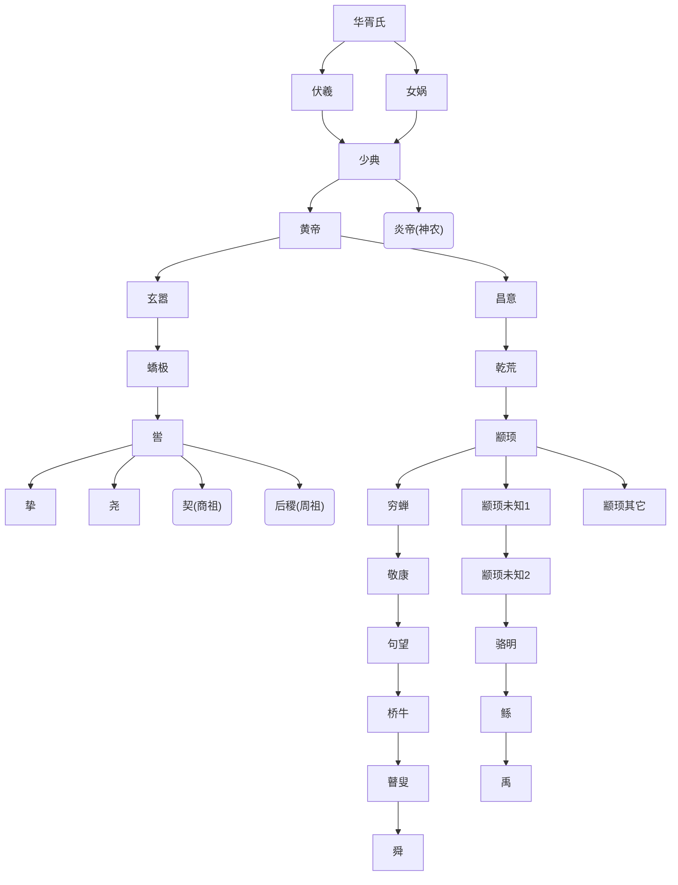

```mermaid
flowchart TD
    
    华胥氏 --> 伏羲 & 女娲 --> 少典 --> 黄帝 & 炎帝("炎帝(神农)")
    
    黄帝 --> 玄嚣 & 昌意
    
    玄嚣 --> 蟜极 --> 喾
    昌意 --> 乾荒 --> 颛顼
    
    喾 --> 挚 & 尧 & 契("契(商祖)") & 后稷("后稷(周祖)")
    颛顼 --> 穷蝉 & 颛顼未知1 & 颛顼其它
    
    穷蝉 --> 敬康 --> 句望 --> 桥牛 --> 瞽叟 --> 舜
    颛顼未知1 --> 颛顼未知2 --> 骆明 --> 鲧 --> 禹
    
    click 伏羲 "https://zh.wikipedia.org/wiki/伏羲" _blank
    click 女娲 "https://zh.wikipedia.org/wiki/女娲" _blank
    click 少典 "https://zh.wikipedia.org/wiki/少典" _blank
    click 黄帝 "https://zh.wikipedia.org/wiki/黄帝" _blank
    click 炎帝 "https://zh.wikipedia.org/wiki/炎帝" _blank
    click 玄嚣 "https://zh.wikipedia.org/wiki/玄嚣" _blank
    click 昌意 "https://zh.wikipedia.org/wiki/昌意" _blank
    click 蟜极 "https://zh.wikipedia.org/wiki/蟜极" _blank
    click 喾 "https://zh.wikipedia.org/wiki/喾" _blank
    click 乾荒 "https://zh.wikipedia.org/wiki/乾荒" _blank
    click 颛顼 "https://zh.wikipedia.org/wiki/颛顼" _blank
    click 挚 "https://zh.wikipedia.org/wiki/挚" _blank
    click 尧 "https://zh.wikipedia.org/wiki/尧" _blank
    click 契 "https://zh.wikipedia.org/wiki/契" _blank
    click 后稷 "https://zh.wikipedia.org/wiki/后稷" _blank
    click 穷蝉 "https://zh.wikipedia.org/wiki/穷蝉" _blank
    click 舜 "https://zh.wikipedia.org/wiki/舜" _blank
    click 禹 "https://zh.wikipedia.org/wiki/禹" _blank
```

