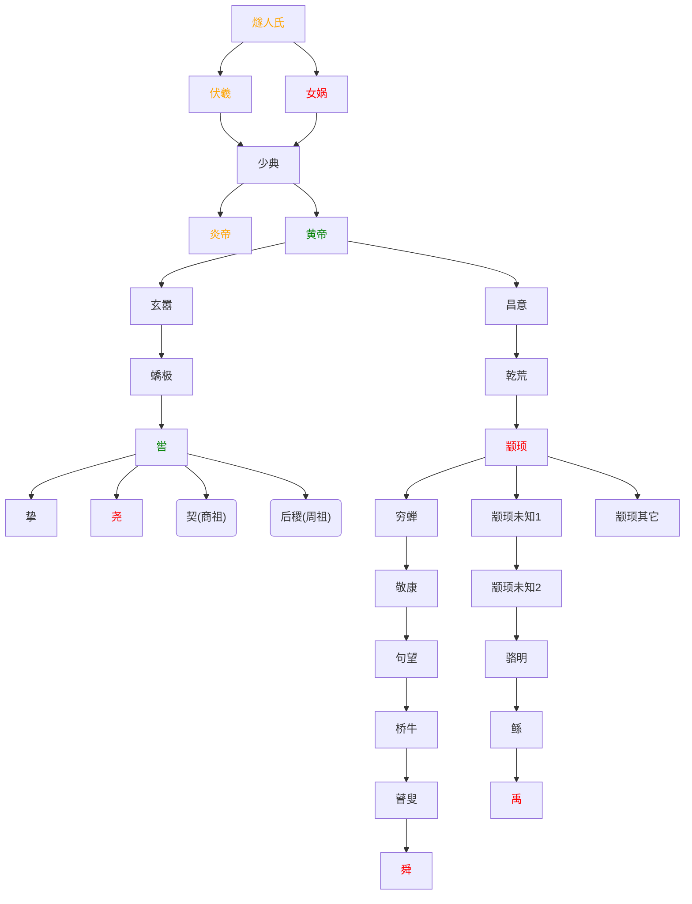

# 中国历史年表

```mermaid
flowchart TD
    
    燧人氏 --> 伏羲 & 女娲 --> 少典 --> 炎帝 & 黄帝
    
    黄帝 --> 玄嚣 & 昌意
    
    玄嚣 --> 蟜极 --> 喾
    昌意 --> 乾荒 --> 颛顼
    
    喾 --> 挚 & 尧 & 契("契(商祖)") & 后稷("后稷(周祖)")
    颛顼 --> 穷蝉 & 颛顼未知1 & 颛顼其它
    
    穷蝉 --> 敬康 --> 句望 --> 桥牛 --> 瞽叟 --> 舜
    颛顼未知1 --> 颛顼未知2 --> 骆明 --> 鲧 --> 禹
    
    %% 定义样式
    classDef orange fill:auto,stroke:auto,stroke-width:auto,color:orange;
    classDef red fill:auto,stroke:auto,stroke-width:auto,color:red;
    classDef green fill:auto,stroke:auto,stroke-width:auto,color:green;
    
    %% 应用样式
    class 燧人氏 伏羲 炎帝 orange;
    class 女娲 尧 舜 禹 颛顼 red;
    class 黄帝 喾 green;
flowchart TD
    
    燧人氏 --> 伏羲 & 女娲 --> 少典 --> 炎帝 & 黄帝
    
    黄帝 --> 玄嚣 & 昌意
    
    玄嚣 --> 蟜极 --> 喾
    昌意 --> 乾荒 --> 颛顼
    
    喾 --> 挚 & 尧 & 契("契(商祖)") & 后稷("后稷(周祖)")
    颛顼 --> 穷蝉 & 颛顼未知1 & 颛顼其它
    
    穷蝉 --> 敬康 --> 句望 --> 桥牛 --> 瞽叟 --> 舜
    颛顼未知1 --> 颛顼未知2 --> 骆明 --> 鲧 --> 禹
    
    %% 定义样式
    classDef orange fill:auto,stroke:auto,stroke-width:auto,color:orange;
    classDef red fill:auto,stroke:auto,stroke-width:auto,color:red;
    classDef green fill:auto,stroke:auto,stroke-width:auto,color:green;
    
    %% 应用样式
    class 燧人氏 伏羲 炎帝 orange;
    class 女娲 尧 舜 禹 颛顼 red;
    class 黄帝 喾 green;

```




