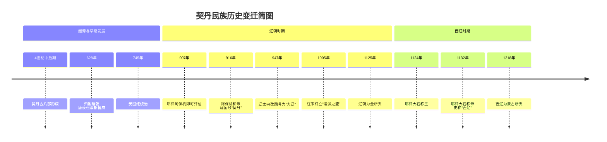

```mermaid
timeline
    title 契丹民族历史变迁简图
    section 起源与早期发展
        4世纪中后期 : 契丹古八部形成
        628年 : 归附唐朝<br>唐设松漠都督府
        745年 : 受回纥统治
    section 辽朝时期
        907年 : 耶律阿保机即可汗位
        916年 : 阿保机称帝<br>建国号“契丹”
        947年 : 辽太宗改国号为“大辽”
        1005年 : 辽宋订立“澶渊之盟”
        1125年 : 辽朝为金所灭
    section 西辽时期
        1124年 : 耶律大石称王
        1132年 : 耶律大石称帝<br>史称“西辽”
        1218年 : 西辽为蒙古所灭
```

