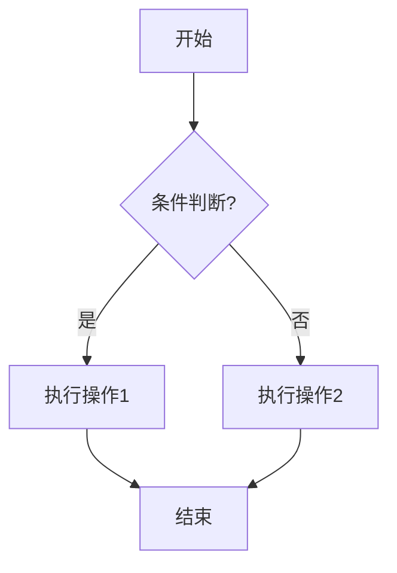
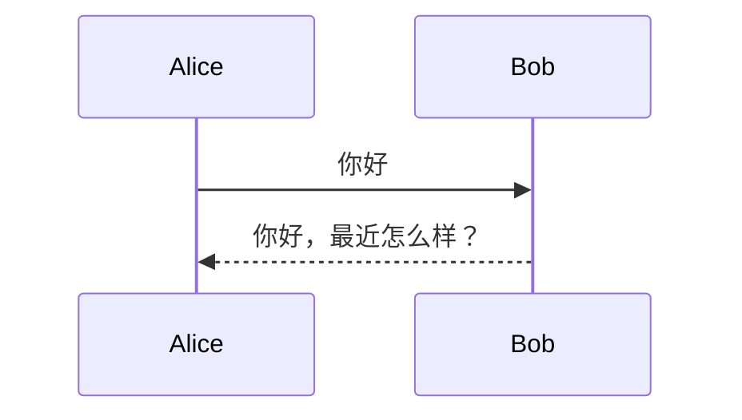
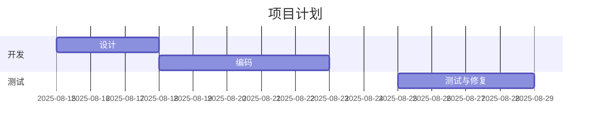
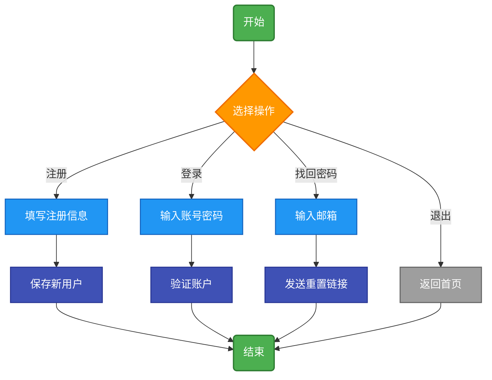
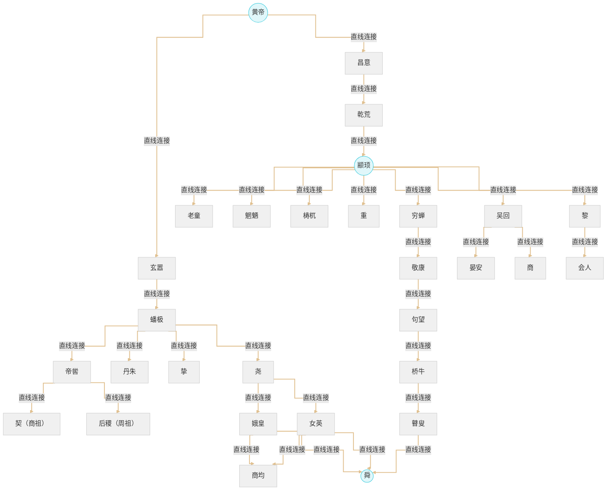

## 流程图

```mermaid
flowchart TD
    A[开始] --> B{条件判断?}
    B -- 是 --> C[执行操作1]
    B -- 否 --> D[执行操作2]
    C --> E[结束]
    D --> E
```

## 时序图

```mermaid
sequenceDiagram
    Alice->>Bob: 你好
    Bob-->>Alice: 你好，最近怎么样？

```

## 甘特图

```mermaid
gantt
    dateFormat  YYYY-MM-DD
    title 项目计划
    section 开发
    设计 :a1, 2025-08-15, 3d
    编码 :after a1, 5d
    section 测试
    测试与修复 :2025-08-25, 4d

```

## 示例

```mermaid
%% 兼容性好的流程图示例（无分组，含≥4分支、含注释）
flowchart TB

%% === 节点定义 ===
A(开始)
B{选择操作}
C[填写注册信息]
D[输入账号密码]
E[输入邮箱]
F[返回首页]
G[保存新用户]
H[验证账户]
I[发送重置链接]
J(结束)

%% === 连线（四个分支：注册 / 登录 / 找回密码 / 退出）===
A --> B
B -->|注册| C
B -->|登录| D
B -->|找回密码| E
B -->|退出| F

C --> G --> J
D --> H --> J
E --> I --> J
F --> J

%% === 样式设置（每行前有解释性注释） ===
%% A/J：起止节点，用圆角矩形 + 绿色背景 + 白字 + 粗边
style A fill:#4caf50,stroke:#2e7d32,stroke-width:2px,color:#ffffff
style J fill:#4caf50,stroke:#2e7d32,stroke-width:2px,color:#ffffff

%% B：决策节点，用橙色突出，边框更粗
style B fill:#ff9800,stroke:#ef6c00,stroke-width:2px,color:#ffffff

%% C/D/E/F：用户动作节点，统一蓝/灰风格
style C fill:#2196f3,stroke:#1565c0,stroke-width:1.5px,color:#ffffff
style D fill:#2196f3,stroke:#1565c0,stroke-width:1.5px,color:#ffffff
style E fill:#2196f3,stroke:#1565c0,stroke-width:1.5px,color:#ffffff
style F fill:#9e9e9e,stroke:#616161,stroke-width:1.5px,color:#ffffff

%% G/H/I：后台处理节点，用深蓝区分
style G fill:#3f51b5,stroke:#283593,stroke-width:1.5px,color:#ffffff
style H fill:#3f51b5,stroke:#283593,stroke-width:1.5px,color:#ffffff
style I fill:#3f51b5,stroke:#283593,stroke-width:1.5px,color:#ffffff
```

```mermaid
%%{init: {'flowchart': {'curve': 'step'} } }%%
flowchart TD
  %% 第一代
  黄帝((黄帝))

  %% 第二代分支
  黄帝 --直线连接--> 玄嚣
  黄帝 --直线连接--> 昌意

  %% 玄嚣分支
  玄嚣 --直线连接--> 蟠极
  蟠极 --直线连接--> 帝喾
  帝喾 --直线连接--> 契商祖["契（商祖）"]
  帝喾 --直线连接--> 后稷周祖["后稷（周祖）"]
  蟠极 --直线连接--> 丹朱
  蟠极 --直线连接--> 挚
  蟠极 --直线连接--> 尧

  %% 尧的关联
  尧 --直线连接--> 娥皇
  尧 --直线连接--> 女英
  娥皇 & 女英 --直线连接--> 舜 & 商均

  %% 昌意分支
  昌意 --直线连接--> 乾荒
  乾荒 --直线连接--> 颛顼1(("颛顼"))
  颛顼1 --直线连接--> 穷蝉
  穷蝉 --直线连接--> 敬康
  敬康 --直线连接--> 句望
  句望 --直线连接--> 桥牛
  桥牛 --直线连接--> 瞽叟
  瞽叟 --直线连接--> 舜((舜))

  %% 颛顼其他分支
  颛顼1 --直线连接--> 老童
  颛顼1 --直线连接--> 魍魉
  颛顼1 --直线连接--> 梼杌
  颛顼1 --直线连接--> 重
  颛顼1 --直线连接--> 黎
  颛顼1 --直线连接--> 吴回
  吴回 --直线连接--> 晏安
  吴回 --直线连接--> 商
  黎 --直线连接--> 会人

  %% 样式统一
  linkStyle default stroke:#e0c090,stroke-width:2px
  classDef person fill:#f0f0f0,stroke:#ccc,stroke-width:1px;
  classDef legend fill:#e0f7fa,stroke:#26c6da;
  class 黄帝,颛顼1,舜 legend;
  class 玄嚣,昌意,蟠极,帝喾,契商祖,后稷周祖,丹朱,挚,尧,乾荒,穷蝉,敬康,句望,桥牛,瞽叟,老童,魍魉,梼杌,重,黎,吴回,晏安,商,会人,娥皇,女英,商均 person;
```

