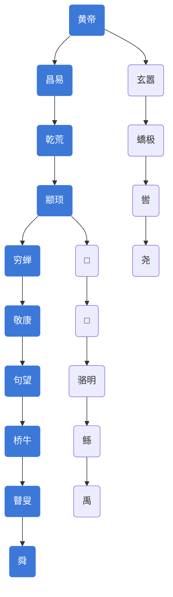

# 中国史通述

## 中国史通述

一般来讲，广义的“历史”可以指过去发生的一切事件，而狭义的历史是从有文字记载时起算，此前的历史则称为“史前时代”。 中国史前时代的传说有盘古、上帝、女娲等不确定的神话时代算起约有五六千年（这也是中国历史传统意义上的长度）。

## 中国史划分

### 中国历史长度划分

- 中国历史如果从中国的文字史首次成体系的甲骨文出现的商朝中期（前1300年算起）算起约有3,300年；
- 从考古学上具有城市定位代表性的二里头文化遗址（前1920年）算起约有3,700年；
- 从西周文献中传说中的夏朝前2070年算起）算起约有4,100年；
- 从孔子所言三皇五帝的传说时代算起约有4,700年（前2698年算起）；
- 从盘古、上帝、女娲等不确定的神话时代算起约有五六千年（这也是中国历史传统意义上的长度）；
- 从标志着人类文明萌芽的新石器时代磁山文化算起约有10,000年；
- 从人类开始脱离原始生活的旧石器时代蓝田猿人文化算起约有80万年的历史。
- 中国的传说有伏羲做八卦，黄帝时代仓颉造文字；而近代考古出土则发现3,300年前（前1300年）的甲骨文、4,500年前的陶文、约5,000年前至8,000年前具有文字性质的龟骨契刻符号。

###  从政治和社会形态区分中国历史

- 据考古资料显示，约在早于距今6,000年前的裴李岗文化晚期或者仰韶文化早期时代，中原地区从母系氏族社会过渡到氏族。同时，原始社会平等被打破。

- 据有文字记载的历史，夏朝已经开始君王世袭，周朝建立完备的礼制，至东周逐渐解构，秦朝统一各国政治和许多民间分歧的文字和丈量制度，并建立中央集权的专制君权统治。

- 自汉朝起则以文官主治国家直至清朝。

- 清末以降，民主政治、科学、马克思主义等各种政治思潮流传，先是革命党推翻帝制于1912年成立中华民国。1949年10月1日，中国共产党在中国大陆建立中华人民共和国，而中国国民党主政的中华民国政府因国共内战失败而退到台湾，维持两岸分治格局至今。

### 从经济形态划分

- 中国古代人口主要由自由人构成，私有制、商业活动发达。

- 周朝时商业主要由封建领主阶层控制的官商贸易和庶人的自由贸易构成。

- 秦汉以后实行中央集权，人口由士、农、工、商等构成，其中以从事农业的自由民为主体，是一个君权官僚制下的以土地为主要生产资本的较为自由的商业经济社会，一些重要的行业譬如油盐米等由官僚和商人垄断。除了农业，手工业以及商业贸易也有很大的发展。

- 早在汉朝丝绸之路的开通，促进东亚与中亚至欧洲的陆上交通时，国际贸易早已起步；隋唐时大运河的开通促进南北贸易；唐朝的盛世及外交的开放、交通的建设，更使各国文化、物资得以交流；唐朝时出现类似汇兑证券的飞钱，宋代时出现纸币；元代时更因为全面开通商旅的关卡使得与中亚的商业交流十分繁荣；

- 明朝中叶实行海禁，

- 清代则受到西方国家海上发展的影响，海上国际贸易发展迅猛。

- 自中华民国成立起试图建立民主国家，实行自由经济；

- 1949年后中共执政后起先为公有制的计划经济社会，改革开放后逐步向私有制的市场经济社会转型，该形态被称为在宏观调控下的社会主义市场经济，同时1980年代以来工业化发展迅猛，数亿人口在短短20多年内从农民转为工人（目前仅仅被称为“农民工”的产业工人就达到约2亿）。随着中国的发展，中华人民共和国加入世界贸易组织之后，中国经济成为全球经济中越来越重要的组成部分。21世纪初，中国经济成为世界第二大经济体。

## 远古社会

迄今为止发现的最早的高等灵长类中华曙猿在4,500万年前生活在中国江南一带。考古证据显示224万年至225万年前，中国就有直立人居住，目前考古发现的较早的原始人类踪迹有巫山人、元谋人、蓝田人、南京直立人、北京直立人等。

中国史前时代的各种文化是经过以下几个阶段：以直立猿人为主的旧石器时代早中期（距今约50至40多万年前），接着进入旧石器时代中晚期，以山顶洞人为代表，距今约在20至10余万年前。新石器时代早期的代表性文化是裴李岗文化，这一时期属于母系氏族社会，社会尚无明显分层。紧接着是以仰韶文化为代表的新石器时代中期，这一时期，社会性质从母系氏族社会过渡到父系氏族社会，社会贫富分化逐渐加深，同时生产力水平有显著提高。而以龙山文化(4900年至4100年前)为代表的新石器时代晚期，被发现在长江、黄河流域有数个城址群，如中原城址群、江汉城址群、海岱城址群等。这或许表明在龙山时代，社会的组织形态发生较大的转变。

根据现在的考古学研究，中国的新石器时代呈现多元并立的情形：约7,000年到5,000年前在河南省、河北省南部、甘肃省南部和山西省南部出现的仰韶文化便具备使用红陶、彩陶以及食用粟米和畜养家畜的特质。而大约在同一时间，尚有在浙江省东边出现的河姆渡文化、浙江省北边出现的良渚文化、山东省的大汶口文化

华夏文明形成于黄河流域中原地区。

## 典籍参考

从黄帝时代，下至汉武帝太初四年间共3000多年的历史，以《史记》为基础。

## 起源谱系

中国起源的谱系传说主要围绕创世神话和三皇五帝两个脉络展开。

# 创世神话

## 盘古

盘古生活在混沌中，天地未开，盘古开天地以后，他口里呼出的气变成风和云，他的左眼变成太阳，右眼变成月亮，他的阳根化为伏羲，双乳化为女娲，他的手足和身躯变成大地的四极和五方的名山，他的血液变成江河，他的筋脉变成道路，他的肌肉变成田土，他的头发变成天上的星星，他浑身的汗毛变成花草树木，他的牙齿、骨头、骨髓等，也都变成闪光的金属、坚硬的石头、温润的宝玉，就是那最没有用处的身上出的汗，也变成清露和甘霖。

他把自己的眼泪还有两根头发藏起来，等过了不知道数年，当有熊国的国君少典从一个小山丘经过时候，不小心碰到了盘古的眼泪。天空长虹贯日，气象万千，祥瑞祥和，第一个存在的民族就是伏羲一族，所以伏羲称为人祖。

## 女娲

女娲，中国上古神话中的创世女神。又称娲皇、女阴娘娘，史记女娲氏，是华夏民族人文先始，福佑社稷之正神。女娲是伏羲同母异父的妹妹兼配偶。农历三月十五是女娲的生日。

### 女娲补天

《史记·补三皇本纪》记载，女娲时代，随着人类的繁衍增多，社会开始动荡了。两位英灵人物，水神共工氏和火神祝融氏，在不周山大战，结果共工氏因为大败而怒撞不周山，不周山崩裂了，支撑天地之间的大柱断折了，天倒下了半边，出现了一个大窟窿，地也陷成一道道大裂纹，山林烧起了大火，洪水从地底下喷涌出来，龙蛇猛兽也出来吞食人民，人类面临着空前大灾难。

女娲用五彩石补天，平息灾难，但是这场特大的灾祸毕竟留下了痕迹。从此天还是有些向西北倾斜，因此太阳、月亮和众星辰都很自然地归向西方，又因为地向东南塌陷，所以一切江河都往那里汇流。

实际上早期的女娲补天，与共工、祝融大战并无交集，这是两个独立的故事，水神共工氏和火神祝融氏在不周山之战的故事，在《山海经·西山经》有记载。是由东汉时王充把共工与女娲补天焊接到一块。

四大名著之一《红楼梦》的第一回即引用这个故事。

### 女娲造人

女娲感到寂寞，捏土造人，为了解决人类死亡问题，女娲把这些人分为男女，让男人和女人配合起来，叫他们自己去创造后代。后世有到女娲庙求子的习俗。

### 人日节

传说女娲创造苍生，顺序造出了鸡、狗、猪、羊、牛、马等动物，并于第七天造出人来，故此正月初七为人的生日，民间曾把这天叫做“人日”“人日节”或“人胜节”。汉族人民在这一天带人胜，吃七宝羹，吃面条，登高赋诗。“人日”反映了中国古代劳动人民祈福纳吉和求平保安的愿望以及对“人”本身的尊重。

### 三生石传说

相传女娲每造一人，取一粒沙作计，终而成一硕石，女娲将其立于西天灵河畔。此石因其始于天地初开，受日月精华，灵性渐通。不知过了几载春秋，只听天际一声巨响，一石直插宵，顶于天洞，似有破天而出之意。女娲放眼望去，大惊失色，只见此石吸收日月精华以后，头重脚轻，直立不倒，大可顶天，长相奇幻，竟生出两条神纹，将石隔成三段，纵有吞噬天、地、人三界之意。女娲急施魄灵符，将石封住，心想自造人后，独缺姻缘轮回神位，便封它为三生石，赐它法力三生决，将其三段命名为前世、今生、来世，并在其身添上一笔姻缘线，从今生一直延续到来世。为了更好的约束其邪性，女娲思虑再三，最终将其放于鬼门关忘川河边，掌管三世姻缘轮回。当此石直立后，神力大照天下，跪求姻缘轮回者更是络绎不绝。

传说女娲不但是补天救世的英雌和抟土造人的女神，还是一个创造万物的自然之神，神通广大化生万物，每天至少能创造出七十样东西。她开世造物，因此被称为大地之母，是被民间广泛而又长久崇拜的创世神和始母神。

# 三皇五帝

## 三皇五帝

[**三皇五帝**](https://zh.wikipedia.org/wiki/%E4%B8%89%E7%9A%87%E4%BA%94%E5%B8%9D)是中国传说时代的君王，“[三皇](https://zh.wikipedia.org/wiki/三皇)”与“[五帝](https://zh.wikipedia.org/wiki/三皇五帝#五帝)”的合称。三皇五帝并不是真正的帝王，仅仅是原始社会中后期出现的为人类作出卓越贡献的部落首领或部落联盟首领，后人追尊他们为“皇”或“帝”。

中华民族早期血脉来自于华夏、东夷、苗蛮三大族群，到秦汉之际形成为中华民族的主体血脉。伏羲是各族共同尊奉的先祖。黄帝是伏羲的后裔，他与炎帝结盟，炎黄二弟是华夏民族的祖先。

三皇时代处于约6000年前到4000年前，五帝时代在约4000多年前。

- **三皇**：《史记》不收录没有实据的三皇，西汉《尚书大传》是最早明确“三皇”具体人选的文献，后世记载略有不同。
    - 天皇：燧人
    - 地皇：神农
    - 人皇：伏羲
- **五帝**：《史记》以五帝作为本纪开篇。
    - 黄帝
    - 颛顼
    - 帝喾
    - 尧
    - 舜

中国的起源有两个传说，即盘古兄妹兼配偶传说和伏羲女娲兄妹兼配偶传说，这两个故事反映了远古血缘婚的历史。

## 天皇燧人

燧人氏，三皇之天皇，旧石器时代出生于商丘，风姓，燧明国，为华胥氏之夫、伏羲与女娲的父亲。

《史记·五帝本纪》：“黄帝者，少典之子”。 少典，是中国原始社会时期有熊部落的首领。因生于有熊国（河南新郑附近），少典便被称有熊国国君。

### 钻木取火

几十万年以前的旧石器时代，燧人氏在今河南商丘一带钻木取火，成为华夏人工取火的发明者，教人熟食，结束了远古人类茹毛饮血的历史，由于钻木取火中大多使用的是燧木，于是人们便把发明人工取火技术之人尊之为“燧”，称为“燧人氏”。远古人相信燧，跟随燧，很快便形成了以燧为首的远古人类氏族部落，这个氏族部落被后世形象地称为“燧明国”。

火的发明开创了华夏文明，燧人氏被后世奉为“燧皇”与“火神”或“火祖”。商丘因此被誉为华夏文明的发祥地，被中国文联授予“中国火文化之乡”称号。

### 结绳记事

距今约三万年时燧人氏发明搓绳技术，创造“结绳记事”，为禽兽命名，立传教之台，兴交易之道。那时候人类还没有文字，生活中有许多事全凭大脑记忆，但时间久了，有些事情往往会被遗忘。燧人氏用柔软而有韧性的树皮搓成细绳，然后将数十条细绳排列整齐悬挂在一处，在上边打结记事。大事打大结，小事打小结，先发生的事打在里边，后发生的事打在外边。为了能够记录更多的事情，燧人氏又利用植物的天然色彩，把细绳染成各种颜色，每种颜色分别代表一类事物，使所记之事更加清楚。

### 百兽之名

在燧人氏以前，人们把所有的动物都叫作“虫”。燧人氏经过细心观察，把这些动物划分为四类：天上飞的称作“禽”，地上跑的称作“兽”，有脚的爬行动物称作“虫”，没脚的爬行动物称作“豸”。

### 第一个姓氏

燧人氏以风姓为人类命名，对人的婚姻交配有了血缘上的限制，使人与兽有了严格的区分。这是人类早期的伦理道德。

### 确定北极星

燧人氏以右枢天乙（天龙座a星）为北极星。

### 发明太阳历

距今约一万四千八百年时，燧人氏发明《河图》、《洛书》（柯约耶劳创《河图》，柯诺耶劳创《洛书》）、星象历，创造人类早期的符号文字。（注:有些是后世托古之作品河图洛书也不都是他发明的，有的是后人为了尊崇他。华夏文明有文字记载的历史始于燧人氏，燧人氏是中华民族可以考证的第一位祖先。

### 发明“十天干”

燧人氏发明“陶文”，创造“十天干”。

燧人氏死后葬于商丘古城西南3里处的燧皇陵。

## 人皇伏羲

### 伏羲

华夏民族人文先始、三皇之人皇，亦是福佑社稷之正神，同时也是我国文献记载最早的创世神。

旧石器时代中晚期，生于农历三月十八日。父燧人氏，母华胥氏，妹兼配偶女娲，女洛神。

相传上古时代，华胥国有个叫“华胥氏”的姑娘，到一个叫雷泽的地方去游玩，偶尔看到了一个巨大的脚印，便好奇地踩了一下，于是就有了身孕，怀孕十二年后生下一个儿子，这个儿子有蛇的身体人的脑袋，取名为伏羲。

传说原来的人类被大水淹死了，只剩下伏羲女娲兄妹，伏羲和女娲兄妹俩居住在昆仑山上，为了繁衍后代，两人结为夫妻。

传说在天地尚未形成，世界处于混沌状态之时，先有伏羲、女皇（娲）二神，结为夫妇，生了四子。这四子后来成为代表四时的四神。四神开辟大地，这是他们懂得阴阳参化法则的缘故。

风姓，又名宓羲、庖牺、包牺、伏戏，亦称牺皇、皇羲、史记中称伏牺，后与太昊合并，在后世被朝廷官方称为“太昊伏羲氏”，亦有青帝太昊伏羲（即东方上帝）一说。

伏羲是中国古籍中记载的最早的王，是中国医药鼻祖之一。

### 创造龙图腾

伏羲有神圣之德，团结统一了华夏各个部落，定都在陈地，封禅泰山。伏羲取蟒蛇的身，鳄鱼的头，雄鹿的角，猛虎的眼，红鲤的鳞，巨蜥的腿，苍鹰的爪，白鲨的尾，长须鲸的须，创立了中华民族的图腾龙，龙的传人由此而。

### 一画开天

伏羲以一拟太极，然后一画开天，世间万物的创造，世界生命的诞生全靠这一画

### 改变婚制

倡导男聘女嫁的婚俗礼节，使血缘婚改为族外婚，结束了长期以来，子女只知其母不知其父的原始群婚状态

### 创立姓氏

以所养动物为姓，或以植物、居所、官职为姓，以防止乱婚和近亲结婚，使中华姓氏自此起源，绵延至今。

### 发明乐器

发明陶埙、琴瑟等乐器，创作乐曲歌谣，将音乐带入人们的生活。

### 分封任命

将其统治地域分而治之，而且任命官员进行社会管理，为后代治理社会提供借鉴。[16]

### 身后事

伏羲称王一百一十一年以后去世。

陵墓，河南淮阳太昊陵，始建于春秋，增制于唐代。

伏羲庙，是国家AAAA级景点，全国重点文物保护单位。位于天水市区西关伏羲路，始建于明代成化年间，后经九次重修，形成古建筑。

### 洛神

伏羲氏其中的一个后代，宓妃，就是洛神。因迷恋洛河（古都洛阳的著名河流，洛阳因位于洛水之北而得名）两岸的美丽景色，降临人间，来到洛阳。

有一天，大伙儿劳动之余，宓妃拿起七弦琴，奏起优美动听的乐曲来。不巧，这悠扬的琴声被黄河里的河伯听到，这个浪荡公子便潜入洛河，看到宓妃，一下子就被宓妃的美貌所吸引。于是河伯化成一条白龙，在洛河里掀起轩然大波，吞没了宓妃。

宓妃被河伯押入水府深宫，终日郁郁寡欢，只好用七弦琴排遣愁苦。这时，后羿来到了宓妃的身边。后羿原是位善射的天神，射死了天帝的九个儿子。

后羿听说了宓妃的遭遇，非常气愤，将宓妃解救出深宫，又回到洛氏中间，并与宓妃产生了爱情。那河伯本来就窝了一肚子火，听说了后羿宓妃之间的恋情，更是恼羞成怒。他化作一条白龙潜入洛河，吞噬了许多田地、村庄和牲畜，后羿怒火填膺，射中了河伯的左眼，河伯仓皇而逃。

河伯自知不是后羿的对手，只好跑到天帝那儿去告状。天帝早就知道了所发生的一切，并不向着河伯说话，河伯这下只能灰溜溜地回到水府，再也不敢管后羿与宓妃的事了。

从此，后羿与宓妃这对情侣便在洛阳居住下来，过上了美满幸福的生活。后来，为表彰他们，天帝还封后羿为宗布神，宓妃为洛神。

曹植的《洛神赋》即是描写她千古名篇（是否是通过她描写甄宓存在争议）。

## 地皇神农

三皇之地皇

## 五帝之黄帝

[黄帝](https://zh.wikipedia.org/wiki/黄帝)（公元前2717年—公元前2599年），中国古代部落联盟首领，为《史记》中五帝之首。黄帝是中国远古时代华夏民族的共主，被尊为中华“人文初祖”。

史载黄帝的父亲少典为有熊国君，母为附宝，因居轩辕之丘，故号轩辕，长居姬水，为姬姓，国于有熊（今河南新郑），又称有熊氏，帝鸿氏或归藏氏。相传他出生于三月初三，俗言“二月二，龙抬头；三月三，生轩辕”。

### 阪泉之战

阪泉之战是黄帝与炎帝之间为争夺大华夏部落联盟首领而进行的战争。

轩辕的时候，炎帝神农氏势力日渐衰微，轩辕趁势而起，形成炎帝、黄帝、蚩尤人鼎足而立的局面。经过阪泉之战，炎帝族战败，和黄帝族融合，炎黄势力壮大。后世中国人以炎黄二帝为祖先，称自己为炎黄子孙。

### 涿鹿之战

蚩尤发动变乱,不听黄帝命令。于是轩辕向四方诸侯征调军队,经涿鹿之战，生擒蚩尤,并把他杀死。

涿鹿之战后，黄帝率兵进入九黎地区，随即在泰山之巅，会合天下诸部落，举行了隆重的封禅仪式，告祭天地。突然，天上显现大蚓大蝼，色尚黄，于是他以土德称王，土色为黄，故称作黄帝。黄帝即位于公元前2697年。道家把这一年作为道历元年。

上古大华夏部落联盟最终形成，中国至此进入了华夏时代。

### 黄帝功绩

轩辕黄帝的功绩之一是“艺五种”。“五种”，是指“黍、稷、菽、麦、稻”五谷。按古史传说神农氏仅能种植黍、稷，而黄帝则能种植多种粮食作物，表明黄帝使当时的原始农业有了进一步的发展。

仓颉造字。

黄帝的晚年，发明了鼎。当第一个鼎被铸造出来时，天上突然飞下来一条龙，龙说带黄帝去见天帝，黄帝同意，后来的人为了纪念这位帝王，就把黄帝升天的地方叫做"鼎湖"。后人因以“龙去鼎湖”谓帝王去世。

### 黄帝陵墓

黄帝死后，葬在桥山，黄帝的孙子高阳（金帝颛顼）继帝位。

陕西黄陵县黄帝陵，位于陕西黄陵县城北桥山，是黄帝衣冠冢；1961年，国务院公布为全国第一批全国重点文物保护单位，编为“古墓葬第一号”，号称“天下第一陵”。黄帝陵古称“桥陵”，为中国历代帝王和著名人士祭祀黄帝的场所。

荆山黄帝陵，位于河南省灵宝市市区西20公里阳平镇。后因名其地称鼎湖“其弓曰乌号”。人们把黄帝的靴子埋在铸鼎塬上，形成了黄帝陵，并建庙祭祀。陵的西端有一高6米，周长42.5主的土堆，传说就是黄帝陵冢。陵西南有一龙须沟，传说是龙须坠落之地，此间生长一种龙须草，说是龙须所变，周围皆无。古代文人墨客纷纷前来瞻仰，李白、杜甫、白居易、刘禹锡等著名诗人都曾到此拜谒，题诗作赋，年年农历二月初九前后人们络泽不绝前往祭祀瞻拜。

### 黄帝后世

史载黄帝共有二十五个儿子，其中十四人被分封得姓。这十四人共得到十二个姓，依次为：姬、酉、祁、己、滕、葴、任、荀、僖、姞、儇、衣。而少昊、颛顼、帝喾、唐尧、以及夏朝、商朝、周朝的君主都是黄帝的子孙，这些后裔在黄帝到尧、舜、禹时期大都已经脱离黄帝母族，建立了大批的氏族方国或部落，有了独立的姓和氏；后来，周武王（姬发）从陕西东出中原建立了周朝，分封诸侯或方国，其中姬姓国53个，这些姬姓国以国为氏，于是形成了中国的大多数姓氏，中国人遂自称“黄帝子孙”或“炎黄子孙”。

黄帝死后，葬在桥山。高阳继位，高阳就是金帝颛顼。

嫘祖是黄帝的正妃，生了两个儿子，少昊（即玄嚣）和昌意，这两个人的后代都得到了天下，其血缘关系为；

详见[五帝世系图](https://zh.wikipedia.org/wiki/五帝世系图)

## 五帝之颛顼

颛顼(zhuān xū)，中国上古部落联盟首领，“五帝”之一，号高阳氏，昌意之子，黄帝之孙（即二世孙）。颛顼生于若水之野，因佐少昊有功，被封于高阳（今河南开封杞县高阳镇）。少昊死后，共工氏与颛顼争夺帝位，颛顼打败共工，继少昊主政，号“高阳氏”。颛顼帝是一代明君。

颛顼有八个有才德的子孙，世人得了他们的好处,称他们叫做“八恺”。舜举用了“八恺”的后代。

魍魉是中国传说中的精怪，本为颛顼幼子，后来成为疫神瘟鬼。

颛顼死,侄儿高辛（玄嚣之孙）继帝位，高辛就是木帝喾。

屈原在《离骚》中开篇提到“帝高阳之苗裔兮”，说自己是高阳的后代。

## 五帝之喾

喾（kù）（约公元前2480年 — 约公元前2345年），姬姓，名俊，高辛氏，中国上古部落联盟首领，“五帝”之一，黄帝的曾孙（三世孙），黄帝—少昊—蟜极—帝喾。

尧和嫦娥是帝喾的儿女。

次妃娵訾氏名常仪，生子挚。挚承喾的帝位，在位九年后禅让给放勋，也就是帝尧。

次妃陈丰氏名庆都，生子放勋(帝尧)。

正妃有邰氏名姜嫄，生子弃，即后稷，是周朝的始祖。

次妃有娀氏之女名简狄，生子契，是商朝的始祖。

颛顼死,侄儿高辛继帝位，高辛就是木帝喾。

喾帝是一代明君。

高辛氏有八个有才德的子孙,世人称他们为“八元”。

帝喾去世,挚继帝位。帝挚在位,办不好国事,于是弟（同父异母）放勋代挚继位，这就是帝尧。

## 五帝之尧

尧（约前2377—前2259年），中国上古部落联盟首领，“五帝”之一，姓伊祁，号放勋，古唐国（今山西临汾尧都区，古称河东地区）人。尧为帝喾之子，黄帝的四世孙，母为陈锋氏。黄帝—玄嚣—蟜极—高辛（木帝喾）—放勋（水帝尧）。

十五岁辅佐兄长帝挚，改封于唐地（今山西太原），号为陶唐氏。唐尧初都太原，在太原筑有唐城，所以太原有了“唐”和“唐国”的古名。古称“唐”的地名至少有三处，诸如河北之“唐”，太原之“唐”，山西晋南之“唐”，都是因唐尧多次迁徙，曾经定居那里而得名。

帝挚在位,办不好国事,于是弟（同父异母）放勋继位，这就是帝尧。

尧在帝位七十年得到舜,又过了二十年而告老,让舜代行天子的政务,把舜推荐给上天，尧退帝位二十八年而寿终。尧帝陵与尧庙都在山西临汾。

尧最为人们称道的是他不传子而传贤，禅位于舜，不以天子之位为私有。尧在位70年，感觉到有必要选择继任者。他早就认为自己的儿子丹朱凶顽不可用，因此与四岳商议，请他们推荐人选。四岳推荐了舜，说这个人很有孝行，家庭关系处理得十分妥善，并且能感化家人，使他们改恶从善。尧决定先考察一番，然后再行决定。

尧把自己的两个女儿娥皇、女英嫁给舜，从两个女儿那里考察他的德行，看他是否能理好家政。舜和娥皇、女英住在沩水河边，依礼而行事，二女都对舜十分倾心，恪守妇道。尧又派舜负责推行德教，舜便教导臣民以“五典”——即父义、母慈、兄友，弟恭、子孝这五种美德指导自己的行为，臣民都乐意听从他的教诲，普遍依照“五典”行事。尧又让舜总管百官，处理政务，百官都服从舜的指挥，百事振兴，无一荒废，并且显得特别井井有条，毫不紊乱。尧还让舜在明堂的四门，负责接待四方前来朝见的诸侯。舜和诸侯们相处很好，也使诸侯们都和睦友好。远方来的诸侯宾客，都很敬重他。最后，尧让舜独自去山麓的森林中，经受大自然的考验。舜在暴风雷雨中，能不迷失方向，依然行路，显示出很强的生活能力。

经过三年各种各样的考察，尧觉得舜这个人无论说话办事，都很成熟可靠，而且能够建树业绩，于是决定将帝位禅让于舜。他于正月上日（初一），在太庙举行禅位典礼，正式让舜接替自己，登上天子之位。尧退居避位，二十八年后去世，“百姓悲哀，如丧父母．三年，四方莫举乐，以思尧”，人们对他的怀念之情其为深挚。

制定历法

《尚书·尧典》上说，尧命令羲氏、和氏根据日月星辰的运行情况制定历法，然后颁布天下，使农业生产有所依循，“敬叫授民时”，他派羲仲住在东方海滨叫旸谷的地方，观察日出的情况，以昼夜平分的那天作为春分，并参考鸟星的位置来校正；派羲叔住在叫明都的地方，观察太阳由北向南移动的情况，以白昼时间最长的那天为夏至，并参考火星的位置来校正；派和仲住在西方叫昧谷的地方，观察日落的情况，以昼夜平分的那天作为秋分，并参考虚星的位置来校正；派和叔住在北方叫幽都的地方，观察太阳由南向北移动的情况，以白昼最短的那天作为冬至，井参考昴星的位置来校正。二分、二至确定以后，尧决定以366日为一年，每三年置一闰月，用闰月调整历法和四季的关系，使每年的农时正确，不出差误。由此可知，古人将帝尧的时代视为农耕文化出现飞跃进步的时代。

尧的两个女儿娥皇和女英嫁给了舜，舜死于苍梧，归葬湖南九嶷山。 失去了丈夫的娥皇女英姐妹，面对奔流的湘江，痛哭失声。她们的眼泪滴在湘江边的竹子上，泪痕不褪，点点成斑。湘江边沾着这对姐妹思夫泪痕的斑竹，因此被称为“湘妃竹”。

尧去世,三年丧期结束,舜为了让位给丹朱,自己避到南河的南岸。但诸侯来朝见天子的,不去丹朱那里,却来朝拜舜；舜于是回到首都 , 登上天子位。

## 五帝之舜

舜（shùn），（约公元前2277 — 约公元前2178），中国上古部落联盟首领，“五帝”之一，姓姚，名重华，字都君，黄帝的八世孙，黄帝—昌意—高阳（金帝颛顼）—穷蝉—敬康—句望—桥牛—瞽叟—舜（火帝）；从穷蝉一直到帝舜,都是地位低微的普通百姓。

帝舜从小受父亲瞽叟、后母和后母所生之子象的迫害，屡经磨难，仍和善相对，孝敬父母，爱护异母弟弟象，故深得百姓赞誉。《二十四孝》中第一孝就是舜的故事。

当时部落联盟领袖帝尧年事已高，欲选继承人，四岳一致推举舜，于是，尧分别将自己的两个女儿娥皇、女英嫁给舜，让九名男子侍奉于舜的左右，以观其德；又让舜职掌五典、管理百官、负责迎宾礼仪，以观其能。皆治，乃命舜摄行政务。

尧把帝位禅让给舜，二十八年后去世。舜选贤任能，举用“八恺”、“八元”等治理民事，放逐“四凶”，任命禹治水，完成了尧未完成的盛业。

## 太昊

太昊是伏羲女娲之后人。

生卒：公元前7593—前7527年，出生：泰安（今山东泰安市大汶口）。

太昊是纯血缘伏羲氏族传人，他的祖辈是三任帝嬟移，母辈是四任帝师嬟。太昊确有其人。

太昊时期，人们发明蓑衣，并把这项发明归功于太昊。

太昊的重臣勾芒发明了十二地支

变革婚姻习俗，倡导男聘女嫁的婚俗礼节，使血缘婚改为族外婚，结束了长期以来，子女只知其母不知其父的原始群婚状态，发明八卦。

葬在宛丘太昊陵，尊号白帝、帝太昊。太昊陵，即“三皇之首”太昊伏羲氏的陵庙，位于河南省淮阳县城北1.5公里，国家级重点文物保护单位。中国18大名匿之一。因其是中华民族“人文始祖”之陵庙，故称“天下第一陵”。

2008年，太昊陵以单日82万游客流量记录刷新吉尼斯世界纪录，成为全球第一庙会。

## 后羿

在尧帝时代，羿是唐尧的射师，被唐尧封于商丘，迎娶了帝喾之女嫦娥为妻。他善于射箭，曾经帮助帝尧射下九日，匡扶黎民。

天上有十个太阳，烧得草木，庄稼枯焦，伊祁放勋（也作伊耆放勋，即尧）请来了大羿（射日的是大羿而非后羿），一连射下九个太阳，从此地上气候适宜，万物得以生长。他又射杀猛兽毒蛇，为民除害。民间因而奉他为「箭神」。

根据神话记载因为射日立下大功所以得到了天帝的褒奖，但是也得到了很多人的嫉妒，所以天帝听进谗言，就把大羿、嫦娥夫妻放逐到了人间，嫦娥吃灵药朝月亮飞去，大羿郁郁而终。

后来，后羿被弟子逢蒙所杀，死后被封宗布神，统领万鬼。之所以说鬼怕桃木，也是因为羿是被桃木打死的。

帝尧时期射日的羿与夏代有穷国君主后羿的事迹、称呼容易被弄混淆。

古书中曾记载了大羿射日的故事。后世习惯于把他与后羿等同于一人。后羿，又称“夷羿”，相传是夏王朝东方族有穷氏的首领，善于射箭。这两个人没有任何关系。

以《山海经》为蓝本，《淮南子•本经训》把大羿射日的故事做了总结：唐尧时期，天上出现了十个太阳，庄稼被烧焦了，草木也没了，老百姓没有了吃的东西。猰貐、凿齿、九婴、大风、封豨、修蛇都是害民的。于是，尧就让羿诛凿齿于畴华之野，杀九婴于凶水之上，缴大风于青丘之泽，并把天上的十个太阳射下来，断修蛇于洞庭，擒封豨于桑林。百姓非常高兴，很感激羿和尧，所以置尧以为天子。这里的羿实际上指的是大羿。从另一方面也说明了古本《山海经》中有大羿射日的故事，只是后来失落了。

因此，尽管后羿与大羿都善于射箭，但他们确实不是同一个人，嫦娥的丈夫是大羿而不是后羿，射日神话中的羿是大羿而不是后羿。

## 嫦娥

嫦娥，上古时期五帝喾的女儿、尧的妹妹，后羿（大羿）之妻，其美貌非凡，本称姮娥，因西汉时为避汉文帝刘恒的忌讳而改称嫦娥，又作常娥。

民间有嫦娥奔月的故事。

# 夏

## 夏朝历史

夏朝（约前21世纪—约前16世纪 ）是中国史书中记载的第一个世袭制朝代。根据史书记载，禹传位于子启，改变了原始部落的禅让制，开创中国近四千年世袭的先河，中国历史上的“家天下”。

禹，名文命，是黄帝的玄孙，黄帝_昌意_颛顼_鲧_禹。

鲧治水不力，被流放到羽山，死在那里。

禹新婚四天述职治水，于外十三年，三过家门而不入，终于治水成功。禹治水有功，舜把帝位让给禹，十七年之后，舜帝逝世。服丧三年完毕，禹为了把帝位让给舜的儿子商均，躲避到阳城。但天下诸侯都不去朝拜商均而来朝拜禹。禹这才继承了天子之位，南面接受天下诸侯的朝拜，国号为夏后，姓姒氏。

禹帝立为天子后，举用皋陶为帝位继承人，把他推荐给上天，并把国政授给他，但是皋陶没有继任就死了。

过了十年，禹帝到东方视察，到达会稽，在那里逝世。把天下传给益。服丧三年完毕，益又把帝位让禹的儿子启，自己到箕山之南去躲避。禹的儿子启贤德，天下人心都归向于他。等到禹逝世，虽然把天子位传给益，但由于益辅佐禹时间不长，天下并不顺服他。所以，诸侯还是都离开益而去朝拜启。于是启就继承了天子之位，这就是夏后帝启。

禹的后人夏桀是一个暴君，被商汤击败，商汤建立商朝。并给夏的后人封底。

从虞舜、夏禹时代开始，进贡纳赋的规定已完备。有人说禹在长江南会聚诸侯，因为是在考核诸侯功绩时死的，就葬在那里了，所以，把埋葬禹的苗山改名为会稽山。会稽就是会计（会合考核）的意思。

太史公说：禹是姒姓，他的后代被分封在各地，用国号为姓，所以有夏氏。

夏后氏自孔甲开始日趋衰落，到夏桀时亡国；

## 禹

禹，中国上古部落联盟首领，为夏后氏首领、夏朝开国君王，姓姒，名文命，字（高）密禹为黄帝的八世孙，颛顼的五世孙，黄帝—昌意—颛顼—鲧—禹。

舜的儿子商均不成才，舜就把禹举荐给上帝，十七年后舜病逝，服丧三年完毕，禹让位给舜的儿子 ，但诸侯都归顺禹，然后禹才登天子位。

# 商

商朝（约公元前1600年~约公元前1046年），是中国历史上的第二个朝代，是中国第一个有直接的同时期的文字记载的王朝。

夏朝诸侯国商部落首领商汤（汤是天乙的谥号）率诸侯国于“鸣条之战”灭夏后在亳（今商丘）建立商朝。之后，商朝国都频繁迁移，至其后裔盘庚迁殷（今安阳）后，国都才稳定下来，在殷建都达二百七十三年，所以商朝又称为“殷”或“殷商”。

商朝历经十七代三十一王，在殷王朝统治的约六百年中，几经兴衰，而成汤的兴起，盘庚、武丁的中兴，以及纣的灭亡，则是殷朝历史中起着关键作用的几个最重大的事件。

## 商的兴起

殷的始祖是契（xiè,谢），他的母亲叫简狄，是帝喾（kù，酷）的次妃。传说契的母亲简狄洗澡，忽然发现燕子下了个蛋，吃了以后便怀孕生契。所以古代有“天命玄鸟，降而生商”的传说。

契在唐尧、虞舜、夏禹的时代兴起，为百姓做了许多事，功业昭著，百姓们因而得以安定。

## 商汤

商汤（约公元前1670年—公元前1587年），即成汤，子姓，名履，又名天乙，汤是他的谥号。汤是契的第十四代孙，主癸之子，商朝开国君主。

商汤原是夏朝方国商国的君主，在伊尹、仲虺等人的辅助下陆续灭掉周边邻国，最后经“鸣条之战”打败夏桀，推翻夏朝，建立商朝。

### 伊尹

伊尹，生于夏朝，为商朝著名丞相，中华厨祖，中原菜系创始人，发明汤药。终年100岁。

## 商朝兴衰

汤有三子，太丁、外丙、仲壬。太丁乃汤之嫡长子，被立为太子，但太丁未即位便先汤而死。汤二十九年，汤王过逝。其后，长子太丁早逝，次子外丙、三子仲壬先后即位，但总共在位时间仅短短六年。

伊尹辅佐太甲摄政，太甲即位之初，“暴虐，不遵汤法，乱德”，于是伊尹放太甲出亳都并置其于汤所葬之地桐宫。太甲在桐宫修德，认识到自己的过错，伊尹见此便迎接太甲回都，还政于太甲。还政后，伊尹又作《太甲》三篇教育太甲。“太甲修政，殷道中兴”，“诸侯咸归…百姓以宁”，创造了商朝的第一次中兴。此后小甲、太戊、雍己三子相继为王，在王位继承制度上出现了兄终弟及的乱象。

## 商纣王

帝辛（约公元前1105年―公元前1045年），商朝最后一位君主，子姓，名受，谥号纣。

帝辛天资聪颖，继位后文有太师闻仲，武有武成王黄飞虎，任命西伯侯姬昌、九侯、鄂侯为三公，开疆扩土平东夷。

但是商纣王宠爱妲己，荒淫无道，造酒池肉林，用炮烙、虿盆等酷刑迫害忠良，杀王叔比干，囚兄长箕子，经“牧野之战”，武王伐纣，纣在鹿台自焚而死，武王砍下纣的头挂在太白旗竿上示众。周武王又处死了妲己，释放了箕子，修缮了比干的坟墓，封纣的儿子为诸侯，隶属于周。

### 妲己

妲己（dá jǐ），己姓，字妲，有苏氏部落之女，世称“苏妲己”。

### 比干

比干，子姓，沫邑（今河南淇县）人，商代帝王文丁的次子，帝乙的弟弟，帝辛（商纣王）的叔叔，官少师（丞相）。

20岁就以太师高位辅佐商王帝乙，又受托孤重辅帝辛（商纣王）。从政40多年，主张鼓励发展农牧业生产，提倡冶炼铸造，富国强兵。终年（公元前1063年）63岁。

明代著名作家许仲琳的代表作《封神演义》中的人物。因火烧狐狸洞遭妲己记恨，谎称比干有“七窍玲珑之心”，被商纣王处以剜心之刑。姜子牙封神时，被封为文曲星。

### 武庚

武庚，史记中又称作禄父，父亲为纣王，后母为妲己，商代灭亡后，受封于殷地，周武王死后，联合周朝宗室“三监”，反抗周公，是为三监之乱，被周公东征打败，武庚被斩。

## 《封神演义》

《封神演义》是明代道士陆西星（一说为许仲琳）所著的神魔小说。主要以姜子牙辅佐周室（周文王、周武王）讨伐商纣的历史为背景，描写了阐教、截教诸仙斗智斗勇、破阵斩将封神的故事，包含了大量民间传说和神话。有姜子牙、哪吒、杨戬等生动、鲜明的人物形象，最后以姜子牙封诸神和周武王封诸侯结尾。

作者与同时的《西游记》作者吴承恩是同一时期人物，

在《封神演义》中分为仙山洞府和三界。仙山洞府是由仙道组成的昆仑山「阐教」和海外仙士、方外术士或得道禽兽组成的「截教」。三界是由玉皇大帝统治的天庭和商（殷朝）的纣王的统治的人间和女娲统治的妖界。

### 人物关系

#### 鸿钧

鸿钧，是中国著名的神话小说角色之一，为明朝小说《封神演义》的自创人物，正统道教并无此神。中国台湾现有部分信奉鸿钧老祖的道派，但在绝大部分道教徒眼中实属无稽之谈。洪荒流小说中的鸿钧为大道之显化实体，但在正统道教中大道之显化实体乃玉清元始天尊。

鸿钧是“天道”的代表，三友，二佛，女娲等混元大罗金仙的指引者与监督者，是三友的师父。三友（三清）：太上老君，元始天尊，通天教主。

#### 西伯侯

西伯侯有四乳，二十四妃，生九十九子，长曰伯邑考，次子姬发，雷声过后得一百子雷震子。

 

元始天尊：阐教教主，居于昆仑山玉虚宫

申公豹是姜子牙的师弟，二者都是昆仑山玉虚宫元始天尊的徒弟。

 

通天教主：截教教主，居蓬莱岛碧游宫

### 故事概述

纣王女娲宫进香，心生淫念，亵渎神灵，女娲大怒，但念及殷商尚有二十八年气数，于是派三妖惑乱君心，帮助武王伐纣。

万侯朝见纣王，冀州侯苏护没给当下宠臣费仲、尤浑送礼，二者不悦，便上报纣王，苏护之女苏妲己美色倾国，苏护不同意献女，题诗午门，宣布反商。纣王命西伯侯和北伯侯征讨苏护，西伯侯成功劝说苏护献女，妲己被狐狸精吸走灵魂并附体，纣王看中妲己，苏护加官进爵。

终南山云中子给商纣一把自己削的松木剑除狐狸精，可惜被商纣烧了。

妲己设计杀皇后，皇子。二位皇子由于在封神榜上有名，被元始天尊救下。

商容上奏激怒纣王，纣王欲杀之，商容撞墙而死。

# 西周

## 西周概述

西周（前1046年—前771年），中国历史上继商朝之后的朝代，国姓为姬。定都镐京、丰京（宗周）（今陕西西安），成王五年营建雒邑（又称成周 ），以此为中心加强对东方的控制。等到周幽王时，犬戎攻破镐京，西周灭亡。周平王只得东迁至成周，史称平王东迁。历史上将东迁之前那一时期的周朝称为西周。西周共经历11代12王，大约历经276年。

## 周人兴起

周人是一个后起的姬姓部族，兴起于今陕甘一带，十分重视农业。

周的始祖后稷，姬姓，名弃。他的母亲是有邰（ｔáｉ，台）氏部族的女儿，名叫姜嫄。姜原是帝喾（ｋù，酷）的正妃。

姜嫄外出到郊野，看见一个巨人脚印，心里欣然爱慕，想去踩它一脚，一踩就觉得身子振动像怀了孕似的。满了十月就生下一个儿子，姜原认为这孩子不吉祥，就把他扔到了一个狭窄的小巷里，但不论是马还是牛从他身边经过都绕着躲开而不踩他，于是又把他扔在树林里，正赶上树林里人多，所以又挪了个地方；把他扔在渠沟的冰上，有飞鸟飞来用翅膀盖在他身上，垫在他身下。姜原觉得这太神异了，就抱回来把他养大成人。由于起初想把他扔掉，所以就给他取名叫弃。

到了不窋时代，周人迁徙到戎狄之间。公刘时为了发展农业又迁至自然环境优异的豳。到达豳地以后，周人开垦田地、营建房屋、并确立了一套举行祭祀、宴会的礼仪。“京”、“京师”就是源自公刘时代对国都的称谓。

商王武丁时期，周成为商的封国。公亶父（后来被追尊为周太王）时，为避免西北戎狄部落的滋扰，周人再次迁都至歧阳周原。这时政治设施有了长足发展，王宫设皋门、应门，国都设宗庙、社稷即始于此时。

太王死后，少子季历继位。由于与太伯所建吴国、任姓诸侯保持友好，加之商朝国力衰微，周的力量不断壮大。商王武乙时期，周开始武力开拓领土，首先花了三年时间征服鬼方。之后，季历继续进攻山西地区的戎狄，在攻打燕京戎时受挫，然而接着还是攻克了余无戎。打败余无戎后，季历被商王文丁任命为牧师（一种相当于方伯的职位）。商王文丁为了遏制周族势力，以封赏为名，将季历召唤到殷都，名义上封为“方伯”，号称“周西伯”，为西方诸侯之长，实则软禁了一段时间后以莫须有的罪名杀害，周人葬季历于楚山

季历死后，其长子姬昌继位，姬昌励精图治打败很多诸侯，为周王朝的建立打下基础，在打败崇侯虎后逝世，姬发继位。

受命十一年（约前1046年），商纣（帝辛）不顾虑财政，持续发动征讨东南夷的战争，已把商朝弄得国困民乏。周武王见时机己到，便联合庸、蜀、羌、髳卢、彭、濮等部族，亲自率领战车三百辆，虎贲三千人、甲士四万五千人，进攻商朝首都朝歌，经“牧野之战”攻克朝歌，商朝灭亡，周朝建立。

### 周文王

周文王（前1152年―前1056年），姬姓，名昌，季历之子，中国商朝末期周氏族首领，周朝奠基者，儿子周武王追封他为周文王，后世视之为道统的传人之一。

其父死后，姬昌继承西伯侯之位（位列三公之一），故称西伯昌。西伯昌四十二年，姬昌称王。在位50年，是中国历史上的一代明君。

周文王在位期间，“克明德慎罚”，勤于政事，重视发展农业生产，礼贤下士，广罗人才，拜姜尚为军师，问以军国大计，使“天下三分，其二归周”；收附虞、芮两国，攻灭黎（今山西长治）、邘（今河南沁阳）等国；建都丰京（今陕西西安），为武王灭商奠基。

崇侯虎向纣报告了姬昌对处死九侯的不满，姬昌因此被囚禁于羑里，直到西伯的属下进贡美女和财物才被赦免。于是下令赦免姬昌出狱，赐给弓矢（shǐ）斧钺（yuè），使姬昌得专征大权姬昌被囚禁在羑里的时候，据说曾经增演《易》的八卦为六十四卦。

周文王五十年（前1056年），文王崩，享寿九十七岁，葬于毕原，太子姬发继位，是为周武王。西周王陵（周公庙遗址）位于陕西宝鸡岐山县凤凰山南麓。

前1046年，姬昌嫡次子周武王姬发灭商建周，追尊姬昌为文王。

690年，武则天称制时自称武家为姬昌后代，追尊周文王为始祖文皇帝。

### 伯邑考

伯邑考，姬姓，周文王姬昌与太姒的嫡长子，周武王姬发的同母大哥。伯邑考在商朝做人质，担任为商纣王帝辛驾车之职。后因事触怒商纣王，商纣王烹杀伯邑考，并将他做成肉羹，赐给姬昌吃。

### 演化周易

相传在上古时，伏羲氏创造先天易（先天八卦），神农氏创造连山易（连山八卦），轩辕氏创造归藏易（归藏八卦）。后来，据说经过文王的悉心钻研，将其规范化、条理化，演绎成六十四卦和三百八十四爻，有了卦辞、爻辞，人称《周易》。它以简单的图像和数字，以阴和阳的对立变化，来阐述纷纭繁复的社会现象，显示成千上万直至无穷的数字，具有以少示多，以简示繁，充满变化的特点。再经过后世周公和孔子等人推论解读，才形成留传至今的《周易》一书。经过历代文人学者与统治阶层的传承，文王《周易》成为中国的圣经、诸子百家之源，乃至到人们的日常生活都与之有着密切的联系。

在中国古代文化史上，历来就有所谓伏羲画八卦、文王演六十四卦之说。

### 善施仁德

商纣王发明了名为炮烙的酷刑，也就是命犯人走在涂满油的铜柱上，一滑倒就会跌落到火坑里，顿时皮焦肉烂，死于非命，但商纣的宠妃妲己看见此惨状却笑个不停，所以商纣就一直强逼犯人这样做，以博得妲己一笑。姬昌很是气愤，诸侯和人民无不痛恨的咬牙切齿。姬昌向纣王表示愿意献上周国洛河西岸的一块土地，以此换取废除炮烙之刑。纣王答应了西伯的要求，废除了炮烙之刑，姬昌得到了天下百姓的爱戴。

### 迁都丰京

周文王六年，周灭崇（今西安市户县境内），建立丰邑（今西安市长安区沣河西岸），筑灵台，将周的都城由岐山周原东迁渭水平原，称丰京。

接着周文王又向南扩展势力到长江、汉江、汝水流域，形成了“三分天下有其二”的形势。《论语·泰伯》讲的这句话，即说明岐周实际已控制了大半个天下，天下诸侯多归服于周，而殷商已处于极端孤立的境地。

### 断讼称王

《史记•周本纪》记载，诸侯国虞国、芮国发生纠纷，闹得不可开交，没办法想请姬昌仲裁。及到周地，看到周国人相互谦让，长幼有礼，非常惭愧，说道：“吾所争，周人所耻，何往为，只取辱耳。”相互礼让而去。诸侯听闻了这件事情，凡是有矛盾纠纷都来找姬昌评判。

此时姬昌也还是一介诸侯，却已成为天下诸侯们的道德楷模。西伯昌断虞、芮之讼，也成为一个标志性事件，周人将这一年称为西伯昌受命元年。“告邑”的命名无疑也有着秉承这一制高点的意义。诸侯纷纷拥载，于是西伯昌称王。

## 周武王

## 周平王

武王克殷后，周武王并未消灭殷商势力，为了巩固政权，分殷商京畿朝歌为三部分，设三监监督商朝遗民顽军，实行军政殖民统治。封殷都朝歌给商纣王之子武庚。殷都以东为卫国，由武王之弟管叔监管，殷都以西为鄘国，由武王之弟蔡叔监管，殷都以北为邶国，由武王弟霍叔监管。这三个诸侯国合称“三监”。

周武王死后，幼子周成王继位，武王弟周公旦摄政，武王的其他弟弟管叔、蔡叔、霍叔等诸侯不满周公独掌大权，遂与纣王之子武庚纠合，宣扬周公将欲篡位，故起兵清君侧。史称“三监之乱”，为中国第一个宗室之乱。

周公以武力证清白，力劝召公支持东征，在召公支持下，周公“内弭（mǐ，安定）父兄，外抚诸侯”，出兵东征。东征历时3年之久，诛杀武庚和管叔，流放蔡叔，将霍叔贬为庶人，平定了三监之乱，又挥兵继续东进，征服东方诸国。史称“周公东征”。

东征之后，扫灭了殷商贵族残部与周朝宗室内部联合的顽固反抗武力，对周王朝的巩固和发展具有重要的政治意义。

为消除商残余势力叛周的隐患，建东都雒邑（成周），迁“殷顽民”于此。封降周的商宗室微子于商朝固有疆域建宋，封武王少弟康叔于殷建卫，封周公长子伯禽以奄国旧地建鲁，分治殷遗民。

周公旦摄政七年后，还政于成王，自己作为大臣继续辅佐成王。

## 周公

周文公，姬姓，周氏，名旦，谥文，又称周公旦、周公。周文王第四子。 西周初年政治家，第一代周公。武则天天授元年（690年）追封为“褒德王”[注 1]，宋真宗大中祥符元年（1008年）追封为“文宪王”，后世多称其“元圣”。

周公曾提出“敬德保民”，制礼作乐，建立典章制度。

周公受孔子推崇，被儒家尊为圣人。周公思想对儒家的形成起了奠基性的作用，汉代儒家将周公、孔子并称“周孔”。

### 周公解梦

《论语•述而》篇的记载︰ “子曰：‘甚矣吾衰也！久矣吾不复梦见周公。’”意思是，孔子说︰“我衰老得很严重，我也很久不再梦见周公了。”所以，“周公”和“梦”还真有关系。由于孔子的一句“吾不复梦见周公”（我很久没有梦到周公了），后世多以“周公”形容人进入梦乡。

后来周公被称为“梦神”。实际上周公根本不会解梦。

### 召公奭

召公奭，

姬姓，名奭[注 1]，是周武王的同姓宗室，食邑于召[注 2]（今陕西歧山西南），谓之召公，又称为周召公、召康公或召伯。又因其受封于燕国，称燕召公。召公奭是后来燕国和召国的始祖。

召公奭是周初活跃时间最长的政治家，历经文武成康四世，周成王时，位列三公，担任太保的职务，他和周公旦把周朝一分为二，陕东（今河南省陕县以东）由周公管理为东伯侯，陕西由召公奭管理为西伯侯。他多半在镐京（今陕西省西安市长安区）的朝廷理政，治下“自侯伯至庶人各得其所，无失职者”。

### 姜子牙

姜子牙（约前1156年—约前1017年），中国著名历史人物，商末周初人。姜姓，吕氏，名尚，一名望，字子牙，或单呼牙，别号飞熊，因其先祖辅佐大禹平水土有功被封于吕，故以吕为氏，也称吕尚。

相传姜子牙72岁时在渭水之滨的磻溪垂钓，遇到了求贤若渴的周文王，被封为“太师”（武官名），称“太公望”，俗称太公，被周武王尊为“师尚父”。姜子牙辅佐武王伐纣建立了周朝，是齐国的缔造者，周文王倾商，武王克纣的首席谋主、最高军事统帅与西周的开国元勋，齐文化的创始人，亦是中国古代的一位影响久远的杰出的韬略家、军事家与政治家。

因辅佐武王克殷有功，同时为了讨伐东夷，姜尚被分封于齐（现今山东），是齐国的始祖。

## 周厉王

厉王暴虐无道，不让别人进谏，导致路人不好说话。

## 周幽王

幽王昏庸，宠爱褒姒，烽火戏诸侯。

 

周朝末期，齐桓公开始称霸诸侯。

 

西周末年，周幽王无道，于后宫得褒姒以后，生子伯服。不久，竟废申后及姬宜臼，以褒姒为后，以伯服为太子。于是姬宜臼逃奔申国，申侯联合缯国和犬戎进攻周幽王，周幽王与郑桓公均被犬戎所杀。随后，申、鲁、许等诸侯国拥立姬宜臼继位。姬宜臼为避犬戎之难，于公元前770年迁都洛邑，是为周平王，史称东周。由东周开始，中国进入春秋时期。春秋时期春秋时期是中国历史奴隶社会的瓦解时期。自公元前770年至公元前476年这段历史时期，史称“春秋时期”。春秋时期开始于公元前770年（周平王元年）周平王东迁东周开始的一年，止于公元前476年（周敬王四十四年）战国前夕，总共295年。

# 东周

# 秦

# 西汉

# 东汉

# 三国

# 西晋

# 东晋

# 南北朝

# 隋

# 唐

# 五代

# 十国

# 宋

# 元

# 明

# 清

## 清朝概述

清朝（1636年5月15日－1912年2月12日），正式国号为大清，统治者为起源于明代建州女真的爱新觉罗氏，共传十二帝，国祚276年，是中国历史上最后一个封建王朝， 

1616年 2月17日建州女真首领努尔哈赤建立后金政权称汗，定都赫图阿拉，后称“兴京”（今辽宁新宾）；

1636年5月15日汉满蒙三族共呈劝进表，皇太极称帝，改国号为为“大清”，定都盛京（今沈阳）；

1644年6月5日驻守山海关的明将吴三桂降清，多尔衮率领清兵入关。

康雍乾三朝走向鼎盛，综合国力远胜于汉唐。鸦片战争后多遭列强入侵，进行了“洋务运动”和“戊戌变法”等近代化的探索和改革。1912年2月12日，北洋大臣袁世凯诱使清帝溥仪逊位，颁布了清帝退位诏书，清朝从此结束。

清朝时期，统一多民族国家得到巩固和发展，清朝统治者统一蒙古诸部，将新疆和西藏纳入版图，积极维护国家领土主权的完整。乾隆年间，中国作为统一的多民族世界大国的格局最终确定。极盛时期的清朝，西抵葱岭和巴尔喀什湖，西北包括唐努乌梁海，北至漠北和西伯利亚，东到太平洋（包括库页岛），南达南沙群岛。包括50多个民族，国家空前统一。人口突破四亿大关，占世界总人口十亿的近一半。

## 清朝名称

清朝对外使用中国、中华大清国、大清国、大清帝国等名称，又称满清、皇清。

清朝以前“中国”的词义基本上为地理、民族、政治区域和文化意义，而现代国体意义上的“中国”，直至1689年9月7日《中俄尼布楚条约》签订后才首次正式出现于外交文件上。

自入主中原之后，清朝皇帝正式以“中国”称呼全境。1689年，清朝康熙帝在与俄国签订的具有现代国际法水准的边界条约——《尼布楚条约》中，首次将“中国”作为正式国家名称使用，与“俄罗斯”相对，该“中国”指包括蒙古以及中国东北等地在内的整个清帝国。现代“中国”的概念，正是来自于清朝所塑造的中国观。

## 清朝历史沿革

### 建立基业

#### 努尔哈赤

努尔哈赤（1559 年 5 月 14 日－1626 年 9 月 30 日），爱新觉罗氏，出身建州左卫都指挥使世家旁系。先祖为元朝时期的斡朵里万户猛哥帖木儿，在永乐年间自朝鲜而归，被明成祖朱棣封为建州左卫都指挥使。祖父觉昌安被明朝授予都指挥使，父亲塔克世为觉昌安第四子，努尔哈赤是嫡长子，宣皇后喜塔喇氏所出。

万历十一年（1583年）五月，努尔哈赤以先人留下的 “十三副遗甲” 起兵复仇，逐步统一建州女真各部，并创建“八旗制度”；

1616年 2月17日建州女真首领努尔哈赤建立“大金”政权（史称后金）称汗，定都赫图阿拉，后称“兴京”（今辽宁新宾）；

1618 年，努尔哈赤公开宣布 “七大恨” 祭告天地，宣布不承认与明朝的附属关系，起兵反明，经“抚清之战”，明朝开始正视建州女真；

1619年，“萨尔浒之战”（山名，位于今辽宁省抚顺市东部浑河中上游大伙房水库东南岸），金军大破明军，从而改变了辽东的战略格局。

天命十年（1626 年），努尔哈赤大体上控制了女真诸部，对后来皇太极最终完成对野人女真的征服打下了基础

1626年，努尔哈赤在与明袁崇焕交战“宁远战役”中受挫，数月后逝世，第八子皇太极历经权力斗争后继位。

宁远之战是自抚顺失陷以来明军首次击败后金军，成功地阻止了努尔哈赤进击山海关的脚步，是其军事生涯中最严重的一次失败；宁远也成为了努尔哈赤征战生涯中唯一未能攻克之城。

由于努尔哈赤是后金的创建者、清朝的主要奠基人和实际上的创始人，所以其继承人皇太极在改号称帝后追尊其为太祖武皇帝，康熙元年又改为太祖高皇帝。

#### 皇太极

皇太极即位之后，针对努尔哈赤时期的社会矛盾进行一系列改革，史称“天聪新政”。

1634年，皇太极将都城沈阳易名“盛京”，更改“女真”族名为“满洲”。

1636年5月15日汉满蒙三族共呈劝进表，皇太极称帝，改国号为为“大清”，定都盛京（今沈阳）；

皇太极成功降伏西边蒙古察哈尔部和东边朝鲜，接着，皇太极经察哈尔绕道入侵明朝首都北京。最后崇祯帝处决援救北京的袁崇焕，史称“己巳之变”。

1642年，清军于松锦之战击溃明军并收降洪承畴等人，夺取明朝在关外的所有堡垒，明朝防线移至山海关及长城沿线。

1643年皇太极病死，第九子福临继位，是为顺治帝，由其叔多尔衮摄政。

明朝崇祯末年，民变势力（史称“流寇”）如李自成于陕西西安建国大顺，张献忠于四川成都建国大西。1644年李自成经河南、山西顺利地攻入北京，明思宗在煤山上吊自杀，明亡。

1644年6月5日驻守山海关的明将吴三桂降清，多尔衮率领清兵入关，于“一片石战役”击败顺军，史称“甲申之变”。李自成放弃北京，退守陕西。多尔衮成功迎顺治帝入关，祭天行礼，沿用“大清”国号，迁都北京。

 

# 中华民国

# 中华人民共和国
