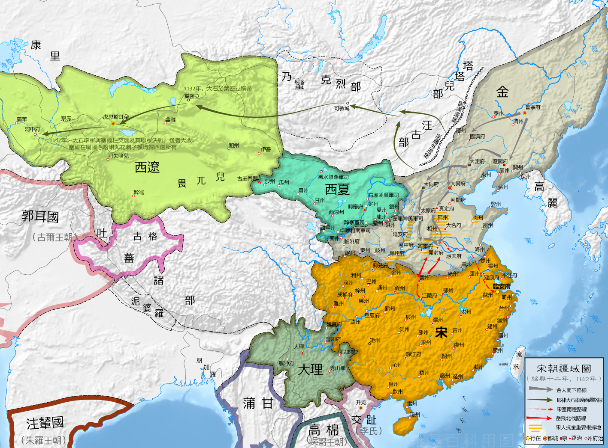

# 春秋

# 战国

# 西楚

# 新

# 更始政权

# 五胡十六国

## 概述

[五胡十六国](https://zh.wikipedia.org/wiki/五胡十六国)（304年—439年），是东晋时期北方诸国的统称。该时期自304年刘渊及李雄分别建立汉赵及成汉起至439年北魏灭北凉为止。

在入主中原众多民族中，以[匈奴](https://zh.wikipedia.org/wiki/匈奴)、[鲜卑](https://zh.wikipedia.org/wiki/鲜卑)、[羯](https://zh.wikipedia.org/wiki/羯)、[氐](https://zh.wikipedia.org/wiki/氐)及[羌](https://zh.wikipedia.org/wiki/古羌人)为主，统称**五胡**。他们在这个范围内相继建立许多国家，而北魏史学家崔鸿以其中十六个国家撰写《[十六国春秋](https://zh.wikipedia.org/wiki/十六国春秋)》（五凉、四燕、三秦、二赵，成汉、胡夏为十六国），于是后世史学家称这时期为**五胡十六国**。

## 历史

# 辽

## 概述

[辽朝](https://zh.wikipedia.org/wiki/辽朝)（916年3月17日－1125年3月26日），是由[契丹人](https://zh.wikipedia.org/wiki/契丹人)在中国北方建立的王朝，国号**辽**，国君为耶律姓，国祚210年。

[西辽](https://zh.wikipedia.org/wiki/西辽)（1124年－1218年），又称**后辽**、**喀喇契丹**、**哈剌契丹**，是[辽朝](https://zh.wikipedia.org/wiki/辽朝)宗室重臣[耶律大石](https://zh.wikipedia.org/wiki/耶律大石)在辽朝灭亡之际重新建立的以“**辽**”为国号的王朝。因位于先前[耶律阿保机](https://zh.wikipedia.org/wiki/耶律阿保机)所建的[辽朝](https://zh.wikipedia.org/wiki/辽朝)之西，该政权被史称为“**西辽**”。

[北辽](https://zh.wikipedia.org/wiki/北辽)（1122年-1122年），即[耶律淳](https://zh.wikipedia.org/wiki/耶律淳)政权，是辽朝的一个分裂王朝。1122年[辽天祚帝](https://zh.wikipedia.org/wiki/辽天祚帝)流亡夹山之后，耶律淳被[耶律大石](https://zh.wikipedia.org/wiki/耶律大石)等人拥立并建立政权。同年年底[金朝](https://zh.wikipedia.org/wiki/金朝)攻占燕京，北辽灭亡，国祚不足1年。

[西北辽](https://zh.wikipedia.org/wiki/耶律雅里政权)（1123年-1124年），即[耶律雅里](https://zh.wikipedia.org/wiki/耶律雅里)政权，是辽朝的一个分裂王朝。1123年[辽天祚帝](https://zh.wikipedia.org/wiki/辽天祚帝)向西奔走，[耶律特烈](https://zh.wikipedia.org/w/index.php?title=耶律特烈&action=edit&redlink=1)和[耶律兀直](https://zh.wikipedia.org/w/index.php?title=耶律兀直&action=edit&redlink=1)等人劫持[耶律雅里](https://zh.wikipedia.org/wiki/耶律雅里)向北奔逃，在沙岭（今沽源县丰源店乡附近），[耶律雅里](https://zh.wikipedia.org/wiki/耶律雅里)被拥立并建立政权。1124年太保[特母哥](https://zh.wikipedia.org/wiki/特母哥)向金朝投降，西北辽灭亡，国祚不足1年。

[东辽](https://zh.wikipedia.org/wiki/东辽)（1213年－1269年），是[金宣宗](https://zh.wikipedia.org/wiki/金宣宗)时期[契丹人](https://zh.wikipedia.org/wiki/契丹人)[耶律留哥](https://zh.wikipedia.org/wiki/耶律留哥)以今[中国东北](https://zh.wikipedia.org/wiki/中国东北地区)部为中心建立的君主制政权。1212年3月，耶律留哥称王，国号辽，史称[东辽](https://zh.wikipedia.org/wiki/东辽国)。东辽归附[蒙古帝国](https://zh.wikipedia.org/wiki/蒙古帝國)，成为其藩属，1270年[元世祖](https://zh.wikipedia.org/wiki/忽必烈)撤藩，东辽正式灭亡。东辽从吉林农安发迹起家。

[契丹君主列表](https://zh.wikipedia.org/wiki/契丹人#辽朝（契丹）君主列表)

[辽朝君主列表](https://zh.wikipedia.org/wiki/辽朝君主列表)

[辽朝皇帝世系图](https://zh.wikipedia.org/wiki/辽朝皇帝世系图)

## 历史

- 之前历史详见 `种族史 | 契丹`。

- 晚唐时契丹[迭剌部](https://zh.wikipedia.org/wiki/迭剌部)的首领[耶律阿保机](https://zh.wikipedia.org/wiki/耶律阿保机)崛起并征服各部，取代[痕德堇](https://zh.wikipedia.org/wiki/遥辇钦德)可汗后于辽太祖元年（907年）即可汗位。

- 916年3月17日（五代时期），[耶律阿保机](https://zh.wikipedia.org/wiki/耶律阿保机)建立契丹国，即辽太祖。

- 926年，辽太祖灭[渤海国](https://zh.wikipedia.org/wiki/渤海國)。

- 936年，[河东节度使](https://zh.wikipedia.org/wiki/河东节度使)[石敬瑭](https://zh.wikipedia.org/wiki/石敬瑭)以自称儿皇帝，割让[燕云十六州](https://zh.wikipedia.org/wiki/燕雲十六州)为条件，请求辽太宗支援攻打后唐。此举使后代中原皇朝难以抵御北方游牧民族的攻打，直至明朝初年才夺回对该地区的长期控制权。

- 947年，辽太宗攻克[后晋](https://zh.wikipedia.org/wiki/後晉)首都开封，后晋亡，辽太宗改国号为**大辽**。

    

      
      
辽朝、北宋、西夏三国疆域

    

- 1122年正月，金军攻克[辽中京](https://zh.wikipedia.org/wiki/大定府_(辽朝))，[天祚帝](https://zh.wikipedia.org/wiki/天祚帝)流亡夹山。由于位于[辽南京](https://zh.wikipedia.org/wiki/辽南京)的[耶律大石](https://zh.wikipedia.org/wiki/耶律大石)与李处温等人不知[天祚帝](https://zh.wikipedia.org/wiki/辽天祚帝)去向，他们拥立[耶律淳](https://zh.wikipedia.org/wiki/耶律淳)为帝，即天锡帝，是为[北辽](https://zh.wikipedia.org/wiki/北遼)，北辽国祚不足1年。

- 1124年，[辽朝](https://zh.wikipedia.org/wiki/辽朝)宗室重臣[耶律大石](https://zh.wikipedia.org/wiki/耶律大石)在辽朝西北边陲镇州可敦城（今蒙古国布尔干省青托罗盖古回鹘城）称王，改元延庆。耶律大石是[辽朝](https://zh.wikipedia.org/wiki/辽朝)开国君主[耶律阿保机](https://zh.wikipedia.org/wiki/耶律阿保机)的八世孙。

- 1125年3月26日，[辽天祚帝](https://zh.wikipedia.org/wiki/辽天祚帝)在投奔[西夏](https://zh.wikipedia.org/wiki/西夏)的途中被金人所俘，**辽朝灭亡**；1128年，天祚帝病故。

- 1132年，耶律大石在叶密立（今新疆额敏县）称帝，国号为“**辽**”，史称[西辽](https://zh.wikipedia.org/wiki/西辽)。

- 1141年，西辽在[卡特万之战](https://zh.wikipedia.org/wiki/卡特万之战)中击败[塞尔柱帝国](https://zh.wikipedia.org/wiki/塞尔柱帝国)联军，征服[河中地区](https://zh.wikipedia.org/wiki/河中地区)和[花剌子模](https://zh.wikipedia.org/wiki/花剌子模王朝)，从此成为中亚霸主。

    

      
      
浅绿部分为西辽鼎盛时期的版图，右侧虚线内为耶律大石早期的势力范围

    

- 1211年，[突厥](https://zh.wikipedia.org/wiki/古突厥)[乃蛮部](https://zh.wikipedia.org/wiki/乃蛮)贵族[屈出律](https://zh.wikipedia.org/wiki/屈出律)篡位称帝，但是仍以“辽”为国号。最终，[西辽](https://zh.wikipedia.org/wiki/西辽)于1218年被[成吉思汗](https://zh.wikipedia.org/wiki/成吉思汗)的[蒙古](https://zh.wikipedia.org/wiki/蒙古帝国)军队所灭，国祚87年。

- 1218年，西辽被[蒙古帝国](https://zh.wikipedia.org/wiki/蒙古帝国)在[攻辽战役](https://zh.wikipedia.org/wiki/蒙古攻西辽之战)中击败，**西辽灭亡**。

## 后续

西辽灭亡后，契丹贵族[耶律八剌黑](https://zh.wikipedia.org/wiki/耶律八剌黑)前往[波斯](https://zh.wikipedia.org/wiki/波斯)的[克尔曼沙赫](https://zh.wikipedia.org/wiki/克尔曼沙赫)，皈依[伊斯兰教](https://zh.wikipedia.org/wiki/伊斯蘭教)。于1224年在该地建立了[克尔曼王朝](https://zh.wikipedia.org/wiki/克爾曼王朝)。该王朝被个别学者称为**后西辽**。1306年，该王朝被[伊尔汗国](https://zh.wikipedia.org/wiki/伊尔汗国)所兼并。

# 西夏

[西夏](https://zh.wikipedia.org/wiki/西夏)（1038年11月10日－1227年8月28日），国号**大夏**、**邦泥定国**，是中国历史上以[党项族](https://zh.wikipedia.org/wiki/党項)主体，包括汉族、回鹘族与吐蕃族等民族在内的王国。因位于中原地区的西北方，史称西夏。

# 金

[金朝](https://zh.wikipedia.org/wiki/金朝)（1115年1月28日－1234年2月9日），是北宋时期由[女真人](https://zh.wikipedia.org/wiki/女真人)建立的一个朝代，国号**大金**，国君为**完颜**氏。

## 历史

- 1122年正月，金军攻克[辽中京](https://zh.wikipedia.org/wiki/大定府_(辽朝))；1125年3月26日，天祚帝在应州被为金人所俘，辽朝灭亡。

# 北元

[北元](https://zh.wikipedia.org/wiki/北元)（1368年9月14日－1388年11月1日），是[明朝](https://zh.wikipedia.org/wiki/明朝)建国后汉文典籍对于[元朝](https://zh.wikipedia.org/wiki/元朝)主力北迁撤回蒙古草原的残存政权之称。

# 南明

[南明](https://zh.wikipedia.org/wiki/南明)（1644年6月19日—1662年6月1日），由1644年[甲申之变](https://zh.wikipedia.org/wiki/甲申之變)后，明朝宗室与官员在中国南方相继成立的政权构成。

# 
