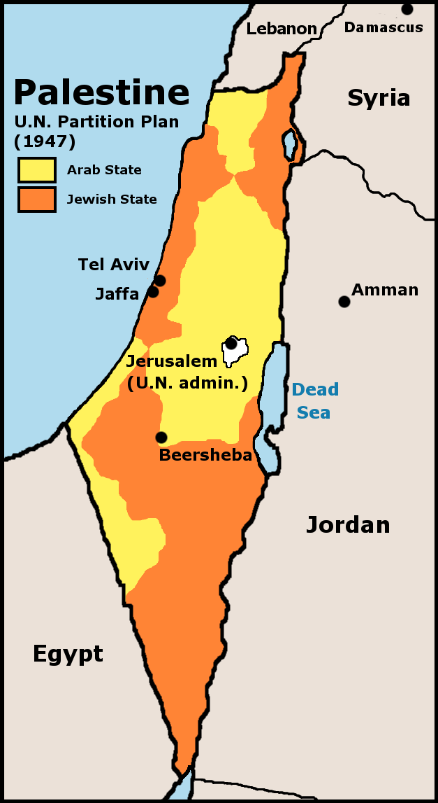
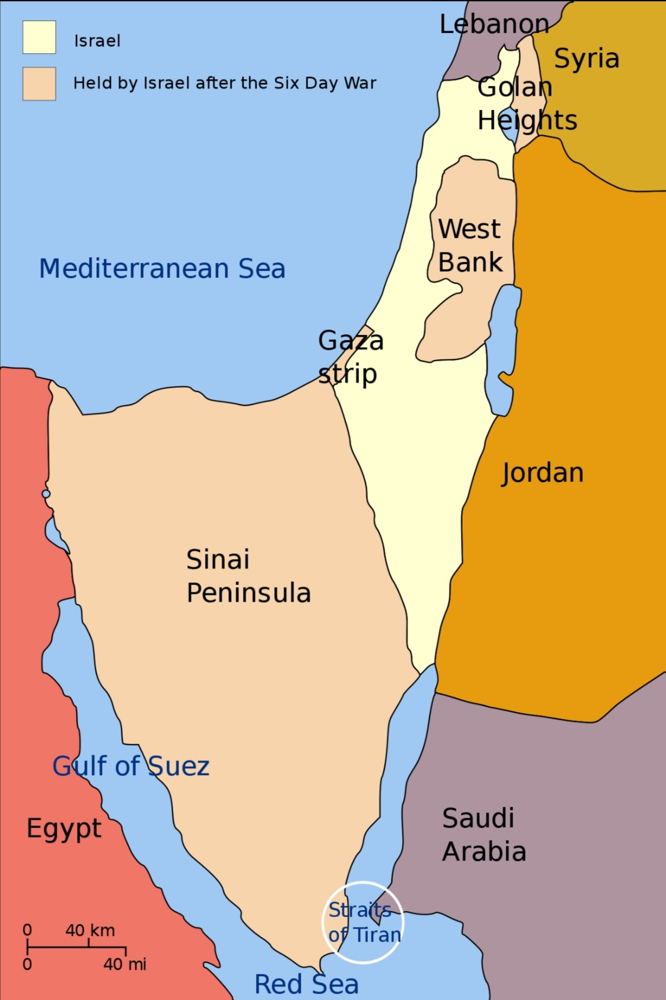
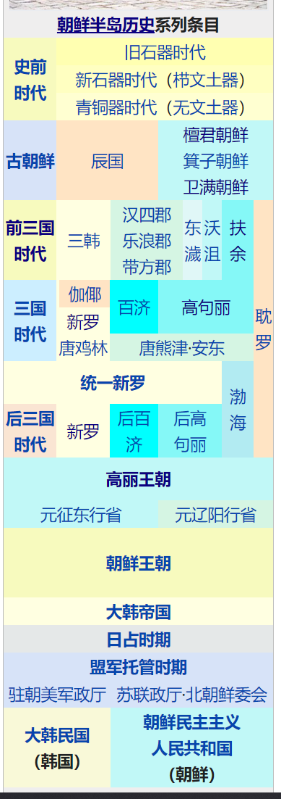

# 阿拉伯半岛

阿拉伯半岛（The Arabian Peninsula），位于亚洲西南部，从中东向东南方伸入印度洋，属印度洋板块。半岛南靠阿拉伯海和亚丁湾，东临波斯湾、阿曼湾，北面以阿拉伯河口—亚喀巴湾顶端为界，与亚洲大陆主体部分相连。半岛南北长约2240千米，东西宽约1200-1900千米，总面积达325万平方千米，是世界最大的半岛，与印度半岛、中南半岛并称亚洲三大半岛。

常年受副高压带及信风带控制，几乎整个半岛都是热带沙漠气候区并有面积较大的无流区。炎热干燥的气候形成了大片沙漠，沙漠面积约占总面积的40%，其中以鲁卜哈利沙漠为最大，面积65万平方千米，为世界上最大的纯沙沙漠。

阿拉伯半岛紧接亚非两洲，半岛两侧的红海和海湾，连通埃及和肥沃新月地带，形成一条重要的东西交通的天然走廊，地属交通要塞，战略位置十分重要。

半岛沿波斯湾周围有大量石油储藏，石油储量居世界第一，自从20世纪陆续成功开采后，给阿拉伯半岛上临近波斯湾的国家带来了巨大的财富。

岛上的国家有：沙特阿拉伯、也门、阿曼、阿拉伯联合酋长国、科威特、卡塔尔和巴林，其中以沙特阿拉伯的面积最大，占据阿拉伯半岛总面积的75%。

# 巴勒斯坦地区

本章节泛指巴勒斯坦地区，有关巴勒斯坦国的情况，详见“巴勒斯坦国”章节。

巴勒斯坦地区（阿拉伯语： المناطق الفلسطينية ；希腊语：Παλαιστινιακάεδάφη ；希伯来语：השטחיםהפלסטיניים；拉丁语：Palestine）地处亚、非、欧三洲交通枢纽，位于西亚的一个地理区域，位于地中海与死海、约旦河之间，具有重要的战略意义。面积27090平方公里。现主要居民有阿拉伯人、犹太人。

耶路撒冷是犹太教和基督教的最神圣的圣城，同时也是伊斯兰教的第三大圣城。所以这个地区对犹太教、基督教和伊斯兰教来说都具有深厚的宗教和政治意义。

由于阿以双方多年以来都未遵循1947年《联合国大会181号决议》划定的以色列和巴勒斯坦国国界，冲突不断，国际社会只能有限调解以巴冲突，至今仍未达成和平，目前该地区划分：

- **以色列除去合法占领1947年《联合国大会181号决议》“分治方案”土地外，还非法占领以下地区**
    - 加沙地带（1967年—2005年；2005年撤兵后以色列仍控制着边界、领空和海岸线）

    - 约旦河西岸地区（1967年全部—至今部分地区）

    - 西奈半岛（1967年—1982年）

    - 戈兰高地（1967年全部—至今）

    - 整个耶路撒冷（1967年全部—至今）

- **巴勒斯坦**
    - 民事管理加沙地带（2005年—至今；2005年以色列撤兵后以色列仍控制着边界、领空和海岸线）

    - 完全管理部分约旦河西岸地区

- **巴勒斯坦地区不同时期地域**

    

## 巴勒斯坦名字来源

- 巴勒斯坦的辞源是希伯来语对从海上入侵迦南地的非利士人的称呼；

- 在亚述文中地中海西南部的海岸被称为“Pilaschtu”。

- 古希腊历史学家希罗多德的文章中出现了“叙利亚的巴勒斯坦”这个名字，来描写从今天的黎巴嫩到埃及的海岸地区。

- 波斯帝国到罗马帝国统治时期，巴勒斯坦地区被称为“犹太省”。

- 公元135年，“第二次犹太战争”后，为了消除犹太人的记忆，罗马人将“犹太省”的名字改为“巴勒斯坦”来泛指这一地区。

- 一战结束，英国占领该地区，此地区遂被正式称为“巴勒斯坦地区”。

- 现代的巴勒斯坦指加沙地带和约旦河西岸地区的一个非正常国家。

## 耶路撒冷

- 耶路撒冷（阿拉伯语：القدس الشريف 、英语：Jerusalem、希伯来语：ירושלים、拉丁语：Yerushalayim或Yerushalaim）。

    

      
      
    

    
    

      <figure>
        
        <figcaption style="font-size: 16px; color: gray">
          耶路撒冷位置
        </figcaption>
      </figure>
      <figure>
        
        <figcaption style="font-size: 16px; color: gray">
          耶路撒冷旧城
        </figcaption>
      </figure>
    

### 宗教地位

耶路撒冷旧城区同时是犹太教、基督教和伊斯兰教的圣地，三个宗教历史遗迹和历史事件均位于此处：

- 犹太教的西墙和圣殿山；

- 伊斯兰教的圆顶清真寺、阿克萨清真寺、穆罕默德夜行登霄，为麦加、麦地那之后的第三圣地；

- 基督教的圣墓教堂、苦路以及耶稣在这里受难、埋葬、复活、升天，苦路的前半部分位于穆斯林区。。

- 圣殿山纵跨穆斯林区和犹太区两个区，是圣地中的圣地！
    - 犹太教的圣殿、伊斯兰教的圆顶清真寺和阿克萨清真寺都位于圣殿山；

    - 亚伯拉罕献子、雅各与神角力、都在圣殿山；

    - 穆罕默德夜行登霄的登霄石、亚伯拉罕献子的石头是同一块巨石（位于圆顶清真寺内）。

### 耶路撒冷现状

耶路撒冷为巴勒斯坦地区的一个城市，以色列和巴勒斯坦都宣称对其拥有主权，并且都宣称在此定都，但都未获国际广泛认可，该城市的最终地位也被认为尚未确定，有待以色列和巴勒斯坦双方谈判决定。根据《联合国大会181号决议》，耶路撒冷由联合国管理，目前以色列实际控制耶路撒冷。

今天的耶路撒冷，是一个对比强烈的城市。不同文化、不同宗教、不同民族、社会不同阶层，同处一城；城市的东西两部分截然不同，发展水平悬殊。老城雅法门以西的西耶路撒冷（1967年以前属于以色列的市区）是现代以色列的核心地带（如果再继续向西数十公里，就是以特拉维夫为中心的“古什·但”区域），而老城及其东、北、南三面的东耶路撒冷（1967年后以色列占领的争议区域）则以阿拉伯人为主。最特别的地方是面积只有1平方公里，被一圈城墙所围绕的耶路撒冷老城，其中又分为4个宗教与种族聚居区：犹太区、基督徒区、亚美尼亚区和穆斯林区。

### 名称来历

耶路撒冷名称的来源尚无法确定。

在希伯来语中，Yerushalaim这个名字可以理解为yerusha（遗产）和shalom（和平）的合成词。另一个比较普遍的解释是它将《圣经》里两个城市的名字结合在一起：耶布斯（Jebus）和撒冷（Salem，意“和平”）。耶布斯是希伯来人来到当地之前，迦南人为该城所起的名字；而撒冷这个地名出现在《创世纪》14章，是大祭司麦基洗德的住处，他为来到这里的亚伯拉罕祝福。耶路的意思是“基石”或者“城市”，撒冷为和平，因而在希伯莱文中耶路撒冷有“和平之城”之称。

在阿拉伯文中耶路撒冷的名称是القدس或بيتالمقدس。قدس的意思是圣地，在词前加冠词ال成为القدس，特指圣城耶路撒冷。同样的，بيت意为房屋、住宅，المقدس意为神圣的（人）、圣洁的（人），两词合起来组成بيت
المقدس则特指圣城耶路撒冷，字面意思也是圣人之家即圣地。

大约在公元前1000年，大卫王攻破耶布斯人的城堡并夺取该城，向南扩建城市并定都于此，更改成今天的名称“Yerushalayim（耶路撒冷）”

### 耶路撒冷历史沿革

#### 史前时代

- 考古发现显示，今天的耶路撒冷的开发可以追溯到西元前四千年。

- 关于该市最早的文字记载见于前19世纪的埃及诅咒祷文和前14世纪的阿马尔奈文书。

#### 犹太时期

- 约公元前1050年—前586年，犹太人建立的以色列联合王国、以色列王国和犹大王国统治该地区。色列王国和犹大王国先后被亚述王国和新巴比伦王国所灭。

- 公元前586年—前63年，耶路撒冷随后被巴比伦、波斯、希腊（马其顿帝国、托勒密王朝和塞琉古王朝）、哈斯蒙尼王朝（犹太自治）等国的统治，犹太人在耶路撒冷有一定自治。

#### 罗马时期

- 公元前63年—638年，耶路撒冷被罗马（大希律王、罗马帝国、拜占廷帝国）统治。

#### 阿拉伯时期

- 公元638年，穆斯林从拜占庭帝国夺取了该地区的控制权，之后一千多年数个穆斯林国家统治过这个地区，以及花剌子模有过短暂占领，十字军东征也有过占领。

- 公元1260年—1516年，由突厥人“马穆鲁克王朝”统治。

#### 近代时期

- 【**奥斯曼帝国时期**】公元1517年—1917年，巴勒斯坦地区成为奥斯曼帝国一个省份，城内任何宗教都可以存在，耶路撒冷得以发展。

- 【**英管时期**】一战结束，奥斯曼帝国完全退出此地区，耶路撒冷由英国占领。1920年，国际联盟委托英国管辖巴勒斯坦。

#### 联大以后

- 1947年11月29日，联大通过《联合国大会181号决议》，成立耶路撒冷市国际特别政权，由联合国来管理。

- 1948年5月15日，第一次中东战争爆发，以色列占领西耶路撒冷，约旦占领东耶路撒冷及老城区。

- 1949年以色列将首都迁至西耶路撒冷。（未获国际广泛认可）。

- 1950年，以色列定都西耶路撒冷。同年，东耶路撒冷及老城区被正式合并入约旦王国，许多阿拉伯人持有约旦国护照，并保留至今。

- 1967年6月5日，第三次中东战争爆发，以色列占领东耶路撒冷及老城区，控制耶路撒冷全部，直到现在。

- 1980年，以色列立法认定耶路撒冷是该国“永远的和不可分割的首都”。

- 1988年巴勒斯坦自治政府宣布耶路撒冷是巴勒斯坦国的首都。但耶路撒冷由以色列实际控制。

- 2011年2月，时任俄总统梅德韦杰夫访巴期间，公开表示支持建立以东耶路撒冷为首都的独立的巴勒斯坦国。

- 2017年12月6日（北京7日凌晨2点），特朗普正式在白宫外交厅宣布美国承认耶路撒冷为以色列首都。

- 2017年12月21日，联合国大会以压倒性多数投票通过一项决议，认定任何宣称改变耶路撒冷地位的决定和行动无效。

- 2018年5月，美国、危地马拉、巴拉圭将驻以使馆迁至耶路撒冷。

- 2017年12月13日，伊斯兰合作组织在土耳其伊斯坦布尔举行特别首脑会议后发表公报，宣布承认东耶路撒冷为巴勒斯坦国首都。

## 《联合国大会181号决议》

- **《联合国大会181号决议》**

    

- 1947年11月29日，联合国大会表决了《联合国大会181号决议》，通过决议：英国于1948年8月1日之前结束在巴勒斯坦的委任统治，并撤出其军队；两个月后，在总面积2.7万平方公里的巴勒斯坦的土地上再建立两个国家（之前的东部已建立约旦），即阿拉伯国和犹太国。根据分治决议的蓝图，阿拉伯国国土11203平方公里，约占当时巴勒斯坦总面积的43%，人口中阿拉伯人为72.5万人，犹太人为1万人；犹太国国土为14942平方公里，约占巴勒斯坦总面积的57%，人口中阿拉伯人为49.7万人，犹太人为59.8万人。决议还规定：成立耶路撒冷市国际特别政权，由联合国来管理。
  
- 阿拉伯人因联大违背“民族自决权”而拒绝接受“分治方案”，并导致大规模冲突。

## 第一次中东战争

- 1948年5月15日，第一次中东战争爆发。阿拉伯联盟国家埃及、外约旦、伊拉克、叙利亚和黎巴嫩的军队相继进入巴勒斯坦。

- 双方在1949年达成一则停火协议并划清暂时的边界，这条边界线被称为“绿线”（Green
    Line）。

- 以色列在约旦河的西方侵占额外的23.5%的管辖领域。

- 约旦则占有东耶路撒冷、约旦河西岸地区（1949年—1967年）（以色列南部一块山地区域和撒马利亚）。并于1950年正式将其并入约旦王国，
    此地所有的阿拉伯人成为约旦国民。

- 埃及在沿海地区占有加沙地带（1949年—1967年）（即加萨走廊）。

- 随著第一次中东战争，约旦河西岸地区和加沙地带的犹太人口开始迁入以色列，大量来自阿拉伯国家的犹太难民使得以色列的人口骤增两倍。在接下来几年里将近850,000名瑟法底犹太人移民，其中约有600,000人迁移至以色列，其他的人则移民至欧洲和美国。

## 第二次中东战争

- 1956年，埃及国有化苏伊士运河，并封锁以色列战略要地帝朗海峡（以色列在红海唯一出海口），以色列秘密地与英法两国结盟，对埃及宣战，爆发“苏伊士运河危机”，欧美石油运输受阻，三国遭国际谴责，以色列从西奈半岛（（1956年—1957年））撤军。

- 经过此次危机，埃及彻底国有化苏伊士运河。

- 经过此次危机，以色列解除了埃及对蒂朗海峡的封锁。

## 第三次中东战争

- 1967年6月5日，即“六日战争”。1967年6月5日，即“六日战争”。埃及驱逐在加沙地带的联合国维和部队，并且再次封锁帝朗蓝海峡，又在接壤以色列的边界大量屯兵，于是以色列对埃及开战，叙利亚和约旦后期参战。

- 以色列一口气夺下了约旦河西岸（1967年—现在）、加沙地带（1967年—2005年；但仍控制领空和水域）、西奈半岛（1967年—1982年）、和戈兰高地，控制了巴勒斯坦全境。以色列将其法律管辖范围拓展至戈兰高地和东耶路撒冷，很多巴人被迫流落到周围阿拉伯国家和世界各地，沦为难民。

- 第三次中东战争后格局

    

    > 上图为第三次中东战争后格局
    >
    > 白色：第三次中东战争前的以色列；
    >
    > 粉红色：第三次中东战争后的以色列取得的领土（约旦河西岸、加沙地带、戈兰高地及西奈半岛）

## 慕尼黑惨案

- 1972年，巴勒斯坦民兵组织挟持以色列的奥运代表团成员作为人质，最后所有人质皆遭杀害，即“慕尼黑惨案”。以色列对此展开为期7年的报复性“上帝之怒行动”（天谴行动）。

## 第四次中东战争

- （又称**赎罪日战争**、**斋月战争**、**十月战争**）1973年10月6日（犹太教的赎罪节），埃及和叙利亚对以色列发起了突袭攻势，以色列依靠美国将入侵者击退。战后的几年局势变的较为平静，以色列和埃及终于得以达成和平协议。

- 为了报复美国支援以色列，部分阿拉伯国家宣布对美国实行石油禁运，由此又导致“第一次石油危机”。

## 戴维营协议

- 【**背景**】1978年9月9日，美国为扩大在中东的影响、避免阿以再次爆发战争而危及对西方的石油供应，应当时美国邀请下，美国总统卡特、埃及总统萨达特和以色列总理贝京三方在美国总统休养地戴维营举行最高级会议。在9月17日埃以双方签署了在中东和平进程中具有历史意义的《关于实现中东和平的纲要》和《关于签订一项埃及同以色列之间的和平条约的纲要》两份文件，这就是著名的“戴维营协议”。

- 《关于实现中东和平纲要》主要内容是：各方决心通过在联合国安理会第242号和338号决议基础上缔结和平条约；在约旦河西岸和加沙地带建立自治机构，并安排一个不超过5年的过渡期，在那里将建立自治机构来取代以色列的军事统治机构，以色列取消设在约旦河西岸和加沙地带的军事机构。此外，将建立一支警察部队，其中可以有约旦人参加。以色列、约旦部队将参加联合巡逻。在此期间，各方举行谈判，确定上述地区最后地位问题和同邻近地区的关系。在过渡期结束以前，以色列、约旦将缔结和约。

- 《关于签订埃及同以色列之间和平条约的纲要》的主要内容有：西奈半岛归还埃及；埃及、以色列在本纲要签字后3个月内举行谈判并缔结和约；在缔结和约后3—9个月内，以军从西奈半岛部分地区撤出，埃及、以色列建立正常外交关系；和约签订后2—3年内，以色列军队完全撤出西奈半岛；以色列船只可在苏伊士运河、蒂朗海峡和亚喀巴湾自由航行。纲要还对埃及在西奈的驻军人数、位置作了限制。

- 【**意义**】“戴维营协议”的签署，为埃及、以色列双方在1979年3月正式签订和平条约（埃以和约）、结束战争状态打开了通道，加速了巴勒斯坦和叙利亚同以色列进行谈判的历程，有力地推动了中东和平进程。协议的签订为实现中东和平开辟了一条新途径，使阿拉伯国家同以色列的关系开始由对抗向对话方向发展。但是，由于协议未提出解决巴勒斯坦民族自决权和归还其他阿拉伯被占领土等问题，引起大多数阿拉伯国家的不满和反对，使阿拉伯联盟发生严重分裂；约旦河西岸和加沙地带的自治安排也未如期实施。

## 第五次中东战争

- 1982年，以色列入侵黎巴嫩，卷入黎巴嫩内战，攻下首都贝鲁特。

- 在以色列国防军的默许下，黎巴嫩长枪党策划“贝鲁特难民营大屠杀”，杀害千名以上的伊斯兰教徒。

- 以色列军队将巴勒斯坦解放组织逐出了黎巴嫩，迫使巴解转移基地至突尼斯。

- 以色列最后在1986年撤出了大部分在黎巴嫩的军队，边界的缓冲地带则一直被维持，直到2000年以色列进行单方面的撤军。

## 第一次巴勒斯坦大起义

- 在1987年爆发的巴勒斯坦大起义引燃了占领区域的一连串暴动。

## 奥斯陆协议

- 1991年开始，展开“中东和平谈判”。1993年8月20日，以色列总理伊扎克·拉宾与巴解主席阿拉法特在挪威首都奥斯陆会面达成协议，并于1993年9月13日，在白宫签署了《临时自治安排原则宣言》。

  

- 允许巴勒斯坦人在加沙—杰里科地区先行自治，巴最终地位的谈判在1999年5月4日前解决。

- 相互承认对方政治地位，巴方放弃恐怖主义及对以色列的保利袭击。

- “奥斯陆协议”被认为是巴以和平进程中的里程碑。9月16日巴解宣布结束对以色列的敌对状态。这标志巴勒斯坦人和犹太人开始结束百年的敌对，走向和解。但在协议签署后两年，拉宾遭以色列极端分子剌杀，奥斯陆协议的执行遭无限期搁置。

## 开罗协议

- 1994年5月4日，巴以在开罗签署了《临时自治安排原则宣言》的最后协议“开罗协议”。

- 根据协议，以完成了从加沙和杰里科的撤军，5月中旬，巴解接管加沙和杰里科，结束了以对这两地长达27年的军事占领。巴勒斯坦开始实行自治，成立自治政府。

- 巴勒斯坦政府得以对约旦河西岸地区和加沙地区进行实际上的管理，重新获得领土。

## 塔巴协议

- 1995年8月在埃及塔巴草签，9月28日在美国白宫正式签署。这是一份关于扩大巴勒斯坦自治范围的协议。根据协议，以军将从约旦河西岸包括希伯伦在内的7座主要城市撤出。

## 希伯伦协议

- 1997年1月17日，巴以正式签署《希伯伦协议》，同日，以军从该市80％的地区撤出，交由巴勒斯坦警察控制。

## 怀伊协议

- 1998年10月23日，巴以在美国马里兰州的怀伊种植园达成临时和平协议。协议规定以将从约旦河西岸13％的土地上撤军。

## 沙姆沙伊赫备忘录

- 1999年9月5日在埃及沙姆沙伊赫签署，是有关执行怀伊协议的新协议。双方同意1999年9月13日开始巴勒斯坦最终地位谈判，并于2000年2月15日前就耶路撒冷地位等问题达成框架协议，2000年9月13日前达成最终协议。此后，由于巴以双方在关键问题上分歧巨大，巴以在巴勒斯坦最终地位等问题上的谈判未取得任何进展。

## 第二次巴勒斯坦大起义

- 2000年9月，即“阿克萨群众起义”。大卫营协商失败，沙龙访问耶路撒冷圣殿山，巴勒斯坦爆发“第二次暴动”，被称为“阿克萨群众起义”。

## 以色列隔离墙

- 2002年6月起，以色列开始建隔离墙。

- 自2002年6月起，以色列开始沿1967年战争前以巴边界线修建高8米、长约700公里的安全隔离墙，尚未全部完工。其目的是将约旦河西岸巴勒斯坦地区与以色列彻底隔离开来，阻止巴激进组织成员渗透到以境内实施袭击。

- 该墙87％在约旦河西岸地区建立，以方的行为违反了国际法，是在对巴勒斯坦被占领土上的人民实施集体惩罚。

## 加沙战争

- 2008年12月26日，即“铸铅行动”。

## 云柱行动

- 2012年11月14日，以色列展开“云柱行动”，反击哈马斯的袭击，击毙加沙地带哈玛斯军事首领艾哈迈德·贾巴里，直到11月21日停止行动。

## 保护边缘行动

- 2014年6月，巴以双方发生“青年之死”，7月8日，以色列发动“保护边缘行动”。

# 朝鲜半岛

## 朝鲜半岛概述

  
  
朝鲜半岛

朝鲜半岛（英文：Korean Peninsula；朝鲜语：조선반도；韩语：한반도），又称韩半岛，是位于东亚的半岛，三面环海，有东亚桥梁之称。

朝鲜半岛地处东亚，东北与俄罗斯相连，西北经长白山（朝鲜和韩国称“白头山”）与中国相接，东南隔朝鲜海峡（韩国称大韩海峡、日本称对马海峡）与日本相望，西南隔黄海（朝鲜称“朝鲜西海”，韩国称 “西海”）与中国胶东半岛相望。

朝鲜半岛由半岛本土和 3300 个大小岛屿组成，半岛本土占全国总面积的 97%。

因朝鲜半岛南北跨度有将近三千朝鲜里（三朝鲜里合一公里，朝鲜半岛南北总长
1,100 公里，故约合 3,000 朝鲜里），因而又称 “三千里江山”。

## 朝鲜名字来源

朝鲜（조선）或韩（한）可以指文化上的朝鲜，包括地理上的朝鲜朝鲜半岛（韩半岛）或朝鲜的主体民族“朝鲜民族（韩民族）”。

朝鲜“一词最早见于《山海经》〈海内经〉：”东海之内，北海之隅，有国名朝鲜“。《尚书大传》对其含义的解释为”朝日鲜明“。后人为与后世的朝鲜王朝相区别在其国名前添加了一个”古"字。古朝鲜是朝鲜半岛历史最初的奴隶制国家。

## 朝鲜半岛历史沿革

  
  
朝鲜半岛历史

### 史前时代

- 距今60万至40万年是朝鲜半岛的旧石器时代，目前朝鲜半岛出土的最早期旧石器时代遗址史1966年在平壤祥原郡发现的“黑隅里遗址”。

- 公元前5000至2000年是朝鲜半岛的新石器时代。朝鲜半岛主要的新石器遗址有咸镜北道雄基屈浦里西浦项、慈江道中江郡土城里、平安北道宁边郡细竹里、黄海南道银泉郡鹤月里、京畿道广州郡岩寺里、釜山市东三洞等。石器时期为母系社会。

- 公元前2000至1000年是朝鲜半岛的青铜器时代。朝鲜半岛主要的青铜器遗址有咸镜北道会宁五洞、慈江道江界市公贵里和中江郡土城里、平壤金滩里、平安南道江西郡台城里、黄海北道凤山郡新兴洞、黄海南道龙渊郡石桥里等。青铜器时代为父系社会。

- 公元前 4 世纪进入铁器时代。

### 古朝鲜时期

对于古朝鲜的建国存在檀君朝鲜和箕子朝鲜两种说法。由于文献中箕子朝鲜内容的矛盾，加之考古发现的不足和朝韩民族主义因素等原因，箕子朝鲜的说法已被朝韩主流所否定。有人甚至认为箕子朝鲜是汉四郡时期的汉人或是后世慕华者编造出来的。

公元前 194 年，卫满发动政变推翻古朝鲜准王即位，但继续沿用古朝鲜的国号，史称“卫满朝鲜”。公元前 108 年，卫满朝鲜被西汉所灭。

#### 檀君朝鲜

传说在公元前 24 世纪（约公元前 2333 年），朝鲜半岛北部形成了檀君古朝鲜（意为 “宁静晨曦之国”）。

檀君朝鲜（韩语：단군조선）是一个关于古朝鲜建国的神话传说。1993年10月，朝鲜民主主义人民共和国在挖掘出土檀君陵后，宣称檀君是真实存在的历史人物而非神话，并将其正式列为朝鲜历史上首个国家古朝鲜的开国始祖。2007年2月，韩国亦开始将檀君朝鲜作为历史上的首个朝代写入历史教科书，但北朝鲜禁止外界对檀君陵进行研究，所以目前没有其他来源证实它们讲法。

#### 箕子朝鲜

箕子朝鲜（韩语：기자조선）是一个关于古朝鲜建国的神话传说。根据《史记》、《尚书大传》、《汉书》等史书的说法，是在公元前11世纪到前2世纪期间由商朝宗室箕子及中原地区移民在朝鲜半岛与当地原住民一起建立的一个国家。

#### 辰国

辰国也只见于中国古籍中的记载，辰国被认为是三韩（辰韩，马韩，弁韩）的前身。目前人们对辰国的认识很少，典籍中对辰国的记载也很少。

#### 卫满朝鲜

根据《史记》所记载，汉高祖刘邦时，燕王卢绾背叛汉朝，逃往匈奴。其部将卫满率领千余名部众逃入箕子朝鲜。古朝鲜的准王把他的部众安置在西北部边界的空地上。卫满召集齐、燕两地的亡命者，势力不断壮大。之后，卫满带兵推翻了箕子朝鲜，取得古朝鲜的首都王险城，建立卫满朝鲜。准王则率部逃到南方的马韩，在当地自称韩王。

卫满建立国家后，他积极对外扩张，输入中原文化，使国家愈来愈强盛。西汉以其为外臣，统御塞外蛮夷。

卫满死后，传位给儿子，后又传至孙子卫右渠。卫右渠拒绝向西汉朝贡，并阻塞了邻近小国向西汉朝贡的道路。汉武帝以此为由，于前109年（元封二年）发兵讨伐朝鲜。前108年，卫右渠被臣下所杀投降西汉，卫满朝鲜灭亡，西汉在其地设置“汉四郡”。但由于受到当地人的反击，真番、临屯二郡很快瓦解，玄菟郡也被转移到辽东。与此同时高句丽在鸭绿江流域兴起后，开始逐步统一其周边国家，并在西晋末年（313年）吞并了汉四郡的最后一郡—乐浪郡。

### 前三国时代

前三国时代（朝鲜语：원삼국시대）是公元前2世纪后朝鲜三国时代之前的朝鲜历史时期。

前三国时期，朝鲜半岛北部及中国东北分布着夫余、沃沮、濊貊、东濊等东北亚部落，朝鲜半岛南部为三韩部落。

进入 4 世纪以后，高句丽在鸭绿江流域兴起，统一北部的各部落国家及吞并汉四郡。在西南部，百济消灭了马韩
54 国。东南部的辰韩也由 12 国合并为新罗。

### 朝鲜三国时代

朝鲜半岛三国时代（朝鲜语：삼국시대）是朝鲜半岛427年到公元660年之间高句丽（前37年—668年）、百济（前18年—660年）、新罗（前57年—935年）三国鼎立的历史时期，史称“朝鲜三国时代”。

三国的文化和语言相通。宗教原本共同崇尚巫觋宗敎，但在中国文化的日趋影响下，儒家文化和道教传入。4世纪时，佛教传入朝鲜半岛，并迅速传播，一度成为三国的国教。

668年，新罗于唐朝帮助下先征服百济后灭高句丽，因而结束三国时代，并进入统一新罗时代。

### 统一新罗时代

灭亡高句丽后，唐朝试图在朝鲜半岛建立统治势力，导致676年“罗唐战争”。随着唐朝战略重心转向西部，新罗最终与唐朝达成停战协议，统一朝鲜半岛大同江以南，定都庆州，史称“统一新罗”。

大同江以北的高句丽故地被唐朝和渤海国等继承。

### 后三国时代

新罗景德王之子惠恭王即位后，都城内频繁发生暴动，780 年惠恭王与妃嫔等被杀，武烈王系血统断绝。之后连续发生篡位事件，宫廷纷乱。

王位争夺战中失败的王族后裔金宪昌于熊川州独立，拥有海上势力的将领张保皋亦起兵，介入都城的王位争夺。起事虽为中央军队镇压，地方上仍发生农民暴动，新罗王朝统治能力逐渐弱化。

【**后百济**】甄萱是尚州出身的农民，在西南海建立军功被升为将领。892 年以完山（今全州）为根据地起兵，攻占武珍州（今光州）独立。后纠集周边豪族以扩大势力，900 年自称 “后百济王”，于朝鲜半岛西南部建立 “后百济”。

【**后高句丽**】弓裔是新罗王族后裔，891 年起兵反新罗，随梁吉于江原道等地作战。898 年建都松岳（开城），901 年称王建 “后高句丽”，904 年立国号 “摩震”，911 年改国号 “泰封”。

### 高丽王朝

918 年，松岳豪族出身的王建在弓裔几位大将拥立下，推翻弓裔，改国号为“高丽”，年号 “天授”，次年迁都至松岳（今开城），935 年吞并新罗，936 年攻灭后百济，重新统一朝鲜半岛，新罗时代结束。

高丽时代阿拉伯商人将朝鲜半岛的情况传到欧洲世界，英语以及其他欧洲语言中“Korea”（Corea）一词的语源就是 “高丽”。

1392 年，高丽大将李成桂改元建国，并由明太祖定国号为朝鲜，史称“朝鲜王朝”。1895
年，甲午战争后，马关条约中协定了清朝承认朝鲜自主，朝鲜终止与清朝的册封关系，并建立了大韩帝国。

1910 年 “日韩合并”。力争使朝鲜半岛从日本独立的大韩民国临时政府于 1919 年 4 月 13 日在中国上海成立，并随当时抗日的中华民国国民政府于 1940 年到达重庆。

1945 年 2 月，第二次世界大战结束后，根据雅尔塔会议的安排，朝鲜半岛由美苏两国以三八线为界共同托管。此后朝鲜半岛被划分为南北两块势力范围：北部由苏联军事政府管理，南部则由美国军政厅统治。两者分别于 1948 年独立为 “朝鲜民主主义人民共和国”（조선민주주의인민공화국，简称“朝鲜”，조선）及 “大韩民国”（대한민국，简称 “韩国”，한국）。1950 年 6 月 25 日，朝鲜战争爆发。因苏联等社会主义国家缺席，导致当时美国等主导的联合国投票发动了联合国军支援韩国。联合国军支援的韩国同苏联和中华人民共和国支持的朝鲜最终在 1953 年签署停火协议，朝鲜半岛沿三八线非军事区划分为两个主权国家。

公元 1 世纪后，朝鲜半岛一带出现高句丽、百济、新罗 3 个古国。公元 7 世纪，新罗在半岛占据统治地位。公元 10 世纪，高丽取代新罗。公元 14 世纪末，李氏王朝取代高丽，改国号为朝鲜。

在甲午战争清朝战败后，在《马关条约》中放弃对朝鲜半岛的宗主权承认朝鲜半岛独立，1897 年，朝鲜王宣布建制称帝，建立大韩帝国。

1910 年 8 月朝鲜沦为日本殖民地，1945 年 8 月 15 日获得解放，同时，苏美军队以北纬 38 度线为界分别进驻朝鲜北半部和南半部。

朝鲜半岛在20世纪之前是一个统一的朝鲜族国家，1894年甲午战争以后被日本半殖民地化，直至1945年日本在二战中战败才得以复国。但战后因南北地区政治理念的不同而定以北纬38度分界线（三八线）分治，日后南北双方经历韩战的冲突，延续至今成为两个互相对立的国家。

第二次世界大战结束后，根据 1945 年 2 月雅尔塔会议的安排，原日占朝鲜由美苏两国共同托管。此后朝鲜半岛被划分为南北两块势力范围：苏联势力范围内的“朝鲜民主主义人民共和国”（朝鲜）以及美国势力范围内的“大韩民国”（韩国）。1950 年 6 月 25
日，朝鲜战争爆发。因苏联等共产主义阵营国家缺席，导致当时美国等主导的联合国投票发动联合国军队支援韩国。联合国军支援的韩国同苏联和中华人民共和国支持的朝鲜最终在 1953 年签署停火协议，朝鲜半岛沿三八线非军事区划分为两个国家政权，即今天的大韩民国和朝鲜民主主义人民共和国。

1948 年 8 月 15 日，大韩民国宣告成立；

1948 年 9 月 9 日，朝鲜民主主义人民共和国宣告成立。

## 高句丽

# 海湾地区

## 海湾概述

由于政治原因，海湾被伊朗称为“波斯湾”，而阿拉伯国家称为“阿拉伯湾”。

海湾位于亚洲西南部，是介于阿拉伯半岛和伊朗之间的一片狭长的海面，通过霍尔木兹海峡与阿曼湾相连，流向阿拉伯海，最终流入印度洋。总面积约23.3万平方公里，长990公里，宽58-338公里。

海湾地区有一条巨大的石油带，蕴藏着丰富的石油资源，其石油蕴藏量占全球的2/3，有“世界油库”之称，具有十分重要的经济意义和战略意义。西方所需海湾石油的大部分，必须通过海湾唯一的出海航道霍尔木兹海峡运出，所以海湾也是一条具有重要战略意义的国际通道。

海湾国家：伊朗、伊拉克、科威特、沙特阿拉伯、巴林、卡塔尔、阿拉伯联合酋长国和阿曼8个国家。

## 海湾战争

# 蒙古草原

# 中东地区

  
  
中东地区

## 中东地区概述

中东（英语：Middle East，阿拉伯语：الشرق الأوسط，希伯来语：המזרחהתיכון）又称**中东地区**。

“中东”是欧洲人使用的一个地理术语，概念究竟包括哪些国家和地区，国内外尚无定论。在西方国家开始向东方扩张时，他们以欧洲为中心，把东南欧、非洲东北称为“近东”，把西亚附近称为“中东”，把更远的东方亚洲最东部地区称为“远东”。

中东地区是指地中海东部与南部区域，从地中海东部到波斯湾的大片地区，亚洲西南部（除阿富汗）和非洲东北部，约23个国家（含巴勒斯坦），1500余万平方千米，4.9亿人口。

- 地理位置划分
    - 西亚国家（地区）包括沙特、伊朗、伊拉克、科威特、阿联酋、阿曼、卡塔尔、巴林、土耳其、以色列、巴勒斯坦、叙利亚、黎巴嫩、约旦、也门和塞浦路斯。（16个）

    - 北非国家（地区）包括：埃及、利比亚、突尼斯、阿尔及利亚、摩洛哥、马德拉群岛、亚速尔群岛。（7个）

    - 中东不包括阿富汗

- 人种划分
    - 以阿拉伯人为主的众多阿拉伯国家

    - 以土耳其人为主的土耳其

    - 以波斯人为主的伊朗

    - 以犹太人为主的以色列

气候类型主要为热带沙漠气候、地中海气候、温带大陆性气候。其中热带沙漠气候分布最广。

中东是“一湾两洋三洲五海”之地，五海具体指里海，黑海，地中海，红海，阿拉伯海。其中里海是世界上最大的湖泊且为最大的内陆咸水湖，交通便利，海陆空的路线，可顺利运送石油到各国。其处在联系亚欧非三大洲，沟通大西洋和印度洋的枢纽地位。是沟通大西洋和印度洋、连接西方和东方的枢纽地位，也是欧洲经北非到西亚的枢纽和咽喉。中东在世界政治、经济和军事上的重要地位，战略位置极其重要，为争夺宝贵的淡水资源和石油资源，及宗教文化差异，常年局势动荡。使其成为世界历史上资本主义列强逐鹿、兵家必争之地。

## 中东地区历史沿革

关于中东问题的历史沿革，可以用“一、二、三、四”概而言之，那就是：一个祖先，两个民族，三次流散，四次战争。

一个祖先，两个民族，迦南（现巴勒斯坦）人，原是阿拉伯半岛闪米特人的一支。约公元前11世纪，爱琴海沿岸的腓力斯丁人移居迦南。公元前5世纪，希腊史学家希罗多德首次称该地区为“巴勒斯坦”，即希腊语“腓力斯丁人的土地”之意，一直沿用至今。

约公元前1900年，闪族的另一支在族长亚伯拉罕（即基督教、犹太教、伊斯兰教共同的先知）率领下，由两河流域的乌尔迁徙到迦南。据《圣经》所说，亚伯拉罕与其妻撒拉生子以撒，他们便是犹太人的祖先。后犹太人逃亡埃及，摩西率众出埃及返迦南，一直到二战后建立以色列国，都是源于这一支系。亚伯拉罕与其妾埃及人夏甲生子以实玛利，因被撒拉所不容，被赶至阿拉伯半岛，繁衍生息，他们便是半岛北阿拉伯人的祖先，伊斯兰教的先知穆罕默德即是其后裔。

穆罕默德创教初期，犹太人和基督徒对他采取敌视态度。随着穆罕默德追随者不断增加，阿拉伯骑兵也开始对外扩张。7世纪时伊斯兰教分裂。拥戴穆罕默德后裔的人和接受哈里发代表真主的人逐渐形成“什叶派”和“逊尼派”。

## 中东问题

- 政治上的中东问题一般指阿拉伯国家和以色列的冲突问题。

### 动荡原因

#### 文化差异

中东的各民族仍然保留着自己的宗教信仰和风俗习惯，大多数居民信仰伊斯兰教，少数居民信仰基督教、犹太教和其他宗教。伊斯兰教、基督教和犹太教都将耶路撒冷视为圣城。文化上的差异也是导致中东不安定的重要原因之一。

#### 内部矛盾

埃及军人纳赛尔、萨达特打响了伊斯兰革命复兴运动的第一炮。在二战后，出现了34个表面上独立的伊斯兰国家。接着一大批宗教领袖试图寻求新的革命道路反对世俗政权，实行“伊斯兰革命”，恢复神权统治。伊斯兰民族革命到宗教革命的过程中，始终贯穿着现实的政治目标，即脱离西方或苏联的政治与经济控制，期望成为真正独立的国家；改变王室政体，建立共和国；梦想组建新的阿拉伯联盟，重温以往阿拉伯帝国的梦想；反对犹太复国主义，共同在军事上抵抗以色列。

但是由于各种原因，阿拉伯世界内部并不团结

- 首先，各个国家信奉伊斯兰教的不同派别（很多国家内部也有派别之争，导致政局动荡），教派之间的冲突影响了国家之间的关系；

- 其次是伊斯兰世界又有阿拉伯民族国家与非阿拉伯民族国家之分，从历史来看信仰伊斯兰教的非阿拉伯民族大多遭到阿拉伯民族的歧视与偏见，由于宿怨，在产生矛盾时极易发生冲突；

- 第三，在各个国家争取独立时，由于西方国家为了自己的利益而将一些国家、民族进行拆分，为以后的纷争埋下伏笔（如海湾战争，伊拉克以科威特历来为伊拉克为由入侵科威特），使得各国不断为领土、种族等发生矛盾；

- 第四，在伊斯兰教复兴于现代的道路中，泛伊斯兰主义与伊斯兰原教旨主义思潮占伊斯兰复兴运动中的主导思想，但是这不切实际的幻想与现实相距甚远，很多抱有英雄主义观点的阿拉伯国家领导人在国家政策上采取与西方强硬对抗，坚决建立伟大统一的阿拉伯国家，彻底消灭以色列，自然遭到以色列与西方国家的制约。在多重原因（如西方国家的控制、内部种族矛盾）的作用下，使得众多阿拉伯国家中分为亲西派与疏西派（如1978年埃及与以色列和解，埃及总统萨达特与以色列总理贝京签订戴维营协议遭到一些阿拉伯国家的反对；叙利亚却与以色列政治立场完全不同，坚决与以色列对立。）

- 1964年，“巴勒斯坦解放组织”成立，同时成立“巴勒斯坦解放军”。它是一个不具备国境，实质是政府形态的政治实体的组织。1969年，阿拉法特领导的法塔赫温和派成为巴解组织的执政党，虽然一开始与以色列有军事冲突，但后来转变为希望通过和平方式与以色列谈判。随着21世纪初巴以冲突加剧，阿拉法特逝世，他的继承人阿巴斯继续坚持走和平道路。未想到在之后的巴勒斯坦民族权利机构改选之后败给激进派哈马斯（在欧洲一直被视为恐怖组织）领导人哈尼亚。原本自从阿拉法特后期，巴以逐渐进入磕磕绊绊的和平时期，但是巴方这一政治剧变又为未来蒙上阴影。

所以不论从以色列方面还是巴勒斯坦方面，内部都存在着很大分歧。

#### 西方介入

在西方文艺复兴的影响下，由马丁·路德发起的16世纪基督宗教改革运动中，天主教教会分裂出新教。基督新教的改革运动同时，也是欧洲政治、经济发展处于转型期间，新教强调通过深入教徒的现世生活去请求上帝的救赎。新教这种对世俗行为的鼓励，使得人们在追求商业利润时解除了犯罪感，使得商业资本主义的各个运行领域都有了宗教的最后依据。

在一战中，西方国家本身是与阿拉伯诸国结盟以对抗昔日地跨欧亚非三洲的封建军事帝国—奥斯曼帝国，但二战后，由于支持以色列复国，与阿拉伯国家关系十分紧张，为了对抗西方国家，阿拉伯国家还大幅度调高国际油价。中东阿拉伯人的建国理想（一个统一的伊斯兰国家）经历了一个十分曲折的过程。在20世纪初，阿拉伯人试图摆脱土耳其人统治，在大叙利亚建立阿拉伯国家（自古以来，叙利亚、约旦、黎巴嫩、巴勒斯坦被视为一个整体）。但一战后，西方资本主义列强为了自身利益将叙利亚分割成四个区域。二战后，西方国家支持以色列建国，彻底粉碎了他们的梦想。同时，伊斯兰社会不断受到西方基督教世界文化的侵蚀，西方资本主义所倡导的人文主义、宽容、自立、科学、理性和民主等一整套文化价值体系缓慢影响着伊斯兰世界。

二战后，英孢国先是镇压中东犹太复国主义，改变殖民地政策后，又挑动阿拉伯人与犹太人的领土与宗教冲突，之后表面上抽身而退，将问题交给当时西方控制的联合国，暗中关注局面。而美国继英国之后开始支持以色列，总统杜鲁门向英国施加压力，率先收留犹太移民。在以色列建国后，美国第一个承认以色列。数次中东战争中，美国与一些西方国家（如英、法）更是提供给以色列大批军械武器和装备。若没有美国的支持，以色列根本不可能建国并得以大规模发展。

总体来说，美柿国在中东问题上的政策要点是：改造伊斯兰社会（镇压伊斯兰原教旨主义，用西方资本主义自由经济和“民主”价值观潜移默化影响阿拉伯国家）；扶植亲美政权；控制石油资源；调节巴以冲突（以和平方式解决巴勒斯坦问题）等。

#### 一多一少

- **多：石油资源**

中东是世界上石油储量最大，生产和输出石油最多的地区，中东石油主要分布在波斯湾及沿岸地区。由于自身对石油的消费量很少，中东所产石油90%以上由波斯湾沿岸港口用油轮运往欧洲西部、美国、日本、中国等国家和地区，是世界上输出石油最多的地区，对世界经济发展具有举足轻重的影响。

中东主要的产油国家有沙特阿拉伯、科威特、阿拉伯联合酋长国、伊朗、伊拉克，其中沙特阿拉伯、科威特、阿拉伯联合酋长国等，靠出口石油获得了可观的经济收入，成为富裕国家。

- **少：水资源**

中东水资源极度匮乏，与石油资源的丰富形成鲜明的对比。中东气候干燥，河流稀少，还有大面积没有河流的沙漠地区。水资源匮乏严重影响中东人民的生活和生产。随着人口的增长、经济的发展，中东水资源紧缺日趋严重。河流、湖泊水资源分配上的矛盾，也是形成中东紧张局势的原因之一。
