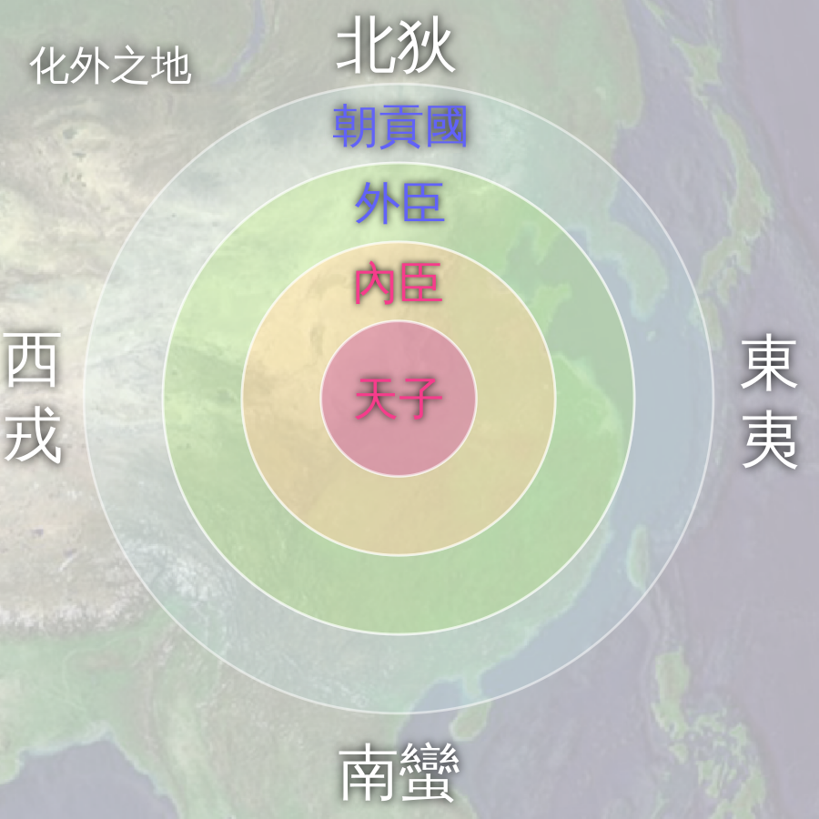
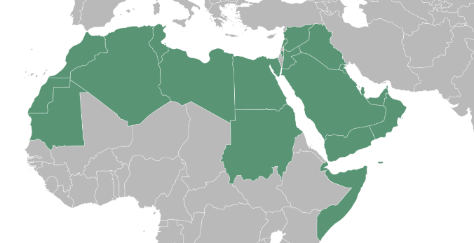
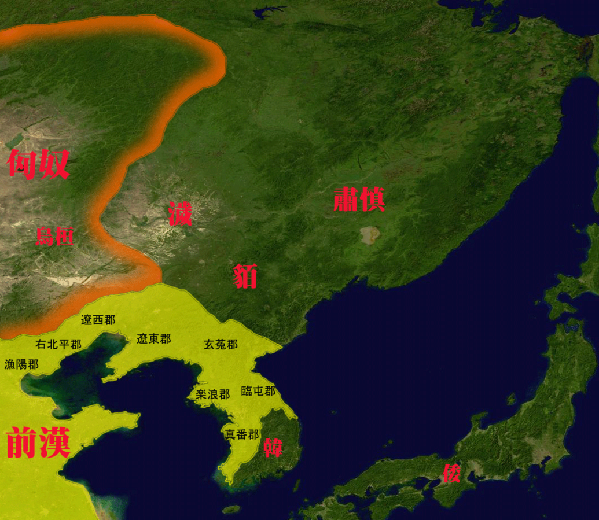
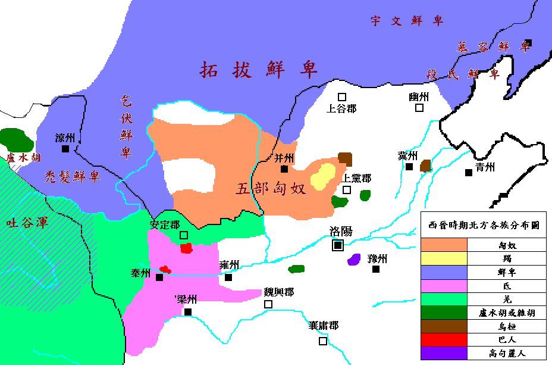
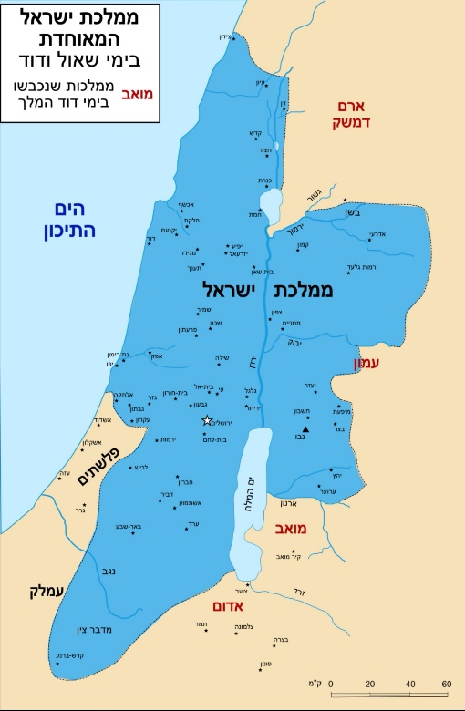
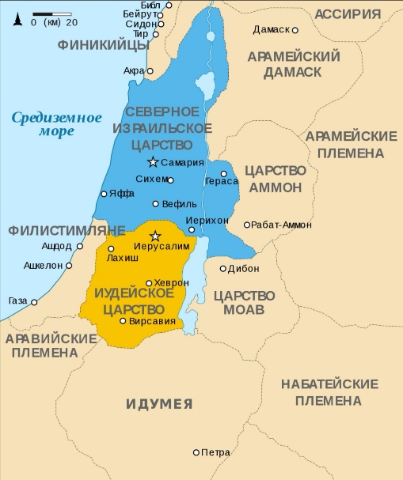

# 胡人

## 概述

[胡人](https://zh.wikipedia.org/wiki/胡人)是中国古代对[中原王朝](https://zh.wikipedia.org/wiki/中原王朝)以外的一种称谓，是一种[华夷秩序](https://zh.wikipedia.org/wiki/华夷秩序)。

<figure>
  
  <figcaption style="font-size: 16px; color: gray">天下秩序图</figcaption>
</figure>

胡人相关列表：

- [古代的诸种胡人](https://zh.wikipedia.org/wiki/%E8%83%A1%E4%BA%BA#%E5%8F%A4%E4%BB%A3%E7%9A%84%E8%AB%B8%E7%A8%AE%E8%83%A1%E4%BA%BA)
- [胡人在华所建诸政权](https://zh.wikipedia.org/wiki/%E8%83%A1%E4%BA%BA#%E5%9C%A8%E8%8F%AF%E6%89%80%E5%BB%BA%E8%AB%B8%E6%94%BF%E6%AC%8A)

东北古老三大部族：

- [东胡](https://zh.wikipedia.org/wiki/东胡)
- [<ruby>濊貊<rp>(</rp><rt>huì mò</rt><rp>)</rp></ruby>](https://zh.wikipedia.org/wiki/濊貊)
- [肃慎](https://zh.wikipedia.org/wiki/肃慎)

根据少数民族是否被彻底汉化，将少数民族政权分为：

- [征服王朝](https://zh.wikipedia.org/wiki/征服王朝)：吸收汉文化的同时亦刻意保持自身文化
- [渗透王朝](https://zh.wikipedia.org/wiki/渗透王朝)：吸收汉文化并彻底被汉化

## 兴起顺序

- 商周至秦汉：**东胡**

    - 早期与匈奴并立於中国北方的游牧民族联盟，活动於燕山以北。
    - 公元前206年被匈奴冒顿单于击溃，分裂为乌桓和鲜卑。

- 秦汉时期：**匈奴**

    - 中国北方第一个强大的游牧帝国，秦末汉初由冒顿单于统一蒙古高原，建立强大政权。
    - 与汉朝长期和战交替，公元48年分裂为南、北匈奴。南匈奴内附汉化，北匈奴在东汉的持续打击下西迁。

- 东汉至南北朝：**鲜卑**

    -  东胡的一支
    - 北匈奴西迁后，鲜卑趁机占据蒙古草原。
    - 魏晋南北朝时期，鲜卑各部南下建立多个政权，其中**拓跋鲜卑**建立的**北魏**（386年）统一北方。

- 南北朝：**柔然**

    - 源自鲜卑
    - 继鲜卑之后在蒙古高原崛起的游牧汗国，与北魏进行了长期的战争，最终在6世纪中叶被突厥人所灭。

- 南北朝至隋唐：**突厥**

    - 原为柔然锻奴，552年崛起并灭柔然，建立突厥汗国，疆域辽阔。
    - 583年隋文帝用离间计使其分裂为**东突厥**和**西突厥**。
    - 唐朝时，突厥最终为唐所联合的回纥等力量灭

- 隋唐时期：**回纥**

    - 在唐朝联合下攻灭突厥，后壮大改称**回鹘**
    - 9世纪中期因内乱和黠戛斯攻击西迁，其中一支迁至西域，发展成为今天的**维吾尔族**

- 唐末至宋：**契丹**

    - 於辽河上游，唐末势力渐强
    - **耶律阿保机**於916年统一各部建立**辽朝**（初称契丹）
    - 与北宋订立澶渊之盟，后为金所灭
    - 部分契丹人在耶律大石率领下西迁建立**西辽**

- 宋：**党项**

    - 西北（宁夏、甘肃一带）
    - 北宋时李元昊于1038年称帝，建立**西夏**政权。
    - 1227年被蒙古所灭。

- 宋至明末：**女真**

    - 先民为先秦的肃慎，隋唐时称靺鞨
    - 北宋时，**完颜阿骨打**统一女真各部，於1115年建立**金朝**，灭辽和北宋。金朝被蒙古人所灭
    - 明末，女真再度兴起，**努尔哈赤**统一女真各部，建立**后金**，其子皇太极改族名为**满洲**，后发展为**清朝**

- 元明时期：**蒙古**

    - 源於东胡系统的室韦
    - **铁木真**（成吉思汗）於1206年统一各部，建立**大蒙古国**。
    - 其后发动大规模西征，建立横跨欧亚的帝国。其孙忽必烈建立**元朝**（1271年）并统一全国
    - 元亡后，蒙古退居漠北

# 阿拉伯

## 概述

[阿拉伯人](https://zh.wikipedia.org/wiki/阿拉伯人)（英：Arabs），属于[闪米特人](https://zh.wikipedia.org/wiki/閃米特人)的一支，是指西亚和北非讲阿拉伯语的居民，属欧罗巴人种地中海类型，语言为阿拉伯语，多数信奉伊斯兰教，少数信奉基督教等，人口约4.5亿人，约占世界总人口6%，主要分布在[阿拉伯世界](https://zh.wikipedia.org/wiki/阿拉伯世界)（包括亚洲和非洲）以及非洲东海岸。

**阿拉伯**可指：[阿拉伯人](https://zh.wikipedia.org/wiki/阿拉伯人)、[阿拉伯半岛](https://zh.wikipedia.org/wiki/阿拉伯半岛)、[阿拉伯世界](https://zh.wikipedia.org/wiki/阿拉伯世界)。

阿拉伯人的民族来源可以上溯到远古的闪米特人部落，他们认为自己是亚伯拉罕系以实玛利的后代。

随着伊斯兰教和阿拉伯帝国的兴起，中东和北非地区的居民接受了伊斯兰教和阿拉伯语，并且经历了混血，形成一个以伊斯兰教和阿拉伯语为纽带的阿拉伯文化群体。

- 当今社会，有三种方式可以判断一个人多大程度上是阿拉伯人。

    - **政治上**：生活在阿拉伯国家。这个定义包括4亿多人。

  - **语言上**：母语是阿拉伯语，这个定义包括3亿多人。
  - **基因上**：祖先曾经生活在阿拉伯半岛，即古兰经上的定义。

阿拉伯人是一个语言、宗教共同体而并非民族血缘群体。由于宗教和历史原因，伊斯兰教、阿拉伯语和阿拉伯文化广泛流行。

近代所称阿拉伯人包括从非洲西部摩洛哥到伊朗西南的沼泽地带讲阿拉伯语的居民，其范围包括北非马格里布（Maghreb）全部，阿拉伯半岛以及中东等广大地区。

阿拉伯人并非都生活在阿拉伯半岛，阿拉伯半岛上也有非阿拉伯人，比如以色列的犹太人。

阿拉伯人并非全都信奉伊斯兰教，在黎巴嫩，基督徒比例高达40%；在叙利亚，基督徒组成了总人口的16%。

## 阿拉伯帝国

阿拉伯帝国（Arab Empire），存于公元632年—1258年，是中古时期时阿拉伯人所建立的伊斯兰帝国。唐代以来的中国史书均称之为“大食”，而西欧则习惯将其称作“萨拉森帝国”。

阿拉伯帝国历经626年，主要有四大哈里发时期（632年—661年）和倭马亚王朝（661年—750年）、阿拔斯王朝（750年—1258年）两个世袭王朝。

阿拉伯极盛疆域东起印度河及葱岭，西抵大西洋沿岸，北达高加索山脉、里海以及法国南部，南至阿拉伯海与撒哈拉沙漠，国土面积达1340万平方公里，是世界古代历史上东西方跨度最长的帝国之一，亦是继波斯阿契美尼德王朝、亚历山大帝国、罗马帝国、拜占庭帝国之后地跨亚欧非三洲的大帝国。

### 阿拉伯帝国历史沿革

#### 伊斯兰教之前

- 阿拉伯人的民族来源可以上溯到远古的闪米特人部落，根据“亚伯拉罕诸教”经典记载，阿拉伯人是亚伯拉罕系以实玛利的后代。
- 公元前8世纪，阿拉伯半岛南部就出现了早期的阿拉伯国家。
- 从6世纪后半叶开始，由于埃及的混乱以及拜占廷和波斯之间的连年战争，使得原先的波斯湾－红海－尼罗河的商路无法通行，商人们改走更为安全的，通过阿拉伯半岛的陆路。地处商路中段，东到波斯湾，西至红海，北往叙利亚，南通也门的交通枢纽，商业城市麦加因此而变得繁荣起来。

#### 帝国形成

- 公元7世纪，穆罕默德创立伊斯兰教，建立“乌玛”政权，领导穆斯林统一阿拉伯半岛。

#### 四大哈里发时期（632年—661年）

- 632年，穆罕默德逝世后，由他的最亲近的门弟子艾布·伯克尔、欧麦尔、奥斯曼、阿里先后继承他的事业，称“哈里发”（意为安拉使者的继承人）。
- 最初的四大哈里发由穆斯林公社以协商、选举方式产生，历史上将这4位领袖统治时期称之为“四大哈里发时期”，又称“神权共和时期”或“正统哈里发时期”。
- 在此期间，历任哈里发利用北方拜占庭、波斯两大帝国长期争战的有利时机，以及伊斯兰教团结和力量，配合他们独有的沙漠作战经验，以“圣战”之名进行大规模的武力扩张。
- **第一任哈里发阿布·伯克尔（ Bakr，632年—634年）。**

    - 平息了也门南部、叶麻麦、哈达拉毛及巴林东部以伪先知图莱哈、穆赛利迈、赛贾赫（女）等为首所发动的武装叛乱，征服了变节者，重新统一了阿拉伯半岛，巩固了麦地那政权。
    - 阿拉伯人开始了最早的对外（东罗马帝国、波斯帝国萨珊王朝）战争，穆斯林则认为是防卫性进攻。

- **第二任哈里发欧麦尔（Umar，634年—644年），发动了阿拉伯历史上空前的大征服运动。**

    - 第二任哈里发的军队同时对拜占庭和波斯萨珊帝国展开了进攻。被称作“安拉之剑”的哈立德·伊本·韦立德，率领阿拉伯人于635年进入叙利亚，接连击败拜占庭，636年占领了叙利亚首府大马士革，两年后进军耶路撒冷。继而兵分两路，展开全面进攻。东线接连攻破波斯军队防线，占领了伊拉克和伊朗大部地区；西线继续连败拜占廷，西线继续连败拜占廷，顺势占领巴勒斯坦和埃及。
    - 采取凡归信伊斯兰教者免交人丁税的政策，吸引被征服地的居民多改奉伊斯兰教，使伊斯兰教发展成世界多民族信仰的宗教。
    - 初步确立了国家的行政管理制度、司法制度、军事制度、土地制度和年俸分配制度。
    - 制定了伊斯兰教历，以622年7月16日作为纪年元旦，以纪念穆罕默德由麦加迁徙麦地那这一重要历史事件。

- **第三任哈里发奥斯曼（Osman，644年—656年），继续进行扩张战争，内部产生分裂。**

    - 东线阿拉伯军队乘胜追击战败的波斯萨珊王朝，进军呼罗珊。651年，萨珊王朝灭亡，阿拉伯帝国夺得呼罗珊、亚美尼亚和阿塞拜疆等地；西线大军则继续攻入北非利比亚的昔兰尼加。
    - 为了进一步控制地中海，奥斯曼征集小亚细亚沿岸居民，建立了一支强大的海军。
    - 在艾布·伯克尔时所辑录的《古兰经》原抄本的基础上，经再次搜集、反复对照、核订和考证、编纂成奥斯曼定本《古兰经》，为伊斯兰教和阿拉伯语向世界的传播提供了经典依据。
    - 【**内部分裂**】正当对外扩张战争势如破竹时，帝国内部发生分裂。以阿里·伊本·艾比·塔里卜为首，哈希姆家族中部分亲阿里派的人对出身于倭马亚家族的奥斯曼出任哈里发的合法性提出质疑，并组建起什叶派，与普遍接受奥斯曼继位的逊尼派相对立。穆斯林首次内部分裂由此开端。

- **第四任哈里发阿里（Osman，574年—656年），发生内战。**

    - 公元656年，奥斯曼不幸遇刺，阿里继任哈里发。但此时以叙利亚总督穆阿维叶为首的倭马亚家族拒不承认阿里政权。双方数次火拼，未分胜负。不久，什叶派内部又出现分裂，部分对阿里表现不满的激进穆斯林组建了一个军事民主派——“哈瓦立及派”。
    - 公元661年，“哈瓦立及派”刺杀阿里，四大哈里发时期结束。

#### 倭马亚王朝（661年—750年）

- 倭马亚王朝（又称“伍麦叶王朝”）时代是阿拉伯人军事扩张的第二个高峰期。
- 公元661年，倭马亚家族的叙利亚总督穆阿维叶即位哈里发，以大马士革为首都，建立了倭马亚王朝。由于国内的穆斯林穿著白衣，因此又称之为“白衣大食”。
- 在政治上；改哈里发的选举制为世袭制，使哈里发国家成为一个君主专制的封建国家。
- 在经济上，游牧的阿拉伯人开始迁徙新征服的地区，由游牧转入定居；从事农耕和经商。分封土地、统一币制、完善税收，封建制度进一步发展。
- 在文化上，王朝法定阿拉伯文为官方和各地通用的语言，促进了阿拉伯语的广泛传播。吸收被征服地区，包括希腊、拜占庭、波斯、印度等地的先进科学与文化，开始形成多民族的“阿拉伯－伊斯兰文化”。
- 在宗教上，采取减免人丁税，招募军队等政策，鼓励异教徒改奉伊斯兰教。在各地兴建庄严的清真寺，作为宗教活动和教育的中心，著名的有大马士革伍麦叶清真寺、耶路撒冷的阿克萨清真寺、凯鲁万的欧格白清真寺等，并附设有宗教学校，赐封有大量瓦克夫土地。以《古兰经》和圣训立法，向各地派出教法官和传教师，主持司法和宗教活动。反映政治和宗教思想斗争的各种派别相继出现。
- 在军事上，8世纪初，倭马亚王朝的政权巩固以后，阿拉伯人开始发动大规模的对外战争。

    - 在东方，阿拉伯人于公元664年占领阿富汗，然后兵分两路；北路军进军中亚内陆草原地区，一路所向披靡，占领喀布尔、布哈拉、撒马尔罕和花拉子模等广大地区，直至帕米尔高原，与唐朝相对峙，并与兴起于青藏高原地区的吐蕃西部和西北部边界的兴都库什山脉相接壤。南路军攻入印度河流域，征服了印度次大陆西北部的大小邦国。
    - 在北方，倭马亚王朝曾3次发兵，围攻东罗马帝国首都君士坦丁堡，直到717年“君士坦丁堡战役”惨败而元气大伤才终止，阿拉伯人征服拜占庭的雄心终究未能实现。
    - 在西方，阿拉伯人消灭了拜占庭帝国在非洲北部最后的驻军，占领从突尼斯、阿尔及利亚直到摩洛哥的马格里布地区，还以新皈信伊斯兰教的北非土著柏柏尔人为主力，于711年跨过直布罗陀海峡远征西班牙，征服了西哥特王国。732年，哈里发的军队穿越比利牛斯山，进攻法兰克王国，在“普瓦提埃战役”中失利，停止向西欧内陆的进攻。不过，他们在意大利半岛和法国的地中海沿岸仍频频得手。至此，阿拉伯帝国的大规模征服运动终于落下帷幕。

- 到了8世纪中叶的倭马亚王朝后期，阿拉伯帝国的版图西临大西洋，东至印度河，成为地跨亚、非、欧三大洲的庞大军事帝国，面积达到1340万平方公里，统治的人口达到约3400万。
- 公元747年，穆罕默德叔父阿拔斯的后裔艾布·阿巴斯勾结波斯籍释奴阿布·穆斯林在呼罗珊的力量，联合什叶派穆斯林，于750年推翻了倭马亚王朝的统治，建立了阿拔斯王朝。

#### 阿拔斯王朝（750年—1258年）

- 公元750年，艾布·阿巴斯建立了阿拔斯王朝，定都巴格达。阿拔斯王朝旗帜多为黑色，故中国史书称该王朝为“黑衣大食”。
- 阿拔斯王朝建立之初，大肆捕杀倭马亚余党，杀害了阿布·穆斯林，并残酷地镇压了呼罗珊人民起义。
- 在政治上，哈里发自诩为“安拉在大地上的影子”，奉行宗教和世俗并重的政策。承袭波斯的行政管理制度，加强中央集权制，哈里发为最高领袖。由于任用波斯人担任首相，使波斯人取得了实际的统治地位。以哈里发为首的官僚体制，代替了阿拉伯的贵族统治。
- 在经济上，王朝在最初的100年间，因对外大规模征战的结束，出现了安定的政治局面，生产力有较大的发展，经济和对外贸易繁荣。国内主要城市商旅云集，对外垄断海上贸易，阿拉伯商人的足迹遍及亚、非、欧各地。
- 在文化上，随着阿拉伯语的广泛传播，各族穆斯林共同创造的伊斯兰文化蓬勃发展，出现了黄金时代。王朝在各地创办宗教学校、图书馆、天文台和医院，促进了学术文化的发展。哈里发马蒙创办巴格达“智慧馆”掀起集体翻译运动的高潮。广罗各族不同信仰的学者，收集、保存、翻译、研究古希腊、波斯、印度的古典科学文化著作，取得杰出成就。
- 在宗教上，王朝已经完成了征服地区阿拉伯化和伊斯兰化的过程，伊斯兰教成为帝国占统治地位的宗教。
- 公元751年，阿拉伯帝国军队呼罗珊指挥官阿布.穆斯林与中国唐朝军队在中亚内陆怛罗斯进行了交战，阿军出动了约15万人，唐军也出动了2万唐军和1万葛逻禄军队，双方展开激战，由于葛逻禄军队临阵倒戈，最终阿军取得了胜利。

    - 但由于唐朝安西都护府在西域强大军事实力，加上阿拉伯内部问题和地理因素，阿拉伯人已经无力向东进攻。唐朝本来也可以重整旗鼓，再争夺中亚东部的控制权，可是由于安史之乱的爆发，唐朝国力大减，安西的军事力量被抽调回内地平叛，唐朝再也无力西征。

- 哈里发曼苏尔执政时，以伊拉克为中心，在底格里斯河畔营建了新都巴格达，于762年迁都至此。该城宏伟壮观，人口众多，商贸繁盛，是与当时的长安、君士坦丁堡齐名的国际性大都市。
- 阿拔斯王朝建立后最初的近100年，特别是哈伦·拉西德和麦蒙执政时期，是阿拉伯帝国的极盛时代。
- 8世纪的柏柏尔人叛乱使第一个独立于哈里发国的穆斯林国家得以成立。隶属伊斯玛仪派的组织卡尔马特在930年发起叛乱声讨阿拔斯王朝，麦加遭到洗劫，黑石亦被掠夺，后来阿拔斯王朝赎回黑石。

#### 分裂衰亡

- 【**民事方面**】不同民族与不同信仰之间存在着一定的隔阂与矛盾；广大人民群众与贵族官僚、富商阶级之间存在着无法调和的阶级矛盾；穆斯林内部也因复杂的矛盾而四分五裂；特别是封建制度的进一步发展，又从帝国内部培植起离异的势力。因此，9世纪中叶，哈里发政权已逐步释放尽自身的能量，帝国急剧滑向分崩离析的穷途末路，直至走向灭亡。

- 【**民众起义**】进入9世纪之后，人民起义更是遍及帝国全境，其中声势最为浩大的有“巴贝克起义”、“黑奴起义”和“卡尔马特起义”。

    - 【**巴贝克起义**】公元816年，巴贝克在阿塞拜疆首竖义旗起义，斗争20年后失败。
    - 【**黑奴起义**】公元869年3月，哈瓦立及派穆斯林阿里·伊本·穆罕默德率领黑奴起义，坚持了14年后失败，“黑奴起义”是与古代罗马斯巴达克起义齐名的大规模奴隶反抗斗争，它给哈里发国家以沉重打击。
    - 【**卡尔马特起义**】公元890年，“卡尔马特教派”在哈马丹·卡尔马特领导下于伊拉克南部库法地区举行起义。势力迅速扩及波斯、中亚一带，并于899年在波斯湾西岸的巴林建立了卡尔马特国家，先后延续200余年。

- 【**军事方面**】9世纪中叶后，由于王朝实行封建分封制，各地总督和封建主割据一方，帝国逐渐四分五裂。东西各地几十位总督、军事统帅皆乘机自立，相互攻伐征战，并力图染指中央政权。

    - 早在阿拔斯王朝创建之初，倭马亚家族的后裔就在欧洲伊比利亚半岛割据独立，建立后倭马亚王朝（756年—1236年），由于服色尚白，中国史书称为“白衣大食”，与阿拔斯王朝分庭抗礼。
    - 公元909年，什叶派穆斯林在突尼斯建立法蒂玛王朝，先后征服阿尔及利亚、叙利亚、埃及、撒丁岛，973年迁都开罗，由于服色尚绿，中国史书称为“绿衣大食”。
    - 大小王王朝在这一时期忽生忽灭。北非摩洛哥什叶派的“伊德里斯王朝”、突尼斯的“艾格莱卜王朝”（822年—875年）、埃及的“图伦王朝”（868年—905年）、“塔希尔王朝”、“萨法尔王朝”（867年—903年）、“萨曼王朝”（874年—999年）、“哈姆丹王朝”、波斯人和突厥人的“萨曼王朝、白益王朝、伽色尼王朝、塞尔柱帝国”、埃及、叙利亚和也门的“阿尤布王朝”。
    - 10世纪时，埃及什叶派的法蒂玛王朝（909年—1171年）、西班牙的后伍麦叶王朝（756年—1031年）同阿拔斯王朝形成三足鼎立的局面。
    - 到公元10世纪以后，帝国四分五裂，实际统治区域仅限于巴格达及其周围地区，名存实亡。各地封建主拥兵割据，独霸一方。

#### 沦为傀儡

- 公元945年后，哈里发先后成为“白益家族”（或译“布韦希王朝”）（945年—1055年）、“塞尔柱人”（1055年—12世纪末）、“花剌子模王朝”（12世纪末—13世纪初）的傀儡。

#### 帝国灭亡

- 11世纪开始的“十字军东征”（1096年—1291）多次侵蚀阿拉伯帝国的疆域，圣城耶路撒冷更多次被血洗。
- 13世纪初，强大的蒙古帝国开始兴起，第一次蒙古西征就消灭了花剌子模，并于1258年摧毁帝国首都巴格达，巴格达哈里发裹在地毯里被战马踩死，阿拉伯帝国灭亡。

#### 宗教名号

- 阿拉伯帝国灭亡以后，“哈里发”的头衔则作为伊斯兰教宗教领袖的称号，一直被继承下去。哈里发先后处于“马穆鲁克王朝”和“奥斯曼帝国”（1517年—1543年）的控制之下。
- 1543年，穆台瓦基勒死去，奥斯曼苏丹苏莱曼一世宣布自己继承哈里发的职位，成为全世界穆斯林的领袖。
- 哈里发制度最终才由土耳其共和国的凯末尔完全废除，但土耳其人不是阿拉伯人，加上凯末尔的世俗主义政策，并不被视为穆斯林的代表。
- 到17世纪，阿拉伯国家沦为西方资本主义的殖民地和半殖民地。

#### 重新建国

- 第一次世界大战后奥斯曼帝国瓦解，埃及、沙特阿拉伯、伊拉克、阿曼等少数国家获得形式上的独立。
- 第二次世界大战后，阿拉伯国家民族解放运动，纷纷独立，1988年，巴勒斯坦建国，定都耶路撒冷，成为倒数第二个建国的阿拉伯国家。
- 截止2019年，世界共有22个阿拉伯国家。

## 阿拉伯国家

<figure>
  
  <figcaption style="font-size: 16px; color: gray">阿拉伯国家分布图</figcaption>
</figure>

阿拉伯国家（Arab States），又称阿拉伯世界，是指以阿拉伯人为主要族群的国家，他们有统一的语言阿拉伯语，也有着相似的文化和风俗习惯，多数信奉伊斯兰教，少数信奉基督教等。

现在的阿拉伯国家共包含22个国家，总面积1313万平方千米，约占世界总面积的9%，主要分布在西亚、北非地区。

现在的阿拉伯国家包括巴勒斯坦、约旦、叙利亚、黎巴嫩、沙特阿拉伯、伊拉克、也门、科威特、阿拉伯联合酋长国、卡塔尔、巴林、阿曼这12个西亚国家；阿尔及利亚、摩洛哥、突尼斯、利比亚、苏丹、埃及这6个北非国家；另外还有非洲东部的吉布提、索马里、科摩罗以及非洲西部的毛里塔尼亚。其中沙特阿拉伯面积最大。

需要特别说明的是，信奉伊斯兰教的并不一定是阿拉伯国家：伊朗、土耳其、阿富汗都不是阿拉伯国家（其主体民族都不是阿拉伯人）。

阿拉伯国家均属发展中国家，工业化发展较慢，经济结构普遍比较单一，经济以石油开采业为主，截至2016年已探明石油储量1187亿吨，占世界石油总储量的49.3%，素有“世界能源库”之称。石油也不是所有的阿拉伯国家都有，只是少数阿拉伯国家才有。阿拉伯国家的经济发展程度悬殊，石油国家如阿联酋、卡塔尔、科威特十分富有，而科摩罗、毛里塔尼亚、吉布提的贫穷问题严重。

阿拉伯国家同中国关系非常好，最明显的就是巴勒斯坦。2004年中国—阿拉伯国家合作论坛。

### 阿拉伯国家政权形式

阿拉伯国家政治体制各异，现有：

- **7个君主制国家**

    - 3个君主专制：沙特阿拉伯、卡塔尔和阿曼；
    - 4个君主立宪制：约旦、科威特、巴林和摩洛哥；

- **15个总统共和制国家**

    - 其中多数国家建立了领导社会政治生活的政党和集权的国家政治体制；
    - 1个分权制总统制：黎巴嫩；
    - 2个联邦制：伊拉克、阿联酋实行。

### 阿拉伯国家组织

#### 阿拉伯国家联盟

阿拉伯国家联盟（League of Arab States），简称**阿盟**，成立于1945年3月22日，是为了加强阿拉伯国家联合与合作而建立的地区性国际组织，是当今世界上最早成立的地区性组织。

截止2019年，阿盟成员为21个：阿尔及利亚、阿联酋、阿曼、埃及、巴勒斯坦、巴林、吉布提、科威特、黎巴嫩、利比亚、毛里塔尼亚、摩洛哥、沙特阿拉伯、苏丹、索马里、突尼斯、叙利亚、也门、伊拉克、约旦、科摩罗。观察员国4个：厄立特里亚、印度、巴西、委内瑞拉、亚美尼亚。

2019年8月26日，埃及、阿联酋、伊拉克、黎巴嫩、突尼斯、苏丹、阿尔及利亚以及巴林同意叙利亚重回阿拉伯联盟，但至今未落实。

#### 阿拉伯马格里布联盟

阿拉伯马格里布联盟（Union of the Arab Maghreb；Union du Maghreb Arabe—UMA），简称**马盟**，成立于1989年2月17日，是一个马格里布阿拉伯国家政府间国际组织（马格里布是北非地区的阿拉伯国家的代称）。

截止2019年，马盟成员为5个，利比亚、摩洛哥、突尼斯、阿尔及利亚和毛里塔尼亚。马盟与中国关系良好。

#### 海湾阿拉伯国家合作委员会

海湾阿拉伯国家合作委员会（Gulf Cooperation Council），简称**海合会**，成立于1981年5月25日，是包括阿拉伯波斯湾地区的6个国家（即波斯湾六国）在内的政府国际组织和贸易集团，其目标主要针对经济和社会方面。

截止2019年，海合会成员包括6个：巴林、科威特、阿曼、卡塔尔、沙特阿拉伯和阿拉伯联合酋长国。

该组织是海湾地区最主要的政治经济组织（都有丰富的石油）。

在2001年12月召开的海合会第22届首脑会议，同意也门加入其卫生、教育、劳工和社会事务部长理事会等机构。

#### 阿拉伯石油输出国组织

阿拉伯石油输出国组织（Organization of Arab Petroleum Exporting Countries，缩写**OAPEC**），成立于1968年1月9日，是阿拉伯石油生产国为维护自身利益、反对西方石油公司的垄断和剥削而建立的组织。

截止2019年，阿拉伯石油输出国组织成员包括11个：利比亚、沙特阿拉伯、科威特、阿尔及利亚、巴林、埃及、伊拉克、卡塔尔、叙利亚、突尼斯、阿拉伯联合酋长国。

### 阿拉伯国家与中国关系

- 早在西汉时期，中国使节就曾到达阿拉伯国家。历史上，中阿通过“丝绸之路”的间接和直接贸易活跃，人员交往频繁。阿拉伯历法、数学、医药学等都对中国文化产生了重要影响。中国的造纸术、指南针和火药等发明经阿拉伯人传入欧洲。伊斯兰教于7世纪中叶传入中国。
- 阿拉伯帝国时期，公元751年，阿拉伯帝国呼罗珊军队在中亚怛罗斯战役中击败唐朝将领高仙芝率领的唐朝和葛逻禄联军，成功夺取了中亚费尔干纳盆地的控制权，与唐帝国隔葱岭（今称帕米尔高原）相对。阿拉伯帝国正是在这场战役中获得了造纸术。
- 阿拉伯帝国时期，唐天宝十四年（公元755年），安史之乱爆发。唐朝于757年向阿拉伯帝国求援，阿拉伯人随即派遣3千士兵帮助平定安史之乱。此后，吐蕃趁唐将西域兵力调回、防务空虚之际，联合进攻唐朝。安史之乱后，阿拉伯又在葱岭以西多次交兵，争取了西域的控制权。
- 1956年，埃及、叙利亚、也门等阿拉伯国家陆续与中国建立了外交关系，他们成为最早与中国建交的阿拉伯国家。1990年7月，我国与沙特建交，至此我国与所有阿拉伯国家均建立了外交关系。
- 1971年10月25日联合国大会第26届会议上，通过“两阿提案”，联合国通过了《联合国大会第2758号决议》。承认中华人民共和国政府的代表是中国在联合国组织的唯一合法代表，中华人民共和国是安全理事会五个常任理事国之一，并立即把蒋介石的代表从它在联合国组织及其所属一切机构中所非法占据的席位上驱逐出去。
- 2005年3月，以埃及为首的阿拉伯国家宣布，支持中国通过的《反分裂国家法》
- 2016年1月13日中国政府发布《中国对阿拉伯国家政策文件》，这是中国政府制订的首份对阿拉伯国家政策文件。

# 党项

## 历史

### 族源

- 是羌族的一支，分布在青藏高原东部（今青海、甘肃一带）。
- 汉晋之际，党项先民活动在青海东部。
- 隋唐时逐渐东迁到今天的陕甘宁地区（陕北、宁夏、甘肃东部）。
- 长期与汉族、吐蕃、回鹘、突厥等往来、通婚，逐渐形成一个相对独立的族群。

### 唐朝时期

- 初期臣属于唐朝，唐玄宗时，党项人拓跋氏因功被赐姓“李”，称“拓跋李氏”，逐渐壮大。
- 安史之乱后，唐中央势力衰弱，党项逐渐坐大。

### 西夏

- 1038年，党项首领李元昊称帝，国号“大夏”，史称“西夏”。定都兴庆府（今宁夏银川）。
- 长期与北宋对抗，多次战争。宋廷不得不以岁币换取边境和平。
- 12世纪起，西夏先后受到金朝和蒙古的双重压力。

# 东胡

## 概述

[东胡](https://zh.wikipedia.org/wiki/东胡)是一个居住在古代中国东北方的古老文明部族，分支自**原始蒙古族**，因居[匈奴](https://zh.wikipedia.org/wiki/匈奴)（胡）以东而得名。

[东胡](https://zh.wikipedia.org/wiki/东胡)、[濊貊](https://zh.wikipedia.org/wiki/濊貊)与[肃慎](https://zh.wikipedia.org/wiki/肃慎)一同被称为东北古老三大部族。

根据研究，**鲜卑**、**柔然、契丹、库莫奚、室韦，乃至后来的蒙古族**，其族源都可以追溯到东胡。因此，东胡可以说是中国东北地区许多重要民族的共同祖先之一，其文化影响深远。

## 历史

- **商代初年**，东胡就已活跃在历史舞台上，其名称最早见于先秦时期的《逸周书·王会篇》。
- **春秋战国时期**

    - 东胡逐渐强盛起来，成为北方一支强大的力量。他们与南方的**燕国**和**赵国**时战时和，接触频繁。
    - **燕将秦开**曾击败东胡，迫使东胡向北退却千余里，燕国因此修筑了长城并设置五郡以防其侵袭。

- **秦末汉初**

    - 秦汉之际，东胡逐渐衰落。
    - 公元前206年，东胡被[匈奴](https://zh.wikipedia.org/wiki/匈奴)[冒顿单于](https://zh.wikipedia.org/wiki/冒顿单于)击败瓦解，并入匈奴帝国。

- 东胡部落联盟瓦解后，主要分为两支：

    - 一支退居**乌桓山**，称为[乌桓](https://zh.wikipedia.org/wiki/乌桓)；
    - 另一支退居**鲜卑山**（今大兴安岭北段），称为[鲜卑](https://zh.wikipedia.org/wiki/鲜卑)。

## 乌桓

### 概述

[乌桓](https://zh.wikipedia.org/wiki/乌桓)，分支自[东胡](https://zh.wikipedia.org/wiki/东胡)，同源于**原始蒙古族**，是最早附属于[匈奴](https://zh.wikipedia.org/wiki/匈奴)的部落。

<figure>
  
  <figcaption style="font-size: 16px; color: gray">乌桓位于汉朝东北</figcaption>
</figure>

### 历史

- 公元前206年，东胡被[匈奴](https://zh.wikipedia.org/wiki/匈奴)[冒顿单于](https://zh.wikipedia.org/wiki/冒顿单于)击败瓦解，并入[匈奴](https://zh.wikipedia.org/wiki/匈奴)帝国。[乌桓](https://zh.wikipedia.org/wiki/乌桓)与[鲜卑](https://zh.wikipedia.org/wiki/鮮卑)为东胡瓦解后的两个分支。
- [汉武帝](https://zh.wikipedia.org/wiki/汉武帝)[元狩](https://zh.wikipedia.org/wiki/元狩)4年（前119年），汉骠骑将军[霍去病](https://zh.wikipedia.org/wiki/霍去病)进攻匈奴左地，迁乌桓于[上谷](https://zh.wikipedia.org/wiki/上谷)、[渔阳](https://zh.wikipedia.org/wiki/渔阳)、[右北平](https://zh.wikipedia.org/wiki/右北平)、[辽东](https://zh.wikipedia.org/wiki/辽东)、[辽西](https://zh.wikipedia.org/wiki/辽西)五郡，置[护乌桓校尉](https://zh.wikipedia.org/wiki/护乌桓校尉)，使之与匈奴隔离。
- [汉光武帝](https://zh.wikipedia.org/wiki/漢光武帝)[建武](https://zh.wikipedia.org/wiki/建武_(东汉))二十二年（46年）乌桓趁[匈奴](https://zh.wikipedia.org/wiki/匈奴)内乱之时进攻匈奴，把匈奴赶出大漠以南。
- [东汉](https://zh.wikipedia.org/wiki/东汉)末年，辽东、辽西等地的乌桓大人趁乱称王。[初平](https://zh.wikipedia.org/wiki/初平)元年（190年），辽西乌桓大人[蹋顿](https://zh.wikipedia.org/wiki/蹋顿)统一现辽宁一带的乌桓各部。
- 207年，曹操北征乌桓，[白狼山之战](https://zh.wikipedia.org/wiki/白狼山之战)，斩杀[蹋顿](https://zh.wikipedia.org/wiki/蹋顿)，从此乌桓彻底衰落。

# 濊貊

## 概述

[濊貊](https://zh.wikipedia.org/wiki/濊貊)是 **<ruby>濊<rp>(</rp><rt>huì</rt><rp>)</rp></ruby>** 和 **<ruby>貊<rp>(</rp><rt>mò</rt><rp>)</rp></ruby>** 的合称，历史上存在于东北亚的一支部族，分布于古代中国东北，朝鲜半岛北部。

[东胡](https://zh.wikipedia.org/wiki/东胡)、[濊貊](https://zh.wikipedia.org/wiki/濊貊)与[肃慎](https://zh.wikipedia.org/wiki/肃慎)一同被称为东北古老三大部族。

是中国古代东北地区的重要民族系统之一，夫余、高句丽、沃沮、百济等政权均在其基础上形成和发展。

## 历史

- [扶余国](https://zh.wikipedia.org/wiki/扶余国)（前2世纪—494年），是中国东北地区第一个有史可考的国家。
- [高句丽](https://zh.wikipedia.org/wiki/高句丽)（前37年—668年10月22日），汉唐时期东北亚的强国之一。
- 随着夫余、高句丽等政权的兴衰，濊貊人作为独立民族实体逐渐消失于历史长河中，其族众大部分融入了**高句丽人**、**渤海人**以及后来的**女真（满族）** 之中，也有部分可能与朝鲜半岛的居民相融合。至今在中国东北地区，仍保留着如“扶余”、“德惠”等源自于此的地名

# 满族（女真）

## 概述

[满族](https://zh.wikipedia.org/wiki/满族)，又称**满洲族**，清代官称**满洲**，是[中国少数民族](https://zh.wikipedia.org/wiki/中国少数民族)之一，为中国的第六大族群。

## 族名

- 族源为[西周](https://zh.wikipedia.org/wiki/西周)早期的[肃慎](https://zh.wikipedia.org/wiki/肃慎)
- 汉至晋时期称[挹娄](https://zh.wikipedia.org/wiki/挹娄)
- 南北朝时期称[勿吉](https://zh.wikipedia.org/wiki/勿吉)
- 隋至唐时期称[靺鞨](https://zh.wikipedia.org/wiki/靺鞨)
- 辽至金时期称[女真](https://zh.wikipedia.org/wiki/女真)
- 1636年[皇太极](https://zh.wikipedia.org/wiki/皇太極)称帝，将女真族名改为[满洲](https://zh.wikipedia.org/wiki/滿族)。

## 民族发展

- 西周早期，[肃慎](https://zh.wikipedia.org/wiki/肃慎)是中国东北地区的一支古老部族，肃慎向中原纳贡。
- 汉代时，[挹娄](https://zh.wikipedia.org/wiki/挹娄)，挹娄诸部均各自为政，没有统一的首领，一度受到[扶余](https://zh.wikipedia.org/wiki/扶余国)的支配。

## 历史

- 女真人的族源为[肃慎](https://zh.wikipedia.org/wiki/肅慎)，基本形成民族形态的时期大约是在[唐朝](https://zh.wikipedia.org/wiki/唐朝)时的靺鞨（或称勿吉），共分七部。
- [渤海国](https://zh.wikipedia.org/wiki/%E6%B8%A4%E6%B5%B7%E5%9B%BD)（698年—926年），是以[粟末](https://zh.wikipedia.org/wiki/粟末靺鞨)部为主的[靺鞨](https://zh.wikipedia.org/wiki/靺鞨)族君主制、多民族王国，建国者为[大祚荣](https://zh.wikipedia.org/wiki/大祚荣)。

    - 698年（武则天圣历元年），[粟末靺鞨](https://zh.wikipedia.org/wiki/粟末靺鞨)的[大祚荣](https://zh.wikipedia.org/wiki/大祚荣)自封为王，建**震**国。
    - 713年（唐玄宗先天二年），唐赐封大祚荣为“[渤海郡王](https://zh.wikipedia.org/wiki/渤海郡王)”，令其统治所居之[忽汗州](https://zh.wikipedia.org/wiki/忽汗州)（今黑龙江省宁安市西南东京城），加封其为“[忽汗州都督](https://zh.wikipedia.org/wiki/忽汗州都督府)”。大祚荣自此将国名由**靺鞨**更改为**渤海**。
    - 公元926年渤海国被[辽朝](https://zh.wikipedia.org/wiki/辽朝)（契丹）所灭后，其北部绝大部分领土被辽朝吞并，以其地为[东丹国](https://zh.wikipedia.org/wiki/东丹国)；一小部分南部领土则被[高丽](https://zh.wikipedia.org/wiki/高麗_(918年—1392年))吞并。

# 蒙古

# 契丹

## 概述

[契丹人](https://zh.wikipedia.org/wiki/契丹人)是古代活跃于蒙古高原东南部和满洲平原的游牧民族，居住在今中国东北地区及蒙古国东部。

[契丹君主列表](https://zh.wikipedia.org/wiki/契丹人#辽朝（契丹）君主列表)

契丹消歧义

- 由于[金帐汗国](https://zh.wikipedia.org/wiki/金帐汗国)自13世纪至15世纪长期是欧洲的霸主，而蒙古人称中国北方为契丹，后该词泛指中国；现在仍有十几个国家将中国称为“契丹”。
- [马可·波罗](https://zh.wikipedia.org/wiki/马可·波罗)的《[马可波罗游记](https://zh.wikipedia.org/wiki/马可波罗游记)》。此书将[元朝](https://zh.wikipedia.org/wiki/元朝)称为契丹（Catai，拉丁语写为Cathay）。

## 族源

- [契丹人](https://zh.wikipedia.org/wiki/契丹人)最初活动在今中国东北地区，特别是辽河上游、松花江和西拉木伦河一带。
- 契丹先祖源自[东胡](https://zh.wikipedia.org/wiki/東胡)，曾经隶属于[匈奴](https://zh.wikipedia.org/wiki/匈奴)，后成为[鲜卑](https://zh.wikipedia.org/wiki/鮮卑)的一部分，先后臣属[慕容部](https://zh.wikipedia.org/wiki/慕容部)和[拓跋部](https://zh.wikipedia.org/wiki/拓跋部)。

## 南北朝至唐初

- 契丹最早的记载见于《魏书》，称“契丹国，出于东胡”。
- 契丹部落逐渐崛起，逐渐形成较为稳定的八部制。时常与高句丽、靺鞨、突厥以及唐朝发生战争或臣属关系。

## 唐朝时期

- 648年，[唐太宗](https://zh.wikipedia.org/wiki/唐太宗)在契丹人领地设置[松漠都督府](https://zh.wikipedia.org/wiki/松漠都督府)，酋长任都督并赐李姓。
- 契丹时而称藩、时而反叛。唐太宗、武则天时期多次出兵征讨契丹。

## 辽

- [辽朝](https://zh.wikipedia.org/wiki/辽朝)（916年3月17日—1125年3月26日），详见 `中国史支线 | 辽`
    - 916年3月17日（五代时期），[耶律阿保机](https://zh.wikipedia.org/wiki/耶律阿保机)建立**契丹国**，即辽太祖。947年，辽太宗改国号为**辽**。
    - [辽朝](https://zh.wikipedia.org/wiki/辽朝)与[北宋](https://zh.wikipedia.org/wiki/北宋)长期对峙，1005年签订[澶渊之盟](https://zh.wikipedia.org/wiki/澶渊之盟)，从此宋辽的和平局面长达一百多年。
    - 1125年，[辽朝](https://zh.wikipedia.org/wiki/辽朝)被[金朝](https://zh.wikipedia.org/wiki/金朝)所灭。

- [西辽](https://zh.wikipedia.org/wiki/西辽)（1124年—1218年），详见 `中国史支线 | 辽`

    - 1124年，[辽朝](https://zh.wikipedia.org/wiki/辽朝)宗室重臣[耶律大石](https://zh.wikipedia.org/wiki/耶律大石)（[耶律阿保机](https://zh.wikipedia.org/wiki/耶律阿保机)的八世孙）在辽朝西北称王。
    - 1132年，耶律大石称帝，国号为“**辽**”，史称[西辽](https://zh.wikipedia.org/wiki/西辽)。
    - 1218年，[西辽](https://zh.wikipedia.org/wiki/西辽)被[蒙古帝国](https://zh.wikipedia.org/wiki/蒙古帝国)所灭。

- [北辽](https://zh.wikipedia.org/wiki/北辽)（1122年—1122年），即[耶律淳](https://zh.wikipedia.org/wiki/耶律淳)政权，是辽朝的一个分裂王朝。详见 `中国史支线 | 辽`
- [西北辽](https://zh.wikipedia.org/wiki/耶律雅里政权)（1123年—1124年），即[耶律雅里](https://zh.wikipedia.org/wiki/耶律雅里)政权，是辽朝的一个分裂王朝。详见 `中国史支线 | 辽`
- [东辽](https://zh.wikipedia.org/wiki/东辽)（1213年—1269年），是[金宣宗](https://zh.wikipedia.org/wiki/金宣宗)时期[契丹人](https://zh.wikipedia.org/wiki/契丹人)[耶律留哥](https://zh.wikipedia.org/wiki/耶律留哥)以今[中国东北](https://zh.wikipedia.org/wiki/中国东北地区)部为中心建立的君主制政权。东辽从吉林农安发迹起家。详见 `中国史支线 | 辽`

## 后裔与分布

- 西辽灭亡后，契丹贵族[耶律八剌黑](https://zh.wikipedia.org/wiki/耶律八剌黑)前往[波斯](https://zh.wikipedia.org/wiki/波斯)的[克尔曼沙赫](https://zh.wikipedia.org/wiki/克尔曼沙赫)，皈依[伊斯兰教](https://zh.wikipedia.org/wiki/伊斯蘭教)。于1224年在该地建立了[克尔曼王朝](https://zh.wikipedia.org/wiki/克爾曼王朝)。该王朝被个别学者称为**后西辽**。1306年，该王朝被[伊尔汗国](https://zh.wikipedia.org/wiki/伊尔汗国)所兼并。
- 现代DNA通过分析古代契丹女尸与现代[达斡尔](https://zh.wikipedia.org/wiki/达斡尔族)、[鄂温克](https://zh.wikipedia.org/wiki/鄂温克族)、蒙古族和汉族等人群的血样比较后，得出达斡尔族与契丹有最接近的遗传关系，为契丹人后裔。

# 柔然

[柔然](https://zh.wikipedia.org/wiki/柔然)先祖为[东胡](https://zh.wikipedia.org/wiki/东胡)，中世纪原是附属于[鲜卑](https://zh.wikipedia.org/wiki/鲜卑)[拓跋部](https://zh.wikipedia.org/wiki/拓跋部)的一个民族。公元4世纪末至6世纪中叶，继[匈奴](https://zh.wikipedia.org/wiki/匈奴)、[鲜卑](https://zh.wikipedia.org/wiki/鲜卑)之后，主要是[蒙古系](https://zh.wikipedia.org/wiki/蒙古語族群)的柔然和[突厥系](https://zh.wikipedia.org/wiki/突厥語民族)的[敕勒](https://zh.wikipedia.org/wiki/敕勒)活动于[蒙古高原](https://zh.wikipedia.org/wiki/蒙古高原)和中国西北广大地区，与中国历史上的[十六国](https://zh.wikipedia.org/wiki/十六国)、[南北朝](https://zh.wikipedia.org/wiki/南北朝)对峙时期相始终。柔然脱离[代国](https://zh.wikipedia.org/wiki/代_(十六国))后北上征服敕勒诸部，建立游牧帝国，与汉化的鲜卑诸王朝对峙。

# 突厥

# 鲜卑

## 概述

[鲜卑](https://zh.wikipedia.org/wiki/鲜卑)，分支自[东胡](https://zh.wikipedia.org/wiki/东胡)。

[鲜卑君主列表](https://zh.wikipedia.org/wiki/鲜卑#鲜卑君主列表)

<figure>
  
  <figcaption style="font-size: 16px; color: gray">西晋时期北方各族分布图</figcaption>
</figure>

## 历史

- 公元前206年，[东胡](https://zh.wikipedia.org/wiki/东胡)瓦解后，其中一支即为鲜卑，臣服于匈奴。
- 公元91年，[北匈奴](https://zh.wikipedia.org/wiki/北匈奴)被迫西迁后，鲜卑部落入主[蒙古高原](https://zh.wikipedia.org/wiki/蒙古高原)。而匈奴余部还有大约十余万部落，皆跟随并自称鲜卑，自此鲜卑开始兴起。
- 东汉末叶（2世纪中叶），[檀石槐](https://zh.wikipedia.org/wiki/檀石槐)统一了鲜卑各部，建立了一个强大的军事部落联盟。
- 181年[檀石槐](https://zh.wikipedia.org/wiki/檀石槐)死后，联盟随即瓦解，鲜卑各部再次陷入分裂。
- 三国两晋时期，鲜卑各部独立发展，形成了许多强大的部族，如**慕容部**、**宇文部**、**段部**（东部），以及从东北向西南迁徙的**拓跋部**（北部），还有进入河西走廊的**秃发部**、**乞伏部**（西部）等。
- **西晋与五胡十六国时期**，鲜卑逐渐向中原扩张，形成多个部落政权，参与[五胡乱华](https://zh.wikipedia.org/wiki/五胡乱华)。

    - **慕容部**：[前燕](https://zh.wikipedia.org/wiki/前燕)、[后燕](https://zh.wikipedia.org/wiki/后燕)、[南燕](https://zh.wikipedia.org/wiki/南燕_(十六國))、[西燕](https://zh.wikipedia.org/wiki/西燕)（西燕未列传统史学十六国）
    - **乞伏部**：[西秦](https://zh.wikipedia.org/wiki/西秦)
    - **秃发部**：[南凉](https://zh.wikipedia.org/wiki/南凉)
    - **铁弗部**：[胡夏](https://zh.wikipedia.org/wiki/夏_(十六国))

- **南北朝时期**，鲜卑进入鼎盛阶段，建立起统一北方的大帝国。

    - [北魏](https://zh.wikipedia.org/wiki/北魏)最终在439年统一北方，中国进入了**南北朝对峙**时期。
    - 北魏分裂：

        - [东魏](https://zh.wikipedia.org/wiki/东魏)（高氏政权，534–550），后为[北齐](https://zh.wikipedia.org/wiki/北齐)。
        - [西魏](https://zh.wikipedia.org/wiki/西魏)（宇文部掌权，535–557），后为[北周](https://zh.wikipedia.org/wiki/北周)。

    - 北齐、北周继续承袭鲜卑势力，直到隋朝统一。

- 隋朝建立后，采取了一系列去鲜卑化措施。到隋末唐初，鲜卑语失传，鲜卑族作为一个民族实体的历史结束，鲜卑族融入中国其他民族当中。

# 匈奴

## 概述

[匈奴](https://zh.wikipedia.org/wiki/匈奴)（前4世纪—48年），是**匈奴人**在古代中国北方建立的部落联盟国家。统治领域约略在现今[蒙古国](https://zh.wikipedia.org/wiki/蒙古国)、[西伯利亚南部](https://zh.wikipedia.org/wiki/西伯利亚)、[中亚](https://zh.wikipedia.org/wiki/中亞)与[中国大陆](https://zh.wikipedia.org/wiki/中國大陸)北部地区。

[北匈奴](https://zh.wikipedia.org/wiki/北匈奴)（48年—？），从匈奴第二次分裂开始，一直西迁，未有记载灭亡。

[南匈奴](https://zh.wikipedia.org/wiki/南匈奴)（48年—216年），从匈奴第二次分裂开始，到曹操分[南匈奴](https://zh.wikipedia.org/wiki/南匈奴)为五部结束。

**匈奴相关词条**：

- [匈奴单于列表](https://zh.wikipedia.org/wiki/匈奴#匈奴單于列表)
- [匈奴人](https://zh.wikipedia.org/wiki/匈奴#匈奴人)

## 起源

- 《史记》记载，匈奴为[夏后氏](https://zh.wikipedia.org/wiki/夏后氏)后裔，先祖为[淳维](https://zh.wikipedia.org/wiki/淳维)（[夏桀](https://zh.wikipedia.org/wiki/夏桀)之子）。
- 战国时期，中国北方逐渐形成[月氏](https://zh.wikipedia.org/wiki/月氏)、[东胡](https://zh.wikipedia.org/wiki/東胡)与[匈奴](https://zh.wikipedia.org/wiki/匈奴)三大势力。
- [赵孝成王](https://zh.wikipedia.org/wiki/趙孝成王)在位时，将军[李牧](https://zh.wikipedia.org/wiki/李牧)在[代国](https://zh.wikipedia.org/wiki/代國)的[雁门](https://zh.wikipedia.org/wiki/雁门)防卫匈奴，赢得[赵破匈奴之战](https://zh.wikipedia.org/wiki/赵破匈奴之战)。
- 在[头曼单于](https://zh.wikipedia.org/wiki/头曼单于)时代，匈奴开始形成大型帝国。
- 秦始皇时，派[蒙恬](https://zh.wikipedia.org/wiki/蒙恬)北伐，取得[河套地区](https://zh.wikipedia.org/wiki/河套地区)，匈奴[头曼单于](https://zh.wikipedia.org/wiki/头曼单于)率众北徙至漠北。
- 在蒙恬死后，秦朝陷入内战，中央势力衰弱，匈奴开始回到漠南。

## 统一与兴起

匈奴的全盛时期从前209年至前128年，即[冒顿单于](https://zh.wikipedia.org/wiki/冒顿)、[老上单于](https://zh.wikipedia.org/wiki/老上单于)、[军臣单于](https://zh.wikipedia.org/wiki/军臣单于)三单于时期，相当于中原从[秦二世](https://zh.wikipedia.org/wiki/秦二世)元年到[汉武帝](https://zh.wikipedia.org/wiki/漢武帝)[元朔](https://zh.wikipedia.org/wiki/元朔)元年。

[冒顿单于](https://zh.wikipedia.org/wiki/冒顿)（前209年—前174年）是匈奴历史的奠基者。

- 统一草原，正式建立匈奴国。
- 收复[蒙恬](https://zh.wikipedia.org/wiki/蒙恬)所夺的[河套地区](https://zh.wikipedia.org/wiki/河套地区)。

[老上单于](https://zh.wikipedia.org/wiki/老上单于)、[军臣单于](https://zh.wikipedia.org/wiki/军臣单于)时期，汉匈持续冲突，汉朝多次被迫和亲。

## 由盛转衰

在[伊稚斜单于](https://zh.wikipedia.org/wiki/伊稚斜单于)时期，也就是[汉武帝](https://zh.wikipedia.org/wiki/漢武帝)时期，匈奴被汉军打击由盛转衰。

- [汉武帝](https://zh.wikipedia.org/wiki/汉武帝)元朔二年（前127年），[河南之战](https://zh.wikipedia.org/wiki/河南之战)，匈奴再次失去[河套地区](https://zh.wikipedia.org/wiki/河套地区)。
- [汉武帝](https://zh.wikipedia.org/wiki/汉武帝)元狩二年（前121年），[河西之战](https://zh.wikipedia.org/wiki/河西之战_(西汉))，汉朝夺取[河西走廊](https://zh.wikipedia.org/wiki/河西走廊)，匈奴失去与西域的联系。
- [汉武帝](https://zh.wikipedia.org/wiki/汉武帝)元狩四年（前119年），[漠北之战](https://zh.wikipedia.org/wiki/漠北之战)，匈奴主力被迫退至漠北，**从此漠南无王庭**。

## 分裂

### 第一次分裂

- 前60年，匈奴内部爆发“[五单于争立](https://zh.wikipedia.org/wiki/匈奴历史#五單-{于}-爭立)”，分裂为**南匈奴**和**北匈奴**。
- **南匈奴**

    - 前51年，[呼韩邪单于](https://zh.wikipedia.org/wiki/呼韩邪单于)归汉，是为**南匈奴**。
    - 得到西汉支持的呼韩邪单于力量逐渐恢复，最终返回漠北单于庭，并统一了匈奴。
- **北匈奴**
    - [郅支单于](https://zh.wikipedia.org/wiki/郅支单于)西迁至中亚的康居（约在今哈萨克斯坦一带），继续与汉朝对抗，是为**北匈奴**。
    - 公元前36年，西汉西域都护**甘延寿**和**陈汤**率远征军诛灭郅支单于，发出了“明犯强汉者，虽远必诛”的时代强音。

### 第二次分裂

- 公元48年，由于**严重自然灾害（旱蝗）**、**人畜饥疫**和**统治阶级内讧**，匈奴再次分裂为[南匈奴](https://zh.wikipedia.org/wiki/南匈奴)和[北匈奴](https://zh.wikipedia.org/wiki/北匈奴)。
- [南匈奴](https://zh.wikipedia.org/wiki/南匈奴)

    - [䤈落尸逐鞮单于](https://zh.wikipedia.org/wiki/䤈落尸逐鞮单于)（第一次分裂时南匈奴[呼韩邪单于](https://zh.wikipedia.org/wiki/呼韩邪单于)之孙）投附东汉，是为[南匈奴](https://zh.wikipedia.org/wiki/南匈奴)。
    - [南匈奴](https://zh.wikipedia.org/wiki/南匈奴)被安置在河套地区，逐渐汉化，成为东汉的藩属。
    - 216年，曹操分[南匈奴](https://zh.wikipedia.org/wiki/南匈奴)为五部，标志着南匈奴作为一个独立政治实体的终结，其部众逐渐开始与汉族和其他民族融合。
    - [五胡十六国](https://zh.wikipedia.org/wiki/五胡十六国)时期，建立匈奴政权：[汉赵](https://zh.wikipedia.org/wiki/汉赵)、[北凉](https://zh.wikipedia.org/wiki/北凉)、[胡夏](https://zh.wikipedia.org/wiki/夏_(十六国))。汉化后也不再自称匈奴。

- [北匈奴](https://zh.wikipedia.org/wiki/北匈奴)

    - [呼都而尸道皋若鞮单于](https://zh.wikipedia.org/wiki/呼都而尸道皋若鞮单于)（第一次分裂时南匈奴[呼韩邪单于](https://zh.wikipedia.org/wiki/呼韩邪单于)之孙）与东汉为敌，是为[北匈奴](https://zh.wikipedia.org/wiki/北匈奴)。
    - 北匈奴则处境艰难，不仅面临经济萎缩，还要承受东汉、南匈奴、乌桓、鲜卑的多次攻击。
    - 公元87年，鲜卑大破北匈奴，杀死优留单于，北匈奴“大乱”。
    - [东汉](https://zh.wikipedia.org/wiki/东汉)永元元年（89年），[窦宪](https://zh.wikipedia.org/wiki/窦宪)在燕然山（今蒙古国[杭爱山](https://zh.wikipedia.org/wiki/杭爱山)）大破[北匈奴](https://zh.wikipedia.org/wiki/北匈奴)，[燕然勒石](https://zh.wikipedia.org/wiki/燕然勒石)记功。
    - 公元91年，[北匈奴](https://zh.wikipedia.org/wiki/北匈奴)被迫西迁，进入了中亚地区。
    - 部分未能西迁的[北匈奴](https://zh.wikipedia.org/wiki/北匈奴)余众则并入了新兴的**鲜卑**部落。
    - 西迁的[北匈奴](https://zh.wikipedia.org/wiki/北匈奴)后裔可能进一步西进，影响了欧洲的历史进程。
    - 4世纪时，一支称为匈人的游牧民族由中亚进入欧洲北方。他们进入斯基泰人的地域，击败[阿兰人](https://zh.wikipedia.org/wiki/阿蘭人)，使得当地的游牧民族移居入欧洲，造成蛮族入侵。之后，这个民族也侵入[东罗马帝国](https://zh.wikipedia.org/wiki/東羅馬帝國)与[西罗马帝国](https://zh.wikipedia.org/wiki/西羅馬帝國)，最终定居于今天的[匈牙利](https://zh.wikipedia.org/wiki/匈牙利)地区。

# 新疆（回纥）

# 犹太

## 概述

[犹太人](https://zh.wikipedia.org/wiki/犹太人)（英：Jewish），其祖先为[希伯来人](https://zh.wikipedia.org/wiki/希伯來人)，属于[闪米特人](https://zh.wikipedia.org/wiki/閃米特人)的一支。

2017年全球犹太人总数约在1400万人左右，其中630万人定居在以色列，570万人居住在美国，其余则散居在世界各地。

### 名称

- **[希伯来人](https://zh.wikipedia.org/wiki/希伯来人)**：公元前2000年左右，[亚伯拉罕](https://zh.wikipedia.org/wiki/亚伯拉罕)带领族人离开两河流域迦勒底的吾珥（今伊拉克南郡），西迁至[迦南地](https://zh.wikipedia.org/wiki/迦南)（今巴勒斯坦及周边地区）。这些人被当地居民称为[希伯来人](https://zh.wikipedia.org/wiki/希伯来人)，意为“河对面的人”。
- **[以色列人](https://zh.wikipedia.org/wiki/以色列人)**：据《圣经》记载，犹太人的祖先[雅各](https://zh.wikipedia.org/wiki/雅各)（亚伯拉罕的孙子）与神（天使）角力并取胜，神（天使）将雅各的名字改为**以色列**，以色列意为“与神角力者”。
    - 希伯来部落开始用雅各的别名称呼自己为“以色列人”。
    - 因为雅各在和神搏斗的时候伤了腿筋，所以犹太人在宰杀动物时都要把腿筋挑出来丢弃。
- **[犹太人](https://zh.wikipedia.org/wiki/犹太人)**：前931年，[以色列联合王国](https://zh.wikipedia.org/wiki/以色列王國_(前期))分裂为[以色列王国](https://zh.wikipedia.org/wiki/以色列王國_(後期))和[犹大王国](https://zh.wikipedia.org/wiki/犹大王国)。南方犹大王国的人被称为“犹太人”，他们的后人就是现在的以色列人。

### 身份认同

根据犹太教（Judaism）律法《哈拉卡》的定义，一切皈依犹太教的人（宗教意义）以及由犹太母亲所生的人（民族意义）都属于犹太人。

## 犹太历史

**参考**：

> - [犹太历史大事年表](https://zh.wikipedia.org/wiki/犹太历史大事年表)
> - [犹太大事年表和世界大事年表对照](https://zh.wikipedia.org/wiki/犹太大事年表和世界大事年表对照)
> - [犹太人历史](https://zh.wikipedia.org/wiki/犹太人历史)
> - [以色列](https://zh.wikipedia.org/wiki/以色列)
> - [以色列历史](https://zh.wikipedia.org/wiki/以色列历史)
> - [以色列地犹太人及犹太教历史](https://zh.wikipedia.org/wiki/以色列地犹太人及犹太教历史)

### 远古时期

- **起源**

    - 犹太人的祖先为[希伯来人](https://zh.wikipedia.org/wiki/希伯來人)，属于[闪米特人](https://zh.wikipedia.org/wiki/閃米特人)的一支，起源于约4000年前两河流域的美索不达米亚。

- **[亚伯拉罕](https://zh.wikipedia.org/wiki/亚伯拉罕)**

    - 公元前2000年左右，[亚伯拉罕](https://zh.wikipedia.org/wiki/亚伯拉罕)带领族人离开两河流域迦勒底的[乌尔](https://zh.wikipedia.org/wiki/乌尔)（今伊拉克南郡），西迁至[迦南地](https://zh.wikipedia.org/wiki/迦南)（今巴勒斯坦及周边地区）。
    - 这些人被当地居民称为”**[希伯来人](https://zh.wikipedia.org/wiki/希伯来人)**“，意为“河对面的人”。

- **[雅各](https://zh.wikipedia.org/wiki/雅各)**（[亚伯拉罕](https://zh.wikipedia.org/wiki/亚伯拉罕)之孙）

    - [雅各](https://zh.wikipedia.org/wiki/雅各)（亚伯拉罕的孙子）与神（天使）角力并取胜，神（天使）将雅各的名字改为**以色列**，意为“与神角力者”。希伯来部落开始用雅各的别名称呼自己为“**[以色列人](https://zh.wikipedia.org/wiki/以色列人)**”。
    - 为躲避饥荒，[雅各](https://zh.wikipedia.org/wiki/雅各)带领族人前往埃及投奔约瑟，达430年之久，后期被贬为奴隶。
    - 雅各的12个儿子发展的部落组成”**[十二支派](https://zh.wikipedia.org/wiki/以色列十二支派)**“。

- **[摩西](https://zh.wikipedia.org/wiki/摩西)**（[雅各](https://zh.wikipedia.org/wiki/雅各)之后代）

    - 约在公元前1450年，[摩西](https://zh.wikipedia.org/wiki/摩西)带领色列人出埃及前往迦南。
    - 约公元前1290年，[摩西](https://zh.wikipedia.org/wiki/摩西)在西奈山颁布**《[摩西十诫](https://zh.wikipedia.org/wiki/十诫)》**，人类第一个一神教“**[犹太教](https://zh.wikipedia.org/wiki/犹太教)**”诞生了。
    - [约书亚](https://zh.wikipedia.org/wiki/约书亚)带领族人进入迦南。

### 以色列联合王国时期

<figure>
  
  <figcaption style="font-size: 16px; color: gray">
    扫罗和大卫王时期以色列疆域图
  </figcaption>
</figure>

- 以色列人在约公元前1050年建立起*第一个以色列国家*，**[以色列联合王国](https://zh.wikipedia.org/wiki/以色列王國_(前期))**（约前1050年—前931年）历经三代国王（实际是5代）：[扫罗](https://zh.wikipedia.org/wiki/扫罗王)、[大卫](https://zh.wikipedia.org/wiki/大卫王)、[所罗门](https://zh.wikipedia.org/wiki/所罗门)。

- **[扫罗](https://zh.wikipedia.org/wiki/扫罗王)**：（在位：前1050年—前1010年）

    - [扫罗](https://zh.wikipedia.org/wiki/扫罗王)出自[便雅悯支派](https://zh.wikipedia.org/wiki/便雅悯支派)，是以色列联合王国的第一个国王。
    - 扫罗骁勇善战但不懂治理，且多次得罪神，最后战死于和非利士的战争中。

- **[大卫](https://zh.wikipedia.org/wiki/大卫王)**：（在位：前1010年—前970年）

    - [大卫](https://zh.wikipedia.org/wiki/大卫王)出自[犹大支派](https://zh.wikipedia.org/wiki/犹大支派)，是[扫罗](https://zh.wikipedia.org/wiki/扫罗王)的女婿。
    - [大卫](https://zh.wikipedia.org/wiki/大卫王)使以色列国强盛，约前1003年首次将[耶路撒冷](https://zh.wikipedia.org/wiki/耶路撒冷)定为首都。
    - [大卫](https://zh.wikipedia.org/wiki/大卫王)是以色列人最爱戴的国王，犹太人的象征“**[大卫之星](https://zh.wikipedia.org/wiki/大卫之星)**”就是代表大卫王的。

- **[所罗门](https://zh.wikipedia.org/wiki/所罗门)**：（在位：前970年—前931年）

    - [所罗门](https://zh.wikipedia.org/wiki/所罗门)是[大卫](https://zh.wikipedia.org/wiki/大卫王)的儿子。
    - [所罗门](https://zh.wikipedia.org/wiki/所罗门)的统治时期可以说是以色列历史的黄金时代的顶点，但后期腐败。
    - [所罗门](https://zh.wikipedia.org/wiki/所罗门)在位期间建“**[第一圣殿](https://zh.wikipedia.org/wiki/所罗门圣殿)**”。

### 南北王国时期

<figure>
  
  <figcaption style="font-size: 16px; color: gray">
    
公元前九世纪，南黎凡特地区地图：

    
蓝色为北国以色列，黄色为南国犹大。

  </figcaption>
</figure>

- 前931年，[以色列联合王国](https://zh.wikipedia.org/wiki/以色列王國_(前期))分裂为南北两国。
- **北方**是由十个支派（即**[失踪的十支派](https://zh.wikipedia.org/wiki/失蹤的以色列十支派)**）组成的**[以色列王国](https://zh.wikipedia.org/wiki/以色列王國_(後期))**（前931年—前722年），北部以色列地区的人，便保持“**以色列人**”的称号；后被[亚述帝国](https://zh.wikipedia.org/wiki/亚述)所灭，大批居民迁往异域。
- **南方**是由大卫后裔世袭的**[犹大王国](https://zh.wikipedia.org/wiki/犹大王国)**。（前931年—前586年），犹大地区的人，自此被称作“**犹太人**”；前586年被[新巴比伦帝国](https://zh.wikipedia.org/wiki/新巴比伦帝国)灭亡，犹大王国的后人就是现在的犹太人。

### 巴比伦时期

- 前597年，[新巴比伦帝国](https://zh.wikipedia.org/wiki/新巴比伦帝国)攻占耶路撒冷。
    - 掳走国王[约雅斤](https://zh.wikipedia.org/wiki/约雅斤)，第一批犹太人被驱逐到巴比伦。
    - 任命[西底家](https://zh.wikipedia.org/wiki/西底家)（约雅斤的叔叔）为犹太王。

- **[西底家](https://zh.wikipedia.org/wiki/西底家)**在位期间与埃及结盟对抗[新巴比伦帝国](https://zh.wikipedia.org/wiki/新巴比伦帝国)。
- 前586年，[新巴比伦帝国](https://zh.wikipedia.org/wiki/新巴比伦帝国)再次攻占耶路撒冷。
    - 耶路撒冷被夷为平地。
    - [犹大王国](https://zh.wikipedia.org/wiki/犹大王国)彻底灭亡，犹大末代国王[西底家](https://zh.wikipedia.org/wiki/西底家)和全城居民被掳至巴比伦，沦为“**[巴比伦之囚](https://zh.wikipedia.org/wiki/巴比伦之囚)**”。这段历史，犹太人自称为“**受难时代**”。

### 波斯时期

- 前539年，波斯[阿契美尼德王朝](https://zh.wikipedia.org/wiki/阿契美尼德王朝)击败[新巴比伦帝国](https://zh.wikipedia.org/wiki/新巴比伦帝国)后，犹太人获准返回耶路撒冷。
- 这时犹太民族已不能算是在一个国王领导之下的国家，而是一个以祭司领导的宗教性的团体。
- 前515年建成“[第二圣殿](https://zh.wikipedia.org/wiki/第二圣殿)”。

### 希腊时期

- 从公元前323年至142年，犹太地被[希腊](https://zh.wikipedia.org/wiki/希腊)人统治，历经[马其顿王国](https://zh.wikipedia.org/wiki/马其顿王国)、[托勒密王朝](https://zh.wikipedia.org/wiki/托勒密王朝)和[塞琉古王朝](https://zh.wikipedia.org/wiki/塞琉古王朝)。

### 哈斯蒙尼王朝时期

- [哈斯蒙尼王朝](https://zh.wikipedia.org/wiki/哈斯蒙尼王朝)（即“马加比王朝”）（前140年—前37年）
    - [ 塞琉古帝国](https://zh.wikipedia.org/wiki/塞琉古帝国)[附庸国](https://zh.wikipedia.org/wiki/附庸國)（前140年—前110年）
    - 独立王国（前110年—前63年，前40年—前37年）
    - [罗马共和国](https://zh.wikipedia.org/wiki/罗马共和国)[从属国](https://zh.wikipedia.org/wiki/從屬國)（前63年—前40年）
    
- 前167年，[哈斯蒙尼](https://zh.wikipedia.org/wiki/哈斯蒙尼王朝#“哈斯蒙尼”词源)祭司家族的[玛他提亚](https://zh.wikipedia.org/wiki/玛他提亚)领导犹太人掀起“[马加比起义](https://zh.wikipedia.org/wiki/马加比起义)”。
- 前140年，[西门·马加比](https://zh.wikipedia.org/wiki/西门·马加比)（[玛他提亚](https://zh.wikipedia.org/wiki/玛他提亚)二子）建立了“[哈斯蒙尼王朝](https://zh.wikipedia.org/wiki/哈斯蒙尼王朝)”（即“马加比王朝”）。哈斯蒙尼王朝在[塞琉古帝国](https://zh.wikipedia.org/wiki/塞琉古帝国)下，半自治的统治犹太。
- 前110年，随着塞琉古帝国的分裂，哈斯蒙尼王朝完全取得独立，并向撒玛利亚、加利利、伊图利亚、彼利亚和以东扩张，并获得“国王”（Basileus）的称号。
- 公元前63年，罗马的庞培占领耶路撒冷，哈斯蒙尼王朝结束。

### 罗马时期

- 公元前63年，罗马的庞培占领耶路撒冷，废黜哈斯蒙尼王朝末代君主。仅任命哈斯蒙尼家族的西卡努斯（犹太人）为大祭司，派[安提帕特](https://zh.wikipedia.org/wiki/以东人安提帕特)（[以东人](https://zh.wikipedia.org/wiki/以东人)，[大希律王](https://zh.wikipedia.org/wiki/大希律王)的父亲）统治犹太地。犹太地沦为罗马的从属国。
- 前40年，西卡努斯的侄子、马加比王子安提柯，夺取耶路撒冷的统治权。犹太地重新短暂独立。
- 前37年，[大希律王](https://zh.wikipedia.org/wiki/大希律王)被罗马帝国任命为“犹太王”，随后重新攻陷耶路撒冷。犹太地再次沦为罗马的从属国，哈斯蒙尼王朝彻底覆灭。
- 公元44年，罗马任命了总督和希律国王们（阿基帕一世41-44年和阿基帕二世50-100年）一同统治犹太行省，开始直接控制巴勒斯坦。
- 此后，犹太人和罗马人发生三次[犹太-罗马战争](https://zh.wikipedia.org/wiki/犹太-罗马战争)（公元66年—136年）。
- **[第一次犹太–罗马战争](https://zh.wikipedia.org/wiki/第一次犹太–罗马战争)**（公元66年—74年），犹太人失败。

    - 犹太人的国家实体至此宣告终结，犹太人失去了政治自主权，犹太地区成为罗马帝国的一个普通行省（[犹太行省](https://zh.wikipedia.org/wiki/犹太 _(罗马行省))）。
    - 公元70年，罗马人攻陷耶路撒冷，摧毁“[第二圣殿](https://zh.wikipedia.org/wiki/第二圣殿)”。

- **[第二次犹太–罗马战争](https://zh.wikipedia.org/wiki/第二次犹太–罗马战争)**（公元115年—117年），犹太人失败。
- **[第三次犹太–罗马战争](https://zh.wikipedia.org/wiki/巴尔科赫巴起义 "巴尔科赫巴起义")**（公元132年—136年），犹太人失败。
    - 135年，罗马人再次攻陷耶路撒冷，耶路撒冷城被彻底破坏，遗址翻耕成田。
    - 为了消除犹太人的记忆，罗马人将“[犹太行省](https://zh.wikipedia.org/wiki/犹太 _(罗马行省))”的名字改为“[叙利亚巴勒斯坦](https://zh.wikipedia.org/wiki/叙利亚巴勒斯坦)”来泛指这一地区。
    - 犹太人被禁止在[耶路撒冷](https://zh.wikipedia.org/wiki/耶路撒冷)及其附近定居，从此流落到世界各地，在接近2000年的时间里没有自己的家园，直到现代以色列建国。犹太人正式开启了近两千年的“**大流散**”时代。

### 以色列复国

- 1947年，鉴于犹太人与阿拉伯人之间的暴力冲突不断升级，和平努力受到挫败，英国政府决定从巴勒斯坦托管地脱身。
- 【**重获土地**】1947年11月29日，联大通过《联合国大会181号决议》，英国结束托管，犹太人获得14942平方公里，约占当时巴勒斯坦地区总面积的57%，用以建立犹太国家。阿拉伯人因联大违背“民族自决权”而拒绝接受“分治方案”，并导致大规模冲突。
- 【**以色列建国**】1948年5月14日，在英国的托管期结束前一天的子夜，以色列国正式宣布成立，定都特拉维夫。1949年1月25日，大卫·本-古里安当选首任总理。
- 关于以色列复国之后的历史，详见 [`世界史 | 以色列`](../世界史/世界史.md#以色列历史)。

## 犹太人流散

**[犹太人流散](https://zh.wikipedia.org/wiki/犹太人流散)**是指以色列人、犹大族人和随后的犹太人离开祖先的故土（[以色列地](https://zh.wikipedia.org/wiki/以色列地)），随后在世界各个角落定居。

## 犹太人回归浪潮

- 【**第一次回归浪潮**】18世纪便有数波小型的回归潮。

    - 在1878年，佩塔提克瓦出现了第一个大型的犹太人农场殖民区。
    - 第一次大规模的回归浪潮则始于1881年，散居在世界其他地区的犹太人来到巴勒斯坦。犹太人从奥斯曼帝国的阿拉伯人手中购买土地并且定居。

- 【**第二次回归浪潮**】1896年，犹太裔记者西奥多·赫茨尔（现代以色列国父）发起“锡安主义运动”（又称“犹太复国主义运动”），号召全世界犹太人回归故土。锡安主义运动的发展推动了第二次回归浪潮（1904年—1914年），约有四万名犹太人返回定居。
- 【**第三、四次回归浪潮**】

    - 1917年，英国占领巴勒斯坦，外长贝尔福发表《贝尔福宣言》：“英王陛下政府赞成在巴勒斯坦建立一个犹太人的民族国家，并将尽最大努力促其实现”。
    - 一战结束，奥斯曼帝国完全退出此地区，由英国占领，此地区遂被正式称为巴勒斯坦地区。
    - 1920年，国际联盟委托英国管辖巴勒斯坦。
    - 1922年英国将托管地划分为两部分：东部（现约旦）为哈希姆家族管理，西部为英国管理。
    - 第一次世界大战后，犹太人掀起了第三和第四次回归浪潮。

- 【**第五次回归浪潮**】1933年，纳粹在德国执政，掀起第五次犹太人回归浪潮。

    - 二战期间，在欧洲发生的犹太人大屠杀（即犹太人最终解决方案），进一步推动了犹太人回归。

- 第二次世界大战结束后，巴勒斯坦地区已经有60万犹太居民。
- 1947年，犹太人占当地人口的将近1/3，已拥有6%的土地，大多“传统聚居点”建于阿拉伯人拥有的土地上。
- 第一次中东战争后，约旦河西岸地区和加沙地带的60万犹太人移居至以色列。
- 在1990年代早期，随著苏联解体，大量犹太人开始移民至以色列。大约有380,000人在1990—1991年抵达以色列。
- 2019年以色列总人口902万人，犹太人占74.9%，阿拉伯人占20.7%，其它族裔占4.4%。

## 犹太战争

## 犹太人大屠杀

## 犹太人最终解决方案
