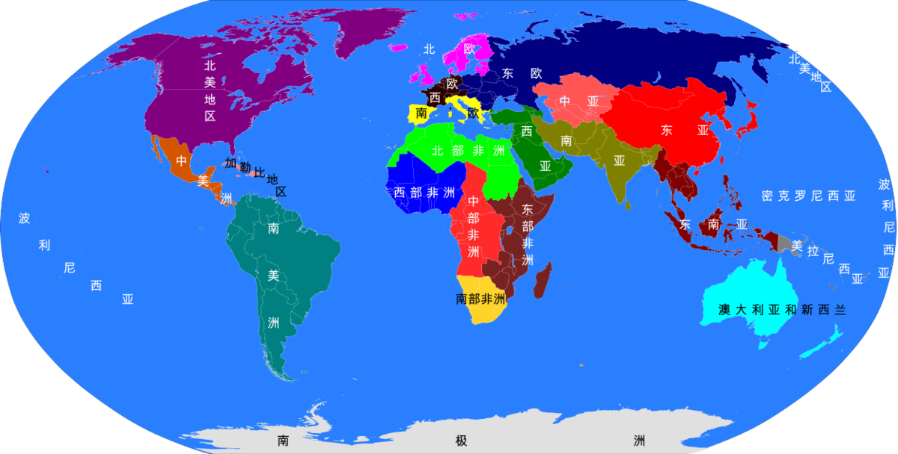
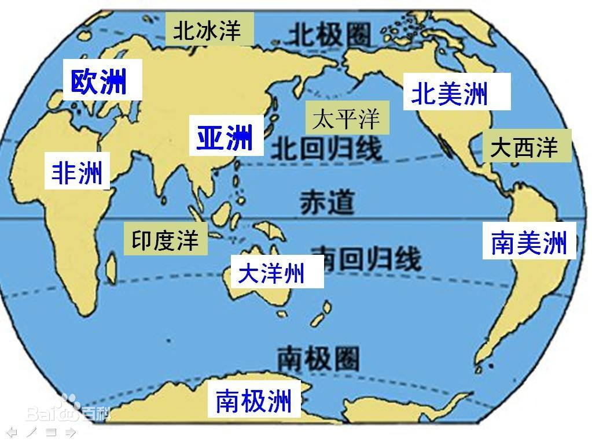

# 世界地理

  <figure>
    
    <figcaption style="font-size: 16px; color: gray">世界各洲</figcaption>
  </figure>
  <figure>
    
    <figcaption style="font-size: 16px; color: gray">世界地理</figcaption>
  </figure>

## 世界地理模板

- [联合国地理区划列表](https://zh.wikipedia.org/wiki/联合国地理区划列表)：各个区域详细情况汇编
- [模板：世界分区](https://zh.wikipedia.org/wiki/Template:世界分区)
- [模板：洲](https://zh.wikipedia.org/wiki/Template:洲)

## 两河流域

**[美索不达米亚](https://zh.wikipedia.org/wiki/美索不達米亞)**，是[古希腊](https://zh.wikipedia.org/wiki/古希腊)对**两河流域**的称谓，两河指的是[幼发拉底河](https://zh.wikipedia.org/wiki/幼发拉底河)和[底格里斯河](https://zh.wikipedia.org/wiki/底格里斯河)。

## 其它

- 七大洲：亚洲、非洲、欧洲、北美洲、南美洲、南极洲、大洋洲。
- 四大洋：太平洋、大西洋、印度洋、北冰洋。