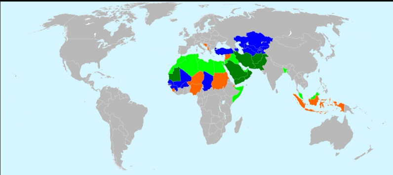
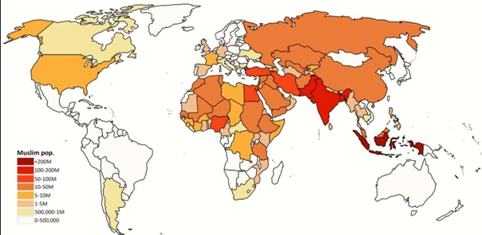

# 亚伯拉罕诸教

在宗教归纳层面上，[犹太教](https://zh.wikipedia.org/wiki/犹太教)、[基督徒](https://zh.wikipedia.org/wiki/基督徒)和[伊斯兰教](https://zh.wikipedia.org/wiki/伊斯兰教)同属于“**[亚伯拉罕诸教](https://zh.wikipedia.org/wiki/亚伯拉罕诸教)**”，共同组成“世界三大一神论宗教”，各方均认同[亚伯拉罕](https://zh.wikipedia.org/wiki/亚伯拉罕)的先知地位，其历史均可追溯至亚伯拉罕时期。

## 区分

- 都信奉“独一真神”，真神创造万物，将来会有审判和复活。

    - 犹太教和基督教称作上帝耶和华，都相信弥赛亚，但是犹太教不相信耶稣就是弥赛亚，也不是先知。
    - 伊斯兰教称为真主安拉，认为耶稣只是先知，穆罕默德是上帝挑选的最后一位先知，即“封印先知”。

- 关于经典

    - 犹太教的经典为《塔纳赫》，不承认《圣经·新约》和《古兰经》。
    - 基督教的经典为《圣经》，承认《塔纳赫》，不承认《古兰经》。
    - 伊斯兰教的经典为《古兰经》，只承认《塔纳赫》的前五卷和《圣经·新约》的部分内容。伊斯兰教相信《圣经》的神圣，但认为《圣经》的内容在历史的进程中已被修改或者失真误解，各种《圣经》的不同处一律要以上帝最后赐予穆罕默德的《古兰经》为准。

- 伊斯兰教比基督教更接近犹太教。

    - 反对把先知神化，彻底地禁绝偶像崇拜，没有对于供奉天使或圣人的仪式，并且禁食猪肉和行割礼，一夫多妻制。

        <table style="text-align: center;">
          <tr>
            <th colspan="2">类别</th>
            <th>犹太教</th>
            <th>基督教</th>
            <th>伊斯兰教</th>
          </tr>
          <tr>
            <td rowspan="3">属性</td>
            <td>神的名字（中译）</td>
            <td colspan="2">耶和华或雅威</td>
            <td>安拉</td>
          </tr>
          <tr>
            <td>独一性</td>
            <td colspan="3">独一真神，创造世界，全知、全能、全善、全在、永恒，将来审判</td>
          </tr>
          <tr>
            <td>三位一体</td>
            <td>否</td>
            <td>是</td>
            <td>否</td>
          </tr>
          <tr>
            <td rowspan="5">工作</td>
            <td>创造与审判</td>
            <td></td>
            <td></td>
            <td></td>
          </tr>
          <tr>
            <td rowspan="3">拣选</td>
            <td>拣选亚伯拉罕</td>
            <td></td>
            <td></td>
          </tr>
          <tr>
            <td colspan="2">
              拣选亚伯拉罕的二儿子 以撒 （亚伯拉罕与其妻撒拉所生，是以色列人的祖先）
            </td>
            <td>拣选亚伯拉罕的大儿子 以实玛利 （亚巴郎与其妾哈加尔所生，是阿拉伯人的祖先）</td>
          </tr>
          <tr>
            <td>拣选亚伯拉罕的孙子 以色列的后裔：以色列人</td>
            <td>拣选一切相信耶稣基督的人</td>
            <td>拣选一切相信安拉的人</td>
          </tr>
          <tr>
            <td>救赎工作</td>
            <td>神拣选以色列人</td>
            <td>耶稣付上赎价，人信耶稣。</td>
            <td>安拉的仁慈，人行善功。</td>
          </tr>
          <tr>
            <td rowspan="2">圣者</td>
            <td>耶稣是谁</td>
            <td>亵渎者</td>
            <td>圣子真神</td>
            <td>先知</td>
          </tr>
          <tr>
            <td>穆罕默德是谁</td>
            <td colspan="2">亵渎者</td>
            <td>最后的先知</td>
          </tr>
          <tr>
            <td rowspan="3">圣书</td>
            <td>希伯来圣经是？</td>
            <td>圣经</td>
            <td>旧约圣经</td>
            <td rowspan="2">受启示的经典已被篡改</td>
          </tr>
          <tr>
            <td>新约圣经是？</td>
            <td>亵渎</td>
            <td>新约圣经，神终极的启示</td>
          </tr>
          <tr>
            <td>古兰经是？</td>
            <td colspan="2">亵渎</td>
            <td>安拉的启示</td>
          </tr>
          <tr>
            <td rowspan="3">总结</td>
            <td>对犹太教看法</td>
            <td>—</td>
            <td>是基督教信仰的前身，但错误理解拣选和律法。</td>
            <td rowspan="2">奉行已被篡改的宗教</td>
          </tr>
          <tr>
            <td>对基督教看法</td>
            <td>是亵渎神</td>
            <td>—</td>
          </tr>
          <tr>
            <td>对伊斯兰教看法</td>
            <td colspan="2">是亵渎神</td>
            <td>—</td>
          </tr>
        </table>

# 犹太教

**[犹太教](https://zh.wikipedia.org/wiki/犹太教)**（Judaism），是在公元前2000年西亚地区的游牧民族[希伯来人](https://zh.wikipedia.org/wiki/希伯来人)中产生、并于公元前1290年由[摩西](https://zh.wikipedia.org/wiki/摩西)创立。

犹太教属于“[亚伯拉罕诸教](https://zh.wikipedia.org/wiki/亚伯拉罕诸教)”，与[基督徒](https://zh.wikipedia.org/wiki/基督教)和[伊斯兰教](https://zh.wikipedia.org/wiki/伊斯兰教)并称为“世界三大一神论宗教”。

犹太教相信奉上帝**[雅威](https://zh.wikipedia.org/wiki/四字神名)**，不承认耶酥是神的儿子，他们相信心中的“[弥赛亚](https://zh.wikipedia.org/wiki/弥赛亚)”（救世主）尚未降临。犹太教的安息日是星期六，神职人员称“拉比”。犹太教是[犹太人](https://zh.wikipedia.org/wiki/猶太人)的信仰、价值观和生活方式。

与世界上其他宗教不一样，犹太教并不主张其他民族为了被救赎而必须接受她的宗教信仰和敬拜方式，不欢迎外族信仰犹太教，不主动到外族人中传教，坚持皈依犹太教者必须通过考验才可以。

## 犹太教经典

### 《塔纳赫》

《**[塔纳赫](https://zh.wikipedia.org/wiki/塔纳赫)**》（英：Bible），又称《希伯来圣经》。成书于“[巴比伦之囚](https://zh.wikipedia.org/wiki/巴比伦之囚)”时期开始直到公元前一世纪约240年的时间，最后在公元100年前后经犹太教拉比正式确立为《塔纳赫》的定本。全书由《[妥拉](https://zh.wikipedia.org/wiki/妥拉)》、《[先知书](https://zh.wikipedia.org/wiki/先知書)》、《[圣录](https://zh.wikipedia.org/wiki/圣录)》三部分组成。共24卷，所以又称“二十四书”。

- 《塔纳赫》为犹太教第一部重要经籍，整理了古代犹太教的历史典籍和律法文献。
- 《塔纳赫》主要内容围绕古代犹太人生活为主，而大部份都是记述犹太人被流放的历史，尤其强调流放的原因乃是犹太人背离了上帝的诫命，结果遭上帝惩罚而流放异地。
- 《塔纳赫》被收纳为基督教《[圣经·旧约](https://zh.wikipedia.org/wiki/旧约圣经)》，两者书卷的次序略有不同，但内容上基本是一样的。
- 《[妥拉](https://zh.wikipedia.org/wiki/妥拉)》，即《[摩西五经](https://zh.wikipedia.org/wiki/摩西五經)》，是《塔纳赫》的前五卷，最晚成书于公元前四世纪初。

### 《塔木德》

《**[塔木德](https://zh.wikipedia.org/wiki/塔木德)**》（英：Talmud Bavli），成书于公元前2世纪至公元5世纪间。全书内容分以下部分：“[密西拿](https://zh.wikipedia.org/wiki/密西拿)（Mishnah）——口传律法”、“[革马拉](https://zh.wikipedia.org/wiki/革馬拉)（Gemara）——口传律法注释”、“[米德拉什](https://zh.wikipedia.org/wiki/米德拉什)（Midrash）——圣经注释”。

- 《塔木德》在犹太教中地位仅次于《塔纳赫》，它对《托拉》及犹太教经文中的“613条诫律”逐一做出了详尽解释。
- 《塔木德》的内容讲述的包涵了人生各个阶段的行为规范，以及人们对人生价值观的养成。

### 《米德拉什》

《**[米德拉什](https://zh.wikipedia.org/wiki/米德拉什)**》（英：Midrash），公元2世纪时已有雏形，6-10世纪全部成书，分为两种：《[哈拉卡](https://zh.wikipedia.org/wiki/哈拉卡)》和《[哈加达](https://zh.wikipedia.org/wiki/哈加达)》。

- 全书按《塔纳赫》各卷的顺序编定，对之进行通俗的解释与阐述，是犹太教的通俗性典籍。犹太拉比们通过“米德拉什”将不同的观念引入犹太教，声称乃揭示早已存在经卷内的观念。
- 《[哈拉卡](https://zh.wikipedia.org/wiki/哈拉卡)（Halachah）》（意为“规则”），讲解经文中的律法、教义、礼仪与行为规范，说明律法如何应用在犹太人现实生活中，具有较高的权威性，文体庄重严谨。
- 《[哈加达](https://zh.wikipedia.org/wiki/哈加达)（Haggadah）》（意为“宣讲”），阐述经文的故事、寓意、逸事、传奇，及奥秘的含义等，亦受尊重，但更有趣味性。

## 犹太教派别

### 正统派

**[犹太教正统派](https://zh.wikipedia.org/wiki/犹太教正统派)**（英：Orthodox Judaism），是[犹太教](https://zh.wikipedia.org/wiki/猶太教)中最大的宗派群体，是犹太教的保守派及传统派系，在[以色列](https://zh.wikipedia.org/wiki/以色列)拥有特殊地位。犹太教正统派内分三个支派，分别是[极端正统派](https://zh.wikipedia.org/wiki/哈雷迪猶太教)（即**哈雷迪犹太教**）、现代正统派和[哈西迪教派](https://zh.wikipedia.org/wiki/哈西迪猶太教)。

### 保守派

**[犹太教保守派](https://zh.wikipedia.org/wiki/犹太教保守派)**（英：Conservative Judaism/ Masorti Judaism），是犹太教中介于[正统派](https://zh.wikipedia.org/wiki/猶太教正統派)和[改革派](https://zh.wikipedia.org/wiki/猶太教改革派)之间的温和派，其前身是德国的[犹太教历史学派](https://zh.wikipedia.org/w/index.php?title=猶太教歷史學派&action=edit&redlink=1)。

19世纪宗教改革期间，一些德国犹太人认为正统派过分强调了的传统，忽视了现实生活的需要；而改革派又过分注重现实，没有给予传统以应有的地位；因而各自走向了极端。于是他们采取调和折中的态度，主张建立起活生生的联系。

### 改革派

**[犹太教改革派](https://zh.wikipedia.org/wiki/犹太教改革派)**（英：Reform Judaism），或称**犹太教自由派**、**犹太教进步派**，为[犹太教](https://zh.wikipedia.org/wiki/猶太教)在众多现代派别中，自认为是最进步的一派。这一派认为信仰须与时并进，并经由自身经验与理论而得，而非从[律法书](https://zh.wikipedia.org/wiki/律法书)而来。他们重视个人操守过于礼仪，因此，其宗教表现高度自主，不存着任何权威。律法为人遵从，并非因它由上帝颁布，乃因它对信仰生活有意义。

- 改革派把犹太教定义为完全和科学、理性和谐共存的伦理一神教，奉行在全世界范围内实现和平、公正和各民族和谐统一的大同主义。他们在改革中废弃了不少中世纪习俗。
- 1960年以前的古典改革派把大同主义和复国主义对立起来，强烈反对犹太复国主义。后古典的改革派改变了立场，成为支持复国主义和以色列国的建设的重要力量。第二次世界大战以前，改革派的中心在德国，战后则转移到了北美。

### 重建派

**[犹太教重建派](https://zh.wikipedia.org/wiki/犹太教重建派)**（英：Reconstructionist Judaism），是一个现代犹太人运动，将犹太教视为一个逐渐发展的文明。

这一教派基于莫德采科普兰的概念发展。原本是[犹太教保守派](https://zh.wikipedia.org/wiki/猶太教保守派)内部的一个流派，自1920年代后期开始发展，并在1955年自保守派分离，创始人摩迪凯·开普兰。

重建派在仪礼上接近保守派，而在理论观点上甚至比改革派还要激进，主张宗教生活的民主化，鼓励和支持以色列国的建设。

## 犹太教历史

- 早在[亚伯拉罕](https://zh.wikipedia.org/wiki/亚伯拉罕)时代，希伯来人就相信他们和上帝之间立了契约，亚伯拉罕的一神崇拜为犹太教奠定了基础。
- 约公元前1290年，[摩西](https://zh.wikipedia.org/wiki/摩西)率领以色列人出埃及到达[西奈山](https://zh.wikipedia.org/wiki/西奈山)，接受上帝赐予的法律，完成《**[摩西十诫](https://zh.wikipedia.org/wiki/摩西十诫)**》作为犹太教基础的法律，人类第一个一神教“**[犹太教](https://zh.wikipedia.org/wiki/犹太教)**”诞生，摩西成为犹太教的实际创始人。
- “[巴比伦之囚](https://zh.wikipedia.org/wiki/巴比伦之囚)”时期开始直到公元前一世纪约240年的时间，《**[塔纳赫](https://zh.wikipedia.org/wiki/塔纳赫)**》各篇章完成，最后在公元100年前后经犹太教拉比正式确立为《塔纳赫》的定本。
- 公元前2世纪至公元5世纪间，完成《**[塔木德](https://zh.wikipedia.org/wiki/塔木德)**》。
- 公元1世纪30年—40年代，[耶稣](https://zh.wikipedia.org/wiki/耶稣)的使徒以耶路撒冷为中心开始传教，建立初期基督教教会。犹太人无法接受耶稣是[弥赛亚](https://zh.wikipedia.org/wiki/弥赛亚)的主要原因是，稣降生后太平盛世并没有到来，犹太人依然过了几千年流离失所的日子。
- 18世纪，德意志帝国犹太教内部率先实行了宗教改革。改革的直接后果是犹太教的分裂。原来统一的传统犹太教逐渐分化出改革派、保守派,以及正统派；
- 在20世纪的美国还从保守派中分化出了重建派。这些不同的宗教派别把犹太人划分成不同的阵营，从而导致了犹太人的分裂。

# 基督教

**[基督宗教](https://zh.wikipedia.org/wiki/基督教)**（英：Christianity），即广义上的**基督教**（包括[天主教](https://zh.wikipedia.org/wiki/天主教會)、[东正教](https://zh.wikipedia.org/wiki/東正教會)、[新教](https://zh.wikipedia.org/wiki/新教)等教派）公元1世纪，发源于[巴勒斯坦地区](https://zh.wikipedia.org/wiki/巴勒斯坦地區)，由[耶稣](https://zh.wikipedia.org/wiki/耶稣)创立。

基督教属于“[亚伯拉罕诸教](https://zh.wikipedia.org/wiki/亚伯拉罕诸教)”，与[犹太教](https://zh.wikipedia.org/wiki/犹太教)和[伊斯兰教](https://zh.wikipedia.org/wiki/伊斯兰教)并称为“世界三大一神论宗教”，与[佛教](https://zh.wikipedia.org/wiki/佛教)和[伊斯兰教](https://zh.wikipedia.org/wiki/伊斯兰教)并称为“[世界三大宗教](https://zh.wikipedia.org/wiki/世界三大宗教)”。基督教信奉上帝[耶和华](https://zh.wikipedia.org/wiki/耶和华)和[耶稣基督](https://zh.wikipedia.org/wiki/耶稣)，先知是耶稣，信徒称“[基督徒](https://zh.wikipedia.org/wiki/基督徒)”，聚集地为教堂，经典为《[圣经](https://zh.wikipedia.org/wiki/圣经)》。基督教的主要教义是“**因信称义**”。

## 基督教经典

《**[圣经](https://zh.wikipedia.org/wiki/圣经)**》（Bible），是基督教的基本经典，由《[旧约](https://zh.wikipedia.org/wiki/旧约圣经)》和《[新约](https://zh.wikipedia.org/wiki/新約聖經)》两大部分构成，有四十余位执笔作者，前后写作时间跨越约1千6百年。《圣经》有至高无上的权威，是基督徒信仰和生活的唯一准则。

- 《**[旧约](https://zh.wikipedia.org/wiki/旧約聖經)**》（英：Old Testament）：是《[圣经](https://zh.wikipedia.org/wiki/圣经)》的前半部分，是从[犹太教](https://zh.wikipedia.org/wiki/犹太教)《[塔纳赫](https://zh.wikipedia.org/wiki/塔纳赫)》传承下来的，两者书卷的次序略有不同，但内容上基本是一样的。
- 《**[新约](https://zh.wikipedia.org/wiki/新約聖經)**》（英：New Testament）：是《**[圣经](https://zh.wikipedia.org/wiki/圣经)**》的后半部分，延续并完成了《[旧约](https://zh.wikipedia.org/wiki/旧约圣经)》的启示，共27卷。

    - 《使徒行传》记载了初代教会到约公元60年的历史。
    - 保罗写了新约圣经27本书中的至少13本书。
    - 二世纪末，已经形成《圣经·新约》的基本形态，到公元393年的大公会议被正式定型。

基督教各派在全书卷数和次序上，也略有不同。

- [新教](https://zh.wikipedia.org/wiki/新教)：多数教派只承认希伯来文原本，因此只有39卷；
- [天主教](https://zh.wikipedia.org/wiki/天主教)：应用《**[七十士译本](https://zh.wikipedia.org/wiki/七十士译本)**》，《[旧约](https://zh.wikipedia.org/wiki/旧约圣经)》额外收录未见于希伯来文本的一些希腊文补篇等7卷希腊文经典（此7卷被[新教](https://zh.wikipedia.org/wiki/新教)称为“**伪经**”），合为46卷。
- [东正教](https://zh.wikipedia.org/wiki/东正教)：《[旧约](https://zh.wikipedia.org/wiki/旧约圣经)》额外收录未见于希伯来文本的一些希腊文补篇等7卷希腊文经典（此7卷被[新教](https://zh.wikipedia.org/wiki/新教)称为“**伪经**”），合为50卷。

现在通行的基督教圣经中文版是“**[圣经和合本](https://zh.wikipedia.org/wiki/圣经和合本)**”，天主教圣经的中文版本通行的是天主教思高圣经学会翻译的“**[圣经思高本](https://zh.wikipedia.org/wiki/圣经思高本)**”（1968年）。

## 基督教派别

[基督教](https://zh.wikipedia.org/wiki/基督教)主要包括：[天主教](https://zh.wikipedia.org/wiki/天主教會)、[东正教](https://zh.wikipedia.org/wiki/東正教會)、[新教](https://zh.wikipedia.org/wiki/新教)三大教派和其他一些较小教派。在中国，因为历史翻译的原因，通常把“**新教**”称为“**基督教**”。

### 天主教

#### 天主教概述

**[天主教](https://zh.wikipedia.org/wiki/天主教)**（英：Catholicism），又称**公教**、**至公教会**、**旧教**，与[东正教](https://zh.wikipedia.org/wiki/東正教)、[新教](https://zh.wikipedia.org/wiki/新教)并列为[基督教](https://zh.wikipedia.org/wiki/基督教)三大分支。天主教会以[罗马教区](https://zh.wikipedia.org/wiki/天主教羅馬教區)[主教](https://zh.wikipedia.org/wiki/主教)——[教宗](https://zh.wikipedia.org/wiki/教宗)为领袖。

天主教《[圣经](https://zh.wikipedia.org/wiki/圣经)》的中文版本通行的是天主教思高圣经学会翻译的“**[圣经思高本](https://zh.wikipedia.org/wiki/圣经思高本)**”（1968年），应用《**[七十士译本](https://zh.wikipedia.org/wiki/七十士译本)**》，额外收录未见于希伯来文本的一些希腊文补篇等7卷希腊文经典（此7卷被[新教](https://zh.wikipedia.org/wiki/新教)称为“**伪经**”），合为46卷。

天主教神职人员实行独身制，各修会形成其隐修制度，并且有一整套等级分明的教阶体制，教导权主要于教宗与大公会议。

#### 天主教历史

- 西罗马帝国于476年被推翻，基督教进入漫长的中世纪发展阶段，经历了教权与王权之争。
- 1054年东西两派教会正式分裂，西派以罗马教廷为中心，自称“公教”（即天主教）。
- 【**十字军东征**】1096至1291年近二百年时间里，天主教会为遏制伊斯兰教的影响，在夺回“圣地”的口号下，先后组织向东地中海沿岸各国的8次“十字军东征”。
- 13世纪，天主教达到教会权力的鼎盛，形成以罗马为中心、跨越国界的西欧天主教世界。
- 1583年利玛窦将天主教传入中国。
- 中国天主教目前由官方控制的中国天主教爱国会及中国天主教主教团管理，即所谓的“中国天主教一会一团”。目前，梵蒂冈和中华人民共和国建交的一个主要的障碍就是由谁任命主教的问题。

### 东正教

#### 东正教概述

**[东正教](https://zh.wikipedia.org/wiki/东正教)**（英：Eastern Orthodox Church），又称**正教**、**希腊正教**，与[天主教](https://zh.wikipedia.org/wiki/天主教)、[新教](https://zh.wikipedia.org/wiki/新教)并列为[基督教](https://zh.wikipedia.org/wiki/基督教)三大分支。

东正教组织上实行牧首制，东正教会严正规定，神职人员不得用任何方式宣扬其政治立场。

东正教的教义是由圣经、圣传两部分组成。《[旧约](https://zh.wikipedia.org/wiki/旧约圣经)》额外收录未见于希伯来文本的一些希腊文补篇等7卷希腊文经典（此7卷被[新教](https://zh.wikipedia.org/wiki/新教)称为“**伪经**”），合为50卷。

#### 东正教历史

- 4世纪，君士坦丁堡成为罗马帝国的国家教会首都。
- 5世纪，因单性论被开除的近东边缘教会形成东方人派正教会。
- 1054年，东西两派教会正式分裂，东派以君士坦丁堡为中心，自称正教会（即东正教）。
- 15世纪，东罗马帝国因君士坦丁堡战役败亡。希腊正教会与俄罗斯正教会为首的东正教会体系确立。俄罗斯也成为至今东正教会中心，也是梵蒂冈后的基督徒第二大单一政治及文化族群。
- 东正教入华时间始于1665年，沙俄武装人员侵占中国黑龙江左岸的雅克萨地区，在该地建基督复活教堂。东正教至今仍没有得到中国政府的承认，目前在中国暂归入中国基督教，无独立宗教地位，但官方默许“中国正教会”进行活动。

### 新教

**[新教](https://zh.wikipedia.org/wiki/新教)**（Protestantism），即**基督新教**，与[天主教](https://zh.wikipedia.org/wiki/天主教)、[东正教](https://zh.wikipedia.org/wiki/東正教)并列为[基督教](https://zh.wikipedia.org/wiki/基督教)三大分支。在中国，因为历史翻译的原因，通常把“**新教**”称为**基督教**。

新教在教义上强调“因信称义”、“信徒皆祭司”，在行政上没有单一组织架构或领导，以《[圣经](https://zh.wikipedia.org/wiki/圣经)》作为最高权威和唯一依据，亦因此否定以教宗（即天主教教皇制）为首的圣统制、拒绝天主教教条中关于圣传与圣经具同等地位的教导。新教多数教派只承认希伯来文原本，因此只有39卷。

16世纪时，随着[赎罪券](https://zh.wikipedia.org/wiki/大赦_(基督教))的有偿发行，西欧又爆发了反对教宗权威的宗教改革运动，[马丁·路德](https://zh.wikipedia.org/wiki/馬丁·路德)等神学家脱离[天主教](https://zh.wikipedia.org/wiki/天主教)而自立许多教义相近的教会，这些教会即为后世所统称的“**新教**”。因对罗马公教（即天主教）抱抗议态度，不承认罗马主教的教皇地位，故西方一般称基督新教为“**抗罗宗**”或“**抗议宗**”。这词源出德文“Protestanten”（抗议者）。

## 基督教历史

- 【**基督教诞生**】公元1世纪30年—40年代，耶稣的使徒以耶路撒冷为中心开始传教，建立初期基督教教会，基督教最初为犹太人的一个教派，基督教不强调行律法，而强调耶稣救赎的恩典，后来二者渐渐分道扬镳，被他们自己和别人都看作是两个不再相同的信仰。
- 基督信仰源自犹太教对独一真神的信仰，也承袭其历史信仰背景。犹太人无法接受耶稣是弥赛亚的主要原因是，稣降生后太平盛世并没有到来，犹太人依然过了几千年流离失所的日子。
- 【**传播**】40年代后期，随着[保罗](https://zh.wikipedia.org/wiki/保罗_(使徒))等人向非犹太人的传教，教会相续在叙利亚、埃及、罗马、君士坦丁堡等地建立教会，在思想信仰上和组织结构上逐步走向完备。
- 【**圣经·新约**】二世纪末，已经形成《圣经·新约》的基本形态，到公元393年的大公会议被正式定型。
- 【**罗马国教**】

    - 早期基督徒曾受到罗马帝国的10次大迫害。
    - 公元313年，罗马皇帝[君士坦丁一世](https://zh.wikipedia.org/wiki/君士坦丁大帝)发布《[米兰敕令](https://zh.wikipedia.org/wiki/米兰敕令_(君士坦丁))》，基督教在[罗马帝国](https://zh.wikipedia.org/wiki/罗马帝国)合法化。
    - 公元380年，罗马皇帝[狄奥多西一世](https://zh.wikipedia.org/wiki/狄奧多西一世)发布《[萨洛尼卡敕令](https://zh.wikipedia.org/wiki/薩洛尼卡敕令)》，将基督教定为国教。

- 【**基督教分裂**】公元395年，罗马帝国分裂为东西两部。西派教会以罗马为中心形成**天主教**传统，东派教会以君士坦丁堡为中心，形成**正教**传统。1054年，[东西教会大分裂](https://zh.wikipedia.org/wiki/东西教会大分裂)，东西两派教会正式分裂。

    - 【**[天主教](https://zh.wikipedia.org/wiki/)**】西派以[罗马](https://zh.wikipedia.org/wiki/罗马)教廷为中心，自称“公教”（即天主教）。
    - 【**[东正教](https://zh.wikipedia.org/wiki/东正教)**】东派以[君士坦丁堡](https://zh.wikipedia.org/wiki/君士坦丁堡)为中心，自称“正教会”（即东正教）。

- 【**新教诞生**】16世纪初，欧洲爆发[宗教改革](https://zh.wikipedia.org/wiki/宗教改革)。[马丁·路德](https://zh.wikipedia.org/wiki/馬丁·路德)率领众人脱离[天主教](https://zh.wikipedia.org/wiki/)，[新教](https://zh.wikipedia.org/wiki/新教)诞生。
- 【**信任危机**】在17世纪初，欧洲启蒙时代不可知论、泛神论、无神论的兴起以及法国大革命蔓延西欧大陆，越来越多的人退出教会，整个基督教社会都陷入信任危机。
- 1948年，**新教**和**东正教**各派正式成立**[世界基督教协会](https://zh.wikipedia.org/wiki/普世教会协会)**（**即普世教会协会**）。
- 目前，粗估统计全球超过三分之一的人口信仰基督教，是当今世界信仰人口最多的宗教，三大宗派中又以天主教的信徒占约半数最多。

## 基督教传入中国

- 唐贞观九年（公元635年），基督教[聂斯脱里派](https://zh.wikipedia.org/wiki/東方教會)曾于传入中国，称“[景教](https://zh.wikipedia.org/wiki/景教)”。会昌五年（公元845年）因朝廷下诏禁绝佛教而被波及，在中原地区中断传播。
- 随后元、明、清朝代，都有不同基督教教派传入中国。
- 1583年[利玛窦](https://zh.wikipedia.org/wiki/利玛窦)将[天主教](https://zh.wikipedia.org/wiki/天主教)传入中国。
- 1807年[马礼逊](https://zh.wikipedia.org/wiki/马礼逊)将[新教](https://zh.wikipedia.org/wiki/新教)传入中国。在中国，因为历史翻译的原因，通常把“新教”称为“基督教”。
- 1843年，[洪秀全](https://zh.wikipedia.org/wiki/洪秀全)借助基督教的教义，自称是耶稣的弟弟，建立“[拜上帝会](https://zh.wikipedia.org/wiki/拜上帝会)”，后来建立[太平天国](https://zh.wikipedia.org/wiki/太平天國)。
- 20世纪初，中国教徒自开始要求实行中国教会自立。
- 1919年[五四运动](https://zh.wikipedia.org/wiki/五四运动)后，天主教在中国推行“中国化”措施，大量起用中国籍神职人员。
- 1922年，新教各派在上海召开全国基督教大会，成立“[中华全国基督教协进会](https://zh.wikipedia.org/wiki/中华全国基督教协进会)”。
- 1949年后，中国教会逐渐割断与外国传教修会及差会的联系，进入其自立发展的时期。

## 基督教相关

- 圣诞节：12月25日。原为罗马神话中太阳神阿波罗的生日；罗马帝国以基督宗教为国教后将此日改为纪念耶稣基督诞辰，但耶稣基督降生的真实日期无人知道。 
- 君士坦丁堡——直到1453年拜占庭灭亡为止，一直是东正教的中心。
- 梵蒂冈——全球天主教教会的中心，历任教宗的办公地点。 
- 世界其他地方著名教堂 巴黎圣母院（法国巴黎），圣彼得大教堂（梵蒂冈）圣保罗大教堂（英国伦敦），圣约翰大教堂（美国纽约）。

## 耶稣

### 耶稣概述

**[耶稣](https://zh.wikipedia.org/wiki/耶稣)**（英：Jesus Christ）（前6年 / 前4年—30年 / 33年），也称**耶稣基督**，伊斯兰教译为**[尔撒](https://zh.wikipedia.org/wiki/尔撒)**，摩尼教译为**[夷数](https://zh.wikipedia.org/wiki/夷數)**。基督徒相信，耶稣是[圣子](https://zh.wikipedia.org/wiki/聖子)[降生为人](https://zh.wikipedia.org/wiki/道成肉身)、旧约所预言的[弥赛亚](https://zh.wikipedia.org/wiki/弥赛亚)（即“基督”），是为[大卫后裔](https://zh.wikipedia.org/wiki/大衛後裔)。

**关于耶稣的资料**：

- [耶稣诞生](https://zh.wikipedia.org/wiki/耶稣诞生)
- [耶稣的历史性](https://zh.wikipedia.org/wiki/耶稣的历史性)

**耶稣生平**：

- 约公元前4年，耶稣诞生在罗马帝国犹太地区。
- 耶稣三十岁开始传道，自称神的儿子，宣扬爱神和爱人的福音，宣称信他的人会永远不死。
- 传道三年以后（约公元30年），耶稣被犹太祭司控告，被罗马官府判处死刑，被钉死在十字架上，死后第三日复活，显现给祂的门徒看有四十天之久，然后升天，坐在父神的右边。

### 耶稣的谱系

#### 《马太福音1:1-17》

- 可能是约瑟的谱系（但有遗漏）。所罗巴伯以后无法考证血缘关系。
- **乌西雅之前缺少四代王三代人**：

    - 亚哈谢：约兰之子
    - 亚她利雅：亚哈谢之母
    - 约阿施：亚哈谢之子
    - 亚玛谢：约阿施之子

- **约雅斤之前缺少两代王一代人**：

    - 约哈斯：约西亚之子
    - 约雅敬：约西亚之子

- 所罗巴伯

    - 可能是毗大雅的儿子，撒拉铁的侄子。可能由于利未婚的原因。
    - 但一定是约雅斤的孙子。

- 从[约雅斤](https://zh.wikipedia.org/wiki/约雅斤)（前615年或前605年—前562年）到约瑟（约前30年），约600年时间，共记载13代人，每代人约45年，不符合常理（25年），所以个人认为，《马太福音1:1-17》在约雅斤以后，也存在遗漏的情况。

#### 《路加福音3:23-38》

- 可能是玛利亚的谱系。

#### 马太和路加之间的差异

[耶稣的谱系](https://zh.wikipedia.org/wiki/耶稣的谱系)是耶稣经由其俗世的父母（[玛利亚](https://zh.wikipedia.org/wiki/馬利亞_(耶穌的母親))和[约瑟](https://zh.wikipedia.org/wiki/聖若瑟)）两个的谱系，在《[圣经](https://zh.wikipedia.org/wiki/圣经)》中记载于2个段落：《马太福音1:1-17》和《路加福音3:23-38》。这2份耶稣的谱系在亚伯拉罕和大卫之间的部分是一致的，在大卫以后的部分则有极大的差异。关于这个差异，有两个主流说法。

- 其一为[马太](https://zh.wikipedia.org/wiki/馬太)所述为[约瑟](https://zh.wikipedia.org/wiki/聖若瑟)的谱系，[路加](https://zh.wikipedia.org/wiki/路加)所述为[玛利亚](https://zh.wikipedia.org/wiki/馬利亞_(耶穌的母親))的谱系。
- 另一说法为[马太](https://zh.wikipedia.org/wiki/馬太)所述为[约瑟](https://zh.wikipedia.org/wiki/聖若瑟)的生父雅各的谱系，[路加](https://zh.wikipedia.org/wiki/路加)所述为[约瑟](https://zh.wikipedia.org/wiki/聖若瑟)的继承父希里的谱系，因出于所罗门谱系的马但，生了雅各。马但死后，属拿单谱系的玛塔，娶了马但的寡妇，并生了希里。因此，希里和雅各是同母的兄弟。希里无子而死，雅各为他兄弟立后生了约瑟。约瑟根据血源是属雅各，但照着法律，又是属于希里。因此约瑟是他们二者的儿子。

犹太资料《耶路撒冷塔木德》承认《路加福音3:23-38》是玛利亚的家谱，称她为希里的女儿（哈吉雅书 2：4）。

#### 所罗巴伯

撒拉铁的侄子（毘大雅的儿子）所罗巴伯算为撒拉铁的后嗣，这可能是按照申命记的条例而实行[夫兄弟婚](https://zh.wikipedia.org/wiki/夫兄弟婚 "利未婚")的结果。

- 《马太福音1:12》：“迁徙到巴比伦以后，耶哥尼雅生撒拉铁，撒拉铁生所罗巴伯，”；
- 《历代志上3:17-19》：“耶哥尼雅…的儿子是撒拉铁、…毘大雅，…。毘大雅的儿子是所罗巴伯...”

# 伊斯兰教

**[伊斯兰教](https://zh.wikipedia.org/wiki/伊斯兰教)**（英：Islamism），中国旧称**大食法**、**大食教**、**天方教**、**清真教**、**回教**、**天方教**等，由[穆罕默德](https://zh.wikipedia.org/wiki/穆罕默德)于公元610年创立。

伊斯兰教属于“[亚伯拉罕诸教](https://zh.wikipedia.org/wiki/亚伯拉罕诸教)”，与[犹太教](https://zh.wikipedia.org/wiki/犹太教)和[基督教](https://zh.wikipedia.org/wiki/基督教)并称为“世界三大一神论宗教”，与[佛教](https://zh.wikipedia.org/wiki/佛教)和[基督教](https://zh.wikipedia.org/wiki/基督教)并称为“[世界三大宗教](https://zh.wikipedia.org/wiki/世界三大宗教)”。伊斯兰教信奉[真主安拉](https://zh.wikipedia.org/wiki/安拉)，先知是[穆罕默德](https://zh.wikipedia.org/wiki/穆罕默德)，教徒称“[穆斯林](https://zh.wikipedia.org/wiki/穆斯林)”，聚集地为清真寺，经典为《[古兰经](https://zh.wikipedia.org/wiki/古蘭經)》。伊斯兰教的主要教义是“**信真主，行善功**”。

“伊斯兰”这一名称来自《古兰经》，源自闪语字根S-L-M，意为“顺从（造物主）”；“穆斯林”意为“顺从者”、“实现和平者”。

## 伊斯兰教经典

《**[古兰经](https://zh.wikipedia.org/wiki/古蘭經)**》（英：Koran），是[伊斯兰教](https://zh.wikipedia.org/wiki/伊斯兰教)中最重要的经典，《古兰经》的篇章被称为“[苏拉](https://zh.wikipedia.org/wiki/蘇拉)”，节句则被称为“[阿亚](https://zh.wikipedia.org/wiki/阿亞)”。

伊斯兰教以《古兰经》和圣训为教导，《古兰经》被穆斯林视为造物主安拉命天使给其使者逐字逐句的启示，而圣训为造物主所差遣的最后一位先知穆罕默德的言行录（由同伴们转述收集）。

《古兰经》全部为穆罕默德口述，宰德在公元633年前后完成了整理工作，并于公元653年重新修订，制定由官方公布的定本，共30卷、114章、6236节，流传至今，只字未改。

《古兰经》的内容与犹太教《旧约》及基督教《新约》经典记载的主要故事有相同之处， 伊斯兰教只承认《塔纳赫》的前五卷和《圣经·新约》的部分内容。伊斯兰教相信《圣经》的神圣，但认为《圣经》的内容在历史的进程中已被修改或者失真误解，各种《圣经》的不同处一律要以上帝最后赐予穆罕默德的《古兰经》为准。

## 伊斯兰教派别

伊斯兰教主要教派包括：逊尼派、什叶派及其它教派，在中国信仰的各派基本都属逊尼派。两大教派最大分歧是对继承人合法性的认知不同。逊尼派认为哈里发应该选贤与能由最合资格的人出任，而不是世袭。他们强调穆斯林社团的历史传统，重视《古兰经》及圣训的宗教权威。

### 逊尼派

**[逊尼派](https://zh.wikipedia.org/wiki/遜尼派)**（英：Sunni），全称“逊奈与大众派”，是[伊斯兰教](https://zh.wikipedia.org/wiki/伊斯蘭教)的多数派，占全球[穆斯林](https://zh.wikipedia.org/wiki/穆斯林)的85－90%。逊尼派认为哈里发应该选贤与能由最合资格的人出任，而不是世袭。他们强调穆斯林社团的历史传统，重视《古兰经》及圣训的宗教权威。

- 632年，先知穆罕默德逝世以后，穆罕默德的岳父[阿布·伯克尔](https://zh.wikipedia.org/wiki/阿布·伯克尔)代表穆罕默德本人宗教遗产的南部信众，赢得内部斗争胜利，出任第一任哈里发，逐渐形成“[逊尼派](https://zh.wikipedia.org/wiki/遜尼派)”，直到10世纪，采取“逊尼”的名称，逊尼派才正式形成。
- 源于库特卜的伊斯兰恐怖主义亦出自逊尼派。
- “苏非主义”是伊斯兰教的神秘主义，属逊尼派。在阿拉伯语里意为“纯粹”。
- 逊尼派曾建立[倭马亚王朝](https://zh.wikipedia.org/wiki/倭马亚王朝)（公元661年—750年）、[阿拔斯王朝](https://zh.wikipedia.org/wiki/阿拔斯王朝)（公元750年—1258年）、[奥斯曼帝国](https://zh.wikipedia.org/wiki/奥斯曼帝国)（公元1298年—1922年）、[塞尔柱王朝](https://zh.wikipedia.org/wiki/塞尔柱王朝)（公元1055年—1157年）、埃及的[阿尤布王朝](https://zh.wikipedia.org/wiki/阿尤布王朝)（公元1171年—1250年）、[马穆鲁克王朝](https://zh.wikipedia.org/wiki/马穆鲁克王朝)（公元1250年—1517年）以及现代的逊尼派国家。
- 目前，逊尼派的武装组织有：

    - 阿富汗本拉登的“[基地组织](https://zh.wikipedia.org/wiki/基地组织)”、阿富汗的“[塔利班](https://zh.wikipedia.org/wiki/塔利班)”、伊拉克的[伊斯兰国](https://zh.wikipedia.org/wiki/伊斯兰国)（ISIS）等。
    - 巴勒斯坦的[哈马斯](https://zh.wikipedia.org/wiki/哈马斯)和[法塔赫](https://zh.wikipedia.org/wiki/法塔赫)。

- 目前，[沙特阿拉伯](https://zh.wikipedia.org/wiki/沙特阿拉伯)是中东地区最大的由逊尼派掌权的国家。
- 多数情况，美国都支持逊尼派。

### 什叶派

**[什叶派](https://zh.wikipedia.org/wiki/什叶派)**（英：Shi'ites），又称十叶派、阿里派、世袭派，是[伊斯兰教](https://zh.wikipedia.org/wiki/伊斯蘭教)第二大教派，与[逊尼派](https://zh.wikipedia.org/wiki/遜尼派)并称为伊斯兰教两大主要教派。什叶派认为只有穆罕默德的家属后代阿里、哈桑、侯赛因等人有权任哈里发，并尊奉阿里与其后代为“[伊玛目](https://zh.wikipedia.org/wiki/伊玛目)”，且认为末代伊玛目已隐遁，将以“[马赫迪](https://zh.wikipedia.org/wiki/马赫迪)”（救世主）身份再现，其他的哈里发都是篡权者。

什叶派一般不承认“公议”，他们认为公议不一定正确，而伊玛目的判断才是最可靠的立法依据。传系上，主张伊玛目位在侯赛因之后，应由他的嫡传后裔继承并由前任伊玛目指定方为合法。

- 632年，先知穆罕默德逝世以后，穆罕默德的堂弟兼女婿[阿里](https://zh.wikipedia.org/wiki/阿里·本·阿比·塔利卜)代表两河流域阿拉伯部落长老和波斯商人，在内部斗争中失败。后来在第三任哈里发[奥斯曼](https://zh.wikipedia.org/wiki/奥斯曼·本·阿凡)遇刺后，被拥为第四任哈里发，逐渐形成“什叶派”。
- 什叶派是伊斯兰教第二大的宗派，占穆斯林总数的10%—20%，什叶派穆斯林主要分布在伊拉克、伊朗、巴基斯坦、印度、阿塞拜疆及北非等地，但巴基斯坦、印度、北非的什叶派则比例极低。
- 什叶派主要可以分为三派：[十二伊玛目派](https://zh.wikipedia.org/wiki/十二伊玛目派)、[伊斯玛仪派](https://zh.wikipedia.org/wiki/伊斯玛仪派)及[宰德派](https://zh.wikipedia.org/wiki/宰德派)等。

    - 各派起初的[伊玛目](https://zh.wikipedia.org/wiki/伊玛目)都是[阿里](https://zh.wikipedia.org/wiki/阿里·本·阿比·塔利卜)的后代。
    - 伊斯玛仪派后归入十二伊玛目派。
    - 目前最主要的是十二伊玛目派，2012年估计什叶派中有85%属于十二伊玛目派，该派在伊朗的发展中历久不衰。
    - 现代已经成为世界性宗教的[巴哈伊教](https://zh.wikipedia.org/wiki/巴哈伊信仰)，早先也出自什叶派一支。

- 目前，伊朗、伊拉克和叙利亚，是由什叶派掌权的国家。
- 目前，什叶派的武装组织有黎巴嫩的“[真主党](https://zh.wikipedia.org/wiki/真主党)”、也门的“[胡塞武装](https://zh.wikipedia.org/wiki/胡塞武装)”等。
- 多数情况，美国都打击什叶派。

## 伊斯兰教历史

- 【**创立背景**】6世纪初，在[拜占庭帝国](https://zh.wikipedia.org/wiki/阿拉伯半岛)和[波斯帝国](https://zh.wikipedia.org/wiki/阿拉伯半岛)控制下的[阿拉伯半岛](https://zh.wikipedia.org/wiki/阿拉伯半岛)，一神派的“[哈尼夫思想](https://zh.wikipedia.org/wiki/哈尼夫思想)”逐渐成为伊斯兰教思想的先驱和中介。
- 【**伊斯兰教诞生**】公元610年，40岁的[穆罕默德](https://zh.wikipedia.org/wiki/穆罕默德)经天使[加百列](https://zh.wikipedia.org/wiki/加百列)（贾布里勒）传达的天启，“**受命为圣**”，在[麦加](https://zh.wikipedia.org/wiki/麦加)创立“**伊斯兰教**”。
- 【**夜行登霄**】公元621年7月27日，穆罕默德在耶路撒冷“**夜行登霄**”。
- 【**第一个政权**】公元612年—622年9月，穆罕默德公开向麦加普通群众传教，教义触动了贵族和其他教会，遭到反对和迫害，使伊斯兰教在麦加难以立足。随后，穆罕默德同穆斯林迁徙到[麦地那](https://zh.wikipedia.org/wiki/麦地那)，制定《麦地那宪章》，统一了麦地那，建立了以“[乌玛](https://zh.wikipedia.org/wiki/乌玛)”为形式的政教合一的政权和武装，伊斯兰教第一个政权诞生，穆罕默德成为麦地那最高领袖。
- 【**克尔白**】公元630年，穆罕默德逼降[麦加](https://zh.wikipedia.org/wiki/麦加)，改[克尔白](https://zh.wikipedia.org/wiki/克尔白)殿为清真寺，宣布克尔白为禁地。从此，麦加[克尔白](https://zh.wikipedia.org/wiki/克尔白)成为世界穆斯林礼拜的朝向和朝觐的中心。
- 【**半岛统一**】公元631年末，[阿拉伯半岛](https://zh.wikipedia.org/wiki/阿拉伯半岛)各部落相继归信伊斯兰教，承认穆罕默德的领袖地位，基本上实现了阿拉伯半岛的政治统一。
- 【**古兰经**】宰德在公元633年前后完成了《[古兰经](https://zh.wikipedia.org/wiki/古蘭經)》的整理工作，并于公元653年重新修订，制定由官方公布的定本。
- 【**分裂**】

    - 随着穆罕默德逝世，穆斯林内部曾在由谁担任“[哈里发](https://zh.wikipedia.org/wiki/哈里发)”（继任人）的问题上发生分歧。后经协商，先后推选[艾卜·伯克尔](https://zh.wikipedia.org/wiki/)、[欧麦尔](https://zh.wikipedia.org/wiki/欧麦尔·本·赫塔卜)和[奥斯曼](https://zh.wikipedia.org/wiki/奥斯曼·本·阿凡)为第一、二、三任哈里发。
    - 公元656年[奥斯曼](https://zh.wikipedia.org/wiki/奥斯曼·本·阿凡)被刺，[阿里](https://zh.wikipedia.org/wiki/阿里·本·阿比·塔利卜)继任第四任哈里发。公元661年，阿里被刺，[穆阿维叶](https://zh.wikipedia.org/wiki/穆阿维叶一世)自立为哈里发，建立了[倭马亚王朝](https://zh.wikipedia.org/wiki/倭马亚王朝)。至此，伊斯兰教正式分裂为“**逊尼派**”和“**什叶派**”。

- 【**开拓时期**】 “[四大哈里发时期](https://zh.wikipedia.org/wiki/正统哈里发时期)”、“[倭马亚王朝](https://zh.wikipedia.org/wiki/倭马亚王朝)（661年—750年）”和“[阿拔斯王朝](https://zh.wikipedia.org/wiki/阿拔斯王朝)（750年—1258年）”时期，随着统一的阿拉伯国家的对外征服，进入“伊斯兰教的开拓时期”，[阿拉伯帝国](https://zh.wikipedia.org/wiki/阿拉伯帝国)地跨亚、非、欧三大洲。

    - 穆斯林的经贸开拓也使伊斯兰教在周边地区造成很大影响。
    - 在691年，阿拉伯哈里发[阿卜杜勒-马利克](https://zh.wikipedia.org/wiki/阿卜杜勒-马利克)在登霄石，即[圣殿山](https://zh.wikipedia.org/wiki/圣殿山)圣殿的原址上建造[圆顶清真寺](https://zh.wikipedia.org/wiki/圆顶清真寺)。三个世纪后他们又在这里建造阿克萨清真寺。

- 【**奥斯曼帝国时期**】中世纪晚期，随着[奥斯曼帝国](https://zh.wikipedia.org/wiki/奥斯曼帝国)版图不断扩张，进入“伊斯兰教第三次大传播的时期”。
- 【**后续发展**】18世纪中叶以后，西方殖民主义者相继侵入伊斯兰世界，许多伊斯兰国家逐步沦为殖民地和半殖民地。二战后，各伊斯兰国家相继独立，大致形成当今伊斯兰世界的格局。
- 截至2010年，全球约有16亿穆斯林，占23.4%全球人口，在信徒人数上，伊斯兰教是世界第二大宗教。穆斯林最多的国家是印度尼西亚，这里居住著全球穆斯林总数的15%。

## 伊斯兰教传入中国

- 公元651年（唐朝永徽二年）从阿拉伯传入中国的泉州、广州等地。
- 1953年5月11日，[中国伊斯兰教协会](https://zh.wikipedia.org/wiki/中国伊斯兰教协会)在北京成立。
- 截至2019年4月，中国有2000多万穆斯林，3万5千多座清真寺。

## 伊斯兰教相关

- 伊斯兰教三大圣城

    - **[麦加](https://zh.wikipedia.org/wiki/)**：穆罕默德诞生地，伊斯兰教诞生地，伊斯兰教第一圣地。
    - **[麦地那](https://zh.wikipedia.org/wiki/)**：意为“先知之城”，是穆斯林第一个首都，伊斯兰教第二圣地。
    - **[耶路撒冷](https://zh.wikipedia.org/wiki/耶路撒冷)**：穆罕默德“夜行登霄”之城，伊斯兰教第三圣地。

- 【**伊斯兰教五大信仰纲领**】念诵清真言（即作证言）、力行拜功（即做礼拜祈祷）、封斋、完纳天课、朝觐。
- 著作：《古兰经》，《一千零一夜》等。
- 【**礼拜**】穆斯林每天必须礼拜五次，伊斯兰教的礼拜称为萨拉赫或萨拉特，每次礼拜都面向麦加的克尔白进行。
- 【**朝觐**】朝觐是在伊斯兰历都尔黑哲月（伊斯兰历第十二个月）在麦加进行的宗教活动。任何体格健全有能力的穆斯林在一生里至少须到麦加朝觐一次。曾经去过朝觐的男穆斯林称为哈吉，女穆斯林称为哈佳，在穆斯林世界里倍受尊重。
- 【**饮食**】禁止食用及饮用猪肉制品、血、腐肉及酒。
- 【**婚姻**】只要觉得能够平等地对待每一位妻子，穆斯林男子可以拥有多达四位妻子。相反，穆斯林女子只可以有一名丈夫。二十世纪伊始，穆斯林社会改革者反对这些诸如一夫多妻制的习俗。
- 【**政治**】

    - 《古兰经》甚少提及政府，它的语调却影响到伊斯兰教的政治概念，特别是一些政治思想是源自乌玛（穆斯林社群）的概念。
    - 穆斯林世界在接触到西方的世俗理想后有不同的走向。土耳其在穆斯塔法·凯末尔·阿塔图尔克的改革后成为了世俗国家。与此相反，1979年的伊朗伊斯兰革命使伊朗的世俗政权被鲁霍拉·穆萨维·霍梅尼领导的神权国家伊斯兰共和国取代。

## 穆罕默德

**[穆罕默德](https://zh.wikipedia.org/wiki/穆罕默德)**（英：Mohammed）（约570年—632年6月8日），全名穆罕默德·本·阿卜杜拉·本·阿卜杜勒·穆塔利·本·哈希姆，含意为：受到善良人们高度赞扬的真主的使者和先知。

约公元570年，穆罕默德生于麦加城。

公元632年6月8日穆罕默德在麦地那病逝。

## 伊斯兰国家

伊斯兰国家指多数居民信奉伊斯兰教的国家和地区，共计57个国家和2个地区（西撒哈拉和科索沃）。

伊斯兰国家不一定是阿拉伯国家，也包括伊朗、巴基斯坦、孟加拉国、阿富汗、马来西亚这样的其他民族国家。

  <figure>
    
    <figcaption style="font-size: 16px; color: gray">穆斯林国家分布图</figcaption>
  </figure>
  <figure>
    
    <figcaption style="font-size: 16px; color: gray">世界各国穆斯林数量分布</figcaption>
  </figure>

## 伊斯兰武装组织

### 基地组织

**[基地组织](https://zh.wikipedia.org/wiki/基地组织)**（阿拉伯语，意为“基地”），也称“**盖达组织**”，属[伊斯兰教](https://zh.wikipedia.org/wiki/伊斯兰教)[逊尼派](https://zh.wikipedia.org/wiki/逊尼派)，是[奥萨马·本拉登](https://zh.wikipedia.org/wiki/奧薩瑪·賓拉登)在1988年成立的[伊斯兰](https://zh.wikipedia.org/wiki/伊斯蘭)[圣战](https://zh.wikipedia.org/wiki/吉哈德)[武装组织](https://zh.wikipedia.org/wiki/武装力量)，因被指策划了多宗主要针对[美国](https://zh.wikipedia.org/wiki/美國)的恐怖袭击（如[9·11事件](https://zh.wikipedia.org/wiki/九一一袭击事件)），被[联合国安理会](https://zh.wikipedia.org/wiki/聯合國安理會)列为[世界恐怖组织](https://zh.wikipedia.org/wiki/被认定的恐怖组织列表)之一。

基地组织成立之初，其目的是为了训练和指挥与入侵阿富汗的苏联军队战斗的阿富汗义勇军，但是从苏军撤退后的1991年前后开始，该组织将目标转为打倒美国和伊斯兰世界的“腐败政权”。

其最为知名的领导人[奥萨马·本拉登](https://zh.wikipedia.org/wiki/奧薩瑪·賓拉登)于美国东部时间夏令时2011年5月1日周日下午04:00，在美国军队于巴基斯坦阿伯塔巴德的行动中被击毙。

### 塔利班

**[塔利班](https://zh.wikipedia.org/wiki/塔利班)**（英：Taliban，意为“伊斯兰教的学生”），属[伊斯兰教](https://zh.wikipedia.org/wiki/伊斯兰教)[逊尼派](https://zh.wikipedia.org/wiki/逊尼派)，是发源于[阿富汗](https://zh.wikipedia.org/wiki/阿富汗)[坎大哈](https://zh.wikipedia.org/wiki/坎大哈)地区的[伊斯兰原教旨主义](https://zh.wikipedia.org/wiki/伊斯兰原教旨主义)组织，主要由占阿富汗人口40%左右的普什图人组成，为阿富汗反政府武装组织。

塔利班成立之初它的大部分成员是阿富汗难民营伊斯兰学校的学生，故又称“伊斯兰学生军”。

塔利班的创始人是[毛拉](https://zh.wikipedia.org/wiki/毛拉)[穆罕默德·奥马尔](https://zh.wikipedia.org/wiki/穆罕默德·奥马尔)，是[奥萨马·本拉登](https://zh.wikipedia.org/wiki/奧薩瑪·賓拉登)的女婿。

该组织于1994年兴起，1996年至2001年间，塔利班在阿富汗建立全国政权，正式名称为“[阿富汗伊斯兰酋长国](https://zh.wikipedia.org/wiki/阿富汗伊斯兰酋长国)”。

2001年“[9·11事件](https://zh.wikipedia.org/wiki/九一一袭击事件)”发生后，美国率领北约入侵阿富汗，塔利班伊斯兰政权被推翻。此后塔利班分子以游击队的形式分散在阿富汗，以[坎大哈](https://zh.wikipedia.org/wiki/坎大哈)为据点，与新政府及多国部队对抗。

2006年开始，塔利班东山再起，并从北约手中夺回阿富汗南部地区。

2007年7月19日，塔利班策划“[2007年塔利班挟持韩国人质事件](https://zh.wikipedia.org/wiki/2007年塔利班挟持韩国人质事件)”。

2015年4月，塔利班指责极端组织“[伊斯兰国](https://zh.wikipedia.org/wiki/伊斯兰国)”的一系列行为违反了伊斯兰教法，并以奥马尔的名义将其定为非法组织。与此同时，伊斯兰国势力不断向阿富汗境内渗透，与塔利班发生武装冲突。

目前，塔利班政权重新占领了70%的阿富汗领土。

### ISIS

**[伊斯兰国](https://zh.wikipedia.org/wiki/伊斯兰国)**（英：Islamic State，缩写：**IS**），全称为“**伊拉克和大叙利亚伊斯兰国**”，前称“**伊拉克和沙姆伊斯兰国**”（英：Islamic State of Iraq and al-Sham，简称**ISIS**）或“**伊拉克和黎凡特伊斯兰国**”（英：Islamic State of Iraq and the Levant，简称**ISIL**），属[伊斯兰教](https://zh.wikipedia.org/wiki/伊斯兰教)[逊尼派](https://zh.wikipedia.org/wiki/逊尼派)，是一个活跃在[伊拉克](https://zh.wikipedia.org/wiki/伊拉克)和[叙利亚](https://zh.wikipedia.org/wiki/叙利亚)的[萨拉菲](https://zh.wikipedia.org/wiki/萨拉菲运动)[圣战主义](https://zh.wikipedia.org/wiki/聖戰主義)组织以及未被世界广泛认可的[政治实体](https://zh.wikipedia.org/wiki/政治實體)，奉行极端保守的[伊斯兰原教旨主义](https://zh.wikipedia.org/wiki/伊斯兰原教旨主义)[瓦哈比派](https://zh.wikipedia.org/wiki/瓦哈比派。

2003年以前以“基地”组织伊拉克分支的名义开展活动。

第四任组织领袖[巴格达迪](https://zh.wikipedia.org/wiki/阿布·贝克尔·巴格达迪)自封为哈里发，定国号为“**伊斯兰国**”，宣称自身对于整个穆斯林世界拥有统治地位。

该组织目前致力在伊拉克及沙姆地区（又称黎凡特）建立政教合一的伊斯兰国家，占领伊拉克北部、及叙利亚中部的部分城市和地区。

该组织参与的战事包括伊拉克战争及伊拉克内战（2011年—2017年）、叙利亚内战（2011年至今）、利比亚内战（2014年至今）、西奈半岛动乱和阿富汗战争（2015年至今），与这些国家的政府军（也包括叙利亚反对派）、部分地方武装以及一些北约成员国或欧洲国家军队交战。

由于“伊斯兰国”同时兼具宗教狂热与恐怖主义于一身，对俘虏及包括记者在内的平民进行斩首并拍摄视频广泛传播，目前没有任何主权国家承认这个政治体或是公开与其联系，包括联合国在内的大多数国家和组织将其定性为恐怖组织。

2019年3月23日，美国支持的叙利亚反政府武装势力“叙利亚民主力量”攻克伊斯兰国在叙利亚境内最后的军事据点巴古斯村，然而据信伊斯兰国的残馀势力仍潜伏于伊叙地带甚至其他国家。

2019年10月27日，据美国《新闻周刊》报道，美军针对“伊斯兰国”头目巴格达迪展开特殊抓捕行动，并将其击毙。

2019年10月27日， 美媒曝出，IS组织已任命卡拉达什（Abdullah Qardash）担任新头目。

2020年1月21日，据英国《卫报》报道，极端组织“伊斯兰国”新首领已被确认为萨尔比。萨尔比出生于一个伊拉克的土库曼人家庭，是“伊斯兰国”头目中为数不多的非阿拉伯人之一。

### 真主党

**[真主党](https://zh.wikipedia.org/wiki/真主党)**（英：Hizballah），又称**黎巴嫩伊斯兰抵抗**，属[伊斯兰教](https://zh.wikipedia.org/wiki/伊斯兰教)[什叶派](https://zh.wikipedia.org/wiki/什叶派)，是1982年[伊朗](https://zh.wikipedia.org/wiki/伊朗)资助成立的[黎巴嫩](https://zh.wikipedia.org/wiki/黎巴嫩)政治和军事组织，其宗旨为消灭[以色列](https://zh.wikipedia.org/wiki/以色列)并将西方势力逐出黎巴嫩。

真主党遵从[伊朗](https://zh.wikipedia.org/wiki/伊朗)[霍梅尼](https://zh.wikipedia.org/wiki/霍梅尼)的意识形态，号召在黎巴嫩建立伊斯兰共和国形式的政府。

真主党从1992年起参加黎巴嫩议会选举，成为黎巴嫩最大的反对党。

由于真主党争议甚多，目前，美国、以色列、加拿大、阿拉伯国家联盟、海湾阿拉伯国家合作委员会把真主党列为恐怖组织，英国、澳大利亚和欧盟把真主党的军事部门列为恐怖组织。

### 哈马斯

**伊斯兰抵抗运动**

**[伊斯兰抵抗运动](https://zh.wikipedia.org/wiki/哈马斯)**，简称**哈马斯**，属[伊斯兰教](https://zh.wikipedia.org/wiki/伊斯兰教)[逊尼派](https://zh.wikipedia.org/wiki/逊尼派)，是1987年12月10日成立于[巴勒斯坦](https://zh.wikipedia.org/wiki/巴勒斯坦地区)的一个宗教、政治、军事混合组织，拥有下属准军事组织“[伊宰·丁·卡桑烈士旅](https://zh.wikipedia.org/wiki/伊宰·丁·卡桑烈士旅)”，主要在[巴勒斯坦](https://zh.wikipedia.org/wiki/巴勒斯坦地区)[加沙地带](https://zh.wikipedia.org/wiki/加沙地带)、[卡塔尔](https://zh.wikipedia.org/wiki/卡塔尔)、[以色列](https://zh.wikipedia.org/wiki/以色列)以至其他[中东](https://zh.wikipedia.org/wiki/中东)地区进行活动

详见 `世界史 | 巴勒斯坦 | 哈马斯`

### 胡塞武装

**[胡赛武装](https://zh.wikipedia.org/wiki/胡赛武装)**（英：Houthi movement），又称**真主辅士**，属[伊斯兰教](https://zh.wikipedia.org/wiki/伊斯兰教)[什叶派](https://zh.wikipedia.org/wiki/什叶派)，是[也门](https://zh.wikipedia.org/wiki/也门)的一个反政府武装组织。

该组织被数个国家视为恐怖主义组织。

## 伊斯兰组织

### 伊斯兰合作组织

**[伊斯兰合作组织](https://zh.wikipedia.org/wiki/伊斯兰合作组织)**（Organisation of Islamic Cooperation，缩写**OIC**），原名**伊斯兰会议组织**，简称**伊斯兰会议**，是一个[伊斯兰世界](https://zh.wikipedia.org/wiki/伊斯兰世界)的政府间[国际组织](https://zh.wikipedia.org/wiki/国际组织)，为[联合国大会观察员](https://zh.wikipedia.org/wiki/聯合國大會觀察員)。

### 穆斯林兄弟会

**[穆斯林兄弟会](https://zh.wikipedia.org/wiki/穆斯林兄弟会)**（Muslim Brotherhood Emblem），简称“**穆兄会**”，是一个以[伊斯兰教](https://zh.wikipedia.org/wiki/伊斯兰教)[逊尼派](https://zh.wikipedia.org/wiki/遜尼派)传统为主而形成的宗教与政治团体。由[哈桑·班纳](https://zh.wikipedia.org/wiki/哈桑·班納)于1928年创立，总部在埃及。

## 伊斯兰恐怖主义

**[伊斯兰恐怖主义](https://zh.wikipedia.org/wiki/伊斯兰恐怖主义)**（英：Islamic terrorism），又称**极端伊斯兰恐怖主义**，是团体或个人的[伊斯兰教](https://zh.wikipedia.org/wiki/伊斯蘭教)性质暴力恐怖主义。

动机多是以《古兰经》的经文或源自圣训的教诲为名目。伊斯兰恐怖主义分子借鉴于古兰经的经文和圣训，把政治性质的暴力行为合理化。“[9·11事件](https://zh.wikipedia.org/wiki/九一一袭击事件)”就是伊斯兰恐怖主义的典型代表。

**伊斯兰恐怖主义在中国**：

- 2008年3月7日：[中国南方航空6901号班机爆炸未遂事件](https://zh.wikipedia.org/wiki/中国南方航空6901号班机爆炸未遂事件)。
- 2009年7月5日：[乌鲁木齐七五事件](https://zh.wikipedia.org/wiki/乌鲁木齐七五事件)。
- 2012年6月29日：[天津航空7554号班机劫机事件](https://zh.wikipedia.org/wiki/天津航空7554号班机劫机事件)。
- 2013年10月28日：[天安门撞桥事件](https://zh.wikipedia.org/wiki/天安门撞桥事件)。
- 2014年3月1日：[2014年昆明火车站暴力恐怖袭击事件](https://zh.wikipedia.org/wiki/2014年昆明火车站暴力恐怖袭击事件)。
- 2014年4月18日：[中越边境北风生口岸暴力事件](https://zh.wikipedia.org/wiki/中越边境北风生口岸暴力事件)。
- 2014年4月30日：[2014年乌鲁木齐火车南站暴力恐怖袭击案件](https://zh.wikipedia.org/wiki/2014年乌鲁木齐火车南站暴力恐怖袭击案件)。
- 2014年5月6日：[5·6广州火车站暴力袭击事件](https://zh.wikipedia.org/wiki/5·6广州火车站暴力袭击事件)。
- 2014年5月22日：[2014年乌鲁木齐公园北街早市暴力恐怖袭击案](https://zh.wikipedia.org/wiki/2014年乌鲁木齐公园北街早市暴力恐怖袭击案)。
- 2014年7月28日：[2014年莎车县暴恐袭击案](https://zh.wikipedia.org/wiki/2014年莎车县暴恐袭击案)。

#  佛教

**[佛教](https://zh.wikipedia.org/wiki/佛教)**（Buddhism），又称**佛法**，为约公元前6世纪[古印度](https://zh.wikipedia.org/wiki/古印度)[迦毗罗卫](https://zh.wikipedia.org/wiki/迦毗羅衛)国（今[尼泊尔](https://zh.wikipedia.org/wiki/尼泊尔)、[印度](https://zh.wikipedia.org/wiki/印度)边界间靠近尼泊尔）的王子[悉达多·乔达摩](https://zh.wikipedia.org/wiki/释迦牟尼)创立。

佛教、[基督教](https://zh.wikipedia.org/wiki/基督教)和[伊斯兰教](https://zh.wikipedia.org/wiki/伊斯兰教)并称为“[世界三大宗教](https://zh.wikipedia.org/wiki/世界三大宗教)”。信徒称**佛陀**，聚集地为[佛寺](https://zh.wikipedia.org/wiki/佛寺)，经典为，教义。

## 佛教历史

## 佛教传入中国

东汉时自西向东传入我国。禅宗以**菩提达摩**为中国始祖。

### 释迦摩尼

**[释迦牟尼](https://zh.wikipedia.org/wiki/释迦牟尼)**（前623／563／480年—前543／483／400年），本命**悉达多·乔达摩**，古[印度](https://zh.wikipedia.org/wiki/印度)地区[思想家](https://zh.wikipedia.org/wiki/思想家)，[佛教](https://zh.wikipedia.org/wiki/佛教)的奠基人。释迦牟尼出生于[蓝毗尼](https://zh.wikipedia.org/wiki/藍毗尼)（今[尼泊尔](https://zh.wikipedia.org/wiki/尼泊爾)南部附近的王族家庭），为[刹帝利](https://zh.wikipedia.org/wiki/刹帝利)[种姓](https://zh.wikipedia.org/wiki/種姓)。佛教传入东南亚后，信众多称释迦牟尼为**佛祖**。