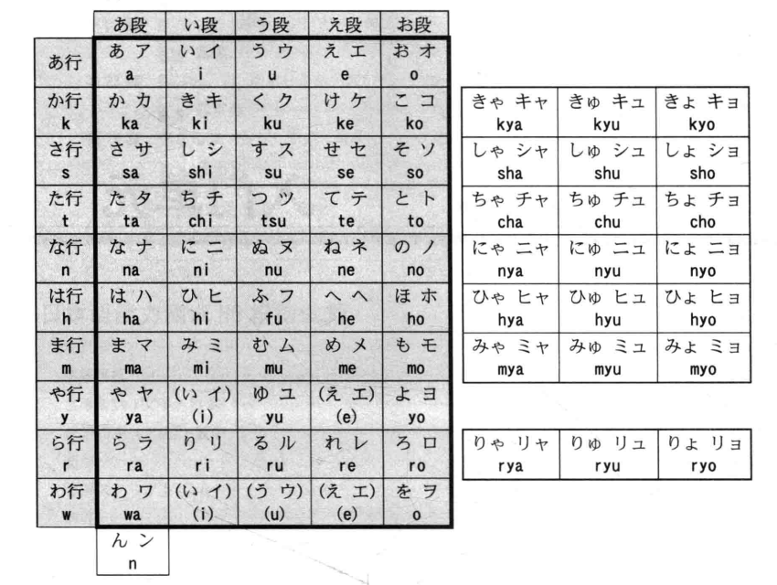
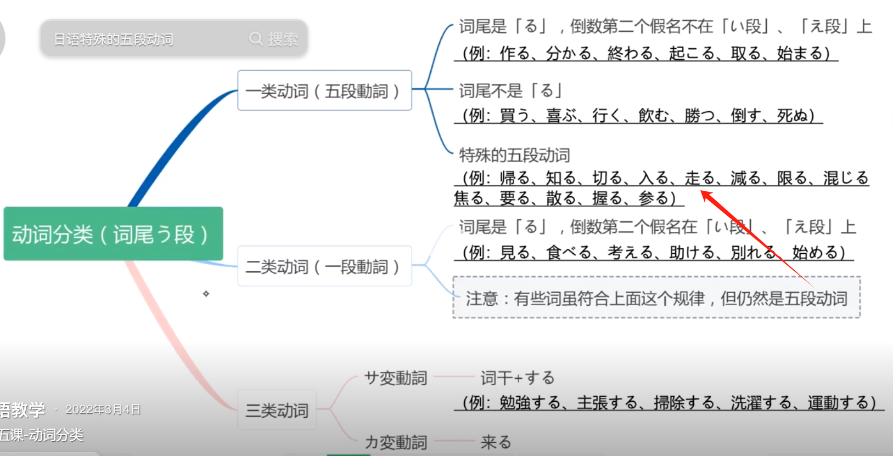
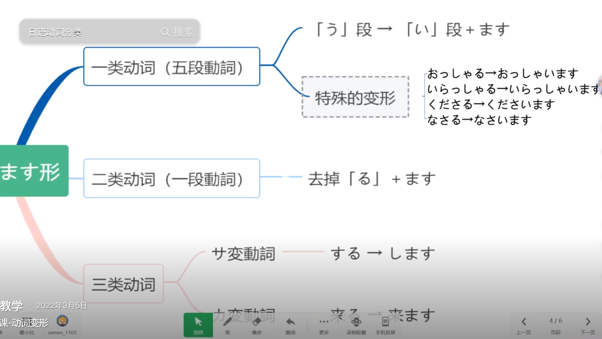

# 日语基础

## 编辑技巧

### 标注

- 给日汉字标注假名

  ```html
  <ruby>汉字<rp>(</rp><rt>hàn zì</rt><rp>)</rp></ruby>
  ```

### 字体

- 日语文字部分尽量使用明朝体（MS Mincho），此种字体在日本官方最常用

  ```html
  **<span style="font-family: 'MS Mincho';">此处为日语文字</span>**
  ```

### 颜色

- 给文字修改颜色

  ```html
  <span style="color:red;">文字</span>
  ```

## 基础概念

- **日语构成**
  - 日汉字占 70%
    - 简体字占 40%，山
    - 繁体字占 20%，電話
    - 和字占 10%，凪
  - 片假名占 30%
- **平假名**用于标注日汉字
- **片假名**用于标记特殊词汇（外来词汇、科学技术、人名品牌等）
- **罗马音**用于标记平假名和片假名，帮助非日语人士学习和发音日语

## 五十音




- **あ行**

  - **<span style="font-family: 'MS Mincho'">あ　ア</span>**　 a【a】 安
  - **<span style="font-family: 'MS Mincho'">い　イ</span>**　 i【i:】 以
  - **<span style="font-family: 'MS Mincho'">う　ウ</span>** 　 u【u】 宇
  - **<span style="font-family: 'MS Mincho'">え　エ</span>** 　 e【æ】 衣，衣(え)衫工(エ)整
  - **<span style="font-family: 'MS Mincho'">お　オ</span>** 　 o【ɔ】 於，淤(於)泥才(オ)呕(o)心

- **か行**

  - **<span style="font-family: 'MS Mincho'">か　カ</span>**　 ka【ka】 加，加点力(カ)气
  - **<span style="font-family: 'MS Mincho'">き　キ</span>**　 ki【ki:】 畿，き长的像钥匙
  - **<span style="font-family: 'MS Mincho'">く　ク</span>**　 ku【ku】 久，考得差(<60 分)，哭(ku)了很久
  - **<span style="font-family: 'MS Mincho'">け　ケ</span>**　 ke【kæ】 計，竹(ケ)书纪(計)年
  - **<span style="font-family: 'MS Mincho'">こ　コ</span>**　 ko【kɔ】 己

- **さ行**

  - **<span style="font-family: 'MS Mincho'">さ　サ</span>**　 sa【sa】 左，洒(sa)在左边草(サ)地
  - **<span style="font-family: 'MS Mincho'">し　シ</span>**　 shi【xi:】 之，用吸管(し)喝水(シ)
  - **<span style="font-family: 'MS Mincho'">す　ス</span>**　 su【su】 寸须，三寸(す)胡须(ス)酥(su)麻
  - **<span style="font-family: 'MS Mincho'">せ　セ</span>**　 se【sæ】 世
  - **<span style="font-family: 'MS Mincho'">そ　ソ</span>**　 so【sɔ】 兽

- **た行**

  - **<span style="font-family: 'MS Mincho'">た　タ</span>**　 ta【ta】 太多，她在夕(タ)阳下太(た)美了
  - **<span style="font-family: 'MS Mincho'">ち　チ</span>**　 ti/chi【qi:】 知千，七(qi:)千(チ)万粉丝
  - **<span style="font-family: 'MS Mincho'">つ　ツ</span>**　 tu/tsu【cu】 川，つ长的像刺猬
  - **<span style="font-family: 'MS Mincho'">て　テ</span>**　 te【tæ】 天，tennis(て)要两个人(テ)打
  - **<span style="font-family: 'MS Mincho'">と　ト</span>**　 to【tɔ】 止，停止偷(tɔ)萝卜(ト)

- **な行**

  - **<span style="font-family: 'MS Mincho'">な　ナ</span>**　 na【na】 奈
  - **<span style="font-family: 'MS Mincho'">に　ニ</span>**　 ni【ni:】 仁，你(ni:)很二(ニ)
  - **<span style="font-family: 'MS Mincho'">ぬ　ヌ</span>**　 nu【nu】 奴
  - **<span style="font-family: 'MS Mincho'">ね　ネ</span>**　 ne【næ】 袮
  - **<span style="font-family: 'MS Mincho'">の　ノ</span>**　 no【nɔ】 乃

- **は行**

  - **<span style="font-family: 'MS Mincho'">は　ハ</span>**　 ha【ha】 波，8 波哈哈(ha)
  - **<span style="font-family: 'MS Mincho'">ひ　ヒ</span>**　 hi【hi:】 比，嘿嘿(hihi ü)
  - **<span style="font-family: 'MS Mincho'">ふ　フ</span>**　 fu/hu【hu】 不，不“了”草，不糊(hu)弄
  - **<span style="font-family: 'MS Mincho'">へ　ヘ</span>**　 he【hæ】 像小山坡
  - **<span style="font-family: 'MS Mincho'">ほ　ホ</span>**　 ho【hɔ】 保

- **ま行**

  - **<span style="font-family: 'MS Mincho'">ま　マ</span>**　 ma【ma】 末，妈妈(ma)期末(ま)挂科了
  - **<span style="font-family: 'MS Mincho'">み　ミ</span>**　 mi【mi】 美，2+1(み)=3(ミ)
  - **<span style="font-family: 'MS Mincho'">む　ム</span>**　 mu【mu】 武牟，武(む)穆(ム)遗书
  - **<span style="font-family: 'MS Mincho'">め　メ</span>**　 me【mæ】 女，美女(め)买
  - **<span style="font-family: 'MS Mincho'">も　モ</span>**　 mo【mɔ】 毛

- **や行**

  - **<span style="font-family: 'MS Mincho'">や　ヤ</span>**　 ya【ya】 也，也一样 ya
  - **<span style="font-family: 'MS Mincho'">ゆ　ユ</span>**　 yu【you】 由
  - **<span style="font-family: 'MS Mincho'">よ　ヨ</span>**　 yo【yɔ】 与，よ像钥匙

- **ら行**

  - **<span style="font-family: 'MS Mincho'">ら　ラ</span>**　 ra【la】 良
  - **<span style="font-family: 'MS Mincho'">り　リ</span>**　 ri【li:】 利
  - **<span style="font-family: 'MS Mincho'">る　ル</span>**　 ru【lu】 留，3(る)个留守儿(ル)童
  - **<span style="font-family: 'MS Mincho'">れ　レ</span>**　 re【læ】 礼
  - **<span style="font-family: 'MS Mincho'">ろ　ロ</span>**　 ro【lɔ】 吕，3(ろ)口(ロ)人

- **わ行**

  - **<span style="font-family: 'MS Mincho'">わ　ワ</span>**　 wa【wa】 和，13(わ)在 17(ワ)
  - **<span style="font-family: 'MS Mincho'">を　ヲ</span>**　 wo【ɔ】 袁，大+C=を，大冢爱星象仪(ヲ)

- **拨音**

  - **<span style="font-family: 'MS Mincho'">ん　ン</span>**　 n【eng】 你(n)喝(ん)二点水(ン)

## 易混假名

- さきち
- よまはほ
- わねれ
- るらろ
- めぬあ
- こユヨ
- ソリ
- シミ
- フクタスヌマヲテラ

## 元音

- **5 个元音**
  - **あ**(a)、**い**(i)、**う**(u)、**え**(e)、**お**(o)
- **元音的连续**
  - 双元音连续时，发音也连续
  - 如「**あい**（ai）」、「**うえ**（ue，类似读 wai）」
- **元音的清化**
  - 在一定条件下，只保留元音口型而不发音
  - 「い」和「う」容易出现清化，其它较少
  - 夹在**k**(か行)、**s**(さ行)、**t**(た行)、**p**(ぱ行)的中间元音，或者含有这些行辅音的音节出现在句尾，其最后的元音
  - 如「きた」和「みます」

## 辅音

### 清音

- 日语中含 10 种清音（9 种清音和 1 种半浊音），前 9 种为 50 音图中的基础音，p 为半浊音
  - **k**(か行)、**s**(さ行)、**t**(た行)、**n**(な行)、**h**(は行)
  - **m**(ま行)、**y**(や行)、**r**(ら行)、**w**(わ行)、**p**(ぱ行)
- 半浊音有 5 个，在原**h**(は行)的基础上，在右上角加 1 个圈，读音发生变化
  - **h**(は行)ーーー**p**(ぽ行)
  - 如：**は**(ha)ーーー**ぱ**(pa)

### 浊音

- 日语中含 5 种浊音，前 4 种在基础音**k**(か行)、**s**(さ行)、**t**(た行)、**h**(は行)基础上，在右上角加两个点，读音发生变化
  - **k**(か行)ーーー**g**(が行)
  - **s**(さ行)ーーー**z**(ざ行)，じ ジ 是 ji【ji:】，而不是 zi【zi:】
  - **t**(た行)ーーー**d**(だ行)，ぢ ヂ 是 ji【ji:】，而不是 zi【zi:】，づ ヅ是 zu【zu】，而不是 du【du】
  - **h**(は行)ーーー**b**(ば行)

## 拗音

- 拗音组成
  - 每个拗音由两个假名组成
  - 第一个假名：正常的**k**(か行)、**s**(さ行)、**t**(た行)、**n**(な行)、**h**(は行)、**m**(ま行)、**r**(ら行)、**p**(ぱ行)、**g**(が行)、**z**(ざ行)、**b**(ば行)，以上辅音充当类似拼音中的声母
  - 第二个假名：小写的や、ゆ、よ，以上三个音充当类似拼音中的韵母
- 拗音拼写
  - 省略第一个假名的“**i**”和“**u**”，加上第二个假名的罗马音，组合到一起得到拗音的罗马音
    - 如：きゃ kya(ki+ya)，省略 ki 中的“**i**”，加上 ya，得到“**kya**”，读音类似于拼音中的“**xia**”
  - 当第一个假名的罗马音是“**shi**”、“**ji**”、“**chi**”时，还要同时省略第二个假名的“**y**”，但读音不省略
    - しゃ sha(shi+ya)，省略 shi 中的“**i**”和 ya 中的“**y**”，组合后得到“**sha**”，读音类似于拼音中的“**xia**”
    - しゅ shu(shi+yu)，读音类似于拼音中的“**xiu**”
    - しょ sho(shi+yo)，读音类似于拼音中的“**xiao**”
    - じゃ／ぢゃ ja(ji+ya)，读音类似于拼音中的“**jia**”
    - じゅ／ぢゅ ju(ji+yu)，读音类似于拼音中的“**jiu**”
    - じょ／ぢょ jo(ji+yo)，读音类似于拼音中的“**jiao**”
    - ちゃ cha(chi+ya)，读音类似于拼音中的“**qia**”
    - ちゅ chu(chi+yu)，读音类似于拼音中的“**qiu**”
    - ちょ cho(chi+yo)，读音类似于拼音中的“**qiao**”

## 拼读

- **拨音**
- **长音**
  - 连续两个假名的元音相同或相近，第一个假名的元音拉长，第二个假名不发音，有点连读的意思
- **促音**
  - 日语中有一个实际听不见声音的音节，叫促音，用「つ」的小写形式「っ」表示
  - 在单词中促音应保持一点顿挫，否则词义会改变

## 单词发音

- **原则**
  - 前两个音节高低一定不同
  - 一个单词中只能下降一次（第一个音节除外）
- **高低区分**
  - 高音：类似拼音中的一声（拉）
  - 低音：类似拼音中的三声（屎）
- **类型**
  - 圈里的数字 n 表示从第 n 个之后那个音节开始一直降低，同时也意味着第 n 个音节是高音
  - ◎ 型：低 高 ……
  - ① 型：高 低……
  - ② 型：低 高 低……
  - ③ 型：低 高 高 低……
  - ④ 型：低 高 高 高 低……
  - ⑤ 型：低 高 高 高 高 低……

## 关于输入

- 以 Microsoft IME 为例

  - 中日切换：Win+Space
  - 平假名：Ctrl + Caps Lock
  - 全角片假名：Alt + Caps Lock
  - 大写英文：Shift + Caps Lock

- 拨音「ん」：连续两个 n
- 促音「っ」：xtu / ltu
- 长音「ー」：0 左侧的减号
- 英文字母 J「ジェー」：je-

# 基础语法

- **句子构成**

  「<span style="color:blue;">名词</span>」「<span style="color:red;">助词</span>」+……+「<span style="color:blue;">名词</span>」「<span style="color:red;">助词</span>」+「<span style="color:green;">谓语</span>」

  - 助词用于声明名词的作用
  - 谓语后置

- **肯定句**

  ～**は**　～**です**

  - **助词**「は」用于声明主语「私」，这里读作**wa**，非正规书写也会写成**わ**。
  - 通过谓语「では」进行肯定。
  - 【例】私**は**　中国人　**です**。（我是中国人。）

- **否定句**

  ～**は**　～**では　ありません**

  - 通过谓语「では　ありません」进行否定。其中「では」在口语中有时写成「じゃ」
  - 【例】私**は**　日本人　**では　ありません**。（我不是日本人。）

  **疑问词 + も + 「动`否定`」**

  - 表示全面否定
  - 【例】教室に　**誰も**　い**ません**。（教室里谁也没有。）

- **疑问句**

  ～は　～です**か**。

  - **助词**「か」接在句尾表示疑问，这里读作**ga**，日语中不使用“**？**”。

    【例】小野さんは　中国人　です**か**。（小野女士是中国人吗？）

  - 连续提问：～は　～です**か**，～です**か**。

    小野さんは　中国人，日本人　です**か**。（小野女士是中国人还是日本人？）

- **敬体形和简体形**

第 22 课

# 动词

## 动词分类

### 语法作用分类

- **自动词**

  自动词是不带宾语的动词，主语助词用「**が**」表示动作主体

  （助记：门咖「が」一下就开了，自动）

  「名」**が**　「自动」

  窓**が**　開きました。（窗户打开了。）

- **他动词**

  他动词是带宾语的动词，宾语助词用「**を**」表示，表示动作对象

  （助记：我「を」把门打开了，他动）

  「名」**を**　「他动」

  李さんが　窓**を**　開けました。（小李打开了窗户。）

### 活用形式分类



日语中所有动词原形的尾音都在「う段」，可以分为三类。

- **一类动词（五段动词）**

  - 词尾不是「る」

    (例:買う、喜ぶ、行く、飲む、勝つ、倒す、死ぬ)

  - 词尾是「る」，且倒数第二个假名**不在**「い段」、「え段」上

    (例:作る、分かる、終わる、起こる、取る、始まる)

  - 特殊的五段动词

    **注意**有些动词虽然符合二类动词规律，但仍然属于五段动词

    （帰る、知る、切る、入る、走る、減る、限る、混じる焦る、要る、散る、握る、参る)

- **二类动词（一段动词）**

  词尾是「る」，且倒数第二个假名**在**「い段」、「え段」上

  (例:見る、食べる、考元る、助ける、别れる、始める)

  注意有些动词虽然符合上述规律，但仍然属于五段动词

  （帰る、知る、切る、入る、走る、減る、限る、混じる焦る、要る、散る、握る、参る)

- **三类动词**

  - **サ变动词**

    词干+する

    (例:勉強する、主張する、掃除する、洗濯する、運動する)

  - **カ变动词**

    「来る」

## 动词活用变形

### 基本形

第 20 课

- 「名`人`」は　「动`基本形`」**ことが　できます**

  表示有做……的能力

  ことが (koto ga)：「こと」意思是“事情”，在这里它用来表示动作的行为性质或概念性质；「が」是一个助词，用来标记「こと」作为句子的主题。

  できます (dekimasu)：这是动词「できる」的礼貌形式，意思是“能够”、“会”。

  スミスさんは　ピアノを　弾く　**ことが　できます**か。（史密斯先生会弹钢琴吗？）

  ——はい，できます。

  ——いいえ，できません。

  スミスさんは　ピアノを　弾く　**ことが　できません**。（史密斯先生不会弹钢琴。）

- 「名」は　「动`基本形`」**こと　です**

  こと (koto)：这是一个名词，表示抽象的概念或动作。在这个句子中，它引入了一个动作的概念性质，相当于英语中的“事情”或“行为”。

  私は　趣味は　集める　**こと　です**。（我的爱好是集邮。）

- 「动`基本形`」**前に**，～

  表示一个动作在另一个动作发生之前时

  每日　寝る　**前に**　シャワーを　浴びます。

  - 「名」**の　前に**，～

    这个动词也可用名词+の

    会議**の　前に**，資料を　コピーします。

### ます形

第 5 课

动词的ます形作为动词的敬体形，更加礼貌

#### 变ます形

- 动词普通型变为ます形

  

- 五段动词

  - 将词尾「う段」变为相应「い段」+　ます

    か**う**　 → 　か**います**，の**む**　 → 　の**みます**

  - 特殊变形

    おっしゃ**る**　 → 　おっしゃ**います**

    いらっしゃ**る**　 → 　いらっしゃ**います**

    くださ**る**　 → 　くださ**います**

    なさ**る**　 → 　なさ**います**

- 一段动词

  - 将词尾「る」去掉　+　ます

    み**る**　 → 　み**ます**

- サ变动词：将「する」变为「します」

- カ变动词：将「る」变为「ます」

#### ます形时态

|      | 习惯、状态、未来 | 过去           |
| ---- | ---------------- | -------------- |
| 肯定 | ～ます           | ～ました       |
| 否定 | ～ません         | ～ませんでした |

- **～ます**：现在和将来肯定式
- **～ません**：现在和将来否定式
- **～ました**：过去肯定式
- **～ませんでした**：过去否定式

### て形

第 14 课

- 「动`て形`」**います**

  - 正在进行时

    小野さんは　今　新聞を　読んで　います。（小野女士正在看报纸。）

  - 结果状态？？？？？第 16 课解释 4

- 「动 1」**て**　「动 2」

  表示动作 1 和动作 2 相继发生，其中「**て**」可以换成「**てから**」

  昨日　デパートへ　行っ**て**，買い物しました。（昨天去商场购物了。）

  李さんは　毎晩　ラジオを　聞いてから　寝ます。（小李每晚听了收音机后睡觉。）

- 「动」**て　ください**

  ここに　住所と　名前を　書い**て　ください**。（请在这里写住址和姓名。）

- 「动`て形`」**も　いいです**

  表示许可

  ここで　写真を　撮って　**も　いいです**か。（这里可以拍照么？）

  ——はい，いいです。（是的，可以。）

- 「动`て形`」**は　いけません**

  表示不许可

  ここで　写真を　撮って　**は　いけません**か。（这里不可以拍照么？）

  ——はい，いけません。（是的，不可以。）

  ——いいえ，いいです。（不，可以。）

### ない形

第 19 课

- 「动`ない形`」**で　ください**

  表示否定命令

  ください：这是一个礼貌的请求形式，相当于中文的「请」

  部屋の　鍵を　忘れない**で　ください**。

### た形

第 21 课

# 形容词

## 一类形容词

一类形容词是以「い」结尾的形容词

- 一类形容词做谓语

  |      | 普通                       | 过去                                 |
  | ---- | -------------------------- | ------------------------------------ |
  | 肯定 | ～い　です                 | ～かったです                         |
  | 否定 | ～く　ないです／ありません | ～く　なかったです／ありませんでした |

- いいです做谓语

  |      | 普通             | 过去                     |
  | ---- | ---------------- | ------------------------ |
  | 肯定 | ～いい　です     | ～よかったで             |
  | 否定 | ～よく　ないです | ～よく　ありませんでした |

## 二类形容词

- 二类形容词做谓语

  |      | 普通                       | 过去                             |
  | ---- | -------------------------- | -------------------------------- |
  | 肯定 | ～　です                   | ～　でした                       |
  | 否定 | ～　では／じゃ　ありません | ～　では／じゃ　ありませんでした |

- 注意的二类形容词

  きれい ①（綺麗） 〔形动〕 **美丽**

## 形容词て形

- 一类形容词的**て**形

  将词尾「**い**」变为「**くて**」

- 二类形容词的**て**形

  在词尾直接加「**で**」

## 修饰名词

- 一类形容词修饰名词

  「一类形」+「名」

- 二类形容词修饰名词

  「二类形」**な**「名」

## 形容词比较

### 肯定比较

- 「名 1」は　「名 2」**より**　「形」です。

  - 表示肯定的比较，即「名 1」比「名 2」……

    李さんは　森さん**より**　若いです。（李先生比森先生年轻。）

  - 在「より」后面加「ずっと」表示程度更重。

    李さんは　森さん**より　ずっと**　若いです。（李先生比森先生年轻得多。）

- 「名 1」**より**　「名 2」**の　はうが**　「形」です。

  表示与「名 1」相比，「名 2」更……

  李さん**より**　森さん**の　はうが**　若いです。（与李先生相比，森先生更年轻。）

### 否定比较

- 「名 1」は　「名 2」**はど**　「形`否定形`」。

  表示否定的比较，即「名 1」不比「名 2」……

  東京の冬は　北京の冬**はど**　寒**くないです**。（东京的冬天没有北京那么冷。）

  神戸は　大阪**はど**　賑やか**ではありません**。（神户没有大阪那么繁华。）

### 最比较

- 「名 1」**の中で**　「名 2」**が　いちばん**　「形」です。

  表示在「名 1」中，「名 2」最……

  日本料理**の　中で**　寿司**が　いちばん**　美味しいです。（在日本料理中，寿司最好吃。）

- 「名 1`场所/时间`」**で　いちばん**　「形」「名 2」**は**　「名 3」です。

  表示「名 1`场所/时间`」的最……的「名 2」是「名 3」

  日本**で　いちばん**　高い　山**は**　富士山です。（日本最高的山是富士山。）

  一年**で　いちばん**　寒い　月**は**　２月です。（一年中最冷的月份是 2 月份。）

### 疑问比较

- 「名 1」と「名 2」**と　どちらが**　「形」ですか。

  表示「名 1」和「名 2」哪个更……？

  日本語と英語　**と　どちらが**　難しいですか。（日语和英语哪个更难？）

  ——日本語　**の　はうが**　難しいです。（日语难学。）

### 疑问最比较

- ？？？？第 12 课解释 6

## 形容词连用

- 形容词并列

  「形`て形`」「形」

  表示既……又……

  この　本は　**安くて**　**面白い**です。（这本书既便宜又有趣。）

# 名词

- 名词做谓语

​ 名词做谓语时的句尾变化同二类形容词

# 接续词

- 「小句」**が**，「小句」

  表示转折，但是

  3 か月　パソコンを　勉強しました**が**，まだ　あまり　できません。（我学了 3 个月电脑，但是任然不太会用。）

# 连体词

- 连体词，即连接体言的词，体言在日语里相当于名词

  如：この，その，あの

# 词义

## 想，愿望

- 「动词」たい（想做……）

  映画を　見**たい**です。（我想看电影。）

- 「名」**が**　**欲しい**（想要……）

  私は　新しい　洋服**が**　**欲しい**です。（我想要新西服。）

## 提议

- 「动词」**ません**　**か**

  明日　故宫へ　行き**ませんか**。（明天去故宫怎么样？）

- 「动词」**ましょう**

  「**~ましょう**」是动词「**~ます**」的连用形，表示提议。

  そろそろ　行き**ましょう**。（快走吧。）

- **ほうが　いいです**

  - 「一类形」**ほうが　いいです**
  - 「二类形」**な**　**ほうが　いいです**

  表示自己的选择或向别人建议

  旅行の　荷物は　軽い　**ほうが　いいです**。（旅行 行李还是轻点好。）

  子供は　元気**な**　**ほうが　いいです**。（孩子还是精神一点好。）

## 变化

- 「一类形」**なります**

  将一类形容词词尾的「**い**」变成「**く**」，后面搭配「**なります**」，表示变化

  「なります」是动词「なる」的敬体，表示动作的进行形式，相当于中文的"变得"。

  だんだん　暖か**く　なります**。（天气渐渐变暖了。）

  携帯電話は　小さ**く　なりました**。（手机变小了。）

- 「二类形」／「名」　**に　なります**

  表示性质或状态的变化

  来年　社会人　**に　なります**。（明年将成为社会一员。）

  もう　元気　**に　なりました**。（已经恢复健康了。）

- 「一类形」**します**

  将一类形容词词尾的「**い**」变成「**く**」，后面搭配「**します**」，表示主观希望什么变化。

  「します」是动词「しる」的敬体，表示做，相当于英语的"do"。

  テレビの　音を　大き**く　します**。（把电视机声音开大一点。）

- 「二类形」／「名」　**に　します**

  表示主观希望什么变化。

  会議室を　禁煙　**に　します**。（会议室禁烟。）

  部屋を　きれい　**に　して　ください。**（把屋子打扫干净。）

# 人称

## 人称

- **私**：（我）第一人称

- **あなた**：（你）第二人称

  - 注意一般不会使用「あなた」指代对方，这样会显得不礼貌

    老婆称呼老公可以使用

    在广告中可以使用

  - 【例】（あなたは）　小野さん　です**か**。（你是小野女士吗？）

    一般会省略掉括号里的「あなたは」

- **第三人称**

  - **~の人**：~个人

    【例】あの人は　小野さん　ですか。（那个人是小野先生吗？）

  - **～の方**：\~位；~方。尊称

    基本可以认为是「～の人」的尊称

    【例】あ**の方**は　田中さんです。（那位是田中先生。）

    【例】ＪＣ企画**の方**　ですか。（是 JC 策划公司的吗？）

- **~さん**：（~先生，女士）尊称

  - 对别人的尊称，不分男女，不能用在自己身上。

    **注意**不要使用「先生」，「先生」在日语中表示“老师”。

  - 【例】小野さんは　先生　です。（小野女士是老师。）

- **~君**：（~君，先生，同志）尊称

  - 上司称呼下属，长辈称呼晚辈，用「君」
  - 【例】小野君は　先生　ですか。（小野君是老师吗？）

- **~ちゃん**：（~酱）尊称

  - 称呼小孩、老人和关系近的人时，显亲热

  - 【例】太郎ちゃん，こんにちは。（太郎，你好。）

- 可用职业、职务称呼对方

  - 【例】店員さん

## 人称的省略

- 日语里，一般省略可以明白的人称，这样更自然、更礼貌。
- **例：**括号内为省略的部分
  - 【提问】（あなたは）吉田さん　ですか。
  - 【回答】いいえ，（わたしは）吉田じゃ　ありません。（わたしは）森です。

## 亲属

- 日语里表示亲属的有谦称和敬称

  - 谦称用来称呼自己的亲属
  - 敬称用来称呼别人的亲属
  - 如母亲

    - **母**：谦称，只能形容自己的母亲

      ——わたしの　母です。（是我的妈妈。）

    - **お母さん**（おかあさん ②）：尊称，可以形容自己或别人的母亲

      お母さんは　おいくつですか。（令堂多大年纪了？）

  - 泛指亲属的敬称前面加「ご」

    **ご家族**（ごかぞく ②）**ご両親**（ごりょうしん ②）**ご兄弟**（ごきょうだい ②）

  - 比自己大的亲属前面加「お」，后面加「さん」，中间读音可能有变化
  - 比自己小的亲属后面加「さん」

- 日语的「兄弟」表示兄弟姐妹都可能

## 谁

- 谁

  - **だれ**：用于比自己地位低的人

    【例】それは　**だれ**　ですか。【译】那是谁？

  - **どなた**：尊称，用于比自己地位高的人

    【例】あの方は　**どなた**　ですか。【译】那位是谁？

- 谁的

  - 【例】それは　**だれの傘**　ですか。【译】那是谁的伞？

  - 【例】その傘は　**だれの**　ですか。【译】那是谁的伞？

    这里的「だれの」的用法类似于英语中的“mine”，因此不说「だれの傘」

# 代称

- 这 / 那 / 那

  - 「**これ／それ／あれ**」
  - 【例】**これ**は　本　です。【译】这是书。

- 什么

  - 「**何**」
  - 【例】それは　**何**　ですか。（那是什么？）

- 这个 / 那个 / 那个：

  - 「**この／その／あの**」「**名**」
  - 【例】**この本**は　**小野の**　です。【译】这本书是小野的。

    这里的「小野の」的用法类似于英语中的“mine”，因此不说「小野の本」

- 哪一个

  - 「**どれ**」

    【例】小野さんの本　**どれ**　ですか。【译】小野的书是哪一本？

  - 「**どの「名」**」

    【例】小野さんの本　**どの本**　ですか。【译】小野的书是哪一本？

- 哪个
  - 「**どちら**」
  - 【例】会社は　**どちら**　ですか。（你是哪个公司的？）

# 疑问词

～「**疑问词**」　 です**か**。

用法相当于英语中的“where”、“what”……。

- **什么样的**

  【例】張さんは　**どんな**人　です**か**。（张先生是个什么样的人？）

- **多少钱**

  【例】その服は　**いくら**　です**か**。（那件衣服多少钱？）

- **年龄**

  【例】**何歳**　ですか。（你多大了？）

  【敬】**御幾つ**　ですか。（你多大年纪了？）

# 时间

## 时间语法

- **表示时间**

  今　４時　 30 分　です。（现在是 4 点 30 分。）

  今　午前　４時半　です。（现在是上午 4 点半。）

- **在具体时间点**

  - 包含数字的「名`时间`」需要助词「**に**」：「名`时间`」**に**

    如：6 時**に**，3 月 14 日**に**，2008 年**に**，何時**に**

    森さんは　 7 時**に**　起きます。（森先生 7 点起床。）

  - 不包含数字的「名`时间`」不需要助词「**に**」

    如：**<span style="font-family: 'MS Mincho';">今</span>**，昨日，每日，去年……

  - 可加可不加助词「**に**」

    星期：日曜日

- **从……到……**

  - ……**から**……**まで**（从……到……）

    わたしは　９時**から**　５時**まで**　働きます。（我 9 点到 5 点工作。）

  - ……**から**（从……时候）／……**まで**（到……时候）

    二者可分开使用

- 区分「いつ」和「何時」

  **いつ**：什么时候，不具体，不需助词「**に**」

  **何時**：几点，具体，需要助词「**に**」

## 时间词

# 数量

## 数字表示

- **个位**
  - 0：れい／ぜろ
  - 1：いち／いっ
  - 2：に
  - 3：さん
  - 4：よん／し
  - 5：ご
  - 6：るく
  - 7：しち／なな
  - 8：はち
  - 9：きゅう／く
- **十**：じゅう
- **百**：ひゃく
  - 300：さん<span style="color:blue;">びゃ</span>く
  - 600：<span style="color:red;">るっ</span><span style="color:blue;">びゃ</span>く
  - 800：<span style="color:red;">はっ</span><span style="color:blue;">ぴゃ</span>く
- **千**：せん
  - 3000：さん<span style="color:blue;">ぜん</span>く
- **万**：まん
- **亿**：おん
- **小数**：
  - 点：てん
  - 0.1：れいてんいち
- **分数**：
  - 分：ぶんの
  - 2/3：さんぶんのに
- **百分数**：
  - 百分：
  - 20%：

## 其它

- 「名`期间`」**に**　「名`次数`」+「动」

  表示在一定期间进行若干次动作

  李さんは　１週間**に**　２回　プールへ　行きます。（小李 1 周去两次游泳池。）

- 「名`期间`」+「动」

  表示动作持续的时间

  李さんは　毎日　七時間　働きます。（小李每天工作 7 小时。）

- 量词后置

  卵を　**１個**　食べます。（吃一个鸡蛋。）

  教室に　学生が　**４人**　います。（教室里有 4 个学生。）

- 「名`数量`」**で**

  用于不承重而以数个的方式出售，当数量是 1 时不加「**で**」

  この　ケーキは　**１個**　 200 円です。

  この　ケーキは　**３個で**　５ 00 円です。

# 位置

- 这里 / 那里 / 那里

  - 「**ここ／そこ／あそこ**」は　「场所」です。
  - 【敬】「**こちら／そちら／あちら**」
  - 【例】**ここ**は　デパートです。【译】这里是百货商店。
  - 【辨】デパートは　**ここ**です。【译】百货商店在这。

- 哪里

  - 「场所」は　「**どこ**」です。
  - 【敬】**どちち**
  - 【例】トイレは　**どこ**　です**か**。（厕所在哪？）
  - 也可使用「～は　～に　あります／います」句型

- 在……场所

  - 「名词」**は**「场所」**です**。
  - 表示「名词」存在于「场所」。
  - 【例】食堂**は**　デパートの７階**です**。【译】食堂在百货商店的 7 层。

- 方位

  - 上／下／前／後ろ／隣／中／外／

  - ～の「方位」：相当于「名`场所`」

    【例】机**の上**に　猫が　います。（桌子上面有猫。）

  - 「墙壁上」不能写作「壁の上」，应该直接写「壁」

    【例】**壁**に　スイッチが　あります。（墙上有开关。）

# 存在

- 「あります」和「います」

  - 表示存在

    「います」：动词「いる」的礼貌形式，表示存在有意志的

    「あります」：动词「ある」的礼貌形式，表示存在无意志的

  - 此处「名词`场所`」用助词「に」

- ～に　～が　あります／います

  - 表示“\~里有~”

  - 【例】

    部屋**に**　机**が**　**あります**。（房间里有桌子。）

    公園**に**　子供**が**　**います**。（公园里有孩子。）

    庭**に**　何**が**　**ありますか**。（院子里有什么？）

    あそこ**に**　誰**が**　**いますか**。（那里有谁？）

- ～は　～に　あります／います

  - 表示“\~在~里”

  - 【例】

    椅子**は**　部屋**に**　**あります**。（椅子在房间里。）

    子供**は**　公園**に**　**います**。（孩子在公园里。）

    子供**は**　どこ**に**　**いますか**。（孩子在哪里？）

    子供**は**　どこ　**ですか**。（孩子在哪里？）

# 表达

## 关于礼貌

日语是一种极其注重礼貌的语言，表现的方式有“敬语前缀”、“谦词接尾”、“敬体形”……

- **敬语前缀**

  - "敬语前缀"是日语中一种礼貌用语的语法结构，通常用于使句子更加礼貌或尊敬。
  - 前缀：「お～」、「ご～」、「御～」等
  - 如：お母さん、おはよう、御幾つ……
  - 并非所有名词前都可以用敬语前缀

- **～ございます**
  - 「ござう」的ます形活用，它的基本含义是"有"。
  - 这里是谦词结尾，用于表示尊敬或客套，可翻译成“非常”。
  - 如：ありがとうございます，おはようございます……
- **问好**

  - おはよう（ございます） 【早上好】

  - 今日は 【你好（用于白天）】

  - 今晚は 【晚上好】

- **告别**

  - おやすみなさい 【晚安】

  - さようなら 【再见】

- **初次见面**

  - 始めまして。 【初次见面】

  - どうぞ　宜しく　お願いします 【请多关照】

    【简】どうぞ　宜しく。 【请多关照】

    【简】宜しく　お願いします。 【请多关照】

  - こちらこそ 【彼此彼此】

    「こちら」：意为"这边"，用于表示自己一方。

    「こそ」：是一种强调语气的助词

- **感谢和致歉**

  - 有り難う（ございます） 【谢谢】

  - どういたしまして 【不用谢】

  - すみません 【对不起；劳驾】

  - あのう 【对不起】

    相当于 Excuse me

- **用餐**

  - いただきます 【我开始享用餐食了】

  - ごちそうさまでした 【感谢盛请】

## 感叹词

- **あつ**：啊

  - 吃惊或者有所感触发出的声音

    あつ！森さん！（哎！森先生！）

  - 紧急情况情不自禁发出的声音

    あつ，すみません！（哎，对不起！）

- **えっ**：啊

  - 对对方所说的话感到意外吃惊

    あの方は　田中先生です。（那位是田中老师。）

    ——えっ。（啊？）〔以为田中老师是学生，因此很惊讶。〕

  - 没听清对方所说的话时的反问

  - 例：

    わたしは　 JC 企画の　社員です。

    ——えっ。（啊？）〔没听清对方刚才说的话，想让对方再说一遍。〕

    JC 企画の　社員です。

- **わあ**：哇

  - 感动或吃惊时发出的声音

    わあ，シルクのハンカチですか。（哇，真丝手绢！）

- **ね**：~吧

  - 征求别人的确认，这里的「ね」读升调。

    あそこに犬がいます**ね**。（那里有一只狗吧？）

    ——はい。（是的。）

- **ええと**：嗯……

  - 被问及某事，思考该如何回答时的口头语

    小野さん，会社は　どこに　あります。（小野先生，公司在哪啊？）

    ——ええと，ここです。（嗯……在这！）

## 回答

- **肯定回答**

  - はい：是（正式）

  - ええ：是（口语）

    注意在别人加到自己名字而回答时，不能用「ええ」

  - そうてす：是这样的

- **否定回答**

  - いいえ：不是
  - ちがいます：不是这样的

# 固定搭配

「名」**で**「名」 【译】既是……又是……

「名`时间/场所`」**から**　「名`时间/场所`」**まで** 【译】从……到……

「名`交通工具`」**で** 【译】乘坐交通工具

「名`工具方法`」**で** 【译】通过工具方法

歩い**て** 【译】步行

「名`场所`」**で**「动词」 【译】在~，动作进行的场所

「名`场所`」**に** 【译】在\~，~存在的场所

「名`场所`」**へ**「动词」 【译】to ~

「名`场所`」**を**「动词」 【译】经过；离开

**あまり**　「一类形／动（否定）」 【译】不太……

どうしてですか 【译】为什么【助记：“どう”（怎么）和“して”（做）组成】

# 普通

- **也**

  ～**も**～

  【例】私**も**　中国人　です。 【译】我也是中国人。

- **的**

  ～**の**～

  - 【例】私**の**　父（我的父亲）

  - **注意**日语中没有「我父亲」这种说法，必须是「我的父亲」

- **和**

  - 「名`人`」**と**　「动」

    共同做某事的对象用「**と**」表示。

    小野さんは　友達**と**　帰りました。

  - 「名」**や**　「名」**へ／が／など**

    用于列举众多选项中的两项，类似与汉语中的”……呀……什么的“

    吉田さんは　時々　中国**や**　韓国**へ／が／など**。【译】吉田先生有时去中国**呀**韩国**什么的**。

- **或者**

  「名」**か**「名」

  私は　毎朝　パン**か**お粥を　食べます。

- **有**

  - 肯定：

    「名`场所`」**に**　「名`物体`/`生物`」**が　あります／います**。

    表示「场所」里**有**「`物体`/`生物`」

  - 否定：

    「名`场所`」に　「名`物体`/`生物`」**も　ありません**／**います**。

    表示「场所」**没有**「`物体`/`生物`」

- **在**

  - 肯定：

    「名`场所`」**は**　「名`物体`/`生物`」**に　あります／います。**

    表示「`物体`/`生物`」**在**「场所」里

- **看见对象**

  「名」**に**　「动词`会い`」

  私は　駅で　森さん**に　会います**。【译】我在车站见到了森先生。

- **索取（祈使句）**

  「名」**を**　**ください**。

  コーラ**を**　**ください**。【译】给我可乐。

- **给**

  我 → 你 →Ta

  「名`人`」は　「名`人`」**に**　「名`物`」を　**「动`あげる`」**。

  受让者用助词「に」表示，相当于英语中的“to”

  私は　小野さん**に**　チョコレートを　**あげました**。【译】我给了小野女士一块巧克力。

- **从……获得**

  Ta→ 你 → 我

  「名`人`」は　「名`人`」**に／から**　「名`物`」を　**「动`もらい`」**。

  给予者用助词「に／から」表示，相当于英语中的“from”

  私は　小野さん**に／から**　チョコレートを　**もらいました**。【译】我从小野女士那得到了一块巧克力。

- **もう**

  表示已经

  - すみません，李さんは　いますか。（请问，小李在吗？）

  ​ ——**もう**　帰りましたよ。（已经回去了。）

- **よ**

  用在句尾表示告知、提醒、轻微 警告等。

  すみません，李さんは　いますか。（请问，小李在吗？）

​ ——もう　帰りました**よ**。（已经回去了。）

- **が**

  - 「名」**が**　「形`情感`」です

    表示对「名」的情感

    小野さんは　肉**が**　嫌いです。【译】小野女士不喜欢吃肉。

  - 「名」**が**　「形动`能力`」です／「动`能力`」

    表示有「名」的能力：上手です／分かります／できます

    小野さんは　料理**が**　上手です。【译】小野女士擅长做饭。

    小野さんは　韓国語**が**　分かります。【译】小野女士懂韩语。

- **～から**和**だから**

  - **～から**

    接续词，表示“因为”，放在表原因的小句句尾。

    寒いです**から**，窓を　閉めます。（因为太冷了，把窗户关上。）

  - **だから**

    接续词，表示“所以”，独立放在表结果的句子前面。

    キムさんは　野菜が　嫌いです。**だから**，あまり　野菜を　食べません。（金女士不喜欢蔬菜，所以不怎么吃）

- 「名`场所`」**へ**　「动」**に**　**行きます／来ます**

  - 去/来做……：「动」**に**　**行きます／来ます**

  - 去/来的目的地：「名`场所`」**へ**

  表示去……做……

  小野さんは　プール**へ**　泳ぎ**に**　**行きます**。（小野女士去泳池游泳。）

- 「名`附着点`」**に**　+「动」

  表示人或物体停留在交通工具或椅子上等时

  李さんは　電車**に**　乗りました。（小李上了电车。）

  この　椅子に　座って　ください。（请坐在这把椅子上。）

# 句子

今朝新聞で見たんだけど、ある調査によると日本では 70 パ-セント近くの人が毎月聍金をしているんだって
