# Pronounce

由于自己学习的一直都是英音发音，所以会一直以英音为准

## 国际音标

- 元音 20 个

  - 单元音 12 个（5 长 7 短）

    [ʌ]       [ɔ]        [ə]      [ɪ]      [ʊ]      [e]             某些 [ɔ] 在美音中发 [a:]

    [ɑ:]     [ɔ:]        [ə:]    [i:]     [u:]     [æ] 

  - 双元音 8 个

    [aɪ]    [ɔɪ]     [eɪ]    [ɪə]      [eə]      [au]     [əu]      [uə] 

- 辅音 28 个
  - 清辅音：[p]  [t]  [k]  [f]  [θ]  [s]  [ʃ]  [h]  [ts]  [tʃ]   [tr]
  - 浊辅音：[b]  [d]  [g]  [v]  [ð]  [z]  [ʒ]  [r]  [dz]  [dʒ]  [dr]
  - 鼻音： [m]  [n]  [ŋ]
  - 半元音：[j]  [w]
  - 舌边音：[l]

## 字母

- **元音字母**：a  e  i  o  u，其余是辅音字母（y 是半元音）

  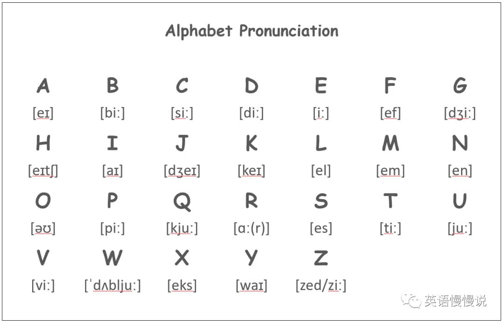

## 发音矫正

- [θ] 和 [s] 

  - 咬舌 [θ] 

- [ai] 和 [e] 和  [æ]：

  | 音素 |        发音        | 示例 |
  | :--: | :----------------: | :--: |
  | [ai] | 由 [a] 向 [i] 滑动 | bike |
  | [e]  |        小口        | bed  |
  | [æ]  |        大口        | cat  |

- [ʊ] 和 [u:]：

  - [ʊ] ：介于 [u]  和 [ə]  之间，look 类似于“洛克”

- [a] 和 [ʌ]：

- [z]：不是汉语拼音里的 'z'，类似于 [ð] 但不咬舌

- **字母矫正**
  
  - N [en] 
  
  - Z [zi:] / [zed]

## 知识扫盲

- **音素**：最小发音单位
- **音节**：只有一个元音发音的音素组合
- **开闭音节**：一般音节中都有元音字母，音节的开闭是相对于元音而言的
  - **开音节**：结尾是元音字母的音节是开音节，其余是闭音节，即**元开辅闭**
  - 绝对开音节：单个发音的元音字母后面没有辅音字母的音节。no she ...
  - 相对开音节：单个元音字母后面有辅音字母（r除外），再加一个不发音字母e构成的音节。name cake ...

# Phonics

自然拼读（Phonics），以下所有规律，以单音节为例

## 元音字母

- 单音节中，单独一个元音字母作为一个音素的常见发音

  | 单个元音字母 |   重读开音节   |  重读闭音节  |  重读 r 音节  | 重读 re 音节  |          非重读音节           |
  | :----------: | :------------: | :----------: | :-----------: | :-----------: | :---------------------------: |
  |      a       |  [eɪ] cake  | [æ] cat  | [a:] bar  | [e] bare  |          [ə] ago          |
  |      e       |  [i:] be   | [e] beg  |  [ə] her  | [ɪ] here  |   [ə / ɪ] the / banket    |
  |      i       | [aɪ] bite  | [ɪ] big  | [ə:] bird | [aɪ] fire | [ə / ɪ] possible / animal |
  |      o       |  [oʊ] no   | [a:] hot | [ɔ:] for  | [ɔ:] bore |         [ə] today         |
  |      u       | [ju:] huge | [ʌ] but  | [ə:] fur  | [jʊ] cure |         [ə] upon          |
  |      y       | [aɪ] byte  |   [ɪ]    |   [ə:]    |   [aɪ]    |         [ɪ] happy         |

- a 特例
  - [ɪ]：orange
  - [ɔ]：wash

- o 特例
  - 开音节
    - [ʌ] brother  
  - 闭音节
    - [ɔ] column
    - [əʊ] most  

## 元音组合

- 以下是常见重读音节中的元音字母组合发音规律

  |   元音组合   |          重读音节          |
  | :----------: | :------------------------: |
  | ai / ay / ey | [eɪ] rain / bay / hey  |
  | ea / ee / ie | [i:] sea / see / chief |
  |   oa / oe    |    [əʊ] boat / toe     |
  |      oo      | [u:] / [ʊ] boot / look |
  |      ou      |        [aʊ] out        |
  |   oi / oy    |   [ɔɪ] choice / boy    |
  |   ue / ui    |   [u:] blue / fruit    |

- 特例：key

## 辅音字母

- 辅音字母常见发音规律

  | 辅音字母 |   多数读音   |        少数读音         |
  | :------: | :----------: | :---------------------: |
  |    b     |              |                         |
  |    c     | [k] cake | [s] ci~ / ce~ / cy~ |
  |    d     |              |                         |
  |    f     |              |                         |
  |    g     |              |                         |
  |    h     |              |                         |
  |    j     |              |                         |
  |    k     |              |                         |
  |    l     |              |                         |
  |    m     |              |                         |
  |    n     |              |                         |
  |    p     |              |                         |
  |    q     |              |                         |
  |    r     |              |                         |
  |    s     |              |                         |
  |    t     |              |                         |
  |    v     |              |                         |
  |    w     |              |                         |
  |    x     |              |                         |
  |    z     |              |                         |

- 特例

## 其余组合

- 非元音字母组合常见发音规律

  |           非元音组合           | 发音  |
  | :----------------------------: | :---: |
  | i (开音节) / ie / igh / uy / y | [aɪ]  |
  |     o (闭音节) / all / oll     | [ɔ:l] |
  |              tion              | [ʃn]  |

- 特例

# 名词

## 名词分类

- 普通名词
    - 可数名词
        - 个体名词：表示作为个体而存在的人或事物：boy book week dream
        - 集体名词：表示若干个人和事物的总称：family committee police   data
    - 不可数名词
        - 物质名词：表示物质、材料的总称：air sand
        - 抽象名词：表示性质、行为、状态、情感等抽象概念的名称：peace freedom  fun
- 专有名词

## 可数名词复数

### 规则变化

- 一般情况，词尾加 -s，parent——parents 父母
- 以 -s，-x，-ch，-sh 结尾，加 -es，glass——glasses 玻璃
    - 特例：词尾 -ch 发音为 / ｋ /，加 -s，stomach——stomachs 胃

- 以 -y 结尾
    - 以辅音字母加 -y 结尾，把 -y 变 -i 加 -es，factory——factories 工厂
    - 以元音字母加 -y 结尾，加 -s，boy——boys 男孩

- 以 -o 结尾
    - 以辅音字母加 -o 结尾，加 -es，potato——potatoes 土豆
    - 以元音字母加 -o 结尾，加 -s，zoo——zoos 动物园

- 以 -f，-fe 结尾，把 -f，-fe 变 -v 再加 -es，wolf——wolves 狼，knife——knives 刀
    - 特例：以 -f 结尾，直接加 -s 的名词：roof 屋顶，chief 首领，belief 信仰，proof 证据，chef 厨师。

### 不规则变化

- 改变内部元音

    - man——men 男人
    - woman——women 女人
    - foot——feet 脚
    - tooth——teeth 牙齿
    - goose——geese 鹅
    - mouse——mice 老鼠（注意此处 s 变 c）

- 单复数同形

    - sheep 绵羊
    - deer 鹿
    - Chinese 中国人
    - Japanese 日本人
    - Swiss 瑞士人
    - means 方法
    - crossroads 十字路口
    - series 一系列
    - species 种类
    - works 工厂
    - head 头（牲畜数量）

- 同一名词，不同意义

    - work 

      a work by Mark 一部马克的作品  
      two works by Mark 两部马克的作品  
      a chemical works 一家化工厂  
      two chemical works 两家化工厂

    - fish

      two fish 两条鱼  
      two fishes 两种鱼

    - people

      two people 两个人  
      two peoples 两个民族

### 由两部分构成的物体

trousers，shorts 等名词不能用基数词修饰，其前也不能直接加不定冠词 a/an，但可以用 a pair of，two pairs of，many 等词修饰。

I need a new pair of trousers for work. 我需要一条上班穿的裤子。

### 复合名词

- 没有连字符，最后一个名词变复数。  
  housewife——housewives 家庭主妇

- 组成复合名词的单词中没有名词，在最后加 -s。  
  grow-up——grow-ups 成年人

- 有连字符，将复合名词中主要的名词变复数。  
  passer-by——passers-by 路人  
  daughter-in-law——daughters-in-law 儿媳妇

- man，woman 为复合名词的第一部分时，复合名词的各个部分皆变为复数  
  a man cook——men cooks 男厨师  
  a woman teacher——women teachers

### 注意

- 某些表示学科的名词，虽然结尾以 -s 结尾，但并非复数形式。作主语时，谓语动词要用单数形式。如 maths 数学，physics 物理学，economics 经济学。  
  Physics is difficult for me. 对于我来说物理很难。

- 单复数同形的名词在使用时要注意其谓语动词的单复数形式变化。  
  Every means has been tried. 每种方法都试过了。  
  All means have been tried. 所有方法都试过了。

- 表示“某国人”的名词变复数的三种形式
    - “中日瑞不变”
    - 词尾的 -man 变 -men，如 Frenchman——Frenchmen；但“德国人（German——Germans）”除外。
    - 词尾直接加 -s，如 American——Americans。

## 单数名词

- 一般名词，在前面加 a
- 元音开头的名词，在前面加 an
- 例外：an hour，a university

## 复数名词

- **Regular**

  |           情况           |      规则       |          示例      |
  | :---------------------: | :-------------: | :--------------: |
  |         一般情况         |      加 s       |   friend → friends|
  | 以 s / x / ch / sh 结尾 |      加 es      |        glass → glasses box → boxes watch → watches brash → brashes        |
  |    辅音字母加 y 结尾     | 把 y 变 i 加 es | butterfly → butterflies |
  |    元音字母加 y 结尾     |      加 s       |          boys           |
  |       f / fe 结尾        |     变 ves      |     knife → knives      |

- **Irregular**

  |     情况     |            示例            |
  | :----------: | :------------------------: |
  |   改变元音   |   foot → feet，man → men   |
  | 词尾发生变化 |      child → children      |
  |  单复数同形  | sheep → sheep，fish → fish |

## 人称代词

|       | 主格  | 宾格  |    自己    | 名词性物主代词 | 形容词性物主代词 |
| :---: | :---: | :---: | :--------: | :------------: | :--------------: |
|  谁   |  who  | whom  |     -      |                |      whose       |
|  我   |   I   |  me   |   myself   |      mine      |        my        |
|  你   |  you  |  you  |  yourself  |     yours      |       your       |
|  他   |  he   |  him  |  himself   |      his       |       his        |
|  她   |  she  |  her  |  herself   |      hers      |       her        |
|  它   |  it   |  it   |   itself   |      its       |       its        |
| 我们  |  we   |  us   | ourselves  |      ours      |       our        |
| Ta 们 | they  | them  | themselves |     theirs     |      their       |
|  这   | this  | this  |     -      |       -        |       this       |
|  那   | that  | that  |     -      |       -        |       that       |
| 这些  | these | these |     -      |       -        |      these       |
| 那些  | those | those |     -      |       -        |      those       |

# Preposition

## Time prep.

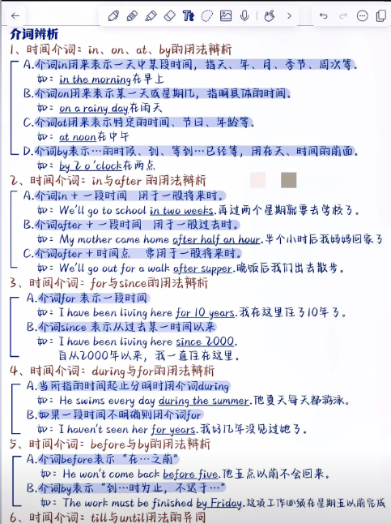

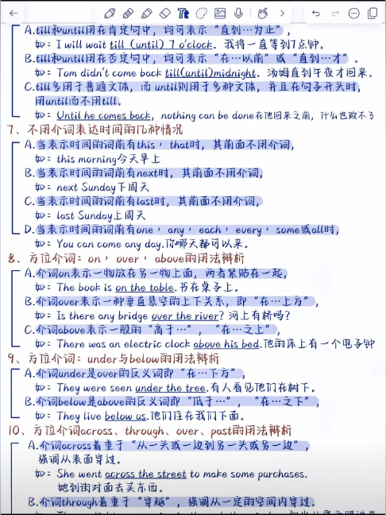

- at 表示具体时间
  - at 10:05
  - at noon / night
- on 表示具体某一天（星期、日期、节日）；具体某一天的上、下午、晚上
  - on Monday
  - on New Year's  Day
  - on June 1
  - on my birthday
  - on Friday morning
  - on the weekend
- in 表示某一段时间（年份，季节，月份）；上、下午、晚上
  - in 2024
  - in spring
  - in June
  - in the morning / afternoon / evening

## Position prep.

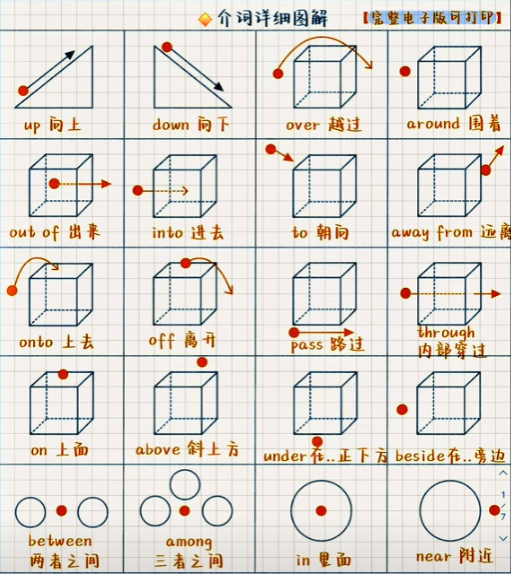

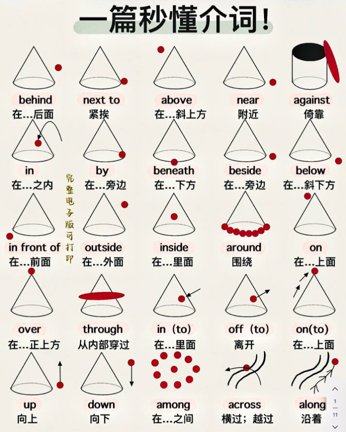

### 在...上面

- **on**：指在与物体表面相接触的上面。
- **above**：指水平位置在某物之上，和 below 相反。
  - The sun rose above the horizon.
  - The jet flew above the clouds.
- **over**：指在某物正上方，和 under 相反；
  - A bridge over the river
- **aboard**：在(船、飞机、公共汽车、火车等)上
  - aboard the plane

### 在...下面

- **beneath**：在 ... 下面
- **below**：指水平位置在某物之下，和 above 相反；
- **under**：指在某物正上方，和 over 相反；

### 在 ... 之间

- **between**：在 ... 之间（两个）
- **among**：在 ... 之间（三个或以上）

### 穿过

- 穿过

  

- **across**：从表面穿过（马路，桥，河...）

  - There's a way across the fields. 

- **through**：从内部穿过（森林，隧道，人群，门窗...）

  - I usually cycle home through the park.

- **over**：从上方越过（栅栏，墙，山...）

- **past**：从旁边经过

## 动向 prep.

## Method prep.

# Verb

## Verb 单三

|           情况           |      规则       |             示例             |
| :----------------------: | :-------------: | :--------------------------: |
|         一般情况         |      加 s       |         walk → walks         |
| o / ch / sh / s / x 结尾 |      加 es      |       watch → watches        |
|    辅音字母加 y 结尾     | 把 y 变 i 加 es |         fly  → flies         |
|    元音字母加 y 结尾     |      加 es      |         buy  → buys          |
|        不规则形式        |        -        | have → has am / are → is |

## Past tense

- **Regular**

  |               情况               |      规则       |      示例      |
  | :------------------------------: | :-------------: | :------------: |
  |             一般情况             |      加 ed      | walk → walked  |
  |        e 结尾且 e 不发音         |      加 d       | dance → danced |
  |        辅音字母加 y 结尾         | 把 y 变 i 加 ed |  cry → cried   |
  |        元音字母加 y 结尾         |      加 ed      | play → played  |
  | 结尾是一个元音字母和一个辅音字母 | 双写辅音，加 ed | stop → stopped |

- **Irregular**

  |                             ...                              |              ...               |               ...                |                             ...                              |                ...                |
  | :----------------------------------------------------------: | :----------------------------: | :------------------------------: | :----------------------------------------------------------: | :-------------------------------: |
  | am / is → was are → were do → did have → had  | go → went come → came  | eat → ate drink → drank  | read → read write → wrote sing → sang say → said tell → told  | buy → bought make → made  |
  |                             ...                              |              ...               |               ...                |                             ...                              |                ...                |

## Present participle

|               情况               |       规则       |      示例       |
| :------------------------------: | :--------------: | :-------------: |
|             一般情况             |      加 ing      | walk → walking  |
|        e 结尾且 e 不发音         |   去 e 加 ing    | dance → dancing |
| 结尾是一个元音字母和一个辅音字母 | 双写辅音，加 ing |  run → running  |

## Tense

- **16 tenses**

  |     Tense      |          Syntax          |       Tense        |        Syntax         |
  | :------------: | :----------------------: | :----------------: | :-------------------: |
  |   一般现在时   |            do            |     现在进行时     |       be doing        |
  |   一般过去时   |           did            |     过去进行时     |   was / were doing    |
  |   一般将来时   | be going to do / will do |     将来进行时     |     will be doing     |
  |   过去将来时   |         would do         |   过去将来进行时   |    would be doing     |
  |   现在完成时   |     have / has done      |   现在完成进行时   | have / has been doing |
  |   过去完成时   |         had done         |   过去完成进行时   |    had been doing     |
  |   将来完成时   |      will have done      |   将来完成进行时   | will have been doing  |
  | 过去将来完成时 |     would have done      | 过去将来完成进行时 | would have been doing |

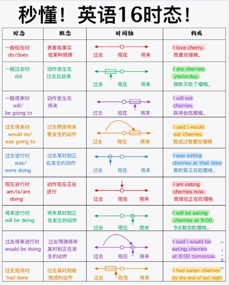

# Syntax

## Syntax

- 100 important syntax

  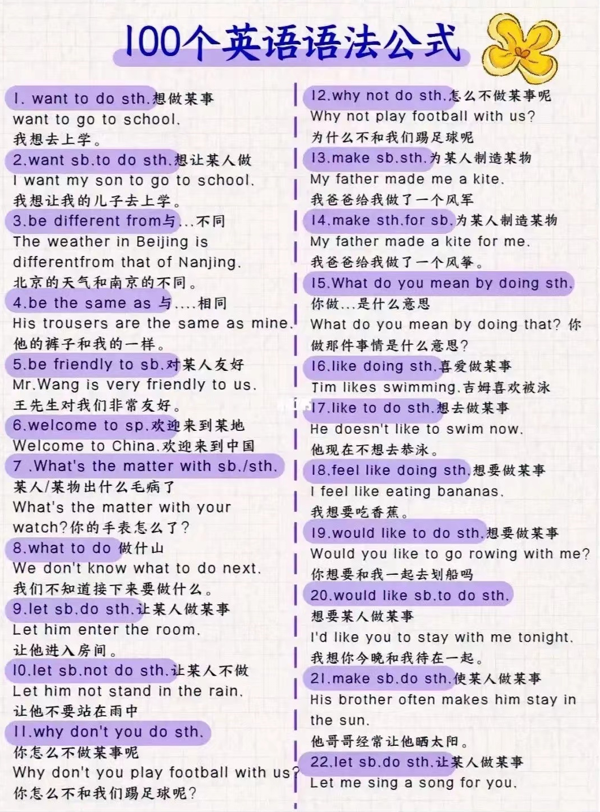

  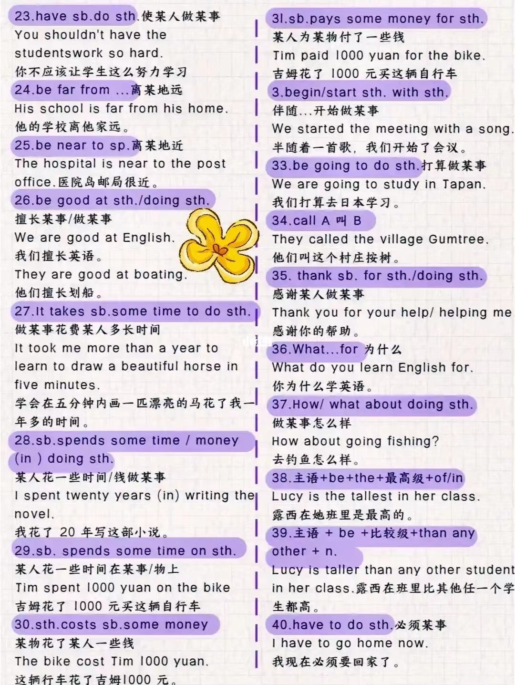

  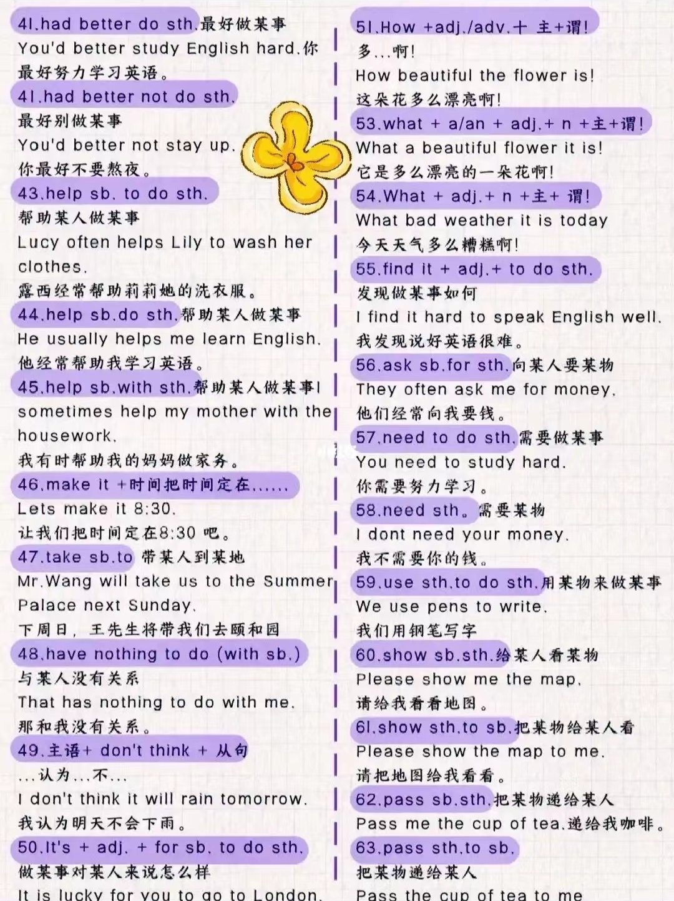

  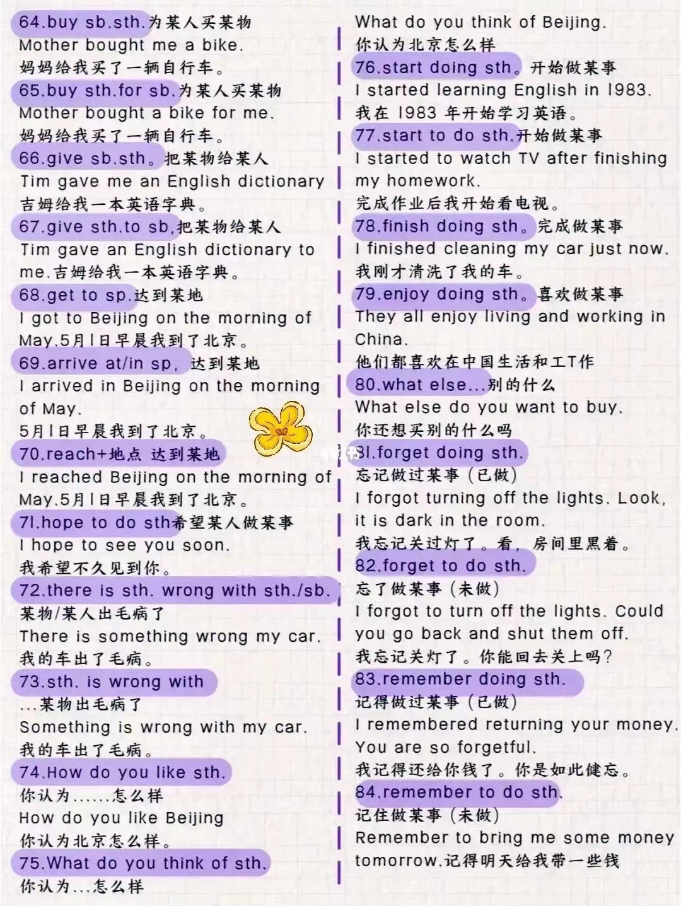

  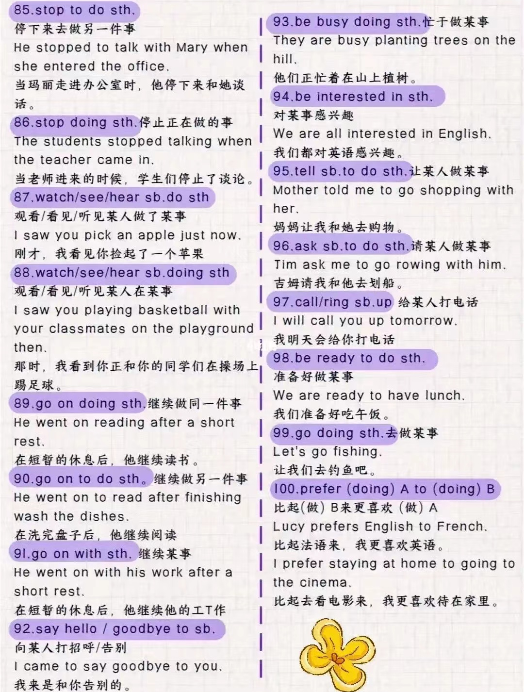

## 口语

- heads up    注意（类似于 be careful），提醒，警告（可用于警示牌标题）

  Heads up, boys! A train is coming.

## 疑问词

| 问地点 |   where   | 问怎样 |       how       |
| :----: | :-------: | :----: | :-------------: |
| 问原因 |    why    | 问身高 |    how tall     |
| 问时间 |   when    | 问长度 |    how long     |
| 问哪个 |   which   | 问大小 |     how big     |
|  问谁  |    who    | 问频率 |    how often    |
| 问谁的 |   whose   | 问多久 |    how soon     |
| 问什么 |   what    | 问年龄 |     how old     |
| 问几号 | what date | 问多少 | how many / much |
| 问星期 | what day  | 问价格 |    how much     |
| 问时间 | what time | 问重量 |    how heavy    |

## 数量

- There be 中 no = not any
- There be 疑问句中把 some 变 any
- a lot of / lots of 很多（形容可数名词）
- a little of 一点（形容不可数名词）
- a (little) bit of 一点（形容不可数名词）
  - bits of
- a certain group of 某些
- a couple of 几个；一对
- a pair of 一对

## 减少

decrease  vi. 下降（大小、数量等数字的减小）

reduce  vt. 减少

## 其它

- another
- other

## 没有

- 没有

  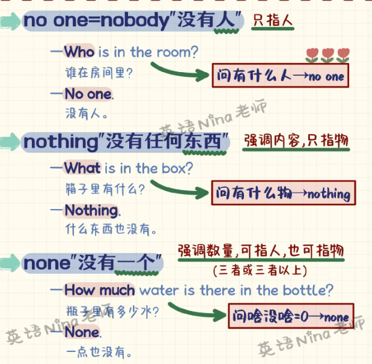

- **nobody = no one**：强调内容，只指人

- **nothing**：强调内容，只指物

- **none**：强调数量，可指人 / 物

  - none of + 复数可数名词，谓语可单可复
  - none of + 不可数名词，谓语必单数

## 时间

- **when**：当 ... 时候
- **while + that**：在 ... 期间
- **during ...**：在 ... 期间
- **whenever**：每当 ...
- **since**：自从 ...
- **till / untill**：直到 ...
- **before**：在 ... 之前
- **after**：在 ... 之后
- **as**：一边 ... 一边 ...
- **as soon as**：一 ... 就 ...
- **hardly ... when ...**：一 ... 就 ...
- **no sooner ... than ...**：一 ... 就 ...
- **once**：一旦 ... 就 ...

## 条件状语从句

- **if**：如果 ...；是否 ...
- **unless**：除非 ...
- **as / so long as**：只要 ...
- **even though / if**：即使 ...

## 因为

- **强调原因**
- because that ...
- because of ...
- due to ...
- owning to ...

## 根据

- **强调标准，后接规定，报告等正式依据**
- according to ...
- on the basis of ...
- as per ...

## 花费

- It takes sb. some time to do sth.
- sth. costs sb. some money on sth.
- sb. spends some time / money (in) doing sth.
- sb. spends some time / money on sth.
- sb. pays some money for sth.

## 做...

- what do you mean by doing sth.
- enjoy doing sth. 喜欢做
- like doing sth. 喜欢做
- like to do sth. 想做
- feel like doing sth. 想做
- would like to do sth. 想做
- be good at (doing) sth. 擅长做
- begin / start sth. with sth. 伴随...开始做...
- be going to do sth. 打算做
- have to do sth. 必须做
- had better (not) do sth. 最好（不）做
- help sb. do sth.
- help sb. to do sth.
- help sb. with sth.

## 让...做...

- Let sb. (not) do sth.
- make sb. do sth.
- have sb. do sth.
- ask sb. to do sth.
- want sb. to do sth.
- would like sb. to do sth.
- why not do sth. / why don't you do sth.

## 相同

- be different from 与...不同

- be the same as 与...相同

- be similar to 与...相似

## 到达

- reach sp.
- get to sp.
- arrive at / in sp.

## 毛病

- What's the matter with sb. / sth.?
- There's something wrong with sb. / sth.
- Something is wrong with sb. / sth.

## 怎么样

- How do you like sth. 认为...怎么样
- What do you think about / of sth. 认为...怎么样
- How / What about doing sth. 做...怎么样

## 开始结束继续

- start to do sth.
- finish doing sth.
- stop 停止
  - stop to do sth. 停下去做另一件事
  - stop doing sth. 停下正在做的事
- go on 继续
  - go on with sth.
  - go on doing sth. 继续做同一件事
  - go on to do sth. 继续去做另一件事

## 请求帮助

- I'm wondering if I could ask you for a favor.

# Number

- **25,476** twenty five thousand, four hundred seventy six
- **fraction** 分数
  - **1/2** one half
  - **1/4** one quarter
  - **3/4** three quarters
  - **2/5** two fifth
- **percent** 百分比
  - **25%** twenty five percent
- **decimal** 小数
  - **0.3** (zero) point three

- **1997年** nineteen ninety seven

# Grammar

## General

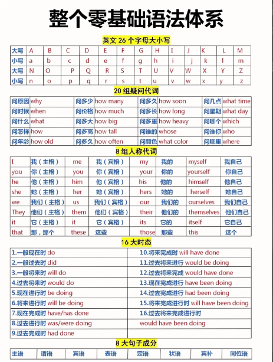

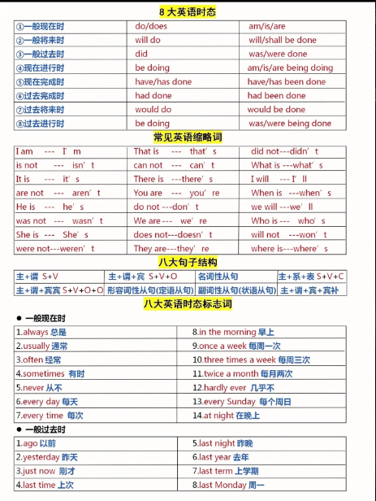

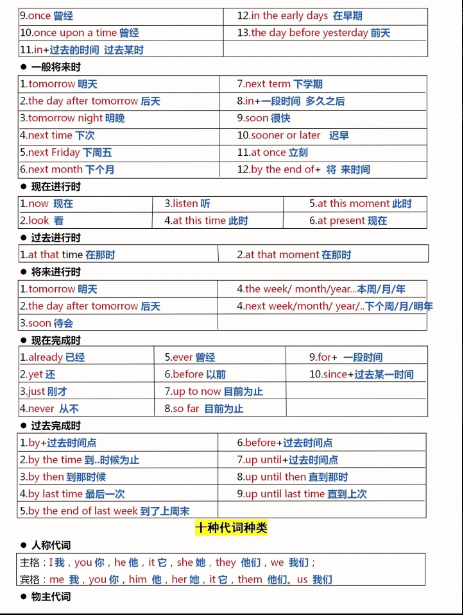

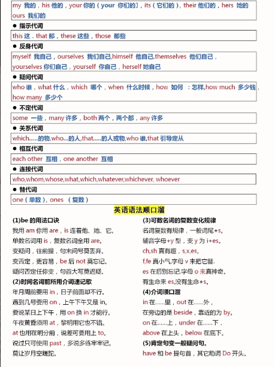

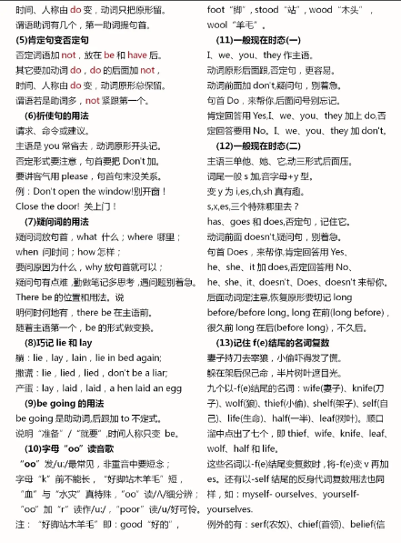

## Sentence

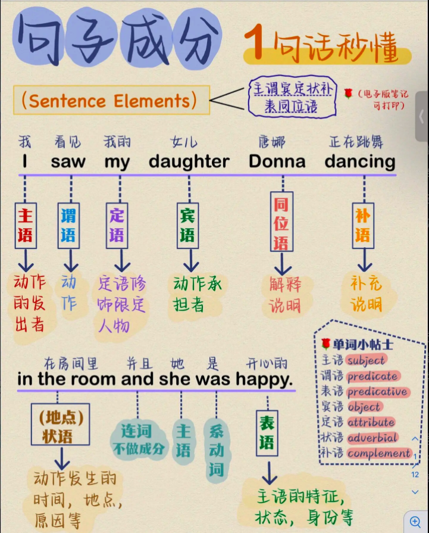

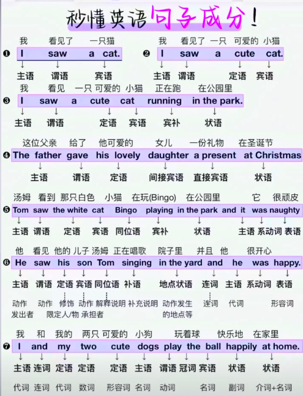

## Part of speech

- **part of speech**  词性
- **v.** 动词 verb
  - **vt.** 及物动词 transitive verb     **e.g.** raise
  - **vi.** 不及物动词 intransitive verb     **e.g.** rise
- **adv.** 副词 adverb     **e.g.** friendly
- **n.** 名词 noun
  - **cn.**/c. 可数名词 countable noun     **e.g.** egg
  - **un.**/u. 不可数名词 uncountable noun     **e.g.** water 
- **pron.** 代词 pronoun     **e.g.** I you he
- **adj.** 形容词 adjective     **e.g.** big red happy
- **prep.** 介词 preposition     **e.g.** on in at
- **art.** 冠词 article
  - **the** 定冠词 definite article
  - **a/an** 不定冠词 indefinite article
- **num.** 数词 number     **e.g.** one to three
- **int.** 感叹词 interjection     **e.g.** wow ouch oops
- **conj.** 连词 conjunction    **e.g.** and but or

# Abbreviation

- abbreviation  n. 缩略词
- General
  - u = you
  - ur = your
  - bc = because
  - THNQ = Thank you
  - thnx = thanks
  - tysm = thank you so much
  - sry = sorry
  - y? = why
  - ofc = of course
  - idk = l don't know
  - ong = on god 哦天哪
  - N1 = nice one 不错
  - sul = see you later
  - sus = see you soon
- Time
  - 2moro = tommorow
  - 2nite = tonight
  - TAM = tommorow A.M.
  - 

# 形近词

- **abroad**

  bored adj. 厌倦的

  broad adj. 宽阔的

  abroad adv. 在国外 n. 国外

  board n. 甲板

  aboard adv./prep. 在(船、飞机、公共汽车、火车等)上

# Spoken language

- spoken language  口语

- **听你的**

  (It's) up to you.

  Anything you say.

- **检查**

  书面 review    口语 go over

- **联系**

  书面 contackt him    口语 reach out to him

- **安排**

  书面 schedule a meeting    口语 set up a meeting

# 口语发音

- 口语发音与单个单词发音的对比
  - 某些音会发生变化
  - 会有省略现象
  - 会有连读现象

## 变音

### [t] →  [d]

- **[t] 在两个元音之间：**

  **city:** ['sɪti] → ['sɪdi]

  **water:** ['wɔ:tər] → ['wɔ:dər]

- **[t] 在 [l] 之前：**

  **little:** ['lɪtl] → ['lɪdl]

- **[t] 在 [r] 和元音之间：**

  **thirty:** [ti] → [sɪdi]

- **to**

  [tu:] → [də]

  **go to:** [gəu tu:] → [gəudə]

- 

### 其它

- **want to**    [wa:ndə]

  [wa:nt tə] → [wa:n~~t~~də]

- **they're**    [ðeə]

  [ðeɪr] → [ðeə]

## 省略

### t

- t 后接辅音，则省略 t

  last week    [læs~~t~~ wi:k] → [læs wi:k]

- ~t 后接 ed，则省略 t

  wanted to    [wa:n~~t~~ɪd tu:] → [wa:nɪdə]

### h

- h 作为第一个字母

  Does he have a  [dʌz~~h~~i:~~h~~ævə] → [dʌzi:ævə]

- **Excuse me**    [~~ɪk~~'skjuz me]

### 其它

- **for**    [fər] → [fə]

- **It's a**    [~~ɪ~~ts ə] → [tsə]

  It's about time    [~~ɪ~~ts ə'baʊ~~t~~ taɪm] → [tsə 'baʊ taɪm]

## 连读

I have got a    [aɪvgɔdə]

did you    [dɪjə]

**give him a bottle**    [gɪvɪmə] bottle

**should have been**    [ʃʊdəv] been

## 其它

jumped out of    [dʒʌmtautəv]

