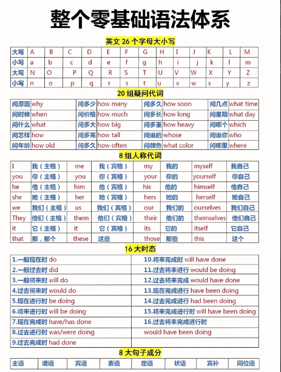
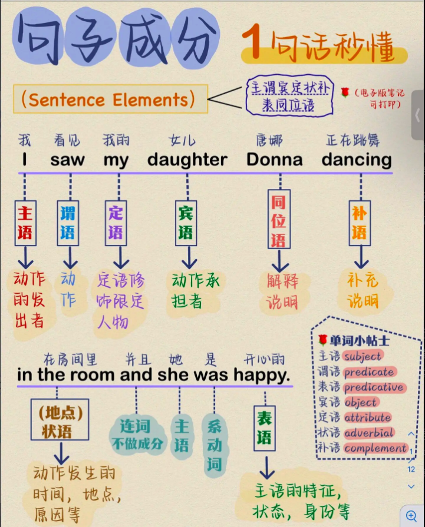
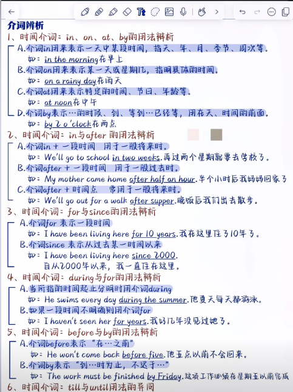
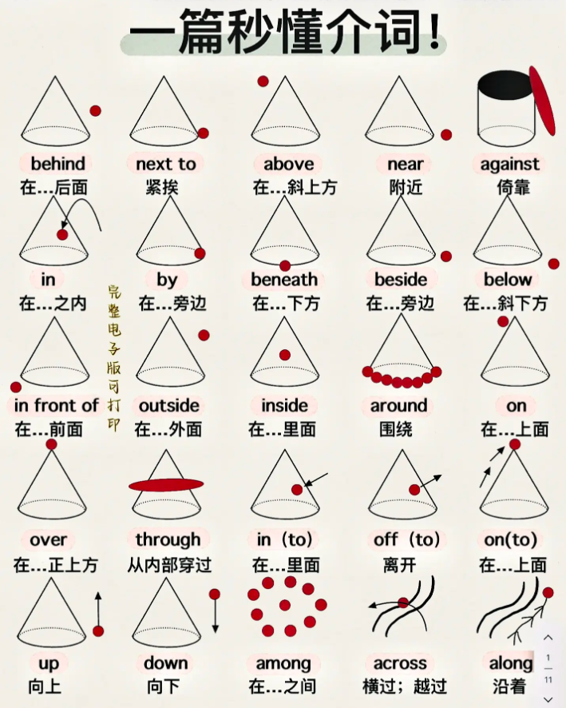
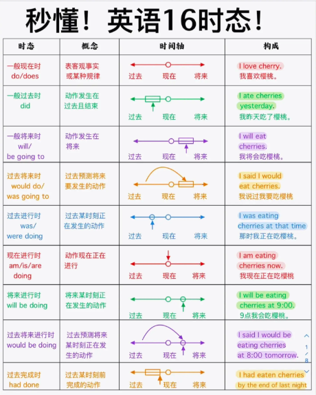

# 语法体系

## 语法体系

## 句子成分

# 名词

## 名词分类

- 普通名词
    - 可数名词
        - 个体名词：表示作为个体而存在的人或事物：boy book week dream
        - 集体名词：表示若干个人和事物的总称：family committee police   data
    - 不可数名词
        - 物质名词：表示物质、材料的总称：air sand
        - 抽象名词：表示性质、行为、状态、情感等抽象概念的名称：peace freedom  fun
- 专有名词

## 可数名词复数

### 规则变化

- 一般情况，词尾加 -s，parent——parents 父母
- 以 -s，-x，-ch，-sh 结尾，加 -es，glass——glasses 玻璃
    - 特例：词尾 -ch 发音为 / ｋ /，加 -s，stomach——stomachs 胃

- 以 -y 结尾
    - 以辅音字母加 -y 结尾，把 -y 变 -i 加 -es，factory——factories 工厂
    - 以元音字母加 -y 结尾，加 -s，boy——boys 男孩

- 以 -o 结尾
    - 以辅音字母加 -o 结尾，加 -es，potato——potatoes 土豆
    - 以元音字母加 -o 结尾，加 -s，zoo——zoos 动物园

- 以 -f，-fe 结尾，把 -f，-fe 变 -v 再加 -es，wolf——wolves 狼，knife——knives 刀
    - 特例：以 -f 结尾，直接加 -s 的名词：roof 屋顶，chief 首领，belief 信仰，proof 证据，chef 厨师。

### 不规则变化

- 改变内部元音

    - man——men 男人
    - woman——women 女人
    - foot——feet 脚
    - tooth——teeth 牙齿
    - goose——geese 鹅
    - mouse——mice 老鼠（注意此处 s 变 c）

- 单复数同形

    - sheep 绵羊
    - deer 鹿
    - Chinese 中国人
    - Japanese 日本人
    - Swiss 瑞士人
    - means 方法
    - crossroads 十字路口
    - series 一系列
    - species 种类
    - works 工厂
    - head 头（牲畜数量）

- 同一名词，不同意义

    - work 

      a work by Mark 一部马克的作品  
      two works by Mark 两部马克的作品  
      a chemical works 一家化工厂  
      two chemical works 两家化工厂

    - fish

      two fish 两条鱼  
      two fishes 两种鱼

    - people

      two people 两个人  
      two peoples 两个民族

### 由两部分构成的物体

trousers，shorts 等名词不能用基数词修饰，其前也不能直接加不定冠词 a/an，但可以用 a pair of，two pairs of，many 等词修饰。

I need a new pair of trousers for work. 我需要一条上班穿的裤子。

### 复合名词

- 没有连字符，最后一个名词变复数。  
  housewife——housewives 家庭主妇

- 组成复合名词的单词中没有名词，在最后加 -s。  
  grow-up——grow-ups 成年人

- 有连字符，将复合名词中主要的名词变复数。  
  passer-by——passers-by 路人  
  daughter-in-law——daughters-in-law 儿媳妇

- man，woman 为复合名词的第一部分时，复合名词的各个部分皆变为复数  
  a man cook——men cooks 男厨师  
  a woman teacher——women teachers

### 注意

- 某些表示学科的名词，虽然结尾以 -s 结尾，但并非复数形式。作主语时，谓语动词要用单数形式。如 maths 数学，physics 物理学，economics 经济学。  
  Physics is difficult for me. 对于我来说物理很难。

- 单复数同形的名词在使用时要注意其谓语动词的单复数形式变化。  
  Every means has been tried. 每种方法都试过了。  
  All means have been tried. 所有方法都试过了。

- 表示“某国人”的名词变复数的三种形式
    - “中日瑞不变”
    - 词尾的 -man 变 -men，如 Frenchman——Frenchmen；但“德国人（German——Germans）”除外。
    - 词尾直接加 -s，如 American——Americans。

## 不可数名词

### 雷打不动的不可数名词

某些不可数名词，即使前面有形容词修饰，也不能使用定冠词 a/an。

news 新闻，information 信息，work 工作，advice 建议，progress 进步，weather 天气，fun 乐趣，equipment 设备，jewellery 珠宝，luck 运气，music，health 健康，furniture 家具  
  We have so much bad luck. 我们有太多的厄运。  
  I have good news to tell you. 我有好消息告诉你。  
  He made such rapid progress. 他进步如此快。

### 同词不同义

某些不可数名词转可数名词后，意义发生变化。

glass 玻璃——a glass 一个玻璃杯  
paper 纸——a paper 一份论文/报纸/试卷

### 抽象名词具体化  

honour 尊重——an honour 一件荣幸的事  
pleasure 愉快——a pleasuer 一件乐事  
success 成功——a success 一个成功的人或事

I feel it a great honour to stand here to deliver a speech.  
站在这里演讲我感到非常荣幸。

Being able to afford a drink would be a comfort in tough times.  
在困难时期能买得起已被饮料是一件令人感到欣慰的事。

## 名词所有格

名词的所有格（Possessive form）用于表示某物或某人属于谁。

### 在词尾加 -s 构成所有格

- 一般单数名词，在词尾加 `'s`  
  today's newspaper 今天的报纸  
  China's population 中国的人口

- 以 -s 结尾的单数名词或专有名词，在结尾加 `'` 或 `'s`，读作 / ɪｚ/。  
  Dicken‘（s) novels 狄更斯的小说  
  the boss'(s) order 老板的命令

- 以 -s 或 -es 结尾的复数名词，结尾只加 `'`。  
  two hours' walk 步行两小时的路程  
  the masses' advice 群众的意见

- 不以 -s 或 -es 结尾的复数名词，结尾加 `'s`。  
  women’s clothes 女装

- 复合名词，在最后一个词的词尾加 `'s`  
  his son-in-law's car 他女婿的轿车

### 由“of + 名词”构成所有格

- 用于无生命的东西  
  the top of the hill 山顶

- 表示“有关，关于”  
  a story of love and hartred 一个关于爱与恨的故事

- 表示同位关系  
  the city of Pisa 比萨市

- 表示部分与整体关系  
  the majority of people 大多数人

- 表示抽象概念  
  the cost of living 生活费

### 双重所有格

双重所有格（Double possessive）是指在同一句话中同时使用 "of" 和 "possessive 's"，用于表示某人/某物是某个更大范围的一部分。

Some friends of my brother's will join us.  
我哥哥的一些朋友将加入我们。

## 名词的句法功能

名词（短语）在句子中可以作主语、宾语、补足语、表语、同位语、状语、定语等。

- 作主语  
  Honesty is the best policy. 诚信为本。

- 作宾语  
  Teenagers today are facing lots of pressure. 现在的青少年面临很多压力。

- 作补足语  
  We're sparing no effort to make our country a developed country.  
  我们正不遗余力地使我们的国家成为一个发达国家。

- 作表语  
  Water shortages are still the biggest problem in western China.  
  用水短缺依然是中国西部最大的问题。

- 作同位语  
  There is no cure for influenza, a common disease.  
  流行感冒是一种常见的疾病，无特效药。

- 作状语  
  Come this way! 到这来！

- 作定语  
  In the south of China, there are many banana trees.  
  在中国南方有很多香蕉树。

# 代词

|       | 主格  | 宾格  |  反身代词  | 名词性物主代词 | 形容词性物主代词 |
| :---: | :---: | :---: | :--------: | :------------: | :--------------: |
|  谁   |  who  | whom  |     -      |                |      whose       |
|  我   |   I   |  me   |   myself   |      mine      |        my        |
|  你   |  you  |  you  |  yourself  |     yours      |       your       |
|  他   |  he   |  him  |  himself   |      his       |       his        |
|  她   |  she  |  her  |  herself   |      hers      |       her        |
|  它   |  it   |  it   |   itself   |      its       |       its        |
| 我们  |  we   |  us   | ourselves  |      ours      |       our        |
| Ta 们 | they  | them  | themselves |     theirs     |      their       |
|  这   | this  | this  |     -      |       -        |       this       |
|  那   | that  | that  |     -      |       -        |       that       |
| 这些  | these | these |     -      |       -        |      these       |
| 那些  | those | those |     -      |       -        |      those       |

## 人称代词

**人称代词**用来代替人或事物的名字，避免重复使用名词。它有人称、单复数和主宾格的变化。

<table style="text-align: center;">
  <tr>
    <th rowspan="2">人称</th>
    <th colspan="2">单数</th>
    <th colspan="2">复数</th>
  </tr>
  <tr>
    <th>主格</th>
    <th>宾格</th>
    <th>主格</th>
    <th>宾格</th>
  </tr>
  <tr>
    <td>第一人称</td>
    <td>I</td>
    <td>me</td>
    <td>we</td>
    <td>us</td>
  </tr>
  <tr>
    <td>第二人称</td>
    <td>you</td>
    <td>you</td>
    <td>you</td>
    <td>you</td>
  </tr>
  <tr>
    <td rowspan="3">第三人称</td>
    <td>he</td>
    <td>him</td>
    <td rowspan="3">they</td>
    <td rowspan="3">them</td>
  </tr>
  <tr>
    <td>she</td>
    <td>her</td>
  </tr>
  <tr>
    <td>it</td>
    <td>it</td>
  </tr>
</table>

### 人称代词的句法功能

- **一般用法**

    作主语时用主格  
    作宾语时用宾格  
    作表语时一般用宾格

- 在电话中交谈时常用主格形式代替宾格形式。

    —Is that Mr. Li?  
    —Yes, this is he.

- 在 It is...who... 强调句型中，用主格代替宾格

    It was **I** who did it.

### 人称代词的排序

- 单数场合：you + he/she + I

    You, he and I are of the same age.  
    你、他和我是同龄人。

- 复数的场合：we + you + they

    We, you and they are all Chinese.  
    我们、你们和他们都是中国人。

- 两性并列：he + she

    He and she don't agree with me.  
    他和她都不同意我的看法。

- 表示承担责任：把第一人称放在第一位

    I and he are to blame for the accident.  
    我和他应为这起事故承担责任

## 物主代词

物主代词表示人和物的从属关系。

<table style="text-align: center;">
  <tr>
    <th rowspan="2">人称</th>
    <th colspan="5">单数</th>
    <th colspan="3">复数</th>
  </tr>
  <tr>
    <th>我的</th>
    <th>你的</th>
    <th>他的</th>
    <th>她的</th>
    <th>它的</th>
    <th>我们的</th>
    <th>你们的</th>
    <th>他/她/它们的</th>
  </tr>
  <tr>
    <td>形容词性物主代词</td>
    <td>my</td>
    <td>your</td>
    <td>his</td>
    <td>her</td>
    <td>its</td>
    <td>our</td>
    <td>your</td>
    <td>their</td>
  </tr>
  <tr>
    <td>名词性物主代词</td>
    <td>mine</td>
    <td>yours</td>
    <td>his</td>
    <td>hers</td>
    <td>its</td>
    <td>ours</td>
    <td>yours</td>
    <td>theirs</td>
  </tr>
</table>

### 形容词性物主代词

- **形容词性物主代词置于名词之前，作定语。**

    In the winter of 1891, a certain college had some trouble with **its** boy students.  
    在1891年冬季，某所大学的男学生遇到了一些麻烦。

### 名词性物主代词

- **名词性物主代词相当于“形容词性物主代词 + 名词”，作主语、表语和宾语。**

    This camera is **mine** and that is **yours**.  
    这部照相机是我的，那部是你的。

- **“of + 名词性物主代词” 可用作定语**

    I am an admirer **of yours**.  
    我是你的一名崇拜者。

## 反身代词

反身代词用于指代主语，表示“...自己”。可作宾语、表语和同位语，一般不用作主语。

<table style="text-align: center;">
  <thead>
    <tr>
      <th></th>
      <th>单数</th>
      <th>复数</th>
    </tr>
  </thead>
  <tbody>
    <tr>
      <td>第一人称</td>
      <td>myself</td>
      <td>ourselves</td>
    </tr>
    <tr>
      <td>第二人称</td>
      <td>yourself</td>
      <td>yourselves</td>
    </tr>
    <tr>
      <td>第三人称</td>
      <td>himself, herself, itself</td>
      <td>themselves</td>
    </tr>
  </tbody>
</table>

## 指示代词

用来指示或标记人或事物的代词，表示“这个/些”“那个/些”。

<table border="1" cellpadding="8" cellspacing="0">
  <thead>
    <tr>
      <th></th>
      <th>单数</th>
      <th>复数</th>
    </tr>
  </thead>
  <tbody>
    <tr>
      <td>这（近）</td>
      <td>this</td>
      <td>these</td>
    </tr>
    <tr>
      <td>那（远）</td>
      <td>that</td>
      <td>those</td>
    </tr>
  </tbody>
</table>
### 指示代词句法

可用作主语、宾语、定语和表语。

### 指示代词用法

- **this 和 these 指代时间或空间上较近的人或物；that 和 those 指代时间或空间上较远的人或物。**

    This picture was painted by Robert and that one by Bruse.  
    这幅画是罗伯特画的，那幅是布鲁斯画的。

- **that 和 those 常用来指代上文已提到的名词，以避免重复。**

    The climate of China is quite similar to that of the USA.  
    中国的气候和美国的气候很相似。

- **打电话时，this 指自己，that 指别人。**

- **将要发生或将要提到的事用 this；刚提到过或已经发生的事用 that。**

    This is going to surprise you.  
    这件事会让你吃惊的。

    Little George broke the vase, but he didn't admit. That was very annoying.  
    小乔治打碎了花瓶，但他不承认。那太令人生气了。

- **this 和 that 还可以用作副词，表示程度，相当于 so。**

    The weather isn't that hot.  
    天气没那么热。

## 不定代词

不明确指代某个人、某个事物、某些人、 某些事物的代词叫不定代词。不定代词可以代替名词或形容词，表示不同的数量 概念。不定代词在句中可作主语、宾语、表语、 定语。

|  不定代词  | 基本用法  |
| -------- | -------- |
| all, both, each, neither, either, much, little, many, few, other, another, some, any, one | 可作主语、宾语、表语或定语 |
| everyone, everybody, everything, someone, somebody, something, anyone, anybody, anything, no one, nobody, nothing, none | 可作主语、宾语或表语 |
| every, no | 只能作定语  |

### no one、nothing 和 none

- no one = nobody，指代对象为人；nothing 指物；none 可指人或物。
- 一般使用 none 接 of 短语，而不是用 no one。
- none 一般强调数量，而 no one 强调有没有。

    —How many students are in the class?  
    —None.

    —Who is in the class?  
    —No one.

### every 和 each

- every 指三个或三个以上中的每个；只能用作定语。
- each 指两个或两个以上中的每个；可作主语、宾语、定语、同位语；作主语的同位语时，谓语动词和主语保持一致。

### other 和 another

- another 强调“再一个/些”

    I need another cup of coffee.  
    我需要再来一杯咖啡。

- other 强调“另外的”

    No matter what other people may say, I'll stick to my plan.  
    不管别人可能会说什么，我都会坚持我的计划。

- others = other + 名词复数

    In some countries, people eat with chopsticks, while in others, knives and forks.  
    在一些国家，人们用筷子吃饭，而在另外一些国家，人们用刀叉吃饭。

- the other：表示两者中的另外一个

    On one side of the river grow willows, and on the other side grow poplars.  
    河的一岸长着柳树，另一岸长着杨树。

### 三三两两

| 词义     | 指两个人或物          | 指三个或三个以上的人或物 |
| :------: | :-------------------: | :----------------------: |
| 每一个   | each (也可指两个以上) | every                    |
| 任何一个 | either                | any                      |
| 另一个   | the other             | another                  |
| 都       | both                  | all                      |
| 都不     | neither               | none                     |

# 形容词

修饰名词和部分代词，表示人或事物的性质、状态和特征的词叫**形容词**。除修饰名词作定语外，形容词还常作表语和补语。

## 比较级和最高级的构成

### 规则变化

|   构成   |   原级   |  比较级  |  最高级  |
| :-----: | :------: | :-----: | :-----: |
| 普通单音节词，在词尾加 -er，-est | strong | stronger | strongest |
| 以字母 e 结尾的单音节词，只在词尾加 -r，-st | late | later | latest |
| 以一个辅音字母结尾的闭音节单音节词，双写辅音字母后再加 -er，-est | hot | hotter | hottest |
| 以“辅音字母 + y”结尾的单词，把 y 变 i ，再加 -er，-est | happy | happier | happiest |
| 其他双音节词和多音节词，在词前加 more 和 most | enthusiastic | more enthusiastic | most enthusiastic |

- 有少数几个双音节词以及以 -er 及 -le 结尾的词，可以有两种比较级和最高级形式。

    common → commoner / more common → commonest / most common  
    clever → cleverer / more clever → cleverest / most clever  
    simple → simpler / more simple → simplest / most simple

- 有些复合形容词有两种比较级和最高级形式。

    well-known → bette-known / more well-known → best-known / most well-known

### 不规则变化

|   原级   |  比较级  |  最高级  |
| :------: | :-----: | :-----: |
| good，well（健康的） | better | best |
| bad | worse | wost |
| little（少的） | less | least |
| many，much | more | most |
| far | farther / further | farthest / furthest |
| old | older / elder | oldest / eldest |

- far 的说明

    farther，farthest 表示**物理**意义上的远  
    further，furthest 表示**抽象**意义上的远

- old 的说明

    older，oldest 更常用于大多数情况，尤其是普通比较。  
    Elder 和 Eldest 多用于家庭中，表示“年纪较大的”兄弟姐妹或家庭成员。

## 比较级

比较级表示在两部分中程度较高者。

### 比较级基本用法

|    结构   |   意义   |
| :------: | :-----: |
| 比较级 + than | 比...更...|
| not + 比较级 + than | 不比...更...|
| no + 比较级 + than | 和...一样不...|

- **比较级 + than**：比...更...

    He made more mistakes than you (did).  
    他犯的错比你多。

- **not + 比较级 + than**：不比...更...

    My English is not better than yours.  
    我的英语不比你的英语更好。

- **no + 比较级 + than**：和...一样不...

    He is no taller than his brother.  
    他和他的哥哥一样不高。

- **比较级有时可单独使用，其比较的对象暗含于句中。**

    Are you feeling better today?（与原来相比）  
    你今天感觉好一些了么？

    Further discussion will be held tomorrow.（与现在相比）  
    进一步的讨论将于明天进行。

### 比较级常见错误

- **修饰词出现错误**：more 不可修饰比较级，但可以用 much 来增强比较级，译为“...得多，更...”。

    She looks **much** younger than me.（不可使用 more）  
    她看上去比我年轻得多。

- **比较的对象出现错误**

    The weather of Beijing is colder than **that of** Shanghai.（不可去掉 that of）  
    北京的天气比上海的冷。

- **比较的范围出现错误**

    China is larger than any other country in Asia.（不可去掉 other）  
    中国比亚洲其他任何国家都大

### 比较级特殊用法

- **no more than = only**：仅仅，不超过

    The winner is no more than 10 years old.  
    这个获胜者年仅10岁。

### 比较级的修饰语

比较级常用修饰语：rather，much，still，ever，far，any，a lot，a little，a great deal，by far，a bit

Tom works even harder than before.  
汤姆比以往工作更努力了。

## 最高级

最高级表示在三者或三者以上中程度最高者。

### 最高级用法

- **最高级基本用法**

    **the 形容词最高级（+ 名词）+ 表示范围的短语或从句**

    This is the oldest theater in London.  
    这是伦敦最古老的剧院。

    Shanghai is one of the largest cities in China.  
    上海是中国最大的城市之一。

- **比较级形式表达最高级意义**

    **比较级 + than + 整体中的其它**

    Rose is taller than any other girl in her class.  
    Rose is taller than (any of) the other girls in her class.  

- **“否定词 + 比较级”表示最高级**

    I have never heard a better voice than yours.  
    Your voice is the best voice that I have ever heard.  
    我从未听过比你的嗓音更好的。

### 最高级修饰语

**最高级常用修饰语**：序数词，much，by far，nearly，almost

The Yellow River is the second longest river in China.  
黄河是中国的第二长河。

Of the three girls, Betty is much the cleverest.  
这三个女孩中，贝蒂是最聪明的。

This is by far the best book that I've ever read.  
这是我迄今读过的最好的书。

## 形容词技巧

- -ing 形容词描述引起感觉的**事物**，常译为“令人...的”。

    The movie was **boring**.  
    这电影很无聊。（电影让人无聊）

- -ed 形容词描述人或动物对某件事的**感受**，是**被动状态**，常译为“感到...的”。

    I’m **bored**.  
    我很无聊。（我被无聊到了）

# 副词

副词是指在句子中表示行为或状态特征的词，用以修饰动词、形容词、其他副词、数词、 介词短语乃至全句，表示时间、地点、程度、方 式等概念。

## 简单副词

here 这儿  
there 那  
quite / rather 相当  
now 现在  
then 那时

**某些副词和形容词形式相同**：

| 单词 | 形容词词义 | 副词词义 |
| :----: | :----: | :----: | 
|  fast  |  快的  |   快地  |
|  early |  早的  |   提早  |
| straight | 直的 |  径直地 |
|  hard  |  硬的  |  努力地 |
|  late  |  晚的  |   晚   |
| enough | 足够的 |  足够地 |
|  long  |  长的  | 长时间地 |
|  very  | 正是的 |  非常  |

## 复合副词

somewhere 在某处  
somehow 不知怎么  
somewhat 有点  
therefore 因此  
nowhere 什么地方都不

## 派生副词

- **形容词 + ly**

    |          情况       |         构成       |        例词        |
    | :----------------: | :---------------: | :---------------: |
    |      一般形容词      |       加 -ly       |  quick → quickly  |
    |  以“辅音字母 + y”结尾 | 把 y 变 i，再加 -ly |   easy → easily   |
    | 以“辅音字母 + le”结尾 |     去 e 加 -y     |  simple → simply  |
    |  以“元音字母 + e”结尾 |     去 e 加 -ly    |    true → truly   |
    |     以 -ll 结尾     |       只加 -y       |   full → fully   |
    |     以 -ic 结尾     | 加 -ally | scientific → scientifically |

- **两种副词形式**

    | 形容词 | 副词（与形容词同形） | 副词（形容词 + -ly） |
    | :---: | :--------------: | :---------------: |
    | close 近的；亲密的 | clse 接近（距离）| closely 密切地 |
    | deep 深的 | deep 深深地 | deeply 至深；非常 |
    | high 高的 | high 在高处 | highly 高度地 |
    | free 自由的；免费的 | free 免费地 | freely 自由地 |
    | near 近的 | near 在附近；几乎；不久以后 | nearly 几乎；将近 |
    | hard 硬的 | hard 努力地 | hardly 几乎不 |

## 副词的比较级和最高级

- 副词的比较级和最高级的构成同形容词

# 介词

## 时间介词

### at

at 表示具体时间、时刻

- at daybreak/noon/dusk/night/midnight 在黎明/中午/黄昏/晚上/午夜
- at 10 o'clock 在10点

### on

on 表示具体某一天或特定某一天的上午、下午、晚上

- on May 1st 在5月1日
- on Monday
- on New Year's  Day
- on my birthday
- on Friday morning
- on the weekend

### in

in 表示较长的时间段（朝代、世纪、年代、年份，季节，月份等）或泛指的上午、下午、晚上

- in the Tang Dynasty 在唐朝
- in the 21st century 在21世纪
- in the 1990s/1990's 在20世纪90年代
- in 2025 在2025年
- in spring 在春季
- in January 在一月
- in the morning/afternoon/evening

### by 和 before

- by 10 o'clock 表示不迟于10点，**包括10点**。
- berore 10 o'clock 表示在10点之前，**不包括10点**

### during，through 和 over

### for，from 和 since

## 位置介词

### 在...上面

- **on**：指在与物体表面相接触的上面。
- **above**：指水平位置在某物之上，和 below 相反。
  - The sun rose above the horizon.
  - The jet flew above the clouds.
- **over**：指在某物正上方，和 under 相反；
  - A bridge over the river
- **aboard**：在(船、飞机、公共汽车、火车等)上
  - aboard the plane
  - go aboard 上船

### 在...下面

- **beneath**：在 ... 下面
- **below**：指水平位置在某物之下，和 above 相反；
- **under**：指在某物正上方，和 over 相反；

### 在 ... 之间

- **between**：在 ... 之间（两个）
- **among**：在 ... 之间（三个或以上）

### 穿过

- 穿过

  

- **across**：从表面穿过（马路，桥，河...）

  - There's a way across the fields. 

- **through**：从内部穿过（森林，隧道，人群，门窗...）

  - I usually cycle home through the park.

- **over**：从上方越过（栅栏，墙，山...）

- **past**：从旁边经过

## 动向介词

## 方式介词

# 冠词

## 不定冠词

不定冠词表泛指。

- a 用在辅音音素前
- an 用在元音音素前

## 定冠词

定冠词表特指。

- 表特指

    Do you know the woman standing under the tree?

- 在姓氏复数前表全家人或夫妇俩

    The Whites are watching TV.  
    怀特一家人在看电影。

- 演奏西方乐器

    play the piano/violin/guitar

- 普通名词构成的专有名词

    the Summer Palace 颐和园  
    the Great Wall 长城  
    the Middle East 中东  
    the Yellow River 黄河

- 形容词指代一类人或事物

    the young 年轻人  
    the unknown 未知的事物

- 用在计量单位前

    by the pound/kilo/dozen/foot/hour  
    按磅/千克/打/英尺/小时

- 某些时间

    世纪：the 21st century 21世纪  
    年代：the 1990s/1990's 20世纪90年代  
    朝代：the Tang Dynasty 唐朝  
    中国节日：the Spring Festival

## 零冠词

# 动词

## 时态

- **16 种时态**

    |     Tense      |          Syntax          |       Tense        |        Syntax         |
    | :------------: | :----------------------: | :----------------: | :-------------------: |
    |   一般现在时   |            do            |     现在进行时     |       be doing        |
    |   一般过去时   |           did            |     过去进行时     |   was / were doing    |
    |   一般将来时   | be going to do / will do |     将来进行时     |     will be doing     |
    |   过去将来时   |         would do         |   过去将来进行时   |    would be doing     |
    |   现在完成时   |     have / has done      |   现在完成进行时   | have / has been doing |
    |   过去完成时   |         had done         |   过去完成进行时   |    had been doing     |
    |   将来完成时   |      will have done      |   将来完成进行时   | will have been doing  |
    | 过去将来完成时 |     would have done      | 过去将来完成进行时 | would have been doing |

### 一般现在时

#### 动词单三

|           情况           |      规则       |             示例             |
| :----------------------: | :-------------: | :--------------------------: |
|         一般情况         |      加 s       |         walk → walks         |
| o / ch / sh / s / x 结尾 |      加 es      |       watch → watches        |
|    辅音字母加 y 结尾     | 把 y 变 i 加 es |         fly  → flies         |
|    元音字母加 y 结尾     |      加 es      |         buy  → buys          |
|        不规则形式        |        -        | have → has am / are → is |

### 一般过去时

#### 动词过去式

- 规则变化

  |               情况               |      规则       |      示例      |
  | :------------------------------: | :-------------: | :------------: |
  |             一般情况             |      加 ed      | walk → walked  |
  |        e 结尾且 e 不发音         |      加 d       | dance → danced |
  |        辅音字母加 y 结尾         | 把 y 变 i 加 ed |  cry → cried   |
  |        元音字母加 y 结尾         |      加 ed      | play → played  |
  | 结尾是一个元音字母和一个辅音字母 | 双写辅音，加 ed | stop → stopped |

- 不规则变化

  |                             ...                              |              ...               |               ...                |                             ...                              |                ...                |
  | :----------------------------------------------------------: | :----------------------------: | :------------------------------: | :----------------------------------------------------------: | :-------------------------------: |
  | am / is → was are → were do → did have → had  | go → went come → came  | eat → ate drink → drank  | read → read write → wrote sing → sang say → said tell → told  | buy → bought make → made  |
  |                             ...                              |              ...               |               ...                |                             ...                              |                ...                |

### 一般将来时

### 现在进行时

#### 动词-ing

|               情况               |       规则       |      示例       |
| :------------------------------: | :--------------: | :-------------: |
|             一般情况             |      加 ing      | walk → walking  |
|        e 结尾且 e 不发音         |   去 e 加 ing    | dance → dancing |
| 结尾是一个元音字母和一个辅音字母 | 双写辅音，加 ing |  run → running  |

## 被动语态

## 非谓语动词

# 并列复合句

英语中的复合句由**并列复合句**和**主从复合句**组成。

由**并列连词**把两个或两个以上的简单句连在一起的句子叫**并列复合句**。

## 并列关系

表并列关系的连词：and，not only...，but also... 等

She dances well and he sings well.

她舞跳得好，他歌唱得好。

## 转折关系

表转折关系的连词：but，yet, while 等。

Honey is sweet, but the bee stings.  
蜂蜜是甜的，但蜜蜂会蜇人。

It's a small car, yet it's surprisingly spacious.  
这辆轿车小，然而宽敞得出奇。

He likes pop music while I am fond of classical music.  
他喜欢流行音乐，而我喜欢古典音乐。

## 因果关系

表因果关系的连词：far，so 等。

He didn't attend the meeting, for he was ill.  
他由于病了，没有参会。

It was still painful so I went to see a doctor.  
那地方还疼，因此我去看了医生。

## 选择关系

表选择关系的连词：or，either...or... 等。

Either you come to my house or I go to yours.  
或者你到我家来，或者我到你家去。

## when

when 可用作并列连词。

We were having a meeting when someone broke in.  
我们正在开会，这时突然有人闯进来。

# 定语从句

在主从复合句中作定语，修饰名词、代词等的从句叫定语从句，定语从句的作用相当于形容词。

I'll forever cherish the days when I studied abroad.  
我将永远珍视我在国外学习的日子。

## 先行词

被定语从句修饰的名词、代词等称为**先行词**，一般出现在定语从句之前。有时先行词是整个主句。

- **一个词作先行词**

    This is the **museum** which was built last year.  
    这就是去年建成的那个博物馆。

- **整个主句作先行词**

    **They sent my child to the school every morning**, which I considered a great help to me.  
    他们每天早晨送我的孩子去学校，我认为这对我是极大的帮助。

## 关系词

### 关系词

引导定语从句的词被称为**关系词**。

- **关系代词**

    who，whom，whose，that，which，as

- **关系副词**

    when，where，why

- **省略关系词**：关系词在限制性定语从句中作宾语时，可省略。

    I know the girl (who/that) you met yesterday.  
    省略后：I know the girl you met yesterday.

The boys **who/that** are playing football are from Class One.  
正在踢足球的男孩们是一班的。

I'll cherish the moment **when** I met Lisa.  
我将珍视我和莉萨见面的时刻。

Is there a shop around **where** we can get fruit?  
附近有没有我们能买到水果的商店？

We don't know the reason **why** they didn't attend the meeting.  
我们不知道他们没有参会的原因。

### 关系代词 as 的用法

- 引导限制性定语从句时，主要用于 the same...as...，such...as...，so...as... 等结构，既可指人也可指物。

    We have found such materials as are used in their factory.  
    我们已经找到了他们工厂里用的那种材料。

- 引导非限制性定语从句，其先行词是整个主句时，常译成“正如，正像”。

    As everybody knows, Shakespeare is a famous writer.  
    正如每个人都知道的那样，莎士比亚是一位知名作家。

## 限制性定语从句

限制性定语从句起限定作用。

- 作用：限定前面的名词，说明是哪一个。
- 句子中不可缺少，否则意思就不完整或会改变。
- **没有逗号**隔开。
- 通常用 **that / who / which** 引导。
- 关系词在限制性定语从句中作宾语时，可省略。

The girl **who is wearing a red dress** is my sister.

- 解释：说话时可能有很多女孩，但我说的是那个穿红裙子的女孩。
- “who is wearing a red dress” 是必要的信息，如果去掉，句子信息不完整。

## 非限制性定语从句

非限制性定语从句起补充说明作用。

- 作用：补充说明前面的名词。
- 去掉这部分，主句也能独立成句，意思不受影响。
- 用逗号隔开
- **不能用 that**，只能用 **which / who / whose** 等引导。
- 不能省略关系词。

My sister, **who is wearing a red dress**, is a teacher.

- 解释：我只有一个妹妹，她穿着红裙子（补充信息）。
- “who is wearing a red dress” 只是额外描述，不影响主句。即使去掉了，也不影响我的妹妹是一个老师。

# 状语从句

# 主语从句

# 表语从句

# 宾语从句

# 同位语从句
