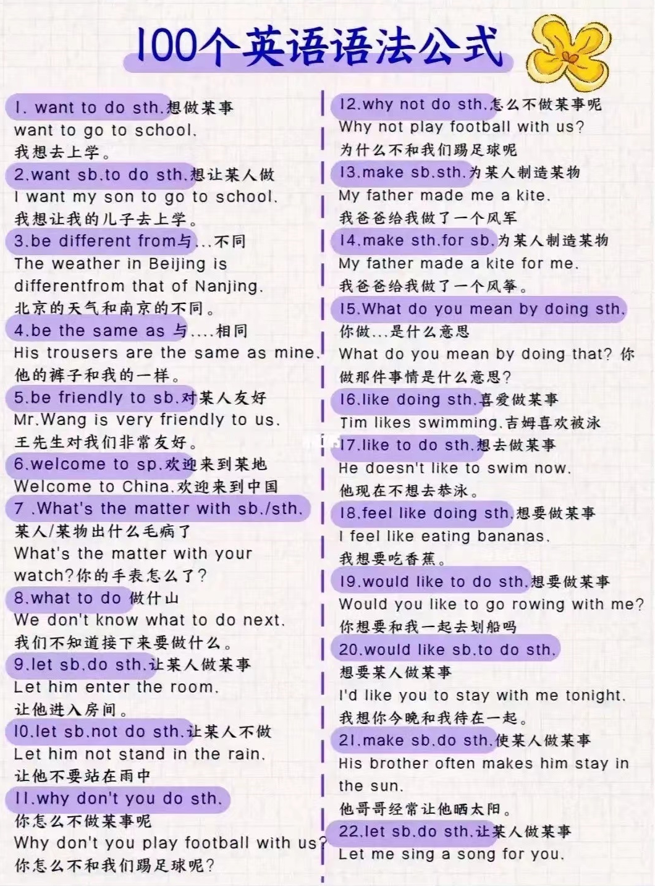
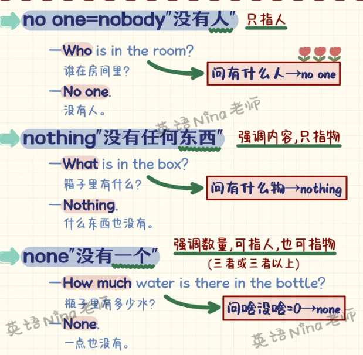

# 表达

## 口语和书面语

- spoken language  口语

- **听你的**

    (It's) up to you.

    Anything you say.

- **检查**

    书面 review    口语 go over

- **联系**

    书面 contackt him    口语 reach out to him

- **安排**

    书面 schedule a meeting    口语 set up a meeting

## Number

- **25,476** twenty five thousand, four hundred seventy six
- **fraction** 分数
    - **1/2** one half
    - **1/4** one quarter
    - **3/4** three quarters
    - **2/5** two fifth
- **percent** 百分比
    - **25%** twenty five percent
- **decimal** 小数
    - **0.3** (zero) point three

- **1997年** nineteen ninety seven

## 100个句型

- 100 important syntax

    

    

    

    

    

## 口语

- heads up    注意（类似于 be careful），提醒，警告（可用于警示牌标题）

    Heads up, boys! A train is coming.

## 疑问词

| 问地点 |   where   | 问怎样 |       how       |
| :----: | :-------: | :----: | :-------------: |
| 问原因 |    why    | 问身高 |    how tall     |
| 问时间 |   when    | 问长度 |    how long     |
| 问哪个 |   which   | 问大小 |     how big     |
|  问谁  |    who    | 问频率 |    how often    |
| 问谁的 |   whose   | 问多久 |    how soon     |
| 问什么 |   what    | 问年龄 |     how old     |
| 问几号 | what date | 问多少 | how many / much |
| 问星期 | what day  | 问价格 |    how much     |
| 问时间 | what time | 问重量 |    how heavy    |

## 数量

- There be 中 no = not any
- There be 疑问句中把 some 变 any
- a lot of / lots of 很多（形容可数名词）
- a little of 一点（形容不可数名词）
- a (little) bit of 一点（形容不可数名词）
    - bits of
- a certain group of 某些
- a couple of 几个；一对
- a pair of 一对

## 减少

decrease  vi. 下降（大小、数量等数字的减小）

reduce  vt. 减少

## 其它

- another
- other

## 没有

- 没有

    

- **nobody = no one**：强调内容，只指人

- **nothing**：强调内容，只指物

- **none**：强调数量，可指人 / 物

    - none of + 复数可数名词，谓语可单可复
    - none of + 不可数名词，谓语必单数

## 时间

### 表示时间

in the Tang Dynasty 在唐朝

in the 21st century 在21世纪

in the 1990s/1990's 在20世纪90年代

in 2025 在2025年

in spring 在春季

in January 在一月

on May 1st 在5月1日

on Monday 在星期一

on Chrildren's Day 在儿童节

on the Spring Festival 在春节

in the morning/afternoon/evening 在早晨/下午/晚上

on the morning of May 1st 在5月1日的早晨

on Monday morning 在星期一的早晨

at daybreak/noon/dusk/night/midnight 在黎明/中午/黄昏/晚上/午夜

### 时间句型

- **when**：当 ... 时候
- **while + that**：在 ... 期间
- **during ...**：在 ... 期间
- **whenever**：每当 ...
- **since**：自从 ...
- **till / untill**：直到 ...
- **before**：在 ... 之前
- **after**：在 ... 之后
- **as**：一边 ... 一边 ...
- **as soon as**：一 ... 就 ...
- **hardly ... when ...**：一 ... 就 ...
- **no sooner ... than ...**：一 ... 就 ...
- **once**：一旦 ... 就 ...

## 条件状语从句

- **if**：如果 ...；是否 ...
- **unless**：除非 ...
- **as / so long as**：只要 ...
- **even though / if**：即使 ...

## 因为

- **强调原因**
- because that ...
- because of ...
- due to ...
- owning to ...

## 根据

- **强调标准，后接规定，报告等正式依据**
- according to ...
- on the basis of ...
- as per ...

## 花费

- It takes sb. some time to do sth.
- sth. costs sb. some money on sth.
- sb. spends some time / money (in) doing sth.
- sb. spends some time / money on sth.
- sb. pays some money for sth.

## 做...

- what do you mean by doing sth.
- enjoy doing sth. 喜欢做
- like doing sth. 喜欢做
- like to do sth. 想做
- feel like doing sth. 想做
- would like to do sth. 想做
- be good at (doing) sth. 擅长做
- begin / start sth. with sth. 伴随...开始做...
- be going to do sth. 打算做
- have to do sth. 必须做
- had better (not) do sth. 最好（不）做
- help sb. do sth.
- help sb. to do sth.
- help sb. with sth.

## 让...做...

- Let sb. (not) do sth.
- make sb. do sth.
- have sb. do sth.
- ask sb. to do sth.
- want sb. to do sth.
- would like sb. to do sth.
- why not do sth. / why don't you do sth.

## 相同

- be different from 与...不同

- be the same as 与...相同

- be similar to 与...相似

## 到达

- reach sp.
- get to sp.
- arrive at / in sp.

## 毛病

- What's the matter with sb. / sth.?
- There's something wrong with sb. / sth.
- Something is wrong with sb. / sth.

## 怎么样

- How do you like sth. 认为...怎么样
- What do you think about / of sth. 认为...怎么样
- How / What about doing sth. 做...怎么样

## 开始结束继续

- start to do sth.
- finish doing sth.
- stop 停止
    - stop to do sth. 停下去做另一件事
    - stop doing sth. 停下正在做的事
- go on 继续
    - go on with sth.
    - go on doing sth. 继续做同一件事
    - go on to do sth. 继续去做另一件事

## 请求帮助

- I'm wondering if I could ask you for a favor.